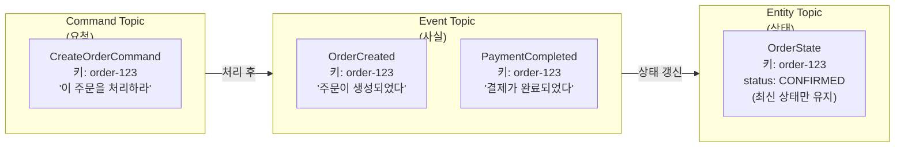

# 토픽 설계가 왜 중요한가?

---

> *토픽은 메시징 시스템의 파일 시스템입니다. 파일 시스템에서 디렉토리 구조를 잘 설계하면 파일을 쉽게 찾고 관리하듯이 메시징 시스템에서도 토픽 구조를 잘 설계하면 흐름을 쉽게 파악하고 운영할 수 있습니다.*

토픽이 “어디로 보낼 것인가?”를 결정한다면, 스키마는 “무엇을 보낼 것인가”를 결정합니다.

**토픽 세분화 수준이 스키마 전략을 결정합니다.**

- 이벤트 타입별로 토픽을 분리하면(orders.order.created, orders.order.cancelled) 각 토픽이 하나의 스키마만 가지므로, 기본 TopicNameStrategy로 충분합니다.
- 반면 도메인 단일 토픽(orders.events)에 여러 이벤트 타입을 넣으면 RecordNameStrategy가 필요하고 스키마 관리가 복잡해집니다.

**스키마 호환성 모드가 토픽 설계에 영향을 준다**

- FULL 호환성 모드에서는 기본값이 있는 필드만 추가/삭제할 수 있으므로, 토픽을 세분화하여 각 스키마가 독립적으로 진화할 수 있게 하는 것이 유리합니다.
- 하나의 거대한 스키마에 모든 이벤트를 우겨넣으면, 한 이벤트의 스키마 변경이 다른 이벤트에 영향을 미칩니다.

## 미들웨어별 “토픽”의 이름

각 미들웨어는 메시지 주소 지정 단위를 다르게 부릅니다.

| **미들웨어**     | **주소 단위**        | **설명**                                                     |
| ---------------- | -------------------- | ------------------------------------------------------------ |
| Kafka / Redpanda | **Topic**            | 파티션된 로그. Producer가 토픽에 쓰고 Consumer가 읽음        |
| RabbitMQ         | **Exchange + Queue** | Producer → Exchange → (Binding/Routing Key) → Queue → Consumer |
| NATS             | **Subject**          | 계층적 점(.) 구분 주소. 와일드카드 구독 지원                 |
| Redis Streams    | **Stream Key**       | Redis 키 이름이 곧 스트림 주소                               |


## 안티패턴

| **안티패턴**                                          | **문제**                                                     | **올바른 접근**                                              |
| ----------------------------------------------------- | ------------------------------------------------------------ | ------------------------------------------------------------ |
| 버전을 토픽 이름에 포함 (`orders.v1`, `orders.v2`)    | 버전 올릴 때마다 모든 Consumer 변경 필요. 토픽이 끝없이 증식 | Schema Registry로 스키마 버전 관리하거나 메시지 헤더에 버전 포함 |
| 애플리케이션 이름 포함 (`payment-app.orders.created`) | 앱 리네이밍 시 토픽도 변경해야 함. 서비스와 토픽 간 강결합   | DDD 도메인 서비스 이름 사용 (예: `pricingengine`, `ordermanagement`) |
| 회사/네임스페이스 접두사 (`acme.orders.created`)      | 단일 조직 환경에서는 불필요한 길이 추가                      | 멀티 테넌트 환경이 아니면 생략                               |
| 너무 세분화 (`orders.order.created.kr.seoul.gangnam`) | 토픽 수 폭발, 관리 불가                                      | 파티션 키나 메시지 헤더로 세분화                             |
| 너무 범용적 (`events`, `messages`, `data`)            | 이름만으로 내용 파악 불가                                    | 도메인+엔티티+이벤트 구조 사용                               |
| Consumer 이름 포함 (`orders-for-payment-service`)     | Consumer 변경 시 토픽 이름도 변경해야 함                     | Producer 관점으로 네이밍 (무엇을 발행하는가)                 |
| 대소문자 혼용 (`OrderCreated`, `orderCreated`)        | 실수로 다른 토픽 생성 가능                                   | 소문자 + 구분자 일관 사용                                    |


## 실무 설계 패턴

### 1. 이벤트 타입별 토픽(Fine-Grained)

스키마 독립 진화가 필요하면 이 패턴을 선택합니다. 토픽 수가 많아지는 것이 단점이지만, 대부분에 적합하다.

```java
orders.order.created
orders.order.updated
orders.order.cancelled
orders.order.shipped
```

### 2. 도메인 단일 토픽(Coarse-Grained)

토픽 수가 적고 도메인 내 순서가 보장되지만, 스키마 관리가 복잡해집니다.

```java
orders.events   (order.created, order.cancelled, order.shipped 모두 포함)
payments.events (payment.completed, refund.initiated 모두 포함)
```

### 3. 명령과 이벤트 분리

CQRS 패턴에서 Command/Event를 의미적으로 구분합니다.

```java
orders.commands.create-order    (명령: "주문을 생성하라")
orders.events.order-created     (이벤트: "주문이 생성되었다")
```

### 4. CDC 전용 토픽

Debezium이 자동 생성하여 데이터 레이크/분석 파이프라인에 자연스럽습니다.

```java
cdc.mysql.ecommerce.orders      (Debezium이 생성)
cdc.mysql.ecommerce.products
cdc.postgres.analytics.sessions
```

# 토픽 유형 심화(Entity, Event, Command)

------

> *토픽 설계에서 가장 먼저 결정해야하는 건 “이 토픽이 어떤 유형인가”입니다. 유형에 따라 cleanup policy ,retention, 메시지 구조, 프로듀서-컨슈머 관계가 근본적으로 달라집니다.*

## 왜 유형 구분이 중요한가?

“주문” 데이터를 토픽에 넣는다고 할 때, 같은 데이터라도 유형에 따라 설계가 완전히 달라집니다.

|                        | **Entity Topic**          | **Event Topic**                | **Command Topic**              |
| ---------------------- | ------------------------- | ------------------------------ | ------------------------------ |
| 토픽명                 | `order.customers.state`   | `orders.order.created`         | `orders.commands.create-order` |
| 메시지 내용            | 고객의 **현재 전체 상태** | "주문이 생성**되었다**"는 사실 | "주문을 생성**하라**"는 요청   |
| 같은 키 메시지 도착 시 | 이전 상태를 **덮어씀**    | 별개의 이벤트로 **공존**       | 별개의 요청으로 **공존**       |
| cleanup.policy         | `compact`                 | `delete`                       | `delete`                       |
| 시제                   | 현재형 (CustomerProfile)  | 과거형 (OrderCreated)          | 명령형 (CreateOrder)           |

더 자세하게 예시를 들어 전자상거래 시스템에서 “고객이 주문을 생성하는” 흐름을 3가지 유형으로 나누면 다음과 같습니다.



- **Command**: 거부될 수 있고, 한 번 처리되면 끝납니다.
- **Event**: 이미 일어난 사실, 되돌릴 수 없음
- **Entity**: 항상 최신 상태만 유지

## Entity Topic

> *엔티티 토픽은 특정 비즈니스 객체의 “현재 상태”를 나타냅니다.*

관계형 DB의 테이블 한 행에 해당하는 정보를 토픽에 발행하여, 메시지 키를 엔티티의 고유 ID로 설정합니다.  Log Compaction이 활성화되어 같은 키의 최신 메시지만 유지시킵니다.

| **속성**       | **값**                                     |
| -------------- | ------------------------------------------ |
| 메시지 키      | 엔티티 고유 ID (customer_id, order_id)     |
| 프로듀서       | 일반적으로 **1개** (소유 서비스)           |
| 컨슈머         | **다수** (데이터가 필요한 모든 서비스)     |
| Cleanup Policy | `compact`                                  |
| 삭제 표현      | null payload (tombstone)                   |
| 보존 정책      | 무기한 (compaction이 오래된 레코드를 정리) |

- compact 방식은 “키별로 최신 메시지만 남긴다”는 의미입니다.
- tombstone은 key=123, value=null을 발행할때 컨슈머가 키 123이 삭제됨을 인지할 수 있게 만드는 정책입니다.

### Flipp의 Entity Topic 5원칙

Flipp(캐나다 리테일 플랫폼)은 수백개의 Entity Topic을 운영하면서 얻은 교훈 5가지를 정리 했습니다.

1. DB 스키마를 토픽에 미러링하지 말것

   ```java
   안티패턴:
     customers 테이블 (30개 컬럼)
       → 그대로 Avro 스키마
       → customer.state 토픽에 발행
       → 결제/배송/마케팅 서비스 모두 30개 필드 스키마에 의존
   
   문제: DB에 internal_credit_score 컬럼 추가
     → 토픽 스키마 변경 → 모든 컨슈머 재배포 필요 (컨슈머가 이 필드를 쓰지도 않는데!)
   
   올바른 접근:
     customers 테이블 (30개 컬럼)
       → 컨슈머에게 필요한 7개 필드만 선별
       → customer.state 토픽 스키마 (id, name, email, tier, status, created_at, updated_at)
       → DB 내부 변경과 토픽이 분리됨
   ```

2. 필드는 최소한: 추가는 쉽지만 삭제는 어렵다.

3. 프로듀서는 원칙적으로 1개: 2개 이상이면 서비스 경계가 잘못된 것

   ```java
   주문 서비스: key=order-123, value={status: "배송중", address: "강남구"}
   재고 서비스: key=order-123, value={status: "준비중", stock: 5}
                             ↓ Compaction 후
   결과: 재고 서비스의 메시지만 남음 → 주문 상태가 "준비중"으로 퇴행!
   ```

4. upsert 패턴: 없으면 insert, 있으면 update로 처리

5. tombstone으로 삭제: payload가 null인 메시지로 삭제 표현

```java
@Bean
public NewTopic customerStateTopic() {
    return TopicBuilder.name("order.customers.state")
        .partitions(12)
        .replicas(3)
        .compact()
        .config(TopicConfig.MIN_CLEANABLE_DIRTY_RATIO_CONFIG, "0.3")
        .config(TopicConfig.MAX_COMPACTION_LAG_MS_CONFIG, "86400000")
        .config(TopicConfig.DELETE_RETENTION_MS_CONFIG, "86400000")  // tombstone 보존 24시간
        .config(TopicConfig.SEGMENT_MS_CONFIG, "3600000")            // 1시간 세그먼트
        .build();
}
```

## Event Topic

> *이벤트 토픽은 “이미 발생한 사실”을 기록합니다. “주문이 생성되었다”, “결제가 완료되었다”와 같은 비즈니스 이벤트를 불변 레코드로 저장합니다.*

Entity Topic과의 핵심 차이를 이해하는 가장 쉬운 방법은 은행 계좌로 비유하는 것입니다.

- Entity Topic = 통장 잔액(현재 50만원)
- Event Topic = 거래 내역(입금 100만원 → 출금 30만원 ..)

| **비교 항목**  | **Entity Topic**       | **Event Topic**               |
| -------------- | ---------------------- | ----------------------------- |
| 표현 대상      | 현재 상태              | 발생한 사실                   |
| 메시지 내용    | 전체 상태 스냅샷       | 이벤트 시점의 정보            |
| 같은 키 메시지 | 이전 상태를 대체       | 별개의 이벤트로 공존          |
| 필드 전략      | 최소한으로 (추가 쉬움) | 최대한으로 (나중에 추가 불가) |
| Compaction     | 적합                   | 부적합                        |
| 보존 정책      | compact                | delete (시간/크기 기반)       |

### 이벤트 유형 3가지

| **유형**                      | **설명**                                                     | **특징**                                   | **적합한 상황**                             |
| ----------------------------- | ------------------------------------------------------------ | ------------------------------------------ | ------------------------------------------- |
| **FCT (Fact-based)**          | 변경된 데이터만 전송 ("무엇이 변했는가")                     | 모든 이벤트가 있어야 현재 상태 재구성 가능 | 이벤트 소싱, 특정 액션 트리거               |
| **CDC (Change Data Capture)** | DB 변경 시 전체 레코드 캡처 ("현재 전체 상태는 이것이다")    | 컨슈머가 단순히 저장하면 됨                | 레거시 시스템 통합, 프로듀서 팀 부담 최소화 |
| **Domain Event**              | 비즈니스 관점의 이벤트 ("비즈니스적으로 무슨 일이 일어났나") | 비즈니스 의미가 명확                       | 마이크로서비스 간 통신, DDD                 |

## Command Topic

> *커맨드는 수행 요청이다. 이벤트가 “이미 일어난 사실”인 반면, 커맨드는 “일어날 수도 있고, 거부될 수도 있는 요청”입니다.*

| **속성**     | **이벤트**            | **커맨드**                     |
| ------------ | --------------------- | ------------------------------ |
| 시제         | 과거형 (OrderCreated) | 명령형 (CreateOrder)           |
| 거부 가능    | 불가 (이미 발생)      | 가능                           |
| 프로듀서 수  | 보통 1개              | 여러 개 가능                   |
| 컨슈머 수    | 여러 개               | 보통 1개                       |
| Kafka 적합성 | 높음 (pub-sub)        | 낮음 (point-to-point에 가까움) |

- 커맨드가 주된 통신 수단이라면, Kafka(pub-sub)보다 point-to-point 브로커가 더 적합할 수 있습니다.
- CQRS 맥락에서는 커맨드 토픽이 유용합니다.

## SAGA 워크플로우에서의 Command/Event 4가지 분류

> Orchestration SAGA에서 메시지는 4가지로 분류됩니다. 각 분류는 “이 리스너가 어떤 종류의 메시지를 처리하는가?” 코드에서 즉시 드러나고, 각 유형에 맞는 토픽을 체계적으로 도출할 수 있습니다.

| **타입**               | **정의**                      | **방향**               | **네이밍**                           | **토픽 설계 시 의미**                   |
| ---------------------- | ----------------------------- | ---------------------- | ------------------------------------ | --------------------------------------- |
| **Command**            | 상태 전이를 유발하는 **의도** | Orchestrator → Service | 명령형 (`Reserve~`, `Process~`)      | 워커별 command 토픽 분리                |
| **Success Event**      | 상태 전이 **완료 사실**       | Service → Orchestrator | 과거분사 (`~Reserved`, `~Completed`) | 워커별 reply 토픽에 포함                |
| **Failure Event**      | 상태 전이 **실패 사실**       | Service → Orchestrator | `~Failed` 접미사                     | reply 토픽에 포함 (Success와 동일 토픽) |
| **Compensation Event** | **보상 완료** 사실            | Service → Orchestrator | 과거분사 (`~Released`, `~Refunded`)  | 별도 compensate-reply 토픽              |

# 토픽 생성과 관리

------

> *Kafka/Redpanda에서 토픽을 생성하는 방법은 총 크게 2가지입니다*

| **방식**                                  | **동작 시점**         | **파티션/설정 제어** | **적합한 환경**    |
| ----------------------------------------- | --------------------- | -------------------- | ------------------ |
| Broker-side (`auto.create.topics.enable`) | 첫 produce/consume 시 | 브로커 기본값 사용   | 개발, 프로토타이핑 |
| Spring KafkaAdmin (`NewTopic` 빈)         | 앱 기동 시            | 코드로 명시적 제어   | **프로덕션 권장**  |

## Broker-side(자동 생성)

`auto.create.topics.enable=true`은 Producer가 존재하지 않는 토픽에 메시지를 보내거나, Consumer가 존재하지 않는 토픽을 구독할 때 브로커가 자동으로 생성합니다.

- Redpanda는 자동으로 활성화되어 있는 설정

- 편리하지만, 파티션 수/복제 개수가 브로커 기본값으로 설정되므로 주의

  

## Spring KafkaAdmin(NewTopic)

```java
앱 기동 → KafkaAutoConfiguration이 KafkaAdmin 빈 자동 등록
→ KafkaAdmin이 ApplicationContext에서 NewTopic 빈 탐색
→ 브로커에 토픽 존재 여부 확인
→ 없으면 생성, 있으면 무시 (기존 설정 변경 안 함)
@Configuration
public class KafkaTopicConfig {

    @Bean
    public NewTopic ordersTopic() {
        return TopicBuilder.name("chapter2.orders")
                .partitions(3)
                .replicas(1)
                .build();
    }

    // retention, cleanup.policy 등 토픽 설정도 가능
    @Bean
    public NewTopic auditTopic() {
        return TopicBuilder.name("audit-events")
                .partitions(6)
                .replicas(3)
                .config(TopicConfig.RETENTION_MS_CONFIG, "604800000")  // 7일
                .config(TopicConfig.CLEANUP_POLICY_CONFIG, "compact")
                .build();
    }
}
```

애플리케이션이 가동될 때 KafkaAdmin이 ApplicationContext에서 NewTopic 타입의 빈을 모두 찾아서 브로커에 없는 토픽을 생성합니다.

## 주의사항

- 이미 존재하는 토픽의 설정은 변경되지 않습니다.
- @RetryableTopic은 재시도/DLT 토픽을 자동으로 생성합니다. KafkaAdmin이 내부적으로 NewTopic 빈을 등록하므로 개발자가 직접 선언하지 않아도됩니다.
