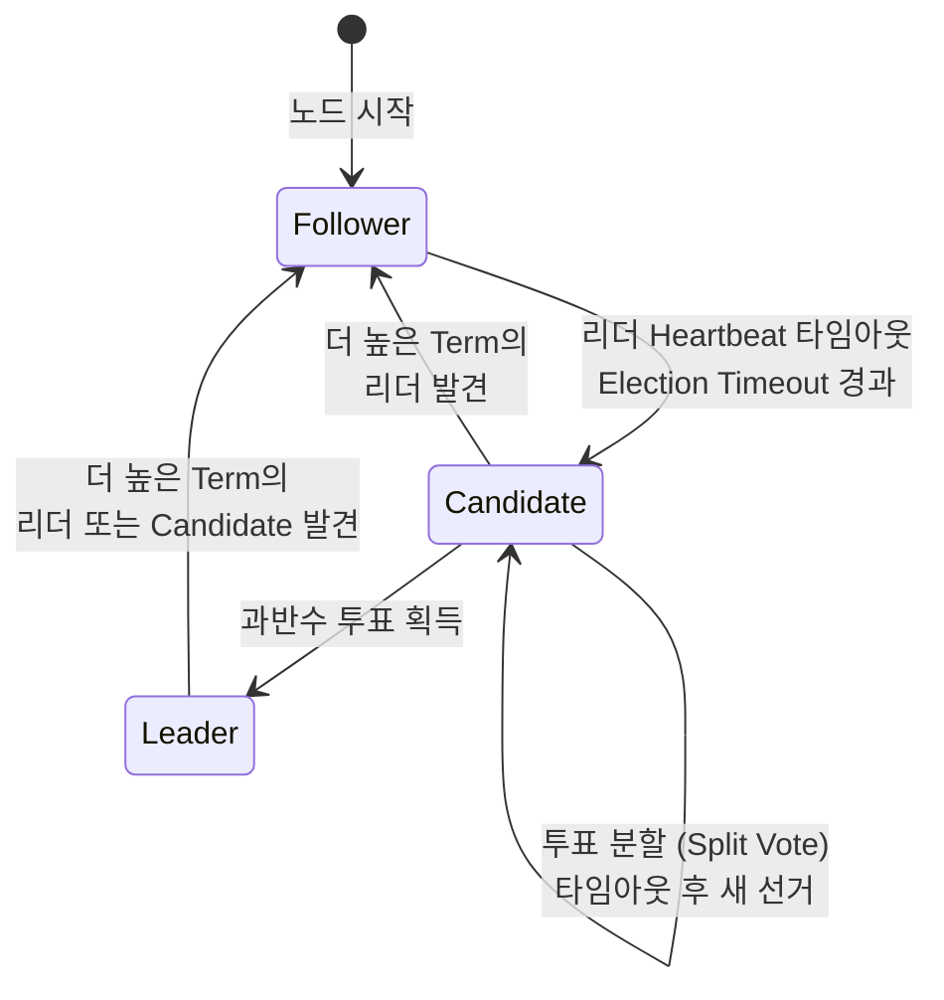
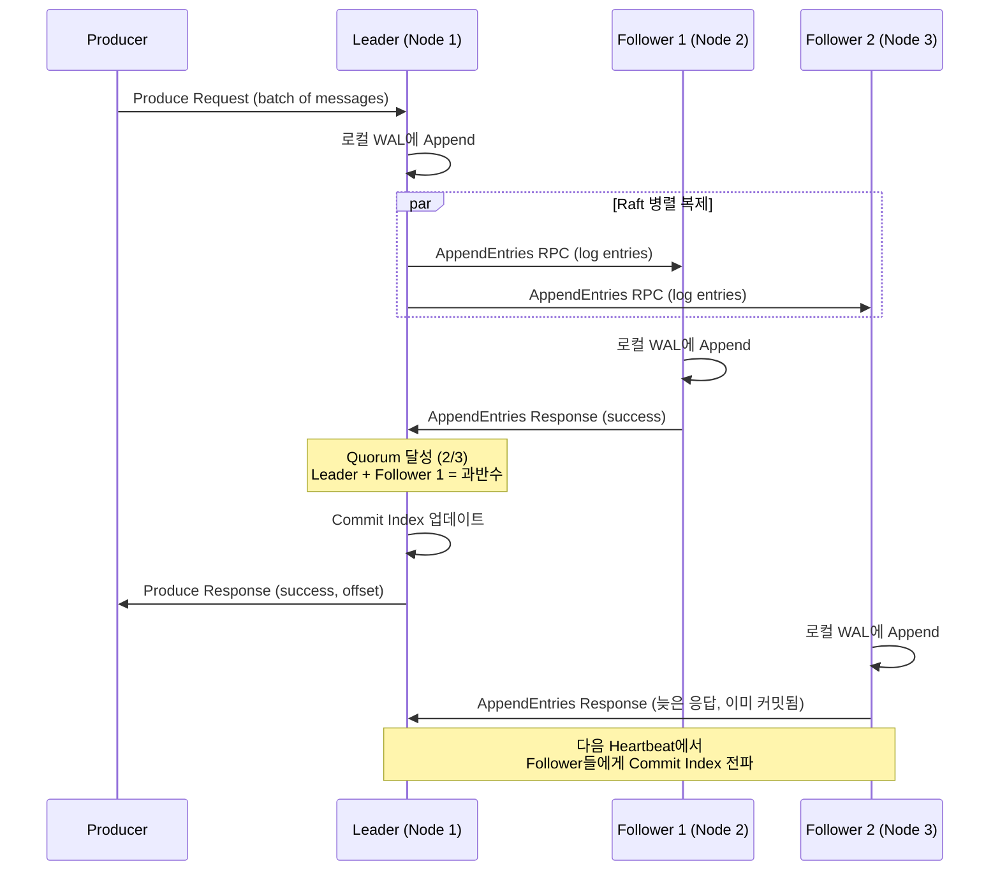
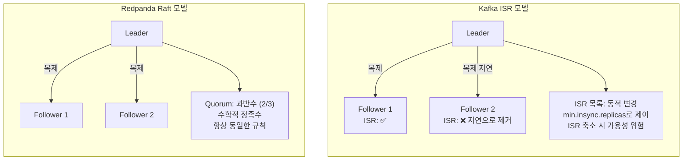

# Raft 합의 프로토콜

---

> 분산 시스템에서 가장 어려운 문제는 **여러 노드가 같은 데이터에 대해 합의(Consensus)하는 것**입니다. 
>
> - 네트워크가 끊기거나, 노드가 죽거나, 메시지가 순서가 바뀌어 도착할 수 있는 환경에서, 모든 노드가 "같은 순서의 같은 데이터"를 가지고 있다는 보장이 필요합니다. 
> - Redpanda는 이를 위해 **Raft 합의 프로토콜**을 사용합니다.

Kafka가 자체적으로 설계한 ISR(In-Sync Replicas) 메커니즘을 사용하는 반면, Redpanda는 학계에서 형식적으로 증명된(Formally Proven) 표준 알고리즘인 Raft를 채택했습니다. 

- 왜 검증된 표준을 선택했을까요? 분산 합의 알고리즘의 Edge Case는 인간의 직관으로 파악하기 어렵기 때문입니다. 
- Raft는 수학적 증명이 있어 "이 조건에서는 반드시 이렇게 동작한다"는 보장이 있습니다.

## 1. Raft의 3가지 역할

Raft에서 모든 노드는 항상 다음 세 가지 상태 중 하나에 있습니다:

- **Leader**: 모든 쓰기 요청을 처리하고, 데이터를 Follower에 복제합니다. 각 Raft 그룹에는 항상 최대 하나의 Leader만 존재합니다. Leader는 주기적으로 Heartbeat를 보내 자신이 살아있음을 알립니다.

- **Follower**: Leader로부터 복제된 데이터를 수신하고 저장합니다. 클라이언트의 읽기 요청을 처리할 수 있지만, 쓰기는 Leader로 리다이렉트합니다. Leader의 Heartbeat가 일정 시간(Election Timeout) 동안 오지 않으면 Candidate로 전환합니다.

- **Candidate**: Leader 선출 과정에 참여하는 임시 상태입니다. 다른 노드에 투표를 요청하고, 과반수를 얻으면 Leader가 됩니다. 투표에 실패하면 다시 Follower로 돌아갑니다.

## 2. Leader Election 과정

>  Leader Election은 Raft의 안전성을 보장하는 핵심 메커니즘입니다. 구체적인 과정을 이해하면 장애 시나리오를 예측할 수 있습니다.

정상 운영 중에는 Leader가 **Heartbeat Interval(기본 150ms)** 간격으로 모든 Follower에 빈 AppendEntries RPC를 보냅니다. 이것은 "나는 아직 살아있다"는 신호입니다. Follower는 Heartbeat를 받을 때마다 자신의 Election Timeout 타이머를 초기화합니다.

Leader가 장애를 겪으면(프로세스 크래시, 네트워크 단절 등) Heartbeat가 중단됩니다. 

- 각 Follower는 **Election Timeout(150ms ~ 300ms 사이의 랜덤 값)**이 경과하면 Leader가 죽었다고 판단합니다. 
- 타임아웃이 랜덤인 이유는 모든 Follower가 동시에 선거를 시작하는 것을 방지하기 위함입니다. 
- 가장 먼저 타임아웃된 Follower가 Candidate가 되어 선거를 시작합니다.

Candidate는 다음 단계를 수행합니다:

1. **Term(임기) 번호를 1 증가**시킵니다. Term은 논리적 시계로, 더 높은 Term을 가진 노드가 항상 우선합니다.
2. **자기 자신에게 투표**합니다.
3. **모든 다른 노드에 RequestVote RPC를 전송**합니다. 이 요청에는 자신의 Term, 마지막 로그의 인덱스와 Term이 포함됩니다.
4. **투표 결과를 기다립니다**.

투표를 받는 노드는 다음 규칙으로 결정합니다:

- 해당 Term에서 아직 투표하지 않았어야 합니다 (각 Term에서 하나의 Candidate에만 투표 가능).
- Candidate의 로그가 자신의 로그보다 **최소한 같거나 최신(at least as up-to-date)**이어야 합니다.

**과반수(Majority)**의 투표를 얻으면 Leader가 됩니다. 3노드 클러스터에서는 2표(자신 포함), 5노드 클러스터에서는 3표가 필요합니다. 과반수 요건은 **동시에 두 개의 Leader가 선출되는 것을 수학적으로 불가능하게** 만듭니다. 과반수 집합 두 개는 반드시 겹치기 때문입니다.

### Write Path 상세

메시지가 Producer에서 출발하여 "커밋"되기까지의 전체 경로를 이해하면, 지연시간의 구성 요소와 장애 시 동작을 파악할 수 있습니다.

상세 단계:

1. **Producer가 파티션의 Leader에 Produce Request를 전송**합니다. Kafka API의 `acks=all` 설정 시 Leader는 Quorum이 달성될 때까지 응답을 보류합니다.

2. **Leader는 메시지를 자신의 로컬 WAL(Write-Ahead Log)에 먼저 Append**합니다. 이 시점에서 메시지는 아직 "커밋"되지 않은 상태입니다.

3. **Leader는 모든 Follower에 병렬로 AppendEntries RPC를 전송**합니다. 이 RPC에는 새로운 로그 엔트리와 Leader의 현재 Commit Index가 포함됩니다.

4. **각 Follower는 수신한 엔트리를 자신의 WAL에 Append하고, 성공 응답을 보냅니다.** 이때 Follower는 데이터 무결성 검증(Term 번호, 이전 엔트리 일치 등)을 수행합니다.

5. **Leader는 과반수(Quorum)의 노드가 성공 응답을 보내면 해당 엔트리를 "커밋"합니다.** RF(Replication Factor)=3에서는 자신 포함 2/3, RF=5에서는 3/5가 필요합니다. 가장 빠른 Follower의 응답만 있으면 되므로, **느린 Follower 하나가 전체 지연시간에 영향을 미치지 않습니다.**

6. **Leader가 Producer에 성공 응답(offset 포함)을 보냅니다.** 이 시점에서 메시지는 최소 과반수 노드에 복제된 상태이므로, 어떤 노드가 죽어도 데이터가 유실되지 않습니다.

## 3. ISR vs Raft 서술형 비교

> Kafka와 Redpanda의 복제 메커니즘 차이는 단순히 구현의 차이가 아니라, **철학적 접근의 차이**입니다.

**Kafka의 ISR(In-Sync Replicas) 모델**에서 Leader는 ISR이라는 동적 목록을 관리합니다. Follower가 Leader를 따라잡지 못하면(지연이 `replica.lag.time.max.ms`를 초과하면) ISR에서 제거됩니다. 이 설계의 의도는 "현재 동기화된 복제본만 고려하여 쓰기를 빠르게 처리"하는 것입니다.

문제는 ISR이 동적이라는 데서 발생합니다. RF=3, `min.insync.replicas=2`로 설정했다고 가정합니다. ISR이 [Leader, Follower1, Follower2]일 때는 정상 동작합니다. 그런데 Follower2가 GC Pause로 일시적으로 느려져 ISR에서 빠지면 ISR=[Leader, Follower1]이 됩니다. 이 상태에서 Follower1마저 장애가 발생하면 ISR=[Leader]가 되고, `min.insync.replicas=2`를 만족시키지 못하므로 **모든 쓰기가 중단**됩니다. Leader는 멀쩡히 살아있는데도 쓰기가 불가능한 상황이 발생하는 것입니다.

**Redpanda의 Raft 모델**은 수학적 Quorum(과반수)에 기반합니다. RF=3이면 항상 2/3의 동의가 필요합니다. ISR처럼 "누가 동기화되어 있는지"를 동적으로 관리하지 않습니다. 노드가 응답하면 카운트하고, 과반수가 응답하면 커밋합니다. RF=3에서 1개 노드가 죽어도, 나머지 2개가 살아있으면 정상 동작합니다. 2개 노드가 죽으면 과반수를 만족시킬 수 없으므로 쓰기가 중단됩니다. 이 동작은 **항상 동일하고 예측 가능합니다.**

Raft가 ISR보다 나은 이유를 정리하면:

1. **결정론적(Deterministic) 동작**: 같은 조건에서 항상 같은 결과. ISR 크기 변화에 따른 Edge Case가 없습니다.
2. **형식적 증명(Formal Proof)**: Raft는 TLA+ 등으로 수학적 안전성이 증명되어 있습니다. Kafka의 ISR은 실무적 검증에 의존합니다.
3. **표준화된 Leader Election**: Raft의 선출 알고리즘은 표준이며, 모든 구현이 동일한 보장을 제공합니다.
4. **단순한 운영**: ISR 크기 모니터링, `min.insync.replicas` 튜닝 등의 운영 부담이 없습니다.

### Raft Group 구조

Redpanda에서 **각 파티션은 독립적인 Raft 그룹**을 형성합니다. 토픽 `orders`가 3개 파티션, RF=3으로 생성되면, 총 3개의 독립적인 Raft 그룹이 만들어집니다. 각 그룹은 자체적으로 Leader를 선출하고, 자체적으로 로그를 복제합니다.

이 설계의 장점은 **장애 격리(Fault Isolation)**입니다. Partition 0의 Leader 선출이 진행 중이더라도, Partition 1과 Partition 2는 정상적으로 읽기/쓰기를 처리합니다. 또한 **부하 분산(Load Balancing)**에도 유리합니다. Partition 0의 Leader가 Node 1, Partition 1의 Leader가 Node 2, Partition 2의 Leader가 Node 3에 있으면, 쓰기 부하가 세 노드에 고르게 분산됩니다.

클러스터 전체를 관리하는 **Controller Raft Group**도 존재합니다. 이 그룹은 다음과 같은 클러스터 메타데이터를 관리합니다:

| 관리 대상          | 설명                                    |
| ------------------ | --------------------------------------- |
| **토픽 구성**      | 파티션 수, 복제 계수, retention 설정 등 |
| **파티션 할당**    | 어떤 파티션이 어떤 노드에 있는지        |
| **ACL**            | 접근 제어 목록                          |
| **Consumer Group** | Group 오프셋, 멤버 정보                 |
| **Feature Flags**  | 클러스터 기능 활성화 상태               |

Controller Raft Group의 Leader가 곧 클러스터의 Controller입니다. 이 노드가 장애를 겪으면, Raft 선출에 의해 새 Controller가 자동으로 선출됩니다.

