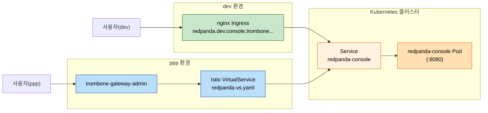
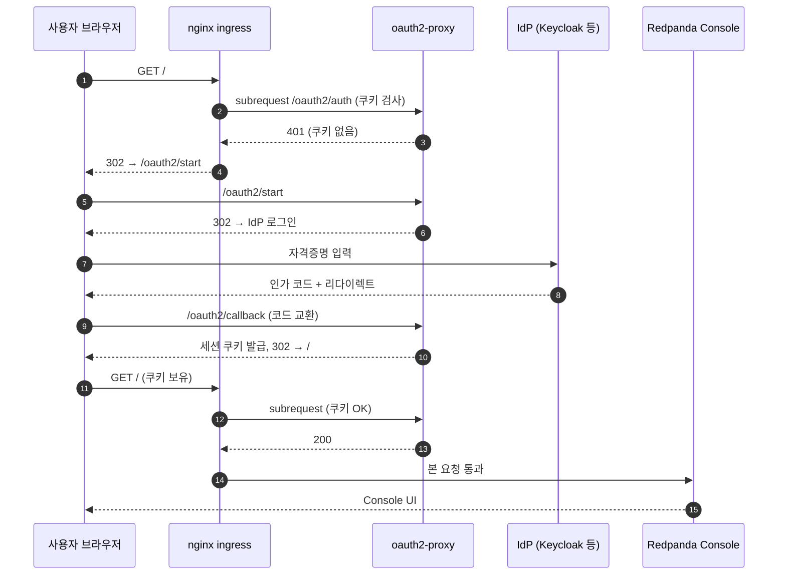
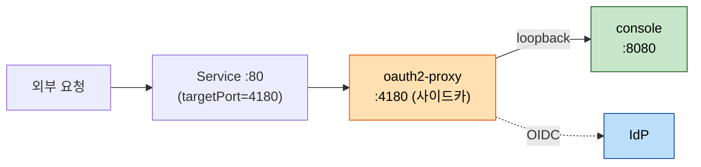
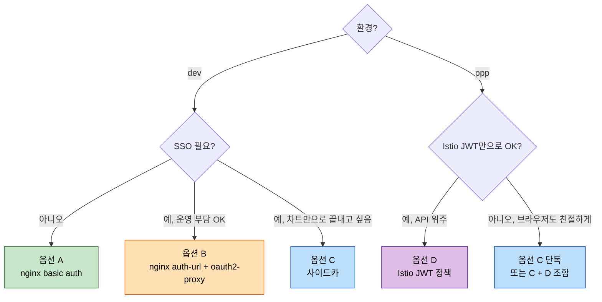

# Redpanda Console 인증 — 라이선스 없이 로그인을 붙이는 길

> 사내 dev/ppp 환경에 띄운 Redpanda Console v3.5.1이 **무인증 상태로 노출**되어 있다. URL만 알면 누구나 토픽·메시지·Schema Registry를 들여다보고, Produce·Delete까지 가능하다. Enterprise 라이선스를 살 계획이 없는 상태에서 어떻게 막을지 정리한다.

## 1. 왜 이 글을 쓰는가

배포 차트(`/Users/simbohyeon/okestro/tps_manifest/helm-charts/redpanda`)를 살펴보면 Console에 들어가는 인증 관련 값이 사실상 비어 있다. `secret.authentication.jwtSigningKey`, `secret.authentication.oidc.clientSecret`, `secret.license` 같은 슬롯은 차트 안에 이미 마련돼 있지만, 우리가 쓰는 `values-dev.yaml`/`values-ppp.yaml`에서는 이 키들을 채우지 않는다. 그 결과 Console은 "익명도 다 보여주는" 모드로 떠 있다.

문제는 단순한 가시성이 아니라 **운영 위험**이다. Console UI에서 토픽을 새로 만들거나 메시지를 발행·삭제할 수 있고, 만약 dev 클러스터가 외부 망과 닿아 있다면 누구든 메시지를 흘릴 수 있다. dev 환경(nginx ingress)은 `redpanda.dev.console.trombone.okestro.cloud`로, ppp 환경(Istio)은 `redpanda.dev.trombone-v2.okestro.cloud`로 각각 노출된다.

Enterprise를 사면 끝나는 문제지만, 라이선스 없이도 **운영 환경에서 누군가가 로그인하지 않으면 Console에 못 들어가게** 만들 수는 있다. 다만 Console 내부 권한 분리(특정 사용자는 토픽 읽기만, 다른 사용자는 관리자)는 라이선스가 없으면 어차피 불가능하므로, 우리가 노릴 수 있는 건 "전부 차단 vs 인증된 사람 모두 통과"라는 이진 게이트다. 이 글은 그 게이트를 어떤 방식으로 세울지 비교한다.

## 2. 지금 차트 구조 한눈에

대상 파일과 키가 어디에 있는지 머릿속에 그림을 그려두면 이후 옵션 비교가 쉽다.



핵심 키는 세 군데에 흩어져 있다.

- `charts/console/values.yaml:230` — `secret.authentication.jwtSigningKey`, `secret.authentication.oidc.clientSecret`, `secret.license` 슬롯이 이미 정의돼 있다. Helm 차트가 미리 만들어둔 자리다.
- `values-dev.yaml:43-52` / `values-ppp.yaml:29-38` — `console.config`에는 Kafka 브로커 주소만 들어 있고 `authentication`/`login`/`enterprise` 키는 통째로 비어 있다. Console은 그래서 인증 로직 자체를 켜지 않은 채 부팅된다.
- `auth.sasl.enabled: false` — Kafka 브로커도 평문이다. UI 인증을 붙여도 9093 포트로 직접 붙으면 그대로 통과한다는 뜻이다. 이 사실은 9장에서 다시 다룬다.

## 3. Enterprise 네이티브 로그인을 못 쓰는 이유

차트 안에 `charts/console/examples/console-enterprise.yaml`이 친절하게 들어 있어 한번 헷갈린다. `console.config.login.google`을 켜고 `secret.enterprise.license`만 넣으면 Console UI에서 Google 로그인이 뜨는 그림이다. 그러나 license 키가 없으면 Console 바이너리가 시작 단계에서 라이선스 검증에 실패하고, **로그인 화면을 그리는 코드 경로 자체에 못 들어간다**. 즉 차트가 슬롯을 만들어 두었다고 해서 무료 사용자가 로그인을 켤 수 있는 게 아니다.

라이선스를 사면 OIDC(Google, Okta, Keycloak, GitHub, Azure AD)나 사내 LDAP 연동, 그리고 RBAC role-binding(특정 그룹은 Viewer, 다른 그룹은 Admin)까지 한 번에 켜진다. 우리가 포기하는 건 두 가지다. 첫째, **Console UI 자체에 박힌 로그인 화면**. 둘째, **사용자별 권한 분리**. 첫 번째는 이 글의 4~7장 옵션으로 어떻게든 보완할 수 있고, 두 번째는 보완할 방법이 없다는 점만 분명히 짚어 둔다.

## 4. 옵션 A — nginx ingress basic auth (dev 전용, 가장 빠른 길)

### 어떻게 동작하나

nginx ingress controller에는 `auth-basic` 어노테이션이 있다. ingress 앞에 붙이면 nginx가 HTTP Basic 인증 헤더를 검사해 통과한 요청만 뒤로 보낸다. 인증 정보는 htpasswd 형식으로 만들어서 Kubernetes Secret에 담아 두면 된다. **Console은 변하지 않는다**. 아무것도 모르는 채 8080에 들어오는 요청만 처리할 뿐이다.

### 적용 방법 (개념 예시)

```bash
# 1) htpasswd Secret 생성 (Apache htpasswd 도구 필요)
htpasswd -c auth admin
kubectl create secret generic redpanda-console-basic-auth \
  --from-file=auth -n trb-oss
```

```yaml
# 2) values-dev.yaml의 console.ingress.annotations에 추가
console:
  ingress:
    enabled: true
    className: nginx
    annotations:
      nginx.ingress.kubernetes.io/auth-type: basic
      nginx.ingress.kubernetes.io/auth-secret: redpanda-console-basic-auth
      nginx.ingress.kubernetes.io/auth-realm: "Redpanda Console"
```

### 장단점

**장점은 단순함이다.** htpasswd 한 줄과 어노테이션 세 줄이면 끝난다. Console 차트에 손대지 않고, 이미지 교체도 없다. dev처럼 "팀 외부엔 노출하지 말자" 수준의 가벼운 게이트엔 충분하다.

**단점은 SSO가 안 된다는 점**이다. 비밀번호를 사람마다 따로 발급하기도 어렵고, 회전(rotate)도 수동이다. 또한 nginx Basic 인증은 브라우저가 해당 origin의 자격증명을 캐시하기 때문에 로그아웃이 사실상 "브라우저 종료"에 가깝다. 그리고 **이 옵션은 ppp 환경에 못 쓴다.** ppp는 nginx ingress가 비활성이고 Istio가 라우팅을 담당하기 때문이다.

### 적합 상황

dev 환경에서 사내 IP대역 외 접근을 차단할 임시 방패가 필요할 때, 또는 한두 명만 들어가면 되는 검증 단계에서 가장 합리적이다.

## 5. 옵션 B — nginx auth-url + oauth2-proxy 별도 배포 (dev SSO)

### 어떻게 동작하나

nginx ingress에는 `auth-url`이라는 어노테이션도 있다. nginx가 요청을 받으면 먼저 지정된 URL(예: `oauth2-proxy`의 `/oauth2/auth`)에 부속 요청을 보내고, 그 응답이 200이면 본 요청을 통과시키는 구조다. oauth2-proxy는 별도 Deployment로 띄워서 Google/Keycloak/Okta 같은 OIDC 공급자와 OAuth 핸드셰이크를 처리한다. 사용자는 처음 들어올 때 IdP 로그인 화면으로 자동 리다이렉트되고, 한 번 통과하면 쿠키가 발급돼 다음부터는 자동 통과한다.

### 흐름



### 적용 시 핵심

oauth2-proxy 자체는 별도 차트(`oauth2-proxy/oauth2-proxy`)로 배포하거나 사내에서 흔히 쓰는 manifest 패턴으로 띄운다. 그리고 ingress 어노테이션에 `nginx.ingress.kubernetes.io/auth-url`, `auth-signin`을 추가한다. IdP에는 미리 client id/secret과 리다이렉트 URI(`https://redpanda.dev.console.../oauth2/callback`)를 등록해야 한다. 그룹 화이트리스트는 oauth2-proxy 설정의 `--allowed-group`이나 `--email-domain`으로 제어한다.

### 장단점

**장점은 사내 SSO와 그룹 단위 제한**이다. Keycloak에 "redpanda-admin" 그룹을 만들어 두고 그 그룹원만 통과시키면, 인사 이동이 있을 때 IdP에서만 그룹 멤버십을 정리하면 된다. 사용자별 비밀번호 관리가 사라진다.

**단점은 운영 복잡도**다. oauth2-proxy를 별도 워크로드로 띄우고, IdP에 등록하고, 쿠키 도메인·secret·세션 만료를 정리해야 한다. dev 환경에 처음 도입하기엔 다소 무겁다. 그리고 이 방식 역시 nginx ingress가 전제라 **ppp 환경에는 그대로 못 옮긴다.**

## 6. 옵션 C — oauth2-proxy를 Console 사이드카로 동봉 (환경 무관)

### 어떻게 동작하나

옵션 B의 oauth2-proxy를 별도 Deployment 대신 **Console과 같은 Pod 안에 사이드카로** 넣는다. Console 차트는 `console.extraContainers`라는 슬롯을 제공해서 추가 컨테이너를 동봉할 수 있다. Service의 targetPort를 oauth2-proxy가 듣는 포트(예: 4180)로 바꾸면, 외부 트래픽이 oauth2-proxy → Console(:8080) 순으로 흐른다. ingress/Istio가 무엇이든 상관 없이 Pod 진입점에서 인증이 끝난다.

### 구조



### 적용 핵심

```yaml
# values-dev.yaml 또는 values-ppp.yaml의 console: 아래
console:
  service:
    targetPort: 4180   # 트래픽이 oauth2-proxy로 들어오게
  extraContainers:
    - name: oauth2-proxy
      image: quay.io/oauth2-proxy/oauth2-proxy:v7.6.0
      args:
        - --provider=oidc
        - --oidc-issuer-url=https://keycloak.example/realms/trb
        - --client-id=redpanda-console
        - --client-secret=$(OAUTH2_PROXY_CLIENT_SECRET)
        - --redirect-url=https://redpanda.dev.../oauth2/callback
        - --upstream=http://127.0.0.1:8080  # Console 본체로 프록시
        - --http-address=0.0.0.0:4180
        - --cookie-secret=$(OAUTH2_PROXY_COOKIE_SECRET)
        - --email-domain=okestro.com
      env:
        - name: OAUTH2_PROXY_CLIENT_SECRET
          valueFrom: { secretKeyRef: { name: oauth2-proxy, key: clientSecret } }
        - name: OAUTH2_PROXY_COOKIE_SECRET
          valueFrom: { secretKeyRef: { name: oauth2-proxy, key: cookieSecret } }
```

### 장단점

**장점은 환경 비종속성**이다. nginx든 Istio든 트래픽을 oauth2-proxy 포트로 보내기만 하면 되니, dev/ppp 양쪽에 같은 패턴을 적용할 수 있다. 또한 oauth2-proxy와 Console이 같은 네트워크 네임스페이스에 있어 Console로 가는 내부 통신이 외부에 새지 않는다.

**단점은 Pod 단위 결합**이다. Console을 재시작하면 oauth2-proxy도 같이 죽고, oauth2-proxy 설정 변경에 Console이 영향받는다. 그리고 한 Pod 안에서 트래픽 전달과 인증을 동시에 처리하므로, 메시지 스트림처럼 장기 연결이 많은 화면에서는 oauth2-proxy의 timeout 설정을 Console 기본값(2시간 이상)에 맞춰 조정해야 한다.

### 적합 상황

ppp 환경에서 SSO를 붙이되 Istio AuthorizationPolicy를 만지기 어려운 상황, 또는 dev/ppp를 같은 패턴으로 유지하고 싶을 때 이 옵션이 가장 깔끔하다.

## 7. 옵션 D — Istio AuthorizationPolicy + RequestAuthentication (ppp 전용)

### 어떻게 동작하나

ppp 환경의 라우팅은 `tps-helm-ppp/istio-admin-routing-chart/templates/redpanda-vs.yaml`에 정의된 VirtualService가 담당한다. Istio는 `RequestAuthentication`이라는 리소스로 들어오는 요청의 JWT를 검증하고, `AuthorizationPolicy`로 어떤 클레임을 가진 요청만 통과시킬지 결정할 수 있다. **이 검증은 Pod 안에서 sidecar Envoy가 한다.** 그래서 oauth2-proxy 같은 별도 컨테이너가 필요 없다.

다만 IdP가 발급한 JWT가 클라이언트에 이미 있어야 한다. 사용자가 브라우저로 Console URL을 직접 칠 때 IdP 로그인 화면으로 보내주는 "친절한" 흐름은 Istio 단독으로는 부족하다. 보통 외부 게이트웨이 앞단에 oauth2-proxy를 두거나, IdP의 토큰을 Authorization 헤더로 받는 API용 패턴에 더 잘 맞는다.

### 적용 핵심

```yaml
apiVersion: security.istio.io/v1
kind: RequestAuthentication
metadata:
  name: redpanda-console-jwt
  namespace: trb-oss
spec:
  selector:
    matchLabels:
      app.kubernetes.io/name: console
  jwtRules:
    - issuer: "https://keycloak.example/realms/trb"
      jwksUri: "https://keycloak.example/realms/trb/protocol/openid-connect/certs"
      audiences: ["redpanda-console"]
---
apiVersion: security.istio.io/v1
kind: AuthorizationPolicy
metadata:
  name: redpanda-console-deny-anonymous
  namespace: trb-oss
spec:
  selector:
    matchLabels:
      app.kubernetes.io/name: console
  action: DENY
  rules:
    - from:
        - source:
            notRequestPrincipals: ["*"]
```

### 장단점

**장점은 사이드카(envoy) 안에서 끝난다는 점**이다. 추가 워크로드 없이 메시 차원에서 보호가 걸리고, JWT의 클레임을 활용한 세밀한 정책(예: `groups: redpanda-admin` 클레임이 있을 때만 허용)을 만들기 좋다.

**단점은 브라우저-우호 흐름이 빠져 있다**는 점이다. 사용자가 URL을 그냥 쳤을 때 어떻게 토큰을 받게 할지를 별도 설계해야 하고, 보통은 옵션 C(또는 외부 oauth2-proxy)와 결합해 쓴다. 즉 D 단독으로는 운영 콘솔 같은 사람-중심 서비스엔 살짝 부족하다. 다만 ppp에서 이미 Istio를 쓰고 있다면 **옵션 C에 D를 얹어 "쿠키 통과한 요청도 envoy에서 한 번 더 검증"하는 다중 게이트**로 활용할 가치가 있다.

## 8. 선택 가이드

옵션 비교를 의사결정 트리 한 장과 표로 정리한다.



| 상황 | 추천 | 이유 |
|------|------|------|
| dev에 빨리 게이트만 세우고 싶다 | A | htpasswd Secret + 어노테이션 3줄. 가장 적은 변경. |
| dev에 사내 SSO를 붙이고 싶다 | B 또는 C | IdP 통합이 필요하면 둘 다 가능. 운영 단순함을 원하면 C, 분리된 책임을 원하면 B. |
| ppp(브라우저 사용자) | C | Istio든 nginx든 무관하게 동일 패턴. 차트 변경만으로 완결. |
| ppp(API 자동화 + JWT) | D | 클라이언트가 토큰을 직접 가져오는 시나리오에 적합. |
| dev/ppp 통합 운영 | C | 같은 차트 패턴을 양쪽에 그대로 쓸 수 있어 운영 표준화에 유리. |

## 9. 공통 한계와 함정

여기서 정리한 어떤 옵션도 해결하지 못하는 영역이 있다. 이 한계를 모르고 도입하면 보안 인식이 어긋난다.

**Console 내부 RBAC은 작동하지 않는다.** 인증이 통과한 사람은 모두 Console 안에서 동일한 admin 권한을 가진다. "토픽 읽기만 허용" 같은 분리는 Enterprise 라이선스의 role-bindings 기능이고, 무료에서는 만들 수 없다. 그래서 옵션 B/C/D에서 그룹 화이트리스트로 막을 수 있는 건 "들어올 수 있느냐"까지지, "들어와서 무엇을 할 수 있느냐"가 아니다.

**Kafka 브로커 자체는 별도 보호가 필요하다.** 우리 차트는 `auth.sasl.enabled: false`로 떠 있다. Console UI에 게이트를 세워도 9092/9093 포트로 직접 SASL/PLAINTEXT 클라이언트가 붙으면 그대로 통과한다. UI 인증과 클러스터 인증은 다른 층의 문제이고, 진짜 보안은 `auth.sasl.enabled: true` + `tls.enabled: true`가 함께 켜졌을 때 시작된다.

**메시지 스트림과 웹소켓 호환성을 점검해야 한다.** Console은 Topic 메시지 라이브 뷰처럼 장시간 연결을 유지하는 화면이 있다. nginx Basic이나 oauth2-proxy의 기본 timeout이 짧으면 화면이 자주 끊긴다. 옵션 B/C 도입 시 `proxy-read-timeout`, `proxy-send-timeout`(nginx), `--upstream-timeout`, `--cookie-expire`(oauth2-proxy)를 충분히 늘려 두는 편이 안전하다.

**비밀번호·시크릿 회전 절차를 함께 정의해야 한다.** 옵션 A의 htpasswd, 옵션 B/C의 client secret/cookie secret 모두 평문 자체가 Secret 리소스에 저장된다. 회전 주기를 정하지 않으면 시크릿이 영구히 살아 있는 위험이 그대로 남는다.

## 10. 다음 단계 후보

당장 무엇부터 할지 우선순위를 정리하면 다음 순서가 합리적이다.

먼저 **dev 환경에 옵션 A**를 적용한다. 가장 적은 변경으로 외부 익명 노출을 즉시 차단할 수 있고, 회수도 어노테이션 제거로 끝나기 때문에 위험이 낮다. 이걸 며칠 운영해 보면서 "정말 SSO가 필요한가, 아니면 ID/PW로 충분한가"를 팀 안에서 합의한다.

다음으로 **ppp 환경에 옵션 C**를 시도한다. ppp는 라우팅이 Istio라 옵션 A가 안 되고, 옵션 D는 브라우저 흐름에 부족하다. 사이드카 패턴은 차트 한 군데 수정으로 양쪽에 같은 모양을 만들 수 있어, 향후 dev도 C로 통일하기 쉬운 출발점이 된다.

마지막으로 **Kafka 브로커 SASL/TLS** 도입을 별도 과제로 분리한다. 이건 Console 인증과 무관한 더 큰 작업이지만, 본 문서의 모든 옵션은 어디까지나 UI 게이트라는 사실을 잊지 않기 위해 함께 적어 둔다. 자세한 절차는 [04-07.Kafka·Redpanda SASL 인증](./04-07.Kafka%C2%B7Redpanda%20SASL%20%EC%9D%B8%EC%A6%9D.md)에서 다룬다.

---

### 참조

- 차트: `/Users/simbohyeon/okestro/tps_manifest/helm-charts/redpanda/{values-dev.yaml, values-ppp.yaml, charts/console/values.yaml, charts/console/examples/console-enterprise.yaml}`
- ppp 라우팅: `/Users/simbohyeon/okestro/tps_manifest/helm-charts/tps-helm-ppp/istio-admin-routing-chart/templates/redpanda-vs.yaml`
- Redpanda Console 공식 인증 문서: `https://docs.redpanda.com/current/console/config/authentication/`
- nginx ingress 인증 어노테이션: `https://kubernetes.github.io/ingress-nginx/user-guide/nginx-configuration/annotations/#authentication`
- oauth2-proxy: `https://oauth2-proxy.github.io/oauth2-proxy/`
- Istio JWT 인증: `https://istio.io/latest/docs/tasks/security/authentication/jwt-route/`
