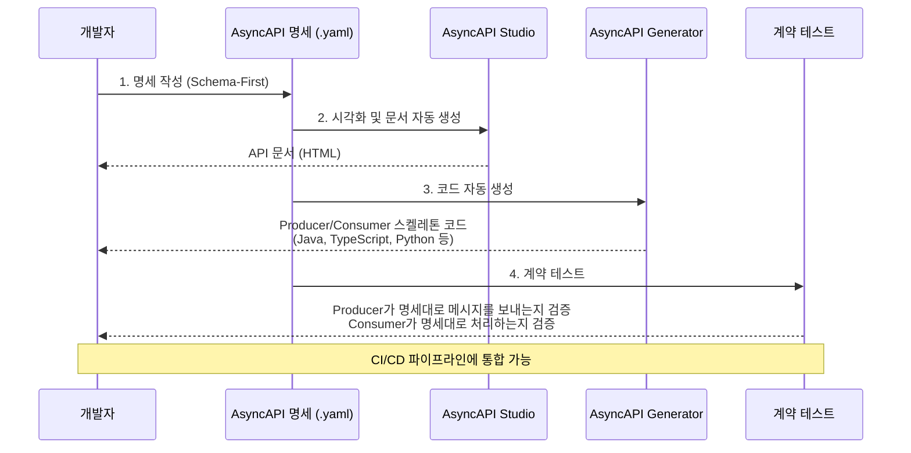

# Message 계약 명세(Async API)

---

> Async API는 이벤트 기반 API를 기술하기 위한 명세 표준입니다. AsyncAPI는 채널(토픽/큐), 메시지 스키마, 프로토콜 바인딩을 정의합니다. AsyncAPI가 해결하는 문제는 "이 토픽에 어떤 메시지가 오는가?"라는 질문에 대한 Single Source of Truth를 제공하는 것입니다. 

```yaml
asyncapi: '3.0.0'
info:
  title: 주문 서비스 API
  version: '1.0.0'
  description: 주문 관련 이벤트를 발행하는 서비스

channels:
  orderCreated:
    address: 'orders.created'
    messages:
      orderCreatedMessage:
        $ref: '#/components/messages/OrderCreated'

  orderCancelled:
    address: 'orders.cancelled'
    messages:
      orderCancelledMessage:
        $ref: '#/components/messages/OrderCancelled'

operations:
  publishOrderCreated:
    action: send
    channel:
      $ref: '#/channels/orderCreated'
    summary: 주문 생성 이벤트 발행

  publishOrderCancelled:
    action: send
    channel:
      $ref: '#/channels/orderCancelled'
    summary: 주문 취소 이벤트 발행

components:
  messages:
    OrderCreated:
      payload:
        type: object
        properties:
          orderId:
            type: string
          customerId:
            type: string
          amount:
            type: number
          currency:
            type: string
            default: KRW
        required:
          - orderId
          - customerId
          - amount

    OrderCancelled:
      payload:
        type: object
        properties:
          orderId:
            type: string
          reason:
            type: string
        required:
          - orderId
```

## AsyncAPI 도구 생태계



- AsyncAPI Studio: 브라우저 기반 편집기 + 실시간 미리보기
- AsyncAPI Generator: 명세서에서 코드, 문서, 다이어그램 자동 생성
- AsyncAPI CLI: 명세 검증, 번들링, 변환
- Microcks: AsyncAPI 명세 기반 mock 서버 및 계약 테스트
- SpringWolf: Spring Boot 어노테이션에서 AsyncAPI 문서 자동 생성

## SpringWolf

Swagger가 @RestController에서 OpenAPI 문서를 자동 생성하듯, Springwolf는 @KafkaListener 같은 리스너 어노테이션에서 AsyncAPI 문서를 자동 생성합니다. 

| Swagger (REST)                  | Springwolf (Event-Driven)                      | 역할                        |
| ------------------------------- | ---------------------------------------------- | --------------------------- |
| `springdoc-openapi`             | `springwolf-kafka`                             | 자동 문서 생성 라이브러리   |
| `@RestController` 자동 감지     | `@KafkaListener` 자동 감지                     | Consumer 문서화             |
| `@Operation`                    | `@AsyncPublisher` / `@AsyncListener`           | 추가 메타데이터 어노테이션  |
| `@Schema`                       | 페이로드 클래스에서 자동 추출                  | 메시지 스키마 문서화        |
| Swagger UI (`/swagger-ui.html`) | Springwolf UI (`/springwolf/asyncapi-ui.html`) | 웹 UI                       |
| "Try it out" 버튼               | "Publish" 버튼                                 | 브라우저에서 직접 호출/발행 |
| OpenAPI 3.x JSON                | AsyncAPI 3.x JSON                              | 출력 스펙                   |

