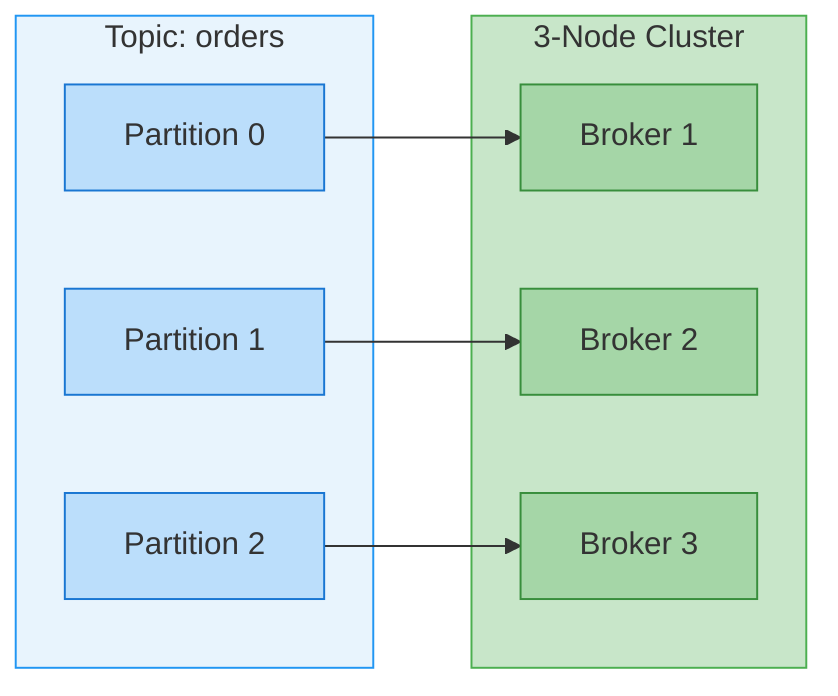
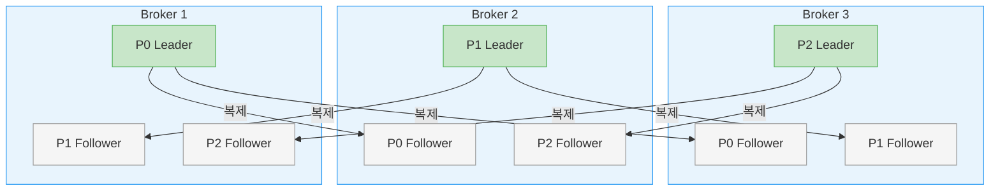
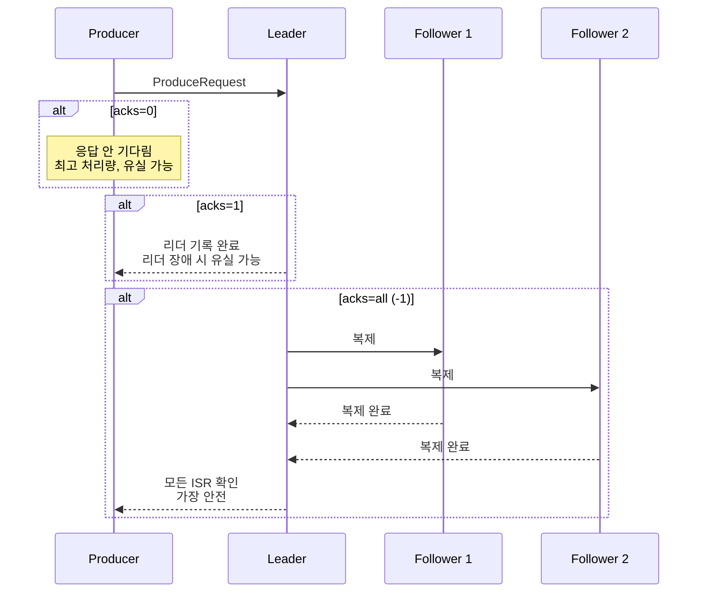

# 메시지 큐 아키텍처

---

> 분산 메시지 브로커의 공통 아키텍처에서 독립적인 개념을 다룹니다.
>
> - 분산 커밋 로그
> - 파티셔닝
> - 복제, ISR
> - 실무 설계 가이드. 브로커 구현체(Kafka, Redpanda 등)


## 1. 분산 커밋 로그

> 분산 메시지 브로커의 핵심 자료구조는 **커밋 로그(Commit Log)**입니다. 전통적인 데이터베이스에서 WAL(Write-Ahead Log)과 테이블이 분리되어 있는 것과 달리, 메시지 브로커에서는 **로그 자체가 곧 데이터**입니다.

### Append-Only 로그

모든 메시지는 시간 순서대로 로그 끝에 추가(Append)됩니다. 기존 메시지를 수정하거나 중간에 삽입하는 것은 불가능합니다. 이 제약이 오히려 성능의 핵심 원천이 됩니다.

- **순차 I/O**: 디스크는 랜덤 읽기/쓰기보다 순차 접근에서 수십~수백 배 빠릅니다. Append-Only 로그는 항상 순차적으로 쓰므로 디스크 성능을 극대화합니다.
- **불변성(Immutability)**: 한 번 기록된 메시지는 변경되지 않으므로, 동시 읽기에 Lock이 필요 없습니다.
- **재생 가능성(Replayability)**: Consumer는 오프셋을 되감아서 과거 메시지를 다시 읽을 수 있습니다. 이는 전통적인 메시지 큐(RabbitMQ 등)에서 메시지를 소비하면 사라지는 것과 근본적으로 다릅니다.

```
커밋 로그의 구조:

offset →  0    1    2    3    4    5    6    7
        [msg] [msg] [msg] [msg] [msg] [msg] [msg] [msg]
        ←── 과거 ───────────────────────── 최신 ──→
                                              ↑
                                          쓰기 위치 (항상 끝에 추가)
```

### 세그먼트 기반 관리

로그가 하나의 거대한 파일이라면 보존 정책(Retention) 적용이 어렵습니다. 따라서 로그는 여러 **세그먼트(Segment)** 파일로 분할됩니다.

- **Active Segment**: 현재 쓰기가 진행 중인 세그먼트. 하나의 파티션에 하나만 존재합니다.
- **Closed Segment**: 크기 또는 시간 기준으로 닫힌 세그먼트. 삭제(Deletion)나 압축(Compaction) 대상이 됩니다.

```
파티션 디렉토리:
├── segment-000000.log    (Closed — 삭제/압축 대상)
├── segment-000000.index  (오프셋 인덱스)
├── segment-001024.log    (Closed)
├── segment-001024.index
├── segment-002048.log    (Active — 현재 쓰기 중)
└── segment-002048.index
```

세그먼트별로 **오프셋 인덱스**가 존재하여, 특정 오프셋을 빠르게 찾을 수 있습니다. 모든 오프셋을 인덱싱하지 않고 일정 간격만 기록하는 **Sparse Index** 방식을 사용하여 메모리를 절약합니다.

### 보존 정책

메시지를 영원히 저장하면 디스크가 부족해집니다. 보존 정책은 두 가지 방식으로 동작합니다:

- **시간 기반 삭제**: `retention.ms` 설정으로 일정 시간이 지난 세그먼트를 삭제합니다. 기본값은 7일입니다.
- **크기 기반 삭제**: `retention.bytes` 설정으로 파티션의 총 크기가 임계치를 넘으면 오래된 세그먼트부터 삭제합니다.
- **로그 압축(Compaction)**: 삭제 대신, 각 키의 최신 값만 유지합니다. Changelog 토픽(최종 상태만 중요한 경우)에 적합합니다.


## 2. 파티셔닝과 병렬성

### 토픽과 파티션

**토픽(Topic)**은 메시지의 논리적 채널이며, 하나의 토픽은 1개 이상의 **파티션(Partition)**으로 분할됩니다. 파티션은 병렬 처리의 기본 단위입니다.



파티셔닝이 제공하는 핵심 이점은 다음 세 가지입니다:

- **수평 확장**: 파티션을 여러 브로커에 분산하여 단일 노드의 디스크/네트워크 한계를 초과하는 처리량을 달성합니다.
- **병렬 소비**: Consumer Group의 각 Consumer가 서로 다른 파티션을 담당하여 처리량을 선형으로 확장합니다.
- **순서 보장 범위 제한**: 전체 토픽이 아닌 파티션 내에서만 순서가 보장됩니다. 이 제약이 병렬성을 가능하게 합니다.

### 파티션 내 순서 보장

파티션은 메시지의 순서가 보장되는 최소 단위입니다. 같은 키를 가진 메시지는 `hash(key) % 파티션 수`에 의해 항상 같은 파티션에 기록되므로, **키 단위의 순서**가 보장됩니다.

```
Producer 전송 순서: A1, B1, A2, B2, A3

hash("A") % 3 = 0 → Partition 0: [A1] [A2] [A3]  (순서 보장)
hash("B") % 3 = 1 → Partition 1: [B1] [B2]       (순서 보장)

전체 토픽 레벨에서는? → A1과 B1 중 누가 먼저인지 보장 안 됨
```

- 이 특성 때문에 순서가 중요한 이벤트(주문의 생성→수정→취소 등)는 반드시 같은 키를 사용해야 합니다.

### 브로커 간 파티션 분산

파티션은 클러스터 내 브로커에 **균등하게 분산**됩니다. 각 파티션에는 **리더(Leader)**와 **팔로워(Follower)**가 존재하며, 모든 읽기/쓰기는 리더를 통해 이루어집니다.



- 리더가 장애를 겪으면, 팔로워 중 하나가 새 리더로 승격됩니다. 
- 이 과정에서 클라이언트는 짧은 지연을 경험하지만 데이터는 유실되지 않습니다(적절한 복제 설정 하에서).


## 3. 복제와 내구성

### Replication Factor

**Replication Factor(RF)**는 각 파티션의 복제본 수를 결정합니다. RF=3이면 파티션의 데이터가 3개 브로커에 저장됩니다.

| RF | 허용 장애 노드 | Quorum | 저장 공간 | 적합 환경 |
|----|---------------|--------|----------|----------|
| 1 | 0개 | 1/1 | 1x | 개발/테스트 |
| 3 | 1개 | 2/3 | 3x | 일반 프로덕션 |
| 5 | 2개 | 3/5 | 5x | 고가용성 프로덕션 |

RF=1은 복제가 없으므로 노드 하나의 디스크 장애로 데이터가 영구 유실됩니다. **프로덕션에서는 RF=3이 표준**입니다.

### Producer의 acks 설정

Producer가 메시지를 보낼 때, "언제 성공으로 간주할 것인가"를 `acks` 설정으로 결정합니다.



| acks | 동작 | 처리량 | 안전성 |
|------|------|--------|--------|
| `0` | 응답을 기다리지 않음 | 최고 | 최저 (유실 가능) |
| `1` | 리더 기록 후 응답 | 중간 | 중간 (리더 장애 시 유실) |
| `all` | 모든 ISR 확인 후 응답 | 최저 | 최고 |

프로덕션에서는 `acks=all`과 `min.insync.replicas=2`를 함께 사용하는 것이 표준입니다.

### ISR (In-Sync Replicas)

**ISR**은 리더와 충분히 동기화된 팔로워들의 집합입니다. "충분히"의 기준은 `replica.lag.time.max.ms` 설정으로 결정됩니다. 팔로워가 이 시간 내에 리더의 최신 메시지를 복제하면 ISR에 포함되고, 그렇지 않으면 제외됩니다.

ISR의 목적은 **쓰기 성능과 데이터 안전성의 균형**입니다. 모든 복제본을 기다리면 느린 노드 하나가 전체 쓰기를 지연시킵니다. ISR만 기다리면 "현재 동기화된" 노드만 고려하므로, 빠른 쓰기와 안전성을 동시에 달성할 수 있습니다.

### min.insync.replicas

`min.insync.replicas`는 쓰기가 성공하기 위한 **최소 ISR 크기**입니다. `acks=all`과 함께 사용하여 데이터 안전성을 강화합니다.

```yaml
# 프로덕션 권장 설정
replication.factor: 3
min.insync.replicas: 2
acks: all
```

이 설정의 의미는 "최소 2개 노드가 메시지를 확인해야만 쓰기 성공"입니다:

- **정상 (ISR=3)**: 리더 + 팔로워 2개 모두 응답. 정상 동작.
- **팔로워 1개 장애 (ISR=2)**: 리더 + 팔로워 1개 응답. 여전히 `min.insync.replicas=2` 만족.
- **팔로워 2개 장애 (ISR=1)**: 리더만 살아있음. `min.insync.replicas=2` 미만이므로 **모든 쓰기 실패**.

`min.insync.replicas`를 RF보다 1 작게 설정하는 것이 일반적입니다. RF=3이면 `min.insync.replicas=2`로, 1개 노드 장애를 허용하면서 최소 2개 노드에 데이터가 있음을 보장합니다.

### Unclean Leader Election

모든 ISR 멤버가 장애를 겪으면, 동기화되지 않은 팔로워만 남습니다. 이때 두 가지 선택지가 있습니다:

- **허용(가용성 우선)**: 동기화되지 않은 팔로워를 리더로 승격. 서비스는 복구되지만 **데이터 유실 가능**.
- **거부(일관성 우선)**: 리더 선출을 거부. ISR 멤버가 복구될 때까지 **서비스 중단**.

이 선택은 CAP 정리에서 Availability와 Consistency 사이의 트레이드오프입니다. 금융/의료 같은 데이터 정확성이 중요한 분야에서는 일관성을 우선하고, 로그 수집 같은 유실이 허용되는 시나리오에서는 가용성을 우선할 수 있습니다.


## 4. 실무 설계 가이드

### 파티션 수 계획

파티션 수는 병렬 처리 성능과 리소스 오버헤드 사이의 트레이드오프입니다.

**파티션이 너무 적을 때**: Consumer Group의 Consumer 수가 파티션 수를 초과하면 유휴 Consumer가 발생합니다. 또한 단일 파티션에 트래픽이 집중되면 해당 브로커가 병목이 됩니다.

**파티션이 너무 많을 때**: 파티션마다 메타데이터 오버헤드가 발생합니다. 리더 선출 시 수천 개의 파티션이 동시에 선출을 진행하면 "Election Storm"이 발생할 수 있습니다. 파일 디스크립터도 파티션 수에 비례하여 소모됩니다.

| 시나리오 | 권장 파티션 수 | 근거 |
|---------|-------------|------|
| 저처리량 토픽 (< 10MB/s) | 3~6개 | 최소한의 병렬성 확보 |
| 중간 처리량 (10~100MB/s) | 6~12개 | Consumer 병렬 처리와 부하 분산 |
| 고처리량 (> 100MB/s) | 12~30개 | 코어 수 고려, 과도하게 늘리지 않음 |
| 순서 보장 필요 | 1개 | 파티션 내에서만 순서 보장 가능 |

### Replication Factor 설정

| RF | 허용 장애 | 저장 공간 | 적합 환경 |
|----|----------|----------|----------|
| 1 | 0개 노드 | 1x | 개발/테스트 (복제 없음) |
| 3 | 1개 노드 | 3x | 프로덕션 표준 |
| 5 | 2개 노드 | 5x | 높은 가용성 |

### 노드 수 계획

**최소 3노드**가 Quorum을 위한 최소 요건입니다. 2노드에서는 1노드 장애 시 과반수를 달성할 수 없어 쓰기가 중단됩니다.

| 노드 수 | 허용 장애 | 비고 |
|---------|----------|------|
| 3 | 1개 | 프로덕션 최소 |
| 5 | 2개 | 높은 가용성, 롤링 업그레이드 안전 |
| 7 | 3개 | 매우 높은 가용성, 대규모 클러스터 |

**홀수를 권장하는 이유**: 4노드 클러스터에서 RF=3이면 Quorum은 여전히 2/3입니다. 4번째 노드는 데이터 분산에는 도움이 되지만, 장애 허용 능력은 3노드와 동일합니다. 5노드부터 2개 동시 장애를 허용하므로 의미 있는 가용성 향상이 됩니다.


## 5. 브로커별 구현 차이 요약

같은 개념이라도 브로커마다 내부 구현이 다릅니다. 아래 표는 주요 차이점을 요약합니다.

| 영역 | Kafka | Redpanda |
|------|-------|----------|
| **아키텍처** | 다중 프로세스 (Broker + ZK/KRaft + SR + Proxy) | 단일 바이너리 |
| **Threading** | JVM Thread Pool + Shared Memory | Thread-per-Core + Shard-Nothing |
| **복제 합의** | ISR (동적 목록, 리더 관리) | Raft (수학적 Quorum) |
| **ISR 동작** | 리더가 ISR 목록을 동적으로 관리 | Quorum 응답만 카운트 (ISR은 호환성 표현) |
| **Unclean Election** | 설정으로 허용/거부 선택 | 구조적으로 방지 (Raft) |
| **I/O** | Buffered I/O + Page Cache | O_DIRECT + io_uring |
| **Tail Latency** | GC Pause 영향 (P99.9 수백 ms) | 예측 가능 (P99.9 수 ms) |
| **일관성 vs 가용성** | 설정으로 조정 | 일관성 우선 (고정) |

각 브로커의 상세 아키텍처는 전용 문서를 참조하세요:
- Redpanda: [05-01-rp.Redpanda 아키텍쳐](./05-01-rp.Redpanda%20아키텍쳐.md)


## 참고

- [Confluent: Kafka Architecture](https://developer.confluent.io/courses/architecture/)
- [Jay Kreps: The Log](https://engineering.linkedin.com/distributed-systems/log-what-every-software-engineer-should-know-about-real-time-datas-unifying) — 분산 커밋 로그의 원론적 설명
- [Raft Consensus Algorithm](https://raft.github.io/raft.pdf)
- 브로커별 상세: [05-01-rp.Redpanda 아키텍쳐](./05-01-rp.Redpanda%20아키텍쳐.md)
- 리더 선출 상세: [05-02.리더 선출](./05-02.리더%20선출.md)
- Consumer Group: [05-03.Consumer Group](./05-03%20Consumer%20Group.md)


## 학습 정리

### 핵심 개념

1. **분산 커밋 로그**: Append-Only 로그가 곧 데이터. 순차 I/O로 디스크 성능 극대화, 불변성으로 Lock-Free 읽기 가능
2. **세그먼트 관리**: 로그를 세그먼트로 분할하여 보존 정책(시간/크기/압축) 적용. Sparse Index로 빠른 오프셋 탐색
3. **파티셔닝**: 토픽을 파티션으로 분할하여 병렬 처리. 파티션 내에서만 순서 보장, 키 기반 분배로 키 단위 순서 보장
4. **복제와 ISR**: RF로 복제본 수 결정. ISR은 동기화된 팔로워 집합으로 쓰기 성능과 안전성 균형
5. **acks + min.insync.replicas**: `acks=all` + `min.insync.replicas=2`가 프로덕션 표준. 1개 노드 장애 허용

### 실무 적용 요약

- **파티션**: 토픽당 3~30개, Consumer 수와 처리량 기반으로 결정
- **RF**: 프로덕션은 RF=3 필수, 고가용성은 RF=5
- **노드**: 최소 3 (홀수 권장), 높은 가용성은 5
- **보존**: 시간 기반(7일 기본) 또는 크기 기반, Changelog 토픽은 Compaction
