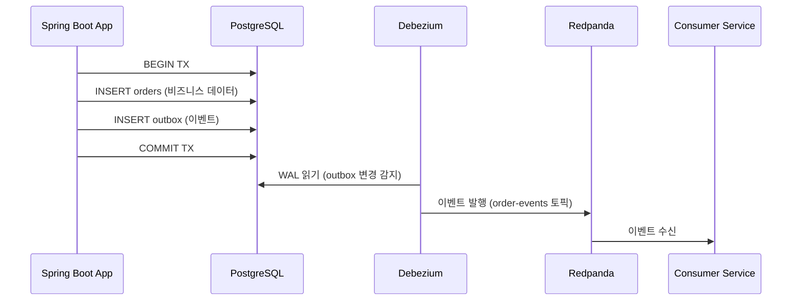

# Transactional Outbox 패턴

---

> Outbox는 DB 트랜잭션과 Kafka 발행 사이의 이중 쓰기 문제를 해결하는 생산자 측 패턴입니다. 비즈니스 데이터와 이벤트를 같은 DB 트랜잭션에서 한 번에 저장하고, 별도 릴레이가 outbox 테이블의 레코드를 꺼내 Kafka로 발행합니다.

소비자 측 대칭 패턴인 Inbox와의 비교, 그리고 어느 상황에 어떤 패턴이 맞는지는 [05-05.Inbox](05-05.Inbox.md) 참조.


## 이중 쓰기 문제와 해결 전략

Outbox/Inbox 패턴이 왜 필요한지 이해하려면, 그 이전에 존재하는 접근 방식과 한계를 알아야합니다.

### Write-Aside(이중 쓰기)

DB트랜잭션과 Kafka 발행은 서로 다른 트랜잭션 시스템을 지니고있어, 어느 한쪽이 실패하게 되면 데이터가 어긋나게 될 수 있습니다.  두 시스템에 걸쳐 원자성을 보장하려면 분산 트랜잭션이 필요한데 성능/복잡성 비용이 너무 심합니다.

| 시나리오            | DB 상태   | Kafka 상태  | 결과                                       |
| ------------------- | --------- | ----------- | ------------------------------------------ |
| DB 성공, Kafka 실패 | 주문 존재 | 이벤트 없음 | **유실**: 다운스트림이 주문을 모름         |
| DB 실패, Kafka 성공 | 주문 없음 | 이벤트 있음 | **유령 이벤트**: 존재하지 않는 주문 이벤트 |

Write-Aside가 항상 좋지 않은것은 아닙니다. 데이터 불일치가 어느정도 수용 가능하다면, 단순하게 유지하는것이 오히려 더 좋을 수 있습니다.

- 감사 로그: 일부 누락이 비즈니스에 치명적이지 않은 경우
- 프로토타입/초기 개발 단계

### Write-Through(CDC)

Write-Aside의 대안으로 나온 개념입니다. 애플리케이션은 DB에만 쓰고, DB변경 로그를 CDC 커넥터가 읽어서 이벤트를 자동 발행하게 하는 방식입니다. DB 커밋과 WAL 기록은 같은 트랜잭션 이므로 원자성이 보장됩니다.

### Transaction Outbox

Write-Through의 원자성 보장과 Write-Aside의 이벤트 구조 독립성을 결합한 것이 Outbox 패턴입니다.

애플리케이션 비즈니스 테이블과 outbox 테이블에 같은 DB 트랜잭션으로 쓰고, CDC 커넥터가 outbox 테이블만 감시하여 이벤트를 발행하게 합니다. 이벤트 구조는 outbox 테이블의 payload 컬럼에서 자유롭게 정의할 수 있으므로 DB 스키마 변경에 종속되지 않게 합니다.

| 기준            | Write-Aside (이중 쓰기)      | Write-Through (CDC)   | Outbox + CDC                   |
| --------------- | ---------------------------- | --------------------- | ------------------------------ |
| **원자성**      | 미보장                       | 보장 (WAL 기반)       | 보장 (단일 TX)                 |
| **지연 시간**   | 낮음 (동기 발행)             | 중간 (WAL → 커넥터)   | 중간 (WAL → 커넥터)            |
| **인프라 비용** | 낮음                         | 높음 (CDC 운영)       | 높음 (CDC 운영)                |
| **스키마 결합** | 낮음 (앱이 이벤트 구조 제어) | 높음 (DB 스키마 종속) | 낮음 (Outbox 테이블로 분리)    |
| **적합 사례**   | 프로토타입, 일관성 허용      | 레거시 DB 이벤트 추출 | 정합성 필수 + 이벤트 구조 독립 |

# Transactional Outbox

----

## Outbox(1-1 통신보장)

> Dual Write Problem을 해결하기 위해 등장했으며, DB의 트랜잭션 하나로 Kafka의 트랜잭션도 관리하는 개념이라 생각하면 됩니다.

```java
@Transactional
public Order createOrder(CreateOrderRequest request) {
    Order order = orderRepository.save(order);          // DB 트랜잭션
    kafkaTemplate.send("order-events", orderEvent);     // ⚠️ 트랜잭션 밖
    return order;
}
```

```java
@Transactional
public Order createOrder(CreateOrderRequest request) {
    Order order = orderRepository.save(order);          // 같은 TX
    outboxRepository.save(OutboxEvent.from(order));     // 같은 TX ✅
    return order;
  
    // Debezium이 Outbox 변경을 감지하여 Kafka로 자동 발행
}
```

### 아키텍쳐



Outbox 테이블의 이벤트를 브로커로 전달하는 방법은 2가지 입니다. (세부 내용은 나중에 다룹니다.)

1. CDC: DB의 WAL/binlog를 실시간으로 읽어 토픽에 자동 발행
2. 폴링 Relay: 별도 스케줄러가 미전송 행을 조회하여 발행합니다.

| 측면            | Debezium CDC                  | 폴링 Relay                |
| --------------- | ----------------------------- | ------------------------- |
| **지연시간**    | ms 수준 (WAL 실시간 읽기)     | 폴링 간격에 비례 (1~10초) |
| **인프라**      | Kafka Connect + Debezium 필요 | 앱 내부 @Scheduled로 충분 |
| **정렬 보장**   | WAL 순서 보장                 | created_at ORDER BY 필요  |
| **DB 부하**     | WAL 읽기 (낮음)               | 주기적 SELECT (중간)      |
| **적합 케이스** | 실시간 요구, 대량 이벤트      | 소규모, 인프라 최소화     |


## 테이블 설계

```sql
CREATE TABLE outbox (
    id UUID PRIMARY KEY DEFAULT gen_random_uuid(),
    aggregate_type VARCHAR(255) NOT NULL,    -- 엔티티 타입 (Order, Payment 등)
    aggregate_id VARCHAR(255) NOT NULL,      -- 엔티티 ID (Kafka Key로 사용)
    event_type VARCHAR(255) NOT NULL,        -- 이벤트 타입 (order-created 등)
    payload JSONB NOT NULL,                  -- 이벤트 페이로드
    created_at TIMESTAMP NOT NULL DEFAULT NOW()
);

CREATE INDEX idx_outbox_created_at ON outbox(created_at);
```

```json
{
  "id": "550e8400-e29b-41d4-a716-446655440000",
  "aggregate_type": "Order",
  "aggregate_id": "order-123",
  "event_type": "order-created",
  
  // 이벤트 형태 정의
  "payload": {
    "orderId": "order-123",
    "userId": "user-456",
    "totalAmount": 50000,
    "timestamp": "2026-02-06T12:00:00Z"
  },
  "created_at": "2026-02-06T12:00:00.123456"
}
```

# Polling Relay 구현 상세

---

> CDC 없이 Outbox 패턴을 구현하는 가장 단순한 방법이 Polling Relay(Polling Publisher)입니다. 별도 인프라 없이 애플리케이션 내부의 `@Scheduled` 메서드로 동작하므로, 소규모 시스템에서 빠르게 적용할 수 있습니다.

폴링 루프의 핵심 흐름은 세 단계로 구성됩니다. 

1. 먼저 PENDING 상태의 레코드를 `FOR UPDATE SKIP LOCKED`로 조회하여 다중 인스턴스 환경에서의 동시 처리를 방지합니다. 
2. 조회된 이벤트를 Kafka로 발행하고, 발행 결과에 따라 상태를 전이합니다. 
3. 상태 머신은 단순합니다 PENDING에서 시작하여 발행 성공 시 SENT, 최대 재시도 초과 시 DEAD로 전이합니다.

```java
@Scheduled(fixedDelay = 500)
public void pollAndPublish() {
    List<OutboxEvent> events = outboxMapper.findPendingEvents(50);
    for (var event : events) {
        try {
            kafkaTemplate.send(buildRecord(event))
                    .get(5, TimeUnit.SECONDS);      // 동기 전송
            outboxMapper.markAsSent(event.getId());  // → SENT
        } catch (Exception e) {
            if (event.getRetryCount() >= MAX_RETRIES) {
                outboxMapper.markAsDead(event.getId()); // → DEAD
            } else {
                outboxMapper.incrementRetryCount(event.getId());
            }
        }
    }
}
```

조회 SQL에서 `FOR UPDATE SKIP LOCKED`가 중요한 이유는, 인스턴스 A가 처리 중인 레코드를 인스턴스 B가 중복 조회하지 않도록 보장하기 때문입니다. 일반적인 `FOR UPDATE`는 lock이 걸린 행을 대기하지만, `SKIP LOCKED`는 이미 잠긴 행을 건너뛰고 다음 행을 반환합니다.

```sql
SELECT * FROM outbox_event
WHERE status = 'PENDING'
ORDER BY created_at
LIMIT 50
FOR UPDATE SKIP LOCKED;
```


## 순서 보장

Polling Relay에는 순서 역전 문제가 숨어 있습니다. 

1. 같은 aggregate의 이벤트 **E1~E5가 PENDING 상태일 때, E1 발행이 실패하면 E2~E5가 먼저 Kafka에 적재됩니다.** 
2. 다음 폴링에서 E1이 성공하더라도 **파티션 내 순서는 이미 E2, E3, E4, E5, E1**이 되어 있습니다. 
3. Consumer 입장에서 `ORDER_CREATED`보다 `ORDER_PAID`가 먼저 도착하는 상황이 발생할 수 있다는 뜻입니다.

해결 방법은 **aggregate 단위 stop-on-failure**입니다. 선행 이벤트가 실패한 aggregate의 후속 이벤트를 건너뛰는 방식으로, aggregate 간 독립성은 유지하면서 aggregate 내 순서를 보장합니다.

```java
Set<String> failedAggregates = new HashSet<>();
for (var event : events) {
    if (failedAggregates.contains(event.getAggregateId())) {
        continue; // 선행 실패한 aggregate는 skip
    }
    try {
        publishWithTraceContext(record, event);
        outboxMapper.markAsSent(event.getId());
    } catch (Exception e) {
        failedAggregates.add(event.getAggregateId());
        handleFailure(event);
    }
}
```

- 주문 A의 이벤트가 실패해도 주문 B의 이벤트는 정상 발행됩니다. 
- 실패한 aggregate의 이벤트는 다음 폴링 주기(예: 500ms)까지 지연되므로, 폴링 간격이 해당 aggregate의 최대 지연 시간이 됩니다.


## 트랜잭션 범위 설계

`pollAndPublish()` 메서드 전체를 `@Transactional`로 감싸면 위험합니다. 

50건 처리 중 30번째에서 DB 예외가 발생하면, 이미 Kafka에 적재된 E1~E29의 `markAsSent`가 롤백되어 다시 PENDING 상태로 돌아갑니다. 

- Kafka send는 외부 시스템 호출이므로 DB 롤백과 무관하게 메시지를 회수할 수 없고, 다음 폴링에서 E1~E29가 중복 전송됩니다.
- 해결책은 이벤트별 트랜잭션 분리입니다. `@Transactional`을 메서드에서 제거하고 `TransactionTemplate`으로 개별 이벤트마다 트랜잭션 경계를 제어합니다.

```java
@Scheduled(fixedDelay = 500)
public void pollAndPublish() {
    // 조회: 별도 트랜잭션
    var events = txTemplate.execute(status ->
            outboxMapper.findPendingEvents(50));
    if (events == null || events.isEmpty()) return;

    Set<String> failedAggregates = new HashSet<>();
    for (var event : events) {
        if (failedAggregates.contains(event.getAggregateId())) {
            continue;
        }
        try {
            publishWithTraceContext(buildRecord(event), event);
            // 발행 성공: 개별 트랜잭션으로 상태 전이
            txTemplate.executeWithoutResult(status ->
                    outboxMapper.markAsSent(event.getId()));
        } catch (Exception e) {
            failedAggregates.add(event.getAggregateId());
            txTemplate.executeWithoutResult(status ->
                    handleFailure(event));
        }
    }
}
```

- 이 구조에서 E30이 실패해도 E1~E29의 `markAsSent`는 이미 개별 커밋되었으므로 롤백되지 않습니다. 
- 단, trade-off가 있습니다. 
  - Kafka send 성공 후 `markAsSent` DB 커밋이 실패하면 다음 폴링에서 해당 이벤트가 재전송됩니다. 
  - Outbox 패턴은 본질적으로 **at-least-once 전달**이며, **Consumer 측 멱등성 처리가 반드시 전제**되어야 합니다.


## 프로덕션 고려사항

Polling Relay의 기본 구현을 프로덕션에 배포하기 전에 검토해야 할 항목이 있습니다.

### 재시도 지수 백오프

실패한 이벤트가 매 폴링 주기(500ms)마다 즉시 재시도되면, Kafka 브로커 장애처럼 복구에 시간이 필요한 상황에서 `MAX_RETRIES`가 빠르게 소진됩니다. `next_retry_at` 컬럼을 추가하고 `1초 × 2^retryCount`로 간격을 늘리면, 복구 가능한 이벤트가 DEAD로 전이되는 것을 방지할 수 있습니다.

지수 백오프(exponential backoff)란 재시도 간격을 `2^n`으로 점점 늘려가는 전략입니다. 첫 실패 후 1초, 두 번째 2초, 세 번째 4초, 네 번째 8초... 이런 식으로 대기 시간이 지수적으로 증가합니다. 일시적 장애(브로커 재시작, 네트워크 순단)에는 초반 재시도로 빠르게 복구되고, 장기 장애에는 재시도 빈도가 줄어들어 시스템에 불필요한 부하를 주지 않습니다.

```sql
UPDATE outbox_event
SET retry_count = retry_count + 1
    , next_retry_at = NOW() + INTERVAL (POWER(2, retry_count)) SECOND
WHERE id = #{id};
```

이 쿼리는 `NOW()`, `POWER()`, `INTERVAL expr SECOND` 모두 표준 SQL 함수이므로 PostgreSQL과 MariaDB/MySQL 양쪽에서 동일하게 동작합니다. `POWER()`가 DOUBLE을 반환하지만 INTERVAL 연산 시 정수로 자동 절삭되어 문제가 없습니다.

- 조회 쿼리에도 `AND (next_retry_at IS NULL OR next_retry_at <= NOW())` 조건을 추가하여, 백오프 시간이 지나지 않은 이벤트는 건너뛰도록 합니다.

### 메트릭과 모니터링

PENDING 큐 깊이, 발행 성공/실패 횟수, DEAD 이벤트 발생을 모니터링할 수 없으면 장애 인지가 늦어집니다. Micrometer Counter/Gauge를 추가하면 Grafana 대시보드와 알림 연동이 가능합니다. 핵심 메트릭은 네 가지입니다:

- `outbox.events.published` — 발행 성공 카운터
- `outbox.events.failed` — 발행 실패 카운터
- `outbox.events.dead` — DEAD 전이 카운터
- `outbox.queue.pending` — PENDING 큐 깊이 게이지

### 배치 UPDATE 최적화

이벤트마다 `markAsSent`를 개별 호출하면 50건 배치에서 50회의 UPDATE 쿼리가 DB로 전송됩니다. 

- 성공한 이벤트 ID를 `List`로 모은 뒤 `WHERE id IN (...)` 한 번으로 처리하면 DB 라운드트립이 크게 줄어듭니다. 
- Milan Jovanović의 Outbox 스케일링 사례(2B+ messages/day)에서는 건별 UPDATE를 배치 UPDATE로 전환하여 300ms → 52ms를 달성했습니다.

### SENT 레코드 정리

SENT 상태의 레코드가 무한히 쌓이면 테이블 크기가 증가하고, partial index 효율도 점차 떨어집니다. 별도 `@Scheduled` 메서드로 일 1회 정리 작업을 수행하되, 디버깅 용도를 고려하여 7일 정도의 보존 기간을 두는 것이 적절합니다.

### Covered Index

PENDING 레코드가 수백 건 수준이면 성능 차이는 미미하지만, 장애 상황에서 수만 건으로 급증했을 때 차이가 드러납니다. PostgreSQL의 `INCLUDE` 절로 SELECT 대상 컬럼을 인덱스에 포함시키면 테이블 접근 없이 인덱스만으로 쿼리를 처리할 수 있습니다.

```sql
CREATE INDEX idx_outbox_pending_created
    ON outbox_event (created_at)
    INCLUDE (id, aggregate_type, aggregate_id, event_type, payload, topic)
    WHERE status = 'PENDING';
```

다만 `payload` 컬럼이 크면 PostgreSQL의 인덱스 행 크기 제한(2712B)에 걸릴 수 있으므로, 메시지 크기에 따라 `payload`를 INCLUDE에서 제외하는 것도 고려해야 합니다.

### Consumer 멱등성 처리

Outbox 패턴은 at-least-once 전달을 보장하므로, Consumer 측에서 동일 메시지를 두 번 이상 수신하는 상황은 정상 동작이다. 문제는 중복 처리를 어떻게 방지하느냐에 있다. 가장 널리 쓰이는 방법은 **Inbox 테이블**(또는 `processed_messages` 테이블)에 처리 완료된 메시지 ID를 기록하고, 수신 시마다 중복 여부를 확인하는 것이다.

처리 흐름은 다음과 같다:

```
1. 메시지 수신 → message_id 추출
2. processed_messages 테이블에서 해당 ID 존재 여부 확인
3. 이미 존재 → 메시지 스킵 (ACK만 전송)
4. 존재하지 않음 → 비즈니스 로직 실행 + message_id INSERT를 같은 트랜잭션에서 수행
```

Inbox 테이블 스키마는 단순하다:

```sql
CREATE TABLE processed_messages (
    message_id  UUID PRIMARY KEY,
    consumer_id VARCHAR(255) NOT NULL,
    processed_at TIMESTAMP NOT NULL DEFAULT now()
);
```

핵심은 비즈니스 로직 실행과 `message_id` INSERT를 **하나의 트랜잭션**으로 묶는 것이다. 비즈니스 로직만 성공하고 ID 기록이 누락되면 다음 수신 시 중복 처리가 발생하고, 반대로 ID만 기록되고 비즈니스 로직이 롤백되면 메시지가 유실된다. Spring에서는 `@Transactional` 메서드 안에서 두 작업을 함께 수행하면 된다:

```java
@Transactional
public void handleOrderEvent(OrderEvent event) {
    if (processedMessageRepository.existsById(event.getMessageId())) {
        log.info("Duplicate message skipped: {}", event.getMessageId());
        return;
    }

    // 비즈니스 로직 실행
    inventoryService.reserve(event.getOrderId(), event.getItems());

    // 처리 완료 기록
    processedMessageRepository.save(
        new ProcessedMessage(event.getMessageId(), "inventory-consumer")
    );
}
```

Inbox 테이블도 outbox와 마찬가지로 무한히 쌓이므로, 보존 기간(예: 7일)을 정해 주기적으로 정리해야 한다. 보존 기간은 메시지 브로커의 최대 재전달 기간보다 길어야 안전하다.

### 처리량 스케일링

Outbox 처리량을 높이는 축은 세 가지다. **폴링 빈도**, **배치 크기**, **다중 프로세서 병렬화**이며, 각각의 트레이드오프가 다르다.

폴링 빈도를 높이면(예: 500ms → 100ms) 지연이 줄지만 DB 부하가 비례해서 증가한다. 배치 크기를 늘리면(예: 50건 → 500건) 한 번의 폴링으로 더 많은 메시지를 처리하지만, 개별 트랜잭션 시간이 길어져 lock 경합이 발생할 수 있다. 이 두 축만으로는 단일 프로세서의 한계에 부딪힌다.

**다중 프로세서 병렬화**는 여러 프로세서(또는 인스턴스)가 동시에 outbox 테이블을 폴링하는 방식이다. 이때 `SELECT ... FOR UPDATE SKIP LOCKED`가 핵심 역할을 한다. 프로세서 A가 row 1~50을 `FOR UPDATE`로 잠그면, 프로세서 B는 `SKIP LOCKED` 덕분에 해당 row를 건너뛰고 row 51~100을 가져간다. 각 프로세서가 서로 다른 row를 처리하므로 중복 전송 없이 처리량이 프로세서 수에 비례하여 증가한다.

```sql
-- 프로세서 A와 B가 동시에 실행해도 서로 다른 row를 가져감
SELECT id, aggregate_type, aggregate_id, event_type, payload, topic
FROM outbox_event
WHERE status = 'PENDING'
ORDER BY created_at
LIMIT :batchSize
FOR UPDATE SKIP LOCKED;
```

Milan Jovanović는 이 전략을 조합하여 초당 32,500건의 메시지 처리를 달성했다고 보고한다. 실제 스케일링 순서는 배치 크기 튜닝(가장 쉬움) → 폴링 빈도 조정 → 다중 프로세서 도입(가장 복잡) 순서가 현실적이다. 다중 프로세서는 인스턴스 간 모니터링 복잡도가 높아지므로, 단일 프로세서의 한계가 확인된 후에 도입하는 것이 적절하다.

여기에 **병렬 발행**을 추가하면 publish 단계의 지연을 더 줄일 수 있다. 메시지를 순차적으로 브로커에 전송하는 대신, `CompletableFuture`나 Kafka의 비동기 send를 활용하여 배치 내 메시지를 동시에 전송하는 방식이다. Kafka의 `batch.size`와 `linger.ms` 설정을 함께 튜닝하면 네트워크 라운드트립을 줄이는 효과도 얻는다.

다중 프로세서와 병렬 발행을 도입할 때는 **순서 보장 trade-off**를 인식해야 한다. `SKIP LOCKED`로 여러 워커가 동시에 폴링하면, 같은 aggregate의 이벤트가 서로 다른 워커에 분배되어 발행 순서가 깨질 수 있다. 순서가 중요한 도메인에서는 단일 프로세서를 유지하거나, Consumer 측에서 Inbox 패턴으로 순서를 재정렬해야 한다. 각 최적화 단계의 벤치마크 수치와 심화 내용은 [05-04.Outbox 스케일링](05-04.Outbox%20스케일링.md)에서 다룬다.

# Event Listener 방식의 Outbox

---

>  Polling Relay 외에 Outbox 이벤트를 발행하는 또 다른 방법이 있습니다. Spring의 `@TransactionalEventListener`를 활용하여 트랜잭션 커밋 직후 Kafka로 전송하는 방식입니다. CDC 인프라 없이도 near-zero 지연을 달성할 수 있어, 실시간성이 중요한 도메인에서 선호됩니다.

## @TransactionalEventListener 동작 원리

`@TransactionalEventListener`는 `@EventListener`에 트랜잭션 phase 바인딩을 추가한 것입니다. 

- `ApplicationEventPublisher.publishEvent()`로 이벤트를 발행하면 Spring은 리스너를 즉시 호출하지 않고, `TransactionSynchronizationManager`에 콜백을 등록합니다. 
- 트랜잭션의 진행 상태에 따라 콜백이 실행되는 순서는 다음과 같습니다.

커밋 성공 시의 실행 순서입니다:

```
beforeCommit(readOnly)     ← BEFORE_COMMIT 리스너 실행 (TX 아직 열림)
beforeCompletion()

[DATABASE COMMIT]

afterCommit()              ← AFTER_COMMIT 리스너 실행
afterCompletion(COMMITTED)
```

롤백 시에는 `afterCommit()`이 호출되지 않습니다. `AFTER_COMMIT` 리스너는 조용히 폐기되고, 비즈니스 트랜잭션과 함께 outbox 기록도 롤백됩니다. 이것이 Event Listener 방식의 원자성 보장 원리입니다.

| Phase | 실행 시점 | 핵심 특성 |
|-------|----------|----------|
| `BEFORE_COMMIT` | DB 커밋 직전 | TX 내부 — 여기서 DB에 쓰면 커밋에 포함 |
| `AFTER_COMMIT` | DB 커밋 직후 | TX 이미 완료 — 읽기 전용으로 취급 |
| `AFTER_ROLLBACK` | 롤백 완료 후 | 보상 처리 용도 |


## 2단계 리스너 아키텍처

Event Listener 방식은 두 개의 리스너를 조합합니다. `BEFORE_COMMIT` 리스너가 outbox 테이블에 기록하고, `AFTER_COMMIT` + `@Async` 리스너가 Kafka로 전송합니다. 도메인 로직은 이벤트를 발행만 하면 되므로 관심사가 깔끔하게 분리됩니다.

```java
@Service
@RequiredArgsConstructor
public class OrderService {
    private final ApplicationEventPublisher eventPublisher;

    @Transactional
    public void createOrder(CreateOrderRequest request) {
        Order order = orderRepository.save(Order.from(request));
        // 도메인 이벤트 발행 — 리스너가 outbox 처리를 담당
        eventPublisher.publishEvent(new OrderCreatedEvent(order));
    }
}
```

```java
@Component
@RequiredArgsConstructor
public class OrderEventHandler {
    private final OutboxRepository outboxRepository;
    private final KafkaTemplate<String, Object> kafkaTemplate;

    // Phase 1: 비즈니스 TX 안에서 outbox 테이블에 기록
    @TransactionalEventListener(phase = TransactionPhase.BEFORE_COMMIT)
    public void writeToOutbox(OrderCreatedEvent event) {
        outboxRepository.save(OutboxMessage.from(event));
    }

    // Phase 2: 커밋 후 별도 스레드에서 Kafka 전송
    @Async
    @TransactionalEventListener(phase = TransactionPhase.AFTER_COMMIT)
    @Transactional(propagation = Propagation.REQUIRES_NEW)
    public void sendToKafka(OrderCreatedEvent event) {
        OutboxMessage msg = outboxRepository.findByEventId(event.getId());
        kafkaTemplate.send("order-events", msg.getPayload());
        msg.markPublished();
        outboxRepository.save(msg);
    }
}
```

- `BEFORE_COMMIT` 리스너는 부모 트랜잭션 안에서 실행되므로, outbox 기록과 비즈니스 데이터가 원자적으로 커밋됩니다. 
- `AFTER_COMMIT` 리스너는 커밋이 완료된 후 `@Async` 스레드 풀에서 실행되어 호출자 스레드를 블로킹하지 않습니다.


## Dead Transaction 함정

`AFTER_COMMIT` 리스너에서 DB 작업을 할 때 주의할 점이 있습니다. Spring의 내부 실행 순서에서 `triggerAfterCommit()`은 `cleanupAfterCompletion()` 이전에 호출됩니다.

=>  즉 `AFTER_COMMIT` 리스너가 실행되는 시점에 `TransactionSynchronizationManager`에는 아직 이전 트랜잭션의 `EntityManagerHolder`가 바인딩되어 있습니다.

이 상태에서 기본 `Propagation.REQUIRED`를 사용하면 Spring은 "활성 트랜잭션이 있다"고 판단하고 이미 커밋된 트랜잭션에 참여합니다. 

- 해당 트랜잭션은 이미 끝났으므로 DB 쓰기가 flush되지 않습니다. `markPublished()` 상태 변경이 사라지고, 다음 배치에서 같은 이벤트가 중복 전송됩니다.
- 해결책은 `@Transactional(propagation = Propagation.REQUIRES_NEW)`입니다. 이전 트랜잭션을 suspend하고 새 트랜잭션을 생성하므로 DB 쓰기가 정상적으로 커밋됩니다.

### 하이브리드: Event Listener + 배치 폴링

Event Listener 방식 단독으로는 안전하지 않습니다. `AFTER_COMMIT` 리스너가 실행되기 전에 애플리케이션이 크래시하거나, `@Async` 스레드 풀이 가득 차거나, Kafka 브로커가 다운되면 이벤트가 발행되지 않습니다. outbox 테이블에 레코드는 남아 있지만 Kafka에는 도달하지 못한 상태입니다.

이를 보완하기 위해 배치 폴링을 안전망(safety net)으로 함께 운영합니다:

```
비즈니스 트랜잭션 커밋
     │
     ├─► AFTER_COMMIT + @Async → Kafka 전송 성공 → PUBLISHED (정상 경로, ~ms 지연)
     │                                    │
     │                               [실패/크래시]
     │                                    │
     │                             레코드 PENDING 유지
     │
     └─► @Scheduled 배치 (매 N초) → PENDING 조회 → Kafka 재시도 → PUBLISHED
```

정상 경로에서는 커밋 직후 밀리초 단위로 Kafka에 도달합니다. 실패 시에는 배치 폴링이 미발행 레코드를 수거하여 재시도합니다. 배치 간격이 30초라면 최악의 경우 30초 지연으로 복구됩니다. 양쪽 경로 모두 같은 이벤트를 처리할 수 있으므로 Consumer 측 멱등성은 필수입니다.


## Polling Publisher vs Event Listener 비교

두 방식은 Outbox 테이블이라는 동일한 기반 위에서 이벤트를 발행하지만, 지연 시간과 운영 복잡도에서 뚜렷한 차이가 있습니다.

| 기준 | Polling Publisher | Event Listener + @Async | CDC (Debezium) |
|------|-------------------|------------------------|----------------|
| **지연 시간** | 폴링 간격에 비례 (500ms~60s) | 커밋 직후 (~ms) | WAL 스트리밍 (~ms) |
| **인프라 요구** | 없음 (`@Scheduled`만) | 없음 (Spring 내장) | Kafka Connect + Debezium |
| **구현 복잡도** | 낮음 | 중간 (스레드 풀, Dead TX, graceful shutdown) | 높음 (커넥터 운영) |
| **다중 인스턴스** | `FOR UPDATE SKIP LOCKED`로 해결 | 요청 처리한 인스턴스에서 발행 — 중복 없음 | CDC가 단일 소스 — 중복 없음 |
| **장애 시 복구** | 다음 폴링에서 자동 재시도 | 배치 폴링 fallback 필수 | 커넥터 재시작 시 자동 복구 |
| **순서 보장** | `ORDER BY created_at` 제어 가능 | 스레드 간 순서 보장 어려움 | WAL 순서 보장 |

### 선택 기준

Polling Publisher가 적합한 경우

- 폴링 간격 수준의 지연(1~10초)이 허용되고, 운영 복잡도를 최소화하고 싶을 때 선택합니다.
-  `@Scheduled` 하나로 동작하므로 디버깅이 쉽고, 장애 복구도 단순합니다. 
- 이벤트 순서가 중요한 도메인에서도 `ORDER BY` + stop-on-failure로 제어할 수 있습니다. 
- RIDI는 이 이유로 Polling Publisher를 선택했으며, "전반적인 구조가 단순해서 구현하기 간편하다"고 밝힌 바 있습니다.

> **자주 나오는 폴링 오해 정정** — "폴링은 배치 동안 DB 커넥션을 계속 점유한다"는 우려가 도입 거부감의 흔한 원인이지만, 실제 한 폴링 사이클은 SELECT → 클레임 → 발행 → 상태 업데이트의 짧은 시퀀스로 끝나며 단계마다 커넥션을 짧게 잡았다 놓습니다. 폴링 간격(예: 500ms) 사이에는 커넥션이 풀로 반환됩니다. 락도 행 단위 짧은 lock이며, `FOR UPDATE SKIP LOCKED`로 워커들이 서로 다른 행을 동시에 클레임하므로 전체가 한 워커에 묶이지 않습니다. 폴링의 실제 운영 비용은 "커넥션 점유 시간"이 아니라 "idle 시점의 빈 SELECT"라는 점에서 평가하는 것이 합리적입니다.
>
> 폴링 락이 부담스러우면 병렬 배치(파티션·샤드 단위)로 해소 가능하며, 작은 규모에서는 "API 트랜잭션 안에 outbox 저장 + `@Async` 즉시 발행 + 실패 시만 배치 보완"의 하이브리드 — 즉 위 §Event Listener 방식과 같은 패턴 — 도 충분합니다. (참고: 재민, *Outbox 폴링 방식과 로그 테일링 Q&A 영상*, 2026)

Event Listener가 적합한 경우

- 커밋 직후 밀리초 단위 전달이 필요하고, 이미 Spring Application Events로 도메인 모델링을 하고 있을 때 자연스럽게 도입할 수 있습니다. 
- 다만 `@Async` 스레드 풀 관리, Dead Transaction 회피(`REQUIRES_NEW`), graceful shutdown 설정이 추가로 필요합니다. 
- 배치 폴링 fallback 없이 단독 운영하면 크래시 윈도우에서 이벤트를 잃을 수 있으므로, 하이브리드 구성이 사실상 필수입니다.

Spring Modulith의 `@ApplicationModuleListener`는 이 하이브리드를 프레임워크 수준에서 내장한 것입니다. 

- `@Async` + `@TransactionalEventListener`를 하나로 합치고, 미완료 이벤트를 자동으로 재발행하는 `IncompleteEventPublications` 메커니즘을 제공합니다.


## 실무 사례: 29CM

29CM은 2022년 8월부터 상품 도메인 서비스에 Event Listener 방식의 Outbox 패턴을 운영하고 있습니다. 앞서 설명한 아키텍처를 실제 프로덕션에 적용하면서 겪은 문제와 설계 결정을 정리합니다.

### 상태값 세분화

29CM은 `init` / `send_success` / `send_fail`로 상태를 구분합니다. Kafka 전송을 시도했으나 실패한 이벤트(`send_fail`)와 리스너가 이벤트를 아예 읽지 못한 이벤트(`init`)는 원인이 다릅니다. `send_fail`은 Kafka 브로커 장애가 원인이고, `init`이 오래 남아 있다면 `AFTER_COMMIT` 리스너가 실행되기 전에 프로세스가 종료되었다는 신호입니다. Polling Publisher의 단순 PENDING 하나로는 이 둘을 구분할 수 없으므로, 장애 원인 파악 속도에서 차이가 납니다.

### Graceful Shutdown 이슈

29CM은 `ThreadPoolTaskExecutor`에서 `setAwaitTerminationSeconds` 설정을 누락하여, 배포 시 Pod가 rolling될 때 `@Async` 스레드가 즉시 종료되는 문제를 겪었습니다. 트랜잭션 커밋 후 리스너가 이벤트를 읽기 전에 프로세스가 종료되면 outbox 테이블에 `init` 상태로 남습니다. `setWaitForTasksToCompleteOnShutdown(true)`와 `setAwaitTerminationSeconds(30)` 설정으로 해결할 수 있으며, 이것이 Event Listener 방식에서 배치 폴링 fallback이 반드시 필요한 이유이기도 합니다.

### 재시도 유예 기준

29CM의 배치 재시도는 `created_at`이 현재 시간 기준 10분 이상 경과한 레코드만 대상으로 합니다. 정상 흐름에서 이벤트 발행은 밀리초 단위에 완료되므로, 10분이 지나도 미발행 상태라면 정상 경로가 실패한 것으로 판단합니다. 500ms마다 즉시 재시도하는 Polling Publisher와 비교하면 훨씬 보수적인 접근이며, 정상 경로와 fallback 경로의 역할을 명확히 분리하는 설계입니다.


메세지큐

-> 젠킨스 실행 관련으로 레드판다 정합성 및 모니터링, 실행순서 

-> 젠킨스 마스터(K8s), 슬레이브2개(VM) -> SSL 이슈로 K8s 생각만 -> K8s 클러스터 구축, 레드판다 올려서 젠킨스 빌드 다중 실행에서 순서 보장되는거와 DLQ 재시도

## 참고자료

- Chris Richardson, *Microservices Patterns* — Transactional Outbox 패턴 원형
- 29CM 기술블로그, "이벤트 기반 분산 시스템을 향한 여정" — Event Listener 방식 실무 사례
- Milan Jovanović, "Outbox Pattern For Reliable Microservices Messaging" — Consumer 멱등성, 스케일링 전략, 32,500 msg/sec 벤치마크
- Milan Jovanović, "Scaling the Outbox Pattern" — 단계별 최적화 벤치마크 (1,350 → 32,500 MPS)
- 재민, *Outbox 폴링 방식과 로그 테일링 Q&A 영상* (2026, YouTube) — 폴링 부하에 대한 흔한 오해 정정과 작은 규모에서의 애플리케이션 레벨 하이브리드 권장


---

> **TPS 적용 사례** — `okestro/tps-gitlab2`
>
> - **모듈/위치**: `message-lib/src/main/java/org/okestro/tps/messaging/application/outbox/{EventPublisher,OutboxPoller}.java`, `infrastructure/outbox/OutboxAutoConfiguration.java`, `domain/outbox/{OutboxEvent,OutboxStatus,OutboxRetryPolicy}.java`, 테이블 `TB_TRB_OX_001`
> - **요점**: 폴링 기반 Outbox(`OutboxPoller`, 500ms fixedDelay). 상태 머신은 PENDING → PROCESSING → SENT/DEAD. `EventPublisher.publish()`가 비즈니스 트랜잭션 안에서 outbox 행을 INSERT하고, 폴러는 별도 트랜잭션에서 `FOR UPDATE SKIP LOCKED`로 행을 클레임한 뒤 Kafka로 발행한다.
> - **차이점**: 학습 문서의 CDC 기반 Outbox 대신 폴링 채택(인프라 단순화). 변종 비교는 [`09_advanced/09-01.Outbox 변종 비교`](09_advanced/09-01.Outbox%20변종%20비교.md).
> - **상세**: 패키지 구조와 자동 설정은 `message-lib/README.md` 참조.
