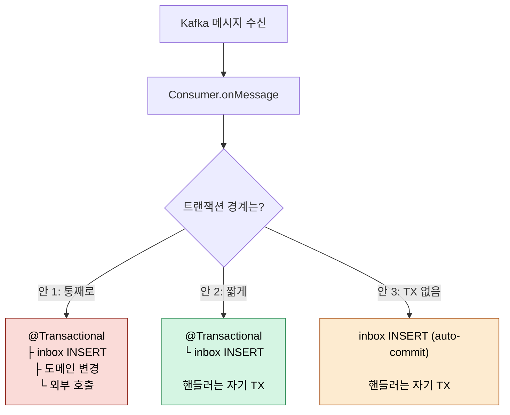
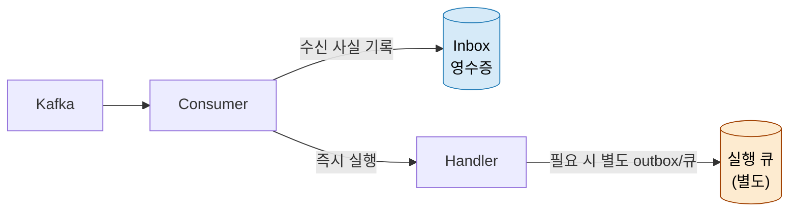
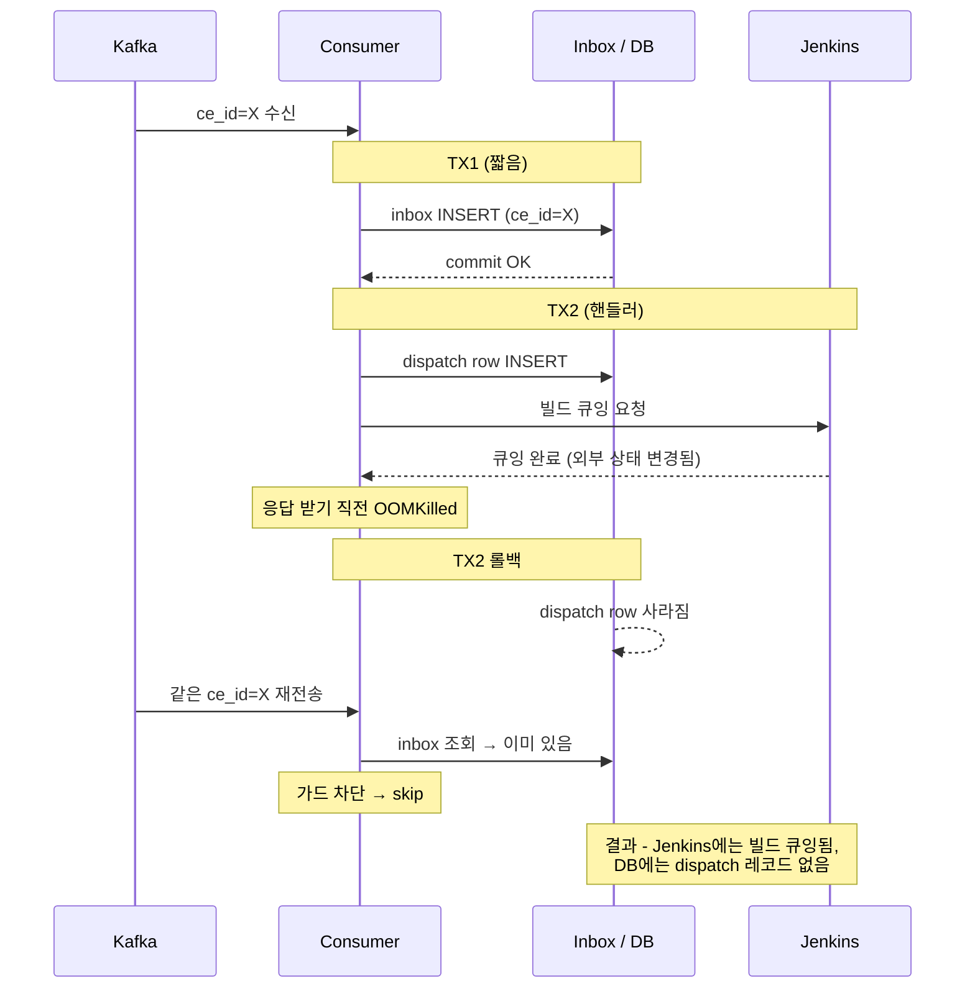
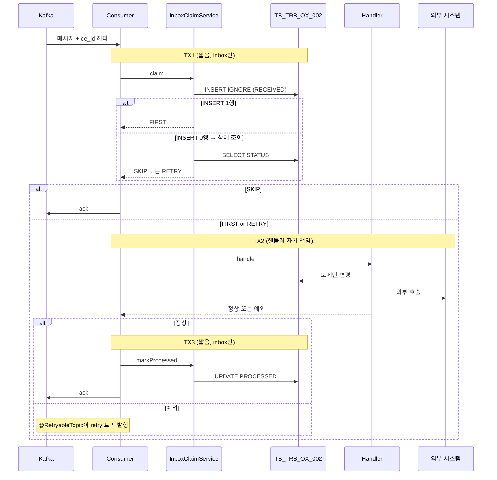

## 학습 목표

> Inbox 패턴이 *어디까지 보호하고, 어디서부터 보호하지 못하는지*의 사정거리를 이해한다.

이 장을 다 읽고 다음 다섯 가지에 자신 있게 답할 수 있으면 학습이 완료된다.

1. 컨슈머 진입점에서 *어디에 트랜잭션 경계를 둘지*에 따른 트레이드오프를 설명할 수 있다.
2. Inbox 패턴이 *DB 트랜잭션 안의 부작용*만 보호하고 외부 시스템 부작용은 보호하지 못하는 이유를 설명할 수 있다.
3. 외부 API·이메일 발송 같은 *비커밋 가능한* 부작용을 처리하는 패턴을 설명할 수 있다.
4. Spring Kafka에서 listener 트랜잭션과 Inbox 트랜잭션이 어떻게 결합되는지 설명할 수 있다.
5. `@Transactional(MANDATORY)`로 호출자 트랜잭션을 강제하는 패턴의 의의를 말할 수 있다.

# 컨슈머 진입점 트랜잭션 경계와 Inbox의 사정거리

---

> Inbox 패턴을 컨슈머에 붙일 때 "한 트랜잭션에 다 묶자"는 첫 충동은 안전해 보이지만 운영에서 정반대로 작동한다. Inbox 가드는 영수증(수신 사실)이지 실행 큐가 아니며, 외부 시스템 호출의 중복은 막아주지 않는다. 트랜잭션 경계를 짧게 자르고 외부 호출 멱등성은 별도 가드로 분리해야 두 책임이 서로의 발을 밟지 않는다.

[05-05](05-05.Inbox.md)가 Inbox 패턴 자체와 Outbox 대칭을 다루고, [05-07](05-07.Inbox%20트랜잭션%20오염과%20멱등%20어댑터.md)이 멱등 INSERT의 트랜잭션 오염 문제를 다룬다면, 본 문서는 그 위에서 **컨슈머 진입점에서 트랜잭션 경계를 어떻게 잡을지** 를 다룬다. 두 결정이 충돌할 때 무엇을 양보해야 하는지가 본문의 중심이다.


## 1. Inbox를 "어디서" 호출할 것인가

> Inbox 가드를 컨슈머 메서드 안에서 부르는 것은 모두 동의한다. 문제는 **그 호출을 감싸는 트랜잭션 경계가 어디까지 늘어나야 하는가** 다.

세 가지 후보가 있다.



### 1안

1안은 운영에서 가장 자주 깔리는 함정이다. 처음 짤 때 "원자성!"이라는 단어가 머리에 떠올라 무엇이든 한 트랜잭션에 묶고 싶어진다. 

- 하지만 핸들러가 Jenkins API, 외부 결제, 메일 발송 같은 부수 효과를 트리거하면 트랜잭션이 그 시간 동안 살아 있어야 한다. DB 락 보유, 커넥션 점유, 데드락 가능성이 모두 같이 늘어난다.

### 2안 

2안은 본 문서가 권장하는 길이다. Inbox INSERT 한 줄만 `@Transactional`로 짧게 묶고, 핸들러는 자기 책임으로 자기 트랜잭션을 연다. 

- 트랜잭션 두 개가 시간적으로 분리되므로 컨슈머가 락을 오래 잡지 않는다.

### 3안

3안은 [05-07](05-07.Inbox%20트랜잭션%20오염과%20멱등%20어댑터.md)에서 다룬 `INSERT IGNORE` 어댑터를 쓰면 가능하다. 

- 다만 [05-07 §1](05-07.Inbox%20트랜잭션%20오염과%20멱등%20어댑터.md)에서 본 것처럼 호출자가 `@Transactional(MANDATORY)`를 강제하지 않는 한 라이브러리 차원의 "올바른 사용 강제"가 약해진다. 안 2가 그 강제를 보존하면서 트랜잭션을 짧게 가져가는 절충안이다.


## 2. 영수증과 실행 큐는 다르다

> Inbox를 "처음 배울 때 그리는 그림" 과 "실제로 운영하는 그림" 의 가장 큰 차이가 이 분리다.

전통적인 Inbox 다이어그램은 다음처럼 그려진다.

```
Kafka Listener
  → Inbox 저장 (PENDING)
  → @Scheduled poller가 PENDING 행을 읽어 처리
  → 성공 시 COMPLETED 마킹
```

- 이 그림에서 Inbox는 **두 가지 역할을 동시에** 한다. 하나는 "이 메시지를 받았다는 영수증" 이고, 다른 하나는 "아직 처리하지 못한 작업 목록" 이다. 즉 영수증인 동시에 실행 큐다.

문제는 운영 규모가 커지면 이 둘이 서로 다른 압력을 받는다는 점이다. 영수증은 INSERT 한 번이면 끝나지만, 실행 큐는 지속적인 `SELECT ... WHERE status='PENDING' FOR UPDATE SKIP LOCKED` polling으로 DB를 두드린다. 

- 서비스가 5개로 늘어나면 polling도 5개로 늘어나고, 결국 RDB가 message broker 흉내를 내기 시작한다. Kafka를 도입했는데도 DB가 다시 큐가 되어버리는 회귀가 일어난다.

### 2.1 두 역할을 분리하면 보이는 것

영수증과 실행 큐를 분리해서 다시 그리면 다음과 같다.



이렇게 두면 Inbox는 **수신 사실 기록(durability + idempotency)** 만 책임진다. 실행은 Kafka thread에서 즉시 일어나거나, 무거운 경우 별도 실행 큐(Redis Stream, 내부 Kafka 토픽 등)로 분리한다. Inbox는 어느 쪽이든 "이 ce_id를 우리가 통과시켰는가" 만 답하면 끝이다.

운영 진화 경로를 정리하면 다음과 같이 단계별로 모양이 바뀐다.

1. **초기**: Scheduler polling 기반 Inbox. 구현이 가장 단순하고 1~2개 서비스에서는 문제가 없다.
2. **중간**: Inbox는 영수증 전용, 실행은 Redis Stream이나 별도 Kafka 토픽으로. polling 제거.
3. **대규모**: CDC(Debezium 등)로 Inbox INSERT를 외부 큐로 흘려보내 polling을 완전히 없앤다.

이 진화는 한 번에 가지 않는다. 처음부터 Redis Stream을 끌어오면 인프라 부담이 학습 비용보다 커진다. 다만 "Inbox = 영수증" 이라는 분리는 **초기부터** 가져가는 것이 좋다. 그래야 중간 단계로 넘어갈 때 코드 변경이 최소화된다.


## 3. Inbox 가드의 사정거리 — 내 DB는 막지만 외부는 못 막는다

> Inbox는 "이 메시지를 처리한 적이 있는가" 를 답한다. **"이 메시지가 만들어낸 부수 효과가 외부 시스템에서 한 번만 일어났는가"** 는 답하지 않는다.

이 차이를 무시하면 "Inbox 가드 붙였으니 안전해요" 라고 말하면서 외부 시스템에는 같은 작업이 두 번 들어가는 상황이 벌어진다.

### 3.1 가드가 막지 못하는 시나리오



- 이 시퀀스에서 Inbox 가드는 자기 일을 정확히 했다. "이 메시지는 이미 처리 시도했음" 을 알렸다. 문제는 핸들러가 외부 호출을 성공시킨 뒤 TX2가 롤백된 점이다. 외부 시스템의 상태는 트랜잭션 매니저의 통제 밖에 있어 회수되지 않는다.

### 3.2 두 종류의 가드는 직교한다

같은 비즈니스 사건의 부수 효과는 두 곳에서 일어난다.

| 부수 효과 발생 위치 | 막아주는 가드 | 메커니즘 |
|---|---|---|
| 내 시스템 DB | Inbox 가드 | `(ce_id, group)` unique constraint |
| 외부 시스템 (Jenkins, 결제 등) | 외부 호출용 멱등 키 | 호출에 멱등 키 부여, 외부가 중복 판정 |

두 가드는 같은 일을 하는 것처럼 보이지만 **서로 다른 구간의 서로 다른 문제** 를 막는다. Inbox 가드 하나로 "exactly-once" 가 달성되지 않는다. 정확히는 다음 두 가지가 모두 필요하다.

1. Inbox 가드: "내 DB에 같은 사건의 부수 효과가 두 번 쌓이지 않게 한다."
2. 외부 호출 멱등성: "외부 시스템에 같은 호출이 두 번 가지 않게 한다 — 외부가 키를 보고 판정한다."

### 3.3 외부 호출 멱등성의 실무 형태

외부 시스템에 멱등 키를 어떻게 전달할까. 두 가지 방식이 흔하다.

첫째, **외부 시스템이 멱등 키를 받는 API를 제공** 하는 경우. Stripe의 `Idempotency-Key` 헤더가 대표적이다. 호출 측에서 ce_id나 비즈니스 ID를 헤더로 박으면, Stripe가 24시간 안의 같은 키 호출은 같은 결과를 반환한다. 호출자는 같은 키로 안심하고 재시도할 수 있다.

둘째, **외부 시스템 자체가 멱등인 작업** 인 경우. 예를 들어 Jenkins의 build queueing은 같은 `queueId`를 명시적으로 매칭하면 두 번 큐잉되지 않게 만들 수 있다. 우리 시스템이 queueId를 미리 발급해 두고 외부에 전달하면 외부가 그 키로 중복을 막아준다.

두 방식 모두 핵심은 같다 — **호출 측이 키를 만들어 가지고 가고, 외부가 그 키로 판정** 한다.


## 4. STATUS 컬럼을 도입할까 — 길 A vs 길 B

> Inbox 테이블에 처리 상태(`PENDING/PROCESSED/FAILED`)를 추가할지 말지는 자주 마주치는 결정이다. 더하면 자동 재시도가 가능해지지만, 자기 책임이 한 단계 늘어난다.

두 길을 표로 비교한다.

| | 길 A: 단순 가드 | 길 B: STATUS 컬럼 |
|---|---|---|
| 동작 | 한 번 통과한 ce_id는 두 번 처리 안 함 | RECEIVED/PROCESSED 구분, FAILED 시 재처리 |
| 핸들러 예외 시 | `@RetryableTopic` retry도 가드가 차단 → DLT 직행 | RECEIVED/FAILED 상태면 다음 polling에서 재처리 |
| 테이블 변경 | 없음 | STATUS, ATTEMPT_COUNT, LAST_ERROR 등 컬럼 추가 |
| 추가 로직 | 없음 | PROCESSED 마킹 트랜잭션, retry 게이트 등 |
| 잠재 함정 | DLT로 떨어진 메시지가 조용히 누적 | "PROCESSED 마킹 전 죽으면?" 시나리오 분석 필요 |
| 적합한 상황 | 핸들러가 일시적 실패에 강하고, 외부 호출이 별도 가드로 안전한 경우 | 일시적 실패에 약한 외부 호출이 핸들러 안에 있고, 자동 재시도가 비즈니스적으로 필요한 경우 |

### 4.1 길 A가 자동 재시도를 막는 이유

길 A에서 핸들러가 예외를 던지면 `@RetryableTopic`이 retry 토픽으로 재발행한다. 그런데 retry 메시지는 같은 ce_id를 그대로 가진다(원본 헤더 보존). Consumer가 retry 메시지를 받으면 inbox에 이미 행이 있으니 가드가 차단하고 핸들러는 호출되지 않는다. 결과적으로 3회 retry가 모두 차단되어 DLT로 떨어진다.

이게 의도된 동작인지 사고인지는 운영자가 결정해야 한다. 핸들러 실패가 거의 항상 "코드 버그 또는 데이터 이상" 이라면 자동 재시도는 무의미하므로 DLT 직행이 더 정직한 신호다. 반대로 일시적 네트워크 단절이 흔한 환경이라면 자동 재시도가 운영 부담을 줄여준다.

### 4.2 결정의 기준

다음 두 질문에 답해보면 길이 갈린다.

1. **핸들러 안에서 외부 호출이 일어나는가?** 일어나면 외부 호출 멱등성은 별도 가드로 풀어야 한다(§3 참조). 그 가드가 있으면 핸들러 실패의 대부분이 "외부 호출은 성공했는데 DB가 망가짐" 인데, 이 경우 retry 의미가 약하다 → 길 A.
2. **DLT 모니터링이 가능한가?** 길 A는 DLT가 1차 알림 채널이다. DLT 메시지 발생 시 알림이 뜨고 사람이 개입할 수 있다면 길 A로 충분하다. DLT를 잘 안 보는 조직이라면 길 B가 안전망 역할을 한다.

라이브러리 차원에서는 길 A를 기본값으로 두고, 길 B는 필요해질 때 컬럼을 추가하는 것이 유지보수 비용이 낮다. 처음부터 STATUS 컬럼을 두면 "쓰지 않는 상태" 가 운영 1년 차에 코드 곳곳에 남고, 그 상태를 다시 청소하는 비용이 들어간다.


## 5. MANDATORY를 유지하는 이유

> "단순 가드라면 그냥 디스패처에 `@Transactional`만 두고 호출하면 되지, 왜 가드 내부에 `MANDATORY`까지 박아두나?" 라는 질문이 나온다.

답은 "라이브러리는 잘못 쓰는 사용자를 막아야 하기 때문" 이다.

### 5.1 호출자 트랜잭션을 강제하지 않으면 생기는 일

`IdempotencyGuard.tryClaim()`을 propagation 없이 두고, 어떤 호출자가 `@Transactional` 없이 부르면 다음 일이 일어난다.

```
1. tryClaim() → 별도 TX1에서 inbox INSERT, COMMIT
2. 호출자가 후속 비즈니스 처리 (TX 없음, auto-commit씩 흩어짐)
3. 비즈니스 처리 도중 예외
4. 메시지 재전송 → tryClaim() 다시 호출
5. inbox에 이미 있음 → false 반환
6. 비즈니스 처리 영원히 스킵 = 메시지 유실
```

`MANDATORY`는 이 시퀀스를 1번 단계에서 끊는다. 호출자가 트랜잭션 없이 부르면 즉시 `IllegalTransactionStateException`이 터지고, 잘못된 사용이 운영에 도달하지 않는다.

### 5.2 안 2 패턴에서 MANDATORY가 작동하는 방식

본 문서가 권장하는 안 2(Inbox INSERT만 짧게 감싸는 TX)에서 `MANDATORY`는 다음처럼 작동한다.

```java
@Component
public class InboxClaimService {

    private final IdempotencyGuard guard;  // MANDATORY 가진 진짜 가드

    @Transactional   // ← 이 한 줄이 MANDATORY의 보호막이 된다
    public boolean claim(String msgId, String group, ...) {
        return guard.tryClaim(msgId, group, ...);
    }
}
```

`InboxClaimService.claim()` 자신이 `@Transactional`을 가지므로 그 안의 `guard.tryClaim()` 호출은 항상 활성 TX 안에서 일어난다. `MANDATORY` 제약은 충족된다. 동시에 `claim()` 자체는 INSERT 한 줄만 짧게 묶으므로 핸들러의 외부 호출과 무관하다. 컨슈머는 `claim()` 결과만 보고 다음 단계로 가면 된다.

이렇게 두 층의 책임이 깔끔하게 나뉜다.

- `IdempotencyGuard` (도메인 레벨): "호출 시 반드시 활성 TX가 있어야 한다" 는 계약을 코드로 박제.
- `InboxClaimService` (어댑터 레벨): 그 계약을 만족시키는 짧은 TX 한 개를 컨슈머에게 제공.

라이브러리 사용자(=컨슈머 작성자)는 `claim()` 한 줄만 부르면 되고, 트랜잭션 의미를 신경 쓸 필요가 없다.


## 6. TPS Executor에서의 적용 결정

> 본 문서의 원칙을 실제 코드에 적용할 때 어떤 결정을 했는지 정리한다. 같은 결정을 다른 프로젝트에서 마주칠 때 참고할 수 있다.

### 6.1 맥락

TPS Executor는 operator로부터 BuildCommand, DeployCommand, TestCommand 세 가지 커맨드를 Kafka로 받는다. 각 커맨드는 도메인별 handler(예: `JenkinsBuildCommandHandler`)에 위임되며, handler가 `DispatchUseCase` 같은 use case를 호출해 Jenkins API 같은 외부 시스템에 영향을 준다.

### 6.2 결정 사항

1. **Inbox INSERT는 컨슈머 진입점에서 짧은 TX로** — `InboxClaimService.claim()`이 `@Transactional`을 가지고 inbox INSERT 한 줄만 감싼다. 핸들러는 자기 트랜잭션을 자기 책임으로 연다.
2. **STATUS 컬럼 미도입** — 길 A 채택. 핸들러 예외 시 retry 토픽으로 재발행되어도 가드가 차단 → DLT 직행. DLT 알림을 1차 신호로 운영.
3. **외부 호출 멱등성은 별도 과제로 격리** — Jenkins API 중복 호출은 `queueId` 기반 매칭으로 별도 해결. Inbox 가드의 책임 밖이라는 점을 코드 주석과 문서에 명시.
4. **핸들러 인터페이스는 손대지 않음** — 기존 `BuildCommandHandler.handle()` 시그니처를 그대로 유지. msgId/topic/partition/offset 등 메타데이터는 컨슈머 진입점에서만 받아 `InboxClaimService`에 전달.

### 6.3 변경 영향 범위

| 영역 | 변경 |
|---|---|
| `message-lib` | `InboxClaimService` 신규, `InboxAutoConfiguration`에 빈 등록 |
| `executor/engine` | 컨슈머 3종에 `claim()` 호출 한 줄 + 메타데이터 헤더 추가 |
| 핸들러 코드 | 변경 없음 |
| inbox 테이블 | 변경 없음 (`TB_TRB_OX_002` 그대로) |
| 외부 호출 코드 | 변경 없음 (별도 과제) |

이 영향 범위가 본 문서 원칙의 실효성을 보여준다. "트랜잭션 경계를 어디에 잡느냐" 결정이 정확하면 핸들러와 외부 호출 영역은 손대지 않고도 멱등성을 보강할 수 있다.


## 7. 흐름 시나리오 — 길 B를 시간 축에 펼쳐 보기

> 길 B(STATUS 컬럼 + 자동 재시도)가 실제 운영 중 어떻게 동작하는지 시나리오 6개로 본다. 시간 축을 따라가며 각 트랜잭션이 무엇을 하는지 추적하면, 설계 의도와 잔여 위험이 함께 드러난다.

### 7.0 전체 그림



세 박스가 시간적으로 분리되어 있다는 점이 핵심이다. TX1과 TX3은 수 ms 안에 끝나고, TX2는 외부 호출 포함해서 수 초까지 늘어날 수 있지만 그 시간 동안 inbox 락을 잡고 있지 않는다.

### 7.1 시나리오 1 — 정상 흐름 (95% 이상의 메시지가 따라가는 경로)

```
시각  사건                                          DB 상태
t1    Consumer가 ce_id=A 메시지 받음
t2    TX1 시작
t3      INSERT IGNORE → 1행 성공                    (A, group, RECEIVED, NULL)
t4    TX1 commit
t5    claim() returns FIRST
t6    handler.handle() 호출
t7      TX2 시작 (핸들러 책임)
t8        dispatch row INSERT
t9        외부 API 호출 → 응답 OK
t10     TX2 commit                                  (dispatch row 확정)
t11   TX3 시작
t12     UPDATE STATUS='PROCESSED'                   (A, group, PROCESSED, t12)
t13   TX3 commit
t14   Kafka ack
```

읽기 포인트는 세 가지다. TX1과 TX3은 inbox 테이블만 짧게 건드린다. TX2는 핸들러가 자기 트랜잭션으로 도메인 로직과 외부 호출을 함께 처리한다. 모든 게 잘 되면 inbox에 PROCESSED 상태 row 하나가 남는다.

### 7.2 시나리오 2 — 중복 메시지 (SKIP)

Kafka 리밸런싱이나 producer 재시도로 같은 메시지가 다시 도착하는 경우.

```
시각  사건                                          DB 상태
(이전에 ce_id=A 정상 처리 완료)                      (A, group, PROCESSED, ...)
t10   Consumer가 ce_id=A 다시 받음
t11   TX1 시작
t12     INSERT IGNORE → 0행 (PK 충돌)
t13     SELECT STATUS WHERE (A, group) → 'PROCESSED'
t14   TX1 commit
t15   claim() returns SKIP
t16   Consumer return (핸들러 호출 안 함)
t17   Kafka ack
```

TX1 안에서 INSERT IGNORE + SELECT 두 쿼리가 일어나지만 둘 다 inbox 테이블만 본다. 핸들러는 호출되지 않으므로 외부 시스템에 같은 작업이 두 번 들어가지 않는다.

### 7.3 시나리오 3 — 일시적 실패 후 retry로 회복 (길 B의 진짜 가치)

핸들러가 일시적 실패로 예외 던졌다가 retry에서 회복하는 시나리오. 길 A에서는 가드 차단으로 막혔던 경로다.

```
시각  사건                                          DB 상태
t1    Consumer가 ce_id=A 받음 (원본 토픽)
t2    TX1: INSERT IGNORE → 1행                       (A, group, RECEIVED, NULL)
t3    claim() returns FIRST
t4    handler.handle() 호출
t5      TX2 시작
t6        dispatch row INSERT 시도
t7        외부 API 호출 → ConnectException
t8      TX2 rollback (dispatch row 사라짐)
t9    handler가 RuntimeException throw
t10   @RetryableTopic이 retry-0 토픽으로 발행 (1초 후)
t11   markProcessed 호출 안 됨                       (A, group, RECEIVED, NULL) ← 그대로
t12   원본 메시지 ack (retry 사본은 retry-0에 있음)

... 1초 후 ...

t20   Consumer가 retry-0 토픽에서 같은 ce_id=A 받음 (topic만 다름, ce_id 동일)
t21   TX1: INSERT IGNORE → 0행 (PK 충돌)
t22     SELECT STATUS → 'RECEIVED'
t23   claim() returns RETRY
t24   handler.handle() 호출
t25     TX2: dispatch row INSERT
t26     외부 API 호출 → 성공
t27     TX2 commit
t28   TX3: UPDATE STATUS='PROCESSED'                 (A, group, PROCESSED, t28)
t29   Kafka ack
```

핵심은 두 군데다. t11에서 markProcessed가 호출되지 않으므로 inbox는 RECEIVED 그대로 남는다. t23에서 SKIP이 아니라 RETRY가 떨어지므로 핸들러가 재호출된다. 운영자 개입 없이 일시적 실패가 복구된다.

### 7.4 시나리오 4 — 3회 retry 모두 실패 → DLT

복구 불가능한 진짜 실패. 코드 버그나 데이터 이상이 원인일 때.

```
시각  사건                                          DB 상태
t1    원본 토픽 ce_id=A 받음
t2    claim() FIRST → handler 예외                   (A, group, RECEIVED, NULL)
t3    retry-0 토픽 발행

t10   retry-0 받음
t11   claim() RETRY → handler 예외                   (A, group, RECEIVED, NULL)
t12   retry-1 토픽 발행

t20   retry-1 받음
t21   claim() RETRY → handler 예외                   (A, group, RECEIVED, NULL)
t22   DLT 토픽 발행

t30   DLT 토픽 메시지 → onDlt() 로깅
```

inbox에는 RECEIVED 상태로 남는다. 이게 PROCESSED가 아닌 채로 남아 있다는 사실 자체가 "어딘가에서 막혔다" 는 신호다. DLT 로그가 1차 알림이고, RECEIVED-only 메시지를 주기적으로 집계하면 2차 알림이 된다.

### 7.5 시나리오 5 — TX3 마킹 직전 죽음 (길 B의 함정)

가장 위험한 시나리오다. **inbox 가드만으로는 막지 못한다** 는 점을 보여준다.

```
시각  사건                                          외부 상태
t1    원본 토픽 ce_id=A 받음
t2    TX1 FIRST: inbox INSERT (RECEIVED)            inbox: (A, RECEIVED)
t3    handler.handle()
t4      TX2: dispatch row INSERT
t5      외부 API 호출 → 성공, 외부 시스템 상태 변경  외부: 작업 큐잉됨
t6    TX2 commit                                    DB: dispatch row 확정
t7    Consumer JVM OOMKilled (TX3 시작 전)          ← 사고 발생
t8    Kafka offset 미커밋

t20   Consumer 재시작 → 같은 메시지 재수신
t21   claim() → INSERT IGNORE 0행 → STATUS='RECEIVED' → RETRY
t22   handler.handle()
t23     TX2: dispatch row INSERT (또!)              DB: dispatch row 중복
t24     외부 API 호출 → 외부 시스템 작업 또 큐잉    외부: 작업 2개 큐잉
t25     TX2 commit
t26   TX3 commit                                    inbox: (A, PROCESSED)
```

t5~t6에서 외부 효과는 이미 일어났는데 t7에서 TX3 마킹을 못 했다. t21의 RETRY 판정이 정직하게 일하지만, 외부 시스템 입장에서는 같은 작업이 두 번 들어온다.

이 함정을 막으려면 두 가지 보강이 필요하다. 외부 호출 자체에 멱등 키(`Idempotency-Key`, `queueId` 같은)를 부여해 외부가 중복 판정. 또 DB의 도메인 테이블에도 비즈니스 키로 UNIQUE 제약을 걸어 dispatch row 중복을 핸들러 안에서 차단. 이 두 가드는 inbox 가드와 직교하므로 §3에서 다룬 "외부 호출 멱등성 별도 과제" 로 분리한다.

### 7.6 시나리오 6 — Fan-out (다른 컨슈머 그룹)

같은 메시지를 executor-group과 analytics-group이 동시에 소비하는 경우.

```
t1    Producer 발행: ce_id=A
t2    executor-group 받음 → TX1 INSERT → (A, executor-group, RECEIVED)
t3    analytics-group 받음 → TX1 INSERT → (A, analytics-group, RECEIVED)
t4    두 그룹 독립적으로 핸들러 실행
t5    두 그룹 각자 PROCESSED 마킹
```

PK가 `(MSG_ID, CONSUMER_GROUP)` 복합 키이므로 그룹마다 별도 row가 만들어진다. fan-out은 정상 동작하며 한쪽 그룹의 실패가 다른 그룹에 영향을 주지 않는다. `IdempotencyGuardIT.R2`가 이 시나리오를 검증한다.

### 7.7 흐름 요약 — 세 트랜잭션의 책임

| TX | 책임 | 길이 | 무엇을 만지나 |
|----|------|------|--------------|
| TX1 (claim) | "받았다는 영수증 발급" | 짧음 (수 ms) | inbox 테이블만 |
| TX2 (handler) | "비즈니스 처리" | 길 수 있음 (수 초) | 도메인 테이블 + 외부 호출 |
| TX3 (markProcessed) | "영수증에 완료 도장" | 짧음 (수 ms) | inbox 테이블만 |

이 분리가 가져다주는 효과는 네 가지다. 컨슈머가 락을 오래 잡지 않는다(TX1/TX3만 inbox 락 보유). 핸들러는 자기 트랜잭션 자기 책임이라 외부 호출 위치 결정이 자유롭다. markProcessed가 안 된 RECEIVED는 retry 시 자동으로 재처리된다. 한 번 PROCESSED로 도장 찍힌 메시지는 두 번 다시 핸들러를 깨우지 않는다.

다만 시나리오 5의 함정이 남는다. 이 trade-off를 받아들이는 대신 외부 호출 멱등성을 별도 가드로 풀어야 비로소 "비즈니스가 한 번만 실행됨" 이 완성된다.


## 8. 한 줄 결론

> Inbox는 **수신 사실의 영수증** 이지 실행 큐가 아니다. 컨슈머 진입점에서 짧은 트랜잭션으로 영수증만 발급하고, 핸들러는 자기 트랜잭션을 자기 책임으로 연다. 외부 시스템 호출의 중복은 Inbox가 아니라 외부 호출 자체의 멱등 키로 막는다. 두 가드는 직교이며, 둘 다 있어야 비로소 "비즈니스가 한 번만 실행됐다" 가 성립한다.


## 면접 대비 Q&A

> 면접에서 자주 나오는 형태로 5개. 답을 보지 않고 먼저 입으로 답해 본 뒤 비교한다.

### Q1. 컨슈머 진입점에서 트랜잭션 경계를 어디에 둬야 하나?

세 가지 후보가 있다. (1) `@KafkaListener` 메서드 전체. (2) 진입점 내부의 서비스 메서드. (3) Inbox INSERT만 별도. 일반적으로 (2)가 좋다. listener 자체는 *트랜잭션 외*에서 메시지 디코딩만 하고, 서비스 메서드 안에서 *Inbox INSERT + 도메인 변경*을 같은 트랜잭션에 묶는다. (1)은 메시지 디코딩 실패까지 트랜잭션 안에 들어가 비용이 크고, (3)은 부분 실패 위험이 있다.

### Q2. Inbox 패턴이 외부 시스템 부작용을 보호하지 못하는 이유는?

DB 트랜잭션이 *외부 시스템에 닿지 못하기* 때문이다. 트랜잭션이 commit 직전에 외부 API를 호출했다가 commit이 실패하면 *API 호출은 이미 일어났고* 도메인 변경만 롤백된다. 반대로 commit 후 외부 API 호출이 실패하면 *도메인은 바뀌었는데 외부는 모르는 상태*다. Inbox는 *DB 트랜잭션 안의 부작용*에만 멱등성을 보장하지, 그 밖의 부작용에는 무력하다.

### Q3. 외부 API·이메일 같은 부작용을 어떻게 멱등하게 만드나?

세 가지 접근이 있다. (1) *외부 시스템 측 멱등 키* — `Idempotency-Key` 헤더 같은 표준을 활용해 외부 측에서 중복을 차단. (2) *Outbox 패턴 재활용* — DB 트랜잭션에 "이메일 발송 작업"을 outbox row로 적재하고, 별도 워커가 발송. 발송 실패는 워커 retry로. (3) *Saga* — 외부 호출도 단계로 보고 보상 트랜잭션으로 되감기. 셋 다 *외부와 DB 사이의 비원자성*을 다른 방식으로 푸는 패턴이다.

### Q4. Spring Kafka에서 listener 트랜잭션과 Inbox 트랜잭션은 어떻게 결합되나?

`@KafkaListener`에 `containerFactory`로 Kafka 트랜잭션을 지정하면 *consume offset 커밋*이 Kafka 트랜잭션에 묶인다. listener 메서드 안에서 `@Transactional`을 쓰면 *DB 트랜잭션*이 시작된다. 두 트랜잭션은 *서로 다른 자원 매니저*라 chained transaction manager로 묶지 않으면 부분 실패가 가능하다. 그래서 일반적으로는 *Kafka 트랜잭션은 끄고*, manual ack + DB 트랜잭션만 사용한다. Inbox PK 위반이 다음 재시도를 차단해 멱등성을 강제한다.

### Q5. `@Transactional(MANDATORY)` 가드의 의의는?

호출자가 *반드시 트랜잭션 안에서* 호출하도록 강제한다. Inbox INSERT 메서드에 MANDATORY를 걸면, 호출자 핸들러에 `@Transactional`이 빠져 있을 때 *런타임에 즉시 예외*가 난다. 이렇게 코드로 강제하면 "Inbox INSERT 후 비즈니스 로직이 다른 트랜잭션에서 실행되어 부분 실패가 나는" 사고를 *PR 단계 이전*에 잡을 수 있다. 라이브러리·starter가 함정을 코드로 방어하는 패턴이다.


## 관련 문서

- [05-05.Inbox](05-05.Inbox.md) — Inbox 패턴 본문과 Outbox 대칭, Idempotent Consumer 비교
- [05-07.Inbox 트랜잭션 오염과 멱등 어댑터](05-07.Inbox%20트랜잭션%20오염과%20멱등%20어댑터.md) — 멱등 INSERT의 트랜잭션 오염과 INSERT IGNORE 어댑터
- [04-08.Exactly-once 의미론과 Consumer Idempotency](04-08.Exactly-once%20의미론과%20Consumer%20Idempotency.md) — at-least-once 위에서 멱등을 만들어내는 일반론
- [05-03.Outbox](05-03.Outbox.md) — 송신 측의 짝이 되는 dual-write 해결 패턴
