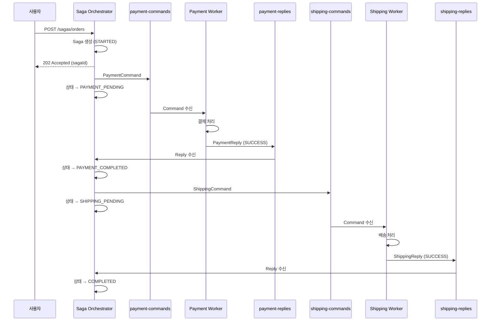
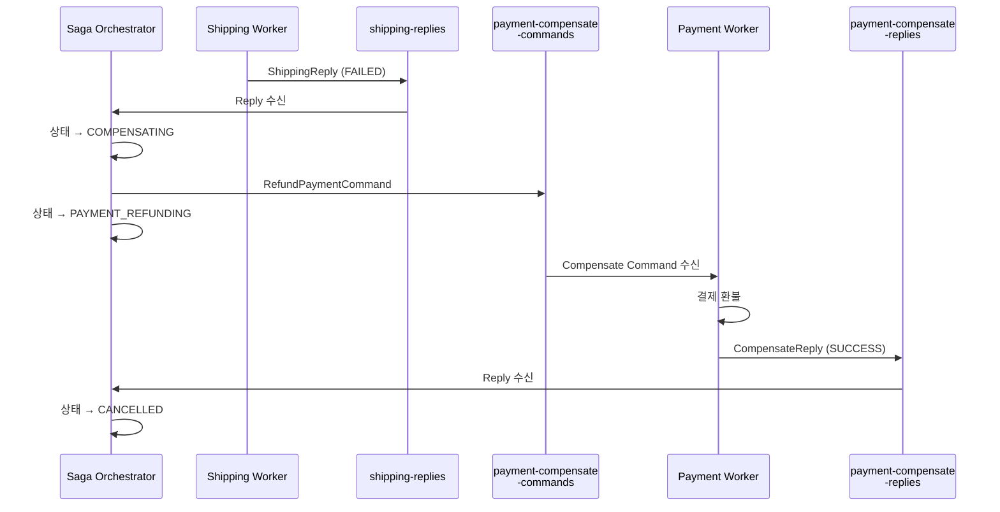
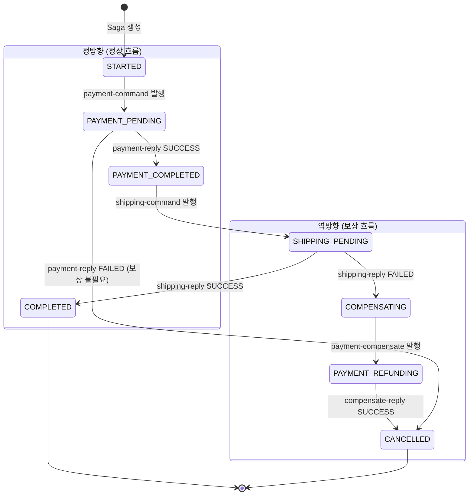
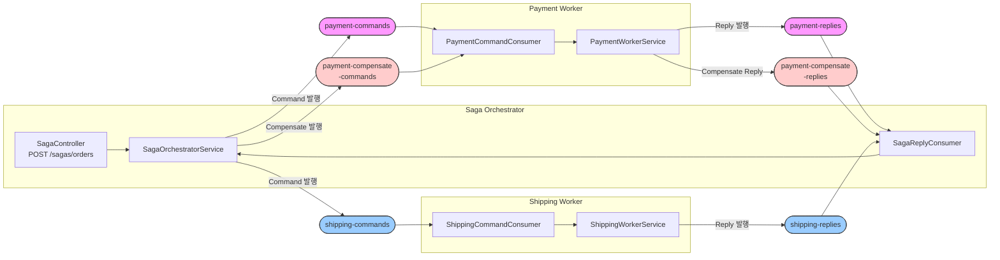

# Orchestration Saga란?

---

> 오케스트레이션은 중앙 조정자(Orchestrator)가 워크플로우의 각 단계를 명시적으로 제어하는 방식입니다. 코레오그래피 방식이 느슨한 결합을 제공하지만, 워크플로우가 복잡해지면 전체 흐름 파악이 어렵습니다. 오케스트레이션은 로직을 한 곳에 관리하므로 가시성을 제공합니다.

## 코레오그래피와의 차이

| 측면                | 코레오그래피                 | 오케스트레이션                        |
| ------------------- | ---------------------------- | ------------------------------------- |
| **제어 방식**       | 각 서비스가 자율적으로 반응  | Orchestrator가 명시적으로 지시        |
| **워크플로우 위치** | 여러 서비스에 분산           | Orchestrator에 집중                   |
| **통신 패턴**       | Event (Pub/Sub)              | Command-Reply (Request/Response)      |
| **결합도**          | 매우 낮음                    | 중간 (Orchestrator와 결합)            |
| **가시성**          | 낮음 (이벤트 추적 필요)      | 높음 (Orchestrator가 모든 상태 관리)  |
| **디버깅**          | 어려움 (분산됨)              | 쉬움 (중앙 집중)                      |
| **확장성**          | 서비스 추가 시 이벤트만 구독 | 서비스 추가 시 Orchestrator 수정 필요 |
| **단일 장애점**     | 없음                         | Orchestrator가 SPoF                   |

## 아키텍쳐

### 정상 흐름



### 보상 흐름



# 상태머신 설계

---

Orchestrator의 핵심 역할은 "지금 이 Saga가 어디까지 진행되었는가?"를 추적하는 것입니다. 상태 머신은 허용된 전이만 명시적으로 정의하여 이 문제를 해결하여 정의되지 않은 전이는 발생할 수 없으므로 예상치 못한 상태 변경이 차단되도록 합니다.

```java
public enum SagaState {
    // ── 정방향: 정상 흐름 ──
    STARTED,              // Saga 생성됨, 아직 아무 Command도 발행하지 않은 초기 상태
    PAYMENT_PENDING,      // 결제 Command 발행함, Worker의 Reply를 기다리는 중
    PAYMENT_COMPLETED,    // 결제 성공 Reply 수신, 다음 단계(배송) 진행 가능
    SHIPPING_PENDING,     // 배송 Command 발행함, Worker의 Reply를 기다리는 중

    // ── 역방향: 보상 흐름 ──
    COMPENSATING,         // 배송 실패 → 이전 단계의 보상이 필요한 상태
    PAYMENT_REFUNDING,    // 결제 환불 Command 발행함, 환불 Reply를 기다리는 중

    // ── 종료 상태 ──
    COMPLETED,            // 모든 단계 성공 (최종 성공)
    CANCELLED             // 실패 또는 보상 완료 (최종 실패)
}
```

## 상태 전이 다이어그램



전이 규칙을 표로 정리하면 다음과 같습니다.

| 현재 상태         | 트리거        | 다음 상태         | Orchestrator 행동                     |
| ----------------- | ------------- | ----------------- | ------------------------------------- |
| STARTED           | Saga 생성     | PAYMENT_PENDING   | payment-command 발행                  |
| PAYMENT_PENDING   | Reply SUCCESS | PAYMENT_COMPLETED | 상태 저장만 (중간 단계)               |
| PAYMENT_PENDING   | Reply FAILED  | CANCELLED         | 종료 (결제가 안 됐으므로 보상 불필요) |
| PAYMENT_COMPLETED | 자동 전이     | SHIPPING_PENDING  | shipping-command 발행                 |
| SHIPPING_PENDING  | Reply SUCCESS | COMPLETED         | 종료 (전체 성공)                      |
| SHIPPING_PENDING  | Reply FAILED  | COMPENSATING      | 보상 흐름 진입                        |
| COMPENSATING      | 자동 전이     | PAYMENT_REFUNDING | payment-compensate 발행               |
| PAYMENT_REFUNDING | Reply SUCCESS | CANCELLED         | 종료 (보상 완료)                      |

- PAYMENT_PENDING에서 실패하면 바로 CANCELLED가 되는 이유는 아직 결제가 처리되지 않았으므로 되돌릴 것이 없기 때문이다.
- 반면 SHIPPING_PENDING에서 실패하면 이미 완료된 결제를 환불해야 하므로 COMPENSATING으로 전환한다.

## Saga 테이블 설계

일반적으로 Saga 타입별로 테이블을 분리하는 것이 명확합니다. 주문 Saga의 상태머신(PAYMENT_PENDING -> SHIPPING_PENDING)과 환불 Saga의 상태머신(REFUND_PENDING -> NOTIFICATION_PENDING)은 전이 규칙이 완전히 다르기 때문입니다.  같은 테이블에 넣으면 state값이 혼재되어 인덱스가 복잡해집니다.

- **핵심 원칙은 하나의 워크플로우 = 하나의 Saga, 하나의 State 필드** 입니다.

## 트랜잭션 종류

### Compensable Transaction(보상 가능 트랜잭션)

Saga의 초반부에 위치하는 트랜잭션이며, 이 트랜잭션들은 각각 대응하는 보상 트랜잭션을 가지고 있습니다. 이후 단계에서 실패가 발생하면 보상 트랜잭션으로 되돌립니다.

### Pivot Transaction(피벗 트랜잭션)

Saga의 중간에 위치하는 분기점입니다. 이 트랜잭션이 성공하면 Saga 전체가 성공한 것으로 확정짓습니다. 반대로 이 트랜잭션이 실패하면 앞서 실행된 보상 가능 트랜잭션을 모두 되돌려야 합니다.

### Retriable Transaction(재시도 가능 트랜잭션)

피벗 이후에 나타나는 모든 트랜잭션들을 의미하며, 이 트랜잭션들은 보상 트랜잭션이 없습니다.

- ex) 알람 발송같이 롤백할 수 없는 로직들

# 상태 다이어그램 메시지 설계

---

상태 전이를 정의했으니, 다음 단계는 각 전이에 필요한 메시지를 도출하는 것입니다.

## 메시지 타입 분류 

Orchestration SAGA에서 메시지는 4가지로 분류됩니다.

| 타입                   | 정의                          | 방향                   | 네이밍                                     | 트리거                            |
| ---------------------- | ----------------------------- | ---------------------- | ------------------------------------------ | --------------------------------- |
| **Command**            | 상태 전이를 유발하는 **의도** | Orchestrator → Service | 명령형 (`Reserve~`, `Process~`, `Cancel~`) | 상태 다이어그램의 **화살표 시작** |
| **Success Event**      | 상태 전이 **완료 사실**       | Service → Orchestrator | 과거분사 (`~Reserved`, `~Completed`)       | 상태 다이어그램의 **화살표 도착** |
| **Failure Event**      | 상태 전이 **실패 사실**       | Service → Orchestrator | `~Failed` 접미사                           | 분기(alt) 경로 진입               |
| **Compensation Event** | **보상 완료** 사실            | Service → Orchestrator | 과거분사 (`~Released`, `~Refunded`)        | 보상 화살표 도착                  |

### 도출 규칙

1. **상태 노드**:  SagaState enum
2. **정방향 화살표**: Command 발행 + Success/Failure Event 수신
3. **보상 화살표**: Compensation Command 발행 + Compensation Event 수신
4. **분기 조건**: Success Event -> 다음 상태 / Failure Event → 보상 또는 실패

## 토픽 설계

| 토픽명                        | 메시지 타입              | 발행자          | 구독자          | 설명             |
| ----------------------------- | ------------------------ | --------------- | --------------- | ---------------- |
| `payment-commands`            | PaymentCommand           | Orchestrator    | Payment Worker  | 결제 요청 커맨드 |
| `payment-replies`             | PaymentReply             | Payment Worker  | Orchestrator    | 결제 처리 결과   |
| `payment-compensate-commands` | PaymentCompensateCommand | Orchestrator    | Payment Worker  | 결제 환불 커맨드 |
| `payment-compensate-replies`  | PaymentCompensateReply   | Payment Worker  | Orchestrator    | 환불 처리 결과   |
| `shipping-commands`           | ShippingCommand          | Orchestrator    | Shipping Worker | 배송 요청 커맨드 |
| `shipping-replies`            | ShippingReply            | Shipping Worker | Orchestrator    | 배송 처리 결과   |

토픽을 상세하게 나누는 이유는 각 워커/방향/작업으로 토픽을 명확히 분리하면 메시지 타입이 명확해지고, 각 토픽의 파티션/보존기간을 설정해서 모니터링으로 파악하기 좋습니다.



# 구현

---

## 공통 패턴

Orchestrator와 Worker는 역할이 다르지만 통신 구조는 동일하다.

```bash
┌──────────────────────────────────────────────────┐
│  Orchestrator                                     │
│    ├─ @KafkaListener (Reply 수신)                  │
│    │    └→ handleReply() — 상태 전이 + 다음 Command │
│    └─ kafkaTemplate.send() (Command 발행)          │
├──────────────────────────────────────────────────┤
│  Worker                                           │
│    ├─ @KafkaListener (Command 수신)                │
│    │    └→ processCommand() — 비즈니스 로직 실행     │
│    └─ kafkaTemplate.send() (Reply 발행)            │
└──────────────────────────────────────────────────┘
```

## Saga Orchestrator 구현

### Saga 엔티티

```java
@Entity @Table(name = "sagas")
@Data @Builder @NoArgsConstructor @AllArgsConstructor
public class Saga {

    @Id
    private String sagaId;
    private String orderId;
    private String userId;
    private String productId;
    private Integer quantity;
    private BigDecimal totalAmount;

    @Enumerated(EnumType.STRING)
    private SagaState state;

    private String paymentId;
    private String shippingId;
    private String errorMessage;

    @CreatedDate  private Instant createdAt;
    @LastModifiedDate private Instant updatedAt;
    @Version private Long version;  // 낙관적 락
}
```

### Reply 리스너

오케스트레이터는 3개의 reply 토픽을 구독하여 Service의 handleReply 메서드를 호출합니다.

```java
@Component
@RequiredArgsConstructor
public class SagaReplyConsumer {

    private final SagaOrchestratorService orchestrator;
		
  	// 결제 이벤트 응답
    @KafkaListener(topics = "payment-replies", groupId = "saga-orchestrator")
    public void onPaymentReply(PaymentReply reply) {
        orchestrator.handlePaymentReply(reply);
    }

  	// 배송 이벤트 응답
    @KafkaListener(topics = "shipping-replies", groupId = "saga-orchestrator")
    public void onShippingReply(ShippingReply reply) {
        orchestrator.handleShippingReply(reply);
    }

  	// 결제 이벤트 보상 응답
    @KafkaListener(topics = "payment-compensate-replies",
                   groupId = "saga-orchestrator")
    public void onCompensateReply(PaymentCompensateReply reply) {
        orchestrator.handleCompensateReply(reply);
    }
}
```

### Orchestrator Service

핵심은 상태 전이 + Command 발행 쌍입니다. 상태를 먼저 DB에 저장한 후 Command를 발행하여, 크래시 시 마지막 상태에 재개할 수 있도록 한다.

```java
@Service
@RequiredArgsConstructor
public class SagaOrchestratorService {

    private final SagaRepository sagaRepository;
    private final KafkaTemplate<String, Object> commandTemplate;

    // ── Saga 시작 ──
    @Transactional
    public Saga startSaga(CreateOrderRequest request) {
        Saga saga = Saga.create(request);  // state = STARTED
        sagaRepository.save(saga);
        sendCommand(saga, SagaState.PAYMENT_PENDING,
                "payment-commands", PaymentCommand.from(saga));
        return saga;
    }

    // ── Reply 핸들러 (상태 머신의 전이) ──
  	// 결제 응답
    @Transactional
    public void handlePaymentReply(PaymentReply reply) {
        Saga saga = findSaga(reply.getSagaId());

        if (reply.isSuccess()) {
            saga.setPaymentId(reply.getPaymentId());
            sendCommand(saga, SagaState.SHIPPING_PENDING,
                    "shipping-commands", ShippingCommand.from(saga));
        } else {
            transition(saga, SagaState.CANCELLED, reply.getErrorMessage());
        }
    }

  	// 배송 응답
    @Transactional
    public void handleShippingReply(ShippingReply reply) {
        Saga saga = findSaga(reply.getSagaId());

        if (reply.isSuccess()) {
            saga.setShippingId(reply.getShippingId());
            transition(saga, SagaState.COMPLETED, null);
        } else {
            // 보상 흐름 시작
            sendCommand(saga, SagaState.PAYMENT_REFUNDING,
                    "payment-compensate-commands",
                    RefundPaymentCommand.from(saga));
        }
    }

    // 보상 응답
    @Transactional
    public void handleCompensateReply(PaymentCompensateReply reply) {
        transition(findSaga(reply.getSagaId()), SagaState.CANCELLED, null);
    }

    // ── 공통 헬퍼 ──
    private void sendCommand(Saga saga, SagaState nextState,
                             String topic, Object command) {
        transition(saga, nextState, null);
        commandTemplate.send(topic, saga.getSagaId(), command);
    }

    private void transition(Saga saga, SagaState state, String error) {
        saga.setState(state);
        saga.setErrorMessage(error);
        sagaRepository.save(saga);
    }

    private Saga findSaga(String sagaId) {
        return sagaRepository.findById(sagaId)
                .orElseThrow(() -> new SagaNotFoundException(sagaId));
    }
}
```

## 결제 서비스

```java
@Component
@RequiredArgsConstructor
public class PaymentCommandConsumer {

    private final PaymentWorkerService workerService;

  	// 결제 명령
    @KafkaListener(topics = "payment-commands", groupId = "payment-worker")
    public void onPaymentCommand(PaymentCommand command) {
        workerService.processPayment(command);
    }

  	// 결제 보상 명령
    @KafkaListener(topics = "payment-compensate-commands",
                   groupId = "payment-worker")
    public void onCompensateCommand(PaymentCompensateCommand command) {
        workerService.processRefund(command);
    }
}
```

```java
@Service
@RequiredArgsConstructor
public class PaymentWorkerService {

    private final PaymentRepository paymentRepository;
    private final KafkaTemplate<String, Object> replyTemplate;

    @Transactional
    public void processPayment(PaymentCommand command) {
        Payment payment = Payment.from(command);  // status = PROCESSING
        paymentRepository.save(payment);

        boolean success = paymentGateway.charge(payment);

        if (success) {
            payment.complete();
            paymentRepository.save(payment);
            replyTemplate.send("payment-replies", command.getSagaId(),
                    PaymentReply.success(command, payment));
        } else {
            payment.fail("Insufficient funds");
            paymentRepository.save(payment);
            replyTemplate.send("payment-replies", command.getSagaId(),
                    PaymentReply.failure(command, "Insufficient funds"));
        }
    }

    @Transactional
    public void processRefund(PaymentCompensateCommand command) {
        Payment payment = paymentRepository.findById(command.getPaymentId())
                .orElseThrow();

        if (payment.getStatus() != PaymentStatus.COMPLETED) return;

        payment.refund();
        paymentRepository.save(payment);
        replyTemplate.send("payment-compensate-replies", command.getSagaId(),
                PaymentCompensateReply.success(command, payment));
    }
}
```


## 배송 서비스

```java
@Component
@RequiredArgsConstructor
public class ShippingCommandConsumer {

    private final ShippingWorkerService workerService;

  	// 배송 명령
    @KafkaListener(topics = "shipping-commands", groupId = "shipping-worker")
    public void onShippingCommand(ShippingCommand command) {
        workerService.processShipping(command);
    }
}
```

```java
@Service
@RequiredArgsConstructor
public class ShippingWorkerService {

    private final ShippingRepository shippingRepository;
    private final KafkaTemplate<String, Object> replyTemplate;

    @Transactional
    public void processShipping(ShippingCommand command) {
        Shipping shipping = Shipping.from(command);  // status = PREPARING
        shippingRepository.save(shipping);

        boolean success = warehouseClient.prepare(shipping);

        if (success) {
            shipping.ship();
            shippingRepository.save(shipping);
            replyTemplate.send("shipping-replies", command.getSagaId(),
                    ShippingReply.success(command, shipping));
        } else {
            shipping.fail("Out of stock");
            shippingRepository.save(shipping);
            replyTemplate.send("shipping-replies", command.getSagaId(),
                    ShippingReply.failure(command, "Out of stock"));
        }
    }
}
```

# 프레임워크 기반 상태 머신 구현

---

> 수동 구현은 상태 전이 로직의 완전한 통제권을 제공하지만, 워크플로우가 복잡해지면 if-else 분기와 상태 관리 코드가 급증한다. MassTransit 같은 프레임워크는 선언적 DSL로 상태 전이를 정의하여 이 문제를 해결한다.

## 수동 구현 vs 프레임워크 구현

| 측면 | 수동 구현 (Spring Boot + Kafka) | 프레임워크 구현 (MassTransit) |
| --- | --- | --- |
| **상태 전이 정의** | if-else / switch 분기로 직접 구현 | `Initially()`, `During()` DSL로 선언적 정의 |
| **상태 영속화** | JPA `@Entity` + `@Enumerated` 직접 관리 | `SagaStateMachineInstance` + EF Core 자동 관리 |
| **이벤트 상관관계** | `sagaId`를 메시지에 포함하여 수동 매칭 | `CorrelateById()` DSL로 자동 매칭 |
| **보상 로직** | Reply 핸들러에서 조건 분기로 직접 구현 | `When(OrderFailed)` 절에서 선언적으로 정의 |
| **동시성 제어** | `@Version` 낙관적 락 직접 구현 | `ConcurrencyMode.Pessimistic` 설정 한 줄 |
| **메시지 브로커** | `KafkaTemplate.send()` 직접 호출 | `PublishAsync()` — 브로커 추상화 |
| **학습 곡선** | 낮음 (표준 Spring 패턴) | 중간 (MassTransit DSL 학습 필요) |
| **제어 수준** | 완전한 통제 | 프레임워크 규약에 종속 |

## MassTransit 상태 머신 구조

MassTransit의 `MassTransitStateMachine<T>`는 상태 머신을 4가지 구성 요소로 분리한다. 각 요소가 수동 구현의 어떤 코드에 대응하는지 이해하면, 두 접근법의 구조적 차이가 명확해진다.

### 핵심 구성 요소

| 구성 요소 | MassTransit | 수동 구현 대응 | 역할 |
| --- | --- | --- | --- |
| **States** | `State` 프로퍼티 선언 | `SagaState` enum | Saga가 취할 수 있는 상태 집합 |
| **Events** | `Event<T>` 프로퍼티 선언 | Kafka Reply 메시지 클래스 | 상태 전이를 유발하는 메시지 |
| **Behaviors** | `Initially()`, `During()` 블록 | `handlePaymentReply()` 등 핸들러 메서드 | 특정 상태에서 이벤트 수신 시 실행할 동작 |
| **Instance** | `SagaStateMachineInstance` 구현체 | `Saga` JPA 엔티티 | 개별 Saga의 현재 상태와 데이터 |

모든 상태 머신은 `Initial`과 `Final` 상태를 자동으로 포함한다. 수동 구현에서 `STARTED`와 `COMPLETED`/`CANCELLED`에 해당하는 것을 프레임워크가 기본 제공하는 것이다.

### Saga 인스턴스

수동 구현의 JPA `Saga` 엔티티와 동일한 역할을 하는 MassTransit의 Saga 인스턴스다:

```csharp
// MassTransit Saga 인스턴스 — 수동 구현의 Saga @Entity에 대응
public class OrderState : SagaStateMachineInstance
{
    public Guid CorrelationId { get; set; }    // = Saga.sagaId
    public string CurrentState { get; set; }   // = Saga.state (@Enumerated)

    public decimal OrderTotal { get; set; }    // = Saga.totalAmount
    public string? PaymentIntentId { get; set; } // = Saga.paymentId
    public DateTime? OrderDate { get; set; }   // = Saga.createdAt
    public string? CustomerEmail { get; set; } // = Saga.userId
}
```

`CorrelationId`는 수동 구현의 `sagaId`와 동일하게 각 Saga 인스턴스를 고유 식별한다. `CurrentState`는 문자열로 저장되며, `@Enumerated(EnumType.STRING)`과 같은 역할이다.

### 상태 머신 정의

수동 구현에서 `SagaOrchestratorService`의 여러 `handle*Reply()` 메서드에 분산된 전이 로직이, MassTransit에서는 하나의 클래스에 선언적으로 집중된다:

```csharp
public class OrderStateMachine : MassTransitStateMachine<OrderState>
{
    public OrderStateMachine()
    {
        // 이벤트-인스턴스 상관관계 — 수동 구현의 findSaga(reply.getSagaId())에 대응
        Event(() => OrderSubmitted, x => x.CorrelateById(m => m.Message.OrderId));
        Event(() => PaymentProcessed, x => x.CorrelateById(m => m.Message.OrderId));
        Event(() => OrderFailed, x => x.CorrelateById(m => m.Message.OrderId));

        InstanceState(x => x.CurrentState);

        // 초기 상태 — 수동 구현의 startSaga()에 대응
        Initially(
            When(OrderSubmitted)
                .Then(context =>
                {
                    context.Saga.OrderTotal = context.Message.Total;
                    context.Saga.OrderDate = DateTime.UtcNow;
                })
                .PublishAsync(context => context.Init<ProcessPayment>(new
                {
                    OrderId = context.Saga.CorrelationId,
                    Amount = context.Saga.OrderTotal
                }))
                .TransitionTo(ProcessingPayment)  // = PAYMENT_PENDING
        );

        // 결제 처리 중 — 수동 구현의 handlePaymentReply()에 대응
        During(ProcessingPayment,
            When(PaymentProcessed)
                .PublishAsync(context => context.Init<ReserveInventory>(new
                {
                    OrderId = context.Saga.CorrelationId
                }))
                .TransitionTo(ReservingInventory),  // = SHIPPING_PENDING
            When(OrderFailed)
                .TransitionTo(Failed)
                .Finalize()  // = CANCELLED (보상 불필요)
        );

        // 재고 확보 중 — 수동 구현의 handleShippingReply()에 대응
        During(ReservingInventory,
            When(InventoryReserved)
                .TransitionTo(Completed)
                .Finalize(),  // = COMPLETED
            When(OrderFailed)
                .PublishAsync(context => context.Init<RefundPayment>(new
                {
                    OrderId = context.Saga.CorrelationId,
                    Amount = context.Saga.OrderTotal
                }))
                .TransitionTo(Failed)
                .Finalize()  // 보상 후 = CANCELLED
        );

        SetCompletedWhenFinalized();
    }

    // States — 수동 구현의 SagaState enum에 대응
    public State ProcessingPayment { get; private set; }   // = PAYMENT_PENDING
    public State ReservingInventory { get; private set; }  // = SHIPPING_PENDING
    public State Completed { get; private set; }           // = COMPLETED
    public State Failed { get; private set; }              // = CANCELLED

    // Events — 수동 구현의 Reply 클래스들에 대응
    public Event<OrderSubmitted> OrderSubmitted { get; private set; }
    public Event<PaymentProcessed> PaymentProcessed { get; private set; }
    public Event<InventoryReserved> InventoryReserved { get; private set; }
    public Event<OrderFailed> OrderFailed { get; private set; }
}
```

핵심 차이는 코드의 구조에 있다. 수동 구현에서는 `handlePaymentReply()`, `handleShippingReply()`, `handleCompensateReply()` 세 메서드에 전이 로직이 분산되지만, MassTransit에서는 `Initially()`, `During()` 블록에 모든 전이가 한눈에 보인다.

### 메시지 컨슈머

수동 구현의 Worker와 동일한 역할을 하는 MassTransit 컨슈머다. `@KafkaListener` 대신 `IConsumer<T>` 인터페이스를 구현한다:

```csharp
// 수동 구현의 PaymentWorkerService.processPayment()에 대응
public class ProcessPaymentConsumer(
    IPaymentService paymentService) : IConsumer<ProcessPayment>
{
    public async Task Consume(ConsumeContext<ProcessPayment> context)
    {
        var result = await paymentService.ProcessPaymentAsync(
            context.Message.OrderId, context.Message.Amount);

        if (result.Succeeded)
        {
            // 수동 구현: replyTemplate.send("payment-replies", ..., PaymentReply.success(...))
            await context.Publish<PaymentProcessed>(new
            {
                OrderId = context.Message.OrderId,
                PaymentIntentId = result.PaymentIntentId
            });
        }
        else
        {
            // 수동 구현: replyTemplate.send("payment-replies", ..., PaymentReply.failure(...))
            await context.Publish<OrderFailed>(new
            {
                OrderId = context.Message.OrderId,
                Reason = result.FailureReason
            });
        }
    }
}
```

수동 구현에서는 `KafkaTemplate.send()`로 특정 토픽에 Reply를 발행하지만, MassTransit에서는 `context.Publish<T>()`로 이벤트를 발행하면 프레임워크가 라우팅을 처리한다.

## Saga 인스턴스 영속화

수동 구현에서 JPA + `@Entity`로 Saga 상태를 PostgreSQL에 저장하는 것처럼, MassTransit은 EF Core를 통해 동일한 역할을 수행한다:

```csharp
// 수동 구현의 SagaRepository (Spring Data JPA)에 대응
public class OrderSagaDbContext : SagaDbContext
{
    public OrderSagaDbContext(DbContextOptions options) : base(options) { }

    protected override IEnumerable<ISagaClassMap> Configurations
    {
        get { yield return new OrderStateMap(); }
    }
}

// 수동 구현의 @Entity @Table(name = "sagas")에 대응하는 테이블 매핑
public class OrderStateMap : SagaClassMap<OrderState>
{
    protected override void Configure(
        EntityTypeBuilder<OrderState> entity, ModelBuilder model)
    {
        entity.Property(x => x.CurrentState).HasMaxLength(64);
        entity.Property(x => x.PaymentIntentId).HasMaxLength(64);
    }
}
```

DI 등록 코드에서 상태 머신, 영속화, 메시지 브로커를 한번에 설정한다:

```csharp
builder.Services.AddMassTransit(x =>
{
    x.AddSagaStateMachine<OrderStateMachine, OrderState>()
        .EntityFrameworkRepository(r =>
        {
            r.ConcurrencyMode = ConcurrencyMode.Pessimistic;
            r.AddDbContext<DbContext, OrderSagaDbContext>();
            r.UsePostgres();
        });

    x.UsingRabbitMq((context, cfg) =>
    {
        cfg.Host(builder.Configuration.GetConnectionString("RabbitMQ"));
        cfg.ConfigureEndpoints(context);
    });
});
```

수동 구현에서 `@Version`으로 낙관적 락을 설정한 것과 달리, MassTransit은 `ConcurrencyMode.Pessimistic`으로 비관적 락을 기본 사용한다. 메시지 브로커 환경에서는 동시 이벤트 도착이 빈번하므로 비관적 락이 충돌 재시도를 줄여준다.

## 프레임워크 도입 판단 기준

모든 상황에 프레임워크가 필요한 것은 아니다. 다음 기준으로 수동 구현과 프레임워크 구현 중 선택한다.

수동 구현이 적절한 경우:

- Saga 단계가 3개 이하이고 보상 흐름이 단순할 때
- 팀이 Spring Boot/Kafka 생태계에 익숙하고 .NET 도입이 어려울 때
- 상태 전이 로직을 완전히 통제해야 하는 비즈니스 요구사항이 있을 때

프레임워크가 필요한 경우:

- Saga 단계가 5개 이상이고 분기/보상 경로가 복잡할 때
- 여러 Saga 타입을 관리해야 하고 일관된 패턴이 필요할 때
- 타임아웃, 재시도, 스케줄링 같은 부가 기능이 필요할 때
- 상태 전이 다이어그램과 코드의 1:1 대응이 중요한 팀일 때

핵심 판단 기준은 **상태 전이의 복잡도**다. 이 문서의 주문 Saga처럼 2~3단계 워크플로우는 수동 구현이 단순하고 명확하다. 단계가 늘어나면 if-else 분기가 기하급수적으로 증가하고, 이때 선언적 DSL의 가독성 이점이 유지보수 비용을 상쇄한다.

