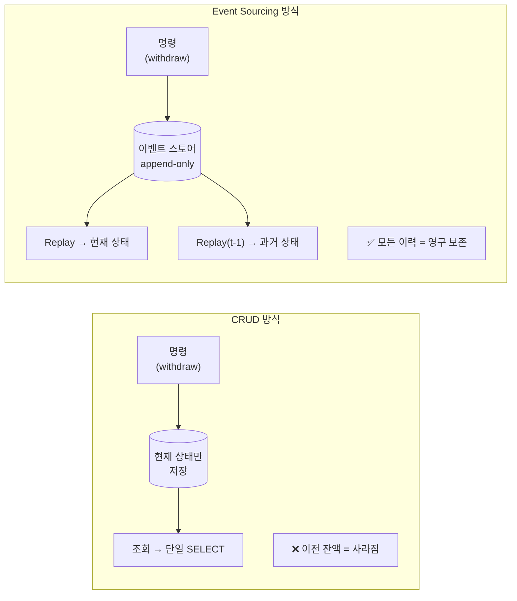
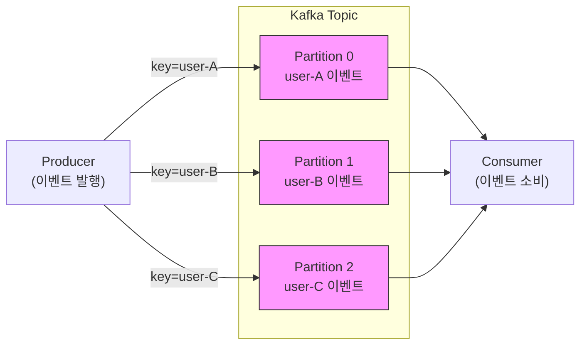
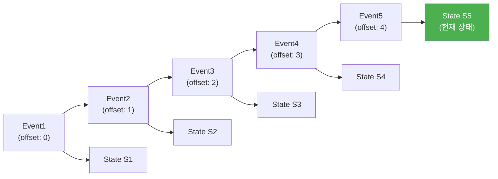
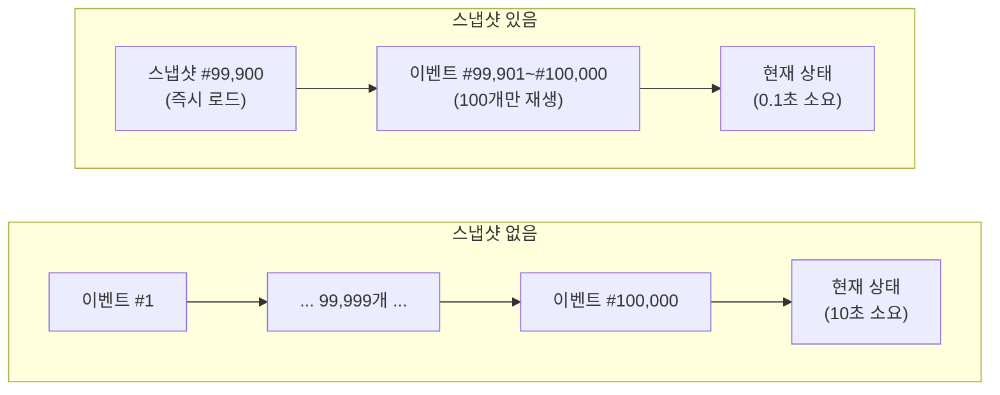
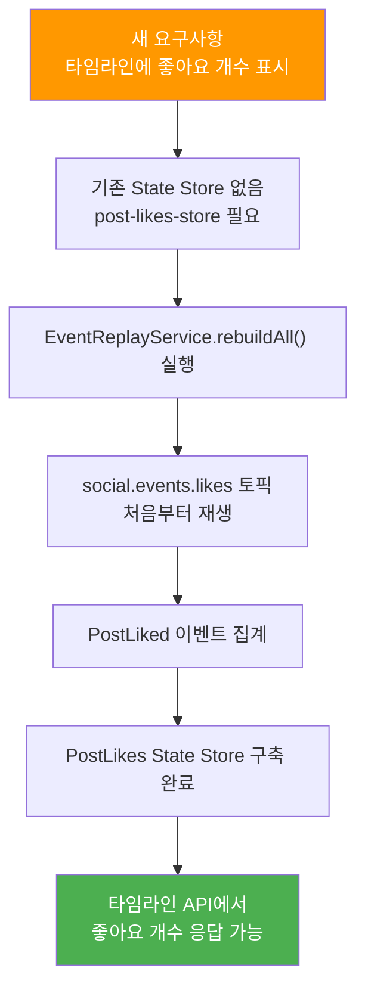

# Event Sourcing

---

> Event Sourcing은 *현재 상태가 아니라 상태를 만든 이벤트의 시퀀스를 진실의 출처로 둔다*. "주문 상태는 SHIPPED"가 아니라 "OrderCreated → OrderPaid → OrderShipped" 이벤트가 본질이고, 현재 상태는 그 이벤트들을 *재생*해 얻는다. CQRS와 자주 결합되어 *읽기 모델은 projection으로 만든다*.


## 학습 목표

> Event Sourcing이 *상태 기반 저장*과 어떻게 다른지, 어떤 도메인에 적합한지를 이해한다.

이 장을 다 읽고 다음 다섯 가지에 자신 있게 답할 수 있으면 학습이 완료된다.

1. 상태 기반 저장(JPA Entity UPDATE)과 이벤트 기반 저장(Event Store APPEND)의 차이를 설명할 수 있다.
2. Aggregate 단위로 이벤트 시퀀스를 재생해 *현재 상태를 복원*하는 메커니즘을 설명할 수 있다.
3. Snapshot 패턴이 *왜 필요하고 언제 만드는지*를 설명할 수 있다.
4. 이벤트 스키마 진화가 상태 기반 저장보다 *왜 더 어려운지*를 설명할 수 있다.
5. Event Sourcing이 *감사·시계열 분석·도메인 진화*에 강한 이유와 *비용*을 비교할 수 있다.

# Event Sourcing이란 무엇인가?

---

> Event Sourcing은 이벤트가 유일한 진실인 아키텍처 패턴입니다. DB에 "현재 상태"를 덮어쓰는 대신, 상태를 변경한 모든 이벤트를 시간 순서로 쌓아두고 이벤트를 재생하여 현재 상태를 도출합니다.

## CRUD vs Event Sourcing

### CRUD(현재 상태만 살아남는다)

전통적인 CRUD 방식은 데이터베이스에 현재 상태만 저장합니다.

```java
// CRUD: 현재 상태만 저장, 이전 상태는 영구 소멸
@Entity
public class User {
    @Id private Long id;
    private String name;
    private String email;
    private BigDecimal balance;
}

// 이 save() 호출 이후, 이전 잔액은 사라진다
public void withdraw(Long userId, BigDecimal amount) {
    User user = userRepository.findById(userId);
    user.setBalance(user.getBalance().subtract(amount));
    userRepository.save(user);  // UPDATE users SET balance = ?
}
```

```sql
-- 현재 상태만 저장: 이전 상태는 사라진다
CREATE TABLE users (
    id BIGINT PRIMARY KEY,
    name VARCHAR(100),
    email VARCHAR(100),
    balance DECIMAL(10, 2),
    updated_at TIMESTAMP
);

-- 이 UPDATE 이후에는 잔액이 어떻게 150이 되었는지 알 수 없다
UPDATE users
SET balance = 150.00, updated_at = NOW()
WHERE id = 1;
```

### Event Sourcing(이벤트 스트림이 진실이다)

Event Sourcing은 상태 변경을 일으킨 이벤트 자체를 저장합니다. 현재 상태는 이벤트들을 처음부터 순서대로 재생하면 언제든 복원할 수 있습니다.

```java
// Event: 과거에 일어난 사실, 불변이다
public record WithdrawalMade(
    String userId,
    BigDecimal amount,
    String reason,
    Instant timestamp
) {}

// Aggregate: 이벤트를 순서대로 적용하여 현재 상태를 구축한다
public class Account {
    private String userId;
    private BigDecimal balance;
    private List<Event> changes = new ArrayList<>();

    // 이벤트를 적용하여 로컬 상태를 변경한다
    public void apply(WithdrawalMade event) {
        this.balance = this.balance.subtract(event.amount());
        this.changes.add(event);  // 나중에 저장할 이벤트 목록에 추가
    }

    // Command: 비즈니스 규칙 검증 후 이벤트를 발행한다
    public void withdraw(BigDecimal amount, String reason) {
        if (balance.compareTo(amount) < 0) {
            throw new InsufficientBalanceException();
        }
        apply(new WithdrawalMade(userId, amount, reason, Instant.now()));
    }
}

// Repository: 이벤트를 저장하고 이벤트로부터 상태를 재구축한다
public class EventSourcedAccountRepository {
    private final KafkaTemplate<String, Event> kafkaTemplate;

    // 변경된 이벤트를 Kafka 토픽에 저장한다
    public void save(Account account) {
        for (Event event : account.getChanges()) {
            kafkaTemplate.send("account.events", account.getUserId(), event);
        }
    }

    // 이벤트를 처음부터 재생하여 현재 상태를 복원한다
    public Account findById(String userId) {
        List<Event> events = loadEventsFromKafka(userId);
        Account account = new Account();
        for (Event event : events) {
            account.apply(event);  // 이벤트를 순서대로 적용
        }
        return account;
    }
}
```

```sql
-- 상태 변경 이벤트를 시간 순서로 저장한다 (append-only)
CREATE TABLE user_events (
    event_id BIGINT PRIMARY KEY,
    user_id BIGINT,
    event_type VARCHAR(50),
    event_data JSON,
    timestamp TIMESTAMP
);

-- 이벤트 저장: 절대 수정하지 않는다
INSERT INTO user_events VALUES
(1, 1, 'UserCreated',    '{"name": "Alice", "email": "alice@example.com"}', '2024-01-01 10:00:00'),
(2, 1, 'DepositMade',   '{"amount": 100.00, "reason": "Initial deposit"}',  '2024-01-01 10:05:00'),
(3, 1, 'WithdrawalMade','{"amount": 50.00,  "reason": "ATM withdrawal"}',   '2024-01-02 14:30:00'),
(4, 1, 'DepositMade',   '{"amount": 100.00, "reason": "Salary"}',           '2024-01-03 09:00:00');

-- 현재 잔액 = 이벤트를 순서대로 재생한 결과
-- balance = 0 + 100 - 50 + 100 = 150
```

- Event Sourcing은 항상 끝에 이벤트를 추가하는(Append Only Log) 방식으로 전달됩니다. 
- 이벤트 리플레이를 통해 처음부터 끝까지 순서대로 재생하여 어떤 시점의 상태로 복원할 수 있습니다.

### 두 방식의 데이터 흐름 비교



## Kafka/Redpanda 토픽이 Event Store로 적합한 이유

Kafka가 Event Store로 적합한 이유는 다음과 같습니다.



1. Append-Only Log
2. **파티션 순서 보장**: 동일한 key에 대해서는 항상 같은 파티션에 배치됩니다.
3. **불변성**: 한번 기록된 메시지는 수정할 수 없으므로, 불변성이 강제됩니다.
4. **Consumer Offset** 리셋: Offet을 0으로 되돌리면, 전체 이벤트를 재생할 수 있습니다.

| 특성            | Kafka/Redpanda              | 관계형 DB                      |
| --------------- | --------------------------- | ------------------------------ |
| **Append-Only** | 네이티브 지원               | INSERT only로 직접 구현 필요   |
| **순서 보장**   | 파티션 내 보장              | `ORDER BY timestamp` 수동 구현 |
| **스케일링**    | 파티션으로 수평 확장        | 샤딩이 복잡함                  |
| **리플레이**    | Consumer offset 리셋        | 전체 테이블 스캔 (느림)        |
| **리텐션**      | 시간 기반 자동 관리         | 수동 삭제 로직 구현 필요       |
| **스트림 처리** | Kafka Streams 네이티브 통합 | 별도 도구 필요                 |

# 이벤트 설계 원칙

---

> 좋은 이벤트 설계는 시스템의 유지 보수성과 직결된다. 이벤트는 한번 저장되면 수정할 수 없으므로, 설계 단계에서 신중하게 결정해야 한다.

## 원칙 1. 과거 시제 네이밍

이벤트는 이미 일어난 사실을 기록하는 것이므로 반드시 과거 시제로 이름을 짓습니다.

```java
// ❌ 명령형은 Command다, Event가 아니다
public record CreatePost(...) {}

// ✅ 과거 시제로 "이미 일어난 사실"을 표현한다
public record PostCreated(...) {}

// 도메인별 예시
public record UserFollowed(String followerId, String followeeId, Instant timestamp) {}
public record OrderPlaced(String orderId, List<Item> items, Instant timestamp) {}
public record PaymentCompleted(String paymentId, BigDecimal amount, Instant timestamp) {}
```

## 원칙 2. 충분한 정보 포함

이벤트 하나만 읽어도 무슨 일이 일어났는지 완전히 이해할 수 있어야 한다. 다른 데이터를 조회해야만 의미를 알 수 있는 이벤트는 감사로그로서의 가치를 잃게됩니다.

```java
// ❌ 이전 이름을 알 수 없어 감사 로그로 불완전하다
public record UserNameChanged(String userId, String newName) {}

// ✅ 변경 전후와 변경 주체를 모두 기록하여 완전한 사실을 담는다
public record UserNameChanged(
    String userId,
    String oldName,    // 변경 이전 값
    String newName,    // 변경 이후 값
    String changedBy,  // 누가 변경했는가
    Instant timestamp
) {}
```

## 원칙 3. 멱등성 고려

네트워크 장애나 재시도로 인해 같은 이벤트가 2번 전달될 수 있습니다. 이벤트를 2번 적용해도 결과가 동일하도록 설계해야 합니다.

```java
// ❌ 상대적 변경은 멱등하지 않다: 같은 이벤트를 2번 적용하면 잔액이 2배 증가한다
public record BalanceIncreased(String userId, BigDecimal amount) {}

// ✅ 고유 식별자를 포함하면 depositId로 중복 처리를 감지할 수 있다
public record DepositMade(
    String depositId,  // 이 ID가 이미 처리되었다면 무시한다
    String userId,
    BigDecimal amount,
    Instant timestamp
) {}
```

## 원칙 4. 도메인 언어 사용

이벤트 이름은 개발자뿐만 아니라 비즈니스 이해관계자도 이해할 수 있어야 합니다.

```java
// ❌ 기술 용어: 어떤 비즈니스 사건인지 알 수 없다
public record UserRecordUpdated(...) {}

// ✅ 도메인 언어: 비즈니스 사건이 명확하게 드러난다
public record UserEmailVerified(...) {}
public record UserPasswordReset(...) {}
public record UserSubscriptionUpgraded(...) {}
```

# Event Replay

---

## Event Replay란 무엇인가?

Event Replay는 Event Store에 쌓인 이벤트를 처음부터 다시 재생하여 특정 상태를 재구축하는 프로세스입니다. 



## 리플레이 구현(이벤트 재생)

Event Replay의 핵심은 기존 Consumer Group에서 완전히 독립된 Group을 만드는 것입니다. Consumer Group은 각자 독립적인 오프셋을 가지므로, 새 Group은 기존 Group에 영향을 주지 않고 처음부터 이벤트를 읽을 수 있습니다.

```java
// 기존 Consumer Group: 정상 운영 중
@KafkaListener(
    topics = "social.events.posts",
    groupId = "timeline-service"  // 기존 group
)
public void handlePostEvent(PostCreated event) {
    // 정상 처리
}
```

```java
// 새 Consumer Group (리플레이 전용)
@Service
public class EventReplayService {
    private final KafkaConsumer<String, PostCreated> consumer;

    public EventReplayService() {
        Properties props = new Properties();
        props.put(ConsumerConfig.BOOTSTRAP_SERVERS_CONFIG, "localhost:9092");
        props.put(ConsumerConfig.GROUP_ID_CONFIG, "replay-" + UUID.randomUUID());  // 매번 새 group
        props.put(ConsumerConfig.AUTO_OFFSET_RESET_CONFIG, "earliest");  // 처음부터 읽기
        props.put(ConsumerConfig.ENABLE_AUTO_COMMIT_CONFIG, "false");   // 수동 커밋

        consumer = new KafkaConsumer<>(props);
        consumer.subscribe(List.of("social.events.posts"));
    }

    public void replayAll() {
        while (true) {
            ConsumerRecords<String, PostCreated> records = consumer.poll(Duration.ofSeconds(1));
            for (ConsumerRecord<String, PostCreated> record : records) {
                processEvent(record.value());
            }

            if (records.isEmpty()) {
                break;  // 모든 이벤트 처리 완료
            }

            consumer.commitSync();  // 수동 커밋
        }
    }

    private void processEvent(PostCreated event) {
        // 새 로직으로 처리
    }
}
```

- auto.offset.reset=earliest는 지정된 offset이 없을 때 토픽의 가장 처음부터 읽도록 지시한다.

### 시점 지정 리플레이: 특정 시간 이후만 재생

"어제 오후 3시부터 지금까지의 이벤트만 재생해줘"는 요구사항에 대응하는 코드입니다. Kafka는 타임스탬프 기반 offset조회를 지원하므로 특정 시점 이후의 이벤트만 재생할 수 있습니다. 

```java
// 특정 시점 이후의 이벤트만 재생한다
public void replayFrom(String topic, Instant fromTimestamp) {
    consumer.subscribe(List.of(topic));
    consumer.poll(Duration.ZERO);

    // 각 파티션에서 해당 타임스탬프에 해당하는 offset을 조회한다
    Map<TopicPartition, Long> timestampMap = consumer.assignment().stream()
        .collect(Collectors.toMap(
            partition -> partition,
            partition -> fromTimestamp.toEpochMilli()
        ));

    Map<TopicPartition, OffsetAndTimestamp> offsets =
        consumer.offsetsForTimes(timestampMap);

    // 조회된 offset으로 이동하여 해당 시점 이후의 이벤트만 재생한다
    offsets.forEach((partition, offsetAndTimestamp) -> {
        if (offsetAndTimestamp != null) {
            consumer.seek(partition, offsetAndTimestamp.offset());
        }
    });

    while (true) {
        ConsumerRecords<String, Event> records = consumer.poll(Duration.ofMillis(1000));
        if (records.isEmpty()) break;
        for (ConsumerRecord<String, Event> record : records) {
            handler.handle(record.value());
        }
    }
}
```

### 단일 Aggregate 리플레이: 특정 사용자의 상태 복원

전체 토픽을 재생하는 대신, 특정 Aggregate(ex 특정 계좌)의 이벤트만 필터링하여 재생하는 방법입니다. Kafka에서는 Key 기반 필터링으로 구현합니다.

```java
// 특정 Aggregate의 이벤트만 필터링하여 상태를 재구축한다
public Account replayAggregate(String topic, String accountId) {
    Account account = new Account();

    consumer.subscribe(List.of(topic));
    consumer.poll(Duration.ZERO);
    consumer.assignment().forEach(p -> consumer.seek(p, 0));

    while (true) {
        ConsumerRecords<String, Event> records = consumer.poll(Duration.ofMillis(1000));
        if (records.isEmpty()) break;

        for (ConsumerRecord<String, Event> record : records) {
            // Kafka key가 accountId와 일치하는 이벤트만 적용한다
            if (accountId.equals(record.key())) {
                account.apply(record.value());
            }
        }
    }
    return account;  // 이벤트 재생 완료 → 현재 상태 반환
}
```

### 리플레이의 동기/비동기 처리

단일 토픽 내부의 순서 보장은 Kafka가 해결해주지만, 현실의 워크플로우는 토픽을 넘나드는 인과 관계를 가집니다.

```bash
Ticket 토픽:  [사전준비] ──────────────────→ [시작]
                  │                              ↑
                  ▼                              │
GitLab 토픽:  [정합성 검증 요청] →         [정합성 검증 완료]
```

- ex) 티켓 사전준비 -> GitLab 정합성 검증 -> 티켓 시작 이라는 흐름에서, 티켓/Gitlab은 서로 다른 토픽에 있습니다.

Kafka는 토픽 간 순서를 보장해주지 않으므로, 각 토픽의 Consumer를 개별 실행하면 순서가 엉킬 수 있습니다. 이를 위해 Saga(Process Manager)를 사용해서 워크플로우 상태를 별도로 관리하는 관리자를 두는것이 좋습니다.

``` java
// Saga: 토픽 간 인과 관계를 조율하는 상태 머신
public class TicketWorkflowSaga {
    private String ticketId;
    private SagaState state;  // PREPARED, VALIDATING, VALIDATED, STARTED

    // Ticket 토픽에서 수신: 사전준비 완료 → GitLab 검증 요청
    public List<Command> handle(TicketPrepared event) {
        this.state = SagaState.VALIDATING;
        return List.of(new RequestGitlabValidation(event.ticketId()));
    }

    // GitLab 토픽에서 수신: 검증 완료 → 티켓 시작 명령
    public List<Command> handle(GitlabValidationCompleted event) {
        this.state = SagaState.VALIDATED;
        return List.of(new StartTicket(event.ticketId()));
    }

    // Ticket 토픽에서 수신: 워크플로우 완료
    public List<Command> handle(TicketStarted event) {
        this.state = SagaState.STARTED;
        return List.of();
    }
}
```

Saga 자체도 이벤트 소싱됩니다. Saga의 상태 전이 이벤트가 별도 토픽에 저장되어 있으므로, 리플레이 시 Saga 토픽을 재생하면, "어디까지 진행됐는지"가 정확히 복원됩니다. 

```java
public class TicketWorkflowSaga {

    public List<Command> handle(TicketPrepared event, EventMetadata metadata) {
        // Projector 역할: 리플레이 여부와 무관하게 항상 실행 (상태 복원)
        this.state = SagaState.VALIDATING;

        // Reactor 역할: 리플레이가 아닐 때만 실제 명령 발행
        if (!metadata.isReplay()) {
            return List.of(new RequestGitlabValidation(event.ticketId()));
        }
        return List.of();
    }
}
```

| 상황                     | 리플레이 시 순서 보장    | 이유                         |
| ------------------------ | ------------------------ | ---------------------------- |
| 단일 토픽 내 이벤트      | **보장됨**               | 파티션 내 순서 보장          |
| 토픽 간 인과 관계        | **자동 보장 안 됨**      | 각 토픽은 독립 리플레이      |
| Saga로 조율된 워크플로우 | **Saga 리플레이로 복원** | Saga 상태가 인과 관계를 기록 |

## 외부 부수효과 처리(Projector vs Reactor)

이벤트를 재생할 때 이메일 발송이나 결재 API 호출 같은 외부 부수효과가 다시 실행되면 안됩니다. 이 문제를 체계적으로 해결하는 핵심 패턴이 Projector와 Reactor의 분리입니다.

### Projcetor: 리플레이에 안전한 핸들러

Projector는 이벤트를 소비하여 Read Model을 갱신하는 핸들러입니다. 외부 시스템을 호출하지 않고 DB의 Read Model만 업데이트하기 때문에 다시 실행해도 문제 없습니다. 같은 이벤트를 2번 적용해도 결과가 같으므로(멱등성) 리플레이의 기본 단위가 됩니다.

```java
// Projector: Read Model만 갱신한다 — 리플레이 시 안전하게 재실행된다
@Component
public class OrderSummaryProjector {

    private final OrderSummaryMapper summaryMapper;  // MyBatis Mapper든 JPA Repository든 교체 가능

    @EventHandler  // 리플레이 시에도 실행됨
    public void on(OrderPlaced event) {
        // Read Model을 upsert한다 (멱등: 같은 orderId로 여러 번 실행해도 결과 동일)
        summaryMapper.upsert(new OrderSummary(
            event.getOrderId(),
            event.getCustomerId(),
            event.getTotalAmount(),
            "PLACED"
        ));
    }

    @EventHandler
    public void on(OrderShipped event) {
        summaryMapper.updateStatus(event.getOrderId(), "SHIPPED");
    }
}
```

### Reactor: 리플레이에서 제외되는 핸들러

Reactor는 이메일 발송, 외부 API 호출, 결제 처리 등 부수 효과를 수행하는 핸들러입니다. 이벤트를 리플레이할 때 Reactor는 실행되지 않아야 합니다.

```java
// Reactor: 외부 부수효과를 수행한다 — 리플레이 시 건너뛴다
@Component
public class OrderNotificationReactor {

    private final EmailService emailService;
    private final EmailSentMapper emailSentMapper;  // 발송 기록 조회/저장

    @EventHandler(allowReplay = false)  // 리플레이 시 이 핸들러는 실행되지 않음
    public void on(OrderPlaced event) {
        // 멱등성 체크: 이미 발송했으면 건너뛴다
        if (emailSentMapper.existsByOrderId(event.getOrderId()) == 0) {
            emailService.sendOrderConfirmation(event.getCustomerEmail());
            emailSentMapper.insert(event.getOrderId());
        }
    }
}
```

## 이벤트 재생 비용 문제

Event Sourcing의 가장 큰 성능 약점은 Aggregate를 로드할 때 처음부터 모든 이벤트를 재생해야 한다는 점입니다.



### Snapshot으로 재생 비용 줄이기

Snapshot은 특정 시점의 Aggregate상태를 별도로 저장한 체크포인트 입니다. Aggregate를 로드할 때 가장 최근 스냅샷부터 시작하고, 이후의 이벤트만 재생하게 합니다.

## 실제 리플레이 구현

타임라인 서비스의 새로운 요구사항으로 포스트의 좋아요 개수를 함께 표시해야 한다고 가정해봅시다. 기존에는 좋아요 개수를 집계하는 State Store가 없었기 때문에, 모든 과거 좋아요 이벤트를 리플레이하여 새로운 State Store를 구축하게 합니다.




```java
@Service
public class EventReplayService {
    private final KafkaConsumer<String, Event> consumer;
    private final PostLikesRepository likesRepo;

    @PostConstruct
    public void init() {
        Properties props = new Properties();
        props.put(ConsumerConfig.BOOTSTRAP_SERVERS_CONFIG, "localhost:9092");
        props.put(ConsumerConfig.GROUP_ID_CONFIG, "replay-" + UUID.randomUUID());
        props.put(ConsumerConfig.AUTO_OFFSET_RESET_CONFIG, "earliest");

        consumer = new KafkaConsumer<>(props);
        consumer.subscribe(List.of("social.events.posts", "social.events.likes"));
    }

    public void rebuildAll() {
        log.info("Starting full event replay...");

        Map<String, Integer> likesCount = new HashMap<>();
        consumer.seekToBeginning(consumer.assignment());

        while (true) {
            ConsumerRecords<String, Event> records = consumer.poll(Duration.ofSeconds(1));

            for (ConsumerRecord<String, Event> record : records) {
                if (record.value() instanceof PostLiked liked) {
                    likesCount.merge(liked.postId(), 1, Integer::sum);
                }
            }

            if (records.isEmpty()) {
                break;
            }
        }

        // 집계 결과를 State Store에 저장
        likesCount.forEach((postId, count) -> {
            likesRepo.save(new PostLikes(postId, count));
        });

        log.info("Event replay completed. Total posts: {}", likesCount.size());
    }
}

// 관리자 API를 통한 리플레이 트리거
@PostMapping("/admin/replay")
public ResponseEntity<Void> triggerReplay() {
    eventReplayService.rebuildAll();
    return ResponseEntity.accepted().build();
}
```


# 도메인별 적용 예시

---

## 이커머스: 주문 라이프 사이클

이커머스 주문은 Event Sourcing의 대표적인 적용 대상입니다. 주문 생성 -> 결제 확인 -> 재고 예약 -> 배송되는 과정이 하나의 이벤트 스트림으로 기록됩니다.

```bash
OrderCreated → PaymentConfirmed → InventoryReserved → OrderShipped → OrderDelivered
```

이 이벤트 스트림이 CRUD 대비 제공하는 이점은 3가지입니다.

- **시간 여행 쿼리**: 오후 3시에 장바구니에 뭐가 있었는지라는 질문에 Event Sourcing은 해당 시점까지의 이벤트를 재현하면 답을 얻을 수 있습니다.
- **감사 추적**: "누가 이 가격을 변경했는가?"에 대해서 이벤트 자체가 감사 로그이므로, 별도 인프라 구축이 필요없다.
- **프로덕션 버그 재현**: 주문 처리 중 발생한 버그를 재현하려면, 프로덕션 이벤트 로그를 테스트 환경에서 복사하고 리플레이하면 됩니다.

```java
// 이커머스 재고 관리: 현재 재고 = 입고 이벤트 합 - 출고 이벤트 합 - 예약 이벤트 합
public record InventoryReceived(String sku, int quantity, String warehouseId, Instant timestamp) {}
public record ItemReserved(String sku, int quantity, String orderId, Instant timestamp) {}
public record ItemShipped(String sku, int quantity, String orderId, Instant timestamp) {}

// 재고 Aggregate: 이벤트를 재생하면 특정 시점의 재고를 정확히 알 수 있다
public class Inventory {
    private String sku;
    private int available;
    private int reserved;

    public void apply(InventoryReceived event) {
        this.available += event.quantity();
    }

    public void apply(ItemReserved event) {
        this.available -= event.quantity();
        this.reserved += event.quantity();
    }

    public void apply(ItemShipped event) {
        this.reserved -= event.quantity();
    }
}
```

## 커뮤니티 플랫폼(수정 이력과 모더레이션)

커뮤니티 플랫폼에서도 Event Sourcing이 CRUD보다 유리한 시나리오가 있습니다.

- **게시글 수정 이력 추적**: 이벤트 체인을 통해서 모든 버전을 보존하고, 위키피디아의 편집 이력과 동일한 개념을 별도 버전없이 이벤트 스트림으로 구현할 수 있습니다.
- **모더레이션 감사**: 이 댓글이 삭제되기 전에 신고가 있었나? 질문에 대해서 CRUD가 답하기 어렵습니다. 삭제된 댓글은 이미 사라졌기 때문이다. Event Sourcing에서는 이벤트 스트림 순으로 조회하면 즉답할 수 있다.
- **A/B 테스트를 위한 리플레이**: 새로운 알고리즘 배포하기전에, 기존 이벤트 스트림을 새 알고리즘에 리플레이하여 결과를 비교해볼 수도 있습니다.


---

> **TPS 적용 사례** — `okestro/tps-gitlab2` (현재 미적용)
>
> - **상태**: 상태 기반 저장(JPA Entity 직접 UPDATE). 이벤트는 Outbox로 발행하지만 진실의 출처는 여전히 현재 상태 테이블.
> - **적용 후보**: 감사 요구가 강한 도메인(승인 워크플로우, 정책 변경 이력) — `ticket/approval` 도메인이 후보. 이벤트 시계열을 적재하고 현재 상태는 projection으로 재구성.
> - **트레이드오프**: 스냅샷 정책·이벤트 스키마 진화·디버깅 도구 비용. 도입 전 [`09_advanced/09-04.스키마 거버넌스`](09_advanced/09-04.스키마%20거버넌스.md)의 호환성 자동화가 선행 조건.


## 면접 대비 Q&A

> 면접에서 자주 나오는 형태로 5개. 답을 보지 않고 먼저 입으로 답해 본 뒤 비교한다.

### Q1. 상태 기반 저장과 이벤트 기반 저장의 결정적 차이는?

상태 기반은 *현재 값만 들고* 변경 이력은 별도 감사 로그에 따로 적는다. UPDATE 한 번이 *과거 값을 덮어쓴다*. 이벤트 기반은 *모든 변경이 append-only 이벤트*로 적재되고, 현재 상태는 그 이벤트들을 재생해 얻는다. *상태가 부산물*이고 이벤트가 본질이다. 그래서 "왜 이 상태가 됐는지"를 코드 변경 없이 *데이터로 추적*할 수 있다.

### Q2. Aggregate 단위로 현재 상태를 복원하는 메커니즘은?

Event Store에서 *해당 aggregate id의 이벤트를 시간순으로 모두 읽어* 메모리에 빈 객체를 만들고 각 이벤트를 순서대로 apply한다. `apply(OrderCreated)` → `apply(OrderPaid)` → `apply(OrderShipped)` 하면 최종 상태가 만들어진다. 같은 aggregate id가 다른 인스턴스에 동시에 복원되면 충돌이 생기므로 *aggregate id별 직렬 처리*나 optimistic locking(이벤트 sequence 비교)이 필요하다.

### Q3. Snapshot이 필요한 이유와 언제 만드나?

이벤트가 수천 개가 되면 *매 요청마다 재생*하는 비용이 크다. Snapshot은 *N번째 이벤트까지 적용한 상태*를 별도 저장해 두고, 다음 복원 시 *그 snapshot부터 이후 이벤트만* 재생하게 한다. 보통 100~1000 이벤트마다 만들거나, *aggregate 별로 임계치를 두고 비동기*로 생성한다. snapshot 자체가 진실이 아니라 *재생 가능한 캐시*라는 점이 중요하다.

### Q4. 이벤트 스키마 진화가 상태 기반 저장보다 어려운 이유는?

이벤트는 *영원히 보존된다*. 1년 전 이벤트를 재생해야 할 수도 있으므로 *옛 스키마를 영원히 읽을 수 있어야* 한다. 새 필드 추가는 default로 해결되지만, 의미 변경(예: amount 단위가 원에서 센트로 바뀜)은 *옛 이벤트를 변환하는 upcaster*가 필요하다. 상태 기반은 마이그레이션으로 한 번에 끝나지만, 이벤트 기반은 *코드와 데이터가 모두 진화*해야 한다.

### Q5. Event Sourcing의 가치와 도입 비용은?

가치: (1) *완전한 감사* — 변경 이유와 순서가 데이터에 박혀 있다. (2) *시계열 분석* — 과거 임의 시점의 상태를 재구성할 수 있다. (3) *도메인 진화* — 새 read 모델을 *과거 이벤트로 재생해* 만들 수 있다. 비용: snapshot 정책 운영, 스키마 진화 비용, 디버깅 도구 필요, 트랜잭션·일관성 모델 재설계, 팀 학습 곡선. 감사·시계열·다중 view 요구가 셋 다 있는 도메인에서만 비용이 회수된다.


## 관련 문서

- [07-01.Kafka CQRS](07-01.Kafka%20CQRS.md) — Event Sourcing과 자주 결합되는 짝
- [06-01.Kafka Streams](06-01.Kafka%20Streams.md) — 이벤트 재생으로 read 모델 생성
- [02-01.EIP Message Pattern](02-01.EIP%20Message%20Pattern.md) — 도메인 이벤트의 의미와 의도
- [05-03.Outbox](05-03.Outbox.md) — 이벤트 발행 안전 보장
