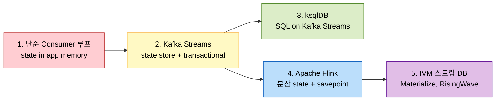
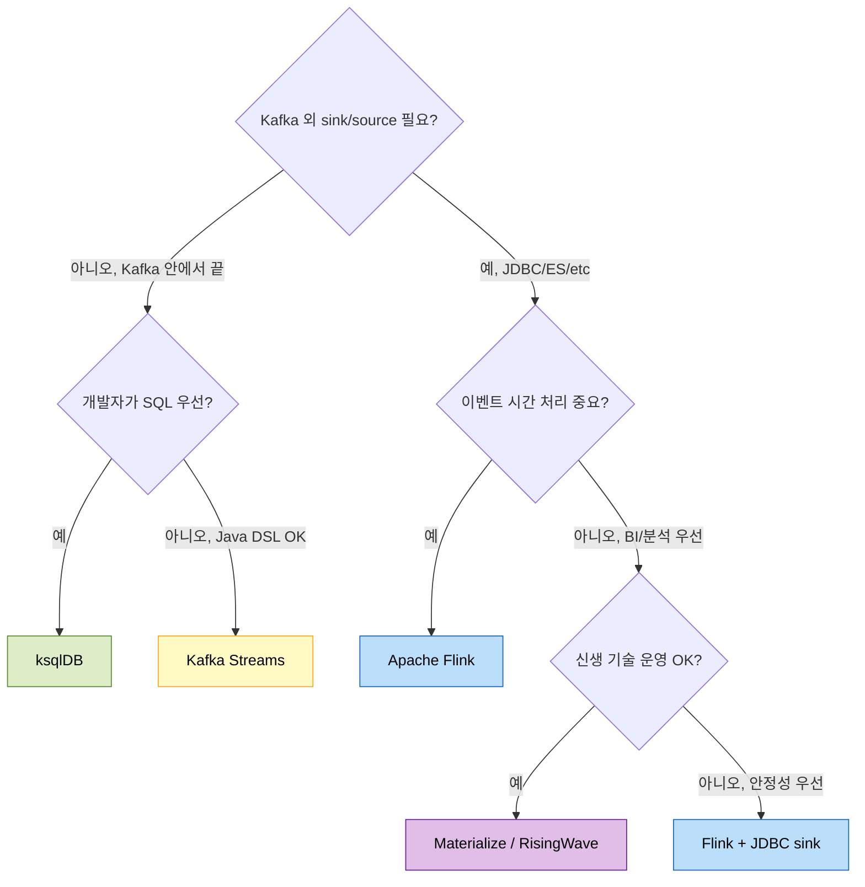

# 스트림 처리 진화 — Kafka Streams부터 IVM 데이터베이스까지

---

> 상위 `06-01.Kafka Streams`가 스트림 처리의 기본 모델을 다뤘다면, 여기서는 같은 문제를 다른 도구로 풀 때의 트레이드오프를 비교한다. Kafka Streams → Apache Flink → ksqlDB → Materialize/RisingWave/Decodable 순으로 진화 축을 따라가며, exactly-once 보장 비교와 사례를 정리한다.

## 1. 진화 축



각 단계는 **상태 관리 방식**과 **개발자가 다루는 추상화 수준**으로 구분된다.

| 단계 | 상태 위치 | 추상화 |
|---|---|---|
| 1. 루프 | 앱 메모리 | for-each |
| 2. Kafka Streams | RocksDB + changelog topic | DSL (KStream/KTable) |
| 3. ksqlDB | RocksDB (Kafka Streams 위) | SQL |
| 4. Flink | 분산 state backend (RocksDB/HDFS) | DataStream API + SQL |
| 5. IVM DB | DB 내부 incremental view | SQL only |

## 2. 단계 1 — 단순 Consumer 루프

```java
@KafkaListener(topics = "events")
public void onEvent(Event ev) {
    counter.merge(ev.userId, 1, Integer::sum);
    if (counter.get(ev.userId) > THRESHOLD) {
        alertService.send(ev.userId);
    }
}
```

### 한계

- **상태가 인스턴스 메모리에 갇힘**: 여러 인스턴스가 같은 user의 이벤트를 나눠 받으면 카운터가 분산되어 임계치를 못 넘는다.
- **재시작 시 상태 소실**: 카운터는 그냥 사라진다. DB에 매번 UPDATE하면 throughput이 폭락.
- **시간 기반 윈도우 어렵다**: "지난 5분간"을 표현하려면 별도 자료구조 + 만료 로직.

이 한계가 곧 Kafka Streams 도입 동기.

## 3. 단계 2 — Kafka Streams

### 핵심 개념

- **KStream**: 무한 이벤트 시퀀스.
- **KTable**: 키별 최신 상태 스냅샷.
- **State store**: 로컬 RocksDB. 변경 사항은 Kafka의 changelog topic으로 백업되어 인스턴스 재시작 시 복원.
- **Co-partitioning**: 같은 키의 이벤트는 항상 같은 파티션 → 같은 인스턴스로. 분산 환경에서도 키 단위 상태 일관성 보장.

```java
StreamsBuilder b = new StreamsBuilder();
b.stream("events", Consumed.with(Serdes.String(), eventSerde))
 .groupBy((k, v) -> v.userId)
 .windowedBy(TimeWindows.of(Duration.ofMinutes(5)))
 .count(Materialized.as("user-counts"))
 .toStream()
 .filter((k, count) -> count > 100)
 .to("alerts");
```

### Exactly-once

`processing.guarantee=exactly_once_v2` 설정으로 활성화. 내부적으로:

- Kafka Producer transactional API.
- Consumer offset commit + state store update + downstream send를 하나의 transaction.
- 실패 시 transaction abort → 재시도.

성능 비용은 약 10~30% throughput 감소(2024년 기준 Confluent 보고).

### 한계

- **단일 Kafka 클러스터에 묶임**: input/output 토픽, changelog 토픽이 모두 같은 클러스터.
- **stateful job의 분산 한계**: state store가 인스턴스 로컬이라 단일 키의 상태가 한 인스턴스 메모리·디스크 한계를 못 넘는다.
- **이벤트 시간 처리 약함**: window 내 늦게 도착한 이벤트(late arrival) 처리는 Flink보다 약함. grace period로 일부 보완.

### 사례

- **LinkedIn Brooklin / Samza → Kafka Streams 일부 이행**: 초기에 Samza로 시작한 LinkedIn은 더 가벼운 Kafka Streams로 일부 use case를 이전. 출처: <https://engineering.linkedin.com/blog/2019/01/introducing-brooklin>
- **Confluent customer stories**: 금융사·Telco 사례 다수. <https://www.confluent.io/customers/>

## 4. 단계 3 — ksqlDB

Kafka Streams 위에 SQL 인터페이스를 얹은 것. JOIN, GROUP BY, WINDOW를 SQL로.

```sql
CREATE STREAM events (user_id VARCHAR, type VARCHAR)
  WITH (KAFKA_TOPIC='events', VALUE_FORMAT='AVRO');

CREATE TABLE user_counts AS
  SELECT user_id, COUNT(*) AS cnt
  FROM events
  WINDOW TUMBLING (SIZE 5 MINUTES)
  GROUP BY user_id
  EMIT CHANGES;
```

### 장점

- **개발 속도**: SQL이 익숙한 분석가가 직접 스트림 쿼리 작성.
- **Kafka Streams와 같은 보장**: exactly-once, state store, co-partitioning 그대로.

### 한계

- **표현력**: 복잡한 비즈니스 로직(예: ML 모델 호출)은 UDF로 외부 자바 코드 호출 필요.
- **SQL 표현력 < Flink SQL**: window 종류·복잡한 시간 의미론에서 Flink가 더 풍부.
- **Confluent 종속**: ksqlDB는 Confluent가 주도. CC(Confluent Community License)는 일부 SaaS 빌드 제약 있음.

### 사례

- **Bolt(전 Taxify) "Real-time data processing with ksqlDB"**: 차량 위치 스트림 + 사용자 매칭 SQL. 출처: <https://medium.com/bolt-labs>
- **Confluent ksqlDB 공식 사례**: <https://ksqldb.io/customers.html>

## 5. 단계 4 — Apache Flink

Kafka 외부의 분산 스트림 처리 엔진. 별도 클러스터(JobManager + TaskManagers).

### 핵심 차별점

- **이벤트 시간 처리**: Watermark, late arrival 처리, allowed lateness가 first-class.
- **savepoint**: 워크플로우 코드/스키마 변경 시 상태를 외부에 저장 후 새 버전으로 재시작 가능.
- **state backend 선택**: RocksDB(로컬) / HashMapStateBackend / 외부 storage(HDFS, S3).
- **exactly-once with two-phase commit sink**: Kafka 외 sink(JDBC, Elasticsearch)도 exactly-once 가능.
- **batch + stream 통합**: 같은 코드로 batch와 stream 모두.

### 학습 비용

- API 4종(DataStream, Table, SQL, ProcessFunction). 어느 것을 쓸지 결정 비용.
- savepoint·checkpoint·체크포인트 정렬 등 운영 개념 풍부.
- 클러스터 운영(JobManager HA, ZK/etcd, S3 backend) 부담.

### 사례

- **Uber AthenaX**: Flink 기반 SQL 스트림 플랫폼. 사내 분석가가 SQL로 스트림 잡 정의. 출처: <https://www.uber.com/blog/athenax-stream-processing-with-sql/>
- **Stripe radar (사기 감지)**: Flink 기반 실시간 fraud scoring. 회사 발표보다 컨퍼런스 토크에서 자주 언급.
- **Netflix Mantis → Flink 부분 이행**: Netflix는 Mantis(자체 RxJava 기반)와 Flink를 병행. 출처: <https://netflixtechblog.com/open-sourcing-mantis-9b8b32e15a13>
- **Pinterest "Stream processing at Pinterest"**: Flink로 ad event aggregation. 출처: <https://medium.com/pinterest-engineering/real-time-analytics-at-pinterest-1ef11fdb1099>

### Kafka Streams vs Flink

| 축 | Kafka Streams | Flink |
|---|---|---|
| 배포 모델 | 라이브러리 (앱 안) | 별도 클러스터 |
| 상태 한계 | 단일 인스턴스 RocksDB | 분산 state backend |
| 이벤트 시간 | 약함 (grace period) | 강함 (watermark) |
| Sink exactly-once | Kafka 한정 | JDBC/Elasticsearch 등 |
| 운영 부담 | 낮음 (앱 운영과 동일) | 높음 (클러스터 별도) |
| Cost | 앱 인프라 | 별도 클러스터 |

선택 기준: **Kafka 안에서 끝나면 Streams, Kafka 밖 sink/시간 의미론이 중요하면 Flink**.

## 6. 단계 5 — IVM 스트림 DB (Materialize, RisingWave)

새로운 패러다임. **SQL 뷰를 정의하면 DB가 incremental view maintenance(IVM)로 실시간 갱신**한다.

```sql
-- Materialize/RisingWave에서
CREATE MATERIALIZED VIEW user_counts AS
SELECT user_id, COUNT(*) AS cnt
FROM events
WHERE event_time > now() - INTERVAL '5 minutes'
GROUP BY user_id;
```

이 뷰는 events에 새 행이 들어올 때마다 즉시 갱신된다. 사용자는 그냥 SELECT.

### 핵심 차별점

- **개발자 추상화**: 스트림 처리 엔진을 의식할 필요 없음. SQL 뷰 정의만.
- **분산 dataflow**: Materialize는 Differential Dataflow(Frank McSherry 논문) 기반. RisingWave는 자체 Apache 2.0 엔진.
- **PostgreSQL 호환 wire protocol**: 기존 BI 도구·앱이 그대로 연결.

### 한계

- **상대적 신생 기술**: Materialize 2019, RisingWave 2022. 운영 사례가 Flink만큼 풍부하지 않다.
- **state 크기 한계**: 매우 큰 join state는 여전히 cluster 자원 한계.
- **ksqlDB와 비교**: SQL 표현력이 더 풍부하지만 Kafka 생태계 결합도가 낮음(input source는 Kafka 외 다양).

### 사례

- **Materialize "How we built Materialize"**: 자사 블로그. 출처: <https://materialize.com/blog/>
- **RisingWave "Why we built RisingWave"**: <https://risingwave.com/blog/>
- **학술**: Frank McSherry "Differential Dataflow" 논문 시리즈. 출처: <https://github.com/timelydataflow/differential-dataflow>

## 7. Exactly-once 비교

스트림 처리에서 가장 자주 헛갈리는 영역.

### Kafka Streams (transactional)

- Producer transaction + consumer isolation_level=read_committed.
- input/output/state store가 모두 Kafka 안에 있을 때 보장.
- Kafka 외 sink로 나가면 보장 깨짐.

### Flink (two-phase commit)

- Source가 replayable이어야 함 (Kafka 같은 log).
- Sink가 transactional 또는 idempotent여야 함.
- Flink JobManager가 coordinator 역할로 commit/abort 결정.
- JDBC sink, Elasticsearch sink 등에 exactly-once 제공.

### Pulsar Transactions

- 다중 토픽 발행 원자성. 단 stream processing 엔진의 일부가 아니라 producer 측 기능.

### 일반 원칙

- **End-to-end exactly-once**는 source · processor · sink 셋 다 협조해야 가능.
- 한 단계라도 비-transactional이면 at-least-once + idempotent consumer로 떨어진다.
- 실용적으로는 idempotent consumer가 더 흔한 선택. exactly-once는 비용 대비 효용이 낮은 경우가 많다.

## 8. 의사결정 트리



## 9. 운영 사례 깊게 보기 — Pinterest의 Flink 도입

Pinterest "Real-time analytics at Pinterest" (2022)는 본 비교에서 가장 잘 정리된 사례 중 하나.

흐름:

1. **Stage 1 — Storm**: 초기 실시간 처리. 이벤트 시간 처리 약함.
2. **Stage 2 — Spark Streaming**: 마이크로배치, 지연 분 단위. ad event 같은 초 단위 요구사항에 부족.
3. **Stage 3 — Flink**: ad attribution, content recommendation feature, fraud detection 통합. 출처: <https://medium.com/pinterest-engineering/real-time-analytics-at-pinterest-1ef11fdb1099>

이행에서 흥미로운 점: Flink로 옮긴 후에도 일부 잡은 그대로 Spark Streaming에 남겼다. **단일 도구가 모든 use case의 정답이 아니라는 패턴**.

## 10. TPS 적용 가능성

`okestro/tps-gitlab2`는 현재 스트림 처리 도입 안 함. 도메인은 파이프라인 실행으로, 이벤트 처리는 단순 명령/결과 컨슈머로 충분.

### Kafka Streams 도입 후보

다음 시그널이 발생하면 Kafka Streams 도입 가치가 있다.

- **빌드 결과 실시간 대시보드**: 분당 빌드 수, 실패율, 평균 빌드 시간을 5분 윈도우로 집계. 현재 DB SELECT로 처리하지만 DB 부하가 늘면 KStreams 후보.
- **lag 알림**: 특정 토픽 consumer lag이 임계치 초과 시 알림. KStream + low-level processor API.
- **빌드 패턴 감지**: 같은 프로젝트 연속 실패 N회 시 알림. stateful aggregation의 자연스러운 use case.

### Flink/Materialize 도입 시그널

위 use case가 늘어나서 별도 분석 인프라가 필요한 시점. 현재 TPS 규모에서는 과투자.

### 도입 시 단계

1. dev 환경에 단일 Kafka Streams 앱(`tps-streams-aggregator`) 신설.
2. `EXECUTOR_EVT_BUILD_RESULT` 등 결과 토픽을 input으로, 실시간 메트릭을 output 토픽으로.
3. Grafana가 메트릭 토픽을 polling 또는 KSQL 통해 조회.
4. 트래픽 증가 시 partition 수 늘려 streams 인스턴스 scale-out.

## 11. 정리

스트림 처리 도구 선택은 **"Kafka 안에서 끝나는가"** + **"이벤트 시간이 중요한가"** 두 질문으로 80% 결정된다. 나머지 20%는 SQL 우선/코드 우선, 클러스터 운영 가능 여부로 갈린다.

본 학습 트리의 정상 흐름에서 `06-01.Kafka Streams`를 마쳤다면, 도입 후보 use case가 등장한 시점에 본 문서를 다시 읽는다. 첫 도입은 거의 항상 Kafka Streams가 정답이고, 한계에 부딪힌 후에야 Flink/IVM DB로 넘어간다.

자료 — 스트림 처리 분야의 입문 정리:

- "Streaming Systems" (Tyler Akidau et al., O'Reilly, 2018): 이벤트 시간·watermark·trigger의 표준 교과서.
- "The world beyond batch: Streaming 101/102" (Tyler Akidau, O'Reilly, 2015): <https://www.oreilly.com/radar/the-world-beyond-batch-streaming-101/>
- Confluent "Kafka Streams in Action" (Bill Bejeck): Kafka Streams 실전 가이드.
