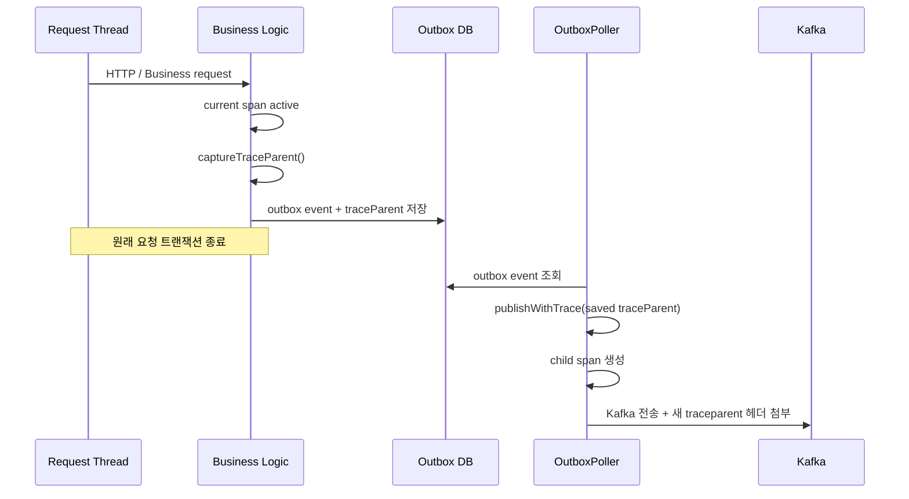

## 1. `trace-id`와 `traceparent`는 왜 둘 다 있는가

현재 코드를 보면 추적 관련 헤더가 두 종류 보인다.

- 인터셉터가 넣는 `trace-id`
- `OutboxPoller`가 넣는 `traceparent`

겉으로는 비슷해 보이지만, 역할이 다르다.

### `trace-id`란 무엇인가

`trace-id`는 이 프로젝트에서 사실상 **로깅/운영 편의를 위한 단순 추적 식별자**에 가깝다.

현재 인터셉터는 `MDC.get("traceId")` 값을 읽어서 헤더에 넣는다.

즉:

- 현재 스레드의 로깅 컨텍스트에 `traceId`가 있으면
- 그 값을 Kafka 헤더에 복사한다

이 값은 로그 상관관계 추적에는 유용하다. 예를 들어 애플리케이션 로그에 같은 `traceId`가 찍히고, Kafka 메시지 헤더에도 같은 값이 있으면 운영자가 수동으로 연관관계를 보기 쉽다.

하지만 `trace-id`는 표준이 아니다.

- 포맷이 팀/시스템마다 다를 수 있다.
- span id, sampling flag, trace state 같은 정보가 없다.
- OpenTelemetry나 W3C Trace Context 도구가 자동 해석해주지 않는다.

즉 `trace-id`는 "간단한 상관관계 키"라고 보는 게 맞다.

### `traceparent`란 무엇인가

`traceparent`는 W3C Trace Context 표준 헤더다.

형식은 대략 다음과 같다.

```text
00-<traceId>-<spanId>-<flags>
```

예:

```text
00-4bf92f3577b34da6a3ce929d0e0e4736-00f067aa0ba902b7-01
```

이 헤더는 단순 식별자 하나가 아니라 분산 추적 시스템이 **부모 span과 자식 span의 관계를 복원**하는 데 필요한 정보를 담고 있다.

현재 프로젝트의 `TraceContextUtil`도 이 값을 기준으로 동작한다.

- 현재 스팬에서 `traceparent`를 캡처
- outbox 이벤트에 저장
- `OutboxPoller`가 나중에 그 값을 복원
- Kafka 발행 시 child span 생성
- 새 `traceparent`를 헤더에 다시 전파

즉 `traceparent`는 진짜 분산 추적 전파용이다.

### 현재 코드에서 둘의 흐름

현재 구조를 풀어 쓰면 이렇다.

#### 1. 일반 Spring 로깅 컨텍스트

애플리케이션 어딘가에서 MDC에 `traceId`가 들어 있으면, `CloudEventsHeaderInterceptor`가 그 값을 `trace-id` 헤더로 넣는다.

이 경로는 로깅 중심이다.

#### 2. OpenTelemetry 연계 경로

`TraceContextUtil`이 활성 Span에서 W3C `traceparent`를 캡처하고, outbox 이벤트 저장 시 보존한다.

그 후 `OutboxPoller`가 비동기 발행 시:

1. 저장된 `traceparent`를 복원
2. child span 생성
3. 새 `traceparent`를 헤더에 넣음

이 경로는 표준 분산 추적 중심이다.

### 왜 둘 다 병존하는가

현재 구조는 과도기적이거나 혼합 전략으로 이해하면 된다.

병존 이유는 보통 다음 중 하나다.

- 기존 로그 추적 체계는 MDC `traceId`를 쓰고 있음
- 새 분산 추적 체계는 OTel/W3C `traceparent`를 쓰고 있음
- 둘을 완전히 통합하기 전까지 둘 다 유지

즉:

- `trace-id`: 사람이 로그를 보기 쉬운 값
- `traceparent`: 툴이 span 관계를 자동 복원하는 값

### 둘 다 쓰는 것의 장단점

장점:

- 기존 로그 기반 운영 관행을 유지할 수 있다.
- OTel 도입 전/후를 부드럽게 연결할 수 있다.
- 수동 분석과 자동 추적을 동시에 지원한다.

단점:

- 헤더 의미가 중복돼 보일 수 있다.
- 어떤 값을 기준으로 추적해야 하는지 팀이 헷갈릴 수 있다.
- 장기적으로는 표준이 둘로 갈라진다.

### 실무적으로 어떻게 정리하는 게 좋은가

가장 이상적인 방향은 다음과 같다.

#### 방향 1. 표준 추적은 `traceparent`로 통일

분산 추적의 기준값은 `traceparent`로 삼는다.

이유:

- W3C 표준이다.
- OpenTelemetry와 자연스럽게 연동된다.
- span 계층 구조를 복원할 수 있다.

#### 방향 2. `trace-id`는 필요하면 보조값으로만 유지

로그 검색 편의가 정말 필요하면 유지할 수 있다. 다만 팀 문서에 명확히 적어야 한다.

- `traceparent`: 시스템 간 전파 표준
- `trace-id`: 운영자 검색용 보조 키

#### 방향 3. 가능하면 `trace-id`를 `traceparent`의 trace id에서 파생

완전히 별개의 값을 두기보다, `traceparent` 안의 trace id 부분을 로그에도 매핑하면 혼란이 줄어든다.

예를 들어:

- 로그 MDC의 `traceId`
- `traceparent`의 trace id

를 같은 값으로 맞추면 운영과 추적이 자연스럽게 이어진다.

### 현재 프로젝트 기준 추천

현재 프로젝트는 이미 `TraceContextUtil`과 `traceparent` 복원 흐름이 있으므로, 장기적으로는 `traceparent`를 메인 표준으로 두는 편이 맞다.

정리하면:

- `traceparent`: 유지
- `trace-id`: 필요 시 보조용
- 문서에 두 값의 역할 차이를 명확히 남길 것

### 한 줄 정리

> `trace-id`는 로그 친화적인 상관관계 키이고, `traceparent`는 W3C 표준 분산 추적 전파 헤더다. 현재 프로젝트는 두 값을 함께 쓰지만, 장기적으로는 `traceparent`를 기준으로 정리하는 편이 더 일관적이다.


## 2. `TraceContextUtil`은 실제로 무엇을 하는가

`traceparent`를 개념적으로만 이해하면 "표준 추적 헤더" 정도로 끝나기 쉽다. 그런데 현재 프로젝트에서는 `TraceContextUtil`이 이 값을 **캡처, 저장, 복원, 재전파**하는 핵심 유틸 역할을 한다.

즉 이 클래스는 단순 헬퍼가 아니라, "동기 요청에서 생성된 trace를 outbox 기반 비동기 Kafka 발행까지 이어 붙이는 브리지"다.

### 왜 이런 유틸이 필요한가

동기 HTTP 요청 안에서는 같은 스레드와 같은 트레이싱 컨텍스트 안에서 작업이 이어진다. 하지만 outbox 패턴에서는 흐름이 끊긴다.

예:

1. HTTP 요청이 들어옴
2. 비즈니스 로직 수행
3. DB + outbox 저장 후 트랜잭션 종료
4. 나중에 `OutboxPoller`가 다른 시점, 다른 스레드에서 Kafka 발행

여기서 별도 처리를 하지 않으면 4번의 Kafka 발행은 원래 요청 trace와 연결되지 않는다.

`TraceContextUtil`은 이 단절을 이어 붙이기 위해 존재한다.

### 클래스가 하는 일 요약

이 클래스는 크게 다섯 가지 역할을 한다.

1. OTel 라이브러리가 클래스패스에 있는지 확인
2. 현재 활성 span에서 `traceparent` 문자열 캡처
3. 저장된 `traceparent` 문자열이 유효한지 검사
4. 저장된 `traceparent`를 원격 부모 컨텍스트로 복원
5. 그 부모 밑에 child span을 만들고 작업 실행

즉 메시징 쪽 관점에서 보면:

- 생산 시점: trace를 문자열로 저장
- 발행 시점: 문자열에서 trace를 복원

이다.


## 3. 코드 기준으로 보는 동작 흐름

### 1단계. OTel 사용 가능 여부 확인

`TraceContextUtil`은 static block에서 `io.opentelemetry.api.trace.Span` 클래스가 있는지 확인한다.

이 방식의 의미는 다음과 같다.

- OTel이 있으면 추적 기능 활성화
- OTel이 없으면 모든 메서드가 no-op 또는 그냥 action 실행

즉 라이브러리 소비 애플리케이션이 OTel을 넣지 않아도 message-lib 자체는 깨지지 않는다.

이건 공통 라이브러리 설계로 꽤 좋은 선택이다.

### 2단계. 현재 trace 캡처

`captureTraceParent()`는 현재 활성 span에서 trace id와 span id를 읽어 W3C 형식 문자열을 만든다.

형식:

```text
00-{traceId}-{spanId}-01
```

즉 이 메서드는 "현재 스레드에서 진행 중인 추적 컨텍스트를 transport 가능한 문자열로 직렬화"하는 역할이다.

이 값은 보통 outbox 이벤트 저장 시점에 함께 보존된다.

### 3단계. 저장된 trace 유효성 검사

`isValidTraceParent()`는 문자열이 최소한 `version-traceId-spanId-flags` 구조인지 확인한다.

현재 검사는 단순한 편이다.

- null/empty 아님
- `-`로 나눴을 때 최소 4파트 이상

엄격한 스펙 검증은 아니지만, 라이브러리에서 최소 방어선 정도로는 충분하다.

### 4단계. 저장된 trace 복원

내부 `OtelBridge.parseTraceParent()`는 문자열에서 trace id와 span id를 꺼내 `SpanContext.createFromRemoteParent(...)`를 만든다.

이 단계가 중요한 이유는, 현재 실행 중인 스레드와 원래 요청 스레드가 완전히 달라도 **"이 작업은 원래 그 trace의 후속 작업이다"** 라고 추적 시스템에 알려줄 수 있기 때문이다.

### 5단계. child span 생성 후 작업 수행

`executeWithRestoredTrace(...)`와 `publishWithTrace(...)`는 복원된 부모 컨텍스트 아래에서 새 span을 만들고 실제 작업을 실행한다.

특히 `publishWithTrace(...)`는 outbox 발행 전용 메서드라서 아래 속성을 자동으로 붙인다.

- `outbox.event.id`
- `outbox.event.type`
- `outbox.aggregate.id`

즉 단순히 trace만 잇는 게 아니라, 나중에 관측 도구에서 "어떤 outbox 이벤트 발행이었는지"까지 검색 가능하게 만든다.


## 4. 현재 프로젝트에서의 실제 흐름

현재 프로젝트 흐름을 한 줄씩 풀면 이렇다.



이 흐름의 핵심은 다음 두 문장이다.

- 요청 시점의 trace를 문자열로 저장한다.
- 비동기 발행 시점에 그 문자열을 다시 trace 컨텍스트로 복원한다.

이걸 하지 않으면 outbox 기반 비동기 발행은 분산 추적 상에서 고립된 새 작업처럼 보인다.


## 5. `trace-id` 문서에서 `TraceContextUtil`을 같이 봐야 하는 이유

앞에서 `trace-id`와 `traceparent`의 차이를 설명했지만, `TraceContextUtil`을 같이 보면 차이가 더 분명해진다.

### `trace-id`

- 주로 MDC 기반
- 사람이 로그를 검색하기 쉬움
- 단순 문자열
- 부모/자식 span 관계 복원 불가

### `traceparent`

- W3C 표준 포맷
- `TraceContextUtil`이 캡처/복원 가능
- child span 생성 가능
- 분산 추적 도구와 자동 연동 가능

즉 `TraceContextUtil`이 존재한다는 사실 자체가, 현재 프로젝트에서 진짜 추적 표준은 `traceparent` 쪽이라는 강한 근거다.


## 6. 현재 구현의 장점

### 1. OTel이 없어도 라이브러리가 깨지지 않는다

compileOnly 의존과 런타임 체크를 조합해서, 소비 애플리케이션의 선택권을 남겼다.

### 2. Outbox 비동기 경계를 trace로 연결한다

동기 요청과 비동기 Kafka 발행 사이의 단절을 메운다. 이건 outbox 기반 메시징에서 꽤 중요한 구현 포인트다.

### 3. 메시징 도메인 속성을 span에 남긴다

`outbox.event.id`, `outbox.event.type`, `outbox.aggregate.id` 속성은 운영과 디버깅에 실질적으로 도움이 된다.


## 7. 현재 구현에서 아쉬운 점

### 1. `isValidTraceParent()` 검증이 단순하다

현재는 파트 수만 본다. 필요하면 길이, hex 형식, flags 값까지 더 엄격히 검사할 수 있다.

### 2. `trace-id`와 `traceparent`의 역할이 코드상으로 완전히 정리되지는 않았다

`TraceContextUtil`은 표준 추적을 다루고, 인터셉터는 `trace-id`를 넣는다. 이 둘의 우선순위와 운영 기준은 문서화해두는 편이 좋다.

### 3. 로그 MDC와 OTel trace id 매핑 규칙이 보이지 않는다

가장 이상적인 구조는 MDC의 `traceId`가 `traceparent` 안의 trace id와 일치하는 것이다. 현재는 그 규칙이 코드에서 명확히 드러나지 않는다.


## 8. 실무적 해석

`TraceContextUtil`을 기준으로 보면, 현재 프로젝트에서 `traceparent`는 단순 부가 헤더가 아니다.

이 값은:

- 원래 요청의 trace를 outbox에 저장하고
- 나중에 Kafka 발행에서 다시 되살리고
- 새 child span을 만들고
- 다음 시스템으로 전파하는

핵심 연결자다.

반대로 `trace-id`는 운영 편의용 보조 헤더로 보는 편이 더 맞다.


## 9. 한 줄 요약

> `TraceContextUtil`은 현재 trace를 `traceparent` 문자열로 캡처해 outbox에 저장하고, 나중에 그 값을 복원해 Kafka 발행을 원래 요청 trace의 child span으로 연결해 주는 브리지다. 그래서 현재 구조에서 진짜 분산 추적의 기준은 `traceparent`다.
