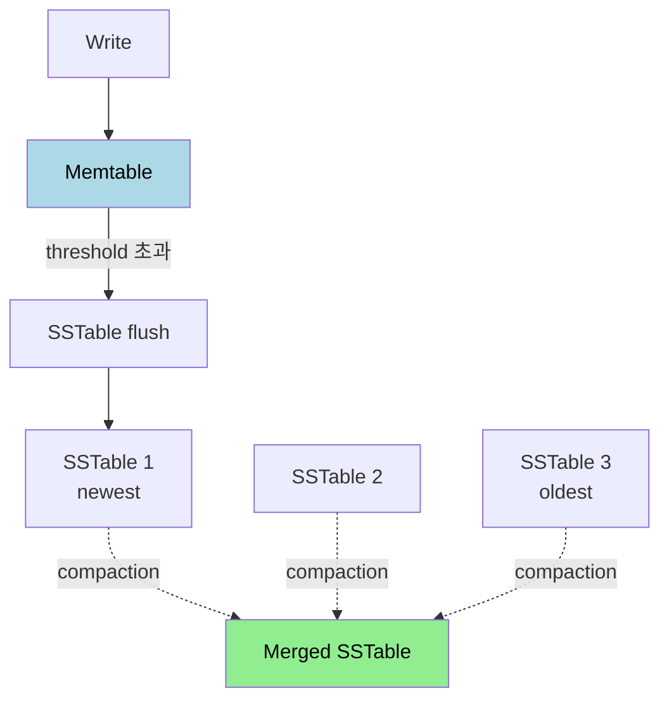
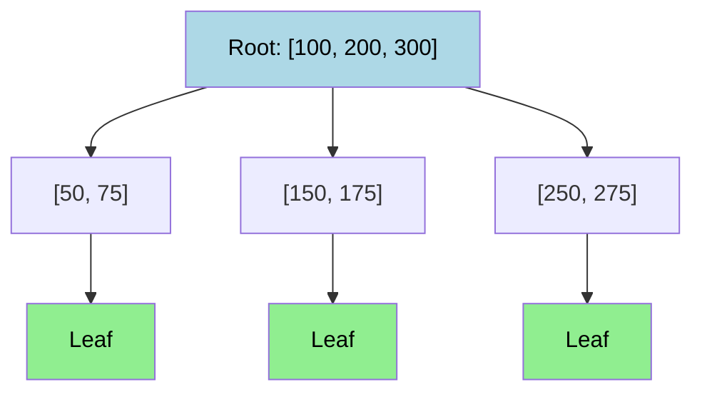

# 저장소와 검색

---

> DB 의 가장 근본 역할은 데이터를 디스크에 두고 다시 찾아오는 것이다. 어떤 자료구조로 저장할지에 따라 같은 워크로드의 처리량이 한 자릿수 차이로 갈린다. 본 챕터는 OLTP 의 두 갈래(LSM-Tree·B-Tree)와 OLAP 의 컬럼 저장이 각각 어떤 가정 위에서 어떻게 동작하는지를 정리하고, 보조 인덱스·전문 검색·벡터 인덱스가 그 위에 어떻게 얹히는지를 한 자리에 모은다.


## 왜 저장 엔진 내부를 알아야 하는가

> ORM 위에서 SQL 만 짜다 보면 "왜 이 쿼리가 100ms 걸리고 저 쿼리는 10s 걸리는가" 라는 질문 앞에서 직관이 흔들린다. 저장 엔진의 자료구조를 알면 왜 인덱스가 쓰기 비용을 늘리는지, 왜 작은 업데이트도 페이지 전체를 다시 쓰는지, 왜 PostgreSQL 이 `VACUUM` 을 필요로 하는지가 한 줄로 설명된다.

세상에서 가장 단순한 DB 는 두 줄의 셸 함수로 만들 수 있다. 키와 값을 줄 단위로 파일 끝에 붙이고, 읽을 때는 파일을 끝까지 읽어 마지막 매치를 돌려준다.

```bash
db_set () { echo "$1,$2" >> database; }
db_get () { grep "^$1," database | sed -e "s/^$1,//" | tail -n 1; }
```

쓰기는 O(1) 다. 디스크 끝에 추가만 하면 끝이라 시퀀셜 I/O 의 이점을 누린다. 읽기는 O(n) 인데, 파일을 처음부터 끝까지 훑어야 하기 때문이다. 운영 DB 가 이 이상으로 가야 하는 이유는 명확하다. 읽기를 빠르게 하려면 인덱스가 필요하고, 인덱스는 본질적으로 "기본 데이터에서 파생된 추가 자료구조" 다. 어떤 인덱스를 어떻게 만드느냐가 바로 저장 엔진의 정체성이다.

인덱스에는 항상 트레이드오프가 따른다. 읽기는 빨라지지만 쓰기 때마다 인덱스도 갱신해야 하므로 쓰기는 느려지고, 인덱스 자체가 디스크를 차지한다. 그래서 모든 컬럼에 인덱스를 깔지 않고, 워크로드가 자주 묻는 질문에만 인덱스를 만든다. 본 챕터의 나머지는 그 인덱스를 어떻게 만들지에 대한 두 갈래 답이다.


## Log-Structured Storage — 추가만 하는 길

> 모든 쓰기를 파일 끝에 추가하고, 검색은 별도 인덱스로 푸는 접근이다. 시퀀셜 I/O 의 이점을 끝까지 끌고 간다.

### 해시 인덱스 — 단순한 시작

가장 단순한 형태는 메모리에 키 → 파일 오프셋 매핑(해시 맵)을 두고, 디스크 파일은 append-only 로 두는 것이다. Bitcask(Riak) 가 이 접근을 그대로 쓴다. 쓰기는 파일 끝에 한 줄 추가하고 해시 맵 한 항목을 갱신하면 끝, 읽기는 해시 맵에서 오프셋을 꺼내 파일 위치로 바로 점프한다.

이 단순함의 대가가 네 가지다. 디스크 공간이 한없이 커진다(같은 키의 옛 값이 계속 남는다), 재시작 시 해시 맵을 디스크 스캔으로 재구축해야 한다, 해시 맵이 메모리에 들어가야 하므로 키 카디널리티가 제한된다, 그리고 키 순서가 없어 범위 쿼리가 불가능하다. 이 한계들이 다음 단계인 SSTable 로 이어진다.

### SSTable — 정렬된 파일

해시 인덱스의 키 순서 문제를 풀려면 파일 자체를 키 순으로 정렬해 두면 된다. 이를 SSTable(Sorted String Table) 이라고 부른다. 정렬되어 있다는 가정이 세 가지 이점을 만든다.

1. 메모리 인덱스가 sparse 해도 된다. 모든 키가 아니라 파일 블록의 첫 키만 메모리에 두면, 검색 시 해당 블록을 찾아 그 안만 순차 스캔하면 된다. 키 카디널리티가 늘어도 메모리 사용이 따라 늘지 않는다.
2. 범위 쿼리가 효율적이다. 정렬된 키들이 인접 위치에 모여 있으니 한 번의 시퀀셜 읽기로 끝난다.
3. 블록 단위 압축이 자연스럽게 가능하다. 같은 종류의 키들이 모여 있어 압축률이 높다.

### LSM-Tree — Memtable + SSTable + Compaction

문제는 디스크에 쓸 때 키 순으로 정렬해서 쓰는 비용이다. LSM-Tree(Log-Structured Merge-Tree) 가 이 비용을 메모리로 옮긴다.



쓰기는 메모리의 Memtable(레드-블랙 트리나 스킵 리스트 같은 정렬된 자료구조) 에 들어간다. Memtable 이 임계 크기를 넘으면 디스크에 SSTable 로 flush 한다. 그러면 디스크에는 시간 순으로 SSTable 들이 쌓인다. 읽기는 Memtable 부터 보고, 없으면 가장 최신 SSTable, 그 다음 그 다음 순서로 내려간다.

배경에서는 컴팩션(compaction) 이 돈다. 여러 SSTable 을 합치면서 같은 키의 옛 버전을 버리고 정렬을 유지한다. 이 구조의 가치는 모든 디스크 쓰기가 시퀀셜이라는 점이다. 회전 디스크든 SSD 든 시퀀셜 쓰기가 랜덤 쓰기보다 한 자릿수 빠르므로 쓰기 처리량에서 큰 이득이 난다. RocksDB·Cassandra·HBase·LevelDB 가 이 구조 위에 서 있다.

삭제는 어떻게 처리하는가. 옛 SSTable 의 행을 직접 지울 수 없으므로 "이 키는 삭제됨" 이라는 묘비(tombstone) 를 새 SSTable 에 적는다. 컴팩션 과정에서 묘비와 그보다 오래된 모든 같은 키 항목이 함께 사라진다.

### Bloom Filter — 없다는 사실을 빨리 답하기

LSM-Tree 의 약점 중 하나는 "찾는 키가 없는" 경우다. 모든 SSTable 을 다 뒤져야 "없다" 고 결론낼 수 있다. Bloom Filter 가 이 비용을 줄인다.

각 SSTable 에는 작은 비트 배열로 만든 Bloom Filter 가 함께 저장된다. 키 추가 시 여러 해시 함수로 비트 위치 몇 개를 1 로 설정한다. 조회 시 같은 해시들로 비트를 확인하는데, 하나라도 0 이면 그 키는 그 SSTable 에 **확실히** 없다(False Negative 불가). 모든 비트가 1 이면 있을 수도 있고 없을 수도 있다(False Positive 가능). 운영 기준으로 키당 10 비트면 약 1% 의 False Positive, 15 비트면 0.1% 다.

False Positive 가 일어나도 SSTable 을 확인하면 되므로 정확성이 깨지지 않는다. 다만 "있을 가능성" 만 가려 줘도 대부분의 SSTable 을 건너뛸 수 있어 읽기 지연이 크게 줄어든다.

### 컴팩션 전략 — Size-Tiered vs Leveled

컴팩션을 어떻게 묶을지가 처리량과 디스크 사용량을 좌우한다. 두 갈래가 있다.

Size-Tiered(Cassandra 기본) 은 비슷한 크기의 SSTable 들이 모이면 합쳐 더 큰 SSTable 을 만든다. 쓰기 처리량이 높지만 컴팩션 도중 임시 디스크가 많이 필요하고, 한 키가 여러 큰 SSTable 에 흩어질 수 있어 읽기는 다소 불리하다.

Leveled(LevelDB·RocksDB 기본) 은 레벨별로 고정된 크기 한도를 두고, 한 레벨이 차면 다음 레벨로 점진적으로 병합한다. 같은 키 범위가 한 레벨에 한 SSTable 만 있도록 유지되어 읽기가 빠르고 디스크 공간도 적게 든다. 대신 컴팩션 횟수가 많아져 쓰기 증폭(아래 절) 이 더 크다.


## B-Tree — 50 년 된 자료구조

> 거의 모든 관계형 DB 의 기본 인덱스다. PostgreSQL·MySQL·Oracle 모두 B-Tree(정확히는 B+Tree) 를 쓴다.

LSM-Tree 가 "추가만 하는" 접근이라면 B-Tree 는 "제자리에서 갱신하는" 접근이다. 데이터를 고정 크기 페이지(보통 4KB~16KB) 에 담고, 페이지들이 트리로 연결된다. 루트 페이지에서 시작해 키 범위에 따라 자식 페이지로 내려가다 리프 페이지에 도달하면 거기에 실제 데이터(또는 데이터 위치) 가 있다.



한 페이지의 자식 참조 수(branching factor) 가 보통 수백 개라, 트리 깊이가 3~4 레벨이면 수십억 키를 다룰 수 있다. 4KB 페이지에 branching factor 500 으로 4 레벨이면 약 62.5 조 개 키 공간이라는 계산이 나온다. 실무에서 B-Tree 깊이가 5 를 넘는 일은 거의 없다.

### 페이지 분할 — 갱신이 일어나면

리프 페이지가 가득 찬 상태에서 새 키가 들어오면 페이지를 둘로 쪼갠다. 분할된 두 페이지의 경계 키가 부모 페이지에 새 항목으로 추가된다. 부모도 가득 차면 또 분할되고, 최악의 경우 루트까지 분할이 전파되며 트리 깊이가 1 늘어난다. 이 과정이 B-Tree 가 항상 균형을 유지하는 비결이다.

분할 도중에 서버가 죽으면 어떻게 되는가. 새 페이지가 만들어졌는데 부모는 아직 새 자식을 가리키지 않는 상태로 남으면, 그 키는 영원히 잃어버린다. 이 위험을 막으려면 변경을 디스크 페이지에 적용하기 *전에* 별도 로그에 먼저 적어 둔다. 이를 Write-Ahead Log(WAL) 라고 부른다. 크래시 후 시작 시 WAL 을 재생해 미완성 변경을 복구한다.

### B-Tree 의 동시성 — 잠금과 MVCC

B-Tree 는 in-place update 라 같은 페이지를 두 트랜잭션이 동시에 만지면 문제가 생긴다. 전통적 DB 는 페이지 잠금(latch) 으로 짧게 보호한다. 다만 트랜잭션 단위의 격리는 잠금만으로 풀지 않고 MVCC(다중 버전 동시성 제어) 로 푸는 DB 가 많다. PostgreSQL 의 MVCC 동작은 [`./01-04.트랜잭션과 격리 수준.md`](./01-04.트랜잭션과%20격리%20수준.md) 의 MVCC 절에서 자세히 다룬다.


## B-Tree vs LSM-Tree

> 같은 OLTP 워크로드를 풀지만 트레이드오프가 다르다. 어느 쪽을 고를지는 워크로드의 읽기·쓰기 비율과 지연 시간 요구로 갈린다.

| 항목 | B-Tree | LSM-Tree |
|------|--------|----------|
| 읽기 | 빠르고 예측 가능 | 여러 SSTable + Bloom Filter |
| 쓰기 패턴 | 랜덤 (페이지 덮어쓰기) | 시퀀셜 (append) |
| 쓰기 처리량 | 보통 | 높음 |
| 쓰기 증폭 | WAL + 페이지 전체 재작성 | Memtable flush + N 회 컴팩션 |
| 범위 쿼리 | 빠름 | 여러 SSTable 병렬 스캔 |
| 디스크 단편화 | 발생 | 컴팩션이 정리 |
| 적합한 워크로드 | 읽기 중심 OLTP | 쓰기 중심 OLTP, 시계열·로그 |

### 쓰기 증폭(Write Amplification) 의 의미

쓰기 증폭은 애플리케이션이 1바이트 쓸 때 디스크에 실제로 몇 바이트가 쓰이는가의 비율이다. 두 자료구조 모두 0 이 될 수 없다.

B-Tree 는 작은 변경 한 건도 페이지 전체를 재작성한다. 4KB 페이지에서 8 바이트만 바뀌어도 4KB 가 디스크로 흘러간다. 게다가 WAL 에 한 번 더 쓴다. LSM-Tree 는 처음 한 번은 시퀀셜로 가볍게 쓰지만, 컴팩션이 같은 데이터를 여러 번 다시 쓴다. Leveled 컴팩션은 레벨이 깊어질수록 같은 키를 다시 만나 더 자주 합쳐진다.

쓰기 증폭이 중요한 이유는 세 가지다. 디스크 대역폭 한도를 증폭치만큼 나눠 쓰기 처리량 상한이 떨어진다. SSD 는 셀 마모가 누적 쓰기로 결정되니 수명이 짧아진다. 그리고 클라우드는 IOPS 와 처리량에 비용을 매기므로 그대로 운영비가 된다. 운영 시점에 두 엔진을 비교할 때 흔히 쓰기 증폭과 공간 증폭(disk usage / live data) 을 함께 본다.


## 보조 인덱스와 클러스터드 인덱스

> 기본 키 외의 검색 조건에도 빠르게 답하려면 보조 인덱스(secondary index) 가 필요하다. 인덱스가 실제 행을 어떻게 가리키느냐가 두 가지 모델로 갈린다.

**클러스터드 인덱스** (MySQL InnoDB 의 기본 키) 는 인덱스 트리의 리프에 실제 행 데이터를 직접 저장한다. 기본 키 검색이 한 번의 트리 탐색으로 끝나는 대신, 보조 인덱스 검색은 트리에서 기본 키를 찾고 다시 클러스터드 인덱스를 한 번 더 탄다.

**힙 파일 + 보조 인덱스** (PostgreSQL 의 기본) 는 행을 별도의 힙 파일에 두고 모든 인덱스가 그 위치(`ctid`) 를 가리킨다. 모든 인덱스가 동등한 비용이지만, 행 위치가 바뀔 때(페이지 분할 등) 모든 인덱스를 갱신해야 하는 부담이 있다.

**커버링 인덱스** 는 보조 인덱스에 추가 컬럼을 같이 저장해 두는 변형이다. 인덱스만 봐도 쿼리에 답할 수 있어 힙 파일 접근이 한 번 줄어든다. PostgreSQL 의 `INCLUDE` 절, MySQL 의 다중 컬럼 인덱스가 같은 효과를 낸다. 단점은 인덱스 크기가 커지고 갱신 비용이 늘어난다는 점이다. PostgreSQL 의 인덱스 변형(GIN·GiST·BRIN)은 [`./postgres/`](./postgres/) 챕터에서 다룬다.


## 인메모리 DB — 디스크가 사라지면

Redis·VoltDB 같은 인메모리 DB 의 성능 우위는 흔히 "디스크 I/O 가 없어서" 라고 알려져 있다. 정확한 답은 다르다. OS 페이지 캐시 덕에 자주 쓰는 데이터는 디스크 DB 도 메모리에서 읽는다. 인메모리 DB 의 진짜 이득은 **디스크용 인코딩 오버헤드가 사라진다는 점** 이다. 행을 디스크 친화적 바이트 형태로 직렬화·역직렬화할 필요가 없고, 메모리 전용 자료구조(Redis 의 sorted set, priority queue 등) 를 자유롭게 쓸 수 있다.

내구성은 어떻게 보장하는가. 별도 로그(AOF), 주기적 스냅샷(RDB), 복제본을 조합한다. 단일 머신 기준의 ACID Durability 는 약하지만, 클러스터 단위로 보면 충분히 신뢰할 수 있는 수준까지 끌어올릴 수 있다.


## 컬럼 저장소 — OLAP 의 길

> 분석 쿼리는 100 개 컬럼 중 3 개만 보고 수백만 행을 집계하는 경우가 흔하다. 행 단위로 저장된 페이지를 모두 읽는 비용이 압도적이라 다른 모델이 필요해진다.

### 행 단위 vs 컬럼 단위

행 지향 저장소는 한 행의 모든 컬럼을 인접 디스크 위치에 둔다. 컬럼 지향 저장소는 같은 컬럼의 값들을 한 파일에 모은다. `SELECT date_key, sum(qty) FROM sales GROUP BY date_key` 라면 컬럼 두 개만 읽으면 되므로 I/O 가 100 배 줄 수 있다.

### 컬럼 압축 — 같은 타입은 잘 압축된다

같은 컬럼은 데이터 타입과 분포가 일정해, 행 지향 대비 5~10 배까지 작아지는 사례가 흔하다. 한 사례가 비트맵 인코딩이다. `product_sk` 가 distinct 값 3 개뿐이라면, 각 distinct 값마다 비트맵 하나를 만든다.

```
원본: [31, 68, 31, 69, 31, 68, 31, ...]
↓
product_sk = 31: [1, 0, 1, 0, 1, 0, 1, ...]
product_sk = 68: [0, 1, 0, 0, 0, 1, 0, ...]
product_sk = 69: [0, 0, 0, 1, 0, 0, 0, ...]
```

이렇게 두면 `WHERE product_sk IN (31, 68)` 은 두 비트맵의 OR 연산 한 번으로 끝난다. CPU 의 SIMD 명령으로 64 비트를 한 번에 처리하므로 행을 하나씩 비교하는 길보다 한 자릿수 빠르다. 비트맵에 다시 Run-Length Encoding 을 적용하면 압축률이 더 올라간다.

정렬 순서도 압축에 영향을 준다. 첫 번째 정렬 키는 같은 값이 연속해 나타나 RLE 효율이 극대화되지만, 두 번째 키부터는 점점 효과가 줄어든다. Vertica·Snowflake 같은 컬럼 DB 는 자주 쓰는 정렬 순서를 두 가지 이상 유지하기도 한다.

### 벡터화 처리(Vectorized Processing) vs 쿼리 컴파일

행을 한 번에 한 행씩 처리하면 함수 호출 오버헤드가 큰데, 컬럼 지향 환경은 같은 연산을 배치(보통 1024 행 묶음) 로 처리해 함수 호출을 줄이고 SIMD 를 쓴다. 이를 벡터화 처리라고 부른다(MonetDB, DuckDB).

쿼리 컴파일 접근(Apache Impala, Spark Tungsten)은 SQL 을 LLVM 으로 기계어 코드로 만들어 행 단위로 도는 루프 자체를 빠르게 만든다. 두 접근 모두 행 지향 OLTP 엔진보다 한 자릿수 빠르며, 어느 쪽이 우월한지는 아직 결론이 나지 않았다.

### 머터리얼라이즈드 뷰와 데이터 큐브

자주 쓰는 집계를 미리 계산해 둔다는 발상이다. `SUM(qty) GROUP BY (date, product, store)` 같은 집계를 별도 테이블로 유지하다가, 원본이 바뀌면 점진적으로 갱신한다. 미리 정의된 차원 조합만 빠를 수 있다는 단점이 있어, OLAP 큐브 시스템은 차원 N 개의 모든 조합을 미리 계산해 두는 식으로 유연성과 비용을 맞바꾼다.


## 다차원·전문·벡터 인덱스

> 1차원 키 비교를 넘어선 검색은 다른 자료구조가 필요하다.

**다차원 인덱스** 는 위경도 같은 두 차원 이상을 동시에 보고 싶을 때 쓴다. `(lastname, firstname)` 같은 결합 인덱스는 lastname 으로 시작해야만 효과를 보지만, 위경도 범위 검색(예: 특정 박스 안의 식당) 은 한 차원만 좁혀서는 효율이 안 난다. R-Tree(PostGIS) 와 Bkd-Tree 같은 공간 인덱스가 이 자리다.

**전문 검색의 역색인(inverted index)** 은 "단어 → 문서 ID 목록" 매핑을 둔다. 각 단어의 posting list 를 비트맵으로 두면 `red AND apple` 같은 조건이 비트맵 AND 한 번에 끝난다. Lucene·Elasticsearch·PostgreSQL 의 GIN 인덱스 모두 이 구조다.

**벡터 인덱스** 는 의미 기반 검색이 등장하면서 도드라졌다. 텍스트나 이미지가 임베딩 모델을 거쳐 1024 차원 같은 벡터로 바뀌면, "의미 유사한" 결과를 찾는 일이 "벡터 거리 가까운" 결과를 찾는 일로 바뀐다. 모든 벡터를 다 비교하는 Flat 방식은 정확하지만 느리고, IVF(클러스터 분할) 와 HNSW(계층적 그래프) 같은 근사 최근접 이웃 알고리즘이 운영 표준이다. pgvector·Faiss·Milvus 가 이 인덱스를 제공한다.


## 워크로드별 선택 가이드

| 워크로드 | 권장 저장 모델 | 대표 시스템 |
|---------|---------------|-------------|
| 읽기 중심 OLTP | B-Tree | PostgreSQL, MySQL InnoDB |
| 쓰기 중심 OLTP | LSM-Tree | RocksDB, Cassandra, ScyllaDB |
| 분석 (OLAP) | 컬럼 저장 | Snowflake, DuckDB, ClickHouse |
| 시계열 | LSM + 컬럼 | InfluxDB, TimescaleDB |
| 전문 검색 | 역색인 | Elasticsearch, OpenSearch |
| 의미 검색 | 벡터 인덱스 | pgvector, Milvus, Faiss |

운영 DB 가 PostgreSQL 이라면 기본 인덱스가 B-Tree 인 셈이다. 같은 PostgreSQL 안에서도 GIN(역색인 변형) 으로 전문 검색을, BRIN 으로 거대한 시계열 테이블을, GiST 로 공간 인덱스를 함께 다룰 수 있다. 한 엔진이 여러 인덱스 모델을 제공하는 사례라 학습 가치가 크다.


## 면접 대비 체크리스트

> 본 챕터를 읽은 뒤 다음 질문에 답할 수 있어야 한다.

1. LSM-Tree 와 B-Tree 의 디스크 쓰기 패턴이 시퀀셜·랜덤 어느 쪽인지, 그것이 처리량 차이로 어떻게 이어지는지 설명할 수 있는가?
2. Bloom Filter 가 False Positive 는 허용하지만 False Negative 는 절대 일어나지 않는 이유는? LSM-Tree 의 어느 자리에서 그 비대칭성이 가치가 있는가?
3. Size-Tiered 와 Leveled 컴팩션의 트레이드오프를 한 시나리오로 설명할 수 있는가?
4. B-Tree 의 페이지 분할이 진행되는 도중 서버가 죽으면 어떤 일이 벌어지는가? WAL 이 그 자리에서 무엇을 보장하는가?
5. 쓰기 증폭이 무엇이고, 운영에서 왜 디스크 비용·SSD 수명·처리량 세 가지에 모두 영향을 주는가?
6. 클러스터드 인덱스(MySQL InnoDB)와 힙 파일 + 보조 인덱스(PostgreSQL)의 보조 인덱스 비용이 어떻게 다른지?
7. 컬럼 저장소가 같은 데이터를 행 지향 대비 한 자릿수 작게 압축할 수 있는 이유 두 가지는? 비트맵 인코딩과 정렬 순서가 각각 어떻게 기여하는가?
8. 인메모리 DB 의 성능 이득이 "디스크 I/O 부재" 가 아닌 진짜 이유는?
9. 벡터 인덱스에서 Flat·IVF·HNSW 가 정확도와 지연 시간 사이에서 어떻게 갈리는지 설명할 수 있는가?


## 관련 문서

- [`./README.md`](./README.md) — 06_data 진입
- [`./01-04.트랜잭션과 격리 수준.md`](./01-04.트랜잭션과%20격리%20수준.md) — MVCC 가 B-Tree 의 in-place update 위에서 어떻게 동작하는가
- [`./postgres/README.md`](./postgres/README.md) — B-Tree 외 GIN·GiST·BRIN 같은 PostgreSQL 인덱스 변형 (후속 Phase)
- [`../05_messaging/README.md`](../05_messaging/README.md) — Kafka 의 시퀀셜 로그 구조, LSM 과 같은 가정 위에 서 있음


## 참고 자료

- DDIA Chapter 3 — Storage and Retrieval (Martin Kleppmann, 2017)
- Patrick O'Neil et al. *The Log-Structured Merge-Tree (LSM-Tree)* (1996)
- Rudolf Bayer & Edward McCreight — B-Tree 원논문 (1970)
- Michael Stonebraker et al. *C-Store: A Column-oriented DBMS* (2005)
- Yury Malkov & Dmitry Yashunin *Efficient and robust approximate nearest neighbor search using HNSW graphs* (2020)
- [PostgreSQL Internals (interdb)](https://www.interdb.jp/pg/)
- [RocksDB Wiki](https://github.com/facebook/rocksdb/wiki)
