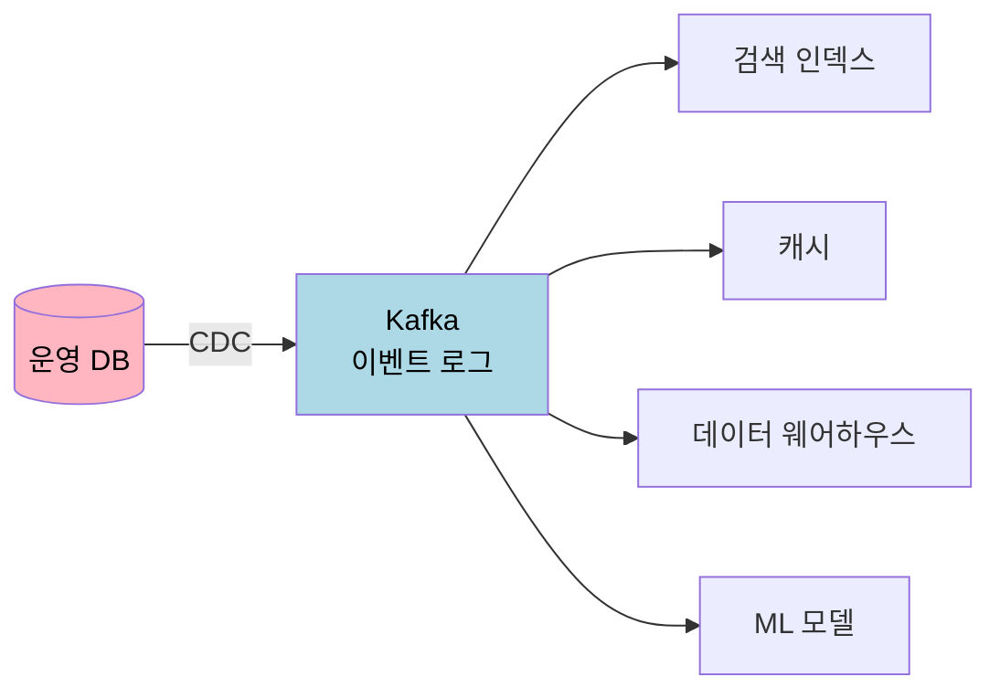

# 스트리밍 시스템 철학

---

> 본 챕터는 단일 도구의 사용법이 아니라 *여러 도구를 조합해 어떻게 데이터 시스템을 짤 것인가* 를 다룬다. DDIA 13 장이 다룬 주제로, 데이터 통합 문제, 데이터베이스 unbundling, write/read path 의 분리, end-to-end argument, timeliness vs integrity, 조정 회피(coordination-avoiding) 시스템까지가 묶인다. 본 카테고리의 마지막 챕터로, 앞 두 챕터(배치·스트림) 와 04_distributed 의 모든 도구가 이 철학 위에서 조합된다.


## 데이터 통합 — 같은 데이터를 여러 곳에서

> 운영 시스템은 같은 데이터를 운영 DB·검색 인덱스·캐시·데이터 웨어하우스·ML 모델 등 여러 곳에서 본다. 이들을 어떻게 동기화할지가 데이터 통합의 본질 문제다.

흔한 첫 답이 **dual-write** 다. 애플리케이션 코드가 운영 DB 와 검색 인덱스에 *동시에* 쓴다. 둘 중 하나가 실패하면 일관성이 깨진다. 실패 처리 로직이 점점 복잡해지고 결국 어느 시점에 두 시스템이 어긋나서 사람이 수동 동기화를 해야 한다.

본질적 답은 진실의 원천을 *한 곳* 에 두는 것이다. 운영 DB 가 진실이고 다른 시스템들은 그 변경을 따라간다. 이를 받쳐 주는 도구가 CDC([`./02-02.스트림 처리.md`](./02-02.스트림%20처리.md) 참고) 와 이벤트 로그다.



이 모델의 가치는 **새 시스템 추가가 자유롭다** 는 점이다. 새 ML 모델을 학습시키려면 기존 컨슈머를 건드리지 않고 로그를 처음부터 다시 읽으면 된다. 운영 DB 의 모든 변경이 영구 보관된 이벤트 로그에 남아 있으므로 어떤 새 분석도 과거 데이터로 검증 가능하다.


## 데이터베이스 Unbundling

> 전통적 DB 는 여러 기능(저장·인덱싱·복제·캐싱·검색·트리거) 을 한 통합 시스템에 묶어 둔다. Unbundling 은 그 기능들을 분리해 각각 특화 시스템으로 갈라 놓고, 이벤트 로그가 그것들을 묶는 발상이다.

전통적 모델을 보면 이렇다. PostgreSQL 한 대가 OLTP 도 풀고, 검색을 위한 fulltext 인덱스도 갖고, 트리거로 알림도 보내고, 복제로 가용성도 받친다. 한 시스템 안에서 모든 게 일어나니 일관성은 강하지만 각 기능이 한 시스템의 한도 안에서만 동작한다.

Unbundling 모델은 다르다. PostgreSQL 은 OLTP 만 한다. 검색은 Elasticsearch, 캐시는 Redis, 분석은 ClickHouse, 알림은 Kafka + 컨슈머. 모두 별개의 특화 시스템이고, 이벤트 로그가 이들 사이의 동기화를 담당한다.

이 발상의 강점은 **각 시스템이 자기 자리에 최적화** 된다는 점이다. Elasticsearch 는 검색에 특화되어 PostgreSQL 의 fulltext 보다 한 자릿수 빠르고, ClickHouse 는 분석에 특화되어 OLTP 위 SQL 보다 압도적이다. 단점은 운영 복잡도 — 시스템 N 개의 가용성·모니터링·백업이 따로 따라온다.

운영에서는 처음부터 unbundling 으로 가는 게 아니라 PostgreSQL 한 대로 시작해 필요할 때마다 한 자리씩 갈라낸다. 검색이 한계에 부딪히면 Elasticsearch 를 빼내고, 분석 쿼리가 운영을 방해하면 분석 시스템을 빼낸다. *언제 빼낼지* 의 결정이 운영의 가장 흔한 아키텍처 결정 중 하나다.


## Write Path 와 Read Path

> 데이터의 쓰기 경로와 읽기 경로를 분리하는 발상이다. CQRS 의 일반화이자 데이터 통합의 핵심 패턴이다.

**Write Path** 는 진실의 원천이다. 사용자 행동·시스템 이벤트·CDC 가 만드는 변경이 모두 한 이벤트 로그에 모인다. 쓰기는 단순하고 변경 가능성이 적다.

**Read Path** 는 워크로드별로 최적화된 머터리얼라이즈드 뷰들이다. 사용자 프로필 조회는 KV 저장소, 검색은 Elasticsearch, 통계 대시보드는 ClickHouse. 모두 같은 이벤트 로그에서 만들어진다.

```
Write Path:
사용자 → 명령 → 진실 검증 → Event Log
                              ↓
Read Path:                    ↓
                  ┌───────────┼───────────┐
                  ▼           ▼           ▼
           Profile View   Search    Analytics
              (KV)        (ES)       (CH)
```

이 분리의 가치는 **읽기 워크로드 최적화의 자유** 다. 새 읽기 패턴이 등장하면 기존 시스템을 건드리지 않고 새 머터리얼라이즈드 뷰를 만든다. 옛 뷰는 그대로 두면서 점진적으로 새 뷰로 옮긴다. 시스템 진화의 부담이 압도적으로 줄어든다.

CQRS(Command Query Responsibility Segregation) 가 같은 발상을 단일 시스템 안에서 적용한 것이다. 큰 발상은 같다 — 쓰기와 읽기가 같은 자료구조에 매여 있을 이유가 없다.


## End-to-End Argument 의 데이터 시스템 적용

> 1984 년 Saltzer·Reed·Clark 이 네트워크 프로토콜에 적용한 발상이다. "낮은 계층이 신뢰성을 보장해도 높은 계층이 결국 자기 자신의 검증을 해야 한다." 같은 발상이 데이터 시스템에 적용된다.

흔한 함정 시나리오. Kafka 는 **at-least-once** 전달을 약속한다. 같은 메시지가 두 번 전달될 수 있다. 컨슈머가 멱등 처리를 하지 않으면 두 번 적용된다. 같은 사용자 결제가 두 번 일어나는 사고가 여기서 난다.

답은 *한 단계 위* 에서 검증하는 것이다. 메시지 자체에 idempotency key 를 박고, 컨슈머가 그 키를 이미 처리한 적이 있는지 확인한다. Kafka 가 at-least-once 만 약속해도 애플리케이션 레벨에서 exactly-once 가 만들어진다.

운영 시스템에서 이 발상이 들어가는 자리는 많다. **DB 트랜잭션** 으로 충분해 보이는 자리에서도 비즈니스 검증이 따로 들어가야 하고, **HTTPS** 가 안전해 보여도 애플리케이션에서 입력 검증을 해야 하며, **Kafka 의 정합성** 위에서도 컨슈머의 멱등성이 필요하다. 어떤 메커니즘도 단독으로는 충분하지 않다.


## Timeliness vs Integrity

> 두 가지가 정확성의 다른 차원이다. 운영에서 흔히 헷갈린다.

**Timeliness(적시성)** — 결과가 *얼마나 최신* 인가. 분 단위 지연인지, 초 단위인지.

**Integrity(정합성)** — 결과가 *정확한가*. 누락·중복이 없는가, 인과 순서가 보존되는가.

두 차원이 독립이다. 1 분 지연된 정확한 결과(integrity 있음, timeliness 약함) 가 운영에 충분한 자리가 있고, 즉시 응답하는 부정확한 결과(timeliness 강함, integrity 약함) 가 더 나쁜 자리가 있다.

스트림 처리는 둘을 모두 받아 주려는 시도다. 그러나 비용이 따라온다. Exactly-once 처리(integrity 강함) 는 처리량을 떨어뜨리고, 짧은 윈도우(timeliness 강함) 는 늦게 도착한 이벤트를 잃을 위험이 있다. 운영 결정은 보통 *integrity 우선, timeliness 는 받아 줄 수 있는 만큼* 으로 간다. 부정확한 결과를 빠르게 받는 것보다 정확한 결과를 잠시 기다리는 게 거의 항상 비즈니스 가치가 크다.

같은 trade-off 가 분산 합의([`../../04_distributed/01-06.일관성과 합의.md`](../../04_distributed/01-06.일관성과%20합의.md)) 에서 safety vs liveness 로 등장한다. 데이터플로우 측면의 timeliness/integrity 는 그 일관성 모델의 운영 면이다.


## 조정 회피 시스템 — Coordination-Avoiding

> 노드 간 조정(coordination) 이 분산 시스템의 가장 큰 비용이다. 조정 없이도 정확성을 유지하는 자료구조·알고리즘이 가치 있는 이유다.

CRDT([`../../04_distributed/01-03.복제.md`](../../04_distributed/01-03.복제.md) 참고) 가 대표 도구다. Counter·Set·Map 같은 자료구조가 *수학적으로* 충돌을 흡수하도록 설계되어, 노드들이 서로 안 통신해도 결국 같은 결과로 수렴한다. Riak·Redis·Yjs 가 이 자료구조를 운영 자리에 둔다.

또 다른 도구가 **로컬 가능한 제약(invariant locally enforceable)** 검사다. 글로벌 합의가 필요해 보이는 제약이 사실은 로컬에서 검사 가능한 자리가 있다. 예: "각 사용자의 잔액이 음수가 안 됨" 은 한 사용자 데이터가 한 노드에 있다면 그 노드만 검사하면 된다. "전체 사용자 잔액 합이 일정" 은 글로벌 검사가 필요하지만, 비즈니스 의미상 후자가 정말 필요한 경우가 드물다.

운영 발상의 한 흐름이 **느슨한 일관성 + 사후 검증** 이다. 조정 없이 빠르게 진행하고, 가끔 어긋남이 생기면 사후에 발견해 수정한다. 회계 시스템이 거의 모든 자리에서 이 패턴이다 — 거래는 비동기로 진행하고 매월 결산 시 어긋남을 찾아 수정한다.


## 신뢰하되 검증하라 — Audit Logs

> 시스템이 정확하다는 *주장* 만으로 부족하다. 검증 가능해야 한다.

이벤트 로그가 자연스럽게 audit log 역할을 한다. 모든 변경이 영구 보관되니 "어떻게 이 상태에 도달했는가" 를 항상 재구성 가능하다. 회계·금융·의료처럼 감사 요구가 강한 도메인에서 이 자체가 시스템 가치의 큰 부분이다.

운영에서 자주 쓰이는 패턴 두 가지가 있다.

**Reconciliation Job** — 주기적 배치 잡이 두 시스템(예: 운영 DB 와 데이터 웨어하우스) 의 데이터를 비교해 차이를 찾는다. 차이가 발견되면 알람이 울리고 사람이 조사한다. 이렇게 시스템 자체의 *보장* 보다 *사후 검증* 에 운영 신뢰를 둔다.

**Cryptographic Audit Trail** — 블록체인 같은 자리에서 사용된다. 각 이벤트가 이전 이벤트의 해시를 포함해 체인을 이루므로 어떤 옛 이벤트도 임의로 수정 불가능하다. 운영 시스템에서는 보통 이 정도까지 안 가지만, 비즈니스가 정말 요구하면 도구는 있다.


## 람다·카파 아키텍처

> 배치와 스트림을 결합하는 두 갈래의 답이다.

**람다 아키텍처(Lambda Architecture)** — 같은 데이터를 배치와 스트림 *둘 다* 로 처리한다. 배치 레이어가 정확한 결과를 늦게 만들고, 스트림 레이어가 근사 결과를 빨리 만든다. 사용자는 두 결과를 합쳐 본다(보통 가장 최신 배치 + 그 이후의 스트림).

장점은 정확성과 적시성의 동시 추구다. 단점은 *같은 비즈니스 로직을 두 번 짜야 한다* 는 점이다. 운영 비용이 크고, 두 구현이 어긋나면 결과 차이를 디버그하기 어렵다.

**카파 아키텍처(Kappa Architecture)** — 스트림 처리만으로 모든 것을 푼다. 배치가 필요한 자리는 옛 이벤트를 처음부터 다시 *재생* 해 만든다. 한 번의 구현으로 끝나니 운영 부담이 작다. Flink 의 batch + streaming 통합이 이 발상 위에 있다.

운영 환경 대부분이 카파로 옮겨 가는 추세다. 람다의 운영 부담이 가치를 압도하기 때문이고, 스트림 엔진의 정확성이 충분히 좋아져 *배치만큼 정확한* 결과를 만들 수 있게 됐기 때문이다.


## 면접 대비 체크리스트

1. Dual-write 의 일관성 문제와 CDC + 이벤트 로그가 그것을 어떻게 우회하는가?
2. 데이터베이스 unbundling 의 발상과 운영 환경에서 *언제* 한 자리씩 갈라내는가?
3. Write path 와 read path 분리가 시스템 진화에 어떤 자유를 주는가? CQRS 와의 관계는?
4. End-to-End Argument 가 데이터 시스템에 적용되는 한 사례를 들 수 있는가? Kafka 의 at-least-once 와 컨슈머 멱등성의 관계는?
5. Timeliness 와 integrity 가 독립 차원이라는 의미는? 운영 결정이 보통 어느 쪽을 우선하는가?
6. 조정 회피 시스템의 발상과 CRDT 가 그 자리에서 어떤 역할을 하는가?
7. 람다 아키텍처와 카파 아키텍처의 차이가 무엇이고, 운영이 카파로 옮겨가는 동기는?
8. 이벤트 로그가 audit log 역할을 자연스럽게 하는 이유는? Reconciliation Job 의 패턴은?


## 관련 문서

- [`./README.md`](./README.md) — 06_data 진입
- [`./02-01.배치 처리.md`](./02-01.배치%20처리.md) — 배치의 메커니즘
- [`./02-02.스트림 처리.md`](./02-02.스트림%20처리.md) — 스트림의 메커니즘
- [`../../04_distributed/01-06.일관성과 합의.md`](../../04_distributed/01-06.일관성과%20합의.md) — Safety vs liveness 와의 대응
- [`./01-01.데이터 모델과 쿼리 언어.md`](./01-01.데이터%20모델과%20쿼리%20언어.md) — Event Sourcing·CQRS 의 모델 측면


## 참고 자료

- DDIA Chapter 13 — A Philosophy of Streaming Systems (Martin Kleppmann, 2017)
- *Turning the Database Inside-Out with Apache Samza* (Martin Kleppmann, 2015)
- *End-to-End Arguments in System Design* (Saltzer, Reed, Clark, 1984)
- [Kappa Architecture](https://www.oreilly.com/radar/questioning-the-lambda-architecture/) (Jay Kreps, 2014)
