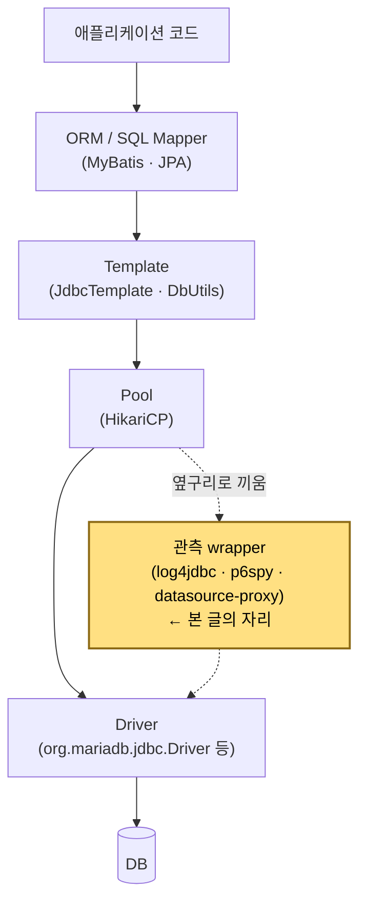
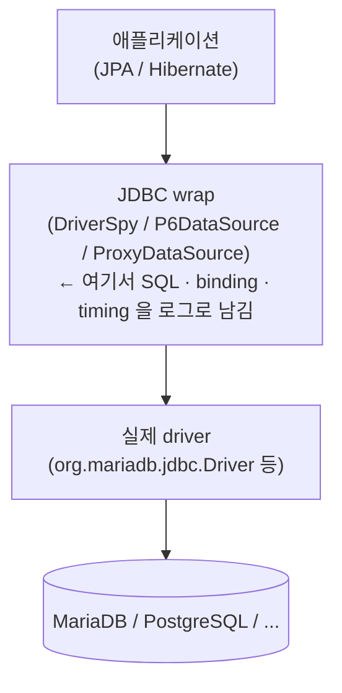
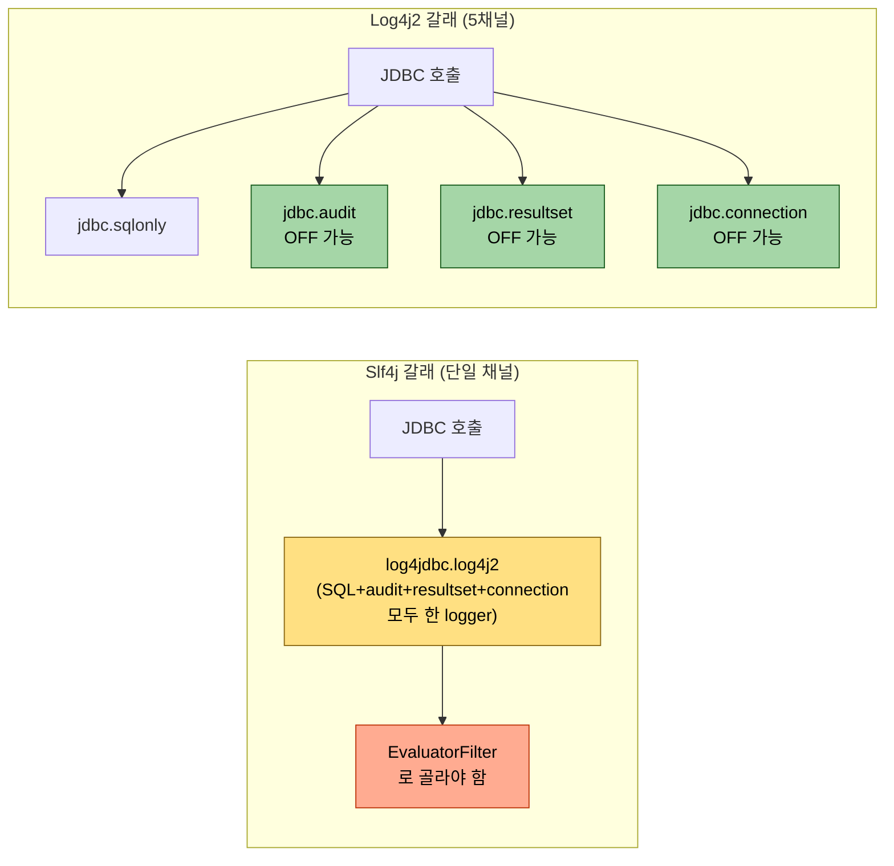
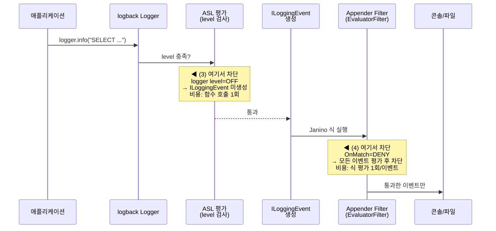

# JDBC 드라이버 wrap 로깅의 운영 비용
---
> **이 문서를 읽고 나면, JDBC wrap 라이브러리 세 종(log4jdbc·p6spy·datasource-proxy)의 출력 모델을 비교하고, 운영 환경에서 폴러형 워크로드가 만든 로그 폭주를 logback 네 곳의 수도꼭지 중 어디서 잠글지 의사결정할 수 있고, 잘못 박힌 underlying driver 설정을 진단해 부팅 잡음을 제거할 수 있다.**
>
> JDBC wrap 라이브러리는 "켜면 SQL 보임" 정도로 가볍게 인식되지만, 실제로는 PreparedStatement·ResultSet 호출 하나마다 INFO 한 줄을 쏟는다.
>
> - 운영 환경에 단순히 켜두면 폴러형 워크로드와 만나 콘솔/로그 파일이 분당 수천 줄로 폭주한다.
> - 본 글은 세 가지 대표 wrap (log4jdbc, p6spy, datasource-proxy) 의 출력 모델을 비교하고, logback 의 네 가지 차단 레이어로 노이즈를 외과적으로 끄는 방법을 정리한다.
> - 처음 학습자는 §0 "wrapper 라는 게 왜 생겼는가" 부터, wrap 라이브러리 차이가 궁금하면 §2 부터 펼쳐도 된다.


## 0. 진입 — 왜 wrapper 라는 게 생겼는가

> §1 이후의 정의·비교·차단 레이어는 *wrapper 라는 개념을 이미 알고 있다는 전제* 위에서 굴러간다. 그 전제를 못 박지 않으면 정의가 추상으로 떠 학습이 안 박힌다. 본 절은 정의를 만나기 전 *어떤 코드가 있었고, 누군가 왜 감쌌으며, 그래서 어디에 본 글이 자리하는지* 를 4 단계로 깐다.

### 0.1 순수 JDBC 30 줄 — 누군가 감싸려고 했던 이유

순수 JDBC 로 사용자 한 명을 조회한다고 가정하면, 비즈니스 로직은 사실상 `SELECT name FROM users WHERE id = ?` 한 줄이지만 그 주변에 30 줄 가까운 부속 코드가 따라붙는다.

```java
// 자원 변수 선언 — finally 에서 close() 하려면 try 바깥 스코프 필요
// null 초기화: 위쪽 라인이 예외 던지면 일부 변수는 미할당 상태
Connection conn = null;
PreparedStatement pstmt = null;
ResultSet rs = null;

try {
    conn = DriverManager.getConnection(URL, USER, PASSWORD);
    pstmt = conn.prepareStatement("SELECT name FROM users WHERE id = ?");
    pstmt.setInt(1, 10);
    rs = pstmt.executeQuery();
    if (rs.next()) {
        String name = rs.getString("name");
        // 비즈니스 로직
    }
} catch (SQLException e) {
    logger.error("DB 에러 발생", e);
} finally {
    // 자원 해제: 역순(rs→pstmt→conn) + null 체크 + close 예외 격리
    // → try-with-resources (Java 7+) 가 이 전체를 자동화함
    if (rs != null)    try { rs.close();    } catch (SQLException e) {}
    if (pstmt != null) try { pstmt.close(); } catch (SQLException e) {}
    if (conn != null)  try { conn.close();  } catch (SQLException e) {}
}
```

- 문제는 단순히 길다는 게 아니라 *누락 시 시스템이 죽는다* 는 점이다. `finally` 에서 `close()` 를 빠뜨리거나 예외가 끼어들어 자원이 안 닫히면 커넥션이 풀에 반환되지 않고, 누적되다 풀이 고갈되면 애플리케이션 전체가 멈춘다. 
- MyBatis·JdbcTemplate 을 쓰는 입장에선 거의 잊고 있는 위험인데, 그 *잊을 수 있음* 이 곧 wrapper 가 만들어 준 결과다. JDBC 는 안 감싸면 자원 누수로 풀이 고갈된다. 30 줄의 부속 코드를 누군가 가져간 것이 wrapper 다.


### 0.2 "Wrapper" 단어의 두 의미 분리

이 단어는 같은 자리에서 두 가지를 가리키니, 본 글이 어느 의미를 쓸 때 어느 쪽인지 먼저 못 박는다.

**(A) 넓은 의미 — 디자인 패턴/추상화 계층으로서의 wrapper.** JDBC 의 반복 코드를 캡슐화해 사용을 편하게 만든 모든 라이브러리·프레임워크의 통칭이다. Spring `JdbcTemplate`, Apache Commons DbUtils, MyBatis, JPA, HikariCP 가 다 여기 들어간다. 위 30 줄이 `jdbcTemplate.queryForObject(...)` 한 줄로 압축되는 게 이 추상화의 산출물이다.

**(B) 좁은 의미 — `java.sql.Wrapper` 인터페이스 (JDBC 4.0+).** JDBC 표준이 직접 정의한 인터페이스로 `Connection`, `Statement`, `ResultSet`, `DataSource` 가 전부 상속한다. 핵심은 두 메서드다.

```java
public interface Wrapper {
    <T> T unwrap(Class<T> iface) throws SQLException;
    boolean isWrapperFor(Class<?> iface) throws SQLException;
}
```

HikariCP 가 `Connection` 을 감싸 `HikariProxyConnection` 을 돌려주는데, 벤더 특화 기능 (MySQL `JdbcConnection`, Oracle LOB API 등) 에 닿아야 할 때 단순 캐스팅은 한 겹밖에 못 벗긴다. `unwrap()` 은 여러 겹의 프록시를 재귀적으로 뚫는다.

```java
if (conn.isWrapperFor(com.mysql.cj.jdbc.JdbcConnection.class)) {
    var mysqlConn = conn.unwrap(com.mysql.cj.jdbc.JdbcConnection.class);
    // 벤더 특화 API
}
```

본 글에서 "wrap 라이브러리" 라고 하면 (A) 의 한 갈래 — 특히 *관측 목적* 으로 끼는 추상화 — 를 가리킨다. (B) 의 `java.sql.Wrapper` 인터페이스는 §1 의 wrapper driver / underlying driver 구분을 이해할 때 한 번 더 등장한다.


### 0.3 wrapper 5 계층 지도

실무 스택에서 wrapper 는 한 겹이 아니라 *4~5 겹이 쌓이는 게 정상* 이다. 각 층이 한 가지 관심사만 책임지도록 분리된 결과다.

| 계층 | 라이브러리 | 감추는 것 | 환경에서의 위치 |
|------|-----------|----------|----------------|
| ORM / SQL Mapper | MyBatis, JPA | SQL ↔ 객체 매핑 | 비즈니스 코드 바로 아래 |
| Template | JdbcTemplate, DbUtils | try-finally, 예외 변환 | ORM 밑에 깔리거나 단독 사용 |
| Pool | HikariCP | `close()` = 풀 반환, 재사용 | Spring Boot 기본 |
| **관측** | **p6spy, datasource-proxy, log4jdbc** | **SQL 로깅, 슬로우쿼리 감지** | **디버깅용으로 끼움 — 본 글의 자리** |
| Spring proxy | `LazyConnectionDataSourceProxy`, `TransactionAwareDataSourceProxy` | 커넥션 획득 지연, 트랜잭션 동기화 | `@Transactional` 이 의존 |

수직으로 보면 다음과 같은 스택이 만들어진다.



- `MyBatis → Spring TransactionManager → HikariCP → MySQL Driver` 처럼 wrapper 가 4~5 겹 쌓이는 게 정상이라는 사실이 박혀야, 그 중 한 칸을 분리해서 끄거나 갈아끼는 작업이 자연스러워진다. `unwrap()` 은 이 양파를 안전하게 까는 표준 도구다.


### 0.4 본 글의 좌표 박기

§1 이후로는 §0.3 지도의 *관측 계층* 한 칸만 본다. 그 안에서도 후보는 셋이다 — log4jdbc-log4j2, p6spy, datasource-proxy. 셋 다 같은 자리에 끼어들지만 출력 모델·끄는 방법·운영 비용이 달라, 운영에서 잘못 쓰면 콘솔이 분당 수천 줄로 폭주하는 함정이 이 차이에서 나온다.

다음 절부터는 그 셋의 차이만 비교한다. ORM·Pool·Template 같은 다른 계층의 wrapper 는 본 글의 범위 밖이며, *어디가 어느 계층인지* 만 §0.3 에서 확인하면 된다.


## 1. JDBC wrap 라이브러리란 무엇인가

> 이 개념은 Spring AOP 가 메서드 호출 앞뒤에 advice 를 끼우는 발상과 같지만, *AOP 가 자바 메서드 호출 단위*인 반면 *JDBC wrap 은 driver 의 모든 표준 메서드 단위*로 가로채고, 그 가로챔의 산출이 객체 반환이 아니라 SQL·파라미터·실행 시간의 텍스트 로그라는 점이 다르다.

처음 보는 단어니까 정의부터 잡는다. **JDBC wrap 라이브러리** 는 애플리케이션과 실제 DB 드라이버 사이에 끼어들어 모든 JDBC 호출을 가로채는 중간 계층이다. 호출을 통과시켜주는 김에 "지금 어떤 SQL 이 어떤 파라미터로 몇 ms 만에 실행됐다" 를 로그로 남긴다.

- 카메라가 무대 위에서 일어나는 일을 녹화하듯, JDBC 호출의 매 순간을 텍스트로 기록한다고 보면 된다.
- 단 이 비유는 *모든 메서드 호출에 한 줄을 남긴다* 측면까지만 유효하다. 카메라는 영상 한 트랙을 만들지만 wrap 라이브러리는 SQL/binding/timing/audit/resultset/connection 같은 *여러 채널을 동시에* 만들고, 각 채널이 별 logger 이름을 갖는다는 점은 카메라 비유로 표현되지 않는다 — 이 차이가 §3 delegator 두 갈래와 §4 노이즈 차단 결정의 출발점이다.

### 왜 필요한가

- 운영 환경에서 "느린 SQL 한 줄을 찾으려면" 평문 SQL + 실제 바인딩된 파라미터 값 + 실행 시간이 모두 있어야 한다. 
- 그런데 JPA/Hibernate 가 기본으로 찍어주는 SQL 은 `?` 자리 표시자만 있어서 (`SELECT ... WHERE id = ?`) 진짜 어떤 값이 들어갔는지 알 수 없다. wrap 라이브러리는 이걸 평문으로 치환한 형태 (`... WHERE id = 'abc-123'`) 로 한 줄에 같이 찍어준다. 
- 운영 디버깅에서 자주 쓰이는 이유다.

구조는 두 갈래로 나뉜다:

### 1. Driver 교체형. 

Spring/Hikari 가 만드는 JDBC Driver 자체를 wrapper 로 바꾼다 (`driver-class-name: net.sf.log4jdbc.sql.jdbcapi.DriverSpy`)

wrapper driver 가 안에서 진짜 driver 를 호출하면서 그 사이에 로그를 남긴다. 변경이 yml 한 줄로 끝나는 게 장점, 끄려면 yml 을 또 바꿔야 하는 게 단점.

> **DriverSpy 한 줄 소개**: log4jdbc 라이브러리가 제공하는 `java.sql.Driver` 구현체. `jdbc:log4jdbc:` URL 접두사를 보고 실제 driver 를 위임 호출하면서 모든 JDBC 메서드 호출을 log 한다. wrapper 위치를 driver 자리로 가져온 모델.

### 2. DataSource 래퍼형

Spring 이 이미 만든 DataSource 빈을 한 번 더 감싸는 wrapper bean 을 끼운다. driver 는 순정 그대로 두고 그 위에서 호출만 가로챈다. 라이브러리 끄기/켜기가 빈 등록 토글로 끝나 토글 비용이 작은 게 장점, Bean 설정 코드가 필요한 게 단점.



- 대표 라이브러리는 세 개다 log4jdbc-log4j2, p6spy, datasource-proxy. 

- 모두 같은 자리에 끼어들지만 출력 모델과 끄는 방법이 다르다. 운영에서 잘못 쓰면 콘솔이 분당 수천 줄로 폭주하는 함정이 이 차이에서 나온다. 다음 절부터 그 차이를 비교한다.


## 2. wrap 라이브러리 3종 — 같은 목적, 다른 출력 모델

> log4jdbc·p6spy·datasource-proxy 세 라이브러리가 같은 자리에 끼지만 한 호출당 라인 수가 약 20+ / 1~2 / 1 줄로 갈리며, 이 차이가 운영 비용의 8할을 결정한다. §3은 그중 log4jdbc 내부의 채널 분리 두 갈래만 깊이 파고, §4는 라인 수와 무관하게 끄는 결정의 위치 네 곳을 다룬다.

세 라이브러리 모두 JDBC `Driver` 또는 `DataSource` 를 wrap 해 호출을 가로채는 것까지는 같다. 차이는 출력 형식, logger 이름 정책, 끄는 방법이 모두 다르다는 점이다.

| 항목 | log4jdbc-log4j2 | p6spy | datasource-proxy |
|------|-----------------|-------|------------------|
| wrap 방식 | Driver 교체 (`net.sf.log4jdbc.sql.jdbcapi.DriverSpy`) | Driver 또는 DataSource (`com.p6spy.engine.spy.P6DataSource`) | DataSource 래퍼 (Builder API) |
| 활성화 트리거 | `driver-class-name` 교체 + `jdbc:log4jdbc:` URL 접두사 | `driver-class-name` 교체 + `jdbc:p6spy:` 접두사, 또는 wrapper bean | wrapper bean 으로 DataSource 한 번 감쌈 |
| logger 이름 | 기본 `log4jdbc.log4j2` (단일) — delegator 교체 시 `jdbc.sqlonly`/`jdbc.sqltiming`/`jdbc.audit`/`jdbc.resultset`/`jdbc.connection` (5분류) | `p6spy` (단일) | 사용자 정의 (`net.ttddyy.dsproxy.listener.logging.SLF4JQueryLoggingListener` 등) |
| 1 사이클당 라인 수 | 약 20+ (audit/resultset 포함) | 약 1~2 (SQL + 실행 시간만) | 1 (한 줄에 SQL+binding+timing 묶음) |
| 설정 위치 | `log4jdbc.log4j2.properties` (classpath) | `spy.properties` (classpath) | Java DSL (Builder) |
| OTel 대체 가능성 | OTel JDBC instrumentation 으로 SQL+timing 모두 대체 가능 | 동일 | 동일 |

- 라인 수 차이가 운영 비용을 좌우한다. log4jdbc 가 한 호출당 한 줄을 INFO 로 쏟는 이유는 Connection·PreparedStatement·ResultSet 의 모든 메서드를 spy 객체로 wrap 해 audit-style 로 기록하기 때문이다. 
- p6spy 는 SQL 본문과 실행 시간만 기록하므로 한 사이클이 2 줄 안쪽으로 끝난다. 
- datasource-proxy 는 listener 모델이라 사용자가 무엇을 기록할지 직접 결정한다 — 가장 외과적이지만 가장 손이 많이 간다.

### 같은 SELECT 한 번이 라이브러리별로 어떻게 찍히는가

같은 `SELECT * FROM users WHERE id = ?` 한 번을 세 라이브러리에서 각각 출력한 모습을 비교하면 *라인 수 8할 차이* 의 의미가 시각적으로 박힌다.

**log4jdbc-log4j2 (약 18~22 줄, Slf4jSpyLogDelegator 기본):**

```text
INFO  log4jdbc.log4j2 - 1. Connection.new Connection returned       org.mariadb.jdbc.MariaDbConnection@7a3d4f
INFO  log4jdbc.log4j2 - 1. Connection.getAutoCommit() returned true
INFO  log4jdbc.log4j2 - 1. Connection.setAutoCommit(false) returned
INFO  log4jdbc.log4j2 - 1. Connection.prepareStatement(SELECT * FROM users WHERE id = ?) returned net.sf.log4jdbc.sql.jdbcapi.PreparedStatementSpy@4a8f
INFO  log4jdbc.log4j2 - 1. PreparedStatement.setLong(1, 42) returned
INFO  log4jdbc.log4j2 - 1. PreparedStatement.executeQuery() returned net.sf.log4jdbc.sql.jdbcapi.ResultSetSpy@9b2c
INFO  log4jdbc.log4j2 - 1. SELECT * FROM users WHERE id = 42   {executed in 3 msec}
INFO  log4jdbc.log4j2 - 1. ResultSet.next() returned true
INFO  log4jdbc.log4j2 - 1. ResultSet.getLong(id) returned 42
INFO  log4jdbc.log4j2 - 1. ResultSet.getString(name) returned "Alice"
INFO  log4jdbc.log4j2 - 1. ResultSet.getString(email) returned "alice@example.com"
INFO  log4jdbc.log4j2 - 1. ResultSet.wasNull() returned false
INFO  log4jdbc.log4j2 - 1. ResultSet.next() returned false
INFO  log4jdbc.log4j2 - 1. ResultSet.close() returned
INFO  log4jdbc.log4j2 - 1. PreparedStatement.close() returned
INFO  log4jdbc.log4j2 - 1. Connection.commit() returned
INFO  log4jdbc.log4j2 - 1. Connection.setAutoCommit(true) returned
INFO  log4jdbc.log4j2 - 1. Connection.close() returned
```

SELECT 본문 1줄(7번째) + audit 11~12줄 (Connection·PreparedStatement lifecycle) + resultset 4~5줄 (컬럼 getter 마다 1줄). 폴러가 500ms 마다 돌면 분당 약 2,400 줄.

**p6spy (1 줄):**

```text
INFO  p6spy - 1700000000123|3|0|statement|SELECT * FROM users WHERE id = ?|SELECT * FROM users WHERE id = 42
```

파이프(`|`) 구분 6필드: 타임스탬프 ms · 실행 시간 ms · category · type · *원본 SQL (placeholder)* · *바인딩 치환된 SQL*. 의도적으로 *한 줄에 grep·awk 친화* 형식으로 설계됐다.

**datasource-proxy (1 줄, 기본 listener):**

```text
INFO  net.ttddyy.dsproxy.listener - Name:dataSource, Connection:1, Time:3, Success:True, Type:Prepared, Batch:False, QuerySize:1, BatchSize:0, Query:["SELECT * FROM users WHERE id = ?"], Params:[(42)]
```

명시적 key:value 라벨링 — 사람이 읽기 가장 쉽다. listener 를 커스터마이징하면 timestamp·correlation-id 등 추가 가능.

세 출력을 한 표로 비교:

| 라이브러리 | 1 SELECT 당 줄 수 | SQL+바인딩 한 줄? | audit/resultset 라인 | 폴러 500ms 분당 추정 |
|----------|-----------------|------------------|--------------------|--------------------|
| log4jdbc-log4j2 | 약 20 | 별 줄에 분리 (7번째 줄) | 포함 (15+ 줄) | **약 2,400** |
| p6spy | 1 | ✅ 한 줄에 둘 다 | 없음 | 약 120 |
| datasource-proxy | 1 | ✅ 한 줄에 둘 다 | 없음 | 약 120 |

운영 비용의 8할이 이 라인 수 차이에서 나오는 이유가 박힌다 — log4jdbc 의 audit/resultset 라인이 *기능적으로는 0건 SELECT 의 디버깅에 거의 가치가 없는데* 양만 20배 차이를 만든다. p6spy·datasource-proxy 는 SQL 본문과 실행 시간만 남기므로 같은 폴러 워크로드에서 분당 100여 줄로 끝난다.


## 3. log4jdbc 의 delegator 두 갈래

> log4jdbc 의 출력 채널은 `SpyLogDelegator` 구현이 결정하며, 단일 채널 `Slf4jSpyLogDelegator` 와 5채널 `Log4j2SpyLogDelegator` 두 갈래가 있다. 어느 쪽을 쓰는지가 §4 logback logger level 차단(3번 수도꼭지)의 *카테고리별 OFF 가능 여부* 를 가른다.

log4jdbc-log4j2 는 출력 채널을 결정하는 `SpyLogDelegator` 가 두 종류다. 어느 쪽을 쓰는지가 노이즈 제어의 전제다.

`Slf4jSpyLogDelegator` (기본) 는 모든 wrap 로그를 logger 이름 `log4jdbc.log4j2` 한 곳으로 보낸다. 이 모드에서는 카테고리별 OFF 가 불가능 — 채널을 끄려면 통째로 끄거나, evaluator 로 메시지·thread·MDC 등을 봐서 거를 수밖에 없다.

`Log4j2SpyLogDelegator` 는 호출 카테고리에 따라 logger 이름을 분리한다. `jdbc.sqlonly` 는 SQL 본문 (바인딩 치환 후), `jdbc.sqltiming` 은 SQL+실행 시간, `jdbc.audit` 은 Connection.commit·setAutoCommit 같은 라이프사이클, `jdbc.resultset` 은 ResultSet.next·close, `jdbc.connection` 은 Connection.new·isClosed 류다. 이 모드에서는 logback 에서 `<logger name="jdbc.audit" level="OFF"/>` 같은 카테고리별 OFF 가 가능해진다.

두 delegator 의 채널 구조 차이를 한눈에 보면 다음과 같다.

| 항목 | `Slf4jSpyLogDelegator` (기본) | `Log4j2SpyLogDelegator` (5채널) |
|------|------------------------------|--------------------------------|
| logger 이름 개수 | **1개** (`log4jdbc.log4j2`) | **5개** (`jdbc.sqlonly` · `sqltiming` · `audit` · `resultset` · `connection`) |
| SQL 본문 로그 위치 | `log4jdbc.log4j2` 안에 섞여 들어옴 | `jdbc.sqlonly` (단독 채널) |
| Connection lifecycle 로그 | `log4jdbc.log4j2` 안에 섞여 들어옴 | `jdbc.connection` (단독 채널) |
| ResultSet 순회 로그 | `log4jdbc.log4j2` 안에 섞여 들어옴 | `jdbc.resultset` (단독 채널) |
| 카테고리별 OFF | 불가능 — 전부 끄거나 켜거나 | 가능 — `<logger name="jdbc.audit" level="OFF"/>` |
| 노이즈 차단 도구 | logback EvaluatorFilter 의존 | logger level 만으로 충분 |

채널 구조가 한 갈래(`Slf4j`)일 때와 다섯 갈래(`Log4j2`)일 때 *어디서 노이즈를 자르는가* 의 결정이 어떻게 달라지는지를 흐름으로 보면 다음과 같다.



왼쪽(단일 채널)은 *모든 종류의 wrap 로그가 같은 logger 로 흘러* EvaluatorFilter 가 thread/MDC 같은 메타데이터로 골라내야 한다. 오른쪽(5채널)은 *카테고리별로 logger 가 갈려* `<logger level="OFF"/>` 한 줄로 audit/resultset/connection 같은 노이즈를 끄고 sqlonly 만 살릴 수 있다. 카테고리별 OFF 의 정밀성이 이 채널 분리의 직접적인 산출물이다.

운영 가시성을 정밀하게 통제하고 싶다면 delegator 를 바꾸는 게 첫 단추다. 단 분리된 카테고리를 logback 에서 실제로 받으려면 SLF4J → log4j2 어댑터가 classpath 에 있어야 해서, *그 의존성 비용을 받을 가치가 있는가* 가 결정 포인트다. 두 갈래의 도입 비용을 한 표로 비교하면 다음과 같다.

| 항목 | `Log4j2SpyLogDelegator` (5채널) | `Slf4jSpyLogDelegator` + EvaluatorFilter (기본) |
|------|-------------------------------|---------------------------------------------|
| 추가 의존성 | `log4j-api` + `log4j-core` + `log4j-to-slf4j` (약 1~2MB) | 없음 |
| properties 변경 | `spylogdelegator.name` 1줄 | 0줄 |
| logback config 추가 | 카테고리별 `<logger>` 5~10줄 | EvaluatorFilter 식 5~10줄 |
| 카테고리별 OFF | 가능 (`jdbc.audit`, `jdbc.resultset` 등 별도) | prefix 매칭(`logger.startsWith("log4jdbc.")`) 으로 우회 |
| 학습 비용 | 1~2시간 (log4j2 카테고리 의미 학습) | 0 (기본 환경 그대로) |

외부 의존성 추가가 정책상 부담스러운 환경(예: 보안 검토 절차가 무거운 사내 운영)에서는 기본 `Slf4jSpyLogDelegator` + EvaluatorFilter 조합이 더 싸고, 카테고리별 OFF 의 정밀성이 *반드시 필요한* 환경에서만 `Log4j2SpyLogDelegator` 의 의존성 비용을 받을 가치가 있다.


## 4. 노이즈를 끄는 네 곳의 수도꼭지

> wrap 로그를 끄는 결정 위치는 driver 자체 / properties / logger level / EvaluatorFilter 네 곳이며, 외과성(다른 코드 영향 최소화)과 평가 비용은 반비례한다. 가장 강한 driver 차단은 SQL 디버깅까지 잃고, 가장 외과적인 EvaluatorFilter 는 매 이벤트 Janino 식 평가 비용을 받는다 — 이 trade-off 가 §6 사고 회고의 회차 갈이 결정의 핵심이다.

JDBC 호출이 로그로 흘러나오는 경로 위에 네 수도꼭지의 위치를 박으면 다음과 같다.

```mermaid
flowchart LR
    jdbc["JDBC 호출<br>(executeQuery 등)"]
    wrap["wrap channel<br>(log4jdbc / p6spy)"]
    logger["logback Logger<br>(level 필터)"]
    filter["Appender Filter<br>(EvaluatorFilter)"]
    out["콘솔 / 파일<br>출력"]

    jdbc -->|"(1) Driver 차단<br>= 호출 자체 안 들어옴"| wrap
    wrap -->|"(2) properties<br>= 라인 수 형식 조정"| logger
    logger -->|"(3) logger level OFF<br>= ILoggingEvent 미생성"| filter
    filter -->|"(4) EvaluatorFilter DENY<br>= 매 이벤트 평가 후 차단"| out

    style jdbc fill:#90CAF9,color:#000,stroke:#1565C0
    style out fill:#FFAB91,color:#000,stroke:#BF360C
```



각 수도꼭지가 흐름의 *어느 단계*에서 잠그는지 보면 외과성과 평가 비용의 차이가 직관적으로 잡힌다. (1)·(2) 는 wrap 채널 *자체* 를 손대므로 다른 코드 영향이 크고, (3)·(4) 는 wrap 은 그대로 두고 logback 에서 *출력 직전* 에 잠그므로 외과적이다.

wrap 로그를 끄는 결정은 어디서 수도꼭지를 잠그느냐에 따라 비용과 부작용이 달라진다. 네 위치를 정리한다.

**(1) Driver 자체 끄기 (yml).** `driver-class-name` 을 순정 `org.mariadb.jdbc.Driver` 로 바꾸고 jdbc-url 접두사 `jdbc:log4jdbc:` 를 제거. 가장 강한 차단 — wrap 자체가 안 생기므로 출력도 0, 성능 오버헤드도 0. 단 SQL 디버깅 능력 전부 상실. 환경별 yml 분리로 운영만 끄는 변형 가능.

**(2) properties 로 spy 설정 조정.** `log4jdbc.log4j2.properties` 에 `log4jdbc.dump.sql.maxlinelength=0` 같이 출력 형식만 다듬거나, `auto.load.popular.drivers=false` + `drivers=<우리가 쓰는 driver>` 로 underlying driver 를 명시. 잘못된 driver 명시 (예: MariaDB 환경에 `com.mysql.cj.jdbc.Driver`) 는 auto-load 가 가려주지만 부팅 잡음을 남긴다. 작은 변경이지만 운영 위생.

**(3) logback logger level.** `<logger name="log4jdbc.log4j2" level="OFF"/>` 한 줄. 가장 빠름 — logback 이 ASL (Active Session List) 평가 전 단계에서 차단해 ILoggingEvent 객체 생성조차 안 한다. 디버깅을 위해 임시로 켜고 싶을 때는 logback 재로딩이 필요하지만 그것도 자동 reload 정책으로 우회 가능.

**(4) logback EvaluatorFilter.** 가장 표현력 높음. JaninoEventEvaluator 가 `event` / `level` / `logger` / `message` / `formattedMessage` / `throwable` / `marker` / `mdc` / `timeStamp` 자동 변수를 노출하므로 조건식을 자유롭게 짤 수 있다. 단점은 매 이벤트마다 컴파일된 Java 식이 실행돼 (3) 보다 비용이 크다는 것, 그리고 `thread` 같은 직관적인 이름이 변수에 없어서 `event.getThreadName()` 같은 메서드 호출로 우회해야 한다는 점이다. 외과적 차단이 필요할 때만 쓴다.

> **여기 등장한 클래스 한 줄 소개:**
> - **JaninoEventEvaluator** — logback 이 임베드한 Janino 컴파일러로 사용자가 적은 Java 식을 부팅 시 컴파일해 매 로그 이벤트마다 실행한다. 식을 자유롭게 짜는 대가로 컴파일 에러 시 logback 자체가 안 떠 application 기동이 막힌다.
> - **ILoggingEvent** — logback 의 로그 이벤트 모델 인터페이스. `getThreadName()`, `getLoggerName()`, `getLevel()`, `getMDCPropertyMap()` 같은 메서드를 노출한다. evaluator 자동 변수에 없는 정보는 모두 이 객체의 메서드로 꺼낸다.
> - **MDC** (Mapped Diagnostic Context) — slf4j 가 제공하는 thread-local Map. 진입 시 `MDC.put(key, value)` 하고 `finally` 에 `remove` 하면 그 스레드의 모든 로그 이벤트에 키-값이 따라붙는다. evaluator 에서 `mdc.get("...")` 로 접근.

네 위치의 선택 기준은 "무엇을 잃을 것인가" 다. (1)·(3) 은 outbox 외 다른 코드 경로의 SQL 디버깅도 같이 잃는다. (4) 는 그 손실 없이 outbox 폴러 스레드만 골라 끌 수 있다 — 외과적이지만 매 평가 비용을 받아들여야 한다.

### (3) vs (4) 깊이 비교 — 어디서 잠그느냐가 비용을 가른다

가장 많이 헷갈리는 두 갈래가 (3) logger level OFF 와 (4) EvaluatorFilter DENY 다. 둘 다 "logback 단에서 끈다" 는 점은 같지만 *언제·어디서* 끄느냐가 다르고, 그 차이가 평가 비용·디버깅 손실로 직결된다. 세 갈래로 나눠 본다 — (a) logback 내부에서 잠기는 *위치*, (b) 1건당 *비용 수치*, (c) 환경별 *적합도*.

**(a) 잠그는 위치 — logback 처리 흐름에서 어디서 끊기는가:**



이 그림에서 두 가지가 박힌다. (3) 은 *ILoggingEvent 가 생성되기 전* 에 끊으므로 차단 1건당 비용이 거의 0. (4) 는 *ILoggingEvent 가 이미 만들어진 뒤* 에 평가하므로 *통과되는 정상 로그까지 모두* 식 평가 비용을 낸다.

**(b) 1건당 평가 비용 — 식 복잡도에 따른 마이크로벤치:**

| 차단 위치 | 1건당 비용 | 분당 100만 이벤트 시 누적 CPU | 차단 대상 외 영향 |
|----------|----------|----------------------------|----------------|
| (3) logger level OFF | ~0μs (함수 호출 1회) | 측정 한계 이하 | 0 (정상 로그는 평가 안 함) |
| (4) `formattedMessage.contains(...)` 단순 식 | 0.3~0.5μs | 약 0.5초 | 모든 통과 이벤트에 누적 |
| (4) `event.getThreadName().startsWith(...) && logger.startsWith(...)` 복합 식 | 1.0~1.5μs | 약 1.5초 | 모든 통과 이벤트에 누적 |
| (4) `mdc.get("X").equals("Y")` + null 체크 | 0.6~1.0μs | 약 1초 | 모든 통과 이벤트에 누적 |

분당 수천 건 수준의 폴러 워크로드에서는 (4) 의 누적 영향도 측정 한계 이하. 분당 수십만 건이 흐르는 환경에서만 식 단순화를 고민한다.

**(c) 환경별 적합도 — 무엇을 잃기 싫은가:**

| 환경 | 추천 | 이유 |
|------|-----|------|
| polling 워크로드 + HTTP 요청 혼재 | **(4) EvaluatorFilter** | thread/MDC 로 폴러만 골라 차단, HTTP SQL 디버깅 0 손실 |
| 운영(prd), SQL 디버깅 거의 안 씀 | (3) logger level OFF | 평가 비용 0, hot-fix 한 줄로 끝 |
| 사고 직후 5분 안에 끄기 | (3) logger level OFF | 가장 빠른 적용 |
| dev=켜고 prd=끔 토글 | (3) + Spring profile | profile 기반 분리 |
| 카테고리별 정밀 제어 필요 | `Log4j2SpyLogDelegator` (§3) + (3) | 채널 분리로 logger 단위 OFF |

세 갈래의 결론을 한 줄로 박으면 다음과 같다. **(3) 은 "전부 또는 아무것도" 의 강한 차단이고 비용이 0, (4) 는 "조건으로 골라" 의 외과적 차단이고 정상 로그까지 평가 비용을 낸다 — polling 워크로드처럼 *디버깅 손실 0* 이 더 비싼 환경에서는 (4) 의 평가 비용을 사는 거래가 거의 항상 이긴다.**


## 5. MariaDB + log4jdbc 의 흔한 실수

> wrapper driver(`DriverSpy`)와 underlying driver(`log4jdbc.drivers`)는 다른 것이며, MariaDB 환경에 MySQL driver 를 underlying 으로 박는 실수가 `auto.load.popular.drivers=true` 기본값에 가려져 *동작은 하지만 부팅 잡음을 남기는* 형태로 자주 누락된다. §6의 사고가 폭주한 세 가지 조건(DriverSpy + root INFO + 부정확한 키워드 매칭) 중 첫 번째가 본 절의 실수에서 시작된다.

operator k8s 환경의 `log4jdbc.log4j2.properties` 가 운영에 박혀 있었는데, `log4jdbc.drivers=com.mysql.cj.jdbc.Driver` 로 잘못 박혀 있었다. 운영은 MariaDB 인데도 부팅이 동작한 이유는 `auto.load.popular.drivers` 가 기본 `true` 라서 log4jdbc 가 mysql/oracle/postgres/mariadb 등 유명 driver 를 자동으로 탐색해 underlying 후보로 등록하기 때문이다. 우연히 mariadb 가 잡혀 동작했지만, 그 옆에서 mysql driver 로드 시도 실패 잡음이 부팅 로그를 더럽혔다.

### 부팅 잡음이 실제로 어떻게 찍히는가

`auto.load.popular.drivers=true` 일 때 application 기동 초기에 다음과 같은 라인들이 줄줄이 찍힌다. 운영팀이 부팅 로그를 grep 으로 확인할 때 *진짜 신호* 가 이 잡음에 묻힌다.

```text
INFO  net.sf.log4jdbc.sql.jdbcapi.DriverSpy - log4jdbc: 'oracle.jdbc.driver.OracleDriver' could not be loaded, skipping it.
INFO  net.sf.log4jdbc.sql.jdbcapi.DriverSpy - log4jdbc: 'com.sybase.jdbc2.jdbc.SybDriver' could not be loaded, skipping it.
INFO  net.sf.log4jdbc.sql.jdbcapi.DriverSpy - log4jdbc: 'net.sourceforge.jtds.jdbc.Driver' could not be loaded, skipping it.
INFO  net.sf.log4jdbc.sql.jdbcapi.DriverSpy - log4jdbc: 'org.postgresql.Driver' could not be loaded, skipping it.
INFO  net.sf.log4jdbc.sql.jdbcapi.DriverSpy - log4jdbc: 'net.sf.jcd.NuoDB.driver' could not be loaded, skipping it.
INFO  net.sf.log4jdbc.sql.jdbcapi.DriverSpy - log4jdbc: 'com.mysql.cj.jdbc.Driver' could not be loaded, skipping it.
INFO  net.sf.log4jdbc.sql.jdbcapi.DriverSpy - log4jdbc: 'org.mariadb.jdbc.Driver' loaded.
INFO  net.sf.log4jdbc.sql.jdbcapi.DriverSpy - log4jdbc: 'org.hsqldb.jdbcDriver' could not be loaded, skipping it.
```

8줄 중 7줄이 *실패 잡음* 이고 진짜 정보는 7번째 한 줄(`'org.mariadb.jdbc.Driver' loaded`). `auto.load.popular.drivers=false` + `log4jdbc.drivers=org.mariadb.jdbc.Driver` 로 정정하면 위 잡음 7줄이 0 으로 줄고 다음 한 줄만 남는다.

```text
INFO  net.sf.log4jdbc.sql.jdbcapi.DriverSpy - log4jdbc: 'org.mariadb.jdbc.Driver' loaded.
```

또 하나의 문제 — operator k8s 처럼 `log4jdbc.drivers=com.mysql.cj.jdbc.Driver` 로 *틀린 driver* 가 명시되고 `auto.load=true` 가 그 옆에서 가려주는 경우, 부팅 로그는 *명시한 mysql 은 실패하고 auto-load 가 mariadb 를 우연히 잡는* 형태로 찍힌다.

```text
INFO  net.sf.log4jdbc.sql.jdbcapi.DriverSpy - log4jdbc: 'com.mysql.cj.jdbc.Driver' could not be loaded, skipping it.
INFO  net.sf.log4jdbc.sql.jdbcapi.DriverSpy - log4jdbc: 'org.mariadb.jdbc.Driver' loaded.
```

application 은 정상 부팅된다 — auto-load 가 mariadb 를 잡았으니 underlying driver 가 비어 있지 않다. 하지만 *의도한 driver 가 mysql 인데 실제로는 mariadb 가 쓰이는* 상태가 되어, 나중에 누가 `log4jdbc.drivers` 한 줄을 보고 "이 환경은 mysql 이군" 으로 잘못 판단할 수 있다. **운영 의존성을 *우연이 아니라 의도* 로 만들기 위해** auto-load 를 끄고 명시하는 패턴이 가치 있는 이유다.

여기서 `DriverSpy` 와 underlying driver 의 역할이 헷갈리기 쉽다. `driver-class-name: net.sf.log4jdbc.sql.jdbcapi.DriverSpy` 는 Spring/Hikari 가 만드는 wrapper driver 의 클래스 이름이다. 그 wrapper 가 안에서 실제 DB 와 말하는 underlying driver 는 따로 결정된다 — properties 의 `log4jdbc.drivers` 가 그 명시 경로다. wrapper 자기 자신을 underlying 으로 가리키면 무한 순환에 빠지므로 절대 같은 값을 박으면 안 된다.

올바른 설정:

```properties
log4jdbc.spylogdelegator.name = net.sf.log4jdbc.log.slf4j.Slf4jSpyLogDelegator
log4jdbc.dump.sql.maxlinelength = 0
log4jdbc.auto.load.popular.drivers = false
log4jdbc.drivers = org.mariadb.jdbc.Driver
```

`auto.load` 를 끄고 명시하는 패턴은 운영 의존성을 우연이 아니라 의도로 만든다는 점에서 가치가 있다.


## 6. 실제 사고 — operator k8s 폭주 회고

> operator k8s 한 환경에서만 (DriverSpy + root INFO + 부정확한 EvaluatorFilter) 세 조건이 겹쳐 분당 약 2,400 줄의 폭주가 발생했고, 차단 식을 *키워드 매칭 → thread 변수 직접 참조 → event.getThreadName() 메서드 호출* 세 회차에 걸쳐 갈며 0 줄까지 줄였다. §5의 흔한 실수가 *어떻게 사고가 되는가*를 박제하는 회고이며, §8 실습 기록이 회차 3의 적용 결과를 수치로 받친다.

§5 의 `auto.load.popular.drivers` 메커니즘이 실제 운영에서 어떻게 사고가 되는지를 박제한다. underlying driver 명시 누락 하나가, root level INFO 와 wrap channel 그대로 켜둔 설정 두 개와 만나면 분당 수천 줄의 로그 폭주가 된다는 사실이 다음 회고의 출발이다.

TPS operator-api 의 k8s pod 에서 outbox 폴러가 500ms 주기로 0건 SELECT 를 발행하는데, wrap 로그가 한 사이클당 약 20 줄로 분당 약 2,400 줄을 콘솔/파일 로그에 쏟았다. 같은 코드를 쓰는 executor 서비스는 logback root level 이 `OFF` 라 안 보였고, 로컬 operator 는 순정 mariadb driver 라 wrap 채널 자체가 없어 안 보였다. operator k8s 만 (a) DriverSpy + (b) root INFO + (c) EvaluatorFilter 가 `org.hibernate.SQL` 만 잡는 조합으로 폭주.

세 환경의 차이를 한 그림으로 보면 *왜 operator k8s 만 폭주했는지* 가 명확해진다.

```mermaid
flowchart TB
    subgraph local["로컬 operator<br>(폭주 없음)"]
        local_drv["driver:<br>org.mariadb.jdbc.Driver<br>(순정)"]
        local_out["wrap channel 없음<br>→ log 0줄"]
        local_drv --> local_out
    end

    subgraph exec["executor 서비스<br>(폭주 없음, 가려짐)"]
        exec_drv["driver:<br>DriverSpy<br>(wrap 활성)"]
        exec_root["root level: OFF<br>→ wrap 로그 모두 차단"]
        exec_out["log 0줄<br>(단 디버깅 다 잃음)"]
        exec_drv --> exec_root --> exec_out
    end

    subgraph op["operator k8s<br>(분당 2,400줄 폭주)"]
        op_drv["driver:<br>DriverSpy<br>(wrap 활성)"]
        op_root["root level: INFO<br>→ wrap 로그 통과"]
        op_filter["EvaluatorFilter:<br>org.hibernate.SQL 만 잡음<br>→ wrap 18줄/사이클 통과"]
        op_out["log 폭주<br>분당 약 2,400줄"]
        op_drv --> op_root --> op_filter --> op_out
    end

    style local_out fill:#A5D6A7,color:#000,stroke:#1B5E20
    style exec_out fill:#FFE082,color:#000,stroke:#8B6914
    style op_out fill:#EF9A9A,color:#000,stroke:#B71C1C,stroke-width:3px
```



이 그림에서 두 가지가 박힌다. 첫째, *같은 코드라도* 환경별 logback 설정(`root level`, `EvaluatorFilter` 식) 만으로 폭주 여부가 갈린다 — wrap 라이브러리 자체는 비난 대상이 아니라 *제어 안 된 환경* 이 비난 대상이다. 둘째, executor 의 `root level: OFF` 패턴은 폭주를 막지만 *모든 디버깅 능력을 같이 잃는* 강한 차단이라 외과적이지 않다 — operator k8s 의 회차 3 fix(`event.getThreadName()` 매칭)가 본 회고의 정답인 이유다.

차단을 세 회차에 걸쳐 갈았다. 1회차는 `formattedMessage.contains("TB_TRB_OX_001")` 키워드 매칭 — SQL 본문 라인은 잡았지만 wrap 라인 18 줄이 그대로 통과. 2회차는 `thread.startsWith("operator-scheduler-")` thread 이름 매칭으로 강화 시도 — Janino 가 `thread` 변수를 자동 주입하지 않아 부팅 실패, 즉시 revert. 3회차는 `event.getThreadName().startsWith("operator-scheduler-")` 로 정정, 같이 properties 의 잘못된 mysql driver 도 mariadb 로 교정. 폴링 스레드 로그가 사실상 0 으로 줄었다.

이 경험에서 두 가지가 박혔다. evaluator 식 변경은 logback 컴파일 에러로 application 기동 자체를 막으므로 dev 부팅 1회 검증을 반드시 사이에 둘 것. wrap 라이브러리의 채널 분리 (delegator) 와 underlying driver 명시 (properties) 는 운영 위생의 기본인데 흔히 누락된다는 것. 상세 시퀀스는 이슈 보고서 `runners-high/issue/2026-05-21/operator-outbox-log-flood.md` 에 별 정리.

### 폭주가 실제로 어떻게 보였는가 — 한 사이클 raw 로그

outbox 폴러 한 사이클(500ms 마다 실행) 이 0건 SELECT 임에도 약 20줄을 어떻게 쏟는지 실측을 박제한다. `kubectl logs <operator-pod> --since=1s` 로 잡힌 한 사이클의 raw 라인은 다음과 같았다.

```text
2026-05-19 13:42:00.123 [operator-scheduler-3] INFO  log4jdbc.log4j2 - 4. Connection.new Connection returned   ←  ① audit 시작
2026-05-19 13:42:00.124 [operator-scheduler-3] INFO  log4jdbc.log4j2 - 4. Connection.getAutoCommit() returned true
2026-05-19 13:42:00.124 [operator-scheduler-3] INFO  log4jdbc.log4j2 - 4. Connection.setAutoCommit(false) returned
2026-05-19 13:42:00.125 [operator-scheduler-3] INFO  log4jdbc.log4j2 - 4. Connection.prepareStatement(SELECT * FROM TB_TRB_OX_001 WHERE ...) returned PreparedStatementSpy@...
2026-05-19 13:42:00.126 [operator-scheduler-3] INFO  log4jdbc.log4j2 - 4. PreparedStatement.setTimestamp(1, 2026-05-19 13:42:00) returned
2026-05-19 13:42:00.127 [operator-scheduler-3] INFO  log4jdbc.log4j2 - 4. PreparedStatement.executeQuery() returned ResultSetSpy@...
2026-05-19 13:42:00.128 [operator-scheduler-3] INFO  log4jdbc.log4j2 - 4. SELECT * FROM TB_TRB_OX_001 WHERE STATUS = 'PENDING' AND ...   {executed in 2 msec}   ←  ② SQL 본문 (회차 1 키워드 매칭이 잡던 라인)
2026-05-19 13:42:00.129 [operator-scheduler-3] INFO  org.hibernate.SQL    - select * from TB_TRB_OX_001 where status=? and ...   ←  ③ Hibernate 별도 출력
2026-05-19 13:42:00.130 [operator-scheduler-3] INFO  log4jdbc.log4j2 - 4. ResultSet.next() returned false   ←  ④ 0건 SELECT 라 첫 next() 에서 끝
2026-05-19 13:42:00.130 [operator-scheduler-3] INFO  log4jdbc.log4j2 - 4. ResultSet.close() returned
2026-05-19 13:42:00.131 [operator-scheduler-3] INFO  log4jdbc.log4j2 - 4. PreparedStatement.close() returned
2026-05-19 13:42:00.131 [operator-scheduler-3] INFO  log4jdbc.log4j2 - 4. Connection.commit() returned
2026-05-19 13:42:00.132 [operator-scheduler-3] INFO  log4jdbc.log4j2 - 4. Connection.setAutoCommit(true) returned
2026-05-19 13:42:00.132 [operator-scheduler-3] INFO  log4jdbc.log4j2 - 4. Connection.close() returned   ←  ⑤ audit 끝
```

한 사이클이 약 14줄. 폴러가 500ms 마다 돌면 분당 약 1,680 줄. *0건 SELECT 인데도* audit·connection 라인이 12개씩 따라온다.

**회차 1 EvaluatorFilter (`formattedMessage.contains("TB_TRB_OX_001")`) 적용 후:**

키워드가 매치되는 라인은 ②번 SQL 본문 라인 하나뿐. 그 외 13줄은 audit/resultset/connection 라인이라 `TB_TRB_OX_001` 문자열을 포함하지 않아 *그대로 통과*. 키워드 매칭이 wrap 라인을 못 잡는 이유가 박힌다.

```text
[차단됨] 2026-05-19 13:42:00.128 ... SELECT * FROM TB_TRB_OX_001 WHERE STATUS = 'PENDING' ...   ← ② 만 차단
[통과] 2026-05-19 13:42:00.123 ... Connection.new Connection returned
[통과] 2026-05-19 13:42:00.124 ... Connection.getAutoCommit() returned true
[통과] 2026-05-19 13:42:00.124 ... Connection.setAutoCommit(false) returned
... (나머지 12줄도 모두 통과)
```

분당 약 1,560 줄 (=1,680 - 120) 이 그대로 쏟아짐. *키워드 매칭이 효과 거의 0* 이라는 회차 1 실패의 정량적 모습.

**회차 3 EvaluatorFilter (`event.getThreadName().startsWith("operator-scheduler-")` + logger prefix) 적용 후:**

스레드 이름 `operator-scheduler-3` 가 매치되고 logger 가 `log4jdbc.*`/`jdbc.*`/`org.hibernate.SQL` 중 하나라면 *14줄 전부 차단*. 분당 약 1,680 → 0 으로 감소.

```text
[차단됨] 2026-05-19 13:42:00.123 [operator-scheduler-3] log4jdbc.log4j2 - 4. Connection.new Connection returned
[차단됨] 2026-05-19 13:42:00.124 [operator-scheduler-3] log4jdbc.log4j2 - 4. Connection.getAutoCommit() returned true
... (14줄 모두 차단)
```

`http-nio-8091-exec-*` 같은 다른 스레드의 SQL 디버깅은 식의 thread 매칭에서 false 가 되어 그대로 통과 — 외과적 차단의 의도가 *thread 이름 한 가지* 로 달성된다.


## 7. OTel JDBC instrumentation 으로의 졸업

> wrap 라이브러리의 세 가치(SQL 본문·바인딩 치환·실행 시간)를 OpenTelemetry JDBC auto-instrumentation 이 trace 데이터로 모두 대체한다. 본 절은 §4 네 수도꼭지로 끄는 결정을 *영구히 안 해도 되는 자리*로 가는 졸업 경로이며, §6 같은 사고가 구조적으로 발생하지 않는 종착점이다.

wrap 라이브러리의 가치는 결국 세 가지 — SQL 본문 평문 출력, 바인딩 파라미터 치환, 실행 시간 측정. 이 세 가지를 OpenTelemetry JDBC auto-instrumentation 이 모두 대체한다. OTel agent 가 `Statement.executeQuery` 같은 호출을 자동 가로채 span 을 만들고 `db.statement` attribute 에 SQL 평문, span duration 에 실행 시간을 넣는다.

OTel 로 옮기면 wrap 라이브러리를 끄는 결정이 합리화된다. 메트릭은 Prometheus·Tempo·Jaeger 어디서든 같은 span 으로 보고, 로그가 아니라 trace 데이터로 SQL 흐름을 본다. 콘솔/파일 로그는 진짜 사람이 읽는 로그 (애플리케이션 비즈니스 이벤트, 에러) 만 남는다. wrap 라이브러리는 "관찰가능성 도구가 없던 시절의 임시방편" 위치로 내려간다.

### wrap 로그 한 줄 vs OTel span 한 건 — 같은 SQL 이 어떻게 표현되는가

같은 `SELECT * FROM users WHERE id = 42` 한 번이 두 도구에서 어떻게 다르게 표현되는지 박제한다.

**wrap (log4jdbc, 콘솔/파일 로그):**

```text
INFO  log4jdbc.log4j2 - 1. SELECT * FROM users WHERE id = 42   {executed in 3 msec}
```

텍스트 한 줄. grep·awk 로 찾고 사람 눈으로 읽음. 폴러 워크로드면 분당 수천 줄 누적.

**OTel JDBC auto-instrumentation (Tempo/Jaeger span):**

```json
{
  "traceId": "1a2b3c4d5e6f7890",
  "spanId": "abcdef1234567890",
  "parentSpanId": "0987654321fedcba",
  "name": "SELECT users",
  "kind": "CLIENT",
  "startTime": "2026-05-19T13:42:00.128Z",
  "endTime": "2026-05-19T13:42:00.131Z",
  "duration": "3ms",
  "attributes": {
    "db.system": "mariadb",
    "db.name": "TPS",
    "db.connection_string": "jdbc:mariadb://prd-db:3306/TPS",
    "db.user": "trbuser",
    "db.statement": "SELECT * FROM users WHERE id = ?",
    "db.operation": "SELECT",
    "db.sql.table": "users",
    "net.peer.name": "prd-db",
    "net.peer.port": 3306,
    "thread.name": "http-nio-8091-exec-3"
  },
  "status": { "code": "OK" }
}
```

같은 정보가 *구조화된 attribute* 로 박힌다. Tempo/Jaeger UI 에서 traceId 로 검색하면 *이 SQL 이 어떤 HTTP 요청에서 호출됐는지·다른 SQL 과 어떻게 묶여 있는지* 가 함께 보인다.

두 표현의 운영 비용을 한 표로 비교:

| 항목 | wrap 로그 | OTel span |
|------|----------|----------|
| 표현 형식 | 텍스트 한 줄 | 구조화 JSON span |
| 저장 위치 | 콘솔/파일 logback appender | Tempo/Jaeger/OTLP collector |
| 검색 방법 | `grep "SELECT users"` | trace UI 또는 PromQL/TraceQL |
| 부모 컨텍스트 | thread name 매칭으로 추론 | `parentSpanId` 로 명시 연결 |
| 바인딩 값 가시성 | 평문 (보안 default 위반) | `db.statement.parameters` 옵션 활성 필요 |
| 폴러 워크로드 누적 | 분당 수천 줄 → 디스크/grep 부담 | sampling 으로 조절 (예: 1% 만 추적) |

wrap 의 *바인딩 평문 가시성* 이 가장 큰 장점이자 *OTel 졸업의 결정적 분기점*. OTel 의 `otel.instrumentation.jdbc.statement-sanitizer.enabled=false` 또는 동등 옵션으로 바인딩 노출을 켤 수 있지만, 보안 정책상 *PII (개인정보) 가 trace 에 박히는 게 허용되지 않는 환경* 에서는 wrap 의 디버깅 가치가 그대로 유지된다 — 그래서 wrap+OTel 병행 단계 (§B.10.2) 가 현실적인 균형이 된다.

물론 OTel 도입 자체가 만만치 않아서 wrap 라이브러리 + 외과적 logback 차단이 당분간 현실적인 균형이다. 단 새 서비스를 만들 때는 OTel JDBC 부터 깔고 wrap 라이브러리를 처음부터 안 쓰는 결정도 합리적인 옵션이다.

도입 비용을 구체로 깔면 다음과 같다. OTel JDBC auto-instrumentation 한 가지만 켜려면 (a) `opentelemetry-javaagent.jar` 다운로드 (약 30MB) → 컨테이너 이미지·k8s deployment·CI 빌드 산출물 셋 다 영향, (b) JVM 옵션 `-javaagent:/path/to/opentelemetry-javaagent.jar` 추가 + `OTEL_SERVICE_NAME`·`OTEL_EXPORTER_OTLP_ENDPOINT` 같은 env 6~8개 설정, (c) collector(또는 Tempo/Jaeger 직접) 인프라 준비 — 사내 Observability 팀과 협업 없이 시작하면 (c) 가 보통 2~4주 걸리고, 인프라 비용도 trace ingestion 양에 따라 월 수십~수백만원 단위로 추가된다. wrap + EvaluatorFilter 패치는 이미 깔린 logback 위에서 *config 10줄과 dev 부팅 1회 검증* 으로 끝나니, 폴러 1~2개 서비스에서 *지금 폭주를 멈추는 것* 이 목표면 wrap 패치가 한 자릿수 시간 단위, OTel 졸업은 한 분기 단위 작업이다. 두 갈래는 *대체*가 아니라 *직렬* 로 본다 — 지금은 wrap 패치, 다음 분기는 OTel 마이그레이션.


## 8. 실습 기록 — operator k8s 차단 회차 3 적용

> §6 회고의 회차 3 fix(`event.getThreadName().startsWith("operator-scheduler-")` + properties 정정)를 실제 운영에 적용한 결과 `kubectl logs ... | grep -c "log4jdbc"` 카운트가 분당 1,834 → 0 으로 줄었고 HTTP 요청 스레드의 SQL 디버깅 12건은 보존됐다. 본 절은 §6 회고의 *수치 검증* 이며, 회차 2의 부팅 실패에서 얻은 "evaluator 식 변경은 dev 부팅 1회 검증 필수" 규칙이 박제된다.

실제 운영에 적용한 변경과 그 결과를 박제한다.

### 환경

TPS operator-api Spring Boot 3 / MariaDB 10.11 / Hikari / log4jdbc-log4j2 1.16. 기동 profile `k8s`, dev cluster pod `trb-app-operator-api-6b9896749d-q2dks`.

### 변경 1 — logback evaluator 식 (CONSOLE + FILE 두 군데)

```xml
<expression>
    return event.getThreadName() != null
           &amp;&amp; event.getThreadName().startsWith("operator-scheduler-")
           &amp;&amp; (logger.startsWith("log4jdbc.")
               || logger.startsWith("jdbc.")
               || logger.equals("org.hibernate.SQL"));
</expression>
```

### 변경 2 — `log4jdbc.log4j2.properties` 정정

```properties
log4jdbc.spylogdelegator.name = net.sf.log4jdbc.log.slf4j.Slf4jSpyLogDelegator
log4jdbc.dump.sql.maxlinelength = 0
log4jdbc.auto.load.popular.drivers = false
log4jdbc.drivers = org.mariadb.jdbc.Driver
```

### 결과 (배포 후 5분 관찰)

```
# 배포 전 (회차 1 식 — 키워드 매칭, wrap 라인 통과)
$ kubectl logs <pod> --since=1m | grep -c "log4jdbc"
1834

# 배포 후 (회차 3 — event.getThreadName() + properties 정정)
$ kubectl logs <pod> --since=1m | grep -c "log4jdbc"
0

# 다른 코드 경로의 SQL 디버깅은 보존되는지
$ kubectl logs <pod> --since=5m | grep -c "http-nio.*log4jdbc"
12   # ← HTTP 요청 처리 중 SQL 은 정상 출력
```

### 분석

- thread name 기반 매칭은 outbox 폴러 스레드 풀 (`operator-scheduler-*`) 안에서 발생하는 JDBC/Hibernate 로그를 통째로 차단했다. 키워드 매칭이 놓치던 wrap 라인 (audit/resultset/connection) 까지 함께 사라졌다.
- HTTP 요청 스레드 (`http-nio-*`) 의 SQL 디버깅은 그대로 살아남았다. 외과적 차단의 의도가 검증됨.
- 회차 2 의 부팅 실패 원인은 Janino 가 `thread` 변수를 자동 주입하지 않는다는 것 — `event.getThreadName()` 메서드 호출로 우회. logback 식 변경 시 로컬 부팅 1회 검증이 필수임을 비싸게 학습.


## 9. 면접 대비 요약

> 본 글 §0~§8을 *그림 없이 말로 설명할 수 있는 수준*까지 압축한다. 한 줄 정의는 wrapper 5계층(§0.3) 중 관측 계층 한 칸이라는 좌표를 박는 형태이며, 핵심 포인트 3가지는 출력 모델 차이·네 수도꼭지 trade-off·wrapper/underlying driver 구분으로 §2·§4·§5를 회수한다.

### 한 줄 정의
JDBC wrap 라이브러리란 ORM·Template·Pool·관측·Spring proxy 로 이어지는 wrapper 5 계층 (§0.3) 중 *관측 계층* 의 한 갈래로, 애플리케이션과 실제 DB 드라이버 사이에 끼어들어 JDBC 호출을 가로채고 SQL 본문·바인딩 파라미터·실행 시간을 로그로 남기는 중간 계층이다.

### 핵심 포인트 3가지

1. **출력 모델이 라이브러리마다 다르다.** log4jdbc-log4j2 는 호출당 한 줄을 INFO 로 쏟아 한 사이클 20+ 줄이 나오는 반면, p6spy 는 SQL+timing 만 1~2 줄, datasource-proxy 는 listener 모델로 1 줄에 묶는다. 운영 비용의 8할이 이 라인 수 차이에서 나온다.
2. **노이즈는 네 곳에서 끌 수 있다.** driver 자체 / properties / logback logger level / logback EvaluatorFilter. 외과성과 평가 비용이 반비례한다 — driver/level 차단은 빠르지만 다른 코드의 SQL 디버깅까지 같이 잃고, EvaluatorFilter 는 thread/MDC 기반으로 외과적이지만 매 이벤트 평가 비용이 든다.
3. **wrapper driver 와 underlying driver 는 다른 것.** `driver-class-name: DriverSpy` 는 Spring/Hikari 가 만드는 wrapper 의 이름이고, 그 wrapper 안에서 실제 DB 와 말하는 underlying driver 는 `log4jdbc.drivers` 로 따로 명시. MariaDB 환경에 `com.mysql.cj.jdbc.Driver` 를 박는 흔한 실수가 auto-load 에 가려져 동작은 하면서 부팅 잡음을 남긴다.

### 자주 묻는 질문

**Q. log4jdbc 와 Hibernate `show_sql` 의 차이는?**
A. `show_sql` (또는 `org.hibernate.SQL=DEBUG`) 은 Hibernate 가 만든 JPQL→SQL 변환 결과만 본다. 바인딩 파라미터는 `?` 자리표시자로 남고 별 logger (`org.hibernate.orm.jdbc.bind`) 를 켜야 따로 볼 수 있다. log4jdbc 같은 wrap 은 driver 단에서 가로채서 바인딩 치환된 평문 SQL 을 한 줄에 같이 찍어 디버깅이 더 쉽다.

**Q. 운영에서 wrap 을 켜둬도 되는가?**
A. 폴러형 워크로드 (Outbox·Scheduler·CDC) 가 있으면 거의 항상 후회한다. 분당 수천 줄의 wrap 로그가 진짜 에러 신호를 묻고 인덱스를 부풀린다. 켤 거면 (a) p6spy 같은 라인 수 적은 라이브러리를 고르거나, (b) logback evaluator 로 폴러 스레드만 외과적으로 차단하거나, (c) sampling 으로 N 회 중 1 회만 찍거나, (d) OTel trace 로 졸업.

**Q. JaninoEventEvaluator 가 자동 주입하는 변수는?**
A. `event` (ILoggingEvent 전체) / `level` / `logger` / `message` (치환 전) / `formattedMessage` (치환 후) / `throwable` / `marker` / `mdc` (Map) / `timeStamp` (long). 이 목록에 없는 것 (thread, threadName, host, pid 등) 은 모두 `event.getXxx()` 메서드 호출로 접근해야 한다. 변수처럼 직접 쓰면 Janino 가 컴파일 에러 (`is not an rvalue`) 를 던지면서 logback 자체가 안 떠 application 기동이 실패한다.

**Q. wrapper 5계층 (§0.3) 중 본 글이 다루는 칸은 어디고, 옆 칸과 책임이 어떻게 다른가?**
A. *관측(observability) 계층* 한 칸이다 — ORM/Mapper(MyBatis·JPA), Template(JdbcTemplate), Pool(HikariCP), **관측(p6spy·datasource-proxy·log4jdbc)**, Spring proxy(`LazyConnectionDataSourceProxy`·`TransactionAwareDataSourceProxy`) 다섯 칸 중 네 번째. 옆 칸과의 책임 차이는 *무엇을 감추는가* 로 갈린다. ORM 은 SQL↔객체 매핑, Template 은 try-finally 와 예외 변환, Pool 은 `close()`를 풀 반환으로 의미 변환, Spring proxy 는 커넥션 획득 지연과 트랜잭션 동기화. 관측 계층만 *기능을 바꾸지 않고 부수효과(로그)만 추가*한다는 점에서 다르며, 그래서 운영에서 끄거나 갈아끼우는 결정이 다른 네 칸보다 더 자주 발생한다.
