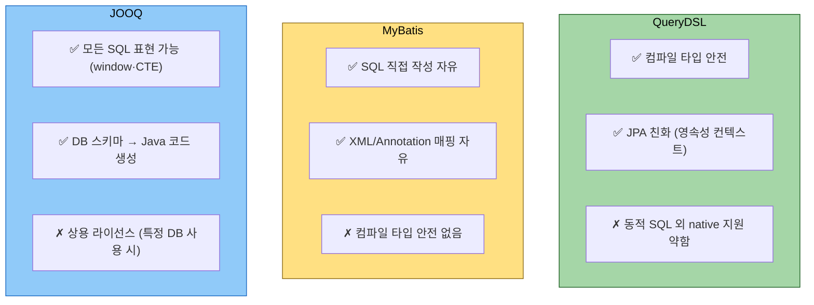
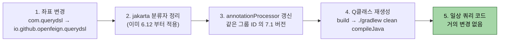

# 대안 비교와 6.12→7.x 마이그레이션

---

> **이 문서를 읽고 나면, QueryDSL·MyBatis·JOOQ 의 강점을 *타입 안전성·SQL 직접성·DB 의존성* 세 축에서 비교할 수 있고, 6.12 → 7.x 마이그레이션의 좌표 이전·jakarta 분류자·API 변경점 세 가지 비용을 정량 평가하며, 새 프로젝트의 도구 선택을 면접에서 정당화할 수 있다.**

QueryDSL이 답이 아닌 상황도 있다. JOOQ와 MyBatis가 어떤 강점에서 다른지를 짚고, OpenFeign 포크 6.12에서 7.x로 옮겨 갈 때 실제 빌드 파일과 코드가 어떻게 달라지는지 정리한다. 새 프로젝트가 둘 중 무엇을 골라야 할지 결론도 함께 본다.

세 도구의 강점을 한 그림으로 보면 다음과 같다.



JPA 가 영속성 컨텍스트의 1차 캐시·dirty checking·연관 관계 매핑 같은 기능을 이미 주고 있는 환경에서는 QueryDSL 이 자연스럽고, 복잡한 native SQL 위주(window·CTE·hint) 환경에서는 JOOQ 또는 MyBatis 가 답이다.


## 비교 대상 — 무엇과 비교하는가

> "JPA 기반 타입 안전 쿼리 빌더"라는 슬롯에 QueryDSL만 있는 게 아니다.

자바 진영에서 자주 같이 거론되는 데이터 접근 도구는 다음 셋이다.

1. **QueryDSL (JPA)** — JPQL을 메서드 체이닝으로. 본 묶음의 주제.
2. **JOOQ** — DB 스키마에서 타입 안전 SQL DSL을 직접 생성. JPA 의존 없음.
3. **MyBatis** — XML/어노테이션으로 SQL을 직접 작성. ORM이 아님.

용도가 겹치는 영역과 갈리는 영역이 있다. 어느 쪽을 고를지는 "타입 안전성을 어디서 확보할 것인가"와 "JPA의 영속성 컨텍스트가 필요한가"라는 두 축으로 결정한다.


## 세 도구의 핵심 차이

> 같은 화면을 짜는 데 필요한 코드와 학습 비용이 갈린다.

| 비교 축 | QueryDSL (JPA) | JOOQ | MyBatis |
|---------|---------------|------|---------|
| 기반 | JPQL | SQL 직접 | SQL 직접 |
| 메타모델 생성 | 엔티티 → Q클래스 | DB 스키마 → DSL 클래스 | 없음 (수동 매핑) |
| JPA 영속성 컨텍스트 | 사용 | 미사용 | 미사용 |
| 동적 쿼리 | 메서드 체이닝 | 메서드 체이닝 | XML `<if>` 또는 `@Provider` |
| 타입 안전성 | 컴파일 타임 | 컴파일 타임 | 런타임 |
| DB 종속성 | 거의 없음 (JPQL 변환) | 강함 (DB별 SQL 생성) | 명시적 (DB SQL 직접) |
| 학습 비용 | JPA + DSL | SQL + DSL | SQL + 매퍼 XML |
| 라이선스 | Apache 2.0 | OSS는 일부 제한, 상용은 유료 | Apache 2.0 |

요약은 다음과 같다.

1. **JPA가 핵심 도구라면 QueryDSL.** 영속성 컨텍스트, 1차 캐시, 더티 체킹을 활용하면서 동적 쿼리를 안전하게 짜는 조합이다.
2. **DB 스키마 중심으로 SQL을 자유롭게 쓰고 싶다면 JOOQ.** 윈도우 함수, CTE, DB 종속 함수까지 타입 안전하게 표현된다. 다만 상용 라이선스 비용이 발생할 수 있다.
3. **레거시 시스템 또는 SQL 튜닝이 절대적이라면 MyBatis.** XML로 SQL을 직접 다루므로 DBA가 작성한 SQL을 그대로 쓰기 좋다. 동적 쿼리 가독성은 셋 중 가장 약하다.

세 도구는 한 프로젝트에 같이 쓸 수도 있다. 흔한 조합은 QueryDSL을 메인으로 두고 통계·보고용으로 JOOQ나 native query를 끼우는 형태다.


## QueryDSL을 고르지 않는 게 나은 경우

> 본 묶음을 다 읽었더라도 다음 상황은 다른 도구를 검토한다.

1. **JPA를 쓰지 않는 프로젝트.** R2DBC, jdbcTemplate, Spring Data JDBC만으로 운영한다면 QueryDSL JPA는 무용하다.
2. **DB-First 설계가 절대적인 환경.** 스키마가 먼저 있고 자바 객체는 뷰처럼 쓰는 환경이라면 JOOQ가 자연스럽다.
3. **윈도우 함수·CTE·복잡한 분석 SQL이 핵심인 화면.** JPQL이 표현력에 한계를 보인다. native query나 JOOQ가 답이다.
4. **DBA가 SQL을 직접 작성·튜닝하는 워크플로.** MyBatis XML이 협업 모델에 가장 잘 맞는다.


## OpenFeign fork — 좌표 이전 정리

> 옛 프로젝트를 만나면 좌표부터 갈아야 한다. 변경 지점은 사실 build 파일 한 곳뿐이다.

원조에서 OpenFeign으로 옮길 때 build.gradle 변경은 다음과 같다.

```groovy
// 옛 (com.querydsl, javax 시대)
implementation 'com.querydsl:querydsl-jpa:5.0.0'
annotationProcessor 'com.querydsl:querydsl-apt:5.0.0:jpa'
annotationProcessor 'javax.annotation:javax.annotation-api:1.3.2'
annotationProcessor 'javax.persistence:javax.persistence-api:2.2'

// 새 (io.github.openfeign.querydsl, jakarta 시대)
implementation 'io.github.openfeign.querydsl:querydsl-jpa:6.12'
annotationProcessor 'io.github.openfeign.querydsl:querydsl-apt:6.12:jakarta'
annotationProcessor 'jakarta.annotation:jakarta.annotation-api'
annotationProcessor 'jakarta.persistence:jakarta.persistence-api'
```

코드는 거의 그대로다. 변경 지점은 다음 두 가지뿐이다.

1. **`javax.persistence.*` import를 `jakarta.persistence.*`로.** Spring Boot 3 자체가 jakarta로 옮겼기 때문에 QueryDSL과 무관하게 일어나는 변경이다.
2. **`com.querydsl.jpa.impl.JPAQueryFactory`는 그대로.** 패키지 경로는 바뀌지 않았다. 좌표만 바뀌었지 패키지 네임스페이스는 동일하다.

QClass 코드도 변경이 없다. annotationProcessor가 만드는 결과물은 같은 모양이다.


## 6.12 → 7.x 차이

> 7.x는 메이저 버전이지만 일상 쿼리 코드는 거의 같다. 차이는 빌드 설정과 일부 부속 기능이다.

마이그레이션의 단계별 변경점을 한 그림으로 보면 다음과 같다.



핵심은 *일상 쿼리 코드는 거의 그대로* 라는 점. 변경 비용은 빌드 설정 5~10줄과 한 번의 clean build 가 전부다.

| 항목 | 6.12 | 7.x (7.1 기준) |
|------|------|---------------|
| 릴리즈 | 2024-06-09 | 2024-10-21 |
| Java 최소 | 11 | 17 |
| Kotlin 빌드 도구 | kapt | KSP 정식 |
| 일부 deprecated 정리 | 일부 잔존 | 다수 제거 |
| `JPAQueryFactory`, `BooleanExpression` 등 핵심 API | 동일 | 동일 |

6.12에서 7.x로 옮길 때의 변경 지점은 다음 셋이다.

1. **빌드 파일의 버전 한 줄.** `set('querydslVersion', '6.12')` → `set('querydslVersion', '7.1')`.
2. **Java 17 이상 강제.** Spring Boot 3 환경이라면 이미 충족된다. Java 11에 머물러 있다면 7.x로 못 간다.
3. **Kotlin 사용 시 KSP로 전환 검토.** kapt 시대 설정이 그대로 동작하지만, 새로 시작한다면 KSP가 빠르고 미래 지향적이다.

코드 마이그레이션은 거의 자동이다. 컴파일 오류가 나는 경우는 deprecated 메서드를 쓰던 곳뿐이다. 가장 흔한 후보는 `fetchResults()`와 `fetchCount()`다. 둘 다 콘텐츠와 카운트를 별도 쿼리로 분리하는 패턴(01-06 참조)으로 갈아탄다.


## 새 프로젝트는 6.12와 7.1 중 무엇을 골라야 하는가

> 두 가지 기준만 보면 결정이 명확하다.

1. **Java 버전.** Java 11에 머무는 환경이라면 6.12. Java 17 이상이라면 7.1.
2. **사내 레퍼런스.** 동료들이 6.x로 짜고 있다면 학습 비용을 맞추는 차원에서 6.12. 새 팀이라면 7.1.

본 묶음이 6.12를 기준으로 잡은 이유는 두 번째 기준 때문이다. 한국어 블로그·Stack Overflow의 가장 두꺼운 자료층이 6.x에 있다. 학습이 끝난 직후 다른 코드를 읽는 비용이 가장 낮다. 환경이 갖춰지면 7.x로 옮기는 비용은 위 표에서 본 대로 크지 않다.


## javax → jakarta 마이그레이션의 도구

> Spring Boot 2.7에서 3.x로 옮길 때 한 번에 처리할 수 있는 도구가 있다.

OpenRewrite의 `org.openrewrite.java.migrate.JavaxPackageToJakarta` 레시피가 import 변환을 자동화한다. Gradle에 OpenRewrite 플러그인을 붙이고 한 번 실행하면 `javax.persistence.*`, `javax.annotation.*` import가 `jakarta.*`로 일괄 치환된다.

QueryDSL annotationProcessor 분류자는 여전히 수동이다. `:jakarta`를 빌드 파일에 명시한다. 이 분류자가 없으면 javax용 변형이 잡혀 컴파일이 깨진다(01-02 셋업 함정 참조).


## 다른 도구로 갈아탈 때의 비용

> "QueryDSL을 한 번 도입하면 빠지기 어렵다"는 말이 어디서 오는지 짚는다.

QueryDSL을 빼고 JOOQ로 옮긴다고 가정해 보자. 변경되는 영역은 다음 셋이다.

1. **리포지토리 구현 코드 전체.** `JPAQueryFactory.selectFrom(member)` → JOOQ DSL 코드로 다시 작성.
2. **DTO 매핑 방식.** `@QueryProjection`을 썼다면 의존성을 먼저 떼야 한다. `Projections.constructor`를 썼다면 DTO 자체는 영향 없다.
3. **테스트.** `@DataJpaTest` 슬라이스가 무용해진다. JOOQ는 JPA가 아니므로 다른 테스트 슬라이스 또는 통합 테스트로 옮긴다.

세 영역의 비용이 작지 않다. 도구 선택은 수년 단위 결정이라는 점을 처음부터 인식한다. 다만 "QueryDSL 잠금"은 다른 ORM 잠금과 차이가 크지 않다. JPA 자체를 빼는 비용이 더 크다.


## QueryDSL의 미래

> 2026년 5월 시점에서 본 QueryDSL의 위치를 짧게 정리한다.

OpenFeign fork가 정기 릴리즈를 이어 가고 있고, jakarta 호환·KSP 지원·deprecated 정리 등 현대화 흐름을 따라가고 있다. JPA가 사라지지 않는 한 QueryDSL의 자리도 사라지지 않는다. 다만 다음 두 가지 흐름은 주시한다.

1. **Spring Data JPA 자체가 메서드 이름 규약을 강화하고 `@Query`로 대형 쿼리도 잘 처리하는 방향.** 단순 검색만 필요한 화면에서 QueryDSL의 입지가 줄어든다.
2. **Hibernate 6의 Criteria 빌더가 가독성 개선 작업을 하고 있는 흐름.** 표준 명세 안에서 QueryDSL과 비슷한 메서드 체이닝이 가능해지면 종속성을 줄일 동기가 생긴다.

두 흐름 모두 단기간에 QueryDSL을 대체하지는 못한다. 학습한 지식이 5년 단위로 유효하다.


## 면접에서 받을 만한 질문

> 마지막 챕터답게 도구 선택 질문이 많다. 트레이드오프를 입으로 말할 수 있어야 한다.

1. QueryDSL과 JOOQ를 어떻게 비교하는가?
   - 답 요지: QueryDSL은 JPA 위에서 JPQL을 만들고, JOOQ는 DB 스키마에서 SQL을 직접 만든다. JPA 영속성 컨텍스트가 필요하면 QueryDSL, 윈도우 함수·CTE 같은 SQL 표현력이 필요하면 JOOQ. 두 도구를 한 프로젝트에 같이 쓰는 경우도 흔하다.
2. 6.12에서 7.1로 옮기는 비용은 얼마나 큰가?
   - 답 요지: 일상 쿼리 코드는 거의 같다. 변경은 빌드 파일의 버전 한 줄과 deprecated 메서드(`fetchResults`, `fetchCount`)를 쓰던 곳의 카운트 쿼리 분리 정도다. Java 17 이상이 강제된다.
3. 원조 `com.querydsl` 좌표를 그대로 두면 안 되는 이유는?
   - 답 요지: 마지막 정식 릴리즈가 2년 넘게 멈춰 있고, jakarta 패키지 전환이 정식으로 들어가지 않았다. Spring Boot 3 환경에서는 OpenFeign fork(`io.github.openfeign.querydsl`)가 사실상 표준이다.
4. QueryDSL을 도입한 프로젝트에서 빠져나오는 비용은?
   - 답 요지: 리포지토리 구현 코드를 전부 다시 쓰는 비용이 든다. 다만 DTO에 `@QueryProjection`을 쓰지 않았다면 DTO와 서비스 계층은 그대로 유지된다. 도구 잠금은 도입 시점에 인식하고 시작한다.


## 9개 챕터 종합 정리

> 본 묶음을 다 읽었다면 다음 다섯 가지를 자기 언어로 설명할 수 있다.

1. JPQL과 Criteria의 한계가 어떻게 QueryDSL을 만들었는가.
2. OpenFeign fork 6.12를 Spring Boot 3.2.3에 붙이는 표준 build.gradle.
3. 동적 쿼리에서 `BooleanExpression` 메서드 분해 패턴이 왜 더 잘 늙는가.
4. 페이징과 컬렉션 fetch join이 만나면 왜 메모리 폭발 위험이 있고, 어떻게 푸는가.
5. 6.12와 7.x, JOOQ와 MyBatis 사이의 결정 기준.

각 항목에 막히면 해당 챕터로 돌아간다. README의 학습 순서가 그 지도다.


## 관련 문서

> 본 대안 비교·마이그레이션 문서가 묶음 내 다른 챕터와 어떻게 연결되는지. 6.12 좌표 결정의 배경은 01-01 에 있다.

- [README (MOC)](README.md) — 9개 챕터 전체 지도
- [01-01. QueryDSL 입문과 6.12의 위치](01-01.QueryDSL%20입문과%206.12의%20위치.md) — 거버넌스 출발점
- [01-02. 프로젝트 셋업 (Gradle 6.12)](01-02.프로젝트%20셋업%20(Gradle%206.12).md) — 좌표 변경의 실제 코드
- [JOOQ 공식](https://www.jooq.org/) / [MyBatis 공식](https://mybatis.org/mybatis-3/) — 외부 비교 자료
