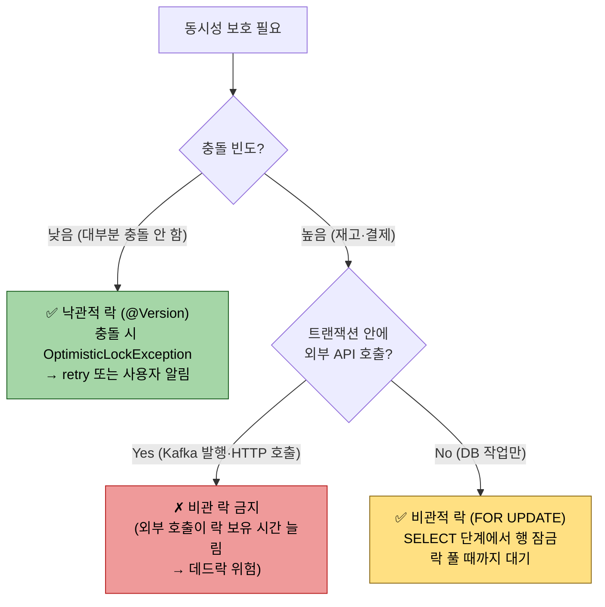
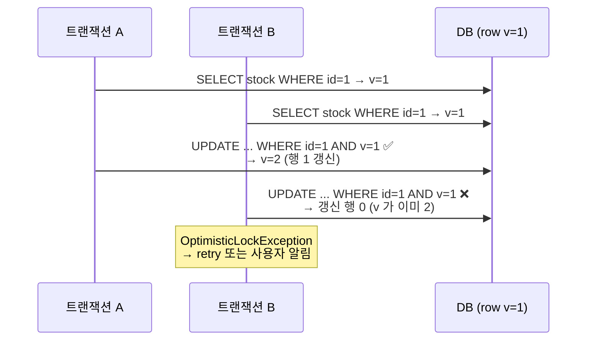

# 락과 동시성 제어

---

> **이 문서를 읽고 나면, 낙관적 락(`@Version` 기반)과 비관적 락(`PESSIMISTIC_WRITE`/`PESSIMISTIC_READ`) 의 트레이드오프를 충돌 빈도·재시도 비용·외부 API 호출 가능성 세 축에서 비교할 수 있고, QueryDSL `setLockMode` 와 Spring Data `@Lock` 을 도메인별로 선택하며, 비관 락 트랜잭션 안에서 외부 API 호출을 피해야 하는 이유를 설명할 수 있다.**

동시 트랜잭션이 같은 행을 수정하면 한쪽 변경분이 사라지는 lost update 가 일어난다. JPA는 이 문제를 낙관적 락(@Version 기반)과 비관적 락(SELECT … FOR UPDATE)으로 풀고, QueryDSL 은 같은 메커니즘을 `setLockMode` 한 줄로 노출한다. 어느 쪽을 어디에 붙여야 할지, Spring Data 의 `@Lock` 과 어떻게 합쳐 쓸지 정리한다.

낙관 vs 비관의 의사결정을 한 그림으로 보면 다음과 같다.



비관 락 트랜잭션 안의 외부 API 호출이 위험한 이유는 *락 보유 시간이 외부 시스템 응답 시간만큼 늘어나기* 때문이다. 외부 호출은 트랜잭션 *밖* 으로 빼거나 outbox 패턴으로 비동기화한다.


## 왜 락이 필요한가

> 두 트랜잭션이 같은 행을 동시에 읽고 각자 업데이트하면, 나중에 커밋한 쪽이 앞 쪽을 덮어쓴다.

쇼핑몰의 재고 차감을 떠올리면 그림이 명확해진다. `Item(id=1).stockQuantity = 10` 인 상황에서 두 주문이 거의 동시에 들어온다. T1 과 T2 가 각각 재고 10을 읽고, 각자 1씩 빼서 9를 저장한다. 결과는 9다. 두 건이 빠졌으니 8이어야 정상인데 한 건이 사라진 셈이다. 이 현상이 lost update 다.

DBMS의 기본 격리 수준(REPEATABLE READ, READ COMMITTED 등)은 이 문제를 막지 않는다. 격리 수준은 일관된 스냅샷 읽기를 보장할 뿐이지, "내가 읽은 동안 다른 트랜잭션이 같은 행을 못 바꾸게" 하지는 않는다. 변경 충돌을 직접 제어하려면 락 전략을 명시해야 한다.

JPA 는 두 갈래를 제공한다. 충돌이 드물면 낙관적 락으로 사후 감지, 충돌이 잦거나 재시도가 곤란하면 비관적 락으로 사전 차단이다. 어느 쪽이든 QueryDSL 로 동일하게 표현 가능하다.


## JPA 락 모드 분류

> JPA 표준 `LockModeType` 은 일곱 종류지만 실무에서 자주 쓰는 건 네 가지다.

| 모드 | 분류 | SQL 동작 | 대표 용도 |
|------|------|---------|----------|
| `OPTIMISTIC` | 낙관 | 읽기 시 version 확인, 커밋 시 재확인 | 충돌 적은 일반 조회→수정 |
| `OPTIMISTIC_FORCE_INCREMENT` | 낙관 | 변경이 없어도 version 강제 증가 | 자식 컬렉션 변경이 부모 version 을 흔들어야 할 때 |
| `PESSIMISTIC_WRITE` | 비관 | `SELECT … FOR UPDATE` | 결제·재고 차감처럼 재시도 비용이 큰 작업 |
| `PESSIMISTIC_READ` | 비관 | `SELECT … FOR SHARE` | 읽는 동안 다른 트랜잭션이 못 바꾸게 (PostgreSQL 한정 의미 있음) |

표준에는 `READ`, `WRITE`, `PESSIMISTIC_FORCE_INCREMENT`, `NONE` 이 더 있는데, 앞 두 개는 deprecated alias 고 `PESSIMISTIC_FORCE_INCREMENT` 는 비관 락 + version 증가의 결합이라 사용 빈도가 낮다. `NONE` 은 락 없음의 명시 표현이다.


## 낙관적 락 — @Version 으로 사후 감지

> 엔티티에 `@Version` 필드를 두면, JPA 가 update SQL 의 where 절에 version 을 끼워 넣고 갱신 행 수가 0이면 예외를 던진다.

@Version 기반 낙관 락의 동시 트랜잭션 충돌 시나리오를 한 그림으로 보면 다음과 같다.



핵심은 *사전 차단이 아닌 사후 감지* — 충돌 빈도가 낮을 때 락 비용 0 으로 동시성 보호.

엔티티 정의는 짧다.

```java
@Entity
public class Item {
    @Id @GeneratedValue private Long id;
    private int stockQuantity;
    @Version private Long version;
}
```

업데이트 시 발생하는 SQL 은 다음과 같다.

```sql
update item
set stock_quantity = ?, version = ? + 1
where id = ? and version = ?
```

T1 과 T2 가 같은 row(version=3) 를 읽었다고 하자. T1 이 먼저 커밋해 version 이 4로 올라간다. T2 가 자기 변경분을 커밋하려는 순간 `where version = 3` 매칭 행이 사라졌으므로 update 결과가 0행이 된다. JPA 는 이를 `OptimisticLockException`(또는 Spring 의 `ObjectOptimisticLockingFailureException`) 으로 변환한다.

낙관적 락의 가치는 락을 안 걸고도 충돌을 감지한다는 점이다. DB 락 비용이 없으므로 동시 처리량이 높다. 단점은 충돌이 났을 때 트랜잭션을 다시 시작해야 한다는 것이다. 재시도 로직(`@Retryable`, AOP 인터셉터, 명시적 루프)이 함께 와야 하며, 사용자에게 보여 줄 메시지("다시 시도해 주세요")도 필요하다.

QueryDSL 로 강제 적용할 때는 `setLockMode` 를 붙인다. 단순 조회에는 큰 의미가 없고, 부모-자식 관계에서 자식 변경이 부모 version 을 흔들어야 할 때 `OPTIMISTIC_FORCE_INCREMENT` 가 유용하다.

```java
queryFactory
    .selectFrom(item)
    .where(item.id.eq(id))
    .setLockMode(LockModeType.OPTIMISTIC_FORCE_INCREMENT)
    .fetchOne();
```


## 비관적 락 — SELECT … FOR UPDATE 로 사전 차단

> 비관 락은 행을 읽는 순간 다른 트랜잭션이 같은 행에 손대지 못하도록 DB 차원에서 막는다.

`PESSIMISTIC_WRITE` 를 걸면 Hibernate 는 `SELECT … FOR UPDATE` 를 발행한다. 이 락을 잡은 트랜잭션이 끝날 때까지(커밋 또는 롤백) 다른 트랜잭션이 같은 행을 SELECT FOR UPDATE 로 읽거나 update/delete 하려 하면 대기한다. lost update 자체가 발생할 여지가 없다는 의미다.

```java
Item locked = queryFactory
    .selectFrom(item)
    .where(item.id.eq(itemId))
    .setLockMode(LockModeType.PESSIMISTIC_WRITE)
    .fetchOne();
locked.decrementStock(1);
```

이 코드가 발행하는 SQL 은 PostgreSQL 기준 다음 형태다.

```sql
select … from item where id = ? for update
```

H2 와 MySQL 도 `for update` 를 받지만 락 단위·기간이 미묘하게 다르다. PostgreSQL 은 명시적으로 `FOR UPDATE`, `FOR NO KEY UPDATE`, `FOR SHARE`, `FOR KEY SHARE` 네 단계를 구분하며 외래키 트리거 충돌을 줄이려고 `FOR NO KEY UPDATE` 를 자동 선택하는 경우가 있다. 운영 DB 가 PostgreSQL 이라면 EXPLAIN 으로 락 의도를 확인하는 게 안전하다.

`PESSIMISTIC_READ` 는 PostgreSQL 의 `FOR SHARE` 로 매핑된다. 같은 행을 다른 트랜잭션이 동시에 읽는 건 허용하지만, 변경(UPDATE/DELETE)은 막는다. MySQL InnoDB 도 비슷하게 동작한다. H2 와 일부 DB 에서는 `PESSIMISTIC_READ` 가 사실상 `PESSIMISTIC_WRITE` 와 같은 강도로 떨어진다는 점을 기억해 둔다. 학습 환경에서 둘이 똑같이 보였다면 DB 한계 때문이지 JPA 가 무시한 게 아니다.


## QueryDSL `setLockMode` 와 Spring Data `@Lock` 비교

> 같은 락을 거는 두 가지 진입점이다. 코드 경로가 어디냐에 따라 자연스러운 쪽이 다르다.

QueryDSL 의 `setLockMode` 는 동적 쿼리 빌딩 흐름 안에 락을 끼우고 싶을 때 쓴다. 검색 조건이 동적이거나 join 으로 가져온 결과 일부에만 락을 걸고 싶을 때 유리하다. 다음처럼 BooleanExpression 메서드 분해와 함께 쓸 수 있다.

```java
public Item lockForCheckout(Long itemId, Integer minStock) {
    return queryFactory
        .selectFrom(item)
        .where(
            item.id.eq(itemId),
            stockGoe(minStock)
        )
        .setLockMode(LockModeType.PESSIMISTIC_WRITE)
        .fetchOne();
}
```

Spring Data JPA 의 `@Lock` 은 메서드 시그니처에 락 모드를 박아 두는 방식이다. 호출처에서는 락 사실을 모르고 그냥 메서드를 부른다. 단순한 단건 조회 락에 어울린다.

```java
public interface ItemRepository extends JpaRepository<Item, Long> {

    @Lock(LockModeType.PESSIMISTIC_WRITE)
    @Query("select i from Item i where i.id = :id")
    Optional<Item> findByIdForUpdate(@Param("id") Long id);
}
```

`@Lock` 을 메서드 이름 추론(`findByIdForUpdate` 처럼) 만으로 적용하려면 위처럼 `@Query` 를 함께 두는 편이 안전하다. 메서드 이름 파생 쿼리에 `@Lock` 을 단독 적용하는 패턴은 Spring Data 버전마다 미묘하게 동작이 갈렸던 이력이 있다.

선택 기준은 단순하다. 락이 도메인 로직의 일부면(언제·어떤 조건에서 잠글지가 비즈니스 규칙) QueryDSL 쪽이 자연스럽다. 락이 단순한 행 조회 보장이면 `@Lock` 한 줄이 깔끔하다. 한 프로젝트 안에서 두 패턴을 섞어 써도 무방하다.


## 실무 패턴 — 재고 차감

> 가장 자주 등장하는 시나리오다. 낙관과 비관을 같은 문제에 어떻게 다르게 적용하는지 비교한다.

낙관적 락 버전의 흐름은 다음과 같다.

```java
@Transactional
public void decrement(Long itemId, int amount) {
    Item it = itemRepository.findById(itemId).orElseThrow();
    it.decrementStock(amount); // 도메인 메서드 — 음수 가드 포함
}
```

`@Version` 이 붙은 상태라면 트랜잭션 커밋 시점에 version 비교가 자동으로 들어간다. 충돌이 생기면 `ObjectOptimisticLockingFailureException` 이 위로 전파된다. 호출처에서 재시도 정책을 결합한다.

```java
@Retryable(
    retryFor = ObjectOptimisticLockingFailureException.class,
    maxAttempts = 3, backoff = @Backoff(delay = 50)
)
public void decrement(Long itemId, int amount) { … }
```

비관 락 버전은 락을 먼저 잡는다.

```java
@Transactional
public void decrement(Long itemId, int amount) {
    Item it = itemRepository.findByIdForUpdate(itemId).orElseThrow();
    it.decrementStock(amount);
}
```

호출처는 재시도 없이 그냥 호출한다. 단, 트랜잭션이 길어지면 다른 호출자들이 줄을 서 대기 시간이 늘어난다. 그래서 비관 락 트랜잭션 안에서 외부 API 호출이나 무거운 연산을 절대 하지 않는다. "락 잡고 → 즉시 차감 → 즉시 커밋" 만 한다.

선택의 기준은 충돌 빈도다. 같은 상품을 초당 수십 건이 동시에 차감하는 핫 인기 상품이라면 낙관적 락은 재시도 폭주로 처리량이 무너진다. 비관 락이 안전하다. 반대로 일반적인 주문 흐름에서 같은 상품을 동시에 사는 사용자가 거의 없다면 낙관 락이 처리량이 훨씬 높다.


## 데드락과 타임아웃 — 운영에서 부딪히는 함정

> 비관 락을 쓰는 순간 데드락 가능성이 생긴다. 락 획득 순서를 항상 같게 정해 두는 게 1차 방어다.

데드락은 두 트랜잭션이 서로 상대가 잡은 락을 기다릴 때 일어난다. 주문 시스템의 고전적 사례는 두 사용자가 서로 반대 순서로 같은 두 상품을 차감하는 경우다. T1 은 `A→B` 순서로 락을 잡고, T2 는 `B→A` 순서로 잡는다. 두 트랜잭션이 정확히 동시에 첫 락을 얻으면 두 번째 락을 영원히 못 잡는다. DB 가 이 사실을 감지해 한쪽을 강제 롤백한다(MySQL `Deadlock found when trying to get lock`, PostgreSQL `deadlock detected`).

방어법은 락 획득 순서를 도메인 차원에서 강제하는 것이다. "여러 상품을 차감할 때는 항상 itemId 오름차순으로 락을 잡는다" 같은 규칙을 코드 레벨에서 보장한다.

```java
List<Long> sortedIds = ids.stream().sorted().toList();
for (Long id : sortedIds) {
    Item it = itemRepository.findByIdForUpdate(id).orElseThrow();
    it.decrementStock(amounts.get(id));
}
```

타임아웃 설정도 운영에서 자주 손대는 영역이다. 기본 동작은 락이 풀릴 때까지 무한 대기다. 사용자 요청 처리 스레드가 락 대기로 묶이면 응답이 안 가고 톰캣 워커가 빠르게 고갈된다. JPA 는 hint 로 타임아웃을 받는다.

```java
queryFactory
    .selectFrom(item)
    .where(item.id.eq(id))
    .setLockMode(LockModeType.PESSIMISTIC_WRITE)
    .setHint("jakarta.persistence.lock.timeout", 3000) // 3초
    .fetchOne();
```

PostgreSQL 9.5+ 에는 `SKIP LOCKED` 가 있다. "이미 누가 잡고 있으면 그 행은 건너뛴다" 는 의미라 작업 큐 패턴(여러 워커가 처리할 행을 가져갈 때) 구현에 흔히 쓰인다. JPA 표준은 아니지만 Hibernate 는 `LockOptions.SKIP_LOCKED` 를 내부적으로 지원한다.


## QueryDSL `update().execute()` 와 영속성 컨텍스트 — bulk 연산의 함정

> `queryFactory.update(...).execute()` 는 *영속성 컨텍스트를 우회* 하고 SQL 을 직접 실행한다. 같은 트랜잭션 안에서 같은 엔티티를 다시 조회하면 1차 캐시의 *옛 값* 이 반환되므로 `em.flush()` + `em.clear()` 로 캐시 정합성을 맞춰야 한다.

QueryDSL 의 `update()` / `delete()` / `insert()` 는 *영속성 컨텍스트를 우회* 해 DB 에 직접 SQL 을 날린다. 락·동시성 영역에서 이 우회가 *생각보다 큰 사고* 를 일으킨다.

### 기본 사용

```java
long affected = queryFactory
    .update(stock)
    .set(stock.quantity, stock.quantity.subtract(1))
    .where(stock.productId.eq(productId).and(stock.quantity.gt(0)))
    .execute();
```

산출 SQL: `UPDATE TB_STOCK SET QUANTITY = QUANTITY - 1 WHERE PRODUCT_ID = ? AND QUANTITY > 0`. JPA `EntityManager` 의 `persist` / `merge` 와 달리 *영속성 컨텍스트를 거치지 않고* DB 에 바로 박힌다. 단일 행이 아닌 *조건에 맞는 모든 행* 을 한 번에 갱신.

### 우회의 이점

- **성능** — 영속화 → 더티 체킹 → flush 의 3 단계를 건너뜀. 대량 갱신에서 수십 배 빠름
- **`@Version` 부담 없음** — 단일 SQL 이라 낙관적 락의 race condition 자체가 없음
- **명시적 SQL** — 어떤 행이 어떤 조건으로 갱신되는지 코드에서 즉시 보임

### 함정 1 — 영속성 컨텍스트 불일치

같은 트랜잭션 안에서 *bulk update 전에 조회한 엔티티* 가 *영속성 컨텍스트에 살아있다* 면, bulk update 의 결과가 *그 엔티티에 반영되지 않는다*.

```java
@Transactional
public void decrementStock(Long productId) {
    Stock loaded = stockRepository.findById(productId).orElseThrow();
    // loaded.quantity = 10 (영속성 컨텍스트에 캐싱)

    queryFactory.update(stock)
        .set(stock.quantity, stock.quantity.subtract(1))
        .where(stock.productId.eq(productId))
        .execute();
    // DB 는 quantity = 9 로 갱신됐지만, loaded.quantity 는 여전히 10

    log.info("after update: {}", loaded.getQuantity());  // ← 10 (틀린 값)
    // 트랜잭션 끝날 때 더티 체킹이 안 일어나면 OK,
    // 만약 loaded.setName("foo") 같은 변경이 더 있으면 quantity=10 으로 다시 덮어쓸 위험
}
```

해결 두 가지:

```java
// 방식 A — bulk update 후 영속성 컨텍스트 초기화
entityManager.flush();   // 펜딩 변경 먼저 DB 에 반영
entityManager.clear();   // 영속성 컨텍스트 비움
Stock fresh = stockRepository.findById(productId).orElseThrow();  // 새로 로드

// 방식 B — bulk update 전에 영속성 캐시 없이 진행
// (loaded 를 굳이 가져오지 않거나 detach 후 재조회)
```

방식 A 의 `flush + clear` 가 표준. Spring Data JPA 의 `@Modifying(clearAutomatically = true)` 는 이 정리를 자동화하는 옵션.

### 함정 2 — `@Modifying` 어노테이션은 QueryDSL 에 직접 적용 안 됨

Spring Data JPA 의 `@Query` + `@Modifying` 조합은 *JPQL/native SQL* 의 update/delete 에 영속성 정리를 자동 적용한다.

```java
// Spring Data JPA 표준 — @Modifying 이 영속성 정리 자동
@Modifying(clearAutomatically = true)
@Query("UPDATE Stock s SET s.quantity = s.quantity - 1 WHERE s.productId = ?1")
int decrement(Long productId);
```

QueryDSL 의 `update().execute()` 는 *Repository 메서드가 아니라 일반 메서드 호출* 이라 `@Modifying` 이 안 붙는다. 영속성 정리는 *직접 호출* 해야 한다.

```java
@Transactional
public long decrementStock(Long productId) {
    long affected = queryFactory.update(stock)...execute();
    entityManager.flush();
    entityManager.clear();    // ← 수동 정리
    return affected;
}
```

또는 *Custom Repository Impl* 안에 두고 호출 측이 `findById` 같은 후속 조회를 *항상 새 트랜잭션* 으로 가져가는 정책을 고수할 수도 있다. 어느 쪽이든 *영속성 컨텍스트 우회를 알고 다루는 것* 이 핵심.

### 함정 3 — 비관적 락과의 결합

`update().execute()` 가 *그 자체로 행 락* 을 잡지만, *조건 검사 → 갱신* 의 race condition 은 여전히 가능하다.

```java
// race condition 가능 — 조건 검사와 갱신이 같은 SQL 안에 있지만
long affected = queryFactory.update(stock)
    .set(stock.quantity, stock.quantity.subtract(1))
    .where(stock.productId.eq(productId).and(stock.quantity.gt(0)))   // ← 갱신 시점에 확인
    .execute();

if (affected == 0) {
    throw new OutOfStockException();   // 재고 부족 또는 동시 갱신으로 조건 미달
}
```

`affected == 0` 은 *재고 부족* 일 수도 있고 *동시에 다른 트랜잭션이 0 으로 줄임* 일 수도 있다. 위 패턴은 사실 race condition 이 아니라 *원자적* 이지만 — DB 가 `UPDATE ... WHERE qty > 0` 을 한 SQL 로 처리하므로 — 두 트랜잭션이 동시에 도착해도 *하나만* `affected = 1` 을 받고 다른 하나는 `affected = 0` 을 받는다.

그러나 다음 패턴은 *진짜 race condition*:

```java
// ✗ race — 조건 검사와 갱신이 분리
Stock s = queryFactory.selectFrom(stock).where(stock.productId.eq(id)).fetchOne();
if (s.getQuantity() > 0) {
    queryFactory.update(stock)
        .set(stock.quantity, s.getQuantity() - 1)   // ← 읽은 값으로 덮어쓰기
        .where(stock.productId.eq(id))
        .execute();
}
```

두 트랜잭션이 같은 시점에 `s.getQuantity() = 5` 를 읽으면 둘 다 `set(quantity, 4)` 로 덮어써 *재고가 한 단위만 줄어든다*. 비관적 락(`PESSIMISTIC_WRITE`) 또는 `@Version` 또는 *원자적 update* (위의 `qty > 0` 패턴) 로 해결.

### 결정 가이드

| 상황 | 사용 |
|------|------|
| 대량 행 갱신 (수백~수만) | `queryFactory.update().execute()` + 수동 `flush/clear` |
| 단일 엔티티 갱신 (간단한 도메인) | JPA `EntityManager` / `entity.setXxx()` 더티 체킹 |
| 원자적 조건 갱신 (`qty > 0` 같은) | `update().where().execute()` + `affected` 확인 |
| 같은 트랜잭션에서 갱신 후 *같은 엔티티 재사용* | `flush/clear` 필수, 또는 `EntityManager.refresh()` |
| 낙관적 락 (`@Version`) 과 결합 | bulk 는 version 검증 우회 — 결합 안 됨, 비관적 락 또는 원자적 update 선택 |
| 비관적 락과 결합 | `setLockMode` 후 더티 체킹 또는 `update().execute()`, 단 격리 수준 점검 필요 |

### 운영 코드 reference — 결재 도메인의 bulk 사용

결재 도메인은 *상태 전환이 단건 위주* (한 결재의 상태 변경) 라 `update().execute()` 보다 *영속 엔티티의 setter + 더티 체킹* 이 표준. bulk update 가 등장하는 자리는 *재고/포인트/카운터* 처럼 단건 갱신 race 가 위험한 도메인.

본 챕터 § "실무 패턴 — 재고 차감" 의 예제가 위 § 함정 3 의 원자적 update 패턴을 직접 보여준다. `affected == 0` 분기로 "재고 부족 또는 동시 차감" 을 한 자리에서 처리.


## H2 와 PostgreSQL 의 락 동작 차이

> 학습 환경(H2)에서 통과한 락 코드가 운영(PostgreSQL)에서 다르게 동작할 수 있다. 가장 흔히 부딪히는 차이를 미리 본다.

H2 1.4.x 이후는 `MVStore` 엔진이 기본이며 `FOR UPDATE` 를 지원한다. 그러나 격리 수준에 따라 락 단위가 행이 아닌 테이블로 떨어지는 경우가 있다. 학습용 단위 테스트가 우연히 통과해도 운영 환경에서 같은 패턴이 동시성 부하를 받으면 다르게 깨진다.

PostgreSQL 은 행 단위 락이 명확하고 `FOR UPDATE`, `FOR NO KEY UPDATE`, `FOR SHARE`, `FOR KEY SHARE` 네 단계를 명확히 구분한다. Hibernate 6.4 은 외래키 인덱스 갱신 충돌을 줄이려고 `PESSIMISTIC_WRITE` 를 `FOR NO KEY UPDATE` 로 매핑하는 경향이 있다. 강제로 `FOR UPDATE` 로 떨어뜨리려면 `setLockMode` 와 함께 `@QueryHints` 또는 dialect 설정을 손봐야 한다.

운영 DB 가 PostgreSQL 이면 락 동작 검증은 PostgreSQL 인스턴스에서 직접 하는 편이 안전하다. Testcontainers 로 테스트 시점에 컨테이너를 띄우는 방식이 표준 패턴이다.


## 면접 대비 체크리스트

> 본 챕터를 읽은 뒤 다음 질문에 답할 수 있어야 한다.

1. lost update 문제가 무엇이고, DBMS 격리 수준(REPEATABLE READ 등)이 이를 막지 못하는 이유를 설명할 수 있는가?
2. `@Version` 필드가 붙은 엔티티의 update SQL 이 어떻게 변하는지, 충돌 감지가 어느 시점에 일어나는지 말할 수 있는가?
3. 낙관적 락과 비관적 락을 어떤 기준으로 선택하는가? 처리량, 재시도 비용, 충돌 빈도 측면에서.
4. QueryDSL 의 `setLockMode` 와 Spring Data 의 `@Lock` 을 각각 어디에 쓰는 게 자연스러운가?
5. 비관 락 트랜잭션 안에서 외부 API 호출을 피해야 하는 이유는?
6. 데드락 방어 패턴(락 획득 순서 일관성)을 코드 예시로 설명할 수 있는가?
7. PostgreSQL 의 `SKIP LOCKED` 가 어떤 상황에서 유용한가?
8. H2 단위 테스트로 비관 락을 검증할 때 주의할 점은?

각 질문에 막히면 위 절을 다시 본다.


## 관련 문서

> 본 락·동시성 문서가 묶음 내 다른 챕터와 어떻게 연결되는지. `setLockMode` 와 BooleanExpression 분해 결합은 01-04, 부모 카테고리 06_data 의 트랜잭션 격리 수준은 외부 문서로 이어진다.

- [01-04.동적 쿼리](./01-04.동적%20쿼리.md) — `setLockMode` 를 BooleanExpression 분해와 결합하는 패턴
- [03-01.커스텀 리포지토리 패턴](./03-01.커스텀%20리포지토리%20패턴.md) — Custom Impl 에 락 메서드 위치
- [03-04.실무 변형 모음](./03-04.실무%20변형%20모음.md) — 상관 서브쿼리·PathBuilder 와 락 결합 변형
