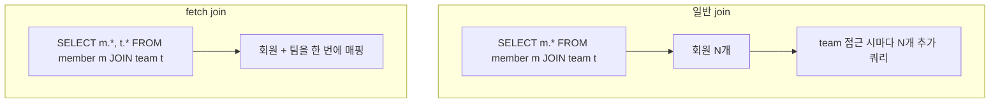

# 기본 문법과 조인

---

> `JPAQueryFactory`로 첫 쿼리를 짜는 방법부터, 일반 조인과 페치 조인의 결정적 차이까지 짚는다. SQL을 한 줄씩 떠올리면서 메서드 체인이 무엇으로 변환되는지 머릿속에서 그리는 훈련이 핵심이다.


## 진입점은 JPAQueryFactory 하나다

> 모든 QueryDSL 쿼리는 `JPAQueryFactory`에서 시작한다. 다른 진입점은 없다.

리포지토리의 시작 형태는 다음과 같다.

```java
@Repository
@RequiredArgsConstructor
public class MemberQueryRepository {

    private final JPAQueryFactory queryFactory;

    public List<Member> findAll() {
        return queryFactory
                .selectFrom(member)
                .fetch();
    }
}
```

- `selectFrom(member)`는 `select(member).from(member)`의 단축이다. 
- 같은 엔티티를 select와 from에 동시에 두는 흔한 경우를 짧게 쓰기 위한 편의 메서드다. select와 from 대상이 다르면 `select(...).from(...)`로 풀어 써야 한다.

`member`는 `QMember.member`의 정적 임포트다. 본 챕터의 모든 코드 블록은 다음 두 줄을 생략한다.

```java
import static com.example.domain.QMember.member;
import static com.example.domain.QTeam.team;
```


## select / where / orderBy 기본 골격

> SQL을 알고 있다면 70%는 직관적이다. 나머지 30%만 짚는다.

다음 쿼리는 "20세 이상의 회원을 이름 오름차순으로 조회하되 상위 10명만"을 표현한다.

```java
List<Member> result = queryFactory
        .selectFrom(member)
        .where(member.age.goe(20))
        .orderBy(member.name.asc())
        .limit(10)
        .fetch();
```

`goe`는 "greater or equal"이다. 비교 메서드 이름이 SQL 어휘와 다른 점이 첫 진입 장벽이다.

| QueryDSL | SQL |
|---------|-----|
| `eq` | `=` |
| `ne` | `<>` |
| `gt` / `goe` | `>` / `>=` |
| `lt` / `loe` | `<` / `<=` |
| `between(a, b)` | `between a and b` |
| `in(a, b, c)` | `in (a, b, c)` |
| `isNull` / `isNotNull` | `is null` / `is not null` |
| `like("%kim%")` | `like` (와일드카드 직접 명시) |
| `contains("kim")` | `like '%kim%'` (와일드카드 자동) |
| `startsWith("kim")` | `like 'kim%'` |

- 비교 메서드를 외우기보다, 헷갈릴 때 IDE 자동완성으로 메서드 이름을 훑는 습관이 빠르다. `member.age.`까지 입력하면 IDE가 사용 가능한 메서드를 모두 보여 준다.


## fetch 메서드 다섯 가지

> 쿼리를 끝맺는 메서드가 다섯 종류 있다. 의도가 다르므로 헷갈리면 버그가 된다.

```java
.fetch()         // List<T> — 0개 이상
.fetchOne()     // T — 정확히 1개. 0개면 null, 2개 이상이면 NonUniqueResultException
.fetchFirst()   // T — limit(1) + fetchOne. 첫 번째 한 건만
  
.fetchCount()   // long — 별도 카운트 쿼리 실행 (deprecated, 6.x 후반부터 권장 안 함)
.fetchResults() // QueryResults<T> — 콘텐츠와 카운트 동시 (deprecated)
```

- `fetchCount`와 `fetchResults`가 deprecated인 이유는 카운트 쿼리를 자동 생성하는 동작이 페치 조인과 만나면 의도와 어긋나기 때문이다. 실제 프로덕션에서는 다음 두 패턴을 쓴다.

```java
// 카운트만 필요할 때
Long total = queryFactory
        .select(member.count())
        .from(member)
        .where(member.age.goe(20))
        .fetchOne();

// 페이지 정보 + 콘텐츠
List<Member> content = queryFactory
        .selectFrom(member)
        .where(member.age.goe(20))
        .offset(0).limit(10)
        .fetch();
```

- 페이징 시 카운트 쿼리를 분리하는 이유와 `PageableExecutionUtils` 사용은 01-06에서 다룬다.


## 일반 조인과 leftJoin

> SQL과 1:1로 대응된다. 다만 조건의 위치가 한 군데 헷갈린다.

회원과 팀을 inner join하고, 팀 이름이 "backend"인 회원만 조회한다.

```java
List<Member> result = queryFactory
        .selectFrom(member)
        .join(member.team, team)
        .where(team.name.eq("backend"))
        .fetch();
```

- `join(member.team, team)`은 두 인자를 받는다. 
- 첫 인자(`member.team`)는 조인할 연관 경로, 둘째(`team`)는 별칭으로 쓸 Q타입 인스턴스다. 별칭이 있어야 `where`나 `select`에서 팀 컬럼에 접근할 수 있다.

leftJoin은 `leftJoin(...)` 한 단어만 바꾸면 된다.

```java
List<Tuple> result = queryFactory
        .select(member, team)
        .from(member)
        .leftJoin(member.team, team)
        .fetch();
```

leftJoin은 팀이 없는 회원도 결과에 포함되며, 그 경우 튜플의 `team` 위치가 null로 나온다.

### on 절로 조인 조건 추가

조인 자체에 추가 조건을 걸고 싶을 때는 `on`을 붙인다. 예를 들어 "팀이 있되 이름이 'backend'인 팀과만 조인한다"는 다음과 같다.

```java
List<Tuple> result = queryFactory
        .select(member, team)
        .from(member)
        .leftJoin(member.team, team).on(team.name.eq("backend"))
        .fetch();
```

- `on`을 `where`에 둔 것과 결과가 다르다. `on`은 조인 단계에서 필터링하므로 회원 전체가 결과에 남고 매칭되지 않은 팀은 null로 나온다. 
- `where`로 옮기면 inner join처럼 회원 자체가 결과에서 빠진다. SQL의 `LEFT JOIN ... ON ...`과 같은 의미다.


## fetchJoin — N+1을 막는 핵심 무기

> 일반 조인과 글자 하나(`fetchJoin()`)만 다르지만 동작은 완전히 다르다.

회원과 회원의 팀을 한 쿼리로 가져와 N+1 문제를 막는다.

```java
List<Member> result = queryFactory
        .selectFrom(member)
        .join(member.team, team).fetchJoin()
        .fetch();
```

일반 `join`만 쓰면 SQL은 inner join을 하지만, JPA는 결과를 매핑할 때 회원 엔티티만 만들고 `Team`은 프록시로 둔다. 이후 `member.getTeam().getName()`을 호출하면 추가 쿼리가 나간다(N+1). `fetchJoin`을 붙이면 한 번의 SQL로 회원과 팀을 동시에 채운다.



> 다이어그램 풀이: 일반 join은 SQL은 한 번이지만 영속성 컨텍스트에 팀이 채워지지 않아 추가 쿼리가 발생한다. fetch join은 SELECT 절에 팀 컬럼까지 포함해 한 번에 모든 컬럼을 가져온다.

- fetch join은 강력하지만 페이징과 만나면 함정이 생긴다. 페이지+컬렉션 페치 조인에서 발생하는 `HHH000104` 경고는 01-06에서 깊이 다룬다. 본 챕터에서는 "일반 조인과 다르다"는 점만 기억한다.


## 집계 — count, sum, avg, max, min

> 집계 함수는 메서드 호출로 표현하고, 결과는 `Tuple` 또는 단일 값으로 받는다.

팀별 회원 수와 평균 나이를 구한다.

```java
List<Tuple> result = queryFactory
        .select(team.name, member.count(), member.age.avg())
        .from(member)
        .join(member.team, team)
        .groupBy(team.id)
        .having(member.count().goe(2L))
        .fetch();

for (Tuple row : result) {
    String teamName = row.get(team.name);
    Long count = row.get(member.count());
    Double avgAge = row.get(member.age.avg());
}
```

`Tuple`은 컬럼 위치가 아니라 표현식 자체로 값을 꺼낸다. `row.get(0)`이 아니라 `row.get(team.name)`이다. SQL의 별칭 인덱싱과 다른 점이다. 컬럼 순서가 바뀌어도 `get` 호출이 깨지지 않는 장점이 있는 대신, DTO로 곧장 받는 방식이 더 안전하다. DTO 매핑은 01-05에서 다룬다.


## Expressions로 SQL 표현 직접 끼우기

> QueryDSL이 제공하지 않는 SQL 함수는 `Expressions`로 우회한다.

예를 들어 PostgreSQL의 `date_trunc('day', ordered_at)`로 일자별 주문 수를 집계하고 싶다고 하자.

```java
StringTemplate dayBucket = Expressions.stringTemplate(
        "function('date_trunc', 'day', {0})", order.orderedAt
);

List<Tuple> result = queryFactory
        .select(dayBucket, order.count())
        .from(order)
        .groupBy(dayBucket)
        .orderBy(dayBucket.asc())
        .fetch();
```

`{0}`은 첫 번째 인자에 대응하는 자리표시자다. JPQL이 SQL 함수를 인식하려면 `function('함수명', 인자...)` 문법을 통해야 하므로, 위 패턴은 거의 그대로 쓴다.

`Expressions.numberTemplate`, `Expressions.booleanTemplate`도 같은 원리다. 비표준 SQL을 끼우는 도구라고 기억하면 충분하다.


## case 표현식

> 조건 분기를 select 절이나 order 절에 넣는다.

회원 상태별 정렬 우선순위를 다르게 매기는 예다.

```java
NumberExpression<Integer> rank = new CaseBuilder()
        .when(member.status.eq(MemberStatus.ACTIVE)).then(1)
        .when(member.status.eq(MemberStatus.DORMANT)).then(2)
        .otherwise(3);

List<Member> result = queryFactory
        .selectFrom(member)
        .orderBy(rank.asc(), member.name.asc())
        .fetch();
```

복잡한 case는 SQL이나 native query로 빠지는 게 가독성에 낫다. 두세 단계 분기까지가 QueryDSL `CaseBuilder`의 임계점이다.


## 별칭 충돌과 자기 참조 조인

> 같은 엔티티를 한 쿼리에서 두 번 참조해야 할 때가 있다. 그때만 별칭을 직접 만든다.

회원이 자기와 같은 팀에 속한 다른 회원을 모두 찾는 쿼리를 보자. `QMember.member` 인스턴스를 두 번 쓰면 별칭이 충돌한다. 새 별칭을 만든다.

```java
QMember m1 = new QMember("m1");
QMember m2 = new QMember("m2");

List<Tuple> result = queryFactory
        .select(m1, m2)
        .from(m1, m2)
        .where(m1.team.eq(m2.team), m1.id.ne(m2.id))
        .fetch();
```

기본 인스턴스(`QMember.member`)는 별칭 `member1`을 갖는다. 새 별칭은 충돌하지 않는 임의 이름을 준다. 자기 참조나 같은 엔티티 두 번 조인이 아니면 기본 인스턴스 그대로 쓴다.


## 면접에서 받을 만한 질문

> 기본 문법은 SQL을 안다면 어렵지 않다. 다만 fetch 종류와 fetchJoin 의미는 자주 묻는다.

1. `fetchOne()`과 `fetchFirst()`의 차이는?
   - 답 요지: `fetchOne`은 정확히 1건을 기대하며 2건 이상이면 예외를 던진다. `fetchFirst`는 결과가 여러 건이어도 첫 1건만 반환한다(내부적으로 `limit(1)` + `fetchOne`).
2. `join`과 `fetchJoin`의 SQL은 어떻게 다른가?
   - 답 요지: SQL의 inner join 자체는 동일하다. 차이는 SELECT 절이다. `fetchJoin`은 조인 대상 엔티티의 컬럼까지 SELECT에 포함해 영속성 컨텍스트에 한 번에 채운다. 일반 `join`은 회원 컬럼만 가져와 팀은 프록시로 두므로 N+1 가능성이 남는다.
3. `Tuple`을 그냥 써도 되는가?
   - 답 요지: 빠른 검증·임시 분석에는 무방하지만, 도메인 의미가 약하고 컴파일 타임 안전성을 제공하지 못한다. 프로덕션 코드는 DTO로 받는 방식을 권장한다(`Projections.constructor` 또는 `@QueryProjection`).
4. `on`과 `where`의 차이는?
   - 답 요지: `on`은 조인 단계 필터로, leftJoin에서 매칭 실패 시 null이 남는다. `where`는 조인 후 필터로, 매칭 실패 행 자체가 결과에서 사라진다. inner join에서는 두 위치가 같지만 outer join에서 의미가 다르다.


## 관련 문서

- [01-02. 프로젝트 셋업 (Gradle 6.12)](01-02.프로젝트%20셋업%20(Gradle%206.12).md) — 도메인 정의와 `JPAQueryFactory` 빈 등록
- [01-04. 동적 쿼리](01-04.동적%20쿼리.md) — `where`에 가변 인자를 활용하는 패턴
- [01-06. 페이징과 fetch join 함정](01-06.페이징과%20fetch%20join%20함정.md) — fetch join이 페이징과 만나면 발생하는 문제
- [01-05. 프로젝션과 DTO 매핑](01-05.프로젝션과%20DTO%20매핑.md) — Tuple 대신 DTO로 받는 방법
