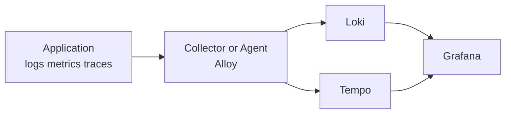
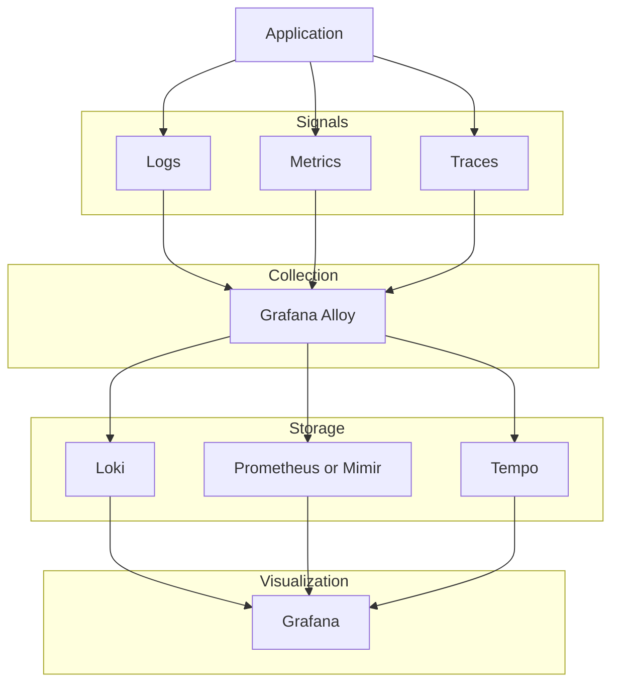
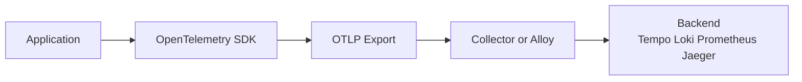
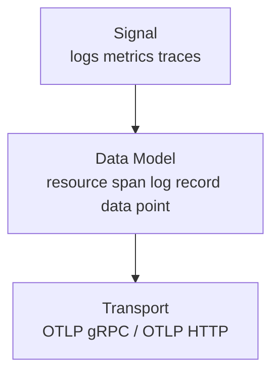
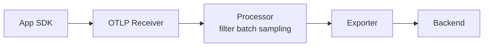
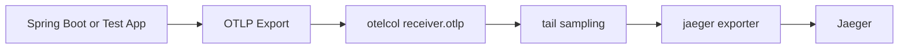

# Observability 스택을 보는 관점

---

> Observability를 처음 공부할 때 흔히 하는 실수는 "Grafana가 다 해주는 것"처럼 이해하는 것입니다. 하지만 실제 운영에서는 계층을 분리해야 문제가 보입니다.
>
> 1. **Signal Production**: 애플리케이션이 로그, 메트릭, 트레이스를 내보낸다.
> 2. **Collection and Processing**: 수집기가 데이터를 받아 배치, 필터링, 라우팅, 샘플링을 수행한다.
> 3. **Storage and Query**: 저장소가 신호를 장기 보관하고 쿼리할 수 있게 만든다.
> 4. **Visualization and Investigation**: UI가 탐색과 상관분석을 돕는다.



- **Grafana Alloy**: Alloy는 수집기이자 처리기입니다. 애플리케이션은 인프라에서 들어오는 데이터를 받아서 필요한 형태로 가공한 뒤, 적절한 저장소로 보냅니다.
- **Grafana Loki**: Loki는 로그 저장 및 쿼리 백엔드입니다. 로그 본문 전체를 검색 인덱스로 만드는 대신, 라벨을 중심으로 인덱싱하고 실제 로그를 chunk 형태로 저장합니다.
- **Grafana Tempo**: Tempo는 분산 트레이스 저장 및 조회 백엔드입니다. Span들이 모여 하나의 trace를 이루고, Tempo는 이 trace를 저장하고 관계를 조회할 수 있게 해줍니다.

## LGTM(Loki Grafana Tempo Mimir or Prometheus)




##  Log와 Trace는 어떻게 다른가

> 둘 다 "무슨 일이 일어났는지"를 남기지만, 기록 단위와 목적이 다릅니다.

**Log는 점이고, Trace는 점을 이은 선입니다.**

**Log**는 <u>특정 시점에 하나의 서비스에서 발생한 이벤트 기록</u>입니다. 

- `logger.info("주문 생성: orderId=42")` 같은 한 줄이 하나의 로그이고, 각 로그는 기본적으로 서로 독립적입니다. "무슨 일이 일어났는가"에 답합니다.

**Trace**는 <u>하나의 요청이 여러 서비스를 거치며 만든 전체 경로</u>입니다. 

- 사용자 요청이 API Gateway → 주문서비스 → 결제서비스 → DB를 지나갔다면, 이 여정 전체가 하나의 Trace입니다. "어디서 느리고, 어디서 실패했는가"에 답합니다.

|        | Log                  | Trace                                |
| ------ | -------------------- | ------------------------------------ |
| 단위   | 한 줄 (이벤트)       | 요청 전체 (여정)                     |
| 구조   | 타임스탬프 + 메시지  | 1 Trace = N Spans (Span은 작업 단위) |
| 연결성 | 기본적으로 독립      | traceId로 전체 연결                  |
| 질문   | "무슨 일이 일어났나" | "어디서 느리고, 어디서 실패했나"     |
| 저장소 | Loki                 | Tempo                                |

Spring Boot 3.x에서는 Micrometer Tracing이 로그에 traceId/spanId를 자동 주입합니다. 덕분에 로그 한 줄에서 traceId를 뽑아 Tempo에서 전체 흐름을 조회할 수 있고, 이것이 Grafana에서 "Logs to Traces" 상관분석이 가능한 이유입니다.

```
2026-03-14 10:00:00 INFO [order-service,traceId=abc123,spanId=def456] 주문 생성 시작
2026-03-14 10:00:00 INFO [payment-service,traceId=abc123,spanId=ghi789] 결제 처리 중
```

- 같은 `traceId=abc123`을 가진 로그끼리 모으면 트레이스가 되는 셈입니다.

# OTLP(OpenTelemetry Protocol)

---

> OTLP는 OpenTelemetry 신호를 표준화된 방식으로 내보내기 위한 계약입니다. 이 계약에는 다음 요소가 들어가있습니다.
>
> - 어떤 신호를 보내는가: logs, metrics, traces
> - 어떤 단위로 표현하는가: resource, span, log record, data point
> - 어떤 전송 방식으로 보내는가: `OTLP/gRPC`, `OTLP/HTTP`

OTLP가 없던 시절에는 벤더마다 에이전트/전용 프로토콜이 서로 달랐습니다. 이 경우 애플리케이션이 특정 백엔드에 강하게 묶입니다.

OTLP는 "로그/메트릭/트레이스를 아무 형식으로나 보내는 방법"이 아니라, **OpenTelemetry 데이터 모델을 collector가 이해할 수 있게 전달하는 방식**입니다.

## 왜 OTLP가 중요한가

OTLP가 없으면 애플리케이션은 보통 특정 backend나 벤더 에이전트에 직접 묶입니다. 예를 들면 이런 식입니다.

- Jaeger exporter 전용 설정
- Zipkin exporter 전용 설정
- 벤더 APM 전용 agent 설정

이 구조에서는 backend를 바꾸는 순간 애플리케이션 설정도 같이 흔들립니다.
반대로 OTLP를 쓰면 애플리케이션은 이렇게 생각할 수 있습니다.

> "나는 collector로 OTLP를 보낸다. 이후 라우팅과 저장은 수집기가 책임진다."

이 분리 덕분에 다음이 쉬워집니다.



1. 애플리케이션 설정 단순화
2. backend 교체 또는 추가
3. collector에서 샘플링, 필터링, 배치 적용
4. 여러 신호를 동일한 ingress 계층으로 통합


## OTLP 계약은 정확히 무엇을 포함하는가

OTLP를 이해할 때는 보통 3층으로 나누면 쉽습니다.




1. **Signal**
   - 무엇을 보내는가
   - `traces`, `metrics`, `logs`
2. **Data Model**
   - 어떤 단위로 표현하는가
   - 예: `Resource`, `Span`, `Log Record`, `Metric Data Point`
3. **Transport**
   - 어떤 프로토콜로 보내는가
   - `OTLP/gRPC`, `OTLP/HTTP`


## OTLP/gRPC와 OTLP/HTTP

OTLP는 주로 두 가지 전송 방식을 사용합니다.

| 방식        | 특징                                        | 자주 보는 포트 | 적합한 상황                  |
| ----------- | ------------------------------------------- | -------------- | ---------------------------- |
| `OTLP/gRPC` | 양방향 스트리밍과 효율적인 전송에 유리      | `4317`         | 서버 간 통신, collector 연동 |
| `OTLP/HTTP` | HTTP 기반이라 프록시나 브라우저 환경에 친숙 | `4318`         | 웹, 프록시 환경, 단순 연동   |

실무에서 중요한 점은 "무조건 gRPC가 더 좋다"가 아닙니다.
이미 있는 네트워크 정책, 프록시, 로드밸런서, 브라우저 제약에 따라 HTTP가 더 현실적일 수 있습니다.

현재 이 PoC의 `otel-collector-config.yaml`도 두 프로토콜을 모두 엽니다.

```yaml
receivers:
  otlp:
    protocols:
      grpc:
        endpoint: 0.0.0.0:4317
      http:
        endpoint: 0.0.0.0:4318
```

## OTLP 객체

### Resource

Resource는 텔레메트리가 "어디서 나왔는지"를 설명하는 메타데이터입니다. 예를 들면 다음과 같습니다.

- `service.name`
- `service.version`
- `deployment.environment`
- `host.name`

이 값들이 중요한 이유는, 로그와 트레이스를 나중에 상관분석할 때 단순히 본문만 봐서는 어느 서비스 데이터인지 모호해지기 때문입니다.

### Span

Span은 하나의 작업 단위입니다.
예를 들어 `service-a`가 HTTP 요청을 받고 `service-b`를 호출했다면, 각 단계마다 span이 생길 수 있습니다.

### Log Record

Log record는 로그 한 건입니다.
OpenTelemetry 로그는 단순 문자열보다 구조화된 필드와 resource 정보를 함께 들고 있다는 점이 중요합니다.


## Signal Flow를 collector 관점

> Signal Flow는 단순히 "앱에서 backend로 간다"가 아닙니다. 중간 collector는 다음 3단계를 담당합니다.

1. **Receive**
   - OTLP receiver가 데이터를 받는다.
2. **Process**
   - filter, batch, sampling, transform 같은 정책을 적용한다.
3. **Export**
   - 적절한 backend로 보낸다.



이 흐름을 이해하면 "OTLP는 collector ingress 계약"이라는 표현이 더 명확해집니다.

현재 PoC를 OTLP Signal Flow로 다시 읽으면 다음과 같습니다.



여기서 핵심은 backend가 Jaeger라는 사실보다, **중간에 collector가 있다는 점**입니다.

- 앱은 Jaeger 저장 방식 자체를 알 필요가 없다.
- 앱은 OTLP만 맞춰 보내면 된다.
- 샘플링 정책은 collector에서 바꾼다.

나중에 Alloy + Tempo 구조로 가더라도 이 사고방식은 그대로 유지됩니다.
