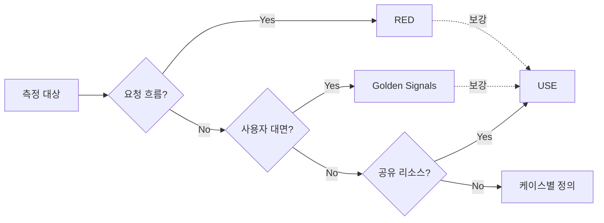

# 시그널 모델 — Golden Signals, RED, USE

---

> 모든 메트릭을 다 보면 노이즈만 늘어난다. 어떤 신호에 우선순위를 둘지 정해주는 표준 모델 세 가지를 비교한다.

LGTM 스택을 깔고 Prometheus가 수백 개 메트릭을 긁기 시작하면 곧 “지금 무엇을 봐야 하는가”라는 질문이 따라온다. CPU, 메모리, 큐 깊이, GC pause, p99 latency, 5xx 비율, 오토스케일러 상태… 모두 중요하지만 모두를 동시에 보는 사람은 없다. SRE 분야에는 이 우선순위 문제에 답하는 세 개의 표준 시그널 모델이 정착해 있다 — Google의 Four Golden Signals, Tom Wilkie의 RED, Brendan Gregg의 USE다. 본 문서는 세 모델의 정의·차이·적용 기준을 정리하고 TPS 프로젝트에 어떻게 매핑할지 PromQL 예제와 함께 본다.


## 1. 모니터링과 관측 — 시그널 모델이 필요한 이유

> 메트릭의 양이 아니라 질문에 답하는 능력이 중요하다.

“시스템이 잘 돌고 있는가”에 답하려면 어떤 메트릭을 봐야 하는가. 관측 가능성(observability) 분야에서는 미리 정의된 대시보드가 답할 수 있는 질문 외에도 새로운 가설을 던질 수 있어야 한다는 입장(Charity Majors / Honeycomb)과, 사용자 영향과 직결되는 소수의 시그널만 우선 보면 된다는 입장(Google SRE)이 공존한다. 두 입장은 대립이라기보다 단계의 차이에 가깝다. 운영 알람은 SRE식 “소수 시그널”이 어울리고, 디버깅은 관측 가능성식 “자유 질의”가 어울린다.

세 시그널 모델은 이 중 운영·알람 단계에서 “무엇부터 보면 80%가 해결되는가”에 답한다. 정답이 하나로 수렴하지 않은 이유는 측정 대상이 다르기 때문이다. 사용자 대면 서비스의 건강을 빠르게 보려면 Golden Signals, 마이크로서비스의 요청 흐름을 짚으려면 RED, 디스크/CPU 같은 리소스 병목을 잡으려면 USE — 같은 시스템에 셋이 동시에 붙는 일이 흔하다.


## 2. The Four Golden Signals — 사용자 관점

> Google SRE Book이 제시하는 “단 네 개만 측정한다면 이것”의 표준 답변.

SRE Book 6장은 이렇게 단언한다. *“If you can only measure four metrics of your user-facing system, focus on these four.”* 네 가지는 latency, traffic, errors, saturation이다.

**Latency** — 요청 처리에 걸린 시간. 책에서 명시적으로 강조하는 점은 **성공/실패 latency를 분리**해야 한다는 것이다. *“It's important to distinguish between the latency of successful requests and the latency of failed requests.”* HTTP 500이 빠르게 떨어진 것보다 “느리게 떨어진 500”이 시스템에 더 안 좋은 신호다 — “a slow error is even worse than a fast error.”

**Traffic** — 시스템에 가해지는 수요. 서비스 종류에 따라 단위가 달라진다. 웹은 RPS, 스트리밍은 네트워크 I/O, 스토리지는 transactions/retrievals per second. 단위를 비즈니스 의미로 잡는 게 핵심이다 — “초당 요청 수”가 “장바구니 진행 수”보다 알람용으로 좋을 때가 많다.

**Errors** — 실패율. 명시적 실패(HTTP 500), 암묵적 실패(200이지만 본문이 잘못됨), 정책적 실패(약속한 응답 시간을 넘김) 셋 다 포함한다. 이 세 번째가 자주 빠진다. SLO 100ms 약속에 200ms로 응답한 200 OK는 errors에 들어가야 한다는 뜻이다. 책은 이 부분에서 *“secondary (internal) protocols may be necessary to track partial failure modes”*라고 보강한다.

**Saturation** — 시스템이 얼마나 꽉 찼는가. 가장 제약이 심한 자원에 초점을 맞춘다. 핵심 통찰은 *“시스템은 100%에 도달하기 전에 이미 열화한다”* — 그래서 100%가 아닌 “utilization target”을 둬야 한다. p99 latency 상승이 saturation의 leading indicator로 자주 쓰인다.

책의 결론은 단호하다. *“If you measure all four golden signals and page a human when one signal is problematic (or, in the case of saturation, nearly problematic), your service will be at least decently covered by monitoring.”* 알람으로 직결되는 신호 셋(latency·traffic·errors)과 예측용 신호 하나(saturation)의 조합이 “겨우 쓸 만한 모니터링”의 하한선이라는 의미다.


## 3. RED Method — 요청 흐름 관점

> Tom Wilkie(Weaveworks/Grafana Labs 공동창업자)가 마이크로서비스용으로 정리한 단순화된 모델.

RED는 Rate, Errors, Duration의 약어다. 의도는 “마이크로서비스 한 개를 관찰할 때 무엇부터 보면 되는가”에 답하는 것이다. Golden Signals와 비교하면 traffic→Rate, errors→Errors, latency→Duration으로 거의 일대일이고 saturation이 빠져 있다. 이 누락은 의도된 것이다 — 요청 흐름 외부(리소스 사용)는 RED가 아니라 USE로 보고, 한 서비스에 RED만 붙여도 “잘 돌아가는가”는 답할 수 있다.

세 메트릭의 매력은 일관성이다. 어떤 마이크로서비스든 같은 세 패널의 대시보드를 가지면 운영자가 새 서비스에 적응하는 시간이 거의 0에 수렴한다. Wilkie는 이걸 “every service should have the same three Grafana panels”라고 표현했다. Grafana Labs가 운영하는 미터링 시스템들이 정확히 이 패턴을 따른다.

RED의 한계도 분명하다. 비-요청 흐름 시스템(배치 잡, 스케줄러, 데몬)에는 Rate/Duration이 자연스럽게 정의되지 않는다. 그런 곳에서는 USE 또는 Golden Signals가 더 적합하다.


## 4. USE Method — 리소스 관점

> Brendan Gregg가 시스템 성능 분석용으로 정리한 자원 중심 모델.

Gregg의 정의는 정확하다.

- **Utilization** — *“the average time that the resource was busy servicing work”* (자원이 일 처리에 사용된 시간 비율)
- **Saturation** — *“the degree to which the resource has extra work which it can't service, often queued”* (자원이 처리하지 못해 큐에 쌓인 잉여 일의 정도)
- **Errors** — *“the count of error events”* (에러 카운트)

여기서 중요한 차이가 드러난다. Golden Signals의 saturation은 “꽉 찬 정도”라는 모호한 정의지만, USE의 saturation은 **큐 길이**라는 명확한 측정 대상이 있다. 큐가 없는 자원이라면 USE의 saturation은 정의되지 않는다 — 이건 모델의 결함이 아니라 “이 자원에는 saturation 지표가 없다”라는 사실 표시다.

대상 자원의 예시는 CPU(소켓·코어·하이퍼스레드), 메모리, 네트워크 인터페이스, 스토리지(I/O와 용량), 컨트롤러와 인터커넥트다. Gregg는 분석 절차를 다음과 같이 정리한다.

1. 모든 시스템 자원을 식별한다 (functional block diagram 또는 표준 자원 목록).
2. 에러를 가장 먼저 확인한다 (가장 빠른 검증).
3. 각 자원의 utilization을 측정한다.
4. saturation 수준을 평가한다.
5. 결과를 해석한다 (utilization 100%는 병목, saturation은 어떤 값이든 조사 대상).
6. 측정 불가 항목을 unknowns로 기록한다.
7. 식별된 병목을 더 깊이 분석한다.

그의 표현에 따르면 이 절차는 *“5%의 노력으로 80%의 서버 문제를 해결한다.”* USE는 본질적으로 디버깅 도구이지만, 그 결과로 “리소스 saturation 알람”을 표준 운영 알람으로 끌어올리는 패턴이 일반적이다.


## 5. 세 모델의 결정 매트릭스

> 한 모델만 고르는 게 아니다 — 측정 대상에 따라 셋을 섞어 쓴다.



실전에서는 세 모델이 다음 자리에 들어간다.

- **마이크로서비스 API (executor, operator-api 같은 HTTP 서비스)** — RED가 우선. 모든 서비스가 같은 RED 대시보드를 갖는 것이 운영 비용을 가장 크게 줄인다.
- **사용자 대면 SaaS 전체** — Golden Signals. 비즈니스 SLO와 직결되며 saturation이 capacity planning과 연결된다.
- **공유 리소스 (DB, Kafka, Redis, 디스크, 네트워크)** — USE. 큐 길이와 utilization이 여기서만 명확히 정의된다.
- **배치 잡, 스케줄러, 데몬** — RED와 USE의 변형. Rate 대신 “runs per hour”, Duration 대신 “job latency”, USE의 utilization은 “스케줄 슬롯 점유율”.

한 시스템에서 셋이 모두 보이는 게 정상이다. 예를 들어 “executor의 outbox 발행”은 (1) RED(API 호출 비율·에러·지연), (2) USE(Kafka 컨슈머 lag, DB connection pool saturation), (3) Golden Signals(전체 outbox publish latency p99의 비즈니스 SLO 측면)을 동시에 갖는다.


## 6. TPS 프로젝트 적용 — 어디에 어떤 모델

> message-lib 기반 outbox + Kafka 흐름에 세 모델을 매핑한다.

| 위치 | 모델 | 핵심 메트릭 |
|------|------|-------------|
| `operator-api` HTTP 진입 | RED | request rate, 5xx error rate, request duration p99 |
| `executor-app` HTTP 진입 | RED | 동일 |
| Kafka producer (OutboxPoller) | RED + USE | publish rate, publish error rate, publish duration p99 + producer queue size |
| Kafka consumer (`@KafkaListener`) | RED + USE | consume rate, processing error rate, processing duration + consumer lag |
| Kafka 브로커 자체 | USE | broker disk utilization, partition leader saturation, controller errors |
| TB_TRB_OX_001 (DB outbox) | USE | row count(=backlog saturation), poll latency |
| 비즈니스 — “파이프라인 빌드 완료까지 시간” | Golden Signals | end-to-end latency p99, build success/failure rate, daily build traffic |

이 표의 해석은 단순하다. **요청 한 단위가 도는 곳에는 RED**, **자원 한 덩어리가 있는 곳에는 USE**, **사용자 약속이 걸린 곳에는 Golden Signals**.


## 7. PromQL 예제 — 모델별 대표 쿼리

> Prometheus와 OpenTelemetry semantic conventions가 정한 표준 메트릭 이름을 그대로 쓴다.

### 7.1 RED — operator-api HTTP 엔드포인트

```promql
# Rate (전체 RPS)
sum(rate(http_server_requests_seconds_count{application="operator-api"}[5m]))

# Errors (5xx 비율)
sum(rate(http_server_requests_seconds_count{application="operator-api", status=~"5.."}[5m]))
  /
sum(rate(http_server_requests_seconds_count{application="operator-api"}[5m]))

# Duration p99
histogram_quantile(0.99,
  sum by (le) (
    rate(http_server_requests_seconds_bucket{application="operator-api"}[5m])
  )
)
```

`http_server_requests_seconds_*`는 Spring Boot Actuator + Micrometer가 노출하는 표준 메트릭이다. p99는 반드시 **histogram에서 quantile 계산**으로 뽑아야 한다. average latency만 보면 long-tail을 놓친다 — 이는 Dean & Barroso의 *“The Tail at Scale”*(CACM 2013)이 지적한 “fan-out 시스템에서 평균은 거짓말한다”와 직결된다.

### 7.2 USE — Kafka consumer lag

```promql
# Saturation: 컨슈머 그룹별 lag 합
sum by (consumergroup) (
  kafka_consumer_lag_records{consumergroup=~"executor-.*|operator-.*"}
)

# Utilization: 컨슈머 처리 비율 (consume rate / publish rate)
sum(rate(kafka_consumer_records_consumed_total[5m])) by (topic)
  /
sum(rate(kafka_topic_partition_current_offset[5m])) by (topic)
```

Lag이 곧 “큐에 쌓인 잉여 일”이라 USE의 saturation 정의에 정확히 들어간다. 이 값에 알람을 걸 때는 절대값이 아닌 “SLO 윈도우 안에서의 burn rate”로 봐야 한다(다음 문서 [01-04](01-04.SLO와%20알림%20—%20Error%20Budget,%20Burn%20Rate.md) §4).

### 7.3 Golden Signals — 비즈니스 latency

```promql
# Latency (성공/실패 분리)
histogram_quantile(0.99,
  sum by (le, outcome) (
    rate(pipeline_build_duration_seconds_bucket[5m])
  )
)

# Saturation 대용 (DB connection pool 점유율)
hikari_connections_active / hikari_connections_max
```

Golden Signals 적용 시 가장 자주 빠지는 게 **success/failure latency 분리**다. `outcome` 라벨로 나누지 않으면 “느린 실패”가 평균 latency를 끌어올려도 발견이 늦는다.


## 8. 자주 빠지는 함정

> 시그널 모델을 쓰면서도 잘못된 결론에 도달하는 패턴 셋.

**평균 latency만 본다.** Histogram 기반 p99/p99.9가 없으면 long-tail을 못 본다. Dean & Barroso는 fan-out 100인 시스템에서 백엔드 한 곳의 p99=1s가 전체 응답의 63%를 1초 이상으로 만든다고 정량화했다. RED의 Duration도 반드시 분포로 본다.

**Saturation을 utilization과 혼동한다.** USE는 둘을 분리해 정의했고 의미가 다르다. CPU utilization 100%는 “일을 빠르게 처리 중”일 수도, “병목으로 큐가 쌓이는 중”일 수도 있다. 큐가 있는 자원이면 saturation을 따로 측정해야 한다.

**Cardinality 폭발.** label에 user_id, request_id 같은 고-cardinality 값을 넣으면 Prometheus가 OOM된다. RED의 `status` label은 카테고리(2xx/4xx/5xx)로 묶어야 한다. 자세한 cardinality 관리는 [02-05.Grafana Mimir.md](../02_LGTMStack/02-05.Grafana%20Mimir.md)와 [04-01.관측 트러블슈팅.md](../04_Troubleshooting/04-01.관측%20트러블슈팅.md)에 나뉘어 있다.

**시그널만 보고 알람 임계를 정한다.** “p99 > 500ms이면 알람” 같은 정적 임계는 트래픽이 변하면 깨진다. SLO 기반 burn rate 알람으로 가는 길은 다음 문서 [01-04.SLO와 알림](01-04.SLO와%20알림%20—%20Error%20Budget,%20Burn%20Rate.md)에 정리했다.


## 9. 정리 — 어떤 모델을 언제 꺼낼 것인가

> 모델을 외우는 것보다 적용 자리를 외우는 게 운영에 직접적이다.

운영 알람을 처음 잡을 때는 RED로 시작한다. 마이크로서비스 한 개당 세 패널이면 새 서비스가 추가될 때마다 운영 비용이 거의 늘지 않는다. 비즈니스 SLO를 약속한 사용자 흐름이 있으면 그 위에 Golden Signals를 한 겹 더 얹는다 — RED가 “서비스의 건강”이라면 Golden Signals는 “사용자의 행복”이다. 자원 병목을 추적할 때는 USE를 디버깅 도구로 쓰되, 의미 있는 saturation 지표(Kafka lag, DB connection pool, 디스크 큐)는 표준 운영 알람으로 승격시킨다.

어떤 모델을 쓰든 시그널 자체는 “질문 시작점”에 불과하다. p99가 튀었다는 사실보다 **왜 튀었는가**를 답하려면 trace와 log가 같이 필요하다. 그 연결은 [03-06. 실전 프로젝트 5(Outbox E2E 트레이스 연결)](03-06.실전%20프로젝트%205(Outbox%20E2E%20트레이스%20연결).md)와 [05-01. Tempo 분산 트레이싱 시각화](../03_Project/03-08.Tempo%20분산%20트레이싱%20시각화.md)에 정리했다. 시그널이 “언제”를 알려주면 trace가 “어디서·왜”를 알려준다.


## 관련 문서

- [01-01.모니터링.md](01-01.모니터링.md) — 본 디렉토리의 모니터링 인프라 구성 (Alloy/Loki/Tempo/Prometheus 배치)
- [01-02.관측 기술스택.md](01-02.관측%20기술스택.md) — LGTM 스택과 OTLP 객체 모델
- [01-04.SLO와 알림 — Error Budget, Burn Rate.md](01-04.SLO와%20알림%20—%20Error%20Budget,%20Burn%20Rate.md) — 본 문서의 시그널을 SLO와 알람으로 연결
- [02-05.Grafana Mimir.md](../02_LGTMStack/02-05.Grafana%20Mimir.md) — 메트릭 cardinality 관리
- [03-07.실전 프로젝트 5(Outbox E2E 트레이스 연결).md](03-06.실전%20프로젝트%205(Outbox%20E2E%20트레이스%20연결).md) — 시그널이 가리키는 사건의 trace 추적
- [04-01.관측 트러블슈팅.md](../04_Troubleshooting/04-01.관측%20트러블슈팅.md) — 시그널이 안 보이거나 잘못 보일 때 절차

## 참고 자료

- Beyer, Jones, Petoff, Murphy. *Site Reliability Engineering* (O'Reilly). Ch.6 “Monitoring Distributed Systems.” https://sre.google/sre-book/monitoring-distributed-systems/
- Brendan Gregg. *The USE Method*. https://www.brendangregg.com/usemethod.html
- Tom Wilkie. *The RED Method: How to Instrument Your Services* (Grafana Labs / Weaveworks). https://thenewstack.io/monitoring-microservices-red-method/
- Jeffrey Dean, Luiz André Barroso. *The Tail at Scale*. CACM Vol.56 No.2 (2013). https://research.google/pubs/the-tail-at-scale/
- Prometheus best practices — Histograms and summaries. https://prometheus.io/docs/practices/histograms/
- OpenTelemetry Semantic Conventions. https://opentelemetry.io/docs/specs/semconv/
