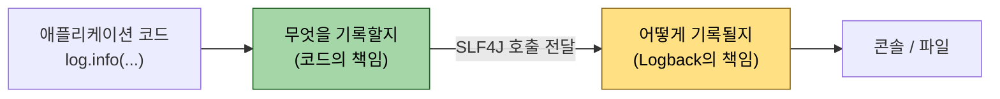
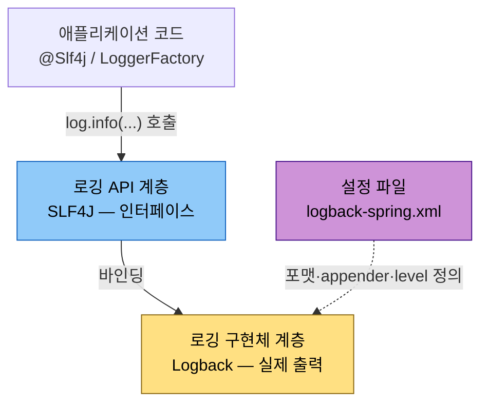
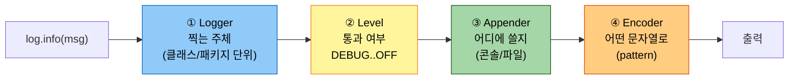
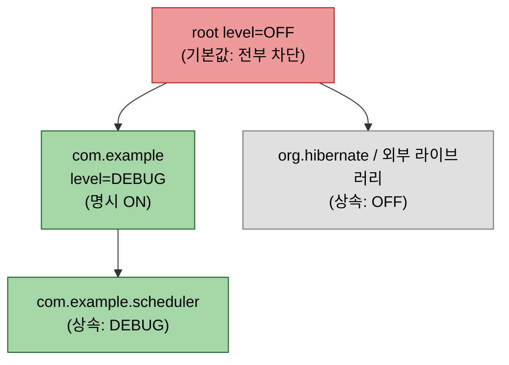
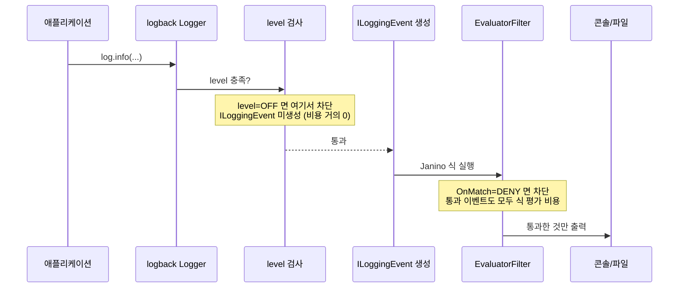
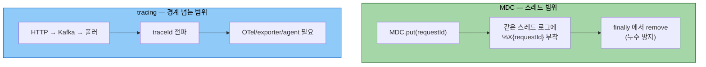
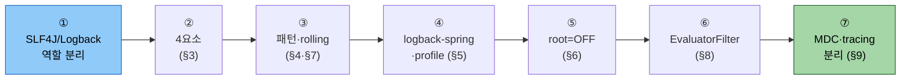

# Logback 기초

---

> 이 문서를 읽고 나면, `logback-spring.xml`을 열어 appender·encoder·pattern·filter가 각각 무슨 결정을 하는지 짚을 수 있고, root=OFF 전략이 왜 특정 logger만 보이게 하는지 설명할 수 있으며, EvaluatorFilter 식 한 줄로 특정 스레드의 로그만 외과적으로 차단할 수 있습니다.

코드는 "무엇을 기록할지"를 말하고, Logback은 "어떻게 기록될지"를 결정합니다. 이 경계를 모르면 logger 호출법은 알아도 왜 어떤 logger만 보이고 어떤 클래스는 `c.e...`처럼 축약되는지 설명하지 못합니다. 

로그는 단순 출력이 아니라 장애를 좁히는 운영 인터페이스이자 코드 변경의 부작용을 가장 먼저 드러내는 관측 신호이므로, Logback 설정을 읽는 능력은 곧 운영 능력입니다.


## 1. Logback을 한 문장으로 — 로깅 백엔드의 자리

> Logback은 로그를 *어떤 형식으로·어디에·어떤 조건으로* 출력할지 결정하는 로깅 백엔드입니다. 코드의 "무엇을 기록할지"와 분업하는 "어떻게 기록될지" 쪽이 전부 Logback의 영역입니다.

Logback의 역할은 둘로 나뉩니다. 애플리케이션 코드는 SLF4J API로 `log.info(...)`를 호출하고, Logback은 그 호출을 콘솔 출력·파일 저장·패턴 포맷팅·레벨 필터링으로 실행합니다.



- 이 분업을 잡아두면 뒤에 나오는 appender·encoder·filter가 모두 "어떻게" 쪽 결정이라는 한 묶음으로 보입니다.


## 2. SLF4J와 Logback의 관계 — API와 구현체

> "나는 Logback을 쓰는가, SLF4J를 쓰는가"의 답은 둘 다입니다. 둘은 경쟁이 아니라 *API(인터페이스)와 구현체(백엔드)* 로 층이 갈립니다.

초보자가 가장 자주 헷갈리는 지점이지만, 세 계층으로 그리면 한눈에 정리됩니다.



| 계층 | 역할 | 예시 |
|------|------|------|
| 로깅 API | 코드가 호출하는 인터페이스 | SLF4J, `LoggerFactory`, `@Slf4j` |
| 로깅 구현체 | 실제 출력과 설정 담당 | Logback |
| 설정 파일 | 포맷·appender·rolling·level 정의 | `logback-spring.xml` |

- 애플리케이션이 SLF4J에만 의존하므로 나중에 백엔드를 교체할 수 있습니다. 
- 다만 Spring Boot 서비스는 Logback을 사실상 표준으로 채택하고 있어, 운영 관점에서는 Logback 설정 읽기가 필요합니다.


## 3. 핵심 구성요소 4개 — Logger / Level / Appender / Encoder

> 한 줄 로그가 출력되기까지 거치는 네 관문이 Logger·Level·Appender·Encoder입니다. 나머지 설정은 전부 이 넷의 조합입니다.

네 요소가 로그 한 줄을 처리하는 순서를 먼저 그림으로 잡습니다.



### 3.1 Logger

Logger는 로그를 찍는 주체이며, 보통 클래스 단위로 하나씩 생기고 이름은 패키지 경로를 따릅니다.

```java
package com.example.scheduler;

@Slf4j
public class DispatchScheduler {
    // logger 이름 = "com.example.scheduler.DispatchScheduler"
}
```

설정에서 `<logger name="com.example">`를 선언하면 그 하위 패키지 전체에 규칙이 적용됩니다. 이것이 logger hierarchy이며, 상위 이름 하나로 하위 전체 level을 다루는 근거입니다.

### 3.2 Level

레벨은 단순 "심각도"가 아니라 "운영 의미"입니다. 자주 발생한다고 ERROR를 INFO로 낮추면 진짜 실패가 묻히고, 알람 가치가 없는데 ERROR를 남발하면 알람이 신뢰를 잃습니다.

| 레벨 | 운영 의미 |
|------|----------|
| `DEBUG` | 개발 중 내부 상태 확인 |
| `INFO` | 정상적인 주요 상태 전이, 마일스톤 |
| `WARN` | 회복 가능한 실패 |
| `ERROR` | 운영 개입이 필요한 실패 |
| `OFF` | 출력 금지 |

### 3.3 Appender

Appender는 로그를 어디에 쓸지를 결정합니다. Spring Boot API 서비스는 콘솔(STDOUT)과 롤링 파일을 함께 쓰는 조합이 많습니다.

| Appender | 출력 대상 |
|----------|----------|
| `ConsoleAppender` | 콘솔 |
| `RollingFileAppender` | 롤링 파일 (§7) |
| `SocketAppender` · `AsyncAppender` | 원격 전송 · 비동기 |

컨테이너 환경에서는 콘솔로 내보내 수집기가 긁어가게 하고, 디스크 보존이 필요하면 롤링 파일을 추가합니다.

### 3.4 Encoder / Pattern

Encoder는 로그 한 줄을 문자열로 바꾸며, 그 모양을 pattern이 정합니다.

```xml
<encoder>
    <!-- pattern 이 한 줄 로그의 외형 계약 -->
    <pattern>%d{HH:mm:ss.SSS} %-5level [%thread] %logger{36} - %msg%n</pattern>
</encoder>
```

같은 로그라도 pattern을 바꾸면 출력 형태가 완전히 달라지므로, pattern은 "로그의 외형 계약"입니다.


## 4. 패턴 문자열 읽는 법

> pattern은 변환어(conversion word)의 조합입니다. 토큰 7개만 외우면 대부분의 실무 로그 한 줄을 읽고 설계할 수 있습니다.

| 토큰 | 의미 |
|------|------|
| `%d{...}` | 시간 |
| `%level` | 로그 레벨 |
| `%thread` | 스레드 이름 |
| `%logger{36}` | logger 이름, 36자 축약 |
| `%msg` | 실제 메시지 |
| `%n` | 줄바꿈 |
| `%X{key}` | MDC 값 |

querydsl-practice의 `logback-spring.xml` 실측 `CONSOLE_PATTERN`이 어떤 로그를 만드는지 토큰별로 분해합니다.

```xml
<property name="CONSOLE_PATTERN"
          value="%d{HH:mm:ss.SSS} %-5level [%thread] %logger{36} - %msg%n"/>
```

위 패턴은 다음 한 줄을 만듭니다.

```text
17:22:41.318 INFO  [scheduling-1] c.e.scheduler.DispatchScheduler - candidates=12, approved=7
```

`c.e.scheduler.`처럼 보이는 이유는 `%logger{36}`이 logger 이름을 36자 안으로 축약하기 때문입니다. 긴 패키지명이 많은 서비스에서는 한 줄 길이가 안정되는 대신 어떤 클래스인지 한눈에 안 들어옵니다. `%logger{0}`이나 `%logger`로 바꾸면 축약이 풀려 전체 이름이 나옵니다.


## 5. Spring Boot에서 logback-spring.xml을 쓰는 이유

> 기본 파일명 `logback.xml` 대신 `logback-spring.xml`을 쓰는 이유는 Spring 확장 태그(`<springProperty>`·`<springProfile>`)를 쓸 수 있기 때문입니다.

querydsl-practice 실측의 두 확장 태그를 봅니다.

```xml
<!-- Spring Environment 값(application.yml)을 Logback 변수로 끌어옴 -->
<springProperty name="APP_NAME" source="spring.application.name" defaultValue="querydsl-practice"/>
<springProperty name="ROOT_LOG_LEVEL" source="logging.level.root" defaultValue="INFO"/>
```

```xml
<!-- 활성 프로파일에 따라 appender/level 분기 -->
<springProfile name="local">
    <!-- local 에서만 적용할 설정 -->
</springProfile>
```

| 태그 | 역할 | 일반 logback.xml 로는 |
|------|------|----------------------|
| `<springProperty>` | `application.yml` 값을 변수로 주입 | 부팅 타이밍 문제로 불안정 |
| `<springProfile>` | 프로파일별 appender/level 분기 | 불가능 (Spring 확장) |

`logback-spring.xml`은 Spring이 Environment를 준비한 뒤 읽으므로, 로컬과 비로컬에서 출력 전략을 다르게 가져갈 때 더 적합합니다.


## 6. root logger와 package logger — level 상속과 root=OFF 전략

> logger는 상위에서 하위로 level을 상속합니다. root를 OFF로 두고 필요한 logger만 켜는 전략은 강력하지만 보수적입니다.

```xml
<logger name="com.example" level="DEBUG" />

<root level="OFF">
    <appender-ref ref="STDOUT" />
</root>
```

이 설정의 의미를 상속 트리로 보면, root=OFF가 기본값을 모두 끄고 명시적으로 켠 `com.example`만 살아남는 구조입니다.



| 측면 | 장점 | 단점 |
|------|------|------|
| 외부 라이브러리 로그 | 과도하게 안 쏟아짐 | 필요한 logger 깜빡 누락 시 안 보임 |
| 우리 코드 로그 | 통제하기 쉬움 | "왜 안 찍히지?" 혼란 가능 |
| 장애 대응 | logger 범위를 의도적으로 좁히기 좋음 | 설정 이해 부족 시 역효과 |

그래서 root=OFF 전략에는 프레임워크 logger들을 별도로 선언하는 패턴이 보통 같이 붙습니다.


## 7. RollingFileAppender — 운영 파일 로그 수명 관리

> 운영 파일 로그는 무한히 커지면 안 되므로 rolling policy로 날짜·크기 기준 분할과 보존 한도를 건다.

```xml
<appender name="ROLLING" class="ch.qos.logback.core.rolling.RollingFileAppender">
    <file>logs/application.log</file>
    <rollingPolicy class="ch.qos.logback.core.rolling.TimeBasedRollingPolicy">
        <!-- 날짜 + %i 인덱스로 분할 -->
        <fileNamePattern>logs/application.%d{yyyy-MM-dd}.%i.log</fileNamePattern>
        <maxFileSize>100MB</maxFileSize>   <!-- 하루 안에서도 100MB 넘으면 분할 -->
        <maxHistory>30</maxHistory>        <!-- 30일 보존 -->
        <totalSizeCap>3GB</totalSizeCap>   <!-- 전체 누적 상한 -->
    </rollingPolicy>
    <encoder>
        <pattern>${CONSOLE_PATTERN}</pattern>
    </encoder>
</appender>
```

| 옵션 | 트리거 |
|------|--------|
| `%d{yyyy-MM-dd}` | 날짜가 바뀌면 새 파일 |
| `maxFileSize` | 하루 안에서도 크기 초과 시 `%i` 증가 |
| `maxHistory` | 보존 일수 초과분 자동 삭제 |
| `totalSizeCap` | 전체 누적 용량 상한 |

이 구성이 필요한 이유는 디스크 폭주 방지, 로그 수집기(Filebeat·Fluent Bit)와의 궁합 유지, 장애 시 특정 날짜 로그 추적 세 가지입니다.


## 8. EvaluatorFilter — 조건식으로 특정 로그 외과적 차단

> logger level이 "logger 이름 단위 전부 끄기"라면, EvaluatorFilter는 "조건식으로 일부만 골라 끄기"입니다. `JaninoEventEvaluator`가 컴파일한 Java 식이 매 이벤트마다 통과·차단을 결정합니다.

logback이 로그 한 건을 처리할 때 level 검사와 filter 평가가 *어느 단계*에서 일어나는지 보면, level OFF와 EvaluatorFilter의 차이가 명확해집니다.



다음은 querydsl-practice의 `logback-spring.xml` 실측입니다. `onion-poller-` 스레드의 SQL 관련 로그만 차단하고 다른 스레드의 SQL 디버깅은 통과시킵니다.

```xml
<appender name="CONSOLE" class="ch.qos.logback.core.ConsoleAppender">
    <filter class="ch.qos.logback.core.filter.EvaluatorFilter">
        <evaluator class="ch.qos.logback.classic.boolex.JaninoEventEvaluator">
            <expression>
                return event.getThreadName() != null
                       &amp;&amp; event.getThreadName().startsWith("onion-poller-")
                       &amp;&amp; (logger.startsWith("log4jdbc.")
                           || logger.startsWith("jdbc.")
                           || logger.equals("org.hibernate.SQL"));
            </expression>
        </evaluator>
        <OnMismatch>NEUTRAL</OnMismatch>
        <OnMatch>DENY</OnMatch>
    </filter>
    <encoder>
        <pattern>${CONSOLE_PATTERN}</pattern>
    </encoder>
</appender>
```

식을 한 줄씩 분해합니다.

| 식 조각 | 의미 |
|---------|------|
| `event.getThreadName() != null` | null 체크. Janino가 `thread` 변수를 자동 주입하지 않아 메서드 호출로 우회 |
| `.startsWith("onion-poller-")` | 폴러 스레드 풀 이름 prefix 매칭 |
| `logger.startsWith("log4jdbc.")` 외 | SQL 관련 logger 세 종류 매칭 |
| `OnMatch=DENY / OnMismatch=NEUTRAL` | 조건 만족 시 차단, 아니면 다음 필터로 |

`thread`를 변수처럼 직접 쓰면 컴파일 에러로 logback 자체가 안 떠 애플리케이션 기동이 실패하므로, 식을 바꾼 뒤에는 로컬 부팅 1회 검증이 필수입니다.

`OnMatch`/`OnMismatch`가 받는 값과 Janino 자동 주입 변수를 정리합니다.

| 필터 결과 값 | 동작 |
|-------------|------|
| `ACCEPT` | 무조건 출력 (뒤 필터 무시) |
| `DENY` | 무조건 차단 |
| `NEUTRAL` | 다음 필터로 위임 |

Janino가 자동 주입하는 변수는 `event`·`level`·`logger`·`message`·`formattedMessage`·`throwable`·`marker`·`mdc`·`timeStamp`입니다. 이 목록에 없는 thread·host·pid 등은 모두 `event.getXxx()` 메서드로 꺼냅니다.

EvaluatorFilter를 JDBC wrap 로그(log4jdbc) 폭주 제어에 본격 적용하는 결정 매트릭스와 비용 정량화는 [04-01 §4.4](../../05_data/jdbc/04-01.JDBC%20드라이버%20wrap%20로깅의%20운영%20비용.md)과 [04-02 §6](../../05_data/jdbc/04-02.log4jdbc%20로그%20제어%20베스트%20프랙티스.md)에서 다룹니다.


## 9. MDC와 tracing의 구분

> 둘 다 "로그에 문맥을 붙인다"는 점은 같지만, MDC는 *단일 스레드* 범위이고 tracing은 *서비스 경계를 넘는* 범위입니다. 경계를 넘는지가 선택 기준입니다.



### 9.1 MDC

MDC(Mapped Diagnostic Context)는 현재 스레드의 로그 문맥에 값을 붙이는 방식입니다.

```java
MDC.put("requestId", requestId);
try {
    log.info("Starting request processing");
    // ...
} finally {
    MDC.clear();   // 스레드 풀 재사용 시 키가 다른 작업에 따라붙는 누수 방지
}
```

패턴에서는 `%X{requestId}`로 꺼냅니다. 장점은 간단하고 즉시 효과가 있다는 점, 단점은 스레드·비동기 경계에서 끊기거나 누수될 위험과 도메인 식별자가 로깅 설정에 결합된다는 점입니다.

### 9.2 tracing

tracing은 request/span 단위 추적 컨텍스트를 별도 시스템(OpenTelemetry 등)으로 관리합니다. HTTP·Kafka·폴러처럼 경계를 넘어도 trace를 이어갈 수 있다는 것이 장점이고, provider·exporter·agent 배포 구성이 필요하다는 것이 단점입니다.

| 구분 | MDC | tracing |
|------|-----|---------|
| 범위 | 단일 스레드 | 서비스 경계 넘음 |
| 설정 비용 | `put`/`remove` 한 쌍 | agent·exporter·collector |
| 전파 | 스레드 경계서 끊김 | 경계 넘어 이어짐 |
| 적합 | 단일 흐름 식별자 | 분산 흐름 추적 |

판단 기준은 경계를 넘는지 여부입니다. 단일 스레드 안 식별자면 MDC, 서비스 경계를 넘는 흐름이면 tracing입니다. tracing 자체의 도입·전파 메커니즘은 [01-02.관측 기술스택](01-02.관측%20기술스택.md)과 03_Project 시리즈에서 다룹니다.


## 10. 권장 학습 순서

> 이 순서를 건너뛰고 바로 tracing·샘플링으로 들어가면 설정의 본질보다 기법만 남기 쉽습니다.



중요한 것은 문법 암기가 아니라 "이 설정이 왜 이렇게 존재하는지"를 설명할 수 있는 상태입니다. 그 수준에 도달하면 새 서비스의 로그 정책도 더 일관되고 덜 임기응변적으로 설계할 수 있습니다.


## 관련 문서

- [관측 기술스택](01-02.관측%20기술스택.md) — 로그·메트릭·트레이스 세 신호의 생산·수집·저장·시각화 4단계, Logback이 첫 신호 생산 계층
- [JDBC 드라이버 wrap 로깅의 운영 비용](../../05_data/jdbc/04-01.JDBC%20드라이버%20wrap%20로깅의%20운영%20비용.md) — §4.4가 본 문서 §8 EvaluatorFilter를 wrap 로그 차단에 적용하는 심화
- [log4jdbc 로그 제어 베스트 프랙티스](../../05_data/jdbc/04-02.log4jdbc%20로그%20제어%20베스트%20프랙티스.md) — EvaluatorFilter 4패턴·샘플링 3패턴·비용 정량화

## 참고 자료

- [Logback Manual](https://logback.qos.ch/manual/) — 공식 매뉴얼 (configuration·layouts·filters·appenders)
- [Spring Boot Logging](https://docs.spring.io/spring-boot/reference/features/logging.html) — `logback-spring.xml`·springProfile·springProperty
