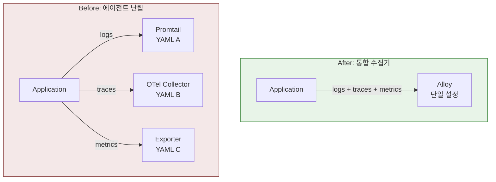
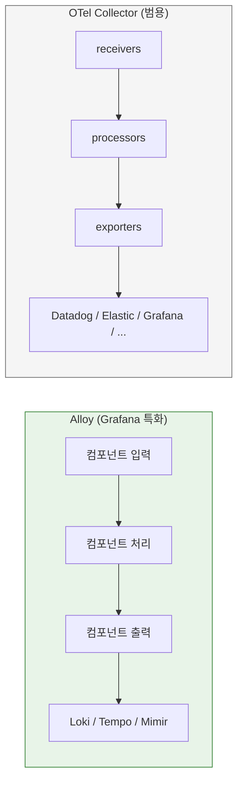
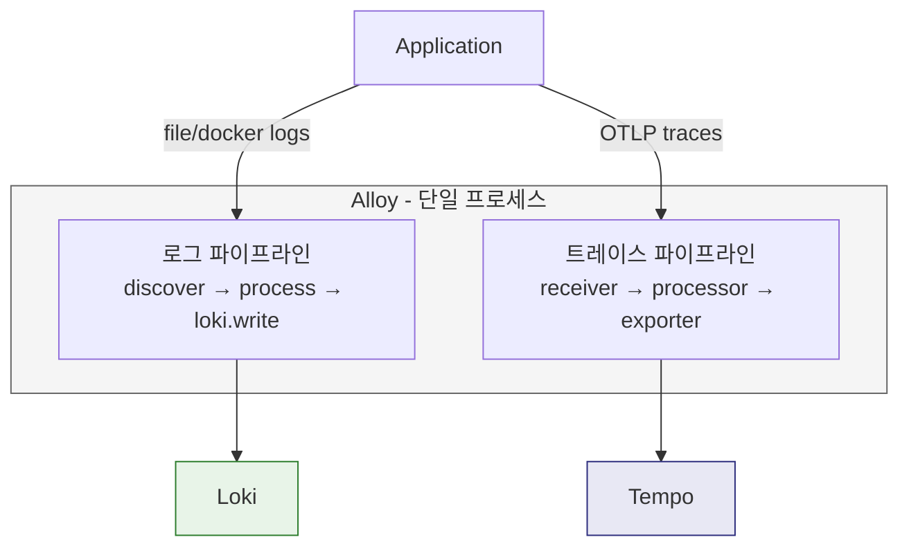
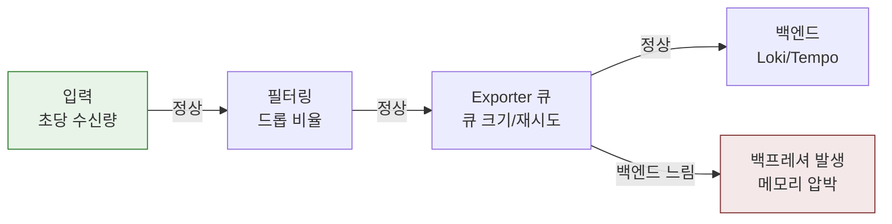
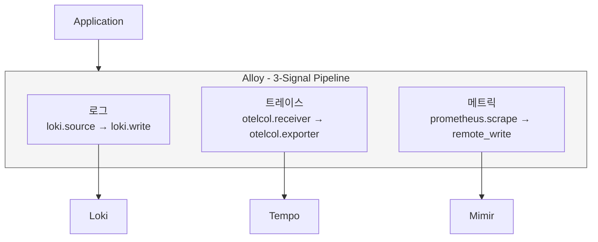

# Grafana Alloy
---
> Grafana Alloy는 OpenTelemetry Collector 기반의 통합 Telemetry 수집기다. 로그, 메트릭, 트레이스를 하나의 에이전트에서 받고 처리해서 Loki, Tempo, Prometheus/Mimir 같은 저장소로 보낼 수 있다.
>
> 핵심은 "Grafana 생태계용 별도 전용 에이전트"라기보다, **OTel Collector 철학 위에 Grafana 컴포넌트 모델을 얹은 수집기**라는 점이다.

과거에는 목적별 에이전트가 분리되는 경우가 많았다. 이 방식은 Agent 개수가 계속 늘어나고, 설정 방식도 달라 운영 복잡도가 올라간다:

- **로그 수집**: Promtail
- **메트릭 수집**: Prometheus Agent 또는 별도 exporter
- **트레이스 수집**: OTel Collector 또는 전용 agent

Alloy는 이러한 문제를 줄이기 위해 "**하나의 프로세스로 모든 신호를 수집하는 통합 수집기**"로서 Grafana 생태계에 등장했다.



## Alloy와 OTel Collector의 관계

> "OpenTelemetry Collector"가 범용 수집기라면, Alloy는 Grafana 스택 친화적으로 운영하기 좋은 통합 수집기다.

### 공통점

둘 다 동일한 3단계 파이프라인 모델을 따른다:

1. **Receive** — 데이터 소스에서 신호를 받는다 (OTLP, file, scrape 등)
2. **Process** — 필터링, 배치, 변환, 라벨링을 수행한다
3. **Export** — 백엔드로 최종 전송한다

- OTLP 수신과 export 개념을 공유한다.
- receiver, processor, exporter라는 사고방식이 같다.
- batching, filtering, transformation 같은 파이프라인 구성이 가능하다.

### 차이점

| 항목            | OTel Collector                             | Alloy                                             |
| --------------- | ------------------------------------------ | ------------------------------------------------- |
| 설정 형식       | YAML (receivers/processors/exporters 섹션) | HCL 유사 문법 (컴포넌트 그래프)                   |
| 파이프라인 연결 | `service.pipelines`에서 이름으로 연결      | 컴포넌트 간 `.output`/`.receiver` 참조로 연결     |
| 신호 범위       | 범용 (모든 백엔드)                         | Grafana 스택 최적화 (Loki, Tempo, Mimir)          |
| 로그 수집       | `filelog` receiver 등                      | `loki.source.*` + Promtail 마이그레이션 경로      |
| 디버깅          | `zpages`, logging exporter                 | 내장 UI (`localhost:12345`), 컴포넌트 상태 시각화 |



## 컴포넌트 그래프(Alloy 설정 읽는 법)

> Alloy 설정의 가장 큰 특징은 컴포넌트 그래프 모델이다. 설정이 순차적인 목록이 아니라, 컴포넌트 간 데이터가 흐르는 방향 그래프로 구성된다.

기본 문법과 Docker 로그 수집기 예시는 다음과 같다:

```bash
# 기본 문법
component.type "name" {
  key = value
}

# Docker 로그 수집기
discovery.docker "containers" {           # discovery.docker: 컴포넌트 종류, containers: 인스턴스 이름
  host = "unix:///var/run/docker.sock"    # host: 설정값
}
```

### 컴포넌트 간 연결

컴포넌트는 다른 컴포넌트의 출력을 참조해서 연결된다.

```bash
discovery.docker "containers" { ... }

discovery.relabel "filter" {
  targets = discovery.docker.containers.targets  # 앞 컴포넌트의 출력 참조
  rule { ... }
}

loki.source.docker "logs" {
  targets = discovery.relabel.filter.output
  forward_to = [loki.write.default.receiver]
}
```


이 연결 방식이 중요한 이유는 데이터 흐름이 설정 파일에 명시적으로 드러나기 때문이다. OTel Collector의 YAML에서는 `service.pipeline` 섹션에서 이름으로 연결하므로 흐름을 한눈에 파악하기 어렵지만, Alloy에서는 컴포넌트 A의 출력이 컴포넌트 B의 입력으로 직접 연결되어 흐름 파악이 쉽다.

## 파이프라인 예시(로그/트레이스)

Alloy의 4단계 책임(Discover → Process → Route → Export)이 실제 설정에서 어떻게 나타나는지 2가지 파이프라인으로 확인한다.

### 로그 파이프라인

Docker 컨테이너 로그를 Loki로 보내는 전형적인 흐름이다.

| 단계     | 컴포넌트                             | 역할                                    |
| -------- | ------------------------------------ | --------------------------------------- |
| Discover | `discovery.docker`                   | 실행 중인 컨테이너 목록 탐색            |
| Process  | `discovery.relabel` → `loki.process` | 대상 필터링, 라벨 정리, 멀티라인 합치기 |
| Route    | `loki.source.docker`                 | 로그를 읽어서 다음 단계로 전달          |
| Export   | `loki.write`                         | Loki HTTP endpoint로 최종 전송          |

핵심은 Alloy가 "**로그를 그대로 복사해서 보내는 도구**"가 아니라는 점이다. 대상 탐색, 라벨 정리, 멀티라인 합치기, 불필요한 로그 드롭까지 수집 시점에 처리할 수 있으므로, 저장소에 도달하는 데이터의 품질과 비용을 수집 계층에서 통제할 수 있다.

### 트레이스 파이프라인

애플리케이션이 OTLP로 내보낸 트레이스를 Tempo로 보내는 흐름이다.

| 단계    | 컴포넌트                                               | 역할                        |
| ------- | ------------------------------------------------------ | --------------------------- |
| Receive | `otelcol.receiver.otlp`                                | gRPC/HTTP로 OTLP span 수신  |
| Process | `otelcol.processor.batch` → `otelcol.processor.filter` | 배치 처리, 노이즈 span 제거 |
| Export  | `otelcol.exporter.otlphttp`                            | Tempo로 최종 전송           |



## Promtail과의 차이점

> Alloy를 Promtail 후속판 정도로 이해하면 범위를 너무 좁게 보는 것이다. Alloy는 Grafana 스택 전체에 모든 신호를 보내는 통합 수집기다.

| 항목          | Promtail                            | Alloy                           |
| ------------- | ----------------------------------- | ------------------------------- |
| 수집 대상     | 로그만                              | 로그, 메트릭, 트레이스          |
| 연결 백엔드   | Loki 전용                           | Loki + Tempo + Mimir + 기타     |
| 설정 모델     | 로그 파이프라인 중심 (YAML)         | 컴포넌트 그래프 (HCL 유사)      |
| 프로젝트 상태 | 유지보수 모드 (신규 기능 추가 중단) | 현재 표준 경로 (활발히 개발 중) |

## 운영 관점에서 중요한 것

> Alloy를 운영할 때 가장 자주 만나는 문제는 수집 파이프라인의 병목과 데이터 유실이다.

| 관점        | 확인 사항                       | 왜 중요한가                                        |
| ----------- | ------------------------------- | -------------------------------------------------- |
| 입력량      | 초당 수신 로그/span 수          | 예상보다 많으면 리소스 부족, 적으면 수집 누락 의심 |
| 필터링 효과 | 드롭된 데이터 비율              | 의도대로 불필요 데이터가 걸러지는지 확인           |
| 백프레셔    | exporter 큐 크기, 재시도 횟수   | 백엔드가 느리면 Alloy에 데이터가 쌓여 메모리 압박  |
| 라벨 일관성 | resource attributes와 라벨 매핑 | 불일치하면 Grafana에서 상관분석이 깨짐             |

### 내장 디버깅 UI

Alloy는 기본적으로 `http://localhost:12345`에서 내장 UI를 제공한다. 이 UI에서 컴포넌트 그래프를 시각적으로 확인하고 상태와 처리량을 실시간으로 확인할 수 있다.



## Alloy v1.14 업데이트 (2026년 3월)

Alloy v1.14는 수집기 생태계를 한 단계 확장하는 업데이트다. 기능 범위와 통합 깊이가 크게 넓어졌으며, 이전 세대 에이전트와의 단절을 공식화했다.

주요 변경 사항은 다음과 같다:

- 120개 이상의 내장 컴포넌트를 제공한다. 로그, 메트릭, 트레이스, 프로파일링까지 단일 바이너리로 커버한다.
- Beyla eBPF 통합(`beyla.ebpf` 컴포넌트)을 제공한다. 애플리케이션 코드 수정 없이 커널 수준에서 자동 계측이 가능하다.
- 메타 모니터링을 지원한다. Alloy 자신의 메트릭, 로그, 트레이스를 LGTM 스택으로 전송할 수 있어 수집기 자체의 건강 상태를 동일한 대시보드에서 관찰할 수 있다.
- Promtail과 Grafana Agent를 완전히 대체한다. Grafana는 이 두 에이전트를 공식 유지보수 모드로 전환하고 Alloy를 마이그레이션 경로로 권장하고 있다.

## 메트릭 파이프라인 예제

로그와 트레이스 파이프라인만으로는 LGTM 스택 전체를 활용할 수 없다. Prometheus 메트릭을 Mimir로 전송하는 세 번째 파이프라인을 추가하면 단일 Alloy 인스턴스가 3가지 신호를 모두 처리하는 완전한 구성이 된다.

Prometheus 메트릭을 수집하여 Mimir로 전송하는 파이프라인은 다음과 같다:

```hcl
// Prometheus 메트릭을 수집하여 Mimir로 전송하는 파이프라인
prometheus.scrape "app" {
  targets    = [{"__address__" = "app:9090"}]
  forward_to = [prometheus.remote_write.mimir.receiver]
  scrape_interval = "15s"
}

prometheus.remote_write "mimir" {
  endpoint {
    url = "http://mimir:9009/api/v1/push"
  }
}
```

로그, 트레이스, 메트릭을 하나의 Alloy 프로세스에서 처리하는 3-Signal 파이프라인 구조는 다음과 같다:



## K8s Helm 배포

Kubernetes 환경에서 Alloy를 배포하는 권장 방법은 공식 Helm 차트를 사용하는 것이다. Helm 차트는 DaemonSet/Deployment 선택, RBAC 자동 구성, ConfigMap 기반 설정 주입을 모두 처리해준다.

### Helm 저장소 및 설치

Helm 저장소를 추가하고 설치하는 명령어는 다음과 같다:

```bash
helm repo add grafana https://grafana.github.io/helm-charts
helm install alloy grafana/alloy -n monitoring --create-namespace
```

### DaemonSet vs Deployment 모드

Alloy는 배포 목적에 따라 두 가지 컨트롤러 모드를 선택할 수 있다:

- **DaemonSet**: 모든 노드에 하나씩 배포된다. 노드 수준 로그(`/var/log`)와 메트릭 수집이 목적일 때 사용하며 기본값이다.
- **Deployment**: 클러스터 전체에 단일 인스턴스로 배포된다. OTLP receiver처럼 중앙 수집 엔드포인트가 필요한 클러스터 수준 수집에 적합하다.

### 주요 values.yaml 설정

Alloy 설정 내용을 `configMap.content`에 인라인으로 작성하며, 노드 로그 수집을 위한 볼륨 마운트와 컨트롤러 타입도 함께 지정한다:

```yaml
alloy:
  configMap:
    content: |
      // 여기에 Alloy 설정 작성
      otelcol.receiver.otlp "default" {
        grpc { endpoint = "0.0.0.0:4317" }
        http { endpoint = "0.0.0.0:4318" }
        output { traces = [otelcol.exporter.otlphttp.tempo.input] }
      }
  mounts:
    varlog: true  # /var/log 마운트 (노드 로그 수집)
controller:
  type: daemonset  # 또는 deployment
serviceMonitor:
  enabled: true
```

### RBAC 자동 설정

Helm 차트는 Pod 목록 조회, 노드 메타데이터 접근 등에 필요한 ServiceAccount, ClusterRole, ClusterRoleBinding을 자동으로 생성한다. 별도로 권한을 구성할 필요가 없다.

### 내장 디버깅 UI 접근

배포 후 컴포넌트 상태와 처리량을 확인하려면 포트 포워딩으로 내장 UI에 접근한다:

```bash
kubectl port-forward svc/alloy 12345:12345 -n monitoring
```

브라우저에서 `http://localhost:12345`를 열면 컴포넌트 그래프와 실시간 처리량을 확인할 수 있다.

## Docker 참고

Docker 환경에서는 ConfigMap 대신 볼륨 마운트로 설정 파일을 주입하고, 단일 컨테이너로 실행한다. RBAC 구성도 불필요하다.

Docker로 Alloy를 실행하는 명령어는 다음과 같다:

```bash
docker run -v ./config.alloy:/etc/alloy/config.alloy \
  -v /var/log:/var/log \
  -p 12345:12345 -p 4317:4317 -p 4318:4318 \
  grafana/alloy run /etc/alloy/config.alloy
```

K8s 배포와의 주요 차이점은 다음과 같다:

- ConfigMap 대신 로컬 파일을 볼륨 마운트로 주입한다.
- DaemonSet 대신 단일 컨테이너로 실행되므로 다중 노드 수집은 별도 구성이 필요하다.
- ServiceAccount, ClusterRole, ClusterRoleBinding 등 RBAC 설정이 불필요하다.
- 설정 변경 시 컨테이너를 재시작해야 한다. K8s 환경에서는 ConfigMap 교체 후 rolling update가 자동으로 처리된다.
