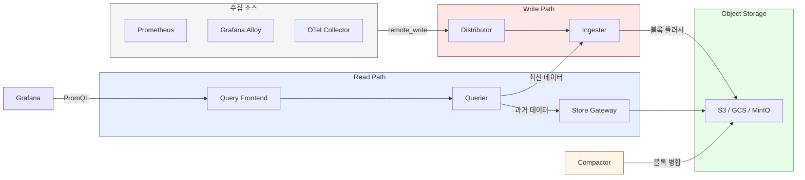

# Grafana Mimir

---

> Prometheus의 한계를 넘어서는 분산 메트릭 스토리지. PromQL 완전 호환, 수평 확장, 멀티테넌시를 제공한다.

## 1. Prometheus만으로 부족한 이유

Prometheus는 단일 노드 아키텍처다. 활성 시계열(active time series)이 수백만 개를 넘어서면 메모리 부족(OOM)이 발생하고, 디스크 I/O가 병목이 된다. 기본 retention이 15일이므로 3개월치 메트릭을 조회하려면 별도 장기 저장소가 필요하다.

멀티 클러스터 환경에서는 문제가 더 복잡해진다. 여러 K8s 클러스터에 각각 Prometheus가 떠 있으면, "전체 클러스터의 HTTP 에러율을 합산해줘" 같은 쿼리를 단일 PromQL로 실행할 수 없다. 고가용성(HA) 구성도 번거롭다 — Prometheus 두 대를 띄워도 데이터를 자동으로 병합하지 않는다.

이 문제를 해결하기 위해 Thanos, Cortex 등이 등장했다. Mimir는 Cortex를 기반으로 Grafana Labs가 2022년 오픈소스로 공개한 후속 프로젝트로, 단순화된 운영과 향상된 성능을 목표로 한다. 단일 바이너리로 배포할 수 있어 학습 곡선도 Cortex보다 낮다.

## 2. 아키텍처

Mimir는 역할별로 분리된 컴포넌트가 협력하는 마이크로서비스 구조다. Write Path(수집)와 Read Path(조회)가 독립적으로 동작하므로, 대량 수집이 쿼리 성능에 영향을 주지 않는다.

### Write Path

메트릭 수집 흐름은 다음 순서로 진행된다:

- **Distributor**: `remote_write` 요청을 수신하고, 시계열을 일관성 해싱(consistent hashing)으로 Ingester에 분배한다. 복제 계수(replication factor, 기본값 3)에 따라 여러 Ingester에 복사한다.
- **Ingester**: 수신한 시계열을 메모리에 버퍼링한다. 주기적으로 TSDB 블록 형식으로 Object Storage(S3, GCS 등)에 플러시한다. WAL(Write-Ahead Log)을 유지하므로 재시작 시에도 데이터를 복구할 수 있다.

### Read Path

조회 요청 흐름은 두 단계로 나뉜다:

- **Query Frontend**: 대규모 쿼리를 시간 범위와 샤드 단위로 분할하여 병렬 처리한다. 결과 캐싱으로 반복 조회 성능을 높인다.
- **Querier**: 분할된 쿼리를 실제로 실행한다. 최신 데이터는 Ingester에서, 오래된 데이터는 Store Gateway에서 조회한 뒤 병합한다.
- **Store Gateway**: Object Storage의 블록 인덱스와 메타데이터를 로컬에 캐싱한다. 블록 전체를 다운로드하지 않고 인덱스만 보고 필요한 청크를 선택적으로 읽는다.

### Compactor

Compactor는 Object Storage에 쌓인 작은 블록들을 주기적으로 병합(compaction)한다. 중복 시계열을 제거하고 보관 기간(retention)이 지난 블록을 삭제하여 쿼리 성능을 유지한다. Ingester가 플러시한 2시간짜리 블록들이 Compactor를 거쳐 24시간, 1주일 단위 블록으로 합쳐진다.

전체 아키텍처를 정리하면 다음과 같다:



## 3. Mimir 3.0 주요 변경 (2025년 KubeCon NA 발표)

Mimir 3.0은 Write/Read 경로를 비동기로 분리하는 **Kafka 기반 ingest layer**를 도입했다. 기존 구조에서는 대량 수집이 Ingester 메모리 압박으로 이어져 쿼리 응답 시간에 영향을 줬다. Kafka를 버퍼로 두면 수집과 조회가 완전히 독립되어 서로 영향을 주지 않는다.

Zone-awareness가 기본으로 활성화되었다. `mimir-distributed` Helm 차트 v4.0 이상 신규 설치 시 자동 적용되며, Ingester와 Store Gateway를 가용 영역별로 분산 배치하여 단일 zone 장애에도 데이터를 보호한다. Helm 차트는 v6.x로 올라오면서 주요 breaking changes가 있으므로, v5.x에서 마이그레이션할 때는 공식 가이드를 반드시 참고한다.

## 4. PromQL 호환성

Mimir는 Prometheus의 PromQL을 그대로 사용한다. 기존에 작성한 Grafana 대시보드, Alertmanager 알림 규칙을 수정 없이 Mimir로 전환할 수 있다. Grafana에서 data source 타입을 Prometheus에서 Mimir로 변경하고 URL만 바꾸면 즉시 동작한다.

Recording rule과 alerting rule은 **Ruler** 컴포넌트가 담당한다. Ruler는 Prometheus의 `rule_files` 역할을 Mimir 안에서 수행하며, 멀티테넌시를 지원하므로 테넌트별 독립적인 규칙을 관리할 수 있다.

`remote_write`를 지원하는 에이전트는 Mimir와 바로 연동된다:

- Prometheus: `remote_write` 엔드포인트를 Mimir Distributor로 지정
- Grafana Alloy: `prometheus.remote_write` 컴포넌트 사용
- OTel Collector: `prometheusremotewrite` exporter 사용

## 5. K8s Helm 배포

Mimir는 `mimir-distributed` Helm 차트로 배포한다. Grafana Helm 저장소를 추가하고 설치하는 명령은 다음과 같다:

```bash
helm repo add grafana https://grafana.github.io/helm-charts
helm repo update

helm install mimir grafana/mimir-distributed \
  -n monitoring \
  --create-namespace \
  -f values.yaml
```

`values.yaml`의 핵심 설정 항목은 다음과 같다:

```yaml
mimir:
  structuredConfig:
    common:
      storage:
        backend: s3
        s3:
          endpoint: minio.monitoring.svc:9000
          bucket_name: mimir
          access_key_id: mimir
          secret_access_key: mimirpassword
          insecure: true

    blocks_storage:
      s3:
        bucket_name: mimir-blocks

    limits:
      # 테넌트당 최대 활성 시계열 수 (0 = 무제한)
      max_global_series_per_user: 1500000
      # 장기 보관 기간 (0 = 무제한)
      compactor_blocks_retention_period: 1y

ingester:
  replicas: 3
  zoneAwareReplication:
    enabled: true

querier:
  replicas: 2

compactor:
  replicas: 1
```

소규모 학습/개발 환경에서는 Object Storage로 MinIO를 사용한다. MinIO를 같은 네임스페이스에 먼저 배포하고, 위 `s3` 설정에서 `endpoint`를 MinIO 서비스 주소로 지정하면 된다.

**Monolithic 모드**는 모든 컴포넌트를 단일 Pod로 실행한다. 프로덕션에서는 사용하지 않지만, 로컬 테스트에서 Helm 구조를 파악하기 좋다:

```bash
helm install mimir grafana/mimir-distributed \
  --set deploymentMode=monolithic \
  -n monitoring
```

## 6. Prometheus vs Mimir 판단 기준

Prometheus와 Mimir 중 어떤 것을 선택할지는 규모와 요구사항에 따라 달라진다:

| 기준 | Prometheus | Mimir |
|---|---|---|
| 활성 시계열 수 | ~100만 이하 권장 | 수억 개 이상 수평 확장 |
| 보관 기간 | 기본 15일, 최대 수개월 | 수년 단위, Object Storage 비용만 부담 |
| K8s 클러스터 수 | 단일 클러스터 적합 | 멀티 클러스터 통합 쿼리 지원 |
| 고가용성 | 수동 설정 필요 (federation) | 복제 계수와 zone-awareness 내장 |
| 멀티테넌시 | 미지원 | 테넌트별 격리, 쿼터 관리 지원 |
| 운영 복잡도 | 낮음 (단일 바이너리) | 높음 (컴포넌트 다수, Object Storage 필수) |

팀 단위 소규모 서비스라면 Prometheus로 충분하다. 여러 팀이 공유하는 중앙 모니터링 플랫폼이거나 클러스터가 3개 이상이면 Mimir를 도입할 이유가 생긴다.

## 7. Docker 참고

Docker 환경에서는 Monolithic 모드 단일 컨테이너로 Mimir를 실행한다. Object Storage 대신 로컬 파일시스템을 쓰므로 S3 설정이 필요 없다:

```bash
# 기본 설정으로 실행 (파일시스템 스토리지)
docker run -d \
  --name mimir \
  -p 9009:9009 \
  grafana/mimir \
  -target=all \
  -auth.multitenancy-enabled=false
```

Prometheus의 `remote_write`를 연결하는 설정은 다음과 같다:

```yaml
# prometheus.yml
remote_write:
  - url: http://localhost:9009/api/v1/push
    # 멀티테넌시 비활성화 시 헤더 불필요
```

K8s Helm 배포와의 차이는 세 가지다:

- Object Storage 대신 컨테이너 로컬 파일시스템 사용 (`/data`)
- 단일 프로세스가 Distributor, Ingester, Querier 역할을 모두 담당
- 컨테이너 종료 시 데이터가 사라지므로 볼륨 마운트 필요 (`-v /tmp/mimir:/data`)

컨테이너 종료·재시작 시에도 데이터를 유지하려면 볼륨을 마운트한다:

```bash
docker run -d \
  --name mimir \
  -p 9009:9009 \
  -v /tmp/mimir:/data \
  grafana/mimir \
  -target=all \
  -auth.multitenancy-enabled=false \
  -common.storage.filesystem.dir=/data
```
