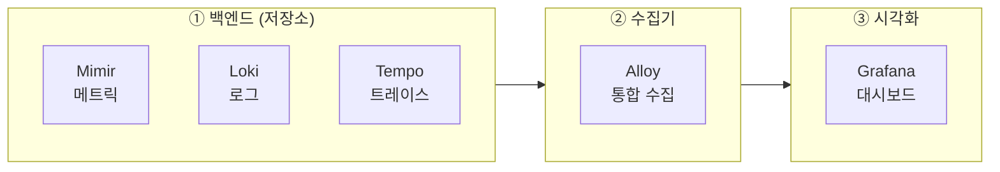

# LGTM K8s 통합 배포
---
> Loki, Grafana, Tempo, Mimir를 K8s 클러스터에 통합 배포하는 가이드다. 개별 컴포넌트의 상세 설정은 각 문서(02-01~06)를 참조하고, 이 문서는 전체 스택을 하나의 클러스터에 올리는 순서와 연결 방법에 집중한다.

## 1. 사전 요구사항

전체 스택을 배포하기 전에 다음 항목을 준비한다:

- K8s 클러스터 1.25 이상
- Helm 3.x
- `kubectl` 클라이언트
- (선택) Object Storage — MinIO 또는 S3/GCS. 프로덕션 환경에서 Loki, Tempo, Mimir 모두 Object Storage가 필요하다
- namespace 전략 — 학습 환경 기준으로 `monitoring` 단일 namespace에 모든 컴포넌트를 배포한다

## 2. 배포 순서와 이유

컴포넌트 간 의존 관계 때문에 배포 순서가 중요하다. Alloy는 데이터를 전송할 백엔드 endpoint가 먼저 존재해야 하고, Grafana는 data source로 등록할 백엔드가 이미 떠 있어야 한다.



배포 단계별 이유는 다음과 같다:

- **① 백엔드** (Mimir, Loki, Tempo) — Alloy가 데이터를 전송할 endpoint가 필요하므로 가장 먼저 배포한다
- **② 수집기** (Alloy) — 설정에 백엔드 endpoint를 직접 지정하므로 백엔드 이후에 배포한다
- **③ 시각화** (Grafana) — data source로 백엔드를 가리키므로 마지막에 배포한다

## 3. Helm 저장소 설정

모든 LGTM 컴포넌트는 Grafana 공식 Helm 저장소에서 배포한다:

```bash
helm repo add grafana https://grafana.github.io/helm-charts
helm repo add prometheus-community https://prometheus-community.github.io/helm-charts
helm repo update
kubectl create namespace monitoring
```

## 4. (선택) MinIO 배포

학습/개발 환경에서 Object Storage로 MinIO를 사용하는 경우 다음과 같이 배포한다:

```bash
helm repo add minio https://charts.min.io/
helm install minio minio/minio -n monitoring \
  --set rootUser=minioadmin \
  --set rootPassword=minioadmin \
  --set mode=standalone \
  --set persistence.size=20Gi
```

MinIO 배포 후 Loki, Tempo, Mimir용 버킷을 생성한다:

```bash
kubectl run minio-client --rm -it --image=minio/mc --restart=Never -- \
  sh -c "mc alias set myminio http://minio.monitoring.svc:9000 minioadmin minioadmin && \
  mc mb myminio/loki-chunks && \
  mc mb myminio/tempo-traces && \
  mc mb myminio/mimir-blocks"
```

## 5. Step 1 — 백엔드 배포

### 5-1. Mimir (메트릭)

Mimir를 Monolithic 모드로 배포한다. 상세 설정은 `02-05.Grafana Mimir.md`를 참조한다:

```bash
helm install mimir grafana/mimir-distributed -n monitoring -f mimir-values.yaml
```

`mimir-values.yaml` 최소 예시 (Monolithic + MinIO):

```yaml
mimir:
  structuredConfig:
    common:
      storage:
        backend: s3
        s3:
          endpoint: minio.monitoring.svc:9000
          bucket_name: mimir-blocks
          access_key_id: minioadmin
          secret_access_key: minioadmin
          insecure: true

deploymentMode: monolithic
```

### 5-2. Loki (로그)

Loki를 SingleBinary 모드로 배포한다. 상세 설정은 `02-03.Grafana Loki.md`를 참조한다:

```bash
helm install loki grafana/loki -n monitoring -f loki-values.yaml
```

`loki-values.yaml` 최소 예시:

```yaml
loki:
  commonConfig:
    replication_factor: 1
  storage:
    type: s3
    s3:
      endpoint: http://minio.monitoring.svc:9000
      bucketnames: loki-chunks
      access_key_id: minioadmin
      secret_access_key: minioadmin
      insecure: true
  schemaConfig:
    configs:
      - from: "2024-01-01"
        store: tsdb
        object_store: s3
        schema: v13
        index:
          prefix: loki_index_
          period: 24h

deploymentMode: SingleBinary
singleBinary:
  replicas: 1
```

### 5-3. Tempo (트레이스)

Tempo를 단일 바이너리 모드로 배포한다. 상세 설정은 `02-04.Grafana Tempo.md`를 참조한다:

```bash
helm install tempo grafana/tempo -n monitoring -f tempo-values.yaml
```

`tempo-values.yaml` 최소 예시:

```yaml
tempo:
  storage:
    trace:
      backend: s3
      s3:
        bucket: tempo-traces
        endpoint: minio.monitoring.svc:9000
        access_key: minioadmin
        secret_key: minioadmin
        insecure: true
```

## 6. Step 2 — Alloy 배포 (수집기)

Alloy는 애플리케이션의 메트릭, 로그, 트레이스를 수집해 각 백엔드로 전달한다. 상세 설정은 `02-02.Grafana Alloy.md`를 참조한다:

```bash
helm install alloy grafana/alloy -n monitoring -f alloy-values.yaml
```

`alloy-values.yaml` 최소 예시 (OTLP receiver + 백엔드 endpoint 설정):

```yaml
alloy:
  configMap:
    content: |
      otelcol.receiver.otlp "default" {
        grpc { endpoint = "0.0.0.0:4317" }
        http { endpoint = "0.0.0.0:4318" }
        output {
          metrics = [otelcol.exporter.prometheus.default.input]
          logs    = [otelcol.exporter.loki.default.input]
          traces  = [otelcol.exporter.otlp.tempo.input]
        }
      }

      otelcol.exporter.prometheus "default" {
        forward_to = [prometheus.remote_write.mimir.receiver]
      }

      prometheus.remote_write "mimir" {
        endpoint {
          url = "http://mimir-nginx.monitoring.svc/api/v1/push"
        }
      }

      otelcol.exporter.loki "default" {
        forward_to = [loki.write.default.receiver]
      }

      loki.write "default" {
        endpoint {
          url = "http://loki.monitoring.svc:3100/loki/api/v1/push"
        }
      }

      otelcol.exporter.otlp "tempo" {
        client {
          endpoint = "tempo.monitoring.svc:4317"
          tls { insecure = true }
        }
      }
```

## 7. Step 3 — Grafana 배포 (시각화)

Grafana를 배포하면서 data source를 프로비저닝 YAML로 자동 등록한다. 상세 설정은 `02-01.Grafana Core.md`를 참조한다:

```bash
helm install grafana grafana/grafana -n monitoring -f grafana-values.yaml
```

`grafana-values.yaml` — data source 프로비저닝으로 Mimir, Loki, Tempo를 자동 등록한다:

```yaml
datasources:
  datasources.yaml:
    apiVersion: 1
    datasources:
      - name: Mimir
        type: prometheus
        url: http://mimir-query-frontend.monitoring.svc:8080/prometheus
        isDefault: true

      - name: Loki
        type: loki
        url: http://loki.monitoring.svc:3100
        jsonData:
          derivedFields:
            - name: TraceID
              matcherRegex: "trace_id=(\\w+)"
              url: "$${__value.raw}"
              datasourceUid: tempo

      - name: Tempo
        type: tempo
        uid: tempo
        url: http://tempo.monitoring.svc:3200
        jsonData:
          tracesToLogs:
            datasourceUid: loki
            tags: ['service.name']
          serviceMap:
            datasourceUid: mimir
```

Loki의 `derivedFields`는 로그에서 `trace_id`를 추출해 Tempo 링크를 자동 생성한다. Tempo의 `tracesToLogs`는 트레이스에서 해당 로그를 역방향으로 탐색한다. 이 교차 참조 설정이 LGTM 통합의 핵심이다.

## 8. 검증 체크리스트

모든 Pod가 Running 상태인지 먼저 확인한다:

```bash
kubectl get pods -n monitoring
```

각 컴포넌트 헬스 엔드포인트를 port-forward로 검증한다:

```bash
# Mimir
kubectl port-forward svc/mimir-query-frontend 8080:8080 -n monitoring
curl http://localhost:8080/ready

# Loki
kubectl port-forward svc/loki 3100:3100 -n monitoring
curl http://localhost:3100/ready

# Tempo
kubectl port-forward svc/tempo 3200:3200 -n monitoring
curl http://localhost:3200/ready

# Grafana
kubectl port-forward svc/grafana 3000:80 -n monitoring
# 브라우저에서 http://localhost:3000 접속
```

Grafana Explore에서 스모크 테스트 쿼리를 실행해 end-to-end 동작을 검증한다:

- Loki: `{namespace="monitoring"}` — Pod 로그가 수집되는지 확인
- Tempo: 트레이스 검색 — 수집된 스팬이 보이는지 확인
- Mimir: `up` — 스크레이핑 대상 상태 확인

## 9. Docker Compose 참고

K8s 없이 빠르게 LGTM 스택을 검증하려면 Docker Compose 기반 배포를 사용할 수 있다. Docker Compose 방식은 `01-1. 모니터링.md`를 참조한다.

Grafana는 개발용 올인원 이미지도 제공한다:

```bash
docker run -p 3000:3000 -p 4317:4317 -p 4318:4318 grafana/otel-lgtm
```

이 이미지는 Loki, Grafana, Tempo, OTel Collector를 단일 컨테이너로 실행한다. 학습과 빠른 검증에 적합하지만 Mimir는 포함되지 않는다.

## 10. 다음 단계

LGTM 스택 배포 후 다음 순서로 진행한다:

- 애플리케이션 계측 — `03-02. Application 적용.md`: Spring Boot에 OTel SDK를 연동해 실제 데이터를 수집한다
- 통합 설정 — `03-01. LGTM 통합.md`: Loki↔Tempo 교차 참조, Exemplar 연결 등 세부 통합을 완성한다
- 트레이싱 분석 — `05-01. Tempo 분산 트레이싱 시각화.md`: Service Graph와 TraceQL로 분산 트레이스를 분석한다
- eBPF 자동 계측 — `02-06.Grafana Beyla.md`: 코드 수정 없이 네트워크 레벨에서 계측한다
