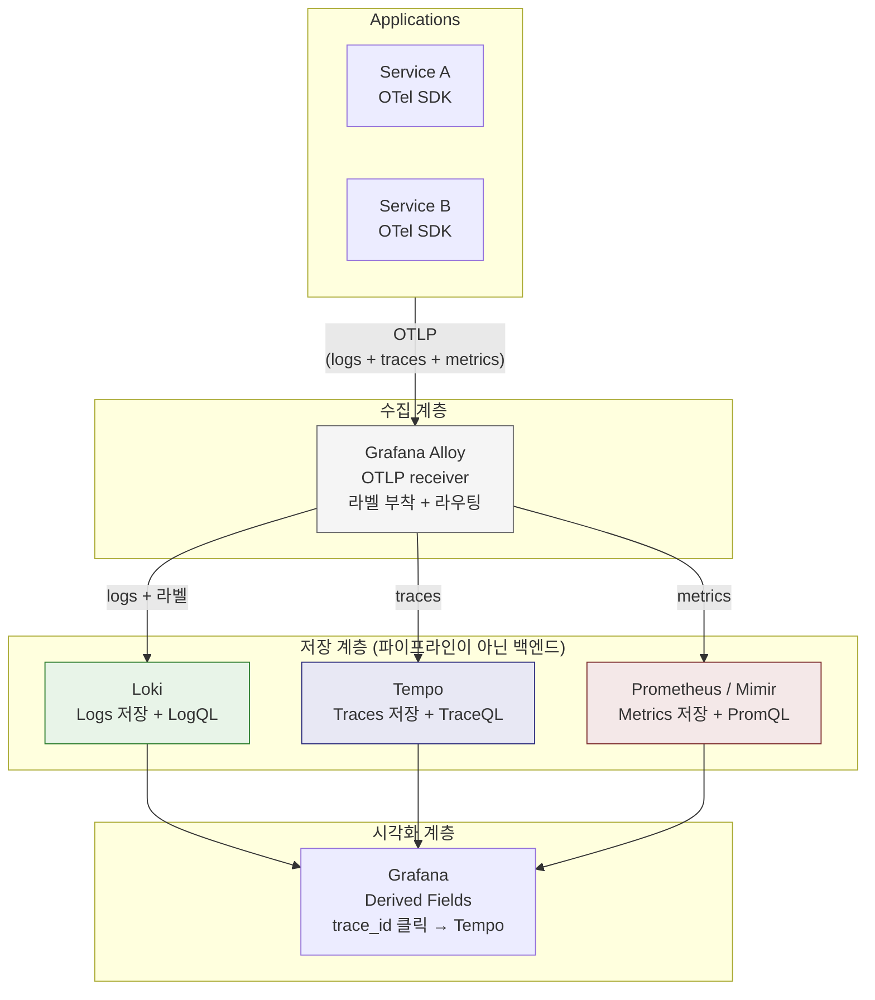
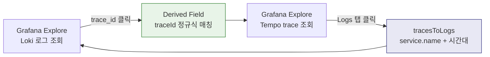

# Alloy-Loki-Tempo Integration

---

> 많은 팀이 Loki(로그)와 Tempo(트레이스)를 같이 설치하고 Grafana에서 둘 다 데이터소스로 등록한다. 그런데 실제 장애가 발생하면 로그 화면과 트레이스 화면을 따로 열고, 타임스탬프를 눈으로 비교하며, "아마 이 로그가 이 trace에 해당할 것이다"라고 추측한다. 도구는 있는데 **연결이 안 되는** 상태다.
>
> 이 문제의 원인은 도구가 아니라 **메타데이터**에 있다. 로그와 트레이스를 클릭 한 번으로 오가려면 세 가지 조건이 필요하다.
>
> 1. **로그에 trace_id가 포함되어야 한다** — 이것이 로그 → 트레이스 연결의 유일한 키다
> 2. **resource 속성이 서비스별로 일관되어야 한다** — `service.name`이 로그에서는 "checkout"이고 트레이스에서는 "checkout-svc"면 연결이 깨진다
> 3. **Grafana 데이터소스 간 링크가 설정되어야 한다** — Loki의 trace_id 필드가 Tempo로 점프하도록 Derived Field를 등록해야 한다



| 컴포넌트             | 역할                                  | 통합에서의 책임                                              |
| -------------------- | ------------------------------------- | ------------------------------------------------------------ |
| **Application**      | OTLP로 logs + traces + metrics 내보냄 | 로그에 trace_id 포함, resource 속성 설정                     |
| **Alloy**            | 수집, 라벨 부착, 라우팅 (파이프라인)  | trace_id를 Structured Metadata로 분리, 공통 라벨 부착, 신호별 저장소로 분배 |
| **Loki**             | 로그 저장 + LogQL 쿼리 (백엔드)       | trace_id로 특정 요청의 로그 조회                             |
| **Tempo**            | 트레이스 저장 + TraceQL 쿼리 (백엔드) | service.name으로 특정 서비스의 트레이스 조회                 |
| **Prometheus/Mimir** | 메트릭 저장 + PromQL 쿼리 (백엔드)    | 서비스별 레이턴시, 에러율, 리소스 사용량 조회                |
| **Grafana**          | 시각화 + 신호 간 전환                 | Derived Field로 Loki ↔ Tempo 링크                            |

## trace_id

> 로그와 트레이스를 연결하는 가장 강력한 키는 `trace_id`다. 하나의 요청에 대해 모든 서비스가 동일한 trace_id를 공유하므로, 이 값으로 "이 에러 로그가 어떤 요청 경로에서 발생했는가"를 정확히 추적할 수 있다.

애플리케이션이 OTel SDK로 계측되어 있으면, 활성 span의 trace_id를 로그에 자동으로 포함할 수 있다. Spring Boot의 경우 Micrometer Tracing이 MDC(Mapped Diagnostic Context)에 trace_id를 넣고, 로그 패턴에서 이를 출력한다.

```bash
<!-- logback-spring.xml -->
<pattern>%d{HH:mm:ss} [%thread] %-5level %logger - [traceId=%X{traceId}, spanId=%X{spanId}] %msg%n</pattern>

# 결과 로그
14:23:05 [http-nio-8080-exec-1] ERROR c.e.OrderService - [traceId=abc123def456] Payment timeout
```

- OTel Java Agent를 사용하면 별도 설정 없이 MDC에 `trace_id`, `span_id`가 자동으로 주입된다. Spring Boot Starter도 마찬가지다. 
- 핵심은 **로그 패턴에 `%X{traceId}`를 포함**하는 것이다. 이것이 빠지면 아무리 SDK가 동작해도 로그 출력에 trace_id가 나타나지 않는다.

### trace_id를 Loki에 어떻게 저장하는가?

trace_id가 로그 본문에 출력되면, Loki에 저장할 때 3가지 위치중 하나를 선택해야합니다.

| 저장 위치               | 장점                          | 단점                                       | 권장 여부 |
| ----------------------- | ----------------------------- | ------------------------------------------ | --------- |
| **Loki 라벨**           | 인덱스 타므로 빠른 필터링     | 카디널리티 폭발 — trace_id는 요청마다 다름 | **금지**  |
| **로그 본문**           | 별도 설정 불요                | `|= "traceId=abc..."` 본문 스캔 필요       | 기본      |
| **Structured Metadata** | 카디널리티 안전 + 빠른 필터링 | Loki 3.0+ 필요                             | **권장**  |

-  Loki 3.0 이상에서는 **Structured Metadata**에 저장하는 것이 비용과 탐색 양쪽에서 가장 균형 잡힌 선택이다. 
- Structured Metadata는 인덱스에 들어가지 않지만 LogQL에서 필터링할 수 있다.

### Grafana에서 trace_id 클릭 -> Tempo 점프

로그에 trace_id가 있어도, Grafana에서 자동으로 Tempo로 연결되지는 않습니다. Derived Field 설정이 필요합니다.

```yaml
# grafana/provisioning/datasources/datasources.yaml
datasources:
  - name: Loki
    type: loki
    url: http://loki:3100
    jsonData:
      derivedFields:
        - datasourceUid: tempo-uid
          matcherRegex: "traceId=(\\w+)"      # 로그에서 trace_id 추출 정규식
          name: TraceID
          url: "$${__value.raw}"               # 추출된 값으로 Tempo 조회
          datasourceName: Tempo
```

- 이 설정이 되면 Grafana Explore에서 로그를 볼 때 trace_id 옆에 링크 아이콘이 생기고, 클릭하면 Tempo의 해당 trace 뷰로 바로 이동한다. 이것이 "클릭 한 번으로 로그에서 트레이스로" 전환되는 UX의 실체다.

### Tempo -> Loki

Tempo -> Loki 방향도 설정할 수 있습니다. Tempo 데이터소스에서 trace-to-logs 연동을 설정하면, trace 뷰에서 특정 span을 선택했을 때 해당 서비스의 동일 시간대 로그를 바로 조회할 수 있습니다.

```yaml
- name: Tempo
    type: tempo
    url: http://tempo:3200
    jsonData:
      tracesToLogs:
        datasourceUid: loki-uid
        filterByTraceID: true        # trace_id로 로그 필터링
        filterBySpanID: false
        mapTagNamesEnabled: true
        mappedTags:
          - key: service.name
            value: service_name      # Tempo의 service.name → Loki의 service_name 라벨로 매핑
```

이렇게 양방향 링크가 설정되면, 로그 -> 트레이스 -> 로그를 자유롭게 오갈 수 있습니다.




## 공통 Resource 속성

> trace_id가 **건별 연결 키**라면, `service.name`과 `deployment.environment`는 **탐색의 출발점**이다. 운영자가 장애를 분석할 때 첫 번째로 하는 것은 "어떤 서비스의 어떤 환경에서 문제가 생겼는가"를 좁히는 것이다.

```bash
# 탐색 흐름:
  1. service.name = "checkout"
  2. deployment.environment = "prod"
  3. 최근 15분
  4. level = "error"
  → 에러 로그 목록 → trace_id 클릭 → Tempo trace 확인
```

- 이 흐름이 동작하려면, 로그의 service_name 라벨과 트레이스의 service.name resource 속성이 같은 값이어야 합니다. 로그에서는 checkout이고, 트레이스에서는 checkout-svc면 같은 서비스의 데이터를 연결할 수 없습니다.

### 속성 일관성을 어디서 보장하는가

OTel SDK에서 설정한 resource 속성이 **모든 신호의 원천**이 된다. 이 값을 한 곳에서 설정하면 로그와 트레이스에 동일한 값이 들어간다.

```bash
# 앱에서 한 번만 설정하면 logs, traces 모두에 적용
OTEL_SERVICE_NAME=checkout
OTEL_RESOURCE_ATTRIBUTES=deployment.environment=prod,service.version=1.2.3
```

| OTel Resource 속성       | Loki 라벨                | Tempo 속성               | 용도                              |
| ------------------------ | ------------------------ | ------------------------ | --------------------------------- |
| `service.name`           | `service_name`           | `service.name`           | 서비스 식별 (모든 탐색의 기본 축) |
| `deployment.environment` | `deployment_environment` | `deployment.environment` | 환경 분리 (dev/stg/prod)          |
| `service.version`        | Structured Metadata      | `service.version`        | 배포 버전별 비교                  |
| `k8s.namespace.name`     | `namespace`              | `k8s.namespace.name`     | K8s 네임스페이스 필터             |


## Alloy의 역할(라우팅/라벨 부착)

### OTLP 수신 -> 신호 분리

앱이 OTLP로 보내는 데이터에는 logs와 traces가 섞여 있다. Alloy는 이를 받아서 logs는 Loki로, traces는 Tempo로 분리한다.

```alloy
// OTLP receiver — 앱에서 보내는 모든 신호를 수신
otelcol.receiver.otlp "default" {
  grpc { endpoint = "0.0.0.0:4317" }
  http { endpoint = "0.0.0.0:4318" }

  output {
    logs    = [otelcol.processor.batch.default.input]
    traces  = [otelcol.processor.filter.noise.input]    // 노이즈 필터 거쳐서 Tempo로
  }
}

// Trace 노이즈 필터링 (Ch09에서 다룬 패턴)
otelcol.processor.filter "noise" {
  traces {
    span = [
      "name == \"GET /actuator/prometheus\"",
      "name == \"GET /actuator/health\"",
    ]
  }
  output { traces = [otelcol.exporter.otlphttp.tempo.input] }
}

// Logs → Loki로 전송
otelcol.exporter.loki "default" {
  forward_to = [loki.process.extract_trace.receiver]
}

// Traces → Tempo로 전송
otelcol.exporter.otlphttp "tempo" {
  client { endpoint = "http://tempo:4318" }
}
```

### 라벨 정규화

OTel resource 속성은 `service.name` 형태이지만, Loki 라벨은 점(.)을 허용하지 않는다. Alloy가 이 변환을 자동으로 처리하지만, 어떤 속성이 라벨로 승격되고 어떤 것이 Structured Metadata로 가는지는 설정으로 제어해야 한다.

```
OTel resource 속성           →  Loki 저장 위치
service.name                 →  라벨: service_name (승격)
deployment.environment       →  라벨: deployment_environment (승격)
trace_id                     →  Structured Metadata (고카디널리티)
span_id                      →  Structured Metadata (고카디널리티)
service.version              →  Structured Metadata (변경 빈도 높음)
```


# 설계 원칙

---

### 원칙 1: 앱은 OTLP만 알면 된다

애플리케이션은 Loki endpoint, Tempo endpoint를 직접 알 필요가 없다. OTLP로 Alloy에 보내면 Alloy가 목적지별로 라우팅한다. 앱의 책임은 두 가지뿐이다.

- `OTEL_EXPORTER_OTLP_ENDPOINT`를 Alloy로 설정
- 로그 패턴에 `traceId`, `spanId` 포함

저장소가 Tempo에서 Jaeger로 바뀌어도, 앱 설정은 변경할 필요가 없다.

### 원칙 2: 연결 키와 검색 키를 분리

| 구분        | 예시                           | Loki 저장 위치      | 이유                              |
| ----------- | ------------------------------ | ------------------- | --------------------------------- |
| **검색 키** | `service.name`, `env`, `level` | 라벨 (인덱싱)       | 카디널리티 낮음, 항상 필터에 사용 |
| **연결 키** | `trace_id`, `span_id`          | Structured Metadata | 카디널리티 높음, 건별 추적용      |

이 두 종류를 같은 라벨 전략으로 다루면, 비용(라벨에 trace_id → 스트림 폭발)이나 탐색성(trace_id가 본문에만 → 연결 느림) 중 하나가 무너진다.

### 원칙 3: 저장소의 역할을 섞지 않는다

Loki에 trace 정보를 넣거나, Tempo에 상세 로그 메시지를 저장하는 것은 안티패턴이다. 각 저장소는 자기 신호에 최적화되어 있다.

- **Loki**: "무슨 일이 있었는가" — 텍스트 기반 상세 정보
- **Tempo**: "어디서 얼마나 걸렸는가" — 구조화된 span 트리

둘을 연결하는 것은 Grafana의 역할이지, 저장소의 역할이 아니다.

### 원칙 4: Alloy는 파이프라인이지 저장소가 아니다

Alloy가 세 신호를 모두 OTLP로 수신하고 라우팅한다고 해서, 저장소가 필요 없어지는 것이 아니다. Alloy는 데이터를 흘려보내는 파이프라인이지, 시계열 데이터를 저장하고 쿼리하는 기능은 없다.

```
Alloy = 택배 기사 (수집, 필터링, 라우팅)
Loki / Tempo / Prometheus(Mimir) = 창고 (저장, 인덱싱, 쿼리)
```

특히 메트릭에서 이 구분이 혼동되기 쉽다. 현재 이 프로젝트는 Prometheus가 앱의 `/actuator/prometheus`를 직접 scrape하는 구조다. 만약 Alloy를 정석대로 도입해서 메트릭도 OTLP로 받게 되면, 수집 경로만 바뀌고 저장소는 여전히 필요하다.

```
현재:   Prometheus ──scrape──▶ 앱         (Prometheus가 수집 + 저장 + 쿼리)
정석:   앱 ──OTLP──▶ Alloy ──▶ Mimir     (Alloy가 수집, Mimir가 저장 + 쿼리)
```

Mimir는 Prometheus의 분산 확장판으로, LGTM 스택에서 M에 해당한다. PromQL을 그대로 사용하며, 장기 저장과 수평 확장을 지원한다. 소규모 환경에서는 Prometheus 단독으로 충분하고, 멀티클러스터나 장기 보관이 필요하면 Mimir로 교체한다.

| 컴포넌트       | 역할                                            | LGTM에서의 위치 |
| -------------- | ----------------------------------------------- | --------------- |
| **Alloy**      | 수집 + 라우팅 (파이프라인)                      | 수집 계층       |
| **Loki**       | 로그 저장 + LogQL 쿼리                          | L               |
| **Grafana**    | 시각화 + 신호 간 연결                           | G               |
| **Tempo**      | 트레이스 저장 + TraceQL 쿼리                    | T               |
| **Mimir**      | 메트릭 저장 + PromQL 쿼리                       | M               |
| **Prometheus** | 메트릭 수집 + 저장 + 쿼리 (Mimir의 소규모 대안) | M 대체          |

Alloy가 아무리 강력한 수집기여도 택배 경로를 바꾸는 것이지 창고를 없애는 것이 아니다. 이 구분을 이해하면 "Alloy를 도입하면 Prometheus가 필요 없는가?" 같은 혼동이 사라진다.
