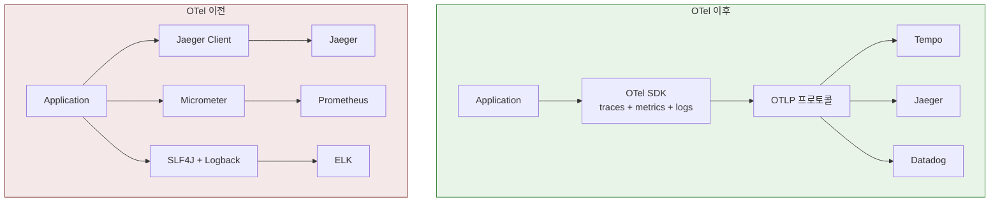
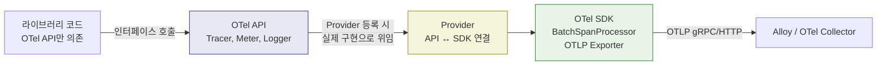
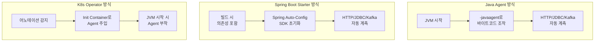

# OpenTelemetry

---

> OpenTelemetry(OTel)는 CNCF 프로젝트로, **traces, metrics, logs 세 신호를 하나의 통합된 API/SDK로 생성하는 벤더 중립 표준**이다. 핵심 아이디어는 "계측 코드는 한 번만 작성하고, 데이터를 어디로 보낼지는 설정으로 결정한다"는 것이다.



- OTel을 쓰면 애플리케이션 코드는 OTel API만 호출합니다. 데이터를 어디로 보낼지는 Exporter 설정만 바꾸면 됩니다.

OTel이 커버하는 영역과 커버하지 않는 영역을 구분하는 것이 중요하다.

| OTel이 하는 것               | OTel이 하지 않는 것                         |
| ---------------------------- | ------------------------------------------- |
| 텔레메트리 생성 (API/SDK)    | 텔레메트리 저장 (Loki, Tempo, Mimir의 역할) |
| 데이터 전송 프로토콜 (OTLP)  | 데이터 시각화 (Grafana의 역할)              |
| 자동 계측 라이브러리         | 알림 규칙, 대시보드 정의                    |
| Collector를 통한 가공/라우팅 | 장기 보관 정책                              |

- OTel은 **생성과 전송**에만 집중한다. 저장과 시각화는 LGTM 스택의 다른 컴포넌트가 담당한다. 이 경계를 이해하면 "OTel을 도입하면 Grafana가 필요 없는가?" 같은 혼동이 사라진다.

## 분산 추적이 개발자에게 필요한 순간

모놀리스 애플리케이션에서는 하나의 스택트레이스가 요청의 전체 경로를 보여준다. `OrderController → OrderService → PaymentService → JdbcTemplate`까지, 예외가 터지면 콜스택 한 장으로 원인을 특정할 수 있다. 디버깅 도구가 프로세스 하나만 바라보면 되기 때문이다.

마이크로서비스로 전환하면 이 가정이 깨진다. 주문 서비스가 결제 서비스를 HTTP로 호출하는 순간, 스택트레이스는 `RestTemplate.exchange()` 또는 `WebClient.retrieve()`에서 끊긴다. 결제 서비스 내부에서 무슨 일이 일어났는지는 결제 서비스의 로그를 따로 열어봐야 안다. 서비스가 5개, 10개로 늘어나면 "주문 API가 3초 걸리는데, 결제 서비스 때문인지 재고 서비스 때문인지 모른다"는 상황이 일상이 된다.

분산 추적은 이 문제를 해결한다. 프로세스 경계를 넘어 하나의 요청이 거치는 전체 여정을 재구성하는 것이다. 핵심 메커니즘은 **Context Propagation** — 서비스 간 호출 시 HTTP 헤더에 `trace_id`와 `span_id`를 실어 보내고, 수신 측이 이를 이어받아 같은 trace에 연결한다. 이 전파 과정의 구체적인 동작은 아래 Propagation 섹션에서 다룬다.

## Waterfall View — 트레이스를 읽는 법

Grafana Tempo에서 trace를 클릭하면 워터폴 다이어그램이 나타난다. 가로축이 시간, 각 수평 막대가 하나의 span이다. 중첩된 막대는 부모-자식 관계를 나타내고, 막대의 길이가 해당 작업의 소요 시간이다.

```mermaid
gantt
    title 주문 처리 Trace (3.0s)
    dateFormat X
    axisFormat %s초

    section order-svc
    POST /api/orders           :a1, 0, 3000

    section order-svc
    validate-order             :a2, 0, 200

    section inventory-svc
    GET /api/inventory/check   :a3, 200, 500

    section payment-svc
    POST /api/payments         :crit, a4, 500, 3000

    section payment-svc
    process-payment            :crit, a5, 500, 2800

    section payment-svc
    call-pg-gateway            :crit, a6, 600, 2700
```



워터폴을 읽을 때 주목할 세 가지가 있다:

- **가장 긴 span이 병목이다.** 위 예시에서 전체 3초 중 `call-pg-gateway`가 2.1초를 차지한다. 주문 서비스를 아무리 최적화해도 결제 서비스의 PG 게이트웨이 호출이 느리면 전체 응답 시간은 줄어들지 않는다.
- **빨간색(에러) span이 장애 지점이다.** span에 `status: ERROR`가 설정되면 Tempo가 빨간색으로 표시한다. 에러가 발생한 span과 그 부모 span을 따라가면 장애의 전파 경로를 파악할 수 있다.
- **직렬 배치와 병렬 배치를 구분한다.** 재고 확인과 결제가 직렬로 실행되고 있다면, 둘이 독립적인 경우 병렬로 바꿔 응답 시간을 단축할 수 있다. 워터폴에서 span이 겹치면 병렬, 이어지면 직렬이다.

실제 디버깅 시나리오를 하나 들어보면 — "주문 API 응답이 3초"라는 알림을 받고 Tempo에서 해당 trace를 열었을 때, `payment-svc`의 `call-pg-gateway` span이 2.1초를 차지하고 있다면 병목은 PG 게이트웨이 응답 시간이다. 주문 서비스나 재고 서비스를 튜닝하는 것은 헛수고가 된다. 이처럼 워터폴 한 장이 "어디를 고쳐야 하는가"를 즉시 알려준다.

## OTel SDK의 구조 (API/SDK/Provider)

OpenTelemetry의 핵심 설계는 API와 SDK를 분리하는 것입니다.

HTTP 클라이언트 라이브러리를 만들고 있다고 가정하자. 이 라이브러리에 요청 시간을 추적하는 span을 추가하고 싶다. 그런데 최종 사용자가 Jaeger/Tempo를 쓸지 알 수 없다. 

API만 의존하면 이 문제가 해결된다. `Tracer.spanBuilder("http-request")`를 호출하기만 하고, 실제로 span이 어디로 전송될지는 최종 앱이 SDK를 등록하면서 결정한다.

| 계층         | 역할                                    | 의존성             |
| ------------ | --------------------------------------- | ------------------ |
| **API**      | 인터페이스 정의 (Tracer, Meter, Logger) | 가벼움, no-op 기본 |
| **SDK**      | 실제 구현 (처리, 배치, export)          | 무거움, 설정 필요  |
| **Provider** | API와 SDK를 연결하는 등록 지점          | 앱 시작 시 등록    |

- Provider를 등록하지 않으면 API 호출은 아무 일도 하지 않는다. 이 구조 덕분에 라이브러리는 API만 의존하고, SDK 선택은 최종 앱이 결정할 수 있다.



### 3 신호의 Provider

OTel SDK는 세 신호 각각에 대해 별도의 Provider를 갖는다.

| Provider         | 생성하는 신호  | 주요 Processor                            |
| ---------------- | -------------- | ----------------------------------------- |
| `TracerProvider` | Spans (traces) | `BatchSpanProcessor` → OTLP Exporter      |
| `MeterProvider`  | Metrics        | `PeriodicMetricReader` → OTLP Exporter    |
| `LoggerProvider` | Logs           | `BatchLogRecordProcessor` → OTLP Exporter |

- 세 Provider가 모두 같은 OTLP Exporter를 통해 Collector로 데이터를 보낸다. 프로토콜이 통일되어 있으므로 Collector 설정도 단순해진다.

### Propagation: 컨텍스트 전파

분산 추적이 동작하려면 서비스 A가 서비스 B를 호출할 때 trace_id와 span_id가 함께 전달되어야 한다. 이 역할을 하는 것이 **Propagator**다.

```
Service A → HTTP Header에 traceparent 삽입 → Service B가 헤더에서 추출 → 같은 trace에 연결
```

W3C TraceContext 형식이 기본이며, 헤더는 이렇게 생겼다.

```
traceparent: 00-4bf92f3577b34da6a3ce929d0e0e4736-00f067aa0ba902b7-01
              ──  ────────trace_id────────  ────span_id──── ─flags
```

- `trace_id`: 전체 요청 경로를 식별하는 32자리 hex
- `span_id`: 현재 작업 단위를 식별하는 16자리 hex
- `flags`: `01`이면 샘플링됨, `00`이면 샘플링 안 됨

서비스 B가 이 헤더를 받으면 동일한 trace_id로 자식 span을 생성한다. 이렇게 서비스 간 context가 전파되어야 Tempo에서 하나의 요청 경로를 완전한 trace로 볼 수 있다. Propagator가 빠지면 각 서비스가 독립된 trace를 생성하므로, 분산 추적이 끊긴다.

# Application Instrumentation

---

## Auto-Instrumentation 선택지

Java 생태계에서 자동 계측을 적용하는 방법은 크게 3가지입니다.



### Java Agent(-javaagent)

JVM이 클래스를 로드하는 시점에 바이트코드를 조작(bytecode manipulation)하여 계측 코드를 주입한다. `java.lang.instrument` API를 사용하며, 앱의 소스 코드나 빌드 스크립트를 전혀 변경하지 않는다.

```bash
java -javaagent:opentelemetry-javaagent.jar -jar myapp.jar
```

| 카테고리        | 라이브러리/프레임워크             | 생성되는 span                               |
| --------------- | --------------------------------- | ------------------------------------------- |
| HTTP 서버       | Spring MVC, Servlet               | `GET /api/orders`                           |
| HTTP 클라이언트 | RestTemplate, WebClient, OkHttp   | `HTTP GET https://payment-svc/pay`          |
| 데이터베이스    | JDBC, Hibernate, R2DBC            | `SELECT orders WHERE id=?`                  |
| 메시징          | Kafka Producer/Consumer, RabbitMQ | `order-events send`, `order-events receive` |
| gRPC            | gRPC Client/Server                | `grpc.service.Method`                       |
| 캐시            | Jedis, Lettuce (Redis)            | `GET cache:user:123`                        |

- JVM이 HttpServlet.service(), DataSource.getConnection(), KafkaProducer.send() 같은 메서드 로드할 때, 메서드 앞뒤에 span 시작/종료 코드를 삽입합니다.

### Spring Boot Starter

Gradle/Maven 의존성으로 추가합니다. Spring Auto-Configuration이 SDK와 계측을 활성화하므로, JAR 안에 포함되어 어디서든 동일하게 동작합니다.

```bash
// build.gradle.kts
implementation("io.opentelemetry.instrumentation:opentelemetry-spring-boot-starter")
```

```yaml
# application.yml
otel:
  service:
    name: checkout
  exporter:
    otlp:
      endpoint: http://alloy:4317
  traces:
    sampler:
      type: parentbased_traceidratio
      arg: 0.1   # 10% 샘플링
```

- Java Agent는 JVM 외부에서 바이트 코드를 조작하지만, Starter는 Spring의 Bean 등록과 AOP를 통해 계측합니다.
- JAR안에 포함되므로 어디서든 동일하게 동작하며, Spring 생태계 밖의 라이브러리는 계측 범위가 좁을 수 있다.

### k8s Operator

k8s 환경에서 어노테이션만 추가하면 Pod 추가 시 Agent를 주입합니다. 앱 빌드를 건드리지 않아도 되지만, Operator 설치가 필요합니다.

```yaml
apiVersion: apps/v1
kind: Deployment
metadata:
  name: checkout
spec:
  template:
    metadata:
      annotations:
        instrumentation.opentelemetry.io/inject-java: "true"  # 이 한 줄이 전부
    spec:
      containers:
        - name: checkout
          image: checkout:1.0
```

**동작 과정:**

1. OTel Operator가 `inject-java: "true"` 어노테이션을 감지
2. Pod 스펙에 Init Container를 자동 추가 — Agent JAR을 다운로드
3. 메인 컨테이너의 `JAVA_TOOL_OPTIONS`에 `-javaagent` 옵션을 주입
4. JVM 시작 시 Agent가 바이트코드 계측 수행

만약 실제로 추가한다면 아래와 같은 작업들이 진행된다.

**Instrumentation CRD 정의**

```yaml
# templates/otel-instrumentation.yaml
{{- if .Values.global.otel.enabled }}
apiVersion: opentelemetry.io/v1alpha1
kind: Instrumentation
metadata:
  name: tps-otel-instrumentation
  namespace: trb-app
spec:
  exporter:
    endpoint: {{ .Values.global.otel.collectorEndpoint }}
  propagators:
    - tracecontext        # W3C TraceContext
    - baggage
  sampler:
    type: parentbased_traceidratio
    argument: "{{ .Values.global.otel.samplingRatio }}"
  java:
    image: ghcr.io/open-telemetry/opentelemetry-operator/autoinstrumentation-java:latest
    env:
      - name: OTEL_INSTRUMENTATION_SPRING_SCHEDULING_ENABLED
        value: "false"    # @Scheduled 노이즈 차단
      - name: OTEL_METRICS_EXPORTER
        value: "none"     # 메트릭은 기존 Prometheus scrape 유지
      - name: OTEL_LOGS_EXPORTER
        value: "none"     # 로그는 기존 stdout 유지
  resource:
    resourceAttributes:
      deployment.environment: {{ .Values.global.otel.environment }}
{{- end }}
```

**각 서비스 Deployment에 어노테이션 추가**

```yaml
# charts/{service}/templates/deployment.yaml
spec:
  template:
    metadata:
      labels:
        {{- include "common.labels" . | nindent 8 }}
      annotations:
        {{- if .Values.global.otel.enabled }}
        instrumentation.opentelemetry.io/inject-java: "true"
        {{- end }}
```

- 기존 Deployment 템플릿의 `annotations` 블록에 조건부로 1줄 추가하는 것이 전부다. 
- Operator가 이 어노테이션을 감지하면 Pod 생성 시 Init Container를 주입하고, `JAVA_TOOL_OPTIONS`에 `-javaagent`를 자동 설정한다.

**values.yaml에 OTel 설정 추가**

```yaml
# values.yaml (기본값 — 기본 비활성화)
global:
  otel:
    enabled: false
    collectorEndpoint: "http://alloy.monitoring.svc:4317"
    samplingRatio: "0.1"
    environment: "dev"

# values-dev.yaml (개발계)
global:
  otel:
    enabled: true
    collectorEndpoint: "http://alloy.monitoring.svc:4317"
    samplingRatio: "1.0"     # 개발계는 전수 수집
    environment: "dev"

# values-stg.yaml (스테이징)
global:
  otel:
    enabled: true
    collectorEndpoint: "http://alloy.monitoring.svc:4317"
    samplingRatio: "0.5"     # 스테이징은 50%
    environment: "staging"

# values-op.yaml (운영)
global:
  otel:
    enabled: true
    collectorEndpoint: "http://alloy.monitoring.svc:4317"
    samplingRatio: "0.1"     # 운영은 10%
    environment: "production"
```


### 3가지 선택 비교

| 기준                     | Java Agent             | Spring Boot Starter  | K8s Operator   |
| ------------------------ | ---------------------- | -------------------- | -------------- |
| **코드 변경**            | 없음                   | build.gradle 1줄     | 없음           |
| **계측 범위**            | 넓음 (150+ 라이브러리) | Spring 생태계 중심   | Agent와 동일   |
| **관리 주체**            | 개발팀 (JVM 옵션)      | 개발팀 (빌드 의존성) | 플랫폼팀 (CRD) |
| **비-K8s 환경**          | 가능                   | 가능                 | 불가능         |
| **버전 일괄 업그레이드** | 어려움 (앱별 관리)     | 어려움 (앱별 관리)   | 쉬움 (CRD 1곳) |
| **Spring 외 프레임워크** | 지원                   | 미지원               | 지원           |


## Manual Instrumentation

Auto-instrumentation은 프레임워크 경계(HTTP 진입, DB 호출, 메시지 발행)를 자동으로 추적한다. 하지만 비즈니스 로직 내부 — "재고 확인 → 가격 계산 → 할인 적용 → 결제 요청" 같은 흐름 — 은 프레임워크가 알 수 없으므로 수동으로 span을 추가해야 한다.

```java
Span span = tracer.spanBuilder("process-order")
    .setAttribute("order.id", orderId)
    .startSpan();
try (Scope scope = span.makeCurrent()) {
    // 비즈니스 로직
} finally {
    span.end();
}
```

- 여기서 중요한 원칙은 Breadth-first 계측입니다,
  - 모든 서비스에 기본 계측을 먼저 적용합니다.
  - 특정 서비스의 세부 로직은 필요할 때 수동으로 추가합니다.
  - 새 span을 만들기보다, 기존 span에 속성을 추가하는 것이 나을 때가 많습니다.

### 기본 패턴(Span 생성과 종료)

```java
import io.opentelemetry.api.trace.Tracer;
import io.opentelemetry.api.trace.Span;
import io.opentelemetry.context.Scope;

@Service
public class OrderService {

    private final Tracer tracer;

    public OrderService(Tracer tracer) {
        this.tracer = tracer;
    }

    public Order processOrder(String orderId) {
        Span span = tracer.spanBuilder("process-order")
            .setAttribute("order.id", orderId)
            .startSpan();

        try (Scope scope = span.makeCurrent()) {
            Order order = validateOrder(orderId);
            Payment payment = requestPayment(order);
            span.setAttribute("order.total", order.getTotal());
            span.setAttribute("payment.status", payment.getStatus());
            return order;
        } catch (Exception e) {
            span.setStatus(StatusCode.ERROR, e.getMessage());
            span.recordException(e);  // 예외 정보를 span event로 기록
            throw e;
        } finally {
            span.end();  // 반드시 end()를 호출해야 span이 완성됨
        }
    }
}
```

### Spring 방식(@WithSpan)

```java
@Service
public class PaymentService {

    @WithSpan("validate-payment-method")
    public boolean validatePaymentMethod(
            @SpanAttribute("payment.method") String method,
            @SpanAttribute("payment.amount") double amount) {
        // 메서드 진입 시 자동으로 span 시작, 종료 시 자동 end()
        // @SpanAttribute로 파라미터를 span attribute에 추가
        return method != null && amount > 0;
    }
}
```

- `@WithSpan`은 Spring AOP를 통해 동작하며, 메서드 시작/종료에 맞춰 span을 자동 관리한다. 
- 단, AOP의 한계로 같은 클래스 내 메서드 호출(`this.method()`)에서는 동작하지 않는다.


## 필수 Resource 속성

> 텔레메트리에는 "무엇이 일어났는가"뿐 아니라 **"어디서 일어났는가"**도 필요하다. Resource 속성이 이 역할을 한다. Grafana에서 서비스를 선택하거나, 환경별로 필터링하거나, 배포 버전별 성능을 비교할 때 모두 Resource 속성을 기준으로 한다.

### 필수 속성과 그 이유

| 속성                     | 용도          | 왜 필요한가                                                  |
| ------------------------ | ------------- | ------------------------------------------------------------ |
| `service.name`           | 서비스 식별   | Grafana, Tempo, Loki 모두 이 값으로 서비스를 구분한다. 설정하지 않으면 `unknown_service`로 표시되어 쓸모없는 데이터가 된다 |
| `service.version`        | 배포 버전     | "v1.2.3 배포 후 에러가 늘었는가?"를 확인하려면 버전 정보가 span에 있어야 한다 |
| `deployment.environment` | 환경 구분     | dev/staging/prod 데이터를 분리하지 않으면 개발 테스트가 prod 메트릭을 오염시킨다 |
| `service.instance.id`    | 인스턴스 식별 | "3대 중 1대만 에러가 나는가?"를 확인할 때 필요하다. Pod 이름이나 IP가 흔히 쓰인다 |

### 설정 방법

환경변수로 설정하는 것이 가장 보편적이다.

```bash
# 환경변수 방식
OTEL_RESOURCE_ATTRIBUTES=service.name=checkout,service.version=1.2.3,deployment.environment=prod
```

Spring Boot Starter를 쓴다면 `application.yml`에서도 가능하다.

```yaml
otel:
  resource:
    attributes:
      service.name: checkout
      service.version: 1.2.3
      deployment.environment: prod
```

### K8s 환경의 자동 감지

K8s에서는 Resource Detector가 `k8s.namespace.name`, `k8s.pod.name`, `k8s.node.name` 같은 속성을 자동으로 채운다. 하지만 **`service.name`과 `service.version`은 자동 감지되지 않으므로 직접 지정해야 한다.** 이 두 값이 없으면 Grafana에서 서비스를 구분할 수 없다.

### Resource 속성과 Loki 라벨의 관계

Loki의 라벨은 카디널리티가 낮아야 한다. 

- OTel Resource 속성 중 `service.name`이나 `deployment.environment`는 카디널리티가 낮으므로 Loki 라벨로 승격(promote)하기 적합하다.
- 반면 `service.instance.id`는 Pod가 재시작될 때마다 바뀔 수 있으므로 Structured Metadata에 넣는 것이 안전하다.

이 승격 결정은 Alloy의 설정에서 이루어지지만, 어떤 속성을 승격할지의 설계 판단은 Loki의 라벨 전략에 속한다.

# SDK 설정과 샘플링 전략

---

> SDK 설정은 코드가 아닌 환경변수나 설정 파일로 관리하는 것이 원칙입니다. 환경마다 endpoint 샘플링 비율, 배치 크기가 다릅니다.

## 핵심 환경변수

```bash

# 서비스 이름
OTEL_SERVICE_NAME=checkout

# Collector 엔드포인트 (gRPC: 4317, HTTP: 4318)
OTEL_EXPORTER_OTLP_ENDPOINT=http://alloy:4317

# 프로토콜 선택 (grpc 또는 http/protobuf)
OTEL_EXPORTER_OTLP_PROTOCOL=grpc

# 샘플링 전략
OTEL_TRACES_SAMPLER=parentbased_traceidratio
OTEL_TRACES_SAMPLER_ARG=0.1

# 로그 레벨
OTEL_LOG_LEVEL=info

# 비활성화할 계측 (특정 라이브러리 제외)
OTEL_INSTRUMENTATION_COMMON_DB_STATEMENT_SANITIZER_ENABLED=true
```


## 샘플링이 왜 중요한가?

> 프로덕션에서 모든 요청의 trace를 저장하면 비용이 폭발한다. 
>
> - 초당 1,000 요청의 서비스에서 평균 span이 10개라면, 분당 60만 개의 span이 생성된다. 
> - 대부분의 정상 요청은 동일한 패턴이므로 전부 저장할 필요가 없다. 샘플링은 대표적인 trace만 선택해서 저장 비용을 제어한다.

### 샘플링 전략 비교

| 전략                | 설정값                     | 동작                                       | 적합한 상황        |
| ------------------- | -------------------------- | ------------------------------------------ | ------------------ |
| Always On           | `always_on`                | 모든 trace 수집                            | 개발/스테이징 환경 |
| Always Off          | `always_off`               | 수집 안 함                                 | 계측 비활성화      |
| TraceIdRatio        | `traceidratio`             | 확률적 샘플링 (예: 10%)                    | 단독 서비스        |
| ParentBased + Ratio | `parentbased_traceidratio` | 부모 span의 결정을 따름 + 루트는 비율 적용 | **프로덕션 권장**  |

- **`parentbased_traceidratio`가 프로덕션에서 권장되는 이유**: 서비스 A가 10% 샘플링으로 trace를 시작했는데, 서비스 B가 독립적으로 20% 샘플링을 적용하면 하나의 trace에서 일부 span만 존재하는 "불완전한 trace"가 생긴다. 
- `parentbased`는 부모의 샘플링 결정을 자식이 그대로 따르므로, trace가 완전하거나 아예 없거나 둘 중 하나가 된다.

```
# parentbased_traceidratio 동작 예시
Service A (루트): 10% 확률로 샘플링 결정 → "이 trace는 수집한다"
  → Service B: 부모가 "수집"이라고 했으므로 무조건 수집
    → Service C: 마찬가지로 무조건 수집
→ 결과: 완전한 trace (A → B → C 모든 span 존재)

Service A (루트): 90% 확률로 "수집 안 함" 결정
  → Service B: 부모가 "안 함"이라고 했으므로 수집 안 함
→ 결과: trace 자체가 없음 (불완전한 trace 방지)
```

### Tail-Based Sampling

Head-based sampling(위의 방식)은 trace 시작 시점에 수집 여부를 결정한다. 하지만 에러가 발생한 trace는 비율과 무관하게 100% 수집하고 싶을 수 있다. 이때 **tail-based sampling**을 Collector(Alloy)에서 적용한다.

```
앱 → 모든 trace를 Collector로 전송 → Collector가 trace 완성 후 판단:
  - 에러 span이 있으면 → 저장
  - 레이턴시가 P99 이상이면 → 저장
  - 정상이고 빠르면 → 10%만 저장
```

- tail-based sampling은 Collector에서 trace를 일정 시간 버퍼링한 후 결정하므로 메모리를 더 사용하지만, "에러는 놓치지 않으면서 비용을 절감"하는 전략이 가능하다.
