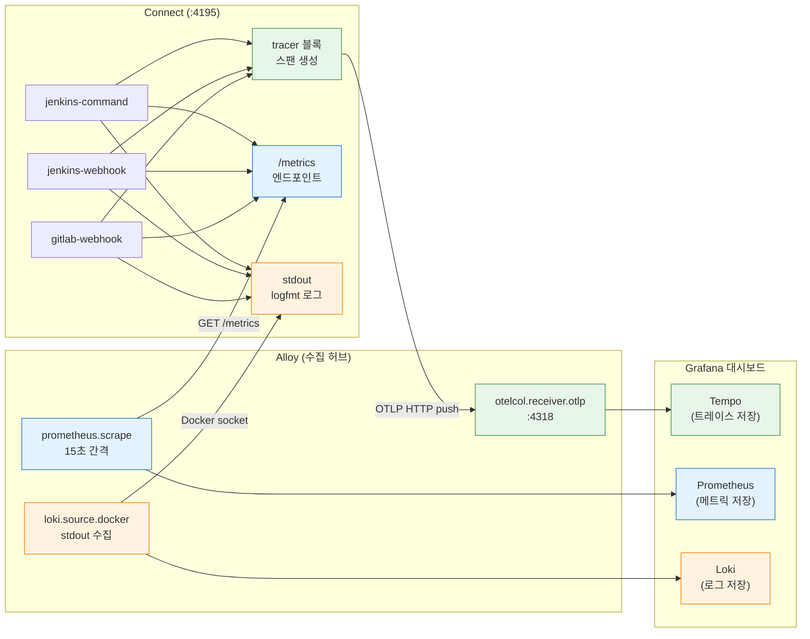

# Connect 관측성 설정

---

## streams 모드와 observability.yaml

Redpanda Connect는 `streams --chilled` 모드로 실행된다. 이 모드에서 `tracer`, `logger`, `metrics`, `http`는 파이프라인별이 아닌 서비스 전역 설정이다. 따라서 `-o` 플래그로 별도 파일(`observability.yaml`)에 둔다.

```bash
# docker-compose.yml의 command
redpanda-connect streams --chilled \
  -o /etc/connect/observability.yaml \
  /etc/connect/jenkins-command.yaml \
  /etc/connect/jenkins-webhook.yaml \
  /etc/connect/gitlab-webhook.yaml
```

- streams 모드에서 tracer 설정을 파이프라인 YAML에 넣으면 `field tracer not recognised` 경고가 발생한다. 반드시 `-o` 플래그 파일에만 넣어야 한다.

## Connect 메트릭

`observability.yaml`에서 `metrics: { prometheus: {} }`를 선언하면, Connect가 `http.address`(4195 포트)에서 Prometheus 포맷의 `/metrics` 엔드포인트를 노출한다. Connect 자체가 메트릭을 어딘가에 push하는 것이 아니라, "누가 와서 가져가라"는 pull 방식이다.

```bash
Connect(:4195/metrics)  ←── Alloy가 15초마다 GET 요청 (prometheus.scrape)
                             │
                             └──→ Prometheus(:9090)에 remote_write
                                    │
                                    └──→ Grafana에서 PromQL로 조회
```

| 메트릭                 | 타입      | 의미                                                         | Grafana에서 확인하는 방법                         |
| ---------------------- | --------- | ------------------------------------------------------------ | ------------------------------------------------- |
| `input_received`       | Counter   | 파이프라인이 Kafka/HTTP에서 읽어들인 메시지 누적 수          | `rate(input_received[5m])` — 초당 입력 처리량     |
| `output_sent`          | Counter   | 파이프라인이 출력(Kafka/HTTP)으로 보낸 메시지 누적 수        | `rate(output_sent[5m])` — 초당 출력 처리량        |
| `output_error`         | Counter   | 출력 전송 실패 횟수 (연결 거부, 타임아웃 등)                 | `increase(output_error[1h]) > 0` — 에러 발생 알림 |
| `processor_latency_ns` | Histogram | 프로세서(bloblang 등)가 메시지 하나를 변환하는 데 걸린 시간(나노초) | `histogram_quantile(0.99, ...)` — P99 처리 지연   |

- 이 메트릭들은 streams 모드에서 파이프라인 이름(`path` 라벨)별로 분리된다. 
  - 예를 들어 `input_received{path="jenkins-command"}`와 `input_received{path="jenkins-webhook"}`를 비교하면 어떤 파이프라인에 트래픽이 집중되는지 알 수 있다.

- `input_received`와 `output_sent`의 차이가 벌어지면 메시지가 프로세서에서 드롭되거나 필터링되고 있다는 뜻이다. 
  - `output_error`가 증가하면 다운스트림(Jenkins, Kafka 등)에 연결 문제가 있다는 신호다.


## Connect 관측성 데이터 흐름

Connect 하나의 인스턴스에서 3가지 관측성 신호(트레이스, 메트릭, 로그)가 각각 다른 경로로 수집된다.



- **초록 경로 (트레이스)**: Connect가 스팬을 생성하여 Alloy에 push → Alloy가 Tempo에 전달
- **파랑 경로 (메트릭)**: Alloy가 Connect의 `/metrics`를 주기적으로 pull → Prometheus에 remote_write
- **주황 경로 (로그)**: Connect의 stdout을 Docker 소켓을 통해 Alloy가 수집 → Loki에 전달


`observability.yaml`은 4개 블록으로 구성된다. 각 블록이 어떤 역할을 하는지 설명한다.

```yaml
# docker/shared/connect/observability.yaml

logger:
  level: INFO
  format: logfmt               # 구조화된 key=value 형식 (Docker 로그로 수집)
  add_timestamp: true
  static_fields:
    service: redpanda-connect   # 모든 로그에 service 필드 추가

metrics:
  prometheus: {}                # /metrics 엔드포인트 활성화 (Alloy가 스크래핑)

http:
  enabled: true
  address: "0.0.0.0:4195"      # REST API + 메트릭 + 헬스체크 공유 포트

tracer:
  open_telemetry_collector:
    http:
      - address: alloy:4318    # OTLP HTTP로 Alloy에 전송
    tags:
      service.name: redpanda-connect  # Tempo에서 서비스 구분
```

### logger 블록

Connect 프로세스의 내부 로그 출력 방식을 설정한다. Connect는 자체적으로 로그를 어딘가에 전송하지 않고, stdout으로 출력만 한다. 이 stdout 로그를 누가 수집하느냐는 인프라(Docker/Alloy) 영역이다.

- `format: logfmt`은 `ts=2026-03-16T14:35:31 level=info msg="Pipeline started" service=redpanda-connect` 같은 key=value 형식으로 출력한다. JSON 포맷도 선택할 수 있지만, logfmt이 사람이 읽기 쉽고 grep으로 필터링하기도 편하다. 
- `static_fields`의 `service: redpanda-connect`는 모든 로그 라인에 자동으로 `service=redpanda-connect`를 추가한다. Alloy가 Docker 소켓으로 이 로그를 수집한 뒤 Loki에 전달하면, Grafana에서 `{container="playground-connect"}`로 조회할 수 있다.

### **tracer 블록**

Connect가 메시지를 처리할 때마다 "어디서 얼마나 걸렸는지"를 스팬(span)으로 기록한다. 

- 예를 들어 jenkins-command 파이프라인이 Kafka에서 메시지를 읽고(input), bloblang으로 변환하고(processor), Jenkins에 HTTP POST하는(output) 과정을 각각 별도 스팬으로 생성한다. 
- Grafana Tempo에서 이 스팬들을 이어 붙이면 "이 메시지가 어떤 경로로 흘렀고, 어디서 병목이 생겼는지" 한눈에 보인다.

이 스팬 데이터를 OTLP HTTP 프로토콜로 `alloy:4318`에 push한다. `alloy`는 같은 Docker 네트워크 안의 Alloy 컨테이너 호스트네임이다. 

- Connect는 "Alloy에 보낸다"는 사실만 알고, 그 뒤에서 Alloy가 Tempo로 전달하는 것은 Connect와 무관하다. 
- Spring Boot의 트레이스 전송과 동일한 원리인데, Spring Boot는 호스트에서 실행되므로 `localhost:24318`(Docker 포트 매핑)을 쓰고, Connect는 Docker 내부에서 실행되므로 컨테이너명 `alloy:4318`을 직접 쓰는 차이만 있다.

### metrics 블록

`prometheus: {}`라고 빈 객체만 선언하면 Connect가 "메트릭을 Prometheus 포맷으로 준비해두겠다"는 뜻이다. 

- 별도 설정 없이 기본값만으로 `/metrics` 엔드포인트가 활성화된다. Connect가 메트릭을 어딘가에 보내는 것이 아니라, HTTP 포트(4195)에서 `/metrics` 경로로 요청이 오면 현재까지의 메트릭을 응답하는 pull 방식이다.

### http 블록

Connect가 여는 단 하나의 HTTP 서버 포트다. 이 포트 하나에 여러 기능이 묶여 있다:

| 경로         | 기능                                           | 누가 사용하는가 |
| ------------ | ---------------------------------------------- | --------------- |
| `/ready`     | 헬스체크 (컨테이너 liveness/readiness)         | Docker, K8s     |
| `/metrics`   | Prometheus 메트릭 (metrics 블록이 활성화한 것) | Alloy           |
| `/streams/*` | 파이프라인 CRUD REST API (streams 모드 전용)   | 관리자/디버깅   |

- 이 프로젝트에서 Connect는 **인스턴스 1개**(`playground-connect`, 포트 4195)가 `streams --chilled` 모드로 **파이프라인 3개**(jenkins-command, jenkins-webhook, gitlab-webhook)를 동시에 실행한다. 
- 파이프라인별 메트릭은 `path` 라벨로 구분되므로 인스턴스를 나눌 필요가 없다. Alloy는 `connect:4195` 하나만 스크래핑 타겟으로 등록한다.