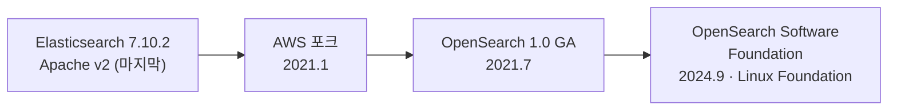
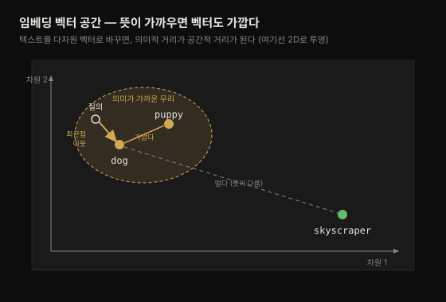
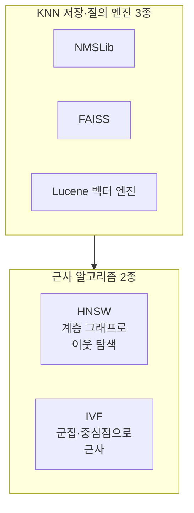
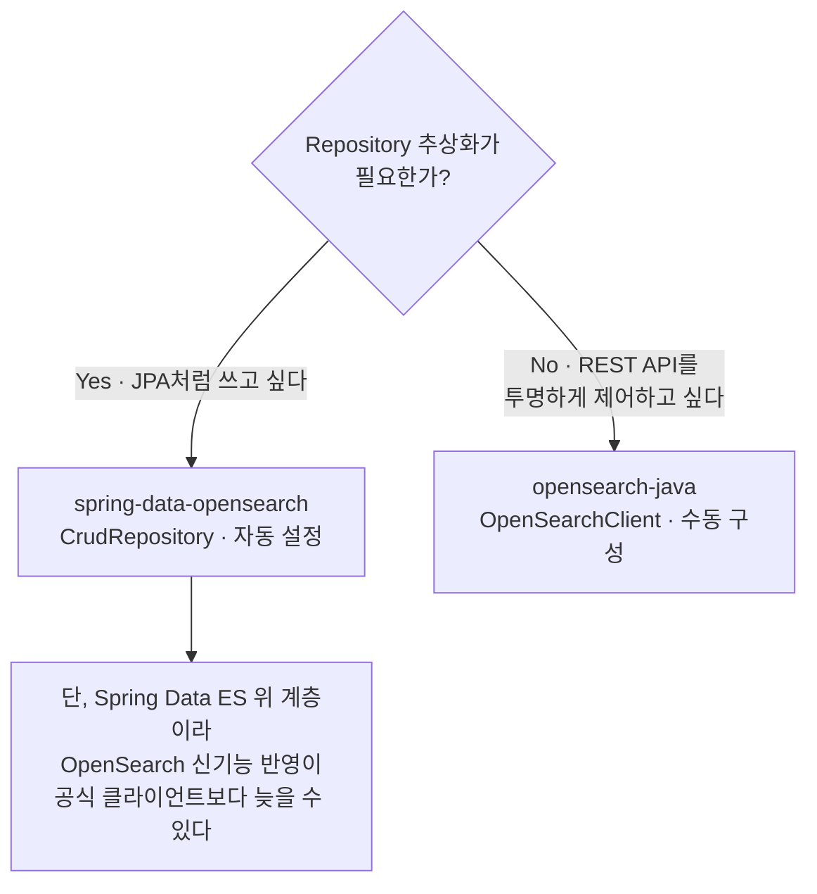

# OpenSearch 개요 — 진화·핵심 역량·활용 사례
---
> *The Definitive Guide to OpenSearch* 1장 정독 노트입니다.

## 핵심 요약
> OpenSearch는 관계형 DB의 ACID 보장을 포기하는 대신 수평 확장과 저지연을 얻은, REST API 기반 분산 검색·분석 엔진입니다.
>
> 이 하나의 트레이드오프에서 나머지가 전부 갈라져 나옵니다. ACID를 포기했기에 10만 ops/sec·페타바이트급으로 확장하고 p90 20~30ms를 냅니다. 검색이 본업이라 단어를 그대로 맞추는 어휘 검색에서 출발해, 뜻을 맞추는 시맨틱(벡터) 검색까지 품습니다. 그리고 그 검색 엔진의 집계 능력을 시간축 데이터에 돌리면 로그·트레이스·메트릭 분석 도구가 됩니다 — OpenSearch 활용의 절반이 여기입니다.

## 학습 목표

이 내용을 읽고 나면:

1. OpenSearch가 Elasticsearch에서 갈라져 나온 배경과 지금의 거버넌스를 설명할 수 있습니다.
2. 검색 엔진이 왜 ACID를 포기하고 무엇을 얻는지, 그 트레이드오프를 말할 수 있습니다.
3. 어휘 검색과 시맨틱 검색의 차이를 알고 언제 무엇을 쓸지 판단할 수 있습니다.
4. OpenSearch가 로그 분석 도구로 쓰이는 원리(집계·버킷)를 설명할 수 있습니다.
5. OpenSearch 프로젝트의 구성 요소(엔진·Dashboards·플러그인)를 구분할 수 있습니다.


## 본문 정리

### 1. 진화 여정 — 왜 포크되었나

OpenSearch는 Elasticsearch에서 갈라져 나왔습니다. Elasticsearch는 2010년 Apache License v2로 처음 나와, 속도·확장성에 개발자 친화적 API를 더해 빠르게 인기를 얻은 검색 엔진입니다. 문제는 라이선스였습니다. Elastic이 라이선스를 SSPL로 바꾸자, AWS는 2021년 1월 마지막 Apache 라이선스 버전인 **7.10.2를 포크**해 OpenSearch 프로젝트를 시작했습니다. 오픈소스로 남기려는 것이 목적이었습니다.

이후 흐름은 "완전한 오픈소스·커뮤니티 주도"라는 방향을 굳히는 과정입니다. 2021년 7월 OpenSearch 1.0이 정식 출시(GA)되었고, 2024년 9월에는 AWS와 SAP·Uber 등이 **OpenSearch Software Foundation**을 Linux Foundation 산하에 세웠습니다. 특정 벤더에 묶이지 않는 중립 거버넌스를 갖추기 위해서였습니다.



> 💬 **비유**: 오픈소스 프로젝트의 포크는 도로가 유료로 바뀔 때 갈라져 나오는 우회로와 비슷합니다. 원래 길(Elasticsearch)이 통행료(SSPL 제약)를 물리자, 사람들은 마지막으로 무료였던 지점(7.10.2)에서 새 길을 냈습니다.

### 2. 프로젝트 구성 — 엔진 하나가 아니다

OpenSearch를 "검색 엔진 하나"로 생각하면 절반만 본 것입니다. 실제로는 여러 하위 프로젝트가 묶인 소프트웨어 스위트입니다. 셋으로 나눠 보면 이해가 쉽습니다.

- **OpenSearch** — REST API 기반의 분산 시스템 본체. 데이터 저장·색인·검색을 담당합니다.
- **OpenSearch Dashboards** — GUI 프런트엔드. 질의를 던지고 시각화를 만드는 화면입니다.
- **약 40개 플러그인** — 이상 탐지(anomaly detection), 세분화된 접근 제어(FGAC), 알림(alerting), SQL 질의, 벡터 저장·검색 등 고급 기능을 얹습니다.

이 구조가 중요한 이유는, 뒤에 나올 벡터 검색이나 보안 같은 기능이 전부 본체가 아니라 **플러그인**으로 붙기 때문입니다. "OpenSearch가 이것도 되나요?"라는 질문의 답은 대개 "플러그인으로 됩니다"입니다.

### 3. 분산 DB와 ACID 트레이드오프 — 이 장의 심장

OpenSearch는 데이터베이스 계열 기술입니다. 인덱싱 API로 데이터를 넣고 검색 API로 꺼내며 인덱스라는 컨테이너에 저장합니다. 그런데 관계형 DB(RDBMS)와 결정적으로 다른 지점이 있습니다. **ACID를 보장하지 않습니다.**

관계형 DB는 ACID 4속성으로 데이터를 예측 가능하고 튼튼하게 지킵니다.

| 속성 | 뜻 | OpenSearch |
|------|-----|:----------:|
| Atomicity(원자성) | 트랜잭션 내 연산은 전부 성공하거나 전부 실패 | ✗ (원자적 연산 없음) |
| Consistency(일관성) | 일관된 읽기를 보장 | △ (결과적 일관성) |
| Isolation(격리성) | 연산끼리 간섭하지 않음 | ✗ |
| Durability(지속성) | 성공한 연산은 영속화 | ○ |

왜 이 좋은 보장을 포기할까요? ACID를 지키려면 확장에 한계가 생기기 때문입니다. OpenSearch는 ACID 제약을 풀고 데이터를 **평탄한(비정규화, denormalized) 형태**로 저장하며 여러 노드에 분산해 병렬 처리합니다. 그 대가로 얻는 것이 규모와 속도입니다 — 초당 10만 건 이상의 연산을 테라바이트에서 페타바이트급 데이터에 걸쳐 처리하고, 서버측 처리 시간은 한 자릿수 밀리초입니다. p90 지연은 20~30ms 수준입니다.

클러스터는 여러 노드로 구성되며 노드마다 역할이 있습니다. 가장 중요한 둘은 색인·저장·검색의 핵심 자원을 대는 **데이터 노드**와, 클러스터 상태를 유지하는 **클러스터 매니저 노드**입니다. 노드 유형은 2장에서 더 다룹니다.

> 💬 **비유**: 관계형 DB가 은행 창구라면 OpenSearch는 대형마트 계산대입니다. 은행 창구(ACID)는 한 건 한 건을 완벽히 장부에 남기지만 줄이 깁니다. 마트 계산대(검색 엔진)는 완벽한 원장 대신 계산대를 수십 개로 늘려, 훨씬 많은 손님을 훨씬 빨리 처리합니다.

### 4. 어휘 검색 — 단어를 맞춘다

OpenSearch의 첫 번째이자 가장 본질적인 용도가 어휘 검색(lexical search)입니다. 검색하는 사람은 찾고 싶은 것을 단어로 표현하고, OpenSearch는 그 단어를 문서 속 단어에 맞춥니다. 이걸 빠르게 하는 열쇠가 **인덱스와 그 내부 자료구조**입니다. 관계형 DB에 빗대면 대응이 깔끔합니다.

| 관계형 DB | OpenSearch |
|-----------|-----------|
| 테이블(table) | 인덱스(index) |
| 행(row) | 검색 문서(document) |
| 열(column) | 필드(field) |
| 셀(cell) | 필드 값 |

정형 메타데이터는 값을 정확히 일치시키고, 비정형 자유 텍스트(PDF·Word 등)는 **텍스트 분석**을 거칩니다. 분석은 자유 텍스트를 단어 단위로 쪼개고 자연어 규칙을 적용해 단어를 핵심 의미로 환원합니다(running → run). 예를 들어 `the quick brown fox jumped over the lazy dog`를 분석하면 `quick brown fox jump over lazi dog`가 됩니다. 이렇게 양쪽을 같은 방식으로 환원해 두면, 검색어가 형태가 달라도(`jumping foxes`) 문서와 맞출 수 있습니다.

### 5. 시맨틱 검색 — 뜻을 맞춘다

어휘 검색이 단어를 맞춘다면, 시맨틱 검색은 **의미를 맞춥니다**. 최근 몇 년 사이 Transformer 아키텍처와 BERT 계열 모델이 자연어 텍스트를 다루는 방식을 바꿔 놓으면서 가능해진 능력입니다.

원리는 임베딩(embedding)입니다. Amazon Titan Text Embeddings나 Anthropic Claude 같은 모델은 텍스트를 부동소수점 배열(보통 384·768·1,536차원)로 바꿉니다. 이 배열이 다차원 공간의 한 점(벡터)이며, **뜻이 비슷한 텍스트는 가까이, 다른 텍스트는 멀리** 놓이도록 학습됩니다. `dog`의 임베딩은 `puppy`와 가깝고 `skyscraper`와는 멉니다. 검색할 때는 질의도 임베딩으로 바꿔 그 벡터의 **최근접 이웃(nearest neighbor)**을 거리 기준으로 찾습니다.



이 최근접 이웃 탐색을 담당하는 것이 **KNN 플러그인**입니다. 문서가 적으면 모든 벡터와 대조하는 정확(exact) KNN을 쓰지만 벡터가 많아지면 전수 대조가 감당이 안 됩니다. 그래서 대략적(approximate) KNN으로 후보를 줄여 지연을 낮추고 정확도를 조금 내줍니다.



두 알고리즘의 접근이 다릅니다. **HNSW**(Lucene·NMSLib·FAISS 지원)는 계층 그래프를 씁니다 — 벡터가 노드, 가까운 이웃이 엣지입니다. 거친 단위에서 큰 걸음으로 시작해 점점 세밀한 단위로 내려가며 이웃을 찾습니다. **IVF**는 군집화로 근사합니다 — 색인 시점에 가까운 점들을 묶어 대표 중심점을 정하고, 질의 시점에 질의 벡터와 가장 가까운 중심점의 군집만 살핍니다. IVF에는 product quantization으로 벡터 저장 바이트를 줄여 공간·지연을 아끼는(정확도는 그만큼 내주는) 기법도 있습니다.

최신 기법으로 **희소 벡터(sparse vector)**도 있습니다. 조밀(dense) 벡터와 달리 원래 단어와의 관계를 유지하면서 가중치로 일반화 능력도 일부 얻습니다. Neural 플러그인은 색인·질의 시 임베딩 생성을 자동화하며, 전용 `ml` 역할 노드에서 모델을 돌리거나 Amazon Bedrock·SageMaker·Cohere·OpenAI 같은 외부 호스팅에 연결합니다.

### 6. 어휘 vs 시맨틱 — 무엇이 더 나은가

정답은 "상황에 따라 다르다"입니다. 정확한 문자열을 찾을 때는 어휘 검색(BM25)이 낫거나 대등합니다. 부품 번호 `Eastman 10733LF`를 검색하는 사람은 단어의 *의미*로 맞춘 결과를 원하지 않습니다 — 정확히 그 번호가 필요합니다. 반대로 `funny plot line의 훈훈한 가족 영화` 같은 질의는 뜻을 맞춰야 하므로 조밀 벡터 시맨틱 검색이 최선입니다.

그래서 둘을 섞는 **하이브리드 검색**(Neural 플러그인)이 있습니다. BM25 점수 질의와 벡터 점수 질의를 함께 돌려 점수를 정규화·결합합니다. 표준 벤치마크에서 시맨틱 검색은 BM25 대비 10~20%, 하이브리드 검색은 14~17% 정확도 향상을 냅니다.

### 7. 로그 분석 — 검색 능력을 시간축 데이터에 돌리다

OpenSearch 활용의 약 절반은 순수 검색이지만 나머지 절반은 트레이스·로그·메트릭 같은 **시계열 데이터**의 저장·검색·분석입니다. DevOps, 보안 모니터링, 애플리케이션·인프라 관측이 여기에 듭니다.

흥미로운 점은 이 능력이 검색 능력에서 자라났다는 것입니다. 검색 사이트의 **패싯(facet)** — Amazon에서 "golf shirt"를 검색하면 왼쪽에 뜨는 브랜드·가격대·색상별 통계 — 은 사실 필드 값을 버킷으로 묶어 개수를 센 것입니다. 이 집계(aggregation) 능력을 로그에 돌리면 분석 도구가 됩니다. 로그 한 줄(대개 문자열)을 파싱해 필드 이름을 붙이고 JSON으로 구조화해 색인하면, "가장 많이 접근된 리소스는?", "192.168.81.55가 몇 번 접근했나?" 같은 질문에 답할 수 있습니다.

```json
192.168.81.55 - - [01/Jul/1995:00:00:01 -0400] "GET /history/apollo/ HTTP/1.0" 200 6245
```

(1995년 7월 NASA 셔틀 발사 때 잡힌 Apache httpd 로그 예시입니다.)

### 8. Hello OpenSearch — 첫 질의

프로그래밍 책의 "Hello world"에 해당하는 실습입니다. OpenSearch는 분산 시스템이라 로컬 설치가 간단치 않아 책은 **playground.opensearch.org**를 권합니다. 접속하면 OpenSearch Dashboards와 연결되고 우상단 **Dev Tools**에서 질의를 던질 수 있습니다. 기본으로 채워진 질의가 전체 문서를 반환하는 `match_all`입니다.

```json
GET _search
{
  "query": {
    "match_all": {}
  }
}
```

좌측 창에 명령을 넣고 실행하면 우측 창에 응답이 옵니다. playground에는 로그·항공편·e-commerce 샘플 데이터와 대시보드가 미리 올라가 있어, `[eCommerce] Revenue Dashboard`를 열면 로그 데이터로 무엇을 할 수 있는지 감을 잡을 수 있습니다.


## 심화 학습
> 책 밖 조사분입니다. 본문 정리와 구분해 출처를 남깁니다.

### LGTM 스택과의 대비 — 이 노트를 관측성 폴더에 두는 이유

이 책을 `06_observability/`에 두는 이유가 여기서 드러납니다. 로그 저장 계층으로 이미 익힌 Grafana **Loki**([02-03](../../02_LGTMStack/02-03.Grafana%20Loki.md))와 OpenSearch는 *같은 로그 문제를 정반대 지점에서* 풉니다.

| 축 | Loki | OpenSearch |
|----|------|-----------|
| 인덱싱 | 라벨만 최소 인덱싱 | 전문(full-text) 역색인 |
| 저장 비용 | 싸다 | 크다 |
| 쿼리 표현력 | 라벨 필터 + grep 성격 | 임의 필드 집계·복합·시맨틱 |
| 적합한 곳 | 알려진 라벨로 좁혀 보는 로그 | 임의 텍스트를 파고드는 분석 |

Loki가 "저장은 싸게, 검색은 라벨로 좁혀서"라면, OpenSearch는 "저장 비용을 치르고 어떤 필드로든 파고든다"입니다. 어느 쪽이 옳다기보다, 로그를 *좁혀 보는가* 아니면 *파고드는가*로 갈립니다.

### Elasticsearch 라이선스 변경 배경

본문의 "AWS가 7.10.2를 포크했다"의 원인은 2021년 Elastic이 Elasticsearch·Kibana 라이선스를 Apache 2.0에서 **SSPL(Server Side Public License)** 및 Elastic License로 바꾼 사건입니다. SSPL은 서비스형으로 제공할 때 제약이 있어 OSI 공인 오픈소스로 인정받지 못합니다. 그래서 "완전한 오픈소스 대안"이라는 OpenSearch의 정체성이 만들어졌습니다. (출처: [opensearch.org — FAQ](https://opensearch.org/faq/), [AWS 발표](https://aws.amazon.com/blogs/opensource/introducing-opensearch/))


## 결정 치트시트
> 이 장의 판단 기준을 압축합니다.

**검색 방식 선택:**

| 상황 | 선택 | 이유 |
|------|------|------|
| 정확한 ID·부품번호·코드로 조회 | 어휘(BM25) | 의미가 아니라 정확 일치가 필요 |
| 자연어로 뜻을 물음("훈훈한 가족 영화") | 시맨틱(조밀 벡터) | 단어가 달라도 의미로 매칭 |
| 둘 다 필요·확신 없음 | 하이브리드 | BM25+벡터 결합, 벤치마크 14~17%↑ |
| 원어와의 관계도 유지하고 싶음 | 희소 벡터 | 단어 관계 유지 + 일반화 일부 |

**저장소 선택:**

| 상황 | 선택 | 이유 |
|------|------|------|
| 강한 일관성·트랜잭션 필수 | 관계형 DB | OpenSearch는 ACID 미보장 |
| 대용량·저지연 검색/분석 | OpenSearch | ACID 완화로 확장·속도 확보 |
| 알려진 라벨로 좁히는 로그 | Loki | 인덱싱 비용 최소 |
| 임의 필드 파고드는 로그 분석 | OpenSearch | 전문 역색인·집계 |


## 실무 적용 포인트

### 한 가지 실행 (규칙)

> OpenSearch를 검토할 때 **"이 데이터에 강한 일관성·트랜잭션이 필요한가?"를 먼저 묻는다.** 필요하면 OpenSearch는 검색·분석 보조로만 쓰고 원장은 관계형 DB에 둔다.

OpenSearch는 결과적 일관성이라, 원장(system of record)으로 쓰면 최근 쓰기가 즉시 안 보이거나 정합성이 깨질 수 있습니다. 관계형 DB를 원장으로 두고 OpenSearch를 검색·분석 계층으로 얹으면, DB 부하를 줄이면서 질의 시간을 초·분 단위에서 밀리초·초 단위로 낮추는 조합이 됩니다.

### 이런 상황에서 사용하세요
- 관계형 DB의 검색이 느려 부하를 덜어내고 싶을 때 (검색을 OpenSearch로 오프로드)
- 로그·트레이스·메트릭을 임의 필드로 파고들어 분석해야 할 때
- 자연어 질의나 추천처럼 의미 기반 매칭이 필요할 때 (벡터 검색)

### 주의할 점
- ⚠️ 결과적 일관성 — 쓰기 직후 즉시 읽기가 보장되지 않습니다. 원장 용도로 부적합.
- ⚠️ 비정규화 전제 — 관계형처럼 JOIN에 의존하는 정규화 설계는 OpenSearch에 맞지 않습니다. 평탄한 문서로 재설계해야 합니다.
- ⚠️ 벡터 검색은 공짜가 아님 — 임베딩 생성·`ml` 노드 운영 비용이 듭니다. 정확 일치면 어휘 검색이 더 쌉니다.


## Spring 앱 개발 관점
> 이 책은 REST API·Dashboards Dev Tools·Python 예제로 설명합니다. Spring 앱을 개발하는 시각에서 OpenSearch를 어떻게 붙이는지는 제가 공식 문서를 근거로 보강한 것입니다. 1장은 개념 중심 장이므로, 여기서는 **클라이언트를 연결하는 두 갈래**까지만 봅니다. 실제 인덱싱·검색 코드는 4·5장 노트에서 다룹니다.

OpenSearch를 자바에서 쓰는 길은 두 가지입니다. 이 책의 REST API가 자바 세계에서 어떻게 나타나는지를 각각 다르게 보여 줍니다.

### 갈래 1 — 공식 저수준 클라이언트 (opensearch-java)

OpenSearch 프로젝트가 직접 관리하는 공식 Java 클라이언트입니다. 본문 §3에서 본 "REST API로 데이터를 넣고 꺼낸다"를 타입 안전한 자바 메서드로 감싼 것이라, 책의 개념과 가장 곧게 대응됩니다.

```gradle
// build.gradle — 전송 계층은 Apache HttpClient 5
implementation 'org.opensearch.client:opensearch-java:3.9.0'
implementation 'org.apache.httpcomponents.client5:httpclient5:5.2.1'
```

```java
// OpenSearchClient 최소 연결 — 책의 "REST로 클러스터에 붙는다"의 자바판
HttpHost host = new HttpHost("http", "localhost", 9200);
OpenSearchTransport transport =
        ApacheHttpClient5TransportBuilder.builder(host).build();
OpenSearchClient client = new OpenSearchClient(transport);
```

`OpenSearchClient`가 진입점이고, 인덱싱·검색 API가 전부 이 객체의 메서드로 노출됩니다. Spring Boot에서는 이 `client`를 `@Bean`으로 등록해 주입해 씁니다 — 자동 설정이 거의 없어 구성은 직접 하지만 그만큼 REST API와 1:1로 투명합니다.

### 갈래 2 — Spring Data 추상화 (spring-data-opensearch)

`opensearch-project`가 관리하는 커뮤니티 프로젝트로, **Spring Data Elasticsearch 위에 지어졌습니다.** JPA를 쓰듯 `CrudRepository`를 상속한 인터페이스만 선언하면 CRUD가 생기는, 익숙한 Repository 패턴을 그대로 가져옵니다.

```gradle
// build.gradle — 스타터가 자동 설정을 얹어 준다
implementation 'org.opensearch.client:spring-data-opensearch-starter:3.1.0'
```

```java
// 도메인 POJO를 인덱스에 매핑하고, Repository만 선언하면 CRUD 완성
@Document(indexName = "movies")
public record Movie(@Id String id, String title, int year) {}

public interface MovieRepository extends CrudRepository<Movie, String> {
    List<Movie> findByTitle(String title);   // 메서드 이름으로 쿼리 파생
}
```

> ⚠️ **버전 정합 주의**: `spring-data-opensearch` 3.1.0은 **Spring Boot 4.1.x** 를 지원합니다(공식 호환 매트릭스 기준). Spring Boot 3.x 프로젝트라면 이 라이브러리의 하위 버전을 골라야 합니다 — 무작정 최신을 당기면 클래스패스가 깨집니다.

### 어느 갈래를 고를까



| 기준 | opensearch-java (공식) | spring-data-opensearch (커뮤니티) |
|------|------------------------|-----------------------------------|
| 관리 주체 | OpenSearch 프로젝트 | opensearch-project (Spring Data ES 기반) |
| 추상화 | 저수준 — REST와 1:1 | 고수준 — Repository 패턴 |
| 자동 설정 | 거의 없음(수동 Bean) | 스타터가 제공 |
| 신기능 반영 | 가장 빠름 | 상위 계층 거쳐 상대적으로 느림 |
| 적합 | 벡터·집계 등 세밀 제어 | 표준 CRUD 위주 도메인 |

정리하면, **REST API를 투명하게 제어하고 벡터·집계 같은 신기능을 빨리 쓰고 싶으면 공식 `opensearch-java`**, **JPA처럼 Repository로 도메인 CRUD를 빠르게 얹고 싶으면 `spring-data-opensearch`** 입니다. 관측성 맥락에서 로그 색인·집계를 세밀히 다룰 거라면 전자가, 애플리케이션 도메인 검색이라면 후자가 손에 맞습니다.


## 면접 대비

### 한 줄 정의
"OpenSearch란 ACID를 완화하는 대신 수평 확장과 저지연을 얻은, REST API 기반의 분산 검색·분석 엔진입니다. Elasticsearch 7.10.2에서 포크되었습니다."

### 핵심 포인트 3가지
1. **트레이드오프** — ACID(원자성·트랜잭션)를 포기하고 결과적 일관성·비정규화를 택해 10만 ops/sec·페타바이트급 확장과 p90 20~30ms를 얻습니다.
2. **두 검색** — 단어를 맞추는 어휘 검색(BM25, 역색인·스테밍)과 뜻을 맞추는 시맨틱 검색(임베딩·KNN·HNSW/IVF)이 있고 둘을 섞은 하이브리드도 있습니다.
3. **검색이 곧 분석** — 패싯(집계)을 시계열 로그에 돌리면 관측·분석 도구가 됩니다. 활용의 절반이 로그·트레이스·메트릭입니다.

### 자주 묻는 질문

Q: Elasticsearch와 무엇이 다른가요?
A: OpenSearch는 2021년 Elastic이 라이선스를 SSPL로 바꾸자 AWS가 마지막 Apache 라이선스 버전(7.10.2)을 포크한 것입니다. 지금은 Linux Foundation 산하 재단이 벤더 중립 거버넌스로 운영합니다.

Q: 왜 ACID를 포기하나요?
A: ACID를 지키면 확장에 한계가 생기기 때문입니다. 검색 엔진은 원장이 아니라 검색·분석이 본업이라, 일관성을 완화해 규모와 속도를 택합니다.

Q: 어휘 검색과 벡터 검색은 언제 갈리나요?
A: 정확한 문자열(부품번호 등)은 어휘 검색이, 자연어 의미 질의는 벡터 검색이 낫습니다. 확신이 없으면 둘을 결합한 하이브리드 검색을 씁니다.


## 핵심 개념 체크리스트
- [ ] OpenSearch가 Elasticsearch에서 포크된 이유와 시점을 한 문장으로 말할 수 있는가?
- [ ] 검색 엔진이 ACID를 포기하고 얻는 것과 잃는 것을 설명할 수 있는가?
- [ ] 어휘 검색의 역색인·텍스트 분석이 무엇인지 예로 들 수 있는가?
- [ ] 시맨틱 검색의 임베딩·KNN·HNSW를 개념 수준에서 설명할 수 있는가?
- [ ] OpenSearch가 로그 분석 도구가 되는 원리(집계·버킷)를 아는가?
- [ ] Loki와 OpenSearch의 로그 저장 트레이드오프를 비교할 수 있는가?


## 참고 자료
- 원본: *The Definitive Guide to OpenSearch* (Packt, ISBN 9781835885789) 1장 — 이 노트의 사실·수치·예시는 원문에서 추출했습니다.
- 공식 문서: [opensearch.org/docs](https://opensearch.org/docs/latest/)
- 프로젝트 거버넌스: [OpenSearch Software Foundation](https://opensearch.org/foundation)
- 실습: [OpenSearch Playground](https://playground.opensearch.org/)
- 관련 노트: [dgos_opensearch README](README.md) · [Grafana Loki](../../02_LGTMStack/02-03.Grafana%20Loki.md)
