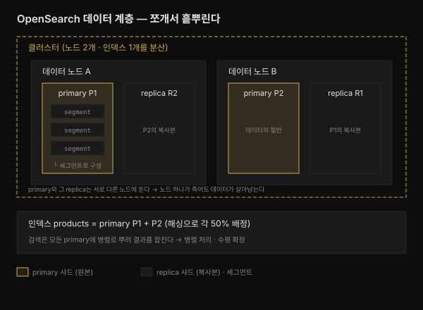

# 설치와 구성 — 노드·클러스터·샤드·세그먼트
---
> *The Definitive Guide to OpenSearch* 2장 정독 노트입니다.

## 핵심 요약
> OpenSearch 아키텍처는 데이터를 **노드 → 클러스터 → 인덱스 → 샤드 → 세그먼트**의 다섯 계층으로 나눠, 확장성·내결함성·고가용성을 얻습니다.
>
> 1장이 "OpenSearch가 무엇이고 왜 쓰는가"였다면, 2장은 "그것이 어떤 조각으로 이뤄져 있고 어떻게 세우는가"입니다. 데이터를 잘게 쪼개 여러 곳에 흩뿌리는 것이 이 장의 관통 아이디어입니다. 인덱스를 샤드로 쪼개 노드에 분산하면 병렬 검색과 수평 확장이 되고, 샤드를 복제하면 노드가 죽어도 데이터가 살아남습니다. 그 아래 세그먼트 계층은 색인된 데이터가 디스크에 자리 잡고 병합되는 물리적 단위입니다. 설치·Java·포트 요건은 이 계층 구조를 실제 장비 위에 올리기 위한 준비물입니다.

## 학습 목표

이 내용을 읽고 나면:

1. OpenSearch 노드 다섯 유형의 역할과 필수/선택 여부를 구분할 수 있습니다.
2. 노드·클러스터·인덱스·샤드·세그먼트의 계층 관계를 설명할 수 있습니다.
3. 샤딩이 어떻게 확장·병렬 처리·내결함성을 만드는지 말할 수 있습니다.
4. 세그먼트의 생성·flush·병합 과정을 설명할 수 있습니다.
5. OpenSearch 설치의 시스템 요건(Java 버전·네트워크 포트)을 판단할 수 있습니다.


## 본문 정리

### 1. 노드 — 클러스터의 최소 구성 단위

노드는 클러스터를 이루는 기본 블록이며, 저장·색인·검색·조율 중 하나 이상을 맡습니다. 대규모 환경에서는 노드 유형별로 장비를 나누지만, 개발 환경에서는 한 장비에 여러 역할을 별도 프로세스로 얹기도 합니다. 핵심은 **필수 노드와 선택 노드를 구분하는 것**입니다.

- **데이터 노드**(운영 필수) — 인덱스의 primary·replica 샤드를 실제로 보관합니다. 저장·검색·실시간 분석을 담당하며, 데이터 복원력·내결함성·고가용성의 근간입니다.
- **클러스터 매니저 노드**(필수, 옛 master node) — 클러스터 상태를 유지하고 인덱스 생성·삭제, 노드 추가·제거 같은 클러스터 전역 변경을 조율합니다. 클러스터의 안정성과 확장을 책임집니다.
- **인제스트 노드**(선택) — 색인 전에 들어오는 데이터를 변환·보강·필터링합니다. 로그 처리처럼 전처리가 필요할 때 씁니다.
- **코디네이팅 노드**(선택) — 클라이언트와 데이터 노드 사이 중개자입니다. 검색 요청을 적절한 데이터 노드로 분배하고, 각 샤드의 결과를 모아 병합해 돌려줍니다. 클러스터의 단일 진입점 역할도 합니다.
- **머신러닝 노드**(선택) — ML 모델의 학습·추론에 필요한 자원을 제공합니다. 이상 탐지·추천·자연어 처리 같은 작업에 씁니다.

> 💬 **비유**: 노드 유형은 식당의 역할 분담과 같습니다. 데이터 노드는 재료를 쌓아 두고 요리하는 주방(필수), 클러스터 매니저는 주문·인력을 조율하는 매니저(필수)입니다. 인제스트는 재료를 손질하는 준비 담당, 코디네이팅은 손님 주문을 받아 주방에 넘기고 접시를 모아 내는 서빙, ML 노드는 특별 요리 셰프입니다 — 셋은 규모가 커질 때 두는 선택 인력입니다.

### 2. 클러스터 — 노드를 엮어 하나의 시스템으로

여러 노드를 각자의 역할대로 엮으면 하나의 분산 시스템, 곧 클러스터가 됩니다. 중복 저장·부하 분산·자가 치유(self-healing) 덕분에 확장성·내결함성·고가용성이 나옵니다. 클러스터를 세우는 과정은 다섯 단계입니다.

1. **노드 프로비저닝** — 필요한 자원·설정을 갖춘 노드를 배포합니다(온프레미스 또는 클라우드).
2. **상호 연결** — 노드 사이 네트워크 연결을 맺어 통신·데이터 공유가 되게 합니다.
3. **구성** — 클러스터 설정, 노드 역할, 복제, 보안을 설정합니다.
4. **부트스트랩** — 클러스터 매니저 노드를 선출하고 일관성을 위한 정족수(quorum)를 세워 클러스터를 시동합니다.
5. **확장** — 데이터·사용자가 늘면 노드를 더해 성능을 유지합니다.

### 3. 인덱스와 샤드 — 데이터를 쪼개 흩뿌리다

인덱스는 관계형 DB의 테이블에 해당하는 데이터 컨테이너입니다(1장 참조). 문제는 인덱스가 한 장비에 다 들어가지 않을 만큼 커질 때입니다. OpenSearch는 인덱스를 **샤드(shard)**로 쪼개 여러 노드에 분산합니다.

문서를 색인하면 OpenSearch는 해싱 알고리즘으로 그 문서를 primary 샤드 하나에 배정합니다. 인덱스에 primary 샤드가 5개면 각 샤드가 데이터의 약 20%를 맡습니다. 검색 시에는 질의를 모든 관련 샤드에 뿌리고, 각 샤드가 자기 몫을 처리한 결과를 OpenSearch가 하나로 합쳐 응답합니다.

샤딩이 주는 이점은 세 가지입니다.

- **확장성** — 데이터를 여러 샤드에 분산해 대용량을 효율적으로 다룹니다.
- **병렬 처리** — 샤드별로 검색을 병렬 실행해 응답 시간을 줄입니다.
- **내결함성** — replica 샤드가 데이터를 이중화해, 노드가 죽어도 데이터를 잃지 않습니다.

> 💬 **비유**: primary 샤드는 원본 5권으로 나눈 백과사전이고, replica 샤드는 그 복사본입니다. 5명이 한 권씩 나눠 동시에 찾으면(병렬 처리) 빠르고, 한 명이 자리를 비워도 그 권의 복사본을 가진 사람이 대신 답합니다(내결함성).

### 4. 세그먼트 — 샤드 안의 물리적 저장 단위

샤드는 다시 **세그먼트(segment)**로 이뤄집니다. 문서가 인덱스에 추가되면 우선 메모리 안 세그먼트(in-memory segment)에 쓰입니다. 이 덕분에 색인·검색이 빠릅니다. OpenSearch는 주기적으로 이 메모리 세그먼트를 디스크로 flush해 on-disk 세그먼트를 만듭니다. 그래야 재시작·장애 후에도 데이터가 남습니다.

세그먼트가 잘게 많아지면 오버헤드가 커지고 질의 성능이 떨어집니다. 그래서 OpenSearch는 작은 세그먼트를 큰 세그먼트로 합치는 **세그먼트 병합(segment merging)**을 자동으로 수행합니다. 병합은 세그먼트 수를 줄여 질의 성능을 높이고 저장 공간을 아낍니다.

세그먼트가 주는 이점은 다음과 같습니다.

- **병렬 검색** — 여러 세그먼트를 동시에 검색해 성능을 높입니다.
- **효율적 갱신** — 갱신·삭제는 기존 세그먼트에서 문서를 폐기 표시하고 새 세그먼트에 새 버전을 씁니다.
- **고가용성** — 세그먼트가 노드 간 복제되어 노드 장애에도 데이터가 살아남습니다.

### 5. 시스템 요건 — Java와 네트워크 포트

OpenSearch는 호환되는 JRE 위에서 동작합니다. 각 릴리스는 Adoptium JDK가 번들로 딸려 오며 **최적 성능·호환성을 위해 번들 Java를 쓰는 것이 권장**됩니다. OpenSearch 버전별 Java 호환은 다음과 같습니다.

| OpenSearch 버전 | 호환 Java | 번들 Java |
|-----------------|-----------|-----------|
| 1.0–1.2.x | 11, 15 | 15.0.1+9 |
| 1.3.x | 8, 11, 14 | 11.0.23+9 |
| 2.0.0–2.11.x | 11, 17 | 17.0.2+8 |
| 2.12.0+ | 11, 17, 21 | 21.0.5+11 |

네트워크 포트는 컴포넌트별로 기본값이 정해져 있으며 `opensearch.yml`에서 바꿀 수 있습니다.

| 포트 | 컴포넌트 |
|------|----------|
| `443` | Amazon OpenSearch Service의 TLS Dashboards |
| `5601` | OpenSearch Dashboards |
| `9200` | OpenSearch RESTful API |
| `9300` | 노드 간 통신·transport·cross-cluster 검색 |
| `9600` | OpenSearch Performance Analyzer |

계층 전체를 한 그림으로 보면 관계가 분명해집니다.




## 심화 학습
> 책 밖 조사분입니다. 본문 정리와 구분해 출처를 남깁니다.

### primary vs replica 샤드 수는 성질이 다르다

책은 샤드를 "5개 primary + 5개 replica"로 예시하지만, 두 수의 성질 차이를 짚어 둘 만합니다. **primary 샤드 수는 인덱스 생성 시 고정되어 이후 바꾸려면 재색인(reindex)이 필요**합니다. 데이터가 해싱으로 primary에 배정되므로, primary 수가 바뀌면 배정이 전부 흐트러지기 때문입니다. 반면 **replica 수는 운영 중 자유롭게 늘리고 줄일 수 있습니다** — 복사본일 뿐이라 원본 배정에 영향이 없습니다. 그래서 primary 수는 초기 용량 산정에서 신중히 정하고, 읽기 부하·가용성은 replica로 조절하는 것이 실무 패턴입니다. (출처: [OpenSearch — Index settings](https://docs.opensearch.org/latest/im-plugin/index-settings/))

### cluster manager 정족수 — split-brain 방지

부트스트랩 단계의 "정족수(quorum)"는 분산 합의의 핵심 안전장치입니다. 클러스터 매니저 후보 노드가 홀수여야 하고, 과반이 살아 있어야 클러스터가 동작합니다. 네트워크가 둘로 갈려 양쪽이 각자 매니저를 뽑는 split-brain을 막기 위해서입니다. 3개 매니저 후보 중 2개가 정족수이며, 이 조건이 깨지면 클러스터는 쓰기를 멈춰 데이터 불일치를 예방합니다. (출처: [OpenSearch — Cluster formation](https://docs.opensearch.org/latest/tuning-your-cluster/cluster/))


## 결정 치트시트
> 이 장의 판단 기준을 압축합니다.

**노드 배치:**

| 상황 | 배치 | 이유 |
|------|------|------|
| 개발·소규모 | 한 장비에 여러 역할 | 자원 절약, 격리 불필요 |
| 운영 | 데이터·클러스터 매니저 노드 분리 | 안정성·복원력 확보 |
| 전처리 부하 큼 | 인제스트 노드 추가 | 색인 성능·데이터 품질 |
| 대규모 검색 트래픽 | 코디네이팅 노드 추가 | 질의 부하 분산·단일 진입점 |
| ML 워크로드 | ML 노드 분리 | 나머지 클러스터 영향 최소화 |

**샤드 설계:**

| 결정 | 기준 |
|------|------|
| primary 샤드 수 | 초기에 신중히 — 이후 변경은 재색인 필요 |
| replica 샤드 수 | 운영 중 조절 가능 — 읽기 부하·가용성으로 |
| Java 버전 | 번들 Java 사용 권장 (2.12+는 21.0.5+11) |


## Spring 앱 개발 관점
> 이 장은 인프라·아키텍처 개념이 중심입니다. Spring 앱을 개발하는 시각에서 노드·샤드·포트 개념이 실제 코드·설정에 어떻게 닿는지를 제가 공식 문서를 근거로 보강합니다.

2장의 개념이 Spring 앱에 닿는 지점은 **연결 설정**과 **인덱스 정의**입니다. 1장에서 본 두 클라이언트([01-01](01-01.OpenSearch%20개요%20—%20진화·핵심%20역량·활용%20사례.md) 참조)가 여기서 실제 설정값을 요구합니다.

### 포트·호스트는 연결 설정으로 들어온다

2장의 포트 표 중 앱이 붙는 곳은 **`9200`(REST API)** 입니다. `9300`(노드 간 통신)은 클러스터 내부용이라 앱이 직접 쓰지 않습니다. Spring Boot에서는 이 호스트·포트를 설정 파일로 빼는 것이 정석입니다.

```yaml
# application.yml — 9200(REST)에 붙는다. 9300은 노드 내부용이라 앱이 쓰지 않는다
opensearch:
  uris: https://localhost:9200
  username: admin
  password: ${OPENSEARCH_PASSWORD}   # 하드코딩 금지, 환경변수로
```

```java
// opensearch-java 저수준 클라이언트로 9200에 연결
HttpHost host = new HttpHost("https", "localhost", 9200);
OpenSearchTransport transport =
        ApacheHttpClient5TransportBuilder.builder(host).build();
OpenSearchClient client = new OpenSearchClient(transport);
```

### 샤드·replica 수는 인덱스 매핑에서 정한다

2장의 primary/replica 샤드 결정은 앱에서 인덱스를 만들 때 설정으로 드러납니다. spring-data-opensearch를 쓰면 `@Setting`으로 도메인 인덱스의 샤드 수를 선언합니다.

```java
// primary 5·replica 1 — 2장 e-commerce 예시와 같은 구성
@Document(indexName = "products")
@Setting(shards = 5, replicas = 1)
public record Product(@Id String id, String name, int price) {}
```

> ⚠️ **primary는 나중에 못 바꾼다**: `shards`(primary 수)는 인덱스 생성 시 고정되어, 바꾸려면 재색인이 필요합니다(위 심화 학습). 도메인 데이터 규모를 초기에 가늠해 정해야 합니다. `replicas`는 운영 중 조절 가능하니 부담이 덜합니다.


## 면접 대비

### 한 줄 정의
"OpenSearch 아키텍처란 데이터를 노드·클러스터·인덱스·샤드·세그먼트의 다섯 계층으로 나눠, 인덱스를 샤드로 분산하고 복제해 확장성·내결함성·고가용성을 얻는 구조입니다."

### 핵심 포인트 3가지
1. **노드 5종** — 필수는 데이터 노드(샤드 보관)와 클러스터 매니저 노드(상태 조율)이고, 인제스트·코디네이팅·ML은 선택입니다.
2. **샤딩** — 문서를 해싱으로 primary 샤드에 배정해 분산하고, 검색은 모든 샤드에 병렬로 뿌려 결과를 합칩니다. replica로 이중화해 노드 장애를 견딥니다.
3. **세그먼트** — 색인은 메모리 세그먼트에서 시작해 디스크로 flush되고, 작은 세그먼트는 자동 병합되어 성능을 유지합니다.

### 자주 묻는 질문

Q: primary 샤드 수와 replica 샤드 수의 차이는?
A: primary 수는 인덱스 생성 시 고정되어 바꾸려면 재색인이 필요합니다(해싱 배정이 흐트러지기 때문). replica 수는 복사본이라 운영 중 자유롭게 조절해 읽기 부하·가용성을 맞춥니다.

Q: 클러스터 매니저 노드가 하는 일은?
A: 클러스터 상태 유지, 인덱스 생성·삭제, 노드 추가·제거 같은 전역 변경을 조율합니다. 옛 이름은 master node이며, 부트스트랩 때 정족수를 세워 split-brain을 막습니다.

Q: 세그먼트 병합은 왜 필요한가요?
A: 세그먼트가 잘게 많아지면 오버헤드가 커지고 질의가 느려집니다. 작은 세그먼트를 큰 것으로 자동 병합해 세그먼트 수를 줄이면 질의 성능이 오르고 저장 공간도 절약됩니다.


## 핵심 개념 체크리스트
- [ ] 노드 다섯 유형과 필수/선택을 구분할 수 있는가?
- [ ] 노드·클러스터·인덱스·샤드·세그먼트의 계층 관계를 그릴 수 있는가?
- [ ] 샤딩이 확장·병렬·내결함성을 만드는 원리를 설명할 수 있는가?
- [ ] 세그먼트의 flush·병합 과정을 설명할 수 있는가?
- [ ] primary와 replica 샤드 수의 변경 가능성 차이를 아는가?
- [ ] OpenSearch 2.12+가 어떤 Java 버전을 쓰는지 아는가?


## 참고 자료
- 원본: *The Definitive Guide to OpenSearch* (Packt, ISBN 9781835885789) 2장 — 이 노트의 사실·수치·표는 원문에서 추출했습니다.
- 공식 문서: [OpenSearch — Cluster formation](https://docs.opensearch.org/latest/tuning-your-cluster/cluster/)
- 인덱스 설정: [OpenSearch — Index settings](https://docs.opensearch.org/latest/im-plugin/index-settings/)
- 설치 가이드: [OpenSearch — Install](https://docs.opensearch.org/latest/install-and-configure/install-opensearch/index/)
- 관련 노트: [01-01 OpenSearch 개요](01-01.OpenSearch%20개요%20—%20진화·핵심%20역량·활용%20사례.md) · [dgos_opensearch README](README.md)
