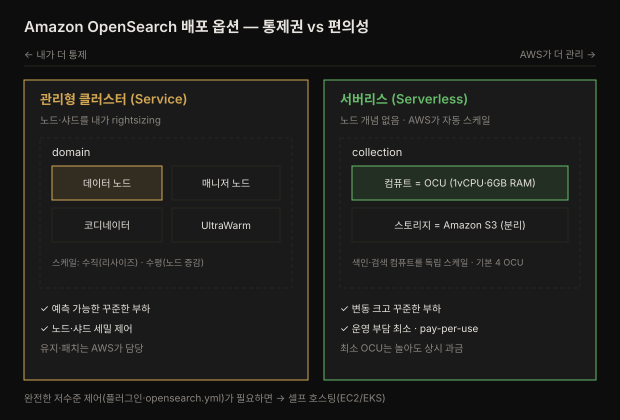

# 배포 옵션 — Amazon OpenSearch Service와 Serverless
---
> *The Definitive Guide to OpenSearch* 3장 정독 노트입니다.

## 핵심 요약
> OpenSearch를 AWS에 맡기는 길은 둘입니다 — 인프라를 직접 고르고 스케일하는 **관리형 클러스터(Service)**, 그리고 AWS가 용량까지 알아서 조절하는 **서버리스(Serverless)**. 통제권과 편의성 사이의 트레이드오프입니다.
>
> 2장이 OpenSearch를 직접 장비 위에 세우는 이야기였다면, 3장은 그 운영 부담을 AWS에 얼마나 넘기느냐의 선택입니다. 관리형 클러스터는 노드 타입·개수·샤드를 여전히 내가 정하되(rightsizing) 하드웨어 유지·패치는 AWS가 맡습니다. 서버리스는 그 노드 개념마저 사라지고, 컬렉션과 OCU라는 추상 단위로 AWS가 트래픽에 맞춰 자동 확장합니다. 예측 가능한 꾸준한 부하는 관리형이, 변동 심한 부하는 서버리스가 유리합니다.

## 학습 목표

이 내용을 읽고 나면:

1. Amazon OpenSearch Service의 관리형 클러스터 아키텍처(domain·노드 유형)를 설명할 수 있습니다.
2. rightsizing의 스토리지·CPU 산정 방식을 적용할 수 있습니다.
3. 수직 확장과 수평 확장의 차이와 트레이드오프를 구분할 수 있습니다.
4. 서버리스의 컬렉션·OCU·스토리지-컴퓨트 분리 개념을 설명할 수 있습니다.
5. 관리형 클러스터와 서버리스 중 언제 무엇을 고를지 판단할 수 있습니다.


## 본문 정리

### 1. Amazon OpenSearch Service — 관리형 클러스터

Amazon OpenSearch Service는 오픈소스 OpenSearch의 핵심 구성 요소를 대부분 공유하는 관리형 서비스입니다. Console·CloudFormation·Terraform·CLI·SDK·CDK로 API를 호출하면, 서비스가 **domain**을 만듭니다. domain은 OpenSearch 클러스터와 그 하드웨어, 관리 컴포넌트를 담는 단위입니다.

관리형 클러스터는 네 가지 노드를 지원합니다.

- **데이터 노드** — 인덱스와 샤드를 저장·색인합니다.
- **전용 클러스터 매니저 노드** — 클러스터 작업을 조율하고 메타데이터를 관리합니다. **운영 워크로드에는 전용 매니저 노드가 권장**됩니다.
- **전용 코디네이터 노드** — 요청 처리·분배를 클러스터 전체에 조율합니다.
- **UltraWarm 노드** — 시계열 데이터를 저비용으로 저장합니다.

핵심은 **운영 부담을 AWS가 진다**는 점입니다. 프로비저닝·설정·유지·소프트웨어 업데이트·패치를 AWS가 맡아, 나는 애플리케이션과 데이터에 집중합니다. 아키텍처는 자동 페일오버·자가 치유로 고가용성·내결함성을 갖춥니다.

> 💬 **비유**: 관리형 클러스터는 렌터카와 같습니다. 차종(노드 타입)과 대수(노드 개수)는 내가 고르지만, 정비·세차·보험(패치·유지·페일오버)은 렌터카 회사가 맡습니다. 운전대는 내가 잡되 관리는 넘기는 셈입니다.

### 2. Rightsizing — 얼마나 큰 클러스터가 필요한가

rightsizing은 데이터양·질의 패턴·자원 요구를 따져 노드 수·샤드 구성·하드웨어를 정하는 작업입니다(깊은 내용은 14장). 스토리지부터 산정하고 노드 타입을 고르는 순서입니다.

스토리지 산정 공식은 다음과 같습니다.

```pseudocode
Total Storage = (Data Volume + Index Overhead) × (1 + Number of Replicas)
그다음 × 1.25  (25% 여유 공간 확보)
```

Index Overhead는 원본 데이터의 -30%~+30% 범위이고, 초기에는 보수적으로 30%를 잡습니다. CPU는 대략 **활성 샤드당 1.5 CPU**를 기준으로 하되 동시성이 높으면 비율을 올립니다. RAM은 Java heap(대규모 워크로드에서 최대 32GB)과 off-heap 캐싱에 쓰입니다. 많을수록 캐시가 늘어 성능이 좋습니다.

샤드 크기는 인덱스의 비복제 스토리지를 나눠, **검색 워크로드는 30GB, 시계열 워크로드는 50GB** 샤드가 되도록 잡습니다. 참고로 인덱스 생성 시 기본 primary 샤드 수는 오픈소스가 1개, **관리형 클러스터는 5개**입니다.

> ⚠️ rightsizing은 한 번에 끝나지 않는 **반복 과정**입니다. CPU 사용률·디스크 I/O·질의 지연·캐시 적중률을 모니터링해 노드 추가·샤드 조정·매핑 튜닝을 이어 갑니다.

### 3. 스케일링 — 수직 vs 수평

부하가 변하면 domain 인프라를 조정합니다. 방법은 둘입니다.

| 구분 | 수직 확장(resizing) | 수평 확장(노드 증감) |
|------|---------------------|----------------------|
| 방식 | 인스턴스 타입·스토리지 용량 변경 | 데이터 노드 추가·제거 |
| 적합 | 기존 노드의 연산·저장 능력을 키울 때 | 클러스터 전체 용량을 조절할 때 |
| 대상 | 단일 노드 성능 | 노드 로컬 자원 한계(스토리지·heap·큐·대역폭·노드당 샤드 수) |
| 비용 | — | 노드 간 통신 오버헤드(특히 다중 노드 검색·집계) |

수평 확장은 노드 로컬 자원(스토리지 한계, heap 크기, 노드당 샤드 소프트 리밋 등)에 부딪힐 때 특히 유용합니다. 다만 노드가 늘면 노드 간 통신 오버헤드가 생기므로, 여러 노드에 걸친 검색·집계에서는 비용을 감안해야 합니다.

### 4. 스냅샷 — 백업과 재해 복구

스냅샷은 클러스터 전체 상태를 지정한 저장소에 담아, 데이터 손실·손상 시 전체 클러스터나 특정 인덱스를 복원하게 합니다. 두 종류가 있습니다.

- **수동 스냅샷** — 사용자가 직접 만드는 백업입니다. 온디맨드로 만들거나 정기 스케줄로 돌리며, 지정한 S3 버킷에 저장됩니다.
- **자동 스냅샷** — 시간·일·주 단위로 자동 실행됩니다. OpenSearch Service가 생성·보존·삭제까지 수명주기를 관리하며, 역시 S3에 저장됩니다.

### 5. Amazon OpenSearch Serverless — 노드가 사라진다

서버리스는 관리형 클러스터에서 한 발 더 나아가, **노드 프로비저닝·스케일·관리 자체를 없앱니다**. 인프라를 걱정하지 않고 애플리케이션 로직과 데이터에만 집중하게 합니다. 두 가지가 핵심입니다.

- **자동 스케일링** — 사용 패턴에 따라 자동으로 확장·축소하며, 수동 개입이 필요 없습니다.
- **Pay-per-use** — 소비한 자원만큼만 과금합니다. 선투자·장기 약정이 없어, 변동적이거나 예측 어려운 워크로드에 유리합니다.

서버리스의 단위는 노드가 아니라 **컬렉션(collection)**입니다. 컬렉션은 특정 워크로드(시계열·전문 검색·벡터 검색)를 위한 하나 이상의 인덱스 논리 묶음입니다. 컬렉션은 **스토리지와 컴퓨트를 분리**해, 인덱스는 S3에 저장하고 색인·질의용 컴퓨트는 **OCU(OpenSearch Compute Unit)**로 동적 할당합니다. 이 분리 덕분에 색인과 검색을 독립적으로 확장할 수 있습니다.

OCU 하나는 **1 vCPU · 120GB 스토리지 · 6GB RAM**을 제공합니다. 첫 컬렉션을 만들면 기본 4 OCU가 배포됩니다. 중복성을 끄면 4개의 half-OCU로 줄여 비용을 아낄 수 있습니다. 과금은 OCU·연계 S3 스토리지·아웃바운드 전송에 대해 시간 단위로 이뤄집니다.

관리형 클러스터와 서버리스의 관계를 한 그림으로 보면 선택 기준이 분명해집니다.




## 심화 학습
> 책 밖 조사분입니다. 본문 정리와 구분해 출처를 남깁니다.

### OpenSearch Service ≠ 셀프 호스팅 OpenSearch

관리형 서비스라도 셀프 호스팅과 완전히 같지는 않습니다. Amazon OpenSearch Service는 클러스터를 API 뒤에 감싸므로, **일부 플러그인 설치나 `opensearch.yml` 직접 편집 같은 저수준 제어가 제한**됩니다. 대신 도메인 설정·접근 정책을 AWS API·IAM으로 다룹니다. 완전한 제어가 필요하면 EC2·EKS에 직접 OpenSearch를 올리는 셀프 호스팅을, 운영 부담을 덜고 싶으면 관리형을 고릅니다. 이 노트가 속한 관측성 맥락에서는, 로그 저장소를 셀프 호스팅으로 세밀히 튜닝할지 관리형으로 운영을 넘길지의 결정이 됩니다. (출처: [AWS — Amazon OpenSearch Service features](https://aws.amazon.com/opensearch-service/features/))

### 서버리스 OCU 최소 비용의 함정

서버리스가 "쓴 만큼만" 과금이라 해도, 최소 OCU가 상시 돌기 때문에 **완전히 놀아도 기본 비용이 발생**합니다. 기본 4 OCU(중복성 유지 시)는 인덱싱 2 + 검색 2 구성이라, 트래픽이 0이어도 이 최소 용량이 유지됩니다. 그래서 서버리스는 "가끔 쓰는" 워크로드보다 **변동은 크되 꾸준히 쓰는** 워크로드에서 비용 이점이 큽니다. 완전히 간헐적인 부하라면 오히려 최소 OCU 비용이 부담일 수 있습니다. (출처: [AWS — OpenSearch Serverless pricing](https://aws.amazon.com/opensearch-service/pricing/))


## 결정 치트시트
> 이 장의 판단 기준을 압축합니다.

**배포 모델 선택:**

| 상황 | 선택 | 이유 |
|------|------|------|
| 노드·샤드를 세밀히 제어하고 싶음 | 관리형 클러스터 | rightsizing으로 하드웨어 직접 결정 |
| 예측 가능한 꾸준한 부하 | 관리형 클러스터 | 고정 용량이 비용 효율적 |
| 변동 크고 꾸준한 부하 | 서버리스 | 자동 스케일·pay-per-use |
| 운영 부담을 최대한 없애고 싶음 | 서버리스 | 노드 개념 자체가 사라짐 |
| 완전한 저수준 제어(플러그인·yml) | 셀프 호스팅(EC2/EKS) | 관리형은 일부 제어 제한 |

**스케일링 선택:**

| 상황 | 선택 | 이유 |
|------|------|------|
| 단일 노드 성능이 부족 | 수직 확장 | 인스턴스 타입·스토리지 키움 |
| 전체 용량·노드 로컬 한계 | 수평 확장 | 노드 추가 (단, 통신 오버헤드) |


## Spring 앱 개발 관점
> 이 장은 AWS 배포·운영이 중심입니다. Spring 앱을 개발하는 시각에서 배포 모델이 앱 코드·설정에 어떻게 닿는지를 제가 공식 문서를 근거로 보강합니다.

3장의 배포 모델 선택은 Spring 앱 입장에서 **연결 엔드포인트와 인증 방식**의 차이로 나타납니다. 앱 코드의 검색·색인 로직은 거의 같지만, 붙는 대상과 인증이 달라집니다.

### 관리형 클러스터 — domain 엔드포인트 + IAM 서명

관리형 클러스터는 domain 단위의 HTTPS 엔드포인트를 주고, 요청에 **AWS SigV4 서명**을 요구합니다(IAM 기반). opensearch-java 클라이언트는 AWS SDK와 연동해 이 서명을 붙입니다.

```java
// 관리형 domain에 붙을 때 — SigV4 서명 전송 (AwsSdk2Transport)
SdkHttpClient httpClient = ApacheHttpClient.builder().build();
OpenSearchClient client = new OpenSearchClient(
        new AwsSdk2Transport(
                httpClient,
                "search-mydomain-xxxx.ap-northeast-2.es.amazonaws.com",   // domain 엔드포인트
                "es",                                                     // 관리형 클러스터 서비스명
                Region.AP_NORTHEAST_2,
                AwsSdk2TransportOptions.builder().build()));
```

### 서버리스 — 컬렉션 엔드포인트 + 서비스명만 다름

서버리스도 코드는 거의 같고, **서비스명이 `es`가 아니라 `aoss`**(Amazon OpenSearch Serverless)로 바뀝니다. 붙는 대상이 domain이 아니라 컬렉션 엔드포인트라는 점만 다릅니다.

```java
// 서버리스 컬렉션에 붙을 때 — 서비스명이 "aoss"
new AwsSdk2Transport(
        httpClient,
        "xxxx.ap-northeast-2.aoss.amazonaws.com",   // 컬렉션 엔드포인트
        "aoss",                                      // 서버리스 서비스명 (관리형은 "es")
        Region.AP_NORTHEAST_2,
        AwsSdk2TransportOptions.builder().build());
```

> ⚠️ **인증 방식이 로컬과 다르다**: 1·2장의 로컬 예제는 username/password였지만, AWS 관리형·서버리스는 IAM 기반 SigV4 서명이 기본입니다. 앱에는 IAM 역할(예: EC2 인스턴스 프로파일·IRSA)을 붙여 자격증명을 주입하고, 코드에 키를 하드코딩하지 않습니다.


## 면접 대비

### 한 줄 정의
"Amazon OpenSearch의 배포 옵션이란 인프라를 직접 고르고 스케일하는 관리형 클러스터(Service)와, 노드 개념 없이 AWS가 자동 확장하는 서버리스(Serverless) 중 통제권과 편의성을 저울질해 고르는 선택입니다."

### 핵심 포인트 3가지
1. **관리형 클러스터** — domain 안에 데이터·매니저·코디네이터·UltraWarm 노드가 있고, rightsizing으로 하드웨어를 정하되 유지·패치는 AWS가 맡습니다.
2. **서버리스** — 노드 대신 컬렉션·OCU 단위입니다. 스토리지(S3)와 컴퓨트(OCU)를 분리해 자동 스케일하고 pay-per-use로 과금합니다.
3. **선택 기준** — 예측 가능한 꾸준한 부하는 관리형, 변동 큰 부하는 서버리스, 완전한 저수준 제어는 셀프 호스팅입니다.

### 자주 묻는 질문

Q: 수직 확장과 수평 확장의 차이는?
A: 수직은 인스턴스 타입·스토리지를 키워 단일 노드 성능을 올리고, 수평은 노드를 추가해 전체 용량을 늘립니다. 수평은 노드 로컬 한계를 넘을 때 유용하지만 노드 간 통신 오버헤드가 생깁니다.

Q: 서버리스의 OCU가 무엇인가요?
A: OpenSearch Compute Unit으로, 1 vCPU·120GB 스토리지·6GB RAM 단위입니다. 색인과 검색 컴퓨트를 OCU로 동적 할당하고 S3에 스토리지를 분리해, 둘을 독립적으로 확장합니다. 기본 4 OCU가 배포됩니다.

Q: 스토리지 산정 공식은?
A: (데이터양 + 인덱스 오버헤드) × (1 + replica 수) × 1.25입니다. 인덱스 오버헤드는 보수적으로 30%, 여유 공간 25%를 더합니다.


## 핵심 개념 체크리스트
- [ ] 관리형 클러스터의 domain·노드 4종을 설명할 수 있는가?
- [ ] rightsizing의 스토리지·CPU 산정을 적용할 수 있는가?
- [ ] 수직 확장과 수평 확장의 트레이드오프를 아는가?
- [ ] 서버리스의 컬렉션·OCU·스토리지-컴퓨트 분리를 설명할 수 있는가?
- [ ] 관리형과 서버리스를 언제 고를지 판단할 수 있는가?
- [ ] 관리형과 서버리스의 IAM 서비스명 차이(es vs aoss)를 아는가?


## 참고 자료
- 원본: *The Definitive Guide to OpenSearch* (Packt, ISBN 9781835885789) 3장 — 이 노트의 사실·수치·공식은 원문에서 추출했습니다.
- 공식 문서: [Amazon OpenSearch Service](https://docs.aws.amazon.com/opensearch-service/latest/developerguide/what-is.html)
- 서버리스: [Amazon OpenSearch Serverless](https://docs.aws.amazon.com/opensearch-service/latest/developerguide/serverless.html)
- 사이징: [OpenSearch Service — Sizing domains](https://docs.aws.amazon.com/opensearch-service/latest/developerguide/sizing-domains.html)
- 관련 노트: [02-01 설치와 구성](02-01.설치와%20구성%20—%20노드·클러스터·샤드·세그먼트.md) · [dgos_opensearch README](README.md)
