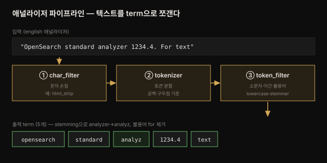

# 데이터 색인 — 인덱스·매핑·애널라이저
---
> *The Definitive Guide to OpenSearch* 4장 정독 노트입니다.

## 핵심 요약
> 데이터를 OpenSearch에 넣는 일은 곧 **매핑(스키마)과 애널라이저(텍스트 처리)를 설계하는 일**입니다. 색인 시점의 텍스트 처리가 나중의 검색 가능성을 결정합니다.
>
> 문서를 인덱스에 보내면 끝이 아닙니다. 인덱스는 필드의 스키마인 매핑을 갖고, 문자열 필드는 애널라이저를 거쳐 검색 가능한 단위(term)로 쪼개집니다. 이 처리가 잘못되면 아무리 좋은 질의를 던져도 원하는 문서를 못 찾습니다. 그래서 이 장의 핵심은 "어떻게 넣느냐"가 아니라 "넣을 때 어떤 매핑·애널라이저를 씌우느냐"입니다. 특히 `text`와 `keyword`의 구분, 그리고 char_filter→tokenizer→token_filter로 이어지는 분석 파이프라인이 중심입니다.

## 학습 목표

이 내용을 읽고 나면:

1. 인덱스에 문서를 색인하는 방법(`_doc`·`_bulk`)을 설명할 수 있습니다.
2. dynamic 매핑과 explicit 매핑의 차이와 선택 기준을 판단할 수 있습니다.
3. `text`와 `keyword` 필드 타입을 언제 쓸지 구분할 수 있습니다.
4. 애널라이저의 3단 처리(char_filter·tokenizer·token_filter)를 설명할 수 있습니다.
5. index template로 여러 인덱스에 매핑·설정을 재사용할 수 있습니다.


## 본문 정리

### 1. 색인의 기본 — 인덱스에 문서를 넣는다

OpenSearch도 데이터베이스 기술이라, 데이터를 담는 컨테이너와 그 데이터를 다루는 스키마가 있습니다. 관계형 DB의 테이블에 해당하는 컨테이너가 **인덱스**이고, 인덱스에 넣고 꺼내는 기본 단위가 **문서(document)**입니다. 문서는 원본 데이터(주로 트랜잭션 DB나 로그 수집 에이전트)에서 만들어 인덱스로 보냅니다.

문서 하나를 색인하는 가장 단순한 방법은 `_doc` API입니다.

```json
POST first_index/_doc/1
{
  "title": "OpenSearch 입문",
  "views": 1234
}
```

대량 색인은 `_bulk` API로 한 번에 처리합니다. 문서마다 요청을 보내면 느리므로, 여러 작업을 한 요청에 묶습니다.

```json
POST _bulk
{ "index": { "_index": "first_index", "_id": "1" } }
{ "title": "첫 문서", "views": 10 }
{ "index": { "_index": "first_index", "_id": "2" } }
{ "title": "둘째 문서", "views": 20 }
```

### 2. 매핑 — 인덱스의 스키마

매핑은 인덱스 필드의 타입을 정하는 스키마입니다. 두 방식이 있습니다.

**dynamic 매핑**은 매핑을 명시하지 않으면 OpenSearch가 값을 보고 타입을 자동 감지합니다. 규칙은 이렇습니다.

- `true`/`false` → `boolean`
- 숫자 → `long` 또는 `float`
- 중첩 JSON → `object`
- 배열 → 첫 값의 타입
- 문자열 → 날짜 감지(기본 켜짐)면 `date`, 숫자 감지(기본 꺼짐)면 `long`, 둘 다 실패하면 **`text`(+ `keyword` 서브필드)**

**explicit 매핑**은 인덱스 생성 시 타입을 직접 지정합니다. 운영에서는 자동 감지에 맡기기보다 명시하는 편이 안전합니다 — 첫 문서의 값에 타입이 좌우되면 예기치 않은 매핑이 굳어질 수 있기 때문입니다.

```json
PUT index_with_mapping
{
  "mappings": {
    "properties": {
      "title":  { "type": "text" },
      "status": { "type": "keyword" },
      "views":  { "type": "integer" }
    }
  }
}
```

> 💬 **비유**: dynamic 매핑은 손님이 처음 앉은 자리를 보고 좌석 배치를 정하는 것과 같습니다. 편하지만, 첫 손님이 어디 앉느냐에 따라 이후 배치가 엉킬 수 있습니다. explicit 매핑은 미리 좌석표를 짜 두는 것입니다.

### 3. text vs keyword — 이 장의 가장 중요한 갈림

문자열 처리야말로 OpenSearch를 여느 DB와 구별 짓는 지점입니다. 문자열 필드 타입 선택이 검색 동작을 통째로 바꿉니다.

- **`text`** — 파싱해서 term으로 쪼갠 뒤 역색인에 넣습니다. 영화 줄거리, CRM 상담 노트, 상품 리뷰처럼 **자유 텍스트**에 씁니다. 부분·형태 변화 매칭이 됩니다.
- **`keyword`** — 파싱하지 않고 문자열 통째로 저장·매칭합니다. 상품 카테고리, 상태명, 성별처럼 **변하지 않고 정확히 일치해야 하는** 값에 씁니다.

| 구분 | `text` | `keyword` |
|------|--------|-----------|
| 분석(파싱) | 함 (term으로 분해) | 안 함 (통째 저장) |
| 매칭 | 부분·형태 변화 | 정확 일치 |
| 용도 | 자유 텍스트(리뷰·본문) | 범주형(카테고리·상태) |
| 집계·정렬 | 부적합 | 적합 |

dynamic 매핑이 문자열을 `text` + `keyword` 서브필드로 만드는 이유가 여기 있습니다. 둘 다 필요할 수 있으니 양쪽을 다 만들어 둡니다.

### 4. 애널라이저 — 텍스트를 term으로 쪼개는 파이프라인

`text` 필드가 검색되려면 텍스트가 term으로 분해되어야 합니다. 이 일을 하는 것이 애널라이저이고, 세 단계를 거칩니다.



1. **char_filter** — 토큰화 전에 문자를 손봅니다(예: `html_strip`으로 HTML 태그 제거).
2. **tokenizer** — 문자열을 토큰으로 쪼갭니다(예: 공백·구두점 기준, 또는 `path_hierarchy`·`ngram`).
3. **token_filter** — 토큰을 후처리합니다(예: `lowercase`로 소문자화, 어간 추출, 불용어 제거).

기본 애널라이저는 `standard`입니다. `OpenSearch standard analyzer 1234.4. For text`를 standard로 분석하면 **6개 토큰**(`opensearch`, `standard`, `analyzer`, `1234.4`, `for`, `text`)이 나옵니다. 공백·구두점으로 끊고 소문자화하며, `1234.4` 안의 점과 문장 끝 마침표를 구별합니다.

같은 문장을 `english` 애널라이저로 분석하면 **5개 토큰**(`opensearch`, `standard`, `analyz`, `1234.4`, `text`)이 나옵니다. **stemming으로 `analyzer`가 `analyz`로 줄고**, 불용어 `for`가 제거됩니다. 이렇게 34개 언어 애널라이저가 어간 추출·불용어 제거·동의어를 적용합니다.

커스텀 애널라이저는 세 단계를 조립해 만듭니다.

```json
PUT index_with_custom_analyzer
{
  "settings": {
    "analysis": {
      "analyzer": {
        "text_with_urls": {
          "type": "custom",
          "tokenizer": "path_hierarchy",
          "char_filter": [ "html_strip" ],
          "filter": [ "lowercase" ]
        }
      }
    }
  }
}
```

> ⚠️ 애널라이저가 올바른 term을 못 만들면, 어떤 질의로도 그 문서를 찾을 수 없습니다. 문자열 필드 정의는 검색 성패를 가르는 지점이라 신중히 다뤄야 합니다.

### 5. index template — 매핑·설정을 재사용

로그처럼 날짜별로 인덱스를 새로 만드는 경우, 매번 매핑을 지정하긴 번거롭습니다. **index template**은 인덱스 이름 패턴에 매핑·설정을 미리 걸어, 그 패턴에 맞는 인덱스가 생기면 자동 적용합니다.

```json
PUT _index_template/logs_template
{
  "index_patterns": ["logs-*"],
  "template": {
    "settings": { "number_of_shards": 3 },
    "mappings": {
      "properties": {
        "@timestamp": { "type": "date" },
        "level":      { "type": "keyword" }
      }
    }
  }
}
```

이제 `logs-2024.07.13` 같은 인덱스를 만들면 이 템플릿이 자동으로 붙습니다. component template으로 공통 조각을 나눠 여러 템플릿이 재사용하게 조립할 수도 있습니다.


## 심화 학습
> 책 밖 조사분입니다. 본문 정리와 구분해 출처를 남깁니다.

### `refresh_interval` — 색인 속도와 검색 지연의 트레이드오프

책이 짚는 `index.refresh_interval`은 관측성 맥락에서 특히 중요합니다. 색인된 데이터는 Lucene이 RAM 버퍼의 세그먼트에 쌓다가, refresh 주기마다 새 IndexReader를 열어 디스크로 flush해야 **검색 가능**해집니다(2장의 세그먼트 flush와 같은 얘기입니다). 기본은 1초라 거의 실시간이지만, 대량 로그 색인에서는 이 주기를 늘려(예: 30초) refresh 비용을 줄이면 색인 처리량이 크게 오릅니다. 대신 새 데이터가 검색에 뜨기까지 지연이 늘어납니다 — 실시간성이 덜 중요한 로그 적재에서 흔히 쓰는 튜닝입니다. (출처: [OpenSearch — Refresh](https://docs.opensearch.org/latest/api-reference/index-apis/refresh/))

### 샤드 하나 = Lucene 인덱스 하나

책의 한 문장("Each OpenSearch shard is an autonomous instance of an Apache Lucene index")이 2장의 샤드·세그먼트를 매듭짓습니다. 샤드는 추상 개념이 아니라 **독립된 Lucene 인덱스 실체**이고, 그 안에 세그먼트가 들어 있습니다. 그래서 샤드 수를 정하면 곧 샤드당 데이터양(=샤드 크기)이 정해집니다. 질의가 대부분 문서를 걸러내면 샤드를 크게(수 적게), 많은 문서를 매칭하면 샤드를 작게(수 많게) 잡습니다. 상세 전략은 14장입니다. (출처: [OpenSearch — Shard settings](https://docs.opensearch.org/latest/im-plugin/index-settings/))


## 결정 치트시트
> 이 장의 판단 기준을 압축합니다.

**필드 타입 선택:**

| 값의 성격 | 타입 | 이유 |
|-----------|------|------|
| 자유 텍스트(리뷰·본문·줄거리) | `text` | 파싱·부분 매칭 필요 |
| 범주형(카테고리·상태·성별) | `keyword` | 정확 일치·집계·정렬 |
| 저장만 줄이고 싶은 텍스트 | `match_only_text` | 기능 축소 대신 저장 절감 |
| 정확 일치 + 부분 매칭 둘 다 | `text` + `keyword` 서브필드 | dynamic 기본 동작 |

**매핑 방식 선택:**

| 상황 | 선택 | 이유 |
|------|------|------|
| 프로토타입·탐색 | dynamic | 빠르게 시작 |
| 운영 인덱스 | explicit | 타입 고정, 예기치 않은 매핑 방지 |
| 날짜별 반복 인덱스(로그) | index template | 패턴에 매핑·설정 자동 적용 |


## Spring 앱 개발 관점
> 이 장은 REST/DSL 예제가 중심입니다. Spring 앱을 개발하는 시각에서 매핑·타입 선택이 도메인 코드에 어떻게 닿는지를 제가 공식 문서를 근거로 보강합니다.

4장의 매핑·필드 타입 결정은 Spring 앱에서 **도메인 POJO의 애노테이션**으로 드러납니다. spring-data-opensearch(=Spring Data Elasticsearch 기반)는 `@Field`로 필드 타입을 선언해, 애플리케이션 시작 시 인덱스 매핑을 자동 생성합니다.

### `text` vs `keyword`를 `@Field(type=...)`로 선언한다

본문 §3의 가장 중요한 갈림이 여기서 코드로 나타납니다. 자유 텍스트는 `FieldType.Text`, 범주형은 `FieldType.Keyword`로 명시합니다.

```java
// 4장의 text vs keyword 결정을 도메인에 박는다
@Document(indexName = "products")
public record Product(
        @Id String id,

        // 자유 텍스트 — 파싱·부분 매칭 (본문·리뷰)
        @Field(type = FieldType.Text, analyzer = "english")
        String description,

        // 범주형 — 정확 일치·집계 (카테고리)
        @Field(type = FieldType.Keyword)
        String category,

        @Field(type = FieldType.Integer)
        int price
) {}
```

`analyzer = "english"`처럼 본문 §4의 언어 애널라이저를 필드별로 지정할 수 있습니다. 자동 매핑에 맡기지 않고 이렇게 명시하면, 운영 중 첫 문서 값에 타입이 좌우되는 사고(§2의 explicit 매핑 권장)를 코드 수준에서 막습니다.

> ⚠️ **매핑은 나중에 못 바꾼다**: 이미 만들어진 인덱스의 필드 타입은 변경할 수 없어, 바꾸려면 새 인덱스를 만들어 재색인해야 합니다(2장 primary 샤드와 같은 제약). 그래서 `@Field` 타입을 처음에 정확히 정하는 것이 중요합니다.


## 면접 대비

### 한 줄 정의
"OpenSearch 색인이란 문서를 인덱스에 넣으면서 매핑(스키마)과 애널라이저(텍스트 처리)를 적용해, 자유 텍스트를 검색 가능한 term으로 만드는 과정입니다."

### 핵심 포인트 3가지
1. **text vs keyword** — 자유 텍스트는 `text`(파싱·부분 매칭), 범주형은 `keyword`(정확 일치·집계)입니다. 이 선택이 검색 동작을 통째로 바꿉니다.
2. **애널라이저 3단** — char_filter(문자 손질)→tokenizer(토큰 분할)→token_filter(소문자·어간·불용어)로 term을 만듭니다. standard는 6토큰, english는 stemming으로 5토큰이 됩니다.
3. **매핑 방식** — dynamic은 자동 감지로 빠르지만, 운영은 explicit이나 index template로 타입을 고정하는 편이 안전합니다.

### 자주 묻는 질문

Q: text와 keyword는 언제 갈리나요?
A: 파싱·부분 매칭이 필요한 자유 텍스트는 text, 변하지 않고 정확히 일치·집계·정렬해야 하는 범주형 값은 keyword입니다. dynamic 매핑은 문자열을 text + keyword 서브필드로 만들어 둘 다 대비합니다.

Q: 애널라이저가 하는 일은?
A: char_filter로 문자를 손질하고, tokenizer로 토큰을 쪼갠 뒤, token_filter로 소문자화·어간 추출·불용어 제거를 합니다. 이 처리가 잘못되면 올바른 term이 안 만들어져 검색이 실패합니다.

Q: dynamic 매핑의 위험은?
A: 첫 문서 값에 타입이 좌우되어 예기치 않은 매핑이 굳을 수 있습니다. 게다가 매핑은 이후 변경이 안 되어 재색인이 필요하므로, 운영에서는 explicit 매핑이나 index template로 타입을 미리 고정합니다.


## 핵심 개념 체크리스트
- [ ] `_doc`과 `_bulk`로 문서를 색인할 수 있는가?
- [ ] dynamic과 explicit 매핑의 차이를 아는가?
- [ ] `text`와 `keyword`를 값의 성격으로 구분할 수 있는가?
- [ ] 애널라이저의 3단 처리를 설명할 수 있는가?
- [ ] standard와 english 애널라이저의 출력 차이를 아는가?
- [ ] index template로 매핑을 재사용하는 이유를 아는가?


## 참고 자료
- 원본: *The Definitive Guide to OpenSearch* (Packt, ISBN 9781835885789) 4장 — 이 노트의 사실·코드·수치는 원문에서 추출했습니다.
- 공식 문서: [OpenSearch — Mappings](https://docs.opensearch.org/latest/field-types/)
- 텍스트 분석: [OpenSearch — Text analysis](https://docs.opensearch.org/latest/analyzers/)
- 인덱스 템플릿: [OpenSearch — Index templates](https://docs.opensearch.org/latest/im-plugin/index-templates/)
- 관련 노트: [02-01 설치와 구성](02-01.설치와%20구성%20—%20노드·클러스터·샤드·세그먼트.md) · [dgos_opensearch README](README.md)
