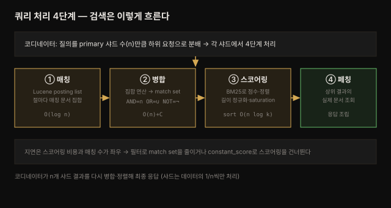

# 검색 핵심 API — 쿼리 처리와 leaf 쿼리
---
> *The Definitive Guide to OpenSearch* 5장 정독 노트입니다.

## 핵심 요약
> 검색은 **매칭 → 병합 → 스코어링 → 페칭**의 네 단계로 흐릅니다. 그리고 **text 쿼리(분석)와 term 쿼리(정확 일치)의 구분**이 검색의 핵심 갈림입니다.
>
> 4장이 데이터를 넣는 이야기였다면, 5장은 그것을 꺼내는 이야기입니다. 질의가 클러스터에 들어오면 코디네이터가 샤드로 나눠 뿌리고, 각 샤드는 Lucene으로 매칭 문서를 찾아(posting list) 집합 연산으로 병합한 뒤, BM25로 점수를 매겨 정렬하고, 상위 결과만 페칭합니다. 이 흐름 위에서 두 종류의 leaf 쿼리가 갈립니다 — `text` 필드를 분석해 매칭하는 match 계열과, `keyword` 필드를 정확히 일치시키는 term 계열입니다. 4장의 매핑 선택이 여기서 검색 동작으로 되돌아옵니다.

## 학습 목표

이 내용을 읽고 나면:

1. 검색 요청이 매칭·병합·스코어링·페칭 4단계로 처리되는 흐름을 설명할 수 있습니다.
2. TF-IDF와 BM25 스코어링의 핵심 아이디어를 말할 수 있습니다.
3. text 쿼리와 term 쿼리의 차이와 선택 기준을 판단할 수 있습니다.
4. Query DSL의 기본 형식으로 검색을 작성할 수 있습니다.
5. 페이지네이션 세 방식(from/size·scroll·PIT)의 한계와 용도를 구분할 수 있습니다.


## 본문 정리

### 1. 쿼리 처리 체인 — 검색은 어떻게 흐르는가

검색 요청은 먼저 **코디네이팅 노드**에 도착합니다(전용 코디네이터, 또는 데이터 노드가 그 역할을 겸함). 코디네이터는 요청을 파싱해, 인덱스의 primary 샤드 수만큼(n개) 하위 요청으로 쪼개 각 샤드에 뿌립니다. 데이터가 primary 샤드 집합에 고르게 분산돼 있으므로, n개 샤드에 뿌리면 인덱스 전체를 조회하는 셈입니다.

각 샤드 안에서 처리는 네 단계를 거칩니다.



1. **매칭(Matching)** — 요청을 Lucene 쿼리로 만들고, 각 절(clause)마다 그 절에 매칭되는 문서 집합인 **posting list**를 뽑습니다. Lucene 내부 자료구조(FST·BKD 트리·Trie) 덕분에 필드당 시간복잡도는 대략 log(n)이고, 조회 결과를 캐싱해 같은 값의 재질의는 거의 상수 시간이 됩니다.
2. **병합(Merging)** — posting list들을 집합 연산으로 합칩니다. `AND`는 교집합, `OR`는 합집합, `NOT`은 반전입니다. 결과가 이 질의의 **match set**입니다.
3. **스코어링·정렬(Scoring/Sorting)** — 매칭된 각 문서에 rank 함수로 점수를 매기고, 그 점수로 정렬해 검색자에게 중요한 문서를 위로 올립니다.
4. **페칭(Fetching)** — 상위 결과의 실제 문서 내용을 가져와 응답을 조립합니다.

> 💬 **비유**: 검색은 도서관 사서의 일과 같습니다. 매칭은 카드 목록에서 조건에 맞는 책 번호들을 찾는 것(posting list), 병합은 여러 조건을 AND/OR로 추리는 것, 스코어링은 "가장 관련 있는 순"으로 줄 세우는 것, 페칭은 그 순서대로 실제 책을 서가에서 꺼내 오는 것입니다.

### 2. 스코어링 — TF-IDF에서 BM25로

스코어링 함수는 문서와 질의의 **유사도**를 재는 일입니다. OpenSearch의 옛 기본은 **TF-IDF**(Term Frequency-Inverse Document Frequency)로, 매칭 term마다 IDF 값을 구하고 문서별로 TF를 곱해 합산합니다. 오늘날은 이를 개선한 **Okapi BM25**를 씁니다.

BM25가 TF-IDF에 더한 두 가지가 핵심입니다.

- **문서 길이 정규화** — 긴 문서일수록 term이 우연히 많이 등장하므로, 길이로 정규화해 짧은 문서가 불리해지지 않게 합니다.
- **saturation(포화)** — 같은 term이 아무리 많아도 점수가 무한히 오르지 않도록 상한을 둡니다. 어느 지점을 넘으면 추가 등장의 기여가 줄어듭니다.

정리하면 (포화점까지는) 매칭이 많을수록 점수가 높고, 흔한 term은 IDF가 낮아 점수가 작습니다.

### 3. 시간복잡도와 constant_score

각 단계의 비용을 알면 지연을 줄일 지점이 보입니다.

| 단계 | 시간복잡도 | 의미 |
|------|-----------|------|
| posting list 조회 | O(log n) | n = 필드의 고유 값 수 |
| match set 병합 | O(n)+C | 가장 짧은 posting list 길이에 준선형 |
| 정렬 | O(n log k) | n = 매칭 수, k = 가져올 결과 수 |

전체 지연은 **스코어링 비용과 매칭 수**가 좌우합니다. 그래서 **필터로 match set을 줄이면** 지연이 크게 줄어듭니다. 스코어링이 필요 없는 필터링에는 `constant_score` 쿼리(6장)를 써서 스코어링 자체를 건너뛰면 더 빠릅니다.

### 4. Query DSL과 leaf 쿼리 — text vs term

검색은 `_search` 엔드포인트에 JSON 형식의 Query DSL로 보냅니다. 가장 기본이 되는 단일 조건 쿼리를 **leaf 쿼리**라 하고, 크게 둘로 갈립니다.

**text 쿼리** — `text` 필드를 대상으로, 질의를 **분석(analyze)**해서 매칭합니다. `simple_query_string`이 가장 단순하며, 질의를 분석해 하나 이상의 필드에 term을 맞춥니다.

```json
GET movies/_search
{
  "query": {
    "simple_query_string": {
      "query": "Star Wars",
      "fields": ["title"]
    }
  }
}
```

**term 쿼리** — `keyword` 필드를 대상으로, **분석하지 않고 정확히** 일치시킵니다. 애플리케이션이 만든 범주형 값에 씁니다.

```json
GET movies/_search
{
  "query": {
    "term": {
      "genres.keyword": { "value": "Adventure" }
    }
  }
}
```

> ⚠️ **term 쿼리는 대소문자까지 정확히**: `keyword` 필드는 분석되지 않으므로, 위 질의를 `adventure`(소문자)로 던지면 **결과가 0건**입니다. 4장의 text vs keyword 선택이 여기서 검색 동작으로 되돌아옵니다 — 분석된 `text`는 대소문자·형태 변화를 흡수하지만, `keyword`의 term 쿼리는 저장된 값과 글자 그대로 맞아야 합니다.

여러 값을 한 필드에 매칭하려면 `terms` 쿼리를 씁니다.

### 5. 페이지네이션 — 세 가지 방식과 한계

기본은 상위 10건을 반환하며, `from`·`size`로 페이지를 넘깁니다. 다만 이 방식엔 두 한계가 있습니다.

- **10,000건 한계** — `from`+`size`로는 10,001번째 이상 결과에 접근할 수 없습니다.
- **순서 불안정** — 페이지를 넘기는 사이 데이터가 추가·수정·삭제되면 순서가 흔들려 중복·누락이 생깁니다.

이 한계를 넘는 두 방식이 있습니다.

| 방식 | 용도 | 특징 |
|------|------|------|
| `from`/`size` | 앞쪽 소량 페이지(UI 페이징) | 10,000건 한계·순서 불안정 |
| `scroll` | 대량 결과 일괄 처리 | scroll 컨텍스트로 순서 보존, 스냅샷 시점 고정 |
| PIT(point in time) + `search_after` | 안정적 딥 페이징 | 시점 고정 + 커서 기반, scroll 대체 권장 |

`scroll`은 URL에 컨텍스트 유지 시간을 주고(`?scroll=5m`), 응답의 `_scroll_id`로 다음 페이지를 이어 받습니다.


## 심화 학습
> 책 밖 조사분입니다. 본문 정리와 구분해 출처를 남깁니다.

### 왜 필터는 스코어링을 건너뛰어 빠른가 — query vs filter context

본문의 "필터로 match set을 줄이면 지연이 준다"를 한 겹 더 들어가면 **query context와 filter context**의 구분이 있습니다. bool 쿼리의 `must`·`should`에 넣은 절은 query context라 관련도 점수(`_score`)를 계산하지만, `filter`·`must_not`에 넣은 절은 filter context라 **점수를 매기지 않고 매칭 여부만** 봅니다. 그래서 filter는 스코어링 비용을 피하고, 게다가 결과를 **캐싱**해 재사용합니다. 관측성 맥락에서 "지난 1시간·level=ERROR" 같은 조건은 점수가 무의미하므로 filter에 두는 것이 정석입니다 — 본문의 `constant_score`도 같은 원리입니다. (출처: [OpenSearch — Query and filter context](https://docs.opensearch.org/latest/query-dsl/query-filter-context/))

### scroll보다 PIT + search_after가 권장되는 이유

본문은 scroll을 소개하지만, 최신 OpenSearch는 딥 페이징에 **PIT(Point In Time) + `search_after`**를 권장합니다. scroll은 컨텍스트가 특정 쿼리에 묶여 서버 자원을 오래 잡는 반면, PIT는 인덱스 상태의 시점만 고정해 여러 쿼리가 그 시점을 공유할 수 있어 더 유연합니다. `search_after`는 마지막 결과의 정렬 값을 커서로 이어받아 10,000건 한계 없이 안정적으로 페이징합니다. (출처: [OpenSearch — Point in Time](https://docs.opensearch.org/latest/search-plugins/point-in-time/))


## 결정 치트시트
> 이 장의 판단 기준을 압축합니다.

**쿼리 타입 선택:**

| 대상 | 쿼리 | 이유 |
|------|------|------|
| `text` 필드(자유 텍스트) | match·simple_query_string | 질의를 분석해 term 매칭 |
| `keyword` 필드(범주형) | term·terms | 분석 없이 정확 일치 |
| 점수 불필요한 조건 | filter·constant_score | 스코어링 건너뛰어 빠름·캐싱 |

**페이지네이션 선택:**

| 상황 | 선택 | 이유 |
|------|------|------|
| UI 앞쪽 페이지(≤10,000) | from/size | 랜덤 접근 간단 |
| 대량 일괄 추출 | scroll | 순서 보존 |
| 안정적 딥 페이징 | PIT + search_after | 10,000 한계 없음, scroll 대체 |


## Spring 앱 개발 관점
> 이 장은 Query DSL 예제가 중심입니다. Spring 앱을 개발하는 시각에서 text/term 쿼리와 페이지네이션이 코드에 어떻게 닿는지를 제가 공식 문서를 근거로 보강합니다.

5장의 두 leaf 쿼리는 Spring 앱에서 **Repository 메서드**나 **NativeQuery**로 나타납니다. spring-data-opensearch(=Spring Data Elasticsearch 기반)는 4장의 `@Field` 타입에 맞춰 쿼리를 만듭니다.

### 메서드 이름으로 파생되는 쿼리

간단한 검색은 Repository 메서드 이름으로 파생합니다. 필드 타입에 따라 내부적으로 match(text) 또는 term(keyword) 쿼리가 됩니다.

```java
public interface MovieRepository extends ElasticsearchRepository<Movie, String> {
    // text 필드 title → match 쿼리로 파생 (분석됨)
    List<Movie> findByTitle(String title);

    // keyword 필드 category → term 쿼리로 파생 (정확 일치)
    List<Movie> findByCategory(String category);
}
```

### 복잡한 쿼리는 NativeQuery + 페이지네이션

filter context나 복합 조건은 `NativeQuery`로 직접 조립하고, 페이지네이션은 Spring Data의 `Pageable`로 다룹니다. `Pageable`은 내부적으로 from/size에 대응하므로, 본문 §5의 10,000건 한계가 그대로 적용됩니다.

```java
// filter context — 점수 없이 매칭만 (본문 §3·심화)
NativeQuery query = NativeQuery.builder()
        .withQuery(q -> q.bool(b -> b
                .must(m -> m.match(t -> t.field("title").query("Star Wars")))
                .filter(f -> f.term(t -> t.field("genres.keyword").value("Adventure")))))
        .withPageable(PageRequest.of(0, 20))
        .build();
SearchHits<Movie> hits = operations.search(query, Movie.class);
```

> ⚠️ **딥 페이징은 Pageable로 안 된다**: `Pageable`은 from/size 기반이라 10,000건을 넘길 수 없습니다. 대량 추출이 필요하면 `operations.searchForStream(...)`이 반환하는 `SearchHitsIterator`(내부적으로 scroll)나 `search_after`를 직접 써야 합니다 — 본문 §5의 한계가 Spring에서도 똑같이 적용됩니다.


## 면접 대비

### 한 줄 정의
"OpenSearch 검색이란 코디네이터가 질의를 샤드로 뿌리고, 각 샤드가 매칭·병합·스코어링·페칭 4단계로 처리해 BM25 점수 순으로 결과를 돌려주는 과정입니다."

### 핵심 포인트 3가지
1. **처리 4단계** — 매칭(posting list, log n)→병합(AND 교집합·OR 합집합)→스코어링(BM25)→페칭입니다. 지연은 스코어링 비용과 매칭 수가 좌우합니다.
2. **text vs term** — text 쿼리는 질의를 분석해 `text` 필드에 매칭하고, term 쿼리는 분석 없이 `keyword` 필드에 정확 일치시킵니다(대소문자까지).
3. **페이지네이션** — from/size는 10,000건 한계·순서 불안정, scroll은 순서 보존, PIT+search_after는 안정적 딥 페이징입니다.

### 자주 묻는 질문

Q: TF-IDF와 BM25의 차이는?
A: 둘 다 term 빈도·희소성으로 유사도를 재지만, BM25는 문서 길이 정규화와 saturation(term이 많아도 점수 상한)을 더해 TF-IDF를 개선했습니다. 오늘날 OpenSearch의 기본 스코어링입니다.

Q: text 쿼리와 term 쿼리는 언제 갈리나요?
A: 분석이 필요한 `text` 필드(자유 텍스트)는 match 계열, 분석 없이 정확 일치할 `keyword` 필드(범주형)는 term 계열입니다. keyword에 term 쿼리를 던질 때는 대소문자까지 정확히 맞아야 합니다.

Q: 검색 지연을 줄이려면?
A: 필터로 match set을 줄입니다. 점수가 필요 없는 조건은 filter context나 constant_score에 두면 스코어링을 건너뛰고 결과를 캐싱해 빨라집니다.


## 핵심 개념 체크리스트
- [ ] 쿼리 처리 4단계를 순서대로 설명할 수 있는가?
- [ ] 병합의 AND(교집합)·OR(합집합)·NOT(반전)을 아는가?
- [ ] BM25가 TF-IDF에 더한 두 가지(길이 정규화·saturation)를 아는가?
- [ ] text 쿼리와 term 쿼리를 필드 타입으로 구분할 수 있는가?
- [ ] from/size의 10,000건 한계와 순서 불안정을 아는가?
- [ ] scroll과 PIT+search_after의 차이를 아는가?


## 참고 자료
- 원본: *The Definitive Guide to OpenSearch* (Packt, ISBN 9781835885789) 5장 — 이 노트의 사실·코드·수치는 원문에서 추출했습니다.
- 공식 문서: [OpenSearch — Query DSL](https://docs.opensearch.org/latest/query-dsl/)
- 스코어링: [OpenSearch — BM25 similarity](https://docs.opensearch.org/latest/search-plugins/search-relevance/)
- 페이지네이션: [OpenSearch — Paginate results](https://docs.opensearch.org/latest/search-plugins/searching-data/paginate/)
- 관련 노트: [04-01 데이터 색인](04-01.데이터%20색인%20—%20인덱스·매핑·애널라이저.md) · [dgos_opensearch README](README.md)
