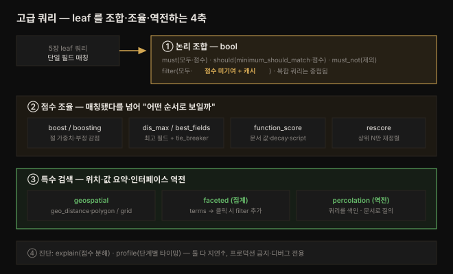

# 고급 쿼리 — 복합·지리·faceted·percolation

---

> 5장에서 단일 필드를 매칭하는 leaf 쿼리를 익혔다면, 6장은 그 단일 조건을 **조합·조율·역전**하는 방법을 다룹니다. 여러 조건을 논리로 묶고(compound), 점수를 원하는 방향으로 비틀고(boosting·function_score), 위치로 거르고(geospatial), 결과를 값별로 요약해 사용자가 다시 좁히게 하고(faceted), 급기야 "문서로 쿼리를 찾는" 인터페이스 역전(percolation)까지 갑니다.


## 핵심 요약

> 이 장의 한 문장은 **"단일 필드 매칭을 넘어 여러 의도를 하나의 검색으로 조합·조율한다"** 입니다. 5장의 leaf 쿼리는 "제목에 star wars가 있는가" 같은 조건 하나만 봤지만, 실무 검색은 "Sci-Fi 장르이면서 1977~1983년 개봉이고 Star Wars 시리즈를 선호"처럼 여러 조건이 얽힙니다.
>
> 이를 푸는 축이 셋입니다. 첫째 **논리 조합** — `bool` 쿼리로 must·should·must_not·filter 를 엮어 다중 조건을 표현하고, `filter` 절은 점수에 기여하지 않는 대신 캐시되어 빠릅니다. 둘째 **점수 조율** — boosting·dis_max·function_score·rescore 로 "매칭됐다"를 넘어 "어떤 순서로 보일까"를 제어합니다. 셋째 **특수 검색** — 위치(geospatial), 값 요약(faceted), 쿼리-문서 역전(percolation)이라는 전문 도구를 얹습니다. 여기에 explain·profile API 가 "왜 이 순서인가"를 진단해 줍니다.

아래 그림이 이 장 전체의 지도입니다 — 5장 leaf 쿼리를 출발점으로 네 축이 뻗어 나갑니다.




## 학습 목표

1. `bool` 쿼리의 네 절(must·should·must_not·filter)과 `minimum_should_match` 로 다중 조건 검색을 조립할 수 있습니다.
2. filter context 가 점수에 기여하지 않고 캐시된다는 차이를 이해하고, 언제 must 대신 filter 를 써야 하는지 판단할 수 있습니다.
3. boosting·dis_max·function_score·rescore 로 관련도(relevance) 순서를 원하는 방향으로 조정할 수 있습니다.
4. `geo_point`/`geo_shape` 매핑 위에서 geo_distance·geo_polygon 쿼리와 geohash_grid·geo_bounds 집계를 수행할 수 있습니다.
5. 집계로 faceted search 를 만들고, percolation 으로 "저장된 쿼리를 문서로 매칭"하는 역전 패턴을 설명할 수 있습니다.


## 본문 정리

### 1. 복합 쿼리 — bool 이 일꾼입니다

leaf 쿼리 하나는 조건 하나만 봅니다. "제목에 star가 있다" 또는 "연도가 1976~1978이다" 같은 단일 기준입니다. 그런데 실제 검색은 "제목에 star가 있고 **동시에** 연도가 1976 이후"처럼 여러 필드를 함께 봐야 합니다. 복합(compound) 쿼리가 이 역할을 하며, 그중 `bool` 이 OpenSearch 쿼리의 주력(workhorse)입니다.

`bool` 쿼리의 골격은 네 개의 절 리스트입니다.

```json
GET movies/_search
{
  "query": {
    "bool": {
      "must":     [ <clauses> ],
      "must_not": [ <clauses> ],
      "should":   [ <clauses> ],
      "filter":   [ <clauses> ],
      "minimum_should_match": "…"
    }}}
```

이름은 `bool` 이지만 순수한 불 논리가 아닙니다. 원문은 "misnomer(잘못된 이름)"라고 짚습니다. 각 절의 규칙은 이렇습니다.

| 절 | 매칭 규칙 | 점수 기여 |
|----|----------|----------|
| `must` | 모두 매칭해야 쿼리가 매칭 | 기여함 |
| `must_not` | 하나도 매칭되면 안 됨 | 기여 안 함 |
| `should` | `minimum_should_match` 개수만큼만 매칭되면 됨 | 기여함 |
| `filter` | 모두 매칭해야 함 | **기여 안 함** (다른 절과 구별되는 핵심) |

`<clauses>` 자리에는 leaf 쿼리든 또 다른 복합 쿼리든 들어갑니다. **복합 쿼리는 중첩됩니다** — bool 안에 bool 을 넣어 조건 트리를 만들 수 있습니다.

> 💬 **비유**: `bool` 쿼리는 검색 조건을 담는 **논리 회로 기판**입니다. must 는 직렬(모두 통과), should 는 병렬 가산점(통과할수록 점수↑), must_not 은 차단기, filter 는 "통과 여부만 보고 점수는 안 매기는" 게이트입니다. leaf 쿼리는 이 기판에 꽂는 개별 부품이고, bool 안에 bool 을 꽂으면 회로가 트리로 자랍니다.

Star Wars 첫 세 편(1977~1983 개봉)을 찾는 예를 봅시다.

```json
GET movies/_search
{
  "query": {
    "bool": {
      "must": [
        {"match": {"title": "star wars"}},
        {"range": {"year": {"gte": 1977, "lte": 1983}}}
      ],
      "must_not": [],
      "should": []
    }}}
```

이 쿼리는 8편을 매칭하는데, 결과 순서가 이상적이지 않습니다. `match` 쿼리라 "star" 하나만 있어도 걸려서, 정작 첫 결과가 *Star* 라는 단편이고 Episode IV·V·VI 가 뒤따릅니다. **첫 관련도(relevance) 문제**를 만난 셈입니다.

### 2. explain API 와 Search Relevance 패널 — 왜 이 순서인가

순서가 이상할 때 `explain` API 로 점수 계산 내역을 볼 수 있습니다. 쿼리에 `"explain": "true"` 를 더하면 매칭 문서마다 각 절의 점수 분해를 돌려줍니다 — match 절의 TF-IDF 계산(boost·idf·tf)과 range 절의 점수가 합산된 형태입니다.

> ⚠️ **주의**: explain 은 지연(latency)을 크게 늘립니다. 프로덕션 트래픽에는 절대 쓰지 말고, "왜 이 문서가 위에 오는가"를 이해할 때만 쓰라고 원문이 강조합니다.

여기서 배우는 개념이 **길이 정규화(length normalization)** 입니다. BM25 공식은 필드 길이로 점수를 정규화하며(상수 `b`), 짧은 필드의 매칭이 긴 필드의 매칭보다 높게 점수 매겨집니다. *Star* 가 1위인 이유가 이것입니다 — 제목이 한 단어뿐이라 "star" 매칭이 더 강하게 잡히고, Star Wars 영화들은 제목 단어 수가 많아 "wars" 매칭까지 더해도 이를 넘지 못합니다.

또 하나 — range 절이 `must` 안에 있으면 점수에 기여합니다(값은 1, 수치 매칭엔 TF-IDF 기여가 없으므로). should·must·must_not 은 모두 점수에 들어갑니다. 하지만 대부분의 경우 year 같은 필터는 `filter` 절에 넣는 게 맞습니다.

**Search Relevance 패널**은 두 쿼리를 나란히 비교하는 Dashboards UI 입니다. `%SearchText%` 변수와 필드 부스팅(`"fields": ["title^20", "plot"]`)을 바꿔 가며 순위 변화를 눈으로 조율할 수 있습니다.

### 3. filter context — 거르되 점수는 건드리지 않습니다

지금까지 쓴 절은 문서를 거르면서 **동시에** 점수에도 기여했습니다. filter context 는 "어떤 문서가 매칭되는가"에는 영향을 주되 "점수"는 바꾸지 않는 특수 문맥입니다. `bool` 쿼리의 `filter` 지시자가 이 문맥을 켭니다.

```json
GET movies/_search
{
  "query": {
    "bool": {
      "must":   [{"match": {"title": "star wars"}}],
      "filter": [{"range": {"year": {"gte": 1977, "lte": 1983}}}]
    }}}
```

filter 로 옮긴 range 절은 explain 에서 값이 0으로 나옵니다(0 × IndexOrDocValuesQuery의 1 = 0). 두 가지 이득이 있습니다.

- **성능**: OpenSearch 가 filter 결과를 **캐시**해서 후속 쿼리가 빨라집니다.
- **점수 정확도**: 단순히 값을 매칭할 뿐인 조건(term 쿼리, keyword 필드 매칭, 수치 범위)이 엉뚱하게 점수를 흔드는 걸 막습니다.

> 원문 규칙: **"단순히 값을 매칭하는 모든 경우엔 filter 를 선호하라. term 쿼리나 keyword 필드 매칭을 쓰고 있다면, 그건 filter 를 써야 한다는 신호다."**

### 4. 점수 조율 — boost·boosting·dis_max·function_score

매칭을 넘어 "순서"를 제어하는 도구가 겹겹이 있습니다. 원문 순서대로 정리합니다.

**(a) boost 파라미터** — 특정 절에 가중치를 줍니다. bool 절(중첩 bool 포함)의 점수에 boost 값을 곱합니다. 예를 들어 캐릭터·감독을 매칭하는 내부 bool 절에 `"boost": 2` 를 주면 그 절의 기여가 두 배가 됩니다. `minimum_should_match` 는 should 절 중 최소 몇 개가 매칭돼야 문서를 포함할지 지정합니다.

**(b) boosting 쿼리** — positive/negative 두 버킷을 나눕니다. positive 매칭은 정상 점수, negative 매칭은 `negative_boost` 를 곱해 아래로 내립니다. "star wars"는 올리되 "battle" 접두사(Battle Star Wars 등)는 `negative_boost: 0.1` 로 눌러 내리는 식입니다. positive·negative 절 자체도 복합 쿼리가 될 수 있습니다.

**(c) dis_max / best_fields** — 여러 필드에 매칭될 때 점수를 정하는 방식입니다. `dis_max`(disjunction maximum)는 매칭된 여러 절 중 **가장 높은(max) 점수**를 취하고, 나머지 절은 `tie_breaker`(기본 0)로 곱해 더합니다. `multi_match` 의 `"type": "best_fields"` + `tie_breaker` 로도 비슷한 블렌딩이 됩니다 — explain 에 "max plus 0.3 times others of:"로 나타납니다.

**(d) function_score** — TF-IDF 만으로 부족할 때 문서 값을 점수에 끌어옵니다. TF-IDF 는 코퍼스 전반에서 문서가 얼마나 고유한가에 성능이 좌우되므로, 흔한 용어가 많으면 점수 변별력이 떨어집니다. 이때 함수로 다른 정보를 주입합니다.

| 함수 | 역할 |
|------|------|
| `weight` | 스칼라 값으로 점수를 부스트 (여러 절에 공통 부스트) |
| `random_score` | 무작위 값 (동점 다수·no-result 재작성·learning-to-rank 용) |
| `field_value_factor` | 문서의 특정 필드 값으로 부스트 (log·제곱근 등 적용 가능, rating 같은 값에 유용) |
| Decay(gauss·exp·linear) | 수치·지리·날짜의 신선도·근접도 반영 |
| `script_score` | Painless 스크립트로 임의 비즈니스 로직 |

`score_mode`(함수 점수끼리 결합: multiply·sum·avg·min·max·first)와 `boost_mode`(함수 결과와 BM25 _score 결합: multiply·replace·sum·avg·min·max)로 결합 방식을 제어합니다.

> ⚠️ **script_score 주의**: OpenSearch 는 기본 10건만 요청해도 **매칭된 모든 문서**를 스코어링합니다. 복잡한 script_score 는 지연을 크게 늘리므로, 정적 점수를 미리 계산해 정렬용 필드에 색인하는 방안을 먼저 고려하라고 원문이 권합니다.

**(e) rescore** — 1차 쿼리 후 상위 결과만 2차 쿼리로 재정렬합니다. `window_size` 로 재정렬 대상 수를 정합니다(209건 중 상위 50건 등). Documentary 장르를 위로 끌어올리는 식입니다.

> ⚠️ **from/size/window_size 함정**: 재정렬은 각 샤드에서 `window_size` 만큼 상위 N을 뽑아 rescore 를 적용한 뒤, 마지막에 from·size 를 적용합니다. 따라서 `from > window_size` 이면 재정렬된 문서를 전부 놓칩니다.

### 5. 지리 쿼리와 집계 — 위치로 거르고 묶습니다

지리 데이터는 좌표·형태·거리 기반 검색을 가능하게 합니다. 근처 식당 찾기, 배달 차량 추적, 지도 시각화가 대표 사례입니다. 매핑 타입이 둘입니다.

- `geo_point`: 위도·경도로 정의되는 지표면의 단일 점
- `geo_shape`: 폴리곤·선·멀티포인트 같은 복잡한 형태 (교집합·합집합·차집합 연산 가능)

```json
PUT /movie_theaters
{"mappings": {"properties": {
  "name": {"type": "text"},
  "location": {"type": "geo_point"}
}}}
```

**geo_distance** — 특정 좌표 반경 안의 문서를 찾습니다. 아래는 뉴욕시 근처 50마일 내를 filter 로 거릅니다.

```json
GET /movie_theaters/_search
{"query": {"bool": {"filter": {
  "geo_distance": {
    "distance": "50miles",
    "location": {"lat": 40.73061, "lon": -73.935242}
  }}}}}
```

**geo_polygon** — 네 꼭짓점으로 정의한 다각형(예: 동네·커스텀 구역) 안의 문서를 거릅니다. 불규칙한 형태나 교집합 연산이 필요하면 geo_point 대신 `geo_shape` 를 씁니다.

**지리 집계** — 위치로 그룹핑합니다(집계 자체는 7장에서 심화).

| 집계 | 하는 일 |
|------|--------|
| `geohash_grid` | 세계를 격자로 나눠 위치별로 문서를 셀에 묶음. `precision` 이 높을수록 셀이 작아지고 버킷이 많아짐(성능 주의). 히트맵·밀도 시각화에 유용 |
| `geo_bounds` | 결과의 모든 지점을 감싸는 최소 경계 상자(bounding box) 반환. 지도 뷰포트 설정에 유용 |

> 💬 **비유**: geohash 는 **우편번호를 무한히 잘게 쪼갠 것**입니다. 세계를 32칸으로 나눈 뒤 각 칸을 재귀적으로 다시 32칸으로 쪼개므로, 문자열이 길수록(예: `dr5re` = 뉴욕) 위치가 정밀해집니다. 왼쪽 글자가 큰 지역, 오른쪽으로 갈수록 좁은 지역입니다.

### 6. Faceted search — 값을 요약해 사용자가 다시 좁힙니다

facet 은 문서 속성값의 요약입니다 — 브랜드·배우·장르 목록. 보통 검색 결과 왼쪽에 뜨고, 사용자가 값을 클릭하면 그 값으로 결과를 좁힙니다. "star wars"로 검색 → 장르 facet 에서 Sci-Fi 클릭 → Sci-Fi 결과만 표시하는 흐름입니다.

OpenSearch 는 **집계(aggregation)** 로 facet 을 만듭니다. 집계할 필드를 지정하면 값별 요약과 문서 수를 돌려줍니다.

```json
GET movies/_search
{
  "size": 0,
  "query": {"match": {"title": "star wars"}},
  "aggs": {"Genres": {"terms": {"field": "genres.keyword"}}}}
```

결과의 `buckets` 에 `{"key": "Sci-Fi", "doc_count": 43}` 처럼 값·개수가 담깁니다. 사용자가 Sci-Fi 를 클릭하면 그 값을 `filter` 절로 더한 쿼리를 다시 보냅니다.

> ⚠️ **근사 집계(approximate aggregations)**: 샤드가 여럿이거나 cross-cluster 쿼리면 term 집계가 부정확할 수 있습니다. 각 샤드가 상위 N 버킷만 코디네이터로 보내므로, 샤드마다 상위 N이 다르면 N+1 이후 개수가 누락됩니다. `doc_count_error_upper_bound` 는 누락 가능한 최대 오차, `sum_other_doc_count` 는 반환 버킷에 없는 문서 총수입니다. 완화책으로 OpenSearch 는 요청한 버킷의 **1.5배 + 10** 을 각 샤드가 계산합니다(10 요청 → 25 계산). 샤드가 하나면 오차는 항상 0입니다.

**다중선택 facet** — 사용자가 장르와 배우를 동시에 고를 수 있게 하려면 정확한 개수 유지가 문제입니다. Sci-Fi 를 고르면 배우 버킷이 Sci-Fi 영화 배우만 세게 되어, 다른 장르 배우 개수가 빠집니다. 이를 막으려고 **filtered/unfiltered** 전략을 씁니다 — 장르 필터를 뺀 2차 쿼리를 따로 돌려 개수를 유지합니다.

**중첩 집계** — 장르별 상위 배우처럼 계층이 필요하면 집계를 중첩합니다.

> ⚠️ **버킷 폭발**: OpenSearch 는 집계를 Java heap 에 실체화하며, 값마다 버킷 하나를 유지합니다. 중첩하면 버킷이 곱해집니다 — 값 1,000개 필드에 값 1,000개 필드를 중첩하면 100만 버킷, 하나 더 중첩하면 10억 버킷입니다.

계층 facet 은 중첩 대신 여러 keyword 필드(`genres1`/`genres2`/`genres3`)와 `/` 구분자로도 만들 수 있습니다 — `"Sci-Fi/Space Opera/Aliens"` 처럼 레벨별 필드에 값을 넣고 각 레벨을 집계합니다.

### 7. Query percolation — 인터페이스를 뒤집습니다

보통 검색은 "사용자가 텍스트·facet 을 보내면 OpenSearch 가 결과를 돌려주는" 흐름입니다. **percolator 는 이 인터페이스를 역전**합니다 — **쿼리를 색인하고 문서를 보내면, OpenSearch 가 그 문서에 매칭되는 쿼리를 돌려줍니다.**

동기가 명확합니다. 스트리밍 사이트에서 수만~수백만 사용자가 "새 Star Wars 영화 나오면 알림 줘" 같은 저장 쿼리를 갖고 있다고 합시다. 매번 모든 사용자의 쿼리를 주기적으로 재실행하는 건 확장되지 않습니다. percolation 은 반대로 사용자 쿼리를 미리 색인해 두고, 새 영화가 들어올 때마다 그 문서로 매칭 사용자를 한 번에 찾습니다.

```json
// 1) percolator 매핑 정의 (문서 필드와 같은 인덱스 매핑에 둬야 함)
"saved_query": {"type": "percolator"},
"saved_query_user_id": {"type": "keyword"}

// 2) 사용자 쿼리를 문서처럼 저장
POST movies/_doc/percolate1
{"saved_query_user_id": "user-95b2a1b4018a",
 "saved_query": {"bool": {"must": [{"match": {"title": {"query": "star wars"}}}]}}}

// 3) 새 문서로 percolate 질의 → 매칭된 저장 쿼리(=사용자) 반환
GET movies/_search
{"query": {"percolate": {
  "field": "saved_query",
  "document": {"title": "Star Wars: Episode IV - A New Hope", "genres": ["Action","Adventure","Sci-Fi"], "…": "…"}
}}}
```

percolator 필드는 문서 필드를 정의한 **같은 인덱스 매핑**에 둬야 합니다(그래야 저장 쿼리 안 필드의 매핑 타입을 알 수 있음). 원문은 여기서 **한 인덱스에 이질적 데이터** 를 담는 트릭도 소개합니다 — 매핑에 정의한 모든 필드에 값을 채울 필요는 없으므로, 필드명이 겹치지 않으면 쿼리와 영화 데이터를 한 인덱스에 공존시킬 수 있습니다(다만 대개는 타입별로 인덱스를 나누는 게 나은 설계).

### 8. Profile API — 쿼리 실행을 타이밍으로 분해합니다

`profile` API 는 쿼리 실행 각 단계의 상세 타이밍을 줍니다. 병목을 찾아 성능을 최적화하는 용도입니다.

```json
GET movies/_search
{"profile": true, "size": 0, "query": {"match": {"title": "star wars"}}}
```

응답에 샤드별 쿼리 타입(예: `ConstantScoreQuery`), `time_in_nanos`, 단계별 `breakdown` 이 담깁니다. 세 가지에 도움이 됩니다.

- **실행 시간**: 스코어링·매칭·다음 매치로 이동 중 어디가 오래 걸리는지
- **최적화 대상**: 자원을 가장 많이 먹는 컴포넌트에 노력을 집중
- **샤드 분석**: 샤드 간 성능 편차로 데이터 분포 문제 진단

> ⚠️ explain 과 마찬가지로 profile 도 지연을 크게 늘리므로 **성능 디버그 전용**입니다. 실제 활용하려면 Lucene 의 쿼리 단계 내부까지 파고들어야 하는데, 그건 이 책의 범위 밖이라고 원문이 선을 긋습니다.


## 심화 학습

책 본문은 개념·DSL 위주라, 실무에서 자주 부딪히는 두 지점을 공식 문서로 보강합니다.

**filter 캐시가 항상 이득은 아닙니다.** 본문은 filter 를 "캐시되어 빠르다"고 소개하지만, OpenSearch 의 쿼리 캐시는 세그먼트 단위이며 자주 바뀌지 않는(정적인) filter 에서만 실효를 냅니다. `now-1h` 같은 **동적 시간 범위**는 매 쿼리마다 값이 달라져 캐시 히트가 나지 않으므로, 시간 창을 분 단위로 반올림(`now-1h/m`)해 캐시 키를 안정화하는 기법이 널리 쓰입니다. 자세한 캐시 동작은 공식 [Query DSL — Filter context](https://docs.opensearch.org/latest/query-dsl/query-filter-context/) 를 참고하세요.

**percolation 은 5장의 역색인 그림과 대칭입니다.** 일반 검색은 "문서를 색인 → 쿼리로 조회"인데, percolation 은 "쿼리를 색인 → 문서로 조회"입니다. 내부적으로 OpenSearch 는 저장된 쿼리에서 용어를 추출해 색인하고, 들어온 문서에서 그 용어를 뽑아 후보 쿼리를 좁힌 뒤 실제로 매칭을 재검증합니다. 알림·규칙 엔진·실시간 분류가 전형적 활용처입니다. 상위 [`06_observability/README.md`](../../README.md) 맥락에서 보면, 이는 **로그 스트림에 대한 실시간 경보 규칙**과 정확히 같은 모양입니다 — Loki 의 ruler 나 Prometheus 의 alerting rule 이 "쿼리를 미리 등록해 두고 새 데이터로 매칭"하는 것과 발상이 통합니다. 공식 [Percolate query](https://docs.opensearch.org/latest/query-dsl/specialized/percolate/) 문서에 매핑·재검증 흐름이 정리돼 있습니다.


## 결정 치트시트

| 상황 | 선택 | 이유 |
|------|------|------|
| 여러 조건을 논리로 묶어야 함 | `bool` (must·should·must_not·filter) | 복합 쿼리의 주력, 중첩 가능 |
| 값만 매칭(term·keyword·수치 범위) | `filter` 절 | 점수 왜곡 방지 + 캐시로 빠름 |
| 특정 절에 가중치 | `boost` 파라미터 | 절 점수에 스칼라 곱 |
| 부정 예시를 지우지 않고 아래로 | `boosting` 쿼리(negative_boost) | positive/negative 버킷 분리 |
| 여러 필드 중 최고 점수만 | `dis_max`(+tie_breaker) 또는 best_fields | 최고 필드 위주 스코어링 |
| 문서 값(rating·연식·위치)을 점수에 | `function_score` | weight·decay·field_value_factor·script |
| 상위 결과만 재정렬 | `rescore`(window_size) | 비싼 2차 쿼리를 상위 N에만 |
| 위치 반경/구역 검색 | `geo_distance` / `geo_polygon` (filter) | 좌표·다각형 기반 |
| 지도 밀도/범위 | `geohash_grid` / `geo_bounds` | 격자 그룹핑 / 경계 상자 |
| 값별 요약으로 사용자가 좁히게 | 집계 기반 faceted search | terms 집계 + 클릭 시 filter 추가 |
| 다중선택 facet 개수 정확성 | filtered/unfiltered 이중 쿼리 | 선택 필터가 다른 facet 개수를 왜곡 |
| "새 문서가 이 규칙에 걸리나" | percolation | 쿼리를 색인, 문서로 질의(역전) |
| 쿼리 병목 진단 | `profile` API | 단계별 타이밍 (디버그 전용) |


## Spring 앱 개발 관점

이 장의 DSL(bool·geo·집계)을 Spring Boot 애플리케이션에서 어떻게 쓰는지 정리합니다. 책에는 Spring 예제가 없어 **공식 문서(spring-data-opensearch / spring-data-elasticsearch)로 보강**했습니다. 사용자는 순수 클라이언트보다 Spring 위에서 Java 를 쓰므로, 저수준 클라이언트(`opensearch-java`)와 Spring Data 추상화 두 층을 함께 봅니다.

핵심 판단: **6장 쿼리는 Repository 파생 메서드로는 표현이 안 됩니다.** `findByTitle(...)` 같은 파생 쿼리는 leaf 매칭까지가 한계이고, bool·geo·function_score·집계는 `NativeQuery.builder()` 로 클라이언트 DSL 을 그대로 조립해야 합니다. Spring Data OpenSearch(3.x)는 lambda 빌더로 이 DSL 을 타입 안전하게 감쌉니다.

**(a) bool + filter context** — 6장 §1·§3 을 그대로 옮깁니다. `withFilter` 에 넣은 절은 (본문 규칙대로) 점수에 기여하지 않습니다.

```java
Query query = NativeQuery.builder()
        .withQuery(q -> q
                .match(m -> m.field("title").query("star wars"))
        )
        .withFilter(f -> f
                .bool(b -> b
                        .must(mu -> mu.range(r -> r.field("year").gte(JsonData.of(1977)).lte(JsonData.of(1983))))
                        .must(mu -> mu.term(t -> t.field("genres.keyword").value("Sci-Fi")))
                ))
        .build();

SearchHits<Movie> hits = operations.search(query, Movie.class);
```

**(b) 지리 쿼리** — Spring Data 는 두 경로를 줍니다. 간단한 반경 검색은 `Criteria` API 의 `within` 이 읽기 쉽고, 복잡한 폴리곤·shape 는 `NativeQuery` 로 클라이언트 geo DSL 을 직접 씁니다. 엔티티 필드는 `GeoPoint` 로 매핑합니다.

```java
// 엔티티: @GeoPointField private GeoPoint location;

// Criteria 경로 — geo_distance 반경 검색
CriteriaQuery geoQuery = new CriteriaQuery(
        new Criteria("location").within(new GeoPoint(40.73061d, -73.935242d), "50mi"));
SearchHits<Theater> nearby = operations.search(geoQuery, Theater.class);
```

**(c) faceted search — terms 집계와 결과 파싱** — 6장 §6 의 장르 facet 입니다. 집계는 `withAggregation` 으로 걸고, 결과는 `SearchHits.getAggregations()` 에서 꺼내 버킷을 순회합니다.

```java
Query query = NativeQuery.builder()
        .withQuery(q -> q.match(m -> m.field("title").query("star wars")))
        .withAggregation("Genres", Aggregation.of(a -> a
                .terms(t -> t.field("genres.keyword").size(10))))
        .withPageable(Pageable.ofSize(0))   // size:0 — 집계만 필요
        .build();

SearchHits<Movie> hits = operations.search(query, Movie.class);

// 집계 결과 파싱: ElasticsearchAggregation → StringTermsAggregate → buckets
var container = hits.getAggregations();
Aggregate genres = ((ElasticsearchAggregation) container).aggregation().getAggregate();
for (StringTermsBucket bucket : genres.sterms().buckets().array()) {
    String key = bucket.key().stringValue();   // "Sci-Fi"
    long count = bucket.docCount();            // 43  → facet 목록 UI 로
}
```

사용자가 facet 을 클릭하면 그 값을 `withFilter` 의 `term` 절로 더한 새 `NativeQuery` 를 다시 보냅니다 — 본문의 "클릭 시 filter 추가" 를 코드로 그대로 옮긴 셈입니다.

**주의할 점 두 가지.** 첫째, **좌표계 표기**입니다. OpenSearch geo_point 의 JSON 은 `{lat, lon}` 순서지만, 일부 형식(GeoJSON·WKT)은 `[lon, lat]` 이라 뒤집혀 있습니다. Spring 의 `GeoPoint(lat, lon)` 생성자 인자 순서를 항상 확인해야 좌표가 지구 반대편으로 날아가지 않습니다. 둘째, **집계 응답 타입 캐스팅**입니다. `getAggregate()` 결과는 집계 종류에 따라 `sterms()`(문자열 terms)·`lterms()`(long terms)·`geohashGrid()` 등으로 갈리므로, `isSterms()` 로 확인 후 캐스팅해야 `ClassCastException` 을 피합니다.

라이브러리 선택은 5장 노트와 동일합니다 — 저수준 제어·최신 OpenSearch 기능이 필요하면 `opensearch-java`, 엔티티 매핑·Repository·페이지네이션 통합이 필요하면 `spring-data-opensearch` 를 쓰되, 6장의 고급 DSL 은 어느 쪽이든 결국 클라이언트 빌더를 직접 조립하게 됩니다.


## 면접 대비

**한 줄 정의**: 고급 쿼리는 leaf 쿼리를 논리(bool)로 조합하고, 점수를 조율(boosting·function_score·rescore)하며, 위치(geospatial)·값 요약(faceted)·인터페이스 역전(percolation)이라는 특수 검색을 얹는 기법의 총체입니다.

**핵심 3가지**
1. **filter context 는 점수에 기여하지 않고 캐시된다** — must 와 filter 의 결정적 차이. 값만 매칭하는 조건(term·keyword·수치 범위)은 filter 로 보내는 게 정석입니다.
2. **점수 조율에는 층위가 있다** — boost(절 가중치) → dis_max(최고 필드) → function_score(문서 값 주입) → rescore(상위 재정렬). 뒤로 갈수록 유연하지만 비쌉니다.
3. **percolation 은 검색을 뒤집는다** — 문서를 색인해 쿼리로 찾는 대신, 쿼리를 색인해 문서로 찾습니다. 알림·규칙 엔진의 기반입니다.

**FAQ**
- **Q. year 범위를 must 에 넣는 것과 filter 에 넣는 것의 차이는?**
  A. must 는 점수에 기여합니다(수치 매칭이라 값 1). filter 는 점수에 기여하지 않고 결과가 캐시됩니다. 단순히 "범위 안에 드는가"만 보고 싶으면 filter 가 성능·점수 정확도 양쪽에서 낫습니다.
- **Q. 중첩 집계가 위험한 이유는?**
  A. 집계가 Java heap 에 값마다 버킷 하나로 실체화되고, 중첩 시 버킷 수가 곱해지기 때문입니다. 값 1,000개끼리 두 번 중첩하면 10억 버킷이 되어 OOM 위험이 있습니다.
- **Q. rescore 를 쓸 때 from 이 window_size 보다 크면?**
  A. 재정렬된 결과를 전부 놓칩니다. OpenSearch 는 window_size 로 상위 N을 뽑아 rescore 를 적용한 뒤 from·size 를 적용하므로, from 이 그 창을 넘으면 재정렬 대상 밖 문서만 보게 됩니다.


## 핵심 개념 체크리스트

- [ ] bool 쿼리의 네 절(must·must_not·should·filter)과 각각의 점수 기여 여부를 설명할 수 있다
- [ ] `minimum_should_match` 의 역할을 안다
- [ ] filter context 가 캐시되고 점수에 기여하지 않는다는 걸 안다
- [ ] length normalization 이 짧은 필드 매칭을 높게 점수 매기는 이유를 안다
- [ ] boost / boosting / dis_max / function_score / rescore 를 언제 쓰는지 구분할 수 있다
- [ ] score_mode 와 boost_mode 의 차이를 안다
- [ ] geo_point vs geo_shape, geo_distance vs geo_polygon 을 구분한다
- [ ] geohash_grid 와 geo_bounds 집계의 용도를 안다
- [ ] terms 집계의 근사성(doc_count_error_upper_bound·sum_other_doc_count·1.5N+10)을 설명할 수 있다
- [ ] 다중선택 facet 에서 filtered/unfiltered 전략이 왜 필요한지 안다
- [ ] 중첩 집계의 버킷 폭발 위험을 안다
- [ ] percolation 이 "쿼리를 색인, 문서로 질의"하는 역전임을 설명할 수 있다
- [ ] explain·profile API 가 디버그 전용(지연 증가)인 이유를 안다


## 참고 자료

- 원본: *The Definitive Guide to OpenSearch* (ISBN 9781835885789), Chapter 6 — Advanced Querying. O'Reilly/Packt, `learning.oreilly.com/library/view/the-definitive-guide/9781835885789`
- 공식 문서:
  - [OpenSearch — Compound queries (bool)](https://docs.opensearch.org/latest/query-dsl/compound/bool/)
  - [OpenSearch — Query and filter context](https://docs.opensearch.org/latest/query-dsl/query-filter-context/)
  - [OpenSearch — function_score query](https://docs.opensearch.org/latest/query-dsl/compound/function-score/)
  - [OpenSearch — Geographic and xy queries](https://docs.opensearch.org/latest/query-dsl/geo-and-xy/index/)
  - [OpenSearch — Percolate query](https://docs.opensearch.org/latest/query-dsl/specialized/percolate/)
  - [Spring Data Elasticsearch — Aggregations & NativeQuery](https://docs.spring.io/spring-data/elasticsearch/reference/elasticsearch/template.html)
- 관련 노트:
  - [05-01 검색 핵심 API — 쿼리 처리와 leaf 쿼리](./05-01.검색%20핵심%20API%20—%20쿼리%20처리와%20leaf%20쿼리.md) (이 장의 전제)
  - [04-01 데이터 색인 — 인덱스·매핑·애널라이저](./04-01.데이터%20색인%20—%20인덱스·매핑·애널라이저.md) (geo_point·percolator 매핑)
  - [README (정독 노트 MOC)](./README.md)
