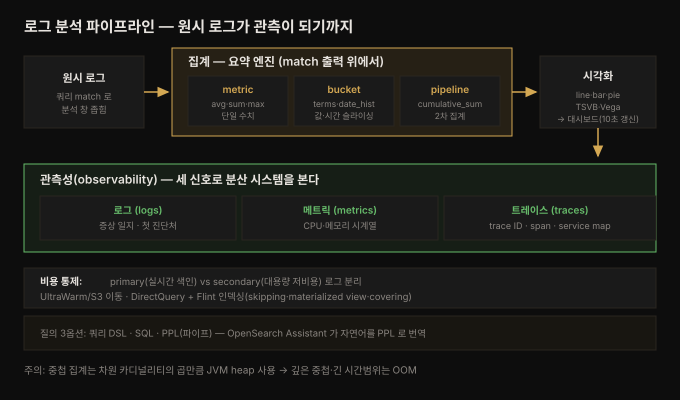

# 분석과 시각화 — 집계·대시보드·관측성

---

> 6장에서 faceted search 를 위해 집계를 잠깐 썼다면, 7장은 그 집계를 **분석의 중심**으로 끌어올립니다. metric·bucket·pipeline 세 유형으로 원시 로그를 수치·시계열로 요약하고, 그 결과를 OpenSearch Dashboards 의 차트·대시보드로 시각화하며, 나아가 로그·메트릭·트레이스 세 신호로 시스템을 실시간 관측(observability)하는 데까지 나아갑니다. 이 장은 상위 `06_observability` 카테고리의 정확히 그 주제 — 관측 저장소로서의 OpenSearch — 를 실체화합니다.


## 핵심 요약

> 이 장의 한 문장은 **"집계로 원시 로그를 수치·시계열로 요약하고, 시각화·대시보드로 실시간 관측한다"** 입니다. 6장에서 집계는 facet(값 세기)의 도구였지만, 7장에서는 로그 분석의 엔진입니다.
>
> 축이 셋입니다. 첫째 **집계 3유형** — metric(avg·sum·min·max 로 단일 수치), bucket(terms·date_histogram 으로 데이터를 구간·값으로 슬라이싱), pipeline(다른 집계의 출력을 다시 집계해 누적합·이동평균 같은 2차 정보). 이 셋을 조합하면 "지난 15분간 분당 요청 수" 같은 시계열이 나옵니다. 둘째 **시각화·대시보드** — 집계 결과를 line·bar·pie·Vega 차트로 그리고, 여러 차트를 한 대시보드로 묶어 10초 간격 실시간 갱신으로 인프라를 모니터링합니다. 셋째 **관측성** — 로그·메트릭·트레이스 세 신호(three pillars)로 분산 시스템을 진단하고, PPL·service map·trace 로 요청 경로를 추적하며, primary/secondary 로그 분리와 Flint 인덱싱으로 비용을 통제합니다.
>
> 관통하는 통찰은 **"집계는 검색 match 단계의 출력 위에서 동작한다"** 입니다. 쿼리로 문서를 좁힌 뒤 그 결과에만 집계를 걸므로, filter 를 잘 쓰면 분석 창을 좁고 정밀하게 가져갈 수 있습니다.


## 학습 목표

1. metric·bucket·pipeline 집계의 차이와 각 대표 집계(avg / terms·date_histogram / cumulative_sum·max_bucket)를 구분할 수 있습니다.
2. 중첩 집계로 계층 분석을 만들고, `buckets_path` 로 pipeline 집계가 하위 집계를 참조하는 방식을 설명할 수 있습니다.
3. Dashboards 의 index pattern·시각화 위젯·TSVB·Vega 로 집계 결과를 차트로 만들고 대시보드로 조립할 수 있습니다.
4. 관측성의 세 신호(로그·메트릭·트레이스)와 분산 추적(trace·span·service map), PPL 질의를 이해할 수 있습니다.
5. primary/secondary 로그 분리, UltraWarm·S3 DirectQuery·Flint 인덱싱으로 로그 워크로드 비용을 통제하는 전략을 설명할 수 있습니다.


## 본문 정리

아래 그림이 이 장 전체의 흐름입니다 — 원시 로그가 집계를 거쳐 시각화·관측으로 이어집니다.



### 1. OpenSearch Dashboards — 데이터를 보는 창

OpenSearch Dashboards 는 OpenSearch 에 저장된 데이터를 시각화·분석하는 UI 입니다. 로그인하면 세 영역으로 나뉩니다.

- **Management** — 관리의 중추입니다. **index pattern**(여러 인덱스·데이터 스트림·별칭을 하나로 묶어 데이터 소스로 삼음, 예: `logs-*`), **Data Sources**(Prometheus·Amazon S3 등 외부 소스를 색인 없이 직접 질의), Security(역할·권한), Notifications(SNS·Slack·이메일·웹훅 알림 채널), **Dev Tools**(4~6장에서 쓴 대화형 API 콘솔)를 여기서 설정합니다.
- **OpenSearch Plugins** — 확장 기능 허브입니다. Alerting(모니터링·알림), Query Workbench(SQL 유사 질의), Maps(지리 시각화), Anomaly Detection(ML 이상 탐지), Reporting(리포트 생성), **Security Analytics**(SIEM — MITRE ATT&CK·Sigma 규칙·상관 엔진), Search Relevance(순위 비교). 플러그인 상세는 8장에서 다룹니다.
- **Observability** — 로그·메트릭·트레이스를 다루는 영역입니다(아래 §5).

> 💬 **비유**: Dashboards 는 데이터베이스 위의 **관제실**입니다. Management 는 배선·권한을 까는 전기실, Plugins 는 특수 계기들이 꽂히는 확장 슬롯, Observability 는 시스템 생체 신호를 보는 모니터 벽입니다. 원시 로그(OpenSearch)는 관제실 밖 현장이고, 집계는 현장 데이터를 계기판 눈금으로 바꾸는 변환기입니다.

### 2. 집계 3유형 — 분석의 엔진

집계는 검색의 **match 단계 출력** 위에서 동작합니다. 쿼리에 매칭된 문서의 값만 집계하므로, filter 를 쓰면 분석 창을 좁힐 수 있습니다. 세 유형으로 나뉩니다.

**(a) Metric 집계 — 단일 수치를 계산합니다.** avg·sum·min·max·value_count 가 대표입니다. "지난 15분간 응답당 평균 바이트"를 구하는 예입니다.

```json
GET opensearch_dashboards_sample_data_logs/_search
{
  "size": 0,
  "query": {"range": {"timestamp": {"gte": "now-15m/d", "lte": "now/d"}}},
  "aggs": {"Average Bytes": {"avg": {"field": "bytes"}}}}
```

`aggs` 는 `query` 와 **같은 레벨**입니다. 집계마다 이름(`Average Bytes`)을 주고 그 안에 타입(`avg`)과 파라미터를 지정합니다. `size: 0` 은 히트는 필요 없고 집계만 보겠다는 뜻입니다. metric 집계는 값 하나를 냅니다 — 차원을 따라 쪼개려면 bucket 집계로 갑니다.

**(b) Bucket 집계 — 문서를 버킷으로 묶습니다.** terms·range·date_histogram 이 대표입니다.

- **terms** — 6장의 그 집계입니다. 필드 값별로 버킷을 만들어 셉니다(응답 코드 분포 등). text 필드에는 `doc_values` 없이는 못 걸므로 `.keyword` 서브필드를 씁니다.
- **date_histogram** — 시각화의 주력 일꾼입니다. 데이터를 시간 구간으로 나눠 셉니다. x축=시간, y축=개수인 그래프가 여기서 나옵니다. `interval`(minute·hour·day)과 `min_doc_count`(빈 구간 제거)를 씁니다.

```json
"aggs": {"Timestamps": {"date_histogram": {"field": "timestamp", "interval": "minute"}}}
```

- **중첩 집계(nested)** — 부모 집계 안에 `aggs` 로 자식 집계를 넣습니다. "출발 국가별 → OS별" 처럼 계층 분석을 합니다. date_histogram 을 최상위 버킷으로 두고 그 안에서 응답 코드를 집계하면, 시간축 위의 응답 코드 추이(애플리케이션 건강도)가 나옵니다. 집필 시점 OpenSearch 는 **26종의 bucket 집계**를 지원합니다(geo·sampling·significant/rare terms 등).

**(c) Pipeline 집계 — 집계의 출력을 다시 집계합니다.** 2차 정보(누적합·이동평균·백분위)를 뽑습니다. 둘로 갈립니다.

- **Sibling(형제)** — 형제의 중첩 버킷을 다시 집계합니다. avg_bucket·max_bucket·min_bucket·sum_bucket·percentiles_bucket. `buckets_path` 로 참조 대상을 가리킵니다. "일별 바이트 합 중 최대 트래픽 날"을 구하는 예입니다 — 버킷을 만든 집계와 **같은 트리 레벨**에 놓입니다.

```json
"aggs": {
  "Timestamps": {"date_histogram": {"field": "timestamp", "interval": "day"},
                 "aggs": {"Bytes": {"sum": {"field": "bytes"}}}},
  "Highest Traffic": {"max_bucket": {"buckets_path": "Timestamps>Bytes"}}}
```

- **Parent(부모)** — 자식 버킷 집합 안에서 계산합니다. cumulative_sum(누적합)이 대표로, 각 날짜 버킷에 전체 누적 바이트를 더합니다. 집필 시점 **15종의 pipeline 집계**가 있습니다.

> ⚠️ **중첩 집계 버킷 폭발**(6장에 이어 재확인): OpenSearch 는 집계를 JVM heap 에 값마다 버킷 하나로 실체화하고, 중첩 시 버킷이 곱해집니다. 중첩이 깊고 카디널리티가 높으며 시간 범위가 길면 Java OOM 이 납니다.

### 3. 시각화 — 집계를 차트로

좋은 시각화는 좋은 필드에서 나옵니다. 인덱스 생성 시 차원·메트릭·계산 필드를 매핑해 둬야 의미 있는 차트가 됩니다. Dashboards 는 **index pattern**(같은 소스의 여러 인덱스를 하나로 묶음, 예: `logs-*`)을 데이터 소스로 삼아 **22종의 시각화 위젯**(line·bar·pie·gauge·control)을 제공합니다.

| 차트 | 만드는 법(요지) | 쓰임 |
|------|----------------|------|
| Line chart | Metrics=y축(Count→Sum bytes), Buckets=x축 | 단일 독립 메트릭 추이(총 바이트) |
| TSVB | Time Series Visualization Builder, `@timestamp` 지정 | 트래픽 시계열 |
| Vertical Bar(stacked) | X축=Date Histogram, Split-series=Terms(geo.src) | 차원별 트래픽(국가별) |
| Pie | Split slices=Terms(request → response) | 다차원 상관(요청별 응답 코드) |
| Vega | Vega 문법 JSON, Sankey 등 | 커스텀(소스→목적지 연결 그래프) |

시각화가 실제로 어떤 DSL 을 돌리는지 궁금하면 메뉴의 **Inspect → Requests** 로 쿼리를 볼 수 있습니다. `@timestamp` vs `timestamp` 는 샘플 데이터가 별칭(alias)으로 연결해 둔 결과입니다 — `@timestamp` 가 로그 시각 필드의 사실상 표준이라 그렇습니다.

**대시보드 조립** — 저장한 시각화들을 Dashboard 로 묶습니다. 진짜 힘은 **실시간 갱신**입니다. time picker 에서 refresh rate 를 10초로 두면, 흘러드는 로그로 인프라·애플리케이션·비즈니스 KPI 를 실시간 모니터링합니다.

### 4. 로깅과 관측성 — 세 신호로 시스템을 봅니다

관측성(observability)은 시스템이 내보내는 신호로 내부 상태를 관찰하는 능력입니다. **로그·메트릭·트레이스**가 세 기둥(three pillars)이며, 로그는 문제 발생 시 개발자·운영자가 가장 먼저 보는 곳입니다.

**설정 흐름은 3단계**입니다.

1. **Management** — 로그 워크로드의 기반을 깝니다. Security 로 역할·권한(`log_viewer` 역할에 `logs-*` 읽기 권한을 API 로 부여), Index Templates 로 로그 인덱스의 자동 매핑·라이프사이클 정책(`number_of_shards`·`number_of_replicas`·`index.lifecycle.name`)을 정의합니다.
2. **Observability** — SOA/분산 시스템에서 한 요청이 여러 서비스에 흩어지면 진단이 어렵습니다. **분산 추적(distributed tracing)** 은 각 요청에 **trace ID** 를 붙이고, 서비스마다 처리 시간·에러 코드를 담은 로그를 남깁니다. Dashboards 에서 로그를 **Application**(분산 트레이스의 서비스들로 구성)으로 묶으면 **service map**(서비스 상호작용·지연·에러율)을 봅니다. 한 요청의 전체 로그는 **trace** 로 모이고, trace 는 서비스 간 개별 호출인 **span** 들로 구성됩니다. Metrics 서브섹션에서 CPU·메모리 시계열을 봅니다.
3. **Observability Plugins** — Reporting(예약 리포트), Alerting(에러율 임계 초과 시 알림 — `_plugins/_alerting/monitors`), Anomaly Detection(ML 이상 탐지)으로 보강합니다.

**PPL(Piped Processing Language)** — DSL·SQL 에 이은 세 번째 질의 옵션입니다. 유닉스 파이프처럼 출력을 다음 프로세서로 넘깁니다. 정규식 파싱·필드 변형·집계·서브쿼리까지 됩니다.

```
source=opensearch_dashboards_sample_data_logs
| stats sum(bytes) as total_bytes by geo.src, geo.dest
| sort - total_bytes
```

관측성 도구도 PPL 을 씁니다. **OpenSearch Assistant** 는 자연어("지난 24시간 에러 로그 보여줘")를 PPL 로 번역해 줍니다.

> 💬 **비유**: 로그·메트릭·트레이스는 환자를 보는 세 가지 검사입니다. 로그는 **증상 일지**(무슨 일이 언제 있었나), 메트릭은 **바이탈 사인**(심박·체온 같은 수치 추이), 트레이스는 **조영술**(한 요청이 몸속 어느 장기를 어떤 순서로 지났나)입니다. service map 은 장기 지도, span 은 각 장기 통과 구간입니다. 셋을 겹쳐 봐야 병목·장애의 진짜 원인이 드러납니다.

### 5. 저비용 로깅 — primary/secondary 와 Flint

로그를 둘로 나눕니다. **primary 로그**는 OpenSearch 에 색인해 실시간 모니터링하고, **secondary 로그**는 대용량 저비용 저장으로 두었다가 사후 분석(post-mortem)에 씁니다. 이 이중 전략이 실시간성과 비용을 동시에 잡습니다.

AWS 관리형에서는 **UltraWarm**(인덱스를 S3 로 이동해 장기 저장), **O-series**(S3 백킹 스토어, replica 없이 비용 절감), **Serverless 시계열 인덱스**(오래된 데이터 자동 S3 이동)가 비용을 낮춥니다.

**S3 DirectQuery + Flint 인덱싱** — S3 데이터를 색인 없이 직접 질의하되, Apache Spark 분산 처리와 **Flint 인덱싱**으로 성능을 끌어올립니다. Flint 세 기법입니다.

| Flint 기법 | 하는 일 |
|-----------|--------|
| Skipping index | 파티셔닝·min/max·bloom filter 로 불필요한 스캔을 건너뜀 |
| Materialized view | 집계 결과를 미리 계산해 저장 |
| Covering index | 지정 컬럼 전체를 색인 — 셋 중 가장 빠름, 고급 분석 가능 |

Flint 는 대용량 분석 워크로드에 쓰고, 실시간 트랜잭션·잦은 업데이트·소규모 데이터에는 피합니다(인덱스 동기화 유지 비용이 이득을 상쇄).

### 6. 로그 워크로드 베스트 프랙티스

원문이 제시한 실무 지침을 정리합니다.

**시각화·대시보드**
- 중첩 차원을 **보수적으로**. 중첩 집계는 모든 차원 카디널리티의 곱만큼 JVM 메모리를 쓰므로 깊은 중첩+높은 카디널리티+긴 시간 범위 = OOM.
- index pattern 을 **좁게**. `application_logs-*` 대신 `application_logs-2025.10.*` 처럼 특정 범위로.
- filter·query 로 표시 데이터를 좁혀 로드 시간 단축.
- 적절한 차트 선택 — pie 는 무겁습니다. 에러 비율은 bar·data table 이 낫습니다.
- 대시보드당 시각화 **5~10개** 권장(각 시각화 = OpenSearch 쿼리 하나, 갱신마다 전부 재질의).
- 시간 범위 적절히 — 1년 대신 7일·30일.

**로그 워크로드 일반**
- 성능 정기 모니터링(Performance Analyzer, 13장).
- 최적 shard 전략(14장), replica **최소 1개**(중복성·읽기 용량).
- index template 중앙 관리(shard·replica·매핑·refresh interval).
- refresh interval 튜닝 — 고인제스트 워크로드는 **30초 이상** 권장(색인 처리량↑, 가시성 지연 트레이드오프).


## 심화 학습

책 본문은 Dashboards UI 조작과 DSL 위주라, 실무에서 자주 부딪히는 두 지점을 공식 문서로 보강합니다.

**date_histogram 의 `interval` 은 deprecated 되고 있습니다.** 본문 예제는 `"interval": "minute"` 를 쓰지만, OpenSearch(및 Elasticsearch 7.2+)는 이를 **`calendar_interval`**(달력 기준 — 월·주처럼 길이가 변하는 단위)과 **`fixed_interval`**(고정 밀리초 — `30s`·`5m`)로 분리했습니다. `calendar_interval` 은 서머타임·윤달 같은 달력 불규칙성을 반영하고, `fixed_interval` 은 정확히 같은 길이의 버킷을 보장합니다. 학습용 예제는 `interval` 로 충분하지만, 프로덕션에서는 의도를 명시하는 두 파라미터를 쓰는 게 안전합니다. 자세히는 공식 [Date histogram aggregation](https://docs.opensearch.org/latest/aggregations/bucket/date-histogram/) 을 참고하세요.

**이 장이 상위 관측성 카테고리의 중심입니다.** [`06_observability/README.md`](../../README.md) 는 로그·메트릭·트레이스 세 신호를 다루겠다고 예고했는데, 7장이 그 셋을 OpenSearch 관점에서 한 번에 실현합니다. LGTM 스택과 대비하면 역할이 선명합니다 — Grafana 가 시각화 레이어라면 **OpenSearch Dashboards 가 저장·집계·시각화를 한 몸에** 갖습니다. Loki(로그)+Mimir(메트릭)+Tempo(트레이스)로 신호별 저장소가 나뉜 LGTM 과 달리, OpenSearch 는 세 신호를 같은 엔진의 인덱스로 통합합니다. 대신 저장 비용이 크므로 primary/secondary 분리와 UltraWarm 이 필요합니다 — 이 트레이드오프가 [상위 02-03 Loki](../../02_LGTMStack/02-03.Grafana%20Loki.md) 의 "라벨 최소 인덱싱" 과 정반대편에 서는 이 책의 핵심 대비입니다. 관측성 파이프라인(OpenTelemetry → 저장 → 시각화)의 표준 흐름은 공식 [Observability](https://docs.opensearch.org/latest/observing-your-data/index/) 문서에 정리돼 있습니다.


## 결정 치트시트

| 상황 | 선택 | 이유 |
|------|------|------|
| 필드 하나의 통계(평균·합·최대) | metric 집계(avg·sum·max) | 단일 수치 산출 |
| 값별/구간별로 데이터 슬라이싱 | bucket 집계(terms·range) | 카테고리 분석 |
| 시간축 위 추이 | date_histogram | 시각화의 주력, x=시간·y=개수 |
| 계층 분석(국가별→OS별) | 중첩 집계(aggs 안 aggs) | 부모-자식 버킷 (단, 버킷 폭발 주의) |
| 누적합·이동평균·최대버킷 | pipeline 집계(cumulative_sum·max_bucket) | 집계 출력의 2차 집계, buckets_path 참조 |
| text 필드로 terms 집계 | `.keyword` 서브필드 | text 는 doc_values 없이 집계 불가 |
| 단일 메트릭 추이 | line chart / TSVB | 독립 메트릭 |
| 차원별 분해 | stacked bar(split-series) | 시간×차원 |
| 커스텀 시각화(Sankey 등) | Vega | 표준 위젯 밖 표현 |
| 분산 시스템 요청 추적 | trace·span·service map | 서비스 간 경로·지연·에러 |
| 자연어/파이프 질의 | PPL / OpenSearch Assistant | DSL 없이 분석 |
| 대용량 저비용 로그 분석 | secondary 로그 + S3 DirectQuery + Flint | 실시간성 포기, 비용↓ |
| 고인제스트 색인 성능 | refresh_interval 30초+ | 처리량↑ (가시성 지연 트레이드오프) |


## Spring 앱 개발 관점

이 장의 집계 DSL 을 Spring Boot 애플리케이션에서 어떻게 실행하는지 정리합니다. 책에는 Spring 예제가 없어 **공식 문서(spring-data-opensearch / spring-data-elasticsearch)로 보강**했습니다. 사용자는 순수 클라이언트보다 Spring 위에서 Java 를 쓰므로, 저수준 클라이언트와 Spring Data 추상화 두 층을 함께 봅니다.

핵심 판단: **집계는 Repository 파생 메서드로 표현할 수 없습니다.** `countByResponse(...)` 같은 파생 쿼리는 문서 수만 세고, metric·bucket·pipeline 집계는 6장과 마찬가지로 `NativeQuery.builder()` 에 `.withAggregation(...)` 을 걸고 결과를 직접 파싱해야 합니다. 애플리케이션이 대시보드를 대신해 서버사이드에서 통계를 뽑아야 할 때(예: 관리 API 가 응답 코드 분포를 JSON 으로 반환) 이 패턴이 필요합니다.

**(a) date_histogram — 시간축 집계** — 7장 §2 의 date_histogram 을 그대로 옮깁니다. 집계 이름을 주고 `Aggregation.of` 안에서 타입을 지정하는 형식은 terms 든 date_histogram 이든 동일합니다.

```java
Query query = NativeQuery.builder()
        .withQuery(q -> q.range(r -> r.field("timestamp").gte(JsonData.of("now-15m/d")).lte(JsonData.of("now/d"))))
        .withAggregation("Timestamps", Aggregation.of(a -> a
                .dateHistogram(dh -> dh
                        .field("timestamp")
                        .fixedInterval(fi -> fi.time("1m")))))   // 심화 학습: interval 대신 fixedInterval
        .withMaxResults(0)                                        // size:0 — 집계만
        .build();

SearchHits<LogEntry> hits = operations.search(query, LogEntry.class);
```

**(b) 집계 결과 파싱 — date_histogram 버킷 순회** — 6장의 terms 파싱과 같은 뼈대지만, 캐스팅 대상이 집계 종류에 따라 달라집니다. date_histogram 은 `isDateHistogram()` / `dateHistogram()` 으로 받습니다.

```java
var container = hits.getAggregations();
Aggregate agg = ((ElasticsearchAggregation) container).aggregation().getAggregate();

if (agg.isDateHistogram()) {                                     // 종류 확인 후 캐스팅
    for (var bucket : agg.dateHistogram().buckets().array()) {
        String time = bucket.keyAsString();                     // 버킷 시각
        long count  = bucket.docCount();                        // 그 구간 문서 수 → 차트 점
    }
}
```

**(c) 중첩 집계 — 계층 분석** — 7장 §2 의 "국가별 → OS별" 을 옮깁니다. 부모 집계 빌더 안에서 `.aggregations("child", ...)` 로 자식을 중첩합니다.

```java
.withAggregation("SourceCountry", Aggregation.of(a -> a
        .terms(t -> t.field("geo.src"))
        .aggregations("OS", Aggregation.of(child -> child
                .terms(t -> t.field("machine.os.keyword"))))))
```

파싱할 때는 부모 버킷을 순회하면서 각 버킷의 하위 집계를 `bucket.aggregations().get("OS")` 로 꺼내 다시 종류별로 캐스팅합니다.

**주의할 점 두 가지.** 첫째, **`interval` deprecation** 을 애플리케이션 코드에서도 지켜야 합니다. 최신 클라이언트는 `dateHistogram(dh -> dh.calendarInterval(...))` 또는 `.fixedInterval(...)` 을 노출하며, 구식 `.interval(...)` 은 없거나 deprecated 입니다 — 심화 학습의 그 이유입니다. 둘째, **버킷 폭발이 애플리케이션 힙을 때립니다.** 중첩 집계는 OpenSearch **클러스터**의 JVM heap 뿐 아니라, 결과를 역직렬화하는 **애플리케이션** 힙도 부풀립니다. 카디널리티가 큰 필드를 중첩하면 응답 자체가 수 MB~수백 MB 가 되어 앱이 OOM 날 수 있으니, `terms(t -> t.size(N))` 로 버킷 수를 명시적으로 제한하고 페이지네이션·partition 기법을 검토합니다.

라이브러리 선택은 앞 장들과 동일합니다 — 저수준 제어·최신 집계 타입이 필요하면 `opensearch-java`, 엔티티 매핑·통합이 필요하면 `spring-data-opensearch` 를 쓰되, 집계는 어느 쪽이든 결국 클라이언트 빌더를 직접 조립하게 됩니다. 다만 실무에서 로그 분석·대시보드는 **애플리케이션이 아니라 Dashboards 가 담당**하는 게 정석이라, Spring 앱은 대개 색인·소량의 서버사이드 통계 API 까지만 맡고 대규모 시각화는 Dashboards 에 위임합니다.


## 면접 대비

**한 줄 정의**: 7장은 집계(metric·bucket·pipeline)로 원시 로그를 수치·시계열로 요약하고, Dashboards 시각화·대시보드로 실시간 관측하며, 로그·메트릭·트레이스 세 신호로 분산 시스템을 진단하는 장입니다.

**핵심 3가지**
1. **집계는 세 유형이 위계를 이룬다** — metric(단일 수치) → bucket(값·시간으로 슬라이싱) → pipeline(집계 출력의 2차 집계). date_histogram 이 시각화의 주력이고, pipeline 은 `buckets_path` 로 하위 집계를 참조합니다.
2. **관측성은 세 신호다** — 로그·메트릭·트레이스. 분산 추적은 trace ID 로 한 요청의 전체 경로(span 들)를 모아 service map 으로 봅니다.
3. **로그 비용은 primary/secondary 분리로 잡는다** — 실시간 색인 로그와 대용량 저비용 로그를 나누고, UltraWarm·S3 DirectQuery·Flint 인덱싱으로 저장·질의 비용을 통제합니다.

**FAQ**
- **Q. metric 집계와 bucket 집계의 차이는?**
  A. metric 은 값 하나(평균·합)를 냅니다. bucket 은 문서를 기준(값·시간)에 따라 여러 버킷으로 묶습니다. 차원을 따라 쪼개려면 bucket, 최종 수치가 필요하면 metric 입니다. 보통 bucket 안에 metric 을 중첩해 "구간별 평균" 을 만듭니다.
- **Q. pipeline 집계의 sibling 과 parent 차이는?**
  A. sibling 은 버킷을 만든 집계와 **같은 레벨**에 놓여 그 버킷들을 다시 집계합니다(일별 합 중 최대 = max_bucket). parent 는 자식 버킷 **집합 안**에서 계산해 각 버킷에 값을 더합니다(누적합 = cumulative_sum).
- **Q. trace 와 span 의 관계는?**
  A. trace 는 한 요청의 전체 로그 묶음이고, span 은 그 요청을 처리하며 서비스들이 서로 호출한 개별 구간입니다. trace = span 들의 집합입니다. trace ID 로 흩어진 로그를 모아 요청 경로를 복원합니다.


## 핵심 개념 체크리스트

- [ ] metric·bucket·pipeline 집계의 차이와 대표 집계를 든다
- [ ] 집계가 검색 match 단계 출력 위에서 동작한다는 걸 안다
- [ ] date_histogram 이 시각화의 주력인 이유와 interval/calendar_interval/fixed_interval 차이를 안다
- [ ] 중첩 집계의 버킷 폭발(카디널리티 곱 × JVM heap) 위험을 설명할 수 있다
- [ ] pipeline sibling(max_bucket·buckets_path)과 parent(cumulative_sum)를 구분한다
- [ ] text 필드에 terms 집계하려면 .keyword 가 필요한 이유를 안다
- [ ] index pattern 의 역할과 좁게 쓰는 이유를 안다
- [ ] line·bar·pie·TSVB·Vega 의 용도를 구분한다
- [ ] 관측성 세 신호(로그·메트릭·트레이스)와 trace·span·service map 을 설명한다
- [ ] PPL 의 파이프 문법과 OpenSearch Assistant 의 자연어→PPL 번역을 안다
- [ ] primary/secondary 로그 분리와 UltraWarm·Flint 인덱싱의 비용 전략을 안다
- [ ] Flint 세 기법(skipping·materialized view·covering)을 구분한다
- [ ] 대시보드 베스트 프랙티스(시각화 5~10개·refresh 30초+·replica 1개+)를 안다


## 참고 자료

- 원본: *The Definitive Guide to OpenSearch* (ISBN 9781835885789), Chapter 7 — Analyze and Visualize OpenSearch Data. O'Reilly/Packt, `learning.oreilly.com/library/view/the-definitive-guide/9781835885789`. (실습 기준 OpenSearch 2.19)
- 공식 문서:
  - [OpenSearch — Aggregations (metric·bucket·pipeline)](https://docs.opensearch.org/latest/aggregations/index/)
  - [OpenSearch — Date histogram aggregation](https://docs.opensearch.org/latest/aggregations/bucket/date-histogram/)
  - [OpenSearch — Observability](https://docs.opensearch.org/latest/observing-your-data/index/)
  - [OpenSearch — Piped Processing Language (PPL)](https://docs.opensearch.org/latest/search-plugins/sql/ppl/index/)
  - [OpenSearch — Dashboards](https://docs.opensearch.org/latest/dashboards/index/)
  - [Spring Data Elasticsearch — Aggregations & NativeQuery](https://docs.spring.io/spring-data/elasticsearch/reference/elasticsearch/template.html)
- 관련 노트:
  - [06-01 고급 쿼리 — 복합·지리·faceted·percolation](./06-01.고급%20쿼리%20—%20복합·지리·faceted·percolation.md) (faceted 에서 집계 예고)
  - [03-01 배포 옵션 — Amazon OpenSearch Service와 Serverless](./03-01.배포%20옵션%20—%20Amazon%20OpenSearch%20Service와%20Serverless.md) (UltraWarm·Serverless 비용)
  - [README (정독 노트 MOC)](./README.md)
