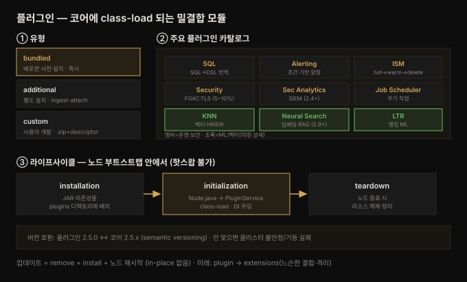

# 플러그인 — 유형·주요 플러그인·아키텍처

---

> Part 3(확장)의 첫 장입니다. 7장에서 Dashboards 의 OpenSearch Plugins 섹션(Alerting·Anomaly Detection·Security Analytics 등)을 잠깐 스쳤다면, 8장은 그 플러그인들을 **카탈로그로 펼치고 내부 구조까지** 들여다봅니다. 플러그인이 무엇이고(코어를 안 건드리는 밀결합 모듈), 어떤 유형이 있고(bundled·additional·custom), 어떤 주요 플러그인이 있고(SQL·Alerting·ISM·Security·KNN·Neural·LTR), 어떻게 설치·개발하는지, 그리고 노드 생명주기 안에서 어떻게 class-load 되는지를 다룹니다.


## 핵심 요약

> 이 장의 한 문장은 **"플러그인은 코어 코드를 건드리지 않고 OpenSearch 를 확장하는 밀결합(tightly coupled) 모듈이며, 노드 부트스트랩 때 class-load 된다"** 입니다. 독립 프레임워크나 DSL 이 아니라, OpenSearch 코어 모듈에 hook 하는 컴포넌트라는 점이 핵심입니다.
>
> 축이 셋입니다. 첫째 **유형** — bundled(배포판에 사전 설치), additional(별도 설치, 예: ingest-attachment·mapper-size), custom(사용자 개발). semantic versioning 으로 코어와 버전이 맞아야 하며(2.5.0 ↔ 2.5.x), 안 맞으면 클러스터가 불안정해집니다. 둘째 **주요 플러그인 카탈로그** — SQL(SQL→DSL 번역), Job Scheduler(주기 작업), Alerting(조건 기반 알림), ISM(hot/warm/cold/delete 라이프사이클), Security(FGAC·LDAP/SAML·TLS), Security Analytics(SIEM), KNN·Neural Search(벡터·의미 검색), LTR(랭킹 ML). 셋째 **아키텍처** — 라이프사이클 3단계(installation → initialization → teardown), `PluginService` 가 `Node.java` 에서 class-load, 의존성 주입(DI)으로 코어와 느슨히 결합. 여기서 결정적 제약은 **핫스왑 불가** — 새 버전을 반영하려면 노드를 재시작해야 합니다.
>
> 관통하는 통찰은 **"확장성은 공짜가 아니다"** 입니다. 플러그인은 코어와 밀결합이라 강력하지만, 버전 호환성·성능 오버헤드(Security 는 5~10%)·노드 재시작이라는 비용을 안깁니다. 그래서 미래에는 더 느슨한 **extensions** 모델로 옮겨 가고 있습니다.


## 학습 목표

1. 플러그인이 코어에 class-load 되는 밀결합 모듈이며 핫스왑이 불가능하다는 특성을 설명할 수 있습니다.
2. bundled·additional·custom 세 유형과 semantic versioning 호환성 규칙을 구분할 수 있습니다.
3. SQL·Alerting·ISM·Security·KNN·Neural Search·LTR 등 주요 플러그인의 역할과 대표 사용 사례를 든다.
4. `opensearch-plugin` CLI 로 플러그인을 설치·목록·제거하고, 커스텀 플러그인 개발 5단계를 설명할 수 있습니다.
5. 플러그인 라이프사이클(installation·initialization·teardown)과 의존성 주입, `plugin-descriptor.properties` 의 역할을 이해할 수 있습니다.


## 본문 정리

아래 그림이 이 장 전체의 지도입니다 — 플러그인의 유형·카탈로그·라이프사이클을 한눈에 봅니다.



### 1. 플러그인이란 — 코어에 hook 하는 밀결합 모듈

플러그인은 OpenSearch 에 기능을 더하거나 동작을 바꾸는 모듈 컴포넌트입니다. 내부적으로는 **노드 부트스트랩 과정에서 class-load** 되어 코어 모듈과 밀결합(tightly coupled)합니다. 독립 프레임워크나 DSL 이 **아니라**, 커스텀 로직을 구현해 OpenSearch 기능을 확장하는 컴포넌트입니다.

예를 들어 Anomaly Detection 플러그인은 시계열 데이터를 ML 모델로 처리해 이상을 찾고, Job Scheduler 플러그인은 OpenSearch 내부 스케줄링에 통합해 주기 작업을 관리합니다. 플러그인은 `.zip` 으로 패키징되어 `opensearch-plugin` CLI 로 설치되며, **코어 코드를 수정하지 않고** 기능을 확장합니다.

> 💬 **비유**: 플러그인은 데스크톱 PC 의 **내장형 확장 카드**(그래픽카드·사운드카드)입니다. USB 로 꽂았다 뺐다 하는 외장 기기(독립 프레임워크)와 달리, 메인보드 슬롯에 직접 꽂혀 부팅 때 드라이버가 로드되고 시스템과 한 몸으로 돕니다. 그래서 성능은 좋지만, 카드를 바꾸려면 **전원을 끄고**(노드 재시작) 갈아 끼워야 합니다 — 핫스왑이 안 됩니다.

### 2. 플러그인 유형 — bundled·additional·custom

두 큰 갈래(built-in vs custom)를 셋으로 나눕니다.

| 유형 | 특징 | 예시 |
|------|------|------|
| **Bundled** | 표준 배포판에 사전 설치, 즉시 사용 | Alerting, Anomaly Detection, KNN |
| **Additional** | OpenSearch·커뮤니티 개발, 별도 설치 필요 | ingest-attachment(PDF·Word 내용 추출·색인), mapper-size(`_size` 필드 추가 — 비정상 크기 로그 탐지에 유용) |
| **Custom** | 사용자가 코어 확장, 앞 둘로 안 되는 유스케이스 | 커스텀 REST 플러그인(커스텀 스코어링·실시간 재고 통합) |

> ⚠️ **버전 호환성이 결정적입니다.** OpenSearch 는 semantic versioning 을 따르고, 플러그인은 빌드된 특정 버전과 호환됩니다 — 플러그인 2.5.0 은 OpenSearch 2.5.x 용입니다. 비호환 버전을 쓰면 클러스터 불안정 또는 기동 실패로 이어집니다.

### 3. 주요 플러그인 카탈로그

extension point(`plugin.java` 인터페이스)를 통해 클러스터 상태 변경·쿼리 실행·데이터 인제스트 같은 생명주기 단계에 hook 하는 Java 클래스들입니다.

| 플러그인 | 역할 | 대표 API / 사용 사례 | 지원 버전 |
|---------|------|---------------------|----------|
| **SQL** | SQL → OpenSearch DSL 번역 (SELECT·JOIN·SUM·AVG) | `POST /_plugins/_sql`, JDBC/ODBC. 복잡 JOIN·저장 프로시저·트랜잭션은 미지원 | 1.0+ |
| **Job Scheduler** | 클러스터 내 주기 작업(인제스트·변환·유지보수) | `PUT _scheduled_job/...`, 일일 스냅샷. 피크 시간 리소스 부하 주의 | 1.0+ |
| **Alerting** | OpenSearch 데이터 기반 알림 (cron 유사) | `PUT /_plugins/_alerting/monitors`, document/cluster/anomaly 알림. 대용량엔 aggregation 기반 권장 | 1.0+ |
| **ISM**(Index State Management) | 인덱스 라이프사이클 (hot→warm→cold→delete) | `PUT _plugins/_ism/policies/...`, age·size·doc 수 기준. rollover·force merge·delete | — |
| **Security** | 인증·인가·암호화·감사 (FGAC·LDAP/SAML·TLS) | `PUT _plugins/_security/api/roles/...`, 멀티테넌트 역할 분리 | 1.0+, **쿼리 5~10% 오버헤드** |
| **Security Analytics** | 실시간 위협 탐지 (SIEM, detector·rule·ML) | `POST _plugins/_security_analytics/detectors`, CloudTrail·SOC 알림 | 2.4+ (2.6+ 확장) |
| **KNN** | K-최근접 분류·벡터 검색 | `knn` 쿼리, HNSW 알고리즘, 추천·세분화·이상 탐지 | 1.0+ (2.4 근사 KNN) |
| **Neural Search** | 신경망·임베딩 의미 검색 (BERT·RAG) | `neural` 쿼리 + ingest pipeline(text_embedding), 임베딩 모델 업로드·배포 | 2.9.0+ |
| **LTR**(Learning to Rank) | ML 랭킹 모델 학습·재정렬 | `_ltr/featureset`·`_ltr/train`, 평점·클릭률 재순위 | 1.0+ (2.4+ 확장) |

> KNN·Neural Search 상세(벡터·의미 검색·생성 AI)는 10장에서 깊이 다룹니다. 이 장은 카탈로그 조망입니다.

**ISM 예시** — 7일 지난 인덱스 자동 삭제:

```json
PUT _plugins/_ism/policies/movies-policy
{"policy": {"default_state": "active", "states": [
  {"name": "active", "transitions": [{"state_name": "delete", "conditions": {"min_index_age": "7d"}}]},
  {"name": "delete", "actions": [{"delete": {}}]}
]}}
```

### 4. 설치와 관리 — opensearch-plugin CLI

설치는 **서비스 중지 → 설치 → 재시작** 순서입니다(핫스왑 불가의 직접적 귀결).

```bash
# 설치 (서비스 중지 후 bin 디렉토리에서)
./opensearch-plugin install <plugin_name>
# 목록
./opensearch-plugin list
# 제거
./opensearch-plugin remove <plugin_name>
# 업데이트 = 제거 + 재설치 (in-place 업데이트 없음)
./opensearch-plugin remove <plugin_name> && ./opensearch-plugin install <new_version>
```

ZIP 파일이나 MAVEN 좌표(특정 버전)로도 설치합니다. 다국어 검색이 필요한 이커머스가 **ICU Analysis 플러그인**을 깔아 언어별 토큰화·스테밍을 개선하는 게 전형적 예입니다.

### 5. 커스텀 플러그인 개발 — 5단계

앞의 둘로 안 되는 요구(전문 문서 처리·독점 데이터 소스·산업별 컴플라이언스)는 직접 만듭니다.

1. **개발 환경 셋업** — IntelliJ/Eclipse 에 프로젝트·의존성(OpenSearch 버전·빌드 도구·검색 모듈) 구성.
2. **기능 구현** — 적절한 OpenSearch 클래스·인터페이스를 확장해 extension point(커스텀 analyzer·similarity·scripting engine)에 hook. 예로 `Analyzer` 를 상속해 `createComponents` 에서 Tokenizer·TokenFilter 를 조립합니다.
3. **패키징** — `.zip` 으로, 플러그인 코드·의존성·**`plugin-descriptor.properties`**(메타데이터) 포함.
4. **설치·테스트** — `opensearch-plugin` 으로 설치 후 동작 검증.
5. **배포·배포판 기여** — 프로덕션 배포, 선택적으로 커뮤니티(공식 repo·GitHub)에 기여.

코딩 표준은 **Google Java Style Guide**, 테스트는 **JUnit·Mockito** 를 씁니다.

### 6. 고급 아키텍처 — 라이프사이클·의존성 주입

**라이프사이클 3단계**입니다.

1. **Installation** — `opensearch-plugin` 으로 JAR·의존성을 plugins 디렉토리에 배치.
2. **Initialization** — 부트스트랩 시 `Node.java` 가 `PluginService` 를 초기화하고, `loadPlugin` 이 plugins 디렉토리에서 클래스를 로드. extension point 와 자료구조가 세팅됩니다.
3. **Teardown** — 노드 종료 시 리소스 해제·데이터 영속화·정리.

> ⚠️ **핫스왑 불가**: 플러그인은 런타임에 교체할 수 없습니다. 새 버전을 반영하려면 클러스터의 **각 노드를 재시작**해야 합니다. 각 플러그인은 OpenSearch 안에서 단일 프로세스로 돌며, extension point 로 코어 모듈에 꽂힙니다.

**의존성 주입(DI)** — OpenSearch 는 DI 로 플러그인과 코어의 의존성을 관리해 느슨한 결합·유지보수성을 얻습니다. 플러그인은 `plugin-descriptor.properties` 의 `dependencies` 속성으로 호환 버전을 선언합니다.

```properties
# plugin-descriptor.properties
opensearch.version=2.19.0
java.version=11
dependencies=analysis-icu,lang-painless
```

플러그인 로드 시 OpenSearch 가 의존성을 해석해 필요한 컴포넌트를 주입합니다. 생성자로 `Settings`·`Path configPath`·`Client` 가 자동 주입됩니다. DI 베스트 프랙티스는 의존성 명시·순환 의존 회피·누락/비호환 의존성의 우아한 처리입니다.

### 7. 플러그인의 미래 — extensions 모델

OpenSearch 는 전통적 플러그인 모델에서 더 유연한 **extensions** 로 전환 중입니다. 목표는 개발·통합 과정 간소화입니다. extension 모델의 이점은 코드 조직 개선, 유지보수 용이, **컴포넌트 간 더 나은 격리(isolation)** 입니다 — 재사용·조합 가능한 빌딩 블록을 장려합니다. 밀결합의 대가(핫스왑 불가·버전 호환성 부담)를 느슨한 결합으로 완화하려는 방향입니다.


## 심화 학습

책 본문은 플러그인 카탈로그와 아키텍처 개념 위주라, 실무에서 자주 부딪히는 두 지점을 공식 문서로 보강합니다.

**Amazon OpenSearch Service 에서는 플러그인을 직접 설치할 수 없습니다.** 본문은 `opensearch-plugin install` 로 자유롭게 설치한다고 설명하지만, 이는 **자체 관리(self-managed) 클러스터** 이야기입니다. 관리형 서비스(3장)에서는 노드 셸 접근이 막혀 있어 CLI 를 못 씁니다 — 대신 AWS 가 엔진 버전별로 **사전 번들한 플러그인 목록**만 쓸 수 있고, 커스텀 플러그인은 패키지 연결(package association) 기능이 지원하는 특정 유형(사전·동의어·커스텀 분석 등)에 한정됩니다. 그래서 "이 플러그인을 쓰려면 self-managed 여야 하는가"가 배포 방식(3장 managed vs self-managed) 선택에 직결됩니다. 엔진 버전별 지원 플러그인은 공식 [Plugins by engine version](https://docs.aws.amazon.com/opensearch-service/latest/developerguide/supported-plugins.html) 에서 확인합니다.

**이 장은 앞 장들의 기능이 실은 "플러그인"이었음을 드러냅니다.** 5~7장에서 당연히 쓰던 기능들 — Alerting(7장 경보), 집계 기반 이상 탐지, Security(FGAC·역할), SQL·PPL 질의 — 이 사실은 개별 플러그인이었습니다. 상위 [`06_observability/README.md`](../../README.md) 관측성 맥락에서 특히 중요한 건 **ISM·Alerting·Security Analytics** 세 플러그인입니다. ISM 은 로그 인덱스의 hot→warm→cold→delete 라이프사이클로 7장의 primary/secondary 로그 비용 전략을 실제로 집행하고, Alerting 은 경보 규칙을, Security Analytics 는 SIEM 을 담당합니다 — LGTM 스택으로 치면 각각 인덱스 라이프사이클 관리, Alertmanager, 보안 이벤트 파이프라인에 대응합니다. OpenSearch 는 이 셋을 **같은 엔진의 플러그인**으로 통합한다는 점이 신호별 도구를 조립하는 LGTM 과의 또 다른 대비입니다. 플러그인 아키텍처 원전은 공식 [Plugins](https://docs.opensearch.org/latest/install-and-configure/plugins/) 문서를 참고하세요.


## 결정 치트시트

| 상황 | 선택 | 이유 |
|------|------|------|
| 사전 설치된 기능 사용 | bundled 플러그인 | 즉시 사용, 설치 불필요 |
| PDF·Word 내용 색인 | additional: ingest-attachment | 별도 설치 |
| 앞 둘로 안 되는 요구 | custom 플러그인 개발 | 코어 확장, `.zip`+descriptor |
| SQL 워크플로 유지하며 마이그레이션 | SQL 플러그인 | SQL→DSL 번역, 러닝커브↓ |
| 인덱스 라이프사이클 자동화 | ISM | hot/warm/cold/delete, 비용·보존 |
| 조건 기반 알림 | Alerting (대용량은 aggregation 기반) | cron·document/cluster 알림 |
| 인증·인가·감사 | Security (5~10% 오버헤드 감수) | FGAC·LDAP/SAML·TLS |
| 벡터·의미 검색 | KNN / Neural Search | HNSW·임베딩·RAG (10장 상세) |
| 랭킹 개선 | LTR | 피드백 기반 ML 재순위 |
| 관리형 서비스에서 플러그인 필요 | 엔진 버전 지원 목록 확인 or self-managed | managed 는 CLI 설치 불가(심화 학습) |
| 플러그인 버전 업데이트 | remove + install (in-place 없음) | 핫스왑 불가, 노드 재시작 |


## Spring 앱 개발 관점

이 장은 성격이 앞 장들과 다릅니다. 플러그인 **개발** 자체는 순수 Java(Lucene `Analyzer`·OpenSearch `Plugin` 클래스 상속)이고 Spring 과 무관합니다 — Spring Boot 애플리케이션은 플러그인을 *만들지* 않고, 이미 설치된 플러그인이 제공하는 *기능을 소비*합니다. 그래서 여기서는 "플러그인이 켜 준 기능을 Spring 앱에서 어떻게 쓰는가"에 초점을 둡니다. 책에 Spring 예제가 없어 **공식 문서(spring-data-opensearch / spring-data-elasticsearch)로 보강**했습니다.

핵심 판단: **플러그인 존재 여부가 Spring 코드의 전제 조건입니다.** 아래 셋은 각각 특정 플러그인이 클러스터에 설치돼 있어야만 동작합니다.

**(a) KNN 플러그인 — 벡터 검색** — KNN 플러그인이 있어야 `knn_vector` 필드와 `knn` 쿼리가 뜹니다. Spring Data 는 벡터 검색 API 를 **버전에 따라 다르게** 노출하니 주의해야 합니다. 5.4 부터 `withKnnQuery` 가 **`withKnnSearches`** 로 바뀌었습니다(top-level `knn`). `query` 절 안의 `knn` 을 쓰려면 `withQuery` 로 직접 조립합니다.

```java
// 엔티티: knn_vector 매핑은 애노테이션으로 안 되므로 @Mapping 으로 JSON 지정
@Document(indexName = "movies")
@Mapping(mappingPath = "/mappings/movie-knn-mapping.json")   // knn_vector·dimension 정의
class Movie { @Id String id; String title; float[] descriptionVector; }

// 최신(5.4+): top-level knn 은 withKnnSearches
Query query = NativeQuery.builder()
        .withKnnSearches(k -> k.field("descriptionVector").queryVector(vec).k(5))
        .build();
SearchHits<Movie> hits = operations.search(query, Movie.class);
```

**(b) Security 플러그인 — 인증** — Security 플러그인이 켜지면 클러스터 접근에 인증이 필요합니다. Spring 은 `ClientConfiguration` 에 자격증명·TLS 를 설정합니다. 시크릿은 하드코딩하지 말고 환경변수·시크릿 매니저로 주입합니다(FGAC 역할은 클러스터 쪽 설정).

```java
ClientConfiguration.builder()
        .connectedTo("opensearch:9200")
        .usingSsl()
        .withBasicAuth("app_user", System.getenv("OPENSEARCH_PASSWORD"))   // 하드코딩 금지
        .build();
```

**(c) 커스텀 analyzer / ICU** — analysis 계열 플러그인이 제공하는 analyzer 는 `@Setting`(인덱스 설정)·`@Field(analyzer = "...")` 로 지정합니다. 4장 애널라이저 노트의 그 패턴이며, 다만 그 analyzer 를 *제공하는 플러그인*이 클러스터에 깔려 있어야 인덱스 생성이 성공합니다.

**주의할 점 두 가지.** 첫째, **플러그인 부재는 런타임 실패로 드러납니다.** Spring 앱이 `knn` 쿼리를 보냈는데 KNN 플러그인이 없거나, `icu_analyzer` 를 매핑에 썼는데 analysis-icu 가 없으면, 컴파일은 통과하고 **인덱스 생성·검색 시점에** 예외가 납니다. 로컬(Docker)과 프로덕션(관리형)의 플러그인 목록이 다르면 "로컬에선 되는데 배포하면 깨지는" 문제가 생기니, 배포 환경의 플러그인 목록을 먼저 확인해야 합니다(심화 학습의 managed 제약과 직결). 둘째, **플러그인 버전이 클라이언트 API 를 바꿉니다.** KNN 의 `withKnnQuery`→`withKnnSearches` 전환처럼, 같은 기능이라도 Spring Data 버전에 따라 메서드명이 달라지므로 마이그레이션 가이드를 확인해야 합니다 — 추측하지 말고 쓰는 버전의 공식 문서를 봅니다.

라이브러리 선택 원칙은 앞 장들과 같습니다. 다만 이 장의 교훈은 라이브러리보다 **환경**입니다 — Spring 코드가 아무리 정확해도 대상 클러스터에 해당 플러그인이 없으면 무용지물이라, 애플리케이션 설계 전에 "이 기능은 어느 플러그인에 의존하고, 그 플러그인이 배포 대상에 있는가"를 먼저 확인하는 습관이 필요합니다.


## 면접 대비

**한 줄 정의**: 플러그인은 OpenSearch 코어를 수정하지 않고 노드 부트스트랩 때 class-load 되어 기능을 확장하는 밀결합 모듈로, bundled·additional·custom 세 유형이 있으며 핫스왑이 불가능합니다.

**핵심 3가지**
1. **플러그인은 코어와 밀결합이라 핫스왑이 안 된다** — 노드 부트스트랩 시 class-load 되므로, 버전을 바꾸려면 각 노드를 재시작해야 합니다. 그래서 업데이트 = 제거 + 재설치입니다.
2. **버전 호환성이 결정적이다** — semantic versioning 으로 플러그인(2.5.0)과 코어(2.5.x)가 맞아야 하며, 안 맞으면 클러스터가 불안정하거나 기동에 실패합니다.
3. **주요 기능은 대부분 플러그인이다** — SQL·Alerting·ISM·Security·KNN·Neural·LTR 이 각각 플러그인입니다. 앞 장에서 쓰던 기능들이 실은 이 플러그인들이었습니다.

**FAQ**
- **Q. bundled 와 additional 플러그인의 차이는?**
  A. bundled 는 표준 배포판에 사전 설치되어 즉시 씁니다(Alerting·KNN). additional 은 OpenSearch·커뮤니티가 만들었지만 배포판에 없어 `opensearch-plugin` 으로 별도 설치해야 합니다(ingest-attachment·mapper-size).
- **Q. 플러그인 라이프사이클 3단계는?**
  A. installation(JAR·의존성을 plugins 디렉토리에 배치) → initialization(부트스트랩 시 `Node.java`→`PluginService` 가 class-load, extension point 세팅) → teardown(노드 종료 시 리소스 해제·정리)입니다.
- **Q. 왜 플러그인 업데이트에 노드 재시작이 필요한가?**
  A. 플러그인은 노드 부트스트랩 때 한 번 class-load 되어 코어와 밀결합하기 때문입니다. 런타임에 클래스를 교체(핫스왑)할 수 없으므로, 새 버전을 로드하려면 노드를 재시작해 부트스트랩을 다시 거쳐야 합니다.


## 핵심 개념 체크리스트

- [ ] 플러그인이 노드 부트스트랩 때 class-load 되는 밀결합 모듈임을 안다
- [ ] 핫스왑 불가 → 업데이트 = 제거+재설치+노드 재시작을 설명할 수 있다
- [ ] bundled·additional·custom 세 유형과 예시를 든다
- [ ] semantic versioning 호환성(2.5.0↔2.5.x) 규칙을 안다
- [ ] SQL·Alerting·ISM·Security·KNN·Neural·LTR 의 역할을 각각 든다
- [ ] Security 플러그인의 5~10% 쿼리 오버헤드를 안다
- [ ] ISM 의 hot/warm/cold/delete 라이프사이클을 설명할 수 있다
- [ ] opensearch-plugin install/list/remove 명령을 안다
- [ ] 커스텀 플러그인 개발 5단계와 plugin-descriptor.properties 의 역할을 안다
- [ ] 라이프사이클 3단계(installation·initialization·teardown)를 든다
- [ ] 의존성 주입으로 Settings·Client 가 주입되는 방식을 안다
- [ ] plugin → extensions 모델 전환의 동기(격리·느슨한 결합)를 안다
- [ ] 관리형 서비스에서 플러그인 설치가 제한된다는 걸 안다


## 참고 자료

- 원본: *The Definitive Guide to OpenSearch* (ISBN 9781835885789), Chapter 8 — Introduction to OpenSearch Plugins. O'Reilly/Packt, `learning.oreilly.com/library/view/the-definitive-guide/9781835885789`
- 공식 문서:
  - [OpenSearch — Installing plugins](https://docs.opensearch.org/latest/install-and-configure/plugins/)
  - [OpenSearch — Index State Management (ISM)](https://docs.opensearch.org/latest/im-plugin/ism/index/)
  - [OpenSearch — Security plugin](https://docs.opensearch.org/latest/security/index/)
  - [OpenSearch — k-NN](https://docs.opensearch.org/latest/search-plugins/knn/index/)
  - [Amazon OpenSearch Service — Plugins by engine version](https://docs.aws.amazon.com/opensearch-service/latest/developerguide/supported-plugins.html)
  - [OpenSearch Plugin Architecture (SDK)](https://github.com/opensearch-project/opensearch-sdk-java/blob/main/DESIGN.md)
  - [Spring Data Elasticsearch — kNN search migration (5.3→5.4)](https://docs.spring.io/spring-data/elasticsearch/reference/migration-guides/migration-guide-5.3-5.4.html)
- 관련 노트:
  - [07-01 분석과 시각화 — 집계·대시보드·관측성](./07-01.분석과%20시각화%20—%20집계·대시보드·관측성.md) (Dashboards 플러그인 섹션 예고)
  - [03-01 배포 옵션 — Amazon OpenSearch Service와 Serverless](./03-01.배포%20옵션%20—%20Amazon%20OpenSearch%20Service와%20Serverless.md) (managed 플러그인 제약)
  - [04-01 데이터 색인 — 인덱스·매핑·애널라이저](./04-01.데이터%20색인%20—%20인덱스·매핑·애널라이저.md) (커스텀 analyzer)
  - [README (정독 노트 MOC)](./README.md)
