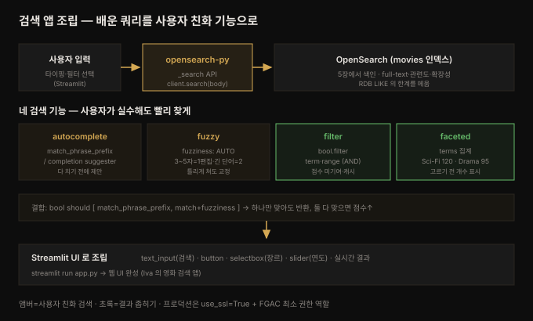

# 검색 앱 만들기 — autocomplete·fuzzy·faceted·UI

---

> 지금까지(1~8장)는 OpenSearch 자체를 배웠습니다. 9장은 그 조각들을 **하나의 앱으로 조립**하는 종합 실습입니다. 개발자 Iva 가 영화 검색 앱을 만드는 여정을 따라가며, API 로 앱과 OpenSearch 를 잇고(opensearch-py), 사용자 친화적 기능(autocomplete·fuzzy)을 얹고, 필터·faceted 로 결과를 좁히고, Streamlit UI 로 마무리합니다. 개념이 아니라 **동작하는 앱**이 목표라, 앞 장들의 match·bool·filter·집계가 여기서 하나로 수렴합니다.


## 핵심 요약

> 이 장의 한 문장은 **"OpenSearch 를 앱의 검색 엔진으로 삼아, 배운 쿼리를 사용자 친화적 기능과 UI 로 조립한다"** 입니다. RDB(MySQL·PostgreSQL)의 검색 한계 — 느린 `LIKE`, 관련도 순서 없음, fuzzy 미지원, 확장성 문제 — 를 OpenSearch 가 정확히 메웁니다.
>
> 흐름이 넷입니다. 첫째 **API 연결** — REST API(GET/POST/PUT/DELETE)와 `_search` 를 `opensearch-py` 클라이언트로 호출해 앱과 OpenSearch 를 잇습니다. 둘째 **사용자 친화 검색** — `match_phrase_prefix` 로 타이핑 중 자동완성(autocomplete), `fuzziness: AUTO` 로 오타 교정(fuzzy), `bool should` 로 둘을 결합. 셋째 **필터·faceted** — `bool.filter` 에 `term`(장르)·`range`(연도)를 얹어 결과를 좁히고, terms 집계로 필터 옵션과 개수를 미리 보여줍니다(faceted). 넷째 **UI** — Streamlit 으로 검색창·자동완성·필터·실시간 결과를 묶습니다.
>
> 관통하는 통찰은 **"좋은 검색은 정확한 매칭이 아니라, 사용자가 실수해도 원하는 걸 빨리 찾게 돕는 것"** 입니다. autocomplete 는 다 치기 전에, fuzzy 는 틀리게 쳐도, faceted 는 뭘 고를 수 있는지 미리 — 셋 다 사용자의 인지 부담을 줄입니다.


## 학습 목표

1. RDB 검색의 한계와 OpenSearch 가 그것을 메우는 지점(full-text·관련도·fuzzy·확장성)을 설명할 수 있습니다.
2. `opensearch-py` 클라이언트로 OpenSearch 에 연결하고 `_search` API 로 쿼리를 실행할 수 있습니다.
3. `match_phrase_prefix`(autocomplete)와 `fuzziness: AUTO`(fuzzy)를 구현하고, `bool should` 로 결합할 수 있습니다.
4. `bool.filter` 의 `term`·`range` 로 다중 필터를 걸고, terms 집계로 faceted search 를 만들 수 있습니다.
5. Streamlit 으로 검색 UI(자동완성·필터·실시간 결과)를 조립하는 전체 흐름을 이해할 수 있습니다.


## 본문 정리

아래 그림이 이 장 전체의 흐름입니다 — 사용자 입력이 여러 검색 기능을 거쳐 UI 로 돌아옵니다.



### 1. Iva 의 문제 — 왜 RDB 로는 안 되는가

Iva 는 영화 검색 앱을 만듭니다. 제목·장르·설명으로 검색하고, 빠르고 똑똑하며(오타 처리·최적 결과 우선), 연도·평점·카테고리로 필터하고, 추천까지 주는 게 목표입니다. RDB(MySQL·PostgreSQL)로 시도했지만 벽에 부딪혔습니다.

| RDB 한계 | 내용 |
|---------|------|
| 느리고 비효율 | `LIKE` 쿼리는 대용량에서 버벅이고 full-text 에 최적화 안 됨 |
| 관련도 순서 없음 | 결과가 특정 순서 없이 반환되어 최적 매칭을 위로 못 올림 |
| fuzzy 미지원 | 사용자는 오타를 내는데 SQL 은 오철자를 못 다룸 |
| 확장성 | DB 가 커질수록 쿼리 성능 악화 |

OpenSearch 는 이 문제를 위해 만들어졌습니다 — full-text 검색·autocomplete·fuzzy 매칭·관련도 랭킹으로 빠르고 지능적인 검색을 제공합니다. movies 인덱스는 5장에서 이미 색인했으므로, 이 장은 그 위에 앱을 얹습니다.

### 2. API 기반 개발 — 앱이 OpenSearch 와 대화하게

OpenSearch 는 RESTful API 라, 표준 HTTP 메서드로 다룹니다.

| 메서드 | 용도 |
|--------|------|
| GET | 데이터 조회 (영화 검색) |
| POST | 새 문서 추가 (랜덤 ID 자동 생성) |
| PUT | 특정 ID 로 문서 추가·갱신 |
| DELETE | 문서 제거 |

앱에서 가장 중요한 건 **`_search` API** 입니다. Python 으로 연결하려면 의존성을 격리한 venv 에 `opensearch-py` 를 깝니다.

```python
# venv + 설치
python3 -m venv opensearch_env
source opensearch_env/bin/activate
pip install opensearch-py
```

클라이언트를 만들고 쿼리를 실행합니다. 자격증명은 환경변수로 둡니다.

```python
from opensearchpy import OpenSearch
import os

client = OpenSearch(
    hosts=[{"host": "localhost", "port": 9200}],
    http_auth=(os.getenv("OPENSEARCH_USERNAME"), os.getenv("OPENSEARCH_PASSWORD")),
    use_ssl=False,   # 로컬 예제 한정 — 프로덕션은 TLS
)
query = {"query": {"match": {"title": "Inception"}}}
response = client.search(index="movies", body=query)
print(response["hits"]["hits"])
```

`client.search(index, body)` 가 요청을 보내고, 응답의 `hits.hits` 에 매칭 문서가 담깁니다. UI 통합 전에 Python 으로 장르·감독·연도 쿼리를 바꿔 가며 수동 테스트하는 게 순서입니다.

### 3. Autocomplete — 타이핑 중 제안

좋은 검색은 정확한 매칭만이 아니라, 실수해도 빨리 찾게 돕는 데 있습니다. **autocomplete** 는 사용자가 타이핑하는 동안 제목을 제안합니다. 5장에서 만든 **search-as-you-type 필드 `sayt_title`**(부분 매칭용 커스텀 analyzer 로 색인)에 `match_phrase_prefix` 를 씁니다 — 접두사 기반 제안에 최적화된 쿼리입니다.

```python
query = {"query": {"match_phrase_prefix": {"sayt_title": "Inc"}}}
# "Inc" 입력 → Inception, Incendiary, Incendios ...
```

### 4. Fuzzy search — 오타 교정

사용자는 "Inseption"처럼 오타를 냅니다. **fuzzy 매칭**은 `fuzziness` 파라미터로 오철자를 동적으로 교정합니다.

```python
query = {"query": {"match": {"title": {"query": "Inseption", "fuzziness": "AUTO"}}}}
# "Inseption" 입력 → Inception 결과 반환
```

`AUTO` 는 단어 길이에 따라 허용 편집 수를 자동 결정합니다.

| 단어 길이 | 허용 편집(edit distance) |
|----------|------------------------|
| 3~5자 | 1편집 |
| 그보다 긴 단어 | 2편집 |

> 💬 **비유**: fuzziness 는 **관대한 채점관**입니다. 편집 거리(edit distance)는 "이 단어를 저 단어로 바꾸려면 글자를 몇 번 고쳐야 하나"인데, AUTO 는 짧은 단어엔 엄격하게(1번), 긴 단어엔 너그럽게(2번) 오답을 봐줍니다. 짧은 단어는 한 글자만 틀려도 전혀 다른 뜻이 되기 쉬우니 덜 봐주는 게 합리적입니다.

### 5. Autocomplete + Fuzzy 결합 — bool should

최고의 경험은 둘을 합칠 때 나옵니다. `bool should` 로 묶으면 **autocomplete 든 fuzzy 든 하나라도 매칭하면** 문서를 반환하되, **둘 다 매칭하면 점수가 더 높아** 위로 올라옵니다(6장 should 절의 그 동작).

```python
query = {"query": {"bool": {"should": [
    {"match_phrase_prefix": {"sayt_title": {"query": "Incep"}}},
    {"match": {"title": {"query": "Inseption", "fuzziness": "AUTO"}}}
]}}}
```

타이핑 중 즉시 제안하면서 사소한 오타도 자동 교정하는, 두 마리 토끼를 잡는 패턴입니다.

### 6. 필터와 faceted search — 사용자에게 통제권을

autocomplete·fuzzy 다음은 **필터로 결과를 좁히는** 단계입니다. 스트리밍 서비스처럼 장르·연도로 거르고, 여러 필터를 동시에 걸고, faceted 로 필터 옵션을 동적으로 보여줍니다.

**장르 필터** — `bool.filter` 의 `term`(6장에서 배운, 점수에 기여하지 않는 filter context):

```python
query = {"query": {"bool": {"filter": [{"term": {"genres.keyword": "Sci-Fi"}}]}}}
```

**연도 필터** — `range`:

```python
query = {"query": {"bool": {"filter": [{"range": {"year": {"gte": 2010, "lte": 2020}}}]}}}
```

**다중 필터** — filter 배열에 여러 절을 넣으면 **모두 만족**하는 결과만 나옵니다(2010~2020 Sci-Fi):

```python
query = {"query": {"bool": {"filter": [
    {"term": {"genres.keyword": "Sci-Fi"}},
    {"range": {"year": {"gte": 2010, "lte": 2020}}}
]}}}
```

**Faceted search** — 필터를 고르기 *전에* 각 옵션의 개수를 보여줍니다("Sci-Fi 120편·Drama 95편"). 7장에서 배운 **terms 집계**로 구현합니다.

```python
query = {"size": 0, "aggs": {"genres": {"terms": {"field": "genres.keyword", "size": 10}}}}
for bucket in response["aggregations"]["genres"]["buckets"]:
    print(f"{bucket['key']}: {bucket['doc_count']} movies")
```

`size` 로 반환할 버킷(장르) 수를 정합니다. 사용자가 고르기 전에 선택지와 규모를 먼저 아는 게 faceted 의 핵심입니다.

### 7. Streamlit UI — 전부 하나로

기능이 다 갖춰졌으니 UI 로 묶습니다. **Streamlit** 은 Python 으로 대화형 웹 앱을 빠르게 만드는 프레임워크입니다.

```python
pip install streamlit pandas
```

핵심 위젯과 대응 기능입니다.

| Streamlit 위젯 | 하는 일 | OpenSearch 쿼리 |
|---------------|--------|----------------|
| `st.text_input` | 검색어 입력 | — |
| `st.button("Search")` | 검색 실행 | `match` |
| `st.selectbox` | 장르 필터 드롭다운 | terms 집계로 옵션 채움 |
| `st.slider` | 연도 범위 | `range` filter |
| 자동완성 표시 | 타이핑 중 제안 | **completion suggester** |

UI 의 자동완성은 본문 §3 의 `match_phrase_prefix` 대신 **completion suggester**(`suggest`·`prefix`·`completion`)를 씁니다 — 실시간 제안에 더 특화된 방식입니다.

```python
def get_autocomplete_suggestions(query):
    body = {"suggest": {"movie-suggest": {
        "prefix": query,
        "completion": {"field": "sayt_title", "size": 5}}}}
    response = client.search(index="movies", body=body)
    return [o["text"] for o in response["suggest"]["movie-suggest"][0]["options"]]
```

필터 결합 검색은 `bool.must`(제목 match) + `bool.filter`(장르 term·연도 range)를 조건부로 조립합니다 — 사용자가 "All"이 아닌 장르를 고르거나 연도 범위를 정하면 filter 배열에 절을 append 합니다. `streamlit run app.py` 로 웹 UI 가 뜨면 Iva 의 앱이 완성됩니다.


## 심화 학습

책 예제는 학습 편의를 위해 몇 가지를 단순화했습니다. 실무로 옮길 때 반드시 짚어야 할 두 지점을 공식 문서로 보강합니다.

**`use_ssl=False` 와 평문 자격증명은 학습용입니다.** 책은 로컬 예제라 `use_ssl=False` 로 TLS 를 끄고 `admin/admin` 을 씁니다. 프로덕션에서는 8장 Security 플러그인이 켜져 TLS 가 강제되므로 `use_ssl=True`·`verify_certs=True`·`ca_certs` 설정이 필요하고, 자격증명은 환경변수·시크릿 매니저로 주입합니다(코드·저장소에 절대 하드코딩 금지). 또 `admin` 슈퍼유저 대신 FGAC 로 **읽기 전용 앱 전용 역할**을 만들어 최소 권한으로 접속하는 게 원칙입니다. 자세히는 공식 [opensearch-py client](https://docs.opensearch.org/latest/clients/python-low-level/) 를 참고하세요.

**match_phrase_prefix 와 completion suggester 는 용도가 다릅니다.** 이 장은 §3 에서 autocomplete 에 `match_phrase_prefix` 를, §7 UI 에서는 `completion suggester` 를 씁니다 — 둘 다 자동완성이지만 트레이드오프가 반대입니다. `match_phrase_prefix` 는 **기존 text 필드에 바로** 쓸 수 있어 간편하지만, 마지막 단어를 접두사로 훑느라 문서가 많으면 느려질 수 있습니다. `completion suggester` 는 **전용 자료구조(FST, 유한 상태 변환기)를 메모리에 올려** 역색인 조회 없이 접두사를 따라가므로 지연이 밀리초 단위로 낮지만, 필드를 `completion` 타입으로 별도 매핑해야 하고 색인 시점에 제안 후보를 준비해야 합니다. 즉 "간편함 vs 속도"의 선택입니다 — 실시간 타이핑 제안처럼 지연이 치명적인 UI 에는 completion suggester 가, 가벼운 접두사 검색에는 match_phrase_prefix 가 맞습니다. 공식 [Autocomplete](https://docs.opensearch.org/latest/search-plugins/searching-data/autocomplete/) 문서에 세 방식(prefix·edge n-gram·completion)의 비교가 정리돼 있습니다.

이 장은 상위 [`06_observability/README.md`](../../README.md) 의 관측성 주제와는 결이 다른 **애플리케이션 검색** 사례이지만, 같은 엔진의 같은 쿼리(match·bool·filter·집계)를 쓴다는 점에서 앞 장들과 이어집니다 — 로그를 분석하든 영화를 검색하든 OpenSearch 의 쿼리 어휘는 하나라는 게 이 책의 일관된 메시지입니다.


## 결정 치트시트

| 상황 | 선택 | 이유 |
|------|------|------|
| 앱과 OpenSearch 연결(Python) | `opensearch-py` + `_search` API | REST 클라이언트 |
| 타이핑 중 제안(간편) | `match_phrase_prefix` (기존 text 필드) | 별도 매핑 불필요 |
| 타이핑 중 제안(고속) | completion suggester (FST) | 실시간 UI, 전용 매핑 필요 |
| 오타 교정 | `match` + `fuzziness: AUTO` | 길이별 편집 거리 자동 |
| 자동완성+오타 동시 | `bool should` (둘 매칭 시 점수↑) | 하나만 맞아도 반환 |
| 값 필터(장르) | `bool.filter` + `term` | 점수 미기여·캐시(6장) |
| 범위 필터(연도) | `bool.filter` + `range` | 수치 범위 |
| 여러 필터 AND | filter 배열에 절 나열 | 모두 만족 |
| 필터 옵션·개수 미리보기 | terms 집계(faceted) | 고르기 전 선택지 표시 |
| 빠른 검색 UI | Streamlit | Python 대화형 웹 |
| 프로덕션 연결 | `use_ssl=True`+FGAC 역할 | TLS·최소 권한(심화 학습) |


## Spring 앱 개발 관점

이 장은 책에서 유일하게 **완성된 앱을 처음부터 만드는** 실습이라, Spring 관점이 가장 직접적입니다. 다만 책은 **Python(opensearch-py) + Streamlit** 을 씁니다. 사용자는 Spring 위에서 Java 를 쓰므로, 여기서는 **책의 Python 앱을 Spring Boot 로 옮기면 각 기능이 어떻게 되는가**를 정리합니다. 책에 Spring 예제가 없어 **공식 문서(spring-data-opensearch / spring-data-elasticsearch)로 보강**했습니다.

핵심 대응: Python 은 dict(JSON)를 그대로 `client.search(body=...)` 에 넘기지만, Spring Data 는 **타입 안전한 `NativeQuery.builder()` lambda** 로 같은 DSL 을 조립합니다. 아키텍처도 다릅니다 — Streamlit 은 UI·검색이 한 스크립트에 섞이지만, Spring 은 검색 로직을 **Service/Repository 계층**에 두고 UI(React 등)는 REST API 로 분리하는 게 정석입니다.

**(a) 기본 검색 — match** — 책 §2 의 `{"match": {"title": ...}}` 대응:

```java
Query query = NativeQuery.builder()
        .withQuery(q -> q.match(m -> m.field("title").query("Inception")))
        .build();
SearchHits<Movie> hits = operations.search(query, Movie.class);
```

**(b) autocomplete — match_phrase_prefix** — 책 §3 대응. Spring Data 는 클라이언트의 `matchPhrasePrefix` variant 를 노출합니다:

```java
.withQuery(q -> q.matchPhrasePrefix(m -> m.field("saytTitle").query("Inc")))
```

**(c) fuzzy — fuzziness** — 책 §4 대응. `match` 빌더에 `.fuzziness("AUTO")` 를 체이닝합니다:

```java
.withQuery(q -> q.match(m -> m.field("title").query("Inseption").fuzziness("AUTO")))
```

**(d) autocomplete + fuzzy 결합 — bool should** — 책 §5 대응:

```java
.withQuery(q -> q.bool(b -> b
        .should(s -> s.matchPhrasePrefix(m -> m.field("saytTitle").query("Incep")))
        .should(s -> s.match(m -> m.field("title").query("Inseption").fuzziness("AUTO")))))
```

**(e) 필터 + faceted — bool.filter + terms 집계** — 책 §6 대응. 필터는 `withFilter`(점수 미기여), facet 은 `withAggregation` 으로 한 쿼리에 함께 겁니다:

```java
Query query = NativeQuery.builder()
        .withQuery(q -> q.match(m -> m.field("title").query(keyword)))
        .withFilter(f -> f.bool(b -> b
                .must(mu -> mu.term(t -> t.field("genres.keyword").value("Sci-Fi")))
                .must(mu -> mu.range(r -> r.field("year").gte(JsonData.of(2010)).lte(JsonData.of(2020))))))
        .withAggregation("genres", Aggregation.of(a -> a.terms(t -> t.field("genres.keyword").size(10))))
        .build();
```

Repository 로 감싸면 파생 메서드가 편한 경우도 있습니다. 단순 필드 검색·fuzzy 는 `@Query` 애노테이션이나 파생 메서드로 되지만, bool·집계·suggester 는 앞 장들처럼 `NativeQuery` 여야 합니다.

**주의할 점 두 가지.** 첫째, **completion suggester 는 Spring Data 에서 별도 경로입니다.** `suggest` 메서드가 버전에 따라 deprecated 되어 왔으므로(4.3 에서 옛 `SuggestBuilder` 시그니처 deprecated), 최신에서는 `NativeQuery` 에 suggester 를 담아 `search(...)` 로 실행하고 `SearchHits` 에서 suggest 결과를 꺼내는 방식을 씁니다 — 쓰는 버전의 마이그레이션 가이드를 확인해야 합니다(추측 금지). 둘째, **`saytTitle` 같은 필드는 매핑이 전제입니다.** search-as-you-type·completion 필드는 엔티티 애노테이션(`@Field` 또는 `@CompletionField`)이나 `@Mapping` JSON 으로 매핑을 명시해야 하며(4장·8장의 그 원칙), 그 매핑이 없으면 `match_phrase_prefix`·completion 쿼리가 런타임에 실패합니다.

정리하면, 책의 Python 스크립트 한 편은 Spring 에서 **Service(쿼리 조립) + Repository(operations) + Controller(REST) + 별도 프런트엔드**로 나뉩니다. 쿼리 DSL 자체는 1:1 대응되지만, 계층 분리와 타입 안전성이 Spring 쪽 이점이고, 대신 boilerplate 가 늘어나는 트레이드오프입니다.


## 면접 대비

**한 줄 정의**: 9장은 OpenSearch 를 앱의 검색 엔진으로 삼아 API 연결(opensearch-py)·autocomplete(match_phrase_prefix)·fuzzy(fuzziness AUTO)·필터(bool.filter)·faceted(terms 집계)를 Streamlit UI 로 조립하는 종합 실습입니다.

**핵심 3가지**
1. **좋은 검색은 실수를 용서한다** — autocomplete(다 치기 전)·fuzzy(틀리게 쳐도)·faceted(뭘 고를지 미리)가 사용자 인지 부담을 줄입니다. RDB 의 `LIKE` 로는 못 하는 지점입니다.
2. **fuzziness AUTO 는 길이별로 관대함이 다르다** — 3~5자는 1편집, 긴 단어는 2편집. 짧은 단어는 한 글자만 틀려도 뜻이 달라지기 쉬워 덜 봐줍니다.
3. **filter 는 점수에 기여하지 않고 캐시된다** — 장르·연도 필터는 `bool.filter` 에 넣습니다(6장). faceted 는 terms 집계로 필터 옵션과 개수를 고르기 전에 보여줍니다.

**FAQ**
- **Q. autocomplete 에 match_phrase_prefix 와 completion suggester 중 뭘 쓰나?**
  A. 간편함이면 match_phrase_prefix(기존 필드에 바로), 속도가 중요하면 completion suggester(FST 를 메모리에 올려 밀리초 단위 응답, 전용 매핑 필요)입니다. 실시간 타이핑 UI 처럼 지연이 치명적이면 completion suggester 가 낫습니다.
- **Q. autocomplete 와 fuzzy 를 bool should 로 묶으면 어떻게 되나?**
  A. 둘 중 하나만 매칭해도 문서가 반환되고, 둘 다 매칭하면 점수가 더 높아 위로 올라옵니다. 타이핑 제안과 오타 교정을 동시에 잡는 패턴입니다.
- **Q. 다중 필터를 filter 배열에 넣으면 AND 인가 OR 인가?**
  A. AND 입니다. `bool.filter` 배열의 모든 절을 만족하는 문서만 반환됩니다. OR 이 필요하면 should 절이나 별도 bool 중첩을 씁니다.


## 핵심 개념 체크리스트

- [ ] RDB 검색의 네 한계(느림·관련도 없음·fuzzy 미지원·확장성)를 든다
- [ ] opensearch-py 로 클라이언트를 만들고 `_search` API 를 호출할 수 있다
- [ ] REST 메서드(GET/POST/PUT/DELETE)의 용도를 구분한다
- [ ] match_phrase_prefix 로 autocomplete 를 구현하는 이유를 안다
- [ ] fuzziness AUTO 의 길이별 편집 거리(3~5자=1, 긴 단어=2)를 안다
- [ ] bool should 로 autocomplete+fuzzy 를 결합하는 효과를 설명할 수 있다
- [ ] bool.filter 에 term·range 를 넣어 다중 필터(AND)를 건다
- [ ] terms 집계로 faceted search(필터 옵션·개수)를 만든다
- [ ] completion suggester 와 match_phrase_prefix 의 트레이드오프를 안다
- [ ] Streamlit 위젯(text_input·selectbox·slider)과 쿼리의 대응을 안다
- [ ] use_ssl=False·평문 자격증명이 학습용임을 알고 프로덕션 대안을 안다


## 참고 자료

- 원본: *The Definitive Guide to OpenSearch* (ISBN 9781835885789), Chapter 9 — OpenSearch in Action: Making Apps Awesome. O'Reilly/Packt, `learning.oreilly.com/library/view/the-definitive-guide/9781835885789`
- 공식 문서:
  - [OpenSearch — Python client (opensearch-py)](https://docs.opensearch.org/latest/clients/python-low-level/)
  - [OpenSearch — Autocomplete functionality](https://docs.opensearch.org/latest/search-plugins/searching-data/autocomplete/)
  - [OpenSearch — Did-you-mean / fuzzy](https://docs.opensearch.org/latest/query-dsl/term/fuzzy/)
  - [Streamlit 공식 문서](https://docs.streamlit.io/)
  - [Spring Data Elasticsearch — NativeQuery & suggest](https://docs.spring.io/spring-data/elasticsearch/reference/elasticsearch/template.html)
- 관련 노트:
  - [05-01 검색 핵심 API — 쿼리 처리와 leaf 쿼리](./05-01.검색%20핵심%20API%20—%20쿼리%20처리와%20leaf%20쿼리.md) (match·search-as-you-type 필드)
  - [06-01 고급 쿼리 — 복합·지리·faceted·percolation](./06-01.고급%20쿼리%20—%20복합·지리·faceted·percolation.md) (bool·filter·faceted)
  - [07-01 분석과 시각화 — 집계·대시보드·관측성](./07-01.분석과%20시각화%20—%20집계·대시보드·관측성.md) (terms 집계)
  - [README (정독 노트 MOC)](./README.md)
