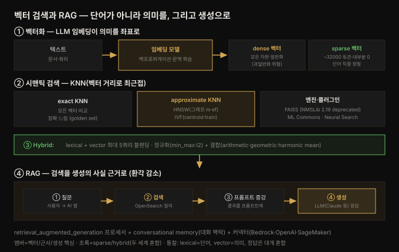

# 벡터·생성 AI — 시맨틱 검색과 RAG

---

> 이 책 검색 여정의 정점입니다. 9장까지는 **단어를 맞추는(lexical)** 검색이었다면, 10장은 **의미를 맞추는(semantic)** 검색으로 넘어갑니다. LLM 임베딩이 텍스트를 고차원 벡터로 바꾸고, 그 벡터의 거리로 "뜻이 가까운" 문서를 찾고(KNN), 급기야 그 검색 결과를 LLM 프롬프트에 붙여 정확한 답을 생성(RAG)합니다. 8장에서 예고한 KNN·Neural Search 플러그인이 여기서 본격 전개되고, 9장 말미의 "다음은 semantic·vector search" 예고가 실현됩니다.


## 핵심 요약

> 이 장의 한 문장은 **"벡터 임베딩으로 '의미'를 검색하고(semantic), 그 검색을 LLM 프롬프트에 붙여 정확한 생성을 만든다(RAG)"** 입니다. "a tv for the family living room"과 "65-inch OLED TV"는 단어가 겹치지 않지만 뜻은 같습니다 — lexical 검색은 못 잇고, 벡터 검색은 잇습니다.
>
> 축이 셋입니다. 첫째 **벡터화** — LLM 임베딩 모델이 백프로파게이션으로 문맥을 학습해 텍스트를 고차원 벡터로 인코딩합니다. **dense 벡터**(모든 차원에 값, 일반화 강하나 과일반화 위험)와 **sparse 벡터**(WordPiece ~32000 토큰, 대부분 0, 단어와 직결돼 정밀 매칭 보존)로 갈립니다. 둘째 **시맨틱 검색(KNN)** — 벡터 거리로 최근접 이웃을 찾습니다. exact KNN(모든 벡터 비교, 정확하나 느림)과 approximate KNN(HNSW 그래프·IVF 클러스터로 근사, 빠르나 정확도 손실)이 있고, ML Commons·Neural Search 플러그인이 모델·파이프라인을 관리합니다. 셋째 **하이브리드·생성** — sparse·dense·lexical 을 섞는 hybrid 쿼리(최대 5개, 점수 정규화)로 두 세계의 장점을 취하고, RAG 로 검색 결과를 프롬프트에 붙여 LLM 환각(hallucination)을 줄입니다.
>
> 관통하는 통찰은 **"lexical 은 단어를, vector 는 의미를 맞춘다. 정답은 대개 둘의 혼합"** 입니다. dense 벡터는 일반화하다 과일반화하고, sparse·lexical 은 정밀하나 문맥을 놓칩니다. hybrid 가 그 사이를 메우고, RAG 는 정확한 검색을 생성의 사실 근거로 삼습니다.


## 학습 목표

1. dense 벡터와 sparse 벡터의 차이(값 분포·일반화 vs 정밀도)를 설명할 수 있습니다.
2. 시맨틱 검색이 KNN(벡터 거리 기반 최근접)이며 lexical 검색과 어떻게 다른지 구분할 수 있습니다.
3. exact KNN 과 approximate KNN(HNSW·IVF)의 트레이드오프와 주요 하이퍼파라미터를 든다.
4. ML Commons·Neural Search 플러그인과 ingest/search 파이프라인의 역할을 이해할 수 있습니다.
5. hybrid 쿼리의 점수 정규화·결합과 RAG(검색 증강 생성)의 구조를 설명할 수 있습니다.


## 본문 정리

아래 그림이 이 장 전체의 흐름입니다 — 텍스트가 벡터가 되고, 검색을 거쳐 생성으로 이어집니다.



### 1. 벡터화 — 단어가 아니라 의미를 좌표로

검색의 본질은 **의미**를 잇는 데 있습니다. 구체적 쿼리("65-inch OLED television")는 문서의 단어와 가까워 lexical 검색으로 충분합니다. 그러나 추상적 쿼리("a tv for the family living room")는 문서 단어와 멀어, 단어 매칭만으론 "LG 65-Inch TV"를 못 찾습니다.

LLM **임베딩 모델**이 이를 해결합니다. 주변 단어(문맥)를 그 단어의 인코딩에 담아, 텍스트를 고차원 벡터로 바꿉니다. "living room"이 "65 OLED TV"와 자주 함께 등장하면, 두 벡터가 벡터 공간에서 가까워집니다.

> 💬 **비유**: 임베딩은 단어를 **의미의 지도 위 좌표**로 찍는 작업입니다. "빨강" 축과 "노랑" 축이 있다면, 홍옥 사과는 빨강 쪽, 그래니 스미스 사과는 노랑에 가깝게, 바나나는 노랑 끝에 놓입니다. 실제 LLM 은 우리가 정한 축(빨강·노랑)이 아니라, **백프로파게이션으로 스스로 축의 의미를 학습**합니다 — 각 차원이 어떤 뜻인지 사람은 딱 짚어 말할 수 없지만, 비슷한 것끼리 뭉치는 군집은 눈에 보입니다.

**백프로파게이션**은 모델 출력의 오차를 계산해 다층 신경망의 가중치를 조정하는 ML 기법입니다. 이를 통해 LLM 은 각 입력 차원의 의미와 최적 값을 학습합니다.

### 2. Dense vs Sparse 벡터

| | Dense 벡터 | Sparse 벡터 |
|--|-----------|------------|
| 값 분포 | 모든 차원에 값 | 대부분 0, 소수 차원만 높은 값 |
| 차원의 의미 | 혼합된 추상 의미(사람이 못 짚음) | 개별 단어에 직결(WordPiece ~32000 토큰) |
| 강점 | 문맥·의미 일반화 | 정밀 매칭 보존 |
| 약점 | **과일반화**("Star Wars IV" 검색에 stars·wars·hope 영화가 섞임) | 단어가 겹치지 않으면 매칭 실패 |

임베딩 모델의 출력은 모든 차원에 값이 있어 **dense 벡터**라 부릅니다. **sparse 벡터**는 WordPiece 로 어휘를 ~32000 토큰으로 줄이고, transformer 로 토큰별 가중치를 예측해 32000 차원 벡터를 만듭니다(대부분 0). 예를 들어 "Star Wars I"의 sparse 벡터는 phantom(2.46)·jedi(2.04)·menace(1.89) 같은 토큰이 높은 가중치를 갖습니다(총 168 토큰).

### 3. 시맨틱 검색과 KNN

**시맨틱 검색**은 문서 코퍼스의 벡터 임베딩에서, 쿼리 임베딩과 수학적으로 가까운 이웃을 찾습니다. 이 "가까운 이웃 찾기"가 **KNN(K-Nearest-Neighbors)** 이고, lexical 검색(쿼리 단어를 인덱스 단어에 매칭)과 대비됩니다. OpenSearch 는 **KNN 플러그인**으로 이를 제공하며, 벡터를 쿼리의 일부·전체로 보내는 Query DSL API 를 줍니다.

- **exact KNN** — 쿼리 벡터를 필터 통과 문서의 **모든** 임베딩과 비교. 가장 정확하지만 매칭 수만큼 지연 증가. golden set(정답 세트) 준비엔 좋으나 백만+ 데이터셋엔 부적합.
- **approximate KNN** — 비교 횟수를 줄이는 기법으로 근사. 일부 근접 매칭을 놓쳐 정확도는 낮지만 지연이 낮음.

> 💬 **비유**: exact KNN 은 **도서관 전 서가를 한 권씩 다 확인**하는 방식이고, approximate KNN 은 **분류 표지판을 따라 관련 서가로 바로 가는** 방식입니다. 전자는 반드시 최적을 찾지만 느리고, 후자는 대개 최적에 가깝지만 가끔 놓칩니다.

> 📏 **검색 품질 측정**: precision(결과 중 관련 비율)·accuracy(정답 반환 비율)·NDCG@10(순위를 반영한 누적 이득, 사람이 매긴 이상 순서 대비)로 잽니다. golden set 을 잣대로 approximate 가 exact 대비 얼마나 정확도를 잃는지 측정합니다.

### 4. ML Commons 와 Neural Search 플러그인

**ML Commons 플러그인**이 ML 모델과의 상호작용을 중개합니다 — 클러스터 노드에 모델을 로드하거나, 서드파티(SageMaker·Bedrock) 모델에 커넥터로 연결합니다. K-means·선형회귀·Random Cut Forest(이상 탐지)·임베딩 모델·텍스트 생성 모델 등을 지원합니다. `only_run_on_ml_node`(전용 ML 노드) 같은 클러스터 설정을 씁니다.

**Neural Search 플러그인**은 모델 커넥터 프레임워크로, `model_id` 로 모델 위치를 추상화합니다. **ingest pipeline**(색인 시 데이터 변형·강화, 40여 프로세서)에서 `text_embedding`·`sparse_encoding` 프로세서를 써서 임베딩을 생성합니다.

> ⚠️ **ingest node 분리**: ingest pipeline 은 기본적으로 data node 에서 도는데, data node 는 쿼리 응답이 본업입니다. 과부하를 막으려면 별도 **ingest node** 를 두거나, ETL 전용 **Data Prepper**(관리형: Amazon OpenSearch Ingestion)를 쓰는 게 낫습니다. **search pipeline** 은 쿼리 처리(임베딩 생성·hybrid 정규화·re-ranking)를 오케스트레이션합니다.

### 5. Approximate NN — HNSW 와 IVF

OpenSearch 는 두 ANN 알고리즘을 지원합니다.

**HNSW(Hierarchical Navigable Small World)** — 계층 그래프를 만듭니다. 최상위 층은 성기고(coarse), 깊을수록 촘촘합니다(fine). 검색은 최상위 랜덤 지점에서 시작해 각 층에서 최근접을 찾아 내려가며, 최하위 층에서 k 이웃을 반환합니다. 주요 하이퍼파라미터:

| 파라미터 | 기본 | 역할 |
|---------|------|------|
| `m` | 16 | 그래프 간선 수 (많을수록 메모리↑·정확도↑) |
| `ef_construction` | 100 | 그래프 구축 시 유지 포인트 수 (높을수록 정확·구축 메모리↑) |
| `ef_search` | 100 | 탐색 시 따라갈 간선 수 (높을수록 정확·지연↑) |
| `encoder` | flat | 양자화 인코더 (비트 수를 줄여 메모리 절감) |

**IVF(Inverted File)** — 클러스터링으로 centroid 를 만들고, centroid 를 키로 하는 역색인을 만듭니다(posting list 에 이웃 벡터). 검색 시 centroid 로 최근접 클러스터를 찾고 그 안에서만 거리를 계산합니다. **먼저 벡터 부분집합으로 모델을 train** 해야 하며(centroid 결정), 학습된 `model_id` 를 필드 정의에 씁니다.

**엔진**은 셋 — FAISS·NMSLib·Lucene. **NMSLib 은 2.19 에서 deprecated**(이후 제거 예정)라 이 장은 FAISS 중심입니다. 셋 다 HNSW 를 지원하며 최대 **16000 차원**까지 저장합니다. `space_type: l2`(유클리드 거리)로 거리 함수를 정합니다.

> 💬 **모델·엔진·알고리즘 구분**: model 은 입출력 관계를 학습하는 AI/ML 함수, engine 은 벡터 저장·조회를 구현한 코드베이스(FAISS 등), algorithm 은 엔진이 최근접을 색인·탐색하는 방식(HNSW·IVF)입니다.

```json
// FAISS + HNSW knn_vector 필드 정의
"embedding": {
  "type": "knn_vector", "dimension": 384,
  "method": {"name": "hnsw", "engine": "faiss", "space_type": "l2",
    "parameters": {"m": 64, "ef_construction": 512, "ef_search": 16}}}
```

lexical(multi_match)과 비교하면, HNSW 는 "force and jedis" 쿼리에서 일반화로 Star Wars 를 찾아내지만 multi_match 는 "Sci-Fi" 단어만 매칭해 엉뚱한 결과를 냅니다.

### 6. Sparse 벡터와 Hybrid 검색

sparse 벡터는 dense 와 단어의 중간에 섭니다 — lexical 의 정밀 매칭과 dense 의 문맥 매칭을 동시에 담아 **일종의 hybrid 검색**입니다. 두 모드가 있습니다.

- **doc-only** — 문서 필드에만 가중치 생성, 쿼리 시엔 tokenizer 로 토큰만 만듦. 빠르나 정확도 낮음.
- **bi-encoder** — 색인·쿼리 양쪽에서 sparse 벡터 생성, dot product 로 스코어. 느리나 정확.

구현은 `rank_features` 필드 + `sparse_encoding` 프로세서(ingest) + `neural_sparse` 쿼리를 씁니다. `neural_sparse_two_phase_processor` 는 1단계에서 토큰 부분집합으로 후보를 좁히고 2단계에서 전체 벡터로 rescore 해 지연을 줄입니다.

**Hybrid 쿼리** — 최대 **5개** 쿼리(lexical·vector 혼합)를 명시적으로 섞습니다. 문제는 lexical·vector 점수가 **다른 스케일**이라는 것 — `phase_results_processors` 의 정규화로 맞춥니다.

```json
"normalization-processor": {
  "normalization": {"technique": "min_max"},          // 또는 l2
  "combination": {"technique": "arithmetic_mean",     // geometric·harmonic
    "parameters": {"weights": [0.4, 0.6]}}}
```

정규화(min_max·l2)로 점수를 비교 가능한 범위로 가져오고, 결합(arithmetic/geometric/harmonic mean)으로 최종 점수를 만듭니다. `weights` 를 조절해 lexical↔semantic 비중을 다이얼링합니다.

### 7. 생성 AI 와 RAG — 검색을 생성의 근거로

지금까지는 벡터로 **검색**했습니다. LLM 은 프롬프트로부터 **새 텍스트를 생성**하는 데 더 유명합니다. OpenSearch 의 생성 AI 역할은 **프롬프트를 정확한 정보로 증강**하는 데 있습니다.

흐름은 이렇습니다. ① 소스 문서를 OpenSearch 에 적재(시맨틱이면 임베딩 생성) → ② 사용자가 AI 앱에 질문 → ③ 앱이 OpenSearch 에 관련 정보 질의 → ④ 그 정보를 붙인 프롬프트를 생성 모델에 보내 응답 반환.

**RAG(Retrieval-Augmented Generation)** — LLM 은 과일반화로 그럴듯하지만 **사실과 다른 답(hallucination, 환각)** 을 냅니다. 환각을 줄이는 방법은 셋 — 자체 LLM 학습, 파인튜닝, 그리고 **프롬프트에 정확한 데이터를 붙이기(RAG)**. RAG 는 정확한 정보 검색기가 필요한데, 그게 바로 OpenSearch 입니다.

> 💬 **비유**: RAG 는 **오픈북 시험**입니다. LLM 혼자 답하면(클로즈드북) 기억이 흐릿한 부분을 그럴듯하게 지어내지만(환각), 관련 페이지를 펼쳐 주면(검색 결과를 프롬프트에 첨부) 그 사실에 근거해 답합니다. OpenSearch 가 "정답 페이지를 펼쳐 주는" 역할입니다.

OpenSearch 는 `retrieval_augmented_generation` search 프로세서로 RAG 를 자동화합니다 — 쿼리 결과를 받아 프롬프트를 조립하고 모델을 호출합니다. **conversational memory**(`/_plugins/ml/memory` API)로 대화 맥락을 유지합니다. **커넥터**로 OpenAI·Bedrock·SageMaker·Cohere 외부 모델에 연결합니다(예제는 Amazon Bedrock 의 **Claude 3.5 Sonnet**).

```json
"retrieval_augmented_generation": {
  "model_id": "sample_model_id",
  "context_field_list": ["embedding_source"],
  "system_prompt": "You are a helpful assistant",
  "user_instructions": "Generate a concise and informative answer..."}
```

`generative_qa_parameters` 로 `llm_model`(bedrock/claude)·`memory_id`·`context_size` 를 지정합니다. "star wars"를 먼저 보내 대화 맥락을 만든 뒤 "best star wars movie?"를 물으면, 맥락 유무에 따라 답이 달라집니다.


## 심화 학습

이 장은 개념 밀도가 높아, 실무 판단에 직결되는 두 지점을 공식 문서로 보강합니다.

**양자화(quantization)가 벡터 검색 비용의 핵심입니다.** 본문은 encoder 하이퍼파라미터를 짧게 언급하지만, 실무에서 벡터 검색의 최대 병목은 **메모리**입니다 — HNSW 그래프는 통째로 RAM 에 올라가야 하고, 384차원 float32 벡터 100만 개면 그래프 오버헤드까지 수 GB 입니다. 양자화는 각 차원을 float32(32비트) 대신 더 적은 비트로 저장해 이를 줄입니다. OpenSearch 는 **scalar quantization**(FP16·바이트)과 **binary quantization**(1비트, 32배 압축)을 제공하며, 압축률과 재현율(recall)을 맞바꿉니다. 대용량 벡터를 다루면 "정확도 몇 %를 내주고 메모리 몇 배를 아낄 것인가"가 핵심 설계 결정이 됩니다. 공식 [k-NN vector quantization](https://docs.opensearch.org/latest/search-plugins/knn/knn-vector-quantization/) 을 참고하세요.

**이 장은 8장 KNN·Neural Search 플러그인의 실전 전개입니다.** 8장은 KNN·Neural Search 를 카탈로그로만 소개했는데, 10장이 그 둘을 실제로 조립합니다 — ML Commons(모델 관리) → Neural Search(ingest pipeline 으로 임베딩 생성) → KNN 플러그인(knn 쿼리) → RAG(search processor 로 생성). 상위 [`06_observability/README.md`](../../README.md) 관측성 맥락에서 보면, 이 벡터·RAG 능력이 로그 분석에도 쓰입니다 — 원문 도입부가 언급한 **SRE 의 지능형 로그·보안 데이터 처리**가 바로 그 응용입니다. 자연어로 "지난주 인증 실패 급증 원인은?"을 물으면, 로그를 시맨틱 검색해 관련 이벤트를 찾고 RAG 로 요약하는 식입니다. LGTM 스택에는 아직 이런 통합 벡터·생성 레이어가 없어, OpenSearch 가 "검색 엔진 + 벡터 DB + RAG 백엔드"를 한 몸에 갖는 점이 대비됩니다. 전체 그림은 공식 [Neural search](https://docs.opensearch.org/latest/search-plugins/neural-search/) 와 [Conversational search / RAG](https://docs.opensearch.org/latest/search-plugins/conversational-search/) 문서에 정리돼 있습니다.


## 결정 치트시트

| 상황 | 선택 | 이유 |
|------|------|------|
| 정확한 단어 매칭 | lexical(match·term) | 쿼리가 문서 단어와 가까움 |
| 의미·개념 매칭 | dense 벡터 KNN | 단어 겹침 없어도 뜻으로 매칭 |
| 정밀 매칭 + 문맥 | sparse 벡터(neural_sparse) | 단어 직결 + 일부 문맥 |
| 둘의 장점 모두 | hybrid 쿼리(정규화+결합) | lexical+vector 점수 블렌딩 |
| 최고 정확도(소규모) | exact KNN | 모든 벡터 비교, golden set 용 |
| 대용량 저지연 | approximate KNN | 근사, 정확도 일부 손실 |
| 그래프 기반 ANN | HNSW(m·ef_search) | train 불필요, 튜닝 자유 |
| 클러스터 기반 ANN | IVF(centroid) | train 필요, 대용량 |
| 벡터 엔진 | FAISS (NMSLib 은 2.19 deprecated) | 최대 16000차원 |
| 메모리 절감 | 양자화 인코더(scalar·binary) | 재현율↔메모리 트레이드오프(심화) |
| LLM 환각 감소 | RAG(retrieval_augmented_generation) | 검색 결과를 프롬프트에 첨부 |
| 대화 맥락 유지 | conversational memory API | 이전 대화를 다음 질문 맥락으로 |


## Spring 앱 개발 관점

이 장의 벡터 검색을 Spring Boot 에서 어떻게 쓰는지 정리합니다. 책은 **Python(opensearch-py) + Amazon Bedrock** 을 씁니다. 사용자는 Spring 위에서 Java 를 쓰므로 대응을 정리하되, **RAG 오케스트레이션은 Spring Data 범위 밖**이라는 경계를 먼저 긋습니다. 책에 Spring 예제가 없어 **공식 문서(spring-data-opensearch / spring-data-elasticsearch)로 보강**했습니다.

경계 구분이 핵심입니다. 벡터 **검색**(KNN 쿼리)은 Spring Data 가 직접 지원하지만, **RAG 파이프라인**(임베딩 생성·프롬프트 조립·LLM 호출)은 OpenSearch 의 server-side pipeline(ingest·search processor)이나 별도 AI 프레임워크(Spring AI·LangChain4j)의 몫입니다. 즉 Spring Data 로는 "벡터를 넣고 KNN 으로 꺼내는" 데까지, 그 위 생성 레이어는 다른 도구입니다.

**(a) knn_vector 필드 매핑** — 애노테이션만으로는 `method`(hnsw·faiss·space_type)를 다 표현하기 어려워, `@Mapping` 으로 JSON 매핑을 지정하는 게 안전합니다(8장의 그 패턴).

```java
@Document(indexName = "movies", createIndex = true)
@Setting(settingPath = "/settings/knn-settings.json")   // index.knn: true
@Mapping(mappingPath = "/mappings/movie-vector-mapping.json")   // knn_vector·dimension·method
class Movie { @Id String id; String title; float[] embedding; }
```

**(b) KNN 벡터 검색** — 8장에서 확인한 API 그대로입니다. Spring Data 5.4+ 는 top-level knn 을 `withKnnSearches` 로 노출합니다(그 이전은 `withKnnQuery`).

```java
Query query = NativeQuery.builder()
        .withKnnSearches(k -> k.field("embedding").queryVector(queryVec).k(4))
        .build();
SearchHits<Movie> hits = operations.search(query, Movie.class);
```

**(c) hybrid 검색** — lexical + vector 를 섞으려면 클라이언트에서 두 쿼리를 조립하거나, OpenSearch 의 hybrid 쿼리 + search pipeline(정규화)을 씁니다. 후자는 `NativeQuery` 에 hybrid 쿼리 DSL 을 담고, 정규화 파이프라인은 인덱스·요청 레벨에서 설정합니다 — 점수 정규화 로직이 서버 쪽 파이프라인에 있어 Spring 코드는 쿼리 조립까지만 합니다.

**주의할 점 두 가지.** 첫째, **임베딩 생성 위치를 정해야 합니다.** 쿼리 벡터를 만드는 방법은 둘입니다 — ① 애플리케이션이 임베딩 모델을 호출해 `float[]` 를 만들어 `queryVector` 로 넘기거나, ② OpenSearch 의 Neural Search(ingest/search pipeline)가 `text_embedding` 프로세서로 서버에서 생성하거나. Spring 앱이 직접 만들면 임베딩 모델 접근(Bedrock·로컬 모델)이 필요하고, 서버에 맡기면 `neural` 쿼리로 텍스트를 보내면 됩니다 — 파이프라인이 있어야 동작하므로 클러스터 설정을 확인해야 합니다(8장 플러그인 부재=런타임 실패 교훈과 직결). 둘째, **RAG 는 Spring AI 나 LangChain4j 로 오케스트레이션합니다.** OpenSearch 를 벡터 스토어(retriever)로 두고, 프롬프트 조립·LLM(Claude 등) 호출·대화 메모리는 AI 프레임워크가 맡는 게 Spring 생태계의 정석입니다. Spring Data OpenSearch 는 "벡터 검색 백엔드" 역할이고, 생성 레이어는 별도라는 계층 분리를 지켜야 합니다.

정리하면, Spring 앱에서 이 장은 **벡터 검색(Spring Data OpenSearch)** 과 **생성 오케스트레이션(Spring AI/LangChain4j)** 두 층으로 나뉩니다. 책의 Python 스크립트가 한 파일에서 다 하던 것을, Spring 에서는 검색 백엔드와 AI 프레임워크로 명확히 분리하는 게 유지보수에 유리합니다.


## 면접 대비

**한 줄 정의**: 10장은 LLM 임베딩으로 텍스트를 벡터화해 의미 기반 검색(시맨틱·KNN)을 하고, HNSW·IVF 로 대용량을 근사 처리하며, hybrid 로 lexical·vector 를 섞고, RAG 로 검색 결과를 LLM 프롬프트에 붙여 환각을 줄이는 장입니다.

**핵심 3가지**
1. **dense 는 의미를, sparse·lexical 은 단어를 맞춘다** — dense 벡터는 일반화하다 과일반화(Star Wars 검색에 stars·wars 영화가 섞임)하고, sparse 는 단어 직결로 정밀합니다. hybrid 가 둘을 섞습니다.
2. **exact vs approximate KNN 은 정확도-지연 트레이드오프** — exact 는 모든 벡터를 비교해 정확하나 느리고, HNSW(그래프)·IVF(클러스터)는 근사로 빠르나 일부를 놓칩니다. 대용량은 approximate 필수입니다.
3. **RAG 는 검색을 생성의 사실 근거로 삼는다** — LLM 환각을 줄이려 검색한 정확한 정보를 프롬프트에 붙입니다. OpenSearch 가 그 retriever 이고, conversational memory 로 대화 맥락을 유지합니다.

**FAQ**
- **Q. dense 벡터의 과일반화 문제란?**
  A. dense 는 단어와의 연결을 잃고 개념 공간으로 이동해 일반화하는데, 너무 일반화하면 "Star Wars Episode IV" 같은 구체적 쿼리에 stars·wars·hope 관련 영화가 섞여 나옵니다. 이럴 땐 sparse·lexical 을 hybrid 로 섞어 정밀도를 회복합니다.
- **Q. HNSW 와 IVF 의 차이는?**
  A. HNSW 는 계층 그래프를 걸어 내려가며 최근접을 찾고 train 이 불필요합니다. IVF 는 벡터를 클러스터링해 centroid 역색인을 만들고 학습(train) 단계가 필요하며, 검색 시 최근접 클러스터 안에서만 거리를 계산합니다.
- **Q. RAG 가 파인튜닝보다 나은 점은?**
  A. 파인튜닝은 모델 재학습 비용이 크고 최신 데이터 반영이 어렵습니다. RAG 는 모델을 안 건드리고 검색 결과만 프롬프트에 붙이므로, 데이터가 바뀌어도 색인만 갱신하면 되고 출처를 명시해 신뢰성을 높일 수 있습니다.


## 핵심 개념 체크리스트

- [ ] 임베딩이 백프로파게이션으로 문맥을 학습해 의미를 벡터화하는 원리를 안다
- [ ] dense 벡터와 sparse 벡터의 값 분포·강약점을 구분한다
- [ ] 시맨틱 검색이 KNN(벡터 거리)이며 lexical 과 다름을 설명한다
- [ ] exact KNN 과 approximate KNN 의 트레이드오프를 안다
- [ ] HNSW 하이퍼파라미터(m·ef_construction·ef_search)의 역할을 안다
- [ ] IVF 가 train 단계와 centroid 역색인을 쓰는 방식을 안다
- [ ] 엔진(FAISS·NMSLib·Lucene)과 NMSLib 2.19 deprecation 을 안다
- [ ] ML Commons·Neural Search·ingest/search pipeline 의 역할을 구분한다
- [ ] sparse 벡터의 doc-only vs bi-encoder 모드를 안다
- [ ] hybrid 쿼리의 정규화(min_max·l2)·결합(arithmetic/geometric/harmonic mean)을 안다
- [ ] RAG 가 환각을 줄이는 원리와 retrieval_augmented_generation 프로세서를 안다
- [ ] conversational memory 가 대화 맥락을 유지하는 방식을 안다
- [ ] 양자화가 재현율↔메모리를 맞바꾸는 이유를 안다


## 참고 자료

- 원본: *The Definitive Guide to OpenSearch* (ISBN 9781835885789), Chapter 10 — OpenSearch Vectors and Generative AI. O'Reilly/Packt, `learning.oreilly.com/library/view/the-definitive-guide/9781835885789`. (실습 기준 OpenSearch 2.19, 임베딩 all-MiniLM 계열, 생성 모델 Claude 3.5 Sonnet on Bedrock)
- 공식 문서:
  - [OpenSearch — k-NN search](https://docs.opensearch.org/latest/search-plugins/knn/index/)
  - [OpenSearch — Approximate k-NN (HNSW·IVF)](https://docs.opensearch.org/latest/search-plugins/knn/approximate-knn/)
  - [OpenSearch — k-NN vector quantization](https://docs.opensearch.org/latest/search-plugins/knn/knn-vector-quantization/)
  - [OpenSearch — Neural search](https://docs.opensearch.org/latest/search-plugins/neural-search/)
  - [OpenSearch — Hybrid search](https://docs.opensearch.org/latest/search-plugins/hybrid-search/)
  - [OpenSearch — Conversational search & RAG](https://docs.opensearch.org/latest/search-plugins/conversational-search/)
  - [Spring Data Elasticsearch — kNN search](https://docs.spring.io/spring-data/elasticsearch/reference/elasticsearch/template.html)
- 관련 노트:
  - [08-01 플러그인 — 유형·주요 플러그인·아키텍처](./08-01.플러그인%20—%20유형·주요%20플러그인·아키텍처.md) (KNN·Neural Search 플러그인 예고)
  - [09-01 검색 앱 만들기 — autocomplete·fuzzy·faceted·UI](./09-01.검색%20앱%20만들기%20—%20autocomplete·fuzzy·faceted·UI.md) (lexical 검색, 다음은 semantic 예고)
  - [05-01 검색 핵심 API — 쿼리 처리와 leaf 쿼리](./05-01.검색%20핵심%20API%20—%20쿼리%20처리와%20leaf%20쿼리.md) (BM25 lexical 스코어링)
  - [README (정독 노트 MOC)](./README.md)
