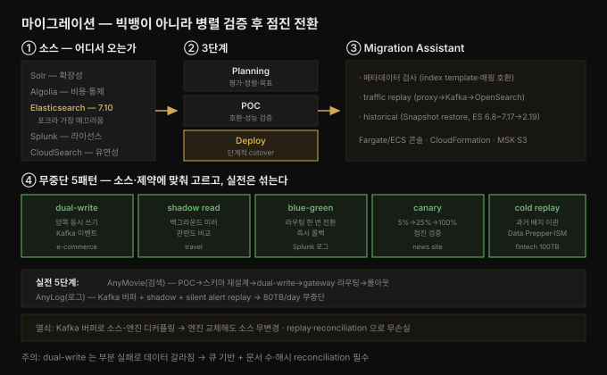

# OpenSearch 마이그레이션 — 단계·무중단 패턴·Migration Assistant

---

> Part 4(운영·관리)의 첫 장입니다. 1~10장이 OpenSearch 를 *짓는* 법이었다면, 11장은 기존 시스템에서 OpenSearch 로 *옮겨오는* 법입니다. 코드보다 **전략**이 중심입니다 — 왜 옮기는지(Why), 어떤 소스에서 오는지(Solr·Algolia·Splunk·Elasticsearch), 어떤 단계를 밟는지(Planning·POC·Deploy), 그리고 핵심인 **무중단으로 옮기는 다섯 패턴**(dual-write·shadow read·blue-green·canary·cold replay)입니다. 관통하는 원칙은 "빅뱅 컷오버가 아니라, 병렬로 검증한 뒤 점진 전환"입니다.


## 핵심 요약

> 이 장의 한 문장은 **"마이그레이션은 빅뱅이 아니라, 두 시스템을 병렬로 돌려 검증한 뒤 점진적으로 트래픽을 옮기는 것"** 입니다. 검색·로그 인프라는 잠깐의 중단도 수천 사용자에게 영향을 주므로, 무중단이 최우선 제약입니다.
>
> 축이 넷입니다. 첫째 **Why** — 오픈소스·커뮤니티·벤더 중립(Linux Foundation), 친숙한 API 로 점진 전환, 확장 생태계(Fluent Bit·Data Prepper·OpenTelemetry·Grafana). 둘째 **소스별 동기** — Solr(확장성), Algolia(비용·통제권), Splunk(라이선스 비용), Elasticsearch(7.10 포크라 가장 매끄러움), CloudSearch(유연성). 셋째 **3단계** — Planning(현 시스템 평가·이해관계자 정렬·목표 설정), POC(테스트 클러스터·호환성·성능 검증), Deploy(단계적·dual-write·reindex·snapshot). 넷째 **무중단 5패턴** — dual-write(양쪽 동시 쓰기), shadow read(백그라운드 미러링 비교), blue-green(라우팅 전환), canary(5%→100% 점증), cold replay(과거 데이터 배치 이관).
>
> 관통하는 통찰은 **"소스별로 정답 패턴이 다르고, 실전은 대개 여러 패턴을 섞는다"** 입니다. 실시간 로그는 blue-green·canary 로, 컴플라이언스 과거 데이터는 cold replay 로, 검색은 shadow read 로 관련도를 검증합니다. 공통 열쇠는 "계획적으로, 면밀히 모니터링하며, 자신 있게 반복".


## 학습 목표

1. OpenSearch 로 마이그레이션하는 이유(오픈소스·비용·통제권·생태계)를 설명할 수 있습니다.
2. 주요 마이그레이션 소스(Solr·Algolia·Splunk·Elasticsearch·CloudSearch)별 동기를 구분할 수 있습니다.
3. 마이그레이션 3단계(Planning·POC·Deploy)와 각 단계의 핵심 작업을 든다.
4. 무중단 5패턴(dual-write·shadow read·blue-green·canary·cold replay)을 언제 쓰는지 판단할 수 있습니다.
5. OpenSearch Migration Assistant 의 세 기능(메타데이터 검사·traffic replay·historical)을 설명할 수 있습니다.


## 본문 정리

아래 그림이 이 장 전체의 지도입니다 — 소스에서 3단계를 거쳐 무중단 패턴으로 전환합니다.



### 1. Why OpenSearch — 옮길 이유

마이그레이션은 새 도구 채택이 아니라 **오픈 표준·커뮤니티 주도·확장 아키텍처와의 정렬**입니다. 세 가지 근거가 있습니다.

- **오픈소스·커뮤니티·벤더 중립** — Linux Foundation 프로젝트로 오픈 거버넌스·투명성·장기 중립성을 보장합니다. 자유로운 사용·수정·배포, 단일 벤더 비종속, 공개된 의사결정.
- **친숙한 API·쉬운 전환** — 핵심 API·데이터 모델·쿼리 패턴을 유지해 빠른 온보딩, 최소한의 클라이언트 코드 변경. 검색·관측성 앱이라면 전환이 **파괴적이지 않고 점진적**입니다.
- **확장 생태계** — Fluent Bit·Data Prepper·OpenTelemetry 통합, Dashboards, Python/Java/Node.js 클라이언트, Grafana·Prometheus 호환.

### 2. 마이그레이션 소스 — 어디서 오는가

| 소스 | 성격 | OpenSearch 로 옮기는 동기 |
|------|------|--------------------------|
| **Apache Solr** | 엔터프라이즈 검색 | 쉬운 확장·내장 시각화·유연한 DSL·활발한 커뮤니티 |
| **Algolia** | SaaS 검색 | 대규모 비용 절감·색인/인프라 통제권·self-host |
| **Splunk** | 로그·SIEM | 라이선스 비용 절감·데이터 보존 통제·내장 보안 분석 |
| **Elasticsearch** | 전 유스케이스 | 벤더 락인 회피·신기능·장기 안정성. **7.10 포크라 가장 매끄러움** |
| **Amazon CloudSearch** | SaaS 검색 | 커스터마이징·고급 쿼리·대규모 비용 효율 |

> OpenSearch 는 Elasticsearch 7.10 의 포크라, **7.10 이하 ES 사용자**에게 전환 경로가 가장 부드럽습니다. Solr·Algolia 는 쿼리 언어가 달라 변환·적응이 필요합니다.

### 3. 마이그레이션 3단계

**(1) Planning — 현재를 이해하고 목표를 세운다**

- **현 시스템 평가** — 데이터 인벤토리(인덱스 구조·데이터 타입·특수 설정, 예: Solr 커스텀 analyzer·Algolia 실시간 검색), 쿼리 언어 차이 파악(Solr 는 변환 계획 필요), 의존성 검토(Splunk 로깅 파이프라인·Fluent Bit·Logstash).
- **이해관계자 정렬** — 비즈니스·DevOps·보안 팀이 같은 페이지에. 다운타임 허용량(Algolia 클라우드는 dual-write 로 최소화), 보안·컴플라이언스(접근 제어·암호화 정확히 설정).
- **목표·타임라인** — 성공 지표 정의(쿼리 정확도·성능이 기존 이상인가), 데이터 이관 전략 선택(snapshot/restore·reindex·dual-write, 소스별로 다름).

**(2) POC — 통제된 환경에서 검증한다**

- **테스트 클러스터** — 별도 환경에서 데이터 이관·쿼리 성능·통합 테스트. 색인·매핑 처리 확인.
- **호환성 테스트** — 데이터 포맷(필드 매핑·커스텀 analyzer), API·통합(대시보드·로깅) 정상 동작.
- **성능·확장성 테스트** — 기존 시스템 대비 쿼리 속도(Algolia 속도 유지 가능?), 미래 성장 감당 가능?

**(3) Deploy — 프로덕션으로 전환한다**

- **단계적 접근** — dual-write/hybrid(Splunk 처럼 병렬 실행), reindex(Elasticsearch 는 reindex API).
- **데이터·인덱스 이관** — snapshot/restore(ES 클러스터 간 전송), reindex from remote(ES 소스에서 pull).
- **Cutover** — 클라이언트를 OpenSearch 로 전환, 성능·에러 모니터링, 확신 후 레거시 폐기.
- **지속 모니터링** — Dashboards 로 클러스터 건강·쿼리 성능·리소스 추적.

### 4. 무중단 마이그레이션 5패턴

가장 큰 관심사는 **"불을 켜 둔 채로 옮기기"** — 서비스 가용성 유지입니다. 소스·제약에 따라 패턴을 고릅니다.

> 💬 **비유**: 마이그레이션은 **달리는 기차의 엔진 교체**입니다. 기차를 세울 수 없으니(무중단), 새 엔진을 나란히 달아 시운전하고(병렬 검증), 조금씩 동력을 옮긴 뒤(점진 전환), 확신이 서면 옛 엔진을 뗍니다. 다섯 패턴은 "동력을 옮기는" 서로 다른 방식입니다.

| 패턴 | 방식 | 대표 사례 | 언제 |
|------|------|----------|------|
| **Dual-write** | 양쪽 클러스터에 동시 쓰기, 읽기는 점진 전환 | e-commerce(Kafka 이벤트를 ES·OpenSearch 양쪽에 쓰기, 2주 검증 후 읽기 전환) | 이벤트 기반 아키텍처, 데이터 동기화 |
| **Shadow read** | 쿼리를 양쪽에 보내되 사용자에겐 기존 결과만, OpenSearch 응답은 백그라운드 로깅·비교 | travel(Algolia vs OpenSearch 블라인드 비교 투표, function_score 로 관련도 튜닝) | 관련도 검증, 검색 품질 비교 |
| **Blue-green** | 두 환경 병렬, 라우팅 설정 한 번으로 전환 | SaaS 로그(Fluent Bit 로 Splunk·OpenSearch 양쪽 전송, 설정 플립으로 전환, Splunk 한 달 read-only 보관) | 즉각 전환·롤백, 로그 |
| **Canary** | 트래픽을 5%→25%→50%→100% 점증 | news site(Solr→OpenSearch, KNN 으로 더 나은 시맨틱 매칭, 5주에 100%) | 대규모 점진 검증 |
| **Cold data replay** | 과거 데이터를 배치로 먼저 이관, 이후 신규 캡처 | fintech(15년·100TB 로그를 JSON 추출→Data Prepper 배치, ISM 으로 warm 7일·cold 90일) | 컴플라이언스, 대용량 과거 데이터 |

> 실전은 대개 여러 패턴을 **섞습니다**. Elasticsearch 는 Logstash/ETL 로 dual-write, Algolia 는 SDK 확장, Splunk 는 로깅 파이프라인 fallback. 정답은 소스·인프라 제약·데이터 중요도·사용자 기대에 달렸습니다.

### 5. OpenSearch Migration Assistant

큰 클러스터·복잡한 매핑·트래픽 민감 앱을 옮길 때의 도구입니다. 특히 Elasticsearch → OpenSearch, Amazon OpenSearch Service(managed·serverless) 이전에 유용합니다. 세 영역을 돕습니다.

1. **Pre-migration 메타데이터 검사** — 소스 클러스터의 index template·설정·매핑을 분석해 비호환·위험 설정을 미리 잡습니다.
2. **Traffic replay(near zero-downtime)** — ① 소스 클러스터 요청이 traffic proxy 통과 → ② proxy 가 평소대로 포워딩하며 사본을 Kafka 스트림에 → ③ 그 데이터를 OpenSearch 에 replay 해 색인·쿼리·일관성을 프로덕션 영향 없이 검증. 고처리량 시스템에 특히 유용.
3. **Historical 데이터 이관** — Restore from Snapshot. ES 6.8~7.17 에서 최신 OpenSearch(집필 시점 2.19)로 구조화된 단계 제공.

**관리 콘솔**은 Amazon ECS 의 Fargate 에서 도는 컨테이너 포털이고, **CloudFormation** 템플릿으로 AWS 배포(Amazon MSK·ECS·S3 통합).

### 6. 실전 사례 — 두 팀의 5단계 여정

**AnyMovie(검색 현대화)** — 스트리밍 플랫폼이 Elasticsearch 에서 이전. 단순 교체가 아니라 **검색 현대화**로 접근.
- Phase 1(POC) — 10만 영화 레코드(프로덕션 5%)로 다국어(한국어·힌디·스페인·아랍) 토크나이저·복합 집계 검증.
- Phase 2(스키마 재설계) — **1:1 이관을 넘어**. flat 배열 tags 를 nested 로, `regional_score`·`vector_embedding`(미래 시맨틱 검색용) 필드 추가, 기술 부채 정리.
- Phase 3(dual-write) — Python 앱(Pydantic 검증, opensearch-py + elasticsearch-py 이중 쓰기, Kafka consumer). 문서 해시·타임스탬프로 동기 검증.
- Phase 4(쿼리 라우팅) — 두 엔진을 gateway 서비스 뒤로, feature flag 로 라우팅·DSL 차이 정규화·drift 분석.
- Phase 5(모니터링·롤아웃) — 핵심 대시보드만 재구축, 내부 QA→5%→50%(자동 fallback)→전면. feature flag 로 즉시 롤백 가능(쓸 일은 없었음).

**AnyLog(로그 관측성)** — 클라우드 네이티브 관측성 플랫폼이 ES 비용·복잡도로 이전. 목표: 무손실·무경보공백·고객 대시보드 무영향.
- Phase 1 — 프로덕션급 OpenSearch 병렬 부트스트랩(ISM 보존 정책·NGINX/Apache/K8s 템플릿).
- Phase 2 — **Kafka 를 로그 버퍼**로. Data Prepper 가 Kafka 토픽에서 ES·OpenSearch 양쪽 이중 발행(replay·delay·reprocess 가능).
- Phase 3(shadow) — 클라이언트가 ES 대시보드를 볼 때마다 같은 쿼리를 OpenSearch 에도, hit count·duration·집계 델타 비교.
- Phase 4(silent alert replay) — 모든 알림을 OpenSearch 로 재생성, sandbox Slack 으로 라우팅, 5일 병렬 후 신뢰.
- Phase 5(flip·fallback) — Fluent Bit 를 Kafka 만 보게(엔진 무관), consumer 가 Data Prepper→OpenSearch 만 발행. ES 인제스트는 1주 pause(제거 아님).
- 결과: 2주 만에 **80TB/day 무중단·무손실** 이관.


## 심화 학습

책 본문은 패턴을 이야기(내러티브)로 풀어, 실무 판단에 직결되는 두 지점을 공식 문서로 보강합니다.

**dual-write 의 숨은 함정은 "부분 실패"입니다.** 본문은 dual-write 를 무중단의 안전한 선택으로 소개하지만, 두 클러스터에 쓰다 **한쪽만 성공하면** 데이터가 갈라집니다(divergence). 예를 들어 ES 쓰기는 성공했는데 OpenSearch 쓰기가 타임아웃 나면, 두 인덱스의 문서 수가 어긋납니다. 실무에서는 ① 쓰기를 **비동기 큐(Kafka)로 분리**해 실패를 재시도하거나(본문 사례들이 Kafka 를 쓴 이유), ② 주기적 **reconciliation**(문서 수·해시 비교로 드리프트 탐지·보정)을 돌립니다. 본문 AnyMovie 사례의 "문서 해시·타임스탬프 비교"가 바로 이 reconciliation 입니다. dual-write 를 "동기 이중 쓰기"로 순진하게 구현하면 부분 실패에 취약하니, 큐 기반 + 정합성 검증을 함께 설계해야 합니다.

**이 장은 앞 장들의 기능이 마이그레이션의 도구였음을 드러냅니다.** cold replay 의 ISM(8장 플러그인)·Data Prepper(7장), shadow read 의 function_score(6장)·analyzer 튜닝(4장), canary 의 KNN 시맨틱 매칭(10장) — 앞서 배운 것들이 여기서 마이그레이션 전략의 부품이 됩니다. 상위 [`06_observability/README.md`](../../README.md) 관측성 맥락에서 특히 중요한 건 **로그 마이그레이션 패턴**입니다. Splunk→OpenSearch(blue-green·cold replay)는 관측성 스택 전환의 전형이고, Kafka 를 버퍼로 두는 AnyLog 방식은 LGTM 스택 마이그레이션에도 그대로 적용됩니다 — 로그 소스(Fluent Bit)와 저장소를 Kafka 로 디커플링하면, 저장 엔진을 바꿀 때 소스를 안 건드려도 됩니다. 이 "버퍼로 디커플링" 원칙이 무중단 로그 마이그레이션의 핵심입니다. Migration Assistant 상세는 공식 [Migration Assistant](https://docs.opensearch.org/latest/migration-assistant/) 문서를 참고하세요.


## 결정 치트시트

| 상황 | 선택 | 이유 |
|------|------|------|
| Elasticsearch 7.10 이하에서 이전 | reindex / snapshot-restore | 포크라 가장 매끄러움 |
| Solr·Algolia 에서 이전 | 쿼리 변환 + shadow read | DSL 다름, 관련도 검증 필요 |
| 이벤트 기반 아키텍처 | dual-write(Kafka) | 양쪽 동기화, 점진 읽기 전환 |
| 검색 관련도 검증 | shadow read | 사용자 영향 없이 비교 |
| 즉각 전환·롤백 필요 | blue-green | 라우팅 설정 한 번, 옛 시스템 read-only 보관 |
| 대규모 점진 검증 | canary(5%→100%) | 트래픽 점증, 지표 관찰 |
| 컴플라이언스 과거 데이터 | cold replay(Data Prepper·ISM) | 배치 이관 + 라이프사이클 |
| 로그 무중단 이관 | Kafka 버퍼로 디커플링 | 소스 무변경, 엔진 교체 자유(심화) |
| dual-write 데이터 정합성 | 큐 기반 + reconciliation | 부분 실패로 인한 드리프트 방지(심화) |
| ES→OpenSearch 자동화 | Migration Assistant | 메타데이터 검사·traffic replay·snapshot |


## Spring 앱 개발 관점

이 장은 코드보다 전략이 중심이라, Spring 관점도 "마이그레이션을 Spring 애플리케이션에서 어떻게 실행하는가"에 둡니다. 책의 dual-write 사례가 Python(opensearch-py + elasticsearch-py)이지만, Spring Boot 에서도 같은 패턴을 구현합니다. 책에 Spring 예제가 없어 **공식 문서(spring-data-opensearch / spring-data-elasticsearch)로 보강**했습니다.

핵심은 **두 클러스터를 동시에 다루는 설정**과 **엔진을 추상화하는 계층**입니다. AnyMovie 사례의 Phase 3(dual-write)·Phase 4(gateway)를 Spring 으로 옮기면 이렇게 됩니다.

**(a) dual-write — 두 클러스터 빈** — Spring Data 는 `ElasticsearchConfiguration` 을 확장한 여러 설정 빈으로 두 클러스터에 각각 `ElasticsearchOperations` 를 만듭니다. `@Qualifier` 로 구분해 서비스에 둘 다 주입합니다.

```java
@Configuration
class LegacyEsConfig extends ElasticsearchConfiguration {
    @Override public ClientConfiguration clientConfiguration() {
        return ClientConfiguration.builder()
                .connectedTo("legacy-es:9200").usingSsl()
                .withBasicAuth("app", System.getenv("ES_PASSWORD")).build();
    }
    // ElasticsearchOperations 빈 이름을 @Qualifier 로 구분
}

@Service
class DualWriteIndexer {
    private final ElasticsearchOperations esOps;         // @Qualifier("legacyEsOps")
    private final ElasticsearchOperations openSearchOps; // @Qualifier("openSearchOps")

    void index(Movie movie) {
        esOps.save(movie);           // 레거시 (읽기 소스)
        openSearchOps.save(movie);   // 신규 (검증 대상)
        // 실무: 비동기 큐로 분리 + 부분 실패 재시도 (심화 학습)
    }
}
```

**(b) gateway 추상화 — feature flag 라우팅** — 검색 요청을 한 계층 뒤로 감춰, feature flag(비율)로 어느 엔진에 보낼지 결정합니다. canary(5%→100%)를 코드로 옮긴 형태입니다.

```java
@Service
class SearchGateway {
    SearchHits<Movie> search(Query query) {
        if (featureFlags.routeToOpenSearch(currentUser())) {   // 예: 5% 사용자
            return openSearchOps.search(query, Movie.class);
        }
        return esOps.search(query, Movie.class);               // 나머지 95%
    }
}
```

**주의할 점 두 가지.** 첫째, **DSL 차이 정규화가 필요합니다.** ES 와 OpenSearch 는 대부분 호환되지만 버전에 따라 미묘한 차이가 있어(특히 ES 8.x 는 OpenSearch 와 클라이언트가 갈라짐), gateway 에서 쿼리를 양쪽 형식으로 정규화하고 응답 drift 를 로깅해야 합니다 — AnyMovie 의 "paired query responses 를 test index 에 로깅"이 이 drift 분석입니다. 둘째, **dual-write 는 부분 실패에 취약합니다.** 위 코드처럼 두 save 를 순차 호출하면, 한쪽만 성공했을 때 데이터가 갈라집니다. 심화 학습대로 **Kafka 같은 큐로 쓰기를 분리**하고, 배치로 문서 수·해시를 비교하는 reconciliation 을 함께 둬야 합니다. Spring 이라면 이벤트를 `@TransactionalEventListener` 나 Kafka publisher 로 발행하고, consumer 가 양쪽에 쓰되 실패를 재시도하는 구조가 안전합니다.

정리하면, Spring 앱에서 마이그레이션은 **두 `ElasticsearchOperations` 빈 + 라우팅 게이트웨이 + 큐 기반 dual-write** 세 조각으로 구성됩니다. Spring 의 DI·이벤트·트랜잭션 추상화가 이 패턴을 깔끔하게 지원하며, feature flag 라이브러리(예: Togglz)로 점진 롤백을 즉시 가능하게 만듭니다.


## 면접 대비

**한 줄 정의**: OpenSearch 마이그레이션은 소스(Solr·Algolia·Splunk·Elasticsearch)에서 Planning·POC·Deploy 3단계를 거쳐, dual-write·shadow read·blue-green·canary·cold replay 같은 무중단 패턴으로 두 시스템을 병렬 검증한 뒤 점진 전환하는 과정입니다.

**핵심 3가지**
1. **빅뱅이 아니라 병렬 검증 후 점진 전환** — 두 시스템을 동시에 돌려 데이터·쿼리·성능을 비교하고, 확신이 서면 트래픽을 조금씩 옮깁니다. 무중단이 최우선 제약입니다.
2. **소스별로 패턴이 다르고 실전은 섞는다** — 실시간 로그는 blue-green·canary, 관련도 검증은 shadow read, 컴플라이언스 과거 데이터는 cold replay. Elasticsearch 는 7.10 포크라 가장 매끄럽습니다.
3. **Kafka 버퍼가 무중단의 열쇠** — 로그 소스와 저장 엔진을 큐로 디커플링하면, 엔진을 바꿔도 소스를 안 건드리고 replay·reconciliation 으로 무손실을 보장합니다.

**FAQ**
- **Q. dual-write 와 shadow read 의 차이는?**
  A. dual-write 는 **쓰기**를 양쪽에 하고 읽기를 점진 전환합니다(데이터 동기화가 목적). shadow read 는 **읽기 쿼리**를 양쪽에 보내되 사용자에겐 기존 결과만 주고, 신규 엔진 응답은 백그라운드에서 비교합니다(관련도 검증이 목적).
- **Q. blue-green 과 canary 의 차이는?**
  A. blue-green 은 두 환경을 완성해 두고 라우팅을 **한 번에** 전환합니다(즉시 롤백 가능). canary 는 트래픽을 5%→25%→50%→100% **점진적으로** 늘려 문제를 조기에 잡습니다.
- **Q. Migration Assistant 의 traffic replay 는 어떻게 동작하나?**
  A. 소스 클러스터 요청이 traffic proxy 를 통과하면, proxy 가 평소대로 포워딩하면서 사본을 Kafka 로 보냅니다. 그 데이터를 OpenSearch 에 replay 해 색인·쿼리·일관성을 프로덕션 영향 없이 검증합니다.


## 핵심 개념 체크리스트

- [ ] OpenSearch 로 옮기는 세 근거(오픈소스·친숙한 API·생태계)를 든다
- [ ] 소스별(Solr·Algolia·Splunk·ES·CloudSearch) 마이그레이션 동기를 구분한다
- [ ] Elasticsearch 7.10 포크라 ES 전환이 가장 매끄러운 이유를 안다
- [ ] Planning 단계의 세 작업(평가·정렬·목표)을 든다
- [ ] POC 단계의 호환성·성능 테스트 항목을 안다
- [ ] Deploy 단계의 이관 방법(snapshot-restore·reindex·dual-write)을 구분한다
- [ ] dual-write 패턴과 부분 실패 위험(reconciliation)을 설명할 수 있다
- [ ] shadow read 가 관련도 검증에 쓰이는 방식을 안다
- [ ] blue-green(즉시 전환)과 canary(점진)의 차이를 안다
- [ ] cold replay 가 컴플라이언스 과거 데이터에 맞는 이유를 안다
- [ ] Migration Assistant 의 세 기능(메타데이터·traffic replay·historical)을 든다
- [ ] Kafka 버퍼로 소스-엔진을 디커플링하는 무중단 원리를 안다


## 참고 자료

- 원본: *The Definitive Guide to OpenSearch* (ISBN 9781835885789), Chapter 11 — Migrate to OpenSearch. O'Reilly/Packt, `learning.oreilly.com/library/view/the-definitive-guide/9781835885789`. (Migration Assistant 기준 ES 6.8~7.17 → OpenSearch 2.19)
- 공식 문서:
  - [OpenSearch — Migration Assistant](https://docs.opensearch.org/latest/migration-assistant/)
  - [OpenSearch — Reindex data](https://docs.opensearch.org/latest/im-plugin/reindex-data/)
  - [OpenSearch — Take and restore snapshots](https://docs.opensearch.org/latest/tuning-your-cluster/availability-and-recovery/snapshots/index/)
  - [aws-solutions/migration-assistant-for-amazon-opensearch (GitHub)](https://github.com/aws-solutions/migration-assistant-for-amazon-opensearch)
  - [Spring Data Elasticsearch — Client configuration (multiple clusters)](https://docs.spring.io/spring-data/elasticsearch/reference/elasticsearch/clients.html)
- 관련 노트:
  - [08-01 플러그인 — 유형·주요 플러그인·아키텍처](./08-01.플러그인%20—%20유형·주요%20플러그인·아키텍처.md) (ISM·Alerting 이 마이그레이션 부품)
  - [07-01 분석과 시각화 — 집계·대시보드·관측성](./07-01.분석과%20시각화%20—%20집계·대시보드·관측성.md) (Data Prepper·로그 파이프라인)
  - [10-01 벡터·생성 AI — 시맨틱 검색과 RAG](./10-01.벡터·생성%20AI%20—%20시맨틱%20검색과%20RAG.md) (canary 의 KNN 시맨틱 매칭)
  - [README (정독 노트 MOC)](./README.md)
