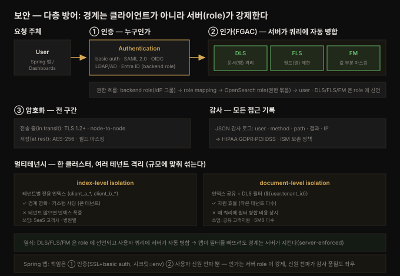

# 보안 — 인증·인가·FGAC·멀티테넌시

---

> Part 4(운영·관리)의 두 번째 장입니다. 11장이 OpenSearch 로 *옮겨오는* 법이었다면, 12장은 옮겨온 데이터를 *지키는* 법입니다. 핵심 뼈대는 **다층 방어(defense-in-depth)** 입니다 — 하나의 벽이 아니라, 인증(누구인가)·인가(무엇을 할 수 있는가)·암호화(전송·저장)를 겹겹이 쌓습니다. 그 위에 **FGAC**(문서·필드 단위까지 내려가는 세밀한 접근 제어), **멀티테넌시**(한 클러스터에서 조직·부서·고객을 격리), **감사·컴플라이언스**(누가 무엇을 언제 했는지 기록)가 얹힙니다. 관통하는 원칙은 "권한은 최소로, 경계는 서버가 강제하고, 모든 접근은 남긴다"입니다.


## 핵심 요약

> 이 장의 한 문장은 **"OpenSearch 보안은 인증→인가→암호화의 다층 방어이며, 인가의 정밀도를 문서·필드 단위(FGAC)까지 끌어내려 한 클러스터에서 여러 테넌트를 안전하게 격리하는 것"** 입니다. 검색 인프라는 조직 전체의 민감 데이터가 모이는 곳이라, 보안이 곧 신뢰의 전제입니다.
>
> 축이 넷입니다. 첫째 **보안 프레임워크** — 다층 방어. 인증(OAuth 2.0·LDAP/AD·SAML 2.0·OpenID Connect·Entra ID 연동) → FGAC(cluster·index·document·field 레벨 권한) → 암호화(전송 TLS 1.2+, 저장 AES-256, 필드 마스킹). 핵심 구성요소는 Users(인증된 주체)·Roles(권한 묶음)·Backend roles(외부 IdP 그룹을 잇는 다리)·Role mappings(셋을 연결)·Dashboard tenants(시각화 격리). 둘째 **인증·인가** — basic auth(내부 보안 인덱스에 저장) vs SAML SSO(IdP 위임). 셋째 **FGAC 3종** — DLS(문서 필터로 행 격리)·FLS(필드 노출 제한)·FM(민감값 부분 마스킹). 넷째 **멀티테넌시** — index-level isolation(테넌트별 전용 인덱스, 명확하지만 인덱스 폭증) vs document-level isolation(공유 인덱스 + DLS 필터, 자원 효율적). 감사 로그는 JSON 구조로 인증·쿼리·인덱스 작업을 기록해 HIPAA·GDPR·SOC 2·PCI DSS 컴플라이언스를 뒷받침합니다.
>
> 관통하는 통찰은 **"경계는 클라이언트가 아니라 서버(Security 플러그인)가 강제한다"** 입니다. DLS·FLS·FM 은 role 정의로 서버에 선언되고, 사용자 쿼리에 자동 병합됩니다 — 앱이 필터를 빠뜨려도 병원 A 는 병원 B 의 환자 기록을 볼 수 없습니다. 그래서 애플리케이션(Spring 포함)의 책임은 "올바른 주체로 인증하는 것"이고, 실제 데이터 경계는 클러스터 설정이 지킵니다.


## 학습 목표

1. OpenSearch 보안의 다층 방어 구조(인증·인가·암호화)와 핵심 구성요소(Users·Roles·Backend roles·Role mappings)를 설명할 수 있습니다.
2. 인증 방식(basic auth vs SAML/OIDC SSO)의 차이와, backend role 이 외부 IdP 를 잇는 역할을 이해합니다.
3. FGAC 3종(DLS·FLS·FM)이 각각 무엇을 격리하는지 구분하고, role 정의로 어떻게 선언하는지 든다.
4. 멀티테넌시 두 모델(index-level vs document-level isolation)의 트레이드오프를 판단할 수 있습니다.
5. 감사 로그의 구조와 컴플라이언스(HIPAA·GDPR·PCI DSS) 연계, 데이터 보존 정책(ISM)을 설명할 수 있습니다.


## 본문 정리

### 1. 보안 프레임워크 — 다층 방어

OpenSearch 보안은 하나의 벽이 아니라 **겹겹이 쌓은 통제 계층**입니다. 바깥에서 안쪽으로 세 층입니다.

- **인증(Authentication)** — "누구인가"를 검증하는 관문입니다. 여러 프로토콜을 지원합니다: OAuth 2.0, LDAP/Active Directory, SAML 2.0, OpenID Connect. 덕분에 이미 쓰던 기업 IdP(예: Entra ID)에 곧바로 연동해, 보안 사일로를 만들지 않고 일관된 접근 통제를 유지합니다.
- **인가(Authorization) = FGAC** — "무엇을 할 수 있는가"를 정합니다. cluster·index·document·field 등 여러 레벨에서 정밀하게 권한을 정의합니다. 멀티테넌트 환경처럼 데이터 분리가 필수인 곳에서 핵심입니다 — 예를 들어 의료 앱에서 간호사는 자기 부서 환자 기록만, 의사는 전체 진료 이력을 보게 제한합니다. 역할 기반 관리(RBAC)가 이를 보완해, 미리 정의한 role(DataScientist·Analyst·Administrator 등)로 권한 할당을 단순화합니다.
- **암호화(Encryption)** — 전송 중 데이터는 TLS 1.2+, 저장 데이터는 AES-256 으로 보호합니다. 필드 마스킹으로 민감 데이터(예: 주민번호)를 권한이 제한된 사용자에게 부분 가림(`XXX-XX-1234`) 상태로 노출할 수 있습니다.

이 위에 **감사 로깅**이 얹혀, 인증 시도·검색 쿼리·인덱스 작업을 모두 기록하고 HIPAA·GDPR·SOC 2·PCI DSS 같은 컴플라이언스 프레임워크를 뒷받침합니다.

이 장의 전체 구조를 한 장으로 요약하면 다음과 같습니다. 요청이 인증 관문을 지나 FGAC(DLS·FLS·FM) 인가 필터가 **서버에서** 병합되고, 암호화·멀티테넌시로 감싸이며, 모든 접근이 감사 로그로 남습니다.



### 2. 보안의 핵심 구성요소

프레임워크는 서로 맞물리는 몇 개의 요소로 돌아갑니다.

- **Users** — OpenSearch 클러스터와 상호작용하는 인증된 주체입니다. OpenSearch 내부에 로컬로 정의하거나, 외부 인증 공급자를 통해 통합할 수 있습니다. 대규모 배포에서는 수백 명이 각자 역할에 맞는 권한으로 검색 인프라에 접근합니다.
- **Roles** — 권한 구조의 초석입니다. 사용자가 시스템 계층의 여러 레벨에서 어떤 작업을 할 수 있는지 정의합니다. cluster 레벨(관리 작업)·index 레벨(데이터 관리)·document/field 레벨(세밀한 접근)까지 부여할 수 있습니다. 예로 `data_analyst` role 은 특정 인덱스에 읽기 권한을 갖되 클러스터 전역 작업은 못 하게 제한합니다. role 은 Dashboards 의 Security 섹션에서 정의·할당합니다.
- **Backend roles** — 인증 시스템 *외부*(SAML·IAM·ADFS 등)에서 온 role 로, role 매핑과 접근 제어에 추가 맥락을 줍니다. 조직의 기존 IdP 와 OpenSearch 보안 모델을 잇는 **다리**입니다 — 예를 들어 사내 LDAP 의 부서 그룹을 OpenSearch 의 대응 backend role 로 매핑해 조직 구조와 일관성을 유지합니다.
- **Role mappings** — 사용자·backend role·OpenSearch 보안 role 사이의 결정적 연결을 만듭니다. 예로 Finance LDAP 그룹의 모든 사용자를 금융 인덱스 접근 role 에 매핑하되 다른 민감 데이터는 막습니다.
- **Dashboard tenants** — 같은 테넌트에 속한 사용자/role 끼리 시각화·대시보드를 공유하는 격리 공간입니다. 부서·팀별로 같은 클러스터 안에서 분리된 대시보드 환경을 유지하게 합니다.

한 문장으로 꿰면, **backend role(외부 그룹) → role mapping → OpenSearch role(권한 묶음) → user** 로 권한이 흘러갑니다. 대형 금융기관 예시에서, 컴플라이언스 부서 사용자는 감사 로그에 읽기 전용, 보안팀은 보안 인덱스에 넓은 접근을 role mapping 으로 부여받고, 각 부서는 dashboard tenant 로 격리된 시각화 공간을 씁니다.

### 3. 인증·인가 메커니즘

**Basic authentication** — 사용자명·비밀번호 조합으로 인증하는 직관적이면서 견고한 방식입니다. 자격증명은 OpenSearch 내부 보안 인덱스에 안전하게 저장됩니다. 단순하지만 제대로 쓰려면 비밀번호 관리 정책(회전 주기·실패 시 계정 잠금·정기 감사)을 함께 갖춰야 합니다. 사용자 생성은 Security 플러그인 API 로 합니다.

```json
PUT /_plugins/_security/api/internalusers/analyst
{
  "password": "Secure_password_123",
  "backend_roles": ["analyst_role"],
  "attributes": {
    "full_name": "Data Analyst",
    "email": "analyst@organization.com",
    "employee_id": "EMP123",
    "department": "Analytics"
  }
}
```

**SAML authentication** — 기업급 SSO 를 제공해, 이미 쓰는 IdP(Okta·Entra ID 등)를 OpenSearch 에 연동합니다. 중앙집중 사용자 관리가 필요한 대규모 조직에 특히 유용합니다. 설정은 두 부분입니다: `idp` 섹션(사용자 자격증명을 어디서 검증하는가)과 `sp` 섹션(OpenSearch 가 인증 정보를 어떻게 받고 처리하는가). `attribute_mapping` 이 IdP 의 사용자 정보(role·name·email)를 OpenSearch 필드로 매핑해, 인증 후 적절한 접근 수준을 부여합니다.

```json
# ① SAML 설정 등록
PUT /_plugins/_security/api/config/saml
{
  "idp": { "metadata_url": "https://idp.organization.com/metadata",
           "entity_id": "urn:organization:opensearch",
           "signature_algorithm": "RSA-SHA256" },
  "sp": { "entity_id": "opensearch-cluster",
          "acs": "https://opensearch.organization.com/_plugins/_security/saml/acs",
          "certificate": "BASE64_ENCODED_CERTIFICATE",
          "private_key": "BASE64_ENCODED_PRIVATE_KEY" },
  "attribute_mapping": {
    "roles": "http://schemas.organization.com/claims/roles",
    "name":  "http://schemas.xmlsoap.org/ws/2005/05/identity/claims/name",
    "email": "http://schemas.xmlsoap.org/ws/2005/05/identity/claims/email" },
  "enabled": true
}

# ② SAML 그룹을 OpenSearch role 에 매핑
PUT /_plugins/_security/api/rolesmapping/analyst_role
{ "backend_roles": ["SAML_ANALYST_GROUP"], "hosts": [], "users": [] }
```

### 4. FGAC — DLS·FLS·FM

FGAC 는 접근을 여러 레벨에서 통제하는 정교한 장치로, 세 층으로 나뉩니다.

**DLS(Document-Level Security)** — FGAC 의 첫 층으로, **문서 단위**에서 사용자 권한·role 에 따라 검색 결과를 걸러냅니다. 여러 병원이 한 클러스터를 공유해도 병원 A 의 의료진이 병원 B 환자 기록에 접근하지 못하게 합니다. role 정의의 쿼리 필터로 구현되며, 이 필터는 **모든 검색 요청에 자동 병합**됩니다 — 사용자가 어떤 검색 파라미터를 넣든 권한 있는 문서만 봅니다.

```json
PUT /_plugins/_security/api/roles/hospital_a_role
{
  "index_permissions": [{
    "index_patterns": ["patients*"],
    "dls": { "bool": { "must": [{ "term": { "hospital_id": "HOSP_A" } }] } },
    "allowed_actions": ["read"]
  }]
}
```

**FLS(Field-Level Security)** — DLS 위에서 **문서 안 특정 필드**로 접근을 제한합니다. 같은 문서라도 role 별로 볼 수 있는 필드가 다를 때 유용합니다 — HR 관리자는 `salary`·`medical_information` 까지, 팀 리더는 `employee_id`·`name`·`performance_reviews` 만 봅니다. `"_fls_": "inclusive"`(포함 목록) 또는 `exclude`(제외 목록)로 선언합니다.

```json
PUT /_plugins/_security/api/roles/team_leader
{
  "index_permissions": [{
    "index_patterns": ["employees*"],
    "allowed_actions": ["read"],
    "fls": { "fields": ["employee_id", "name", "performance_reviews"], "_fls_": "inclusive" }
  }]
}
```

**FM(Field Masking)** — 민감 정보를 **부분만 가려** 일부 유용성은 남깁니다. 고객 서비스 포털처럼 상담원이 신원 확인은 해야 하지만 전체 값은 못 보게 할 때 씁니다 — 신용카드 `4532-7891-2345-6789` 를 `--****-6789` 로, 전화번호를 `(***) ***-1234` 로, 이메일을 `j****@domain.com` 으로 가립니다. role 의 `field_masking` 에 정규식 패턴으로 선언합니다.

```json
PUT _plugins/_security/api/roles/customer_service_role
{
  "index_permissions": [{
    "index_patterns": ["customer_data"],
    "allowed_actions": ["read"],
    "field_masking": [{ "field": "credit_card", "mask": "regexp",
                        "replace": "XXXX-XXXX-XXXX-$1", "pattern": "([0-9]{4})$" }]
  }]
}
```

세 장치는 함께 씁니다. 글로벌 e-commerce 예시에서 DLS 는 상담원이 담당 지역 주문만 보게(`region_id` 필터), FLS 는 결제 상세를 role 별로 제한(결제 처리팀=전체, 상담=주문 상태만, 분석팀=집계만), FM 은 전화·이메일 같은 민감 필드를 가립니다. 이 설정은 모두 Security 플러그인의 보안 인덱스에 저장됩니다.

### 5. 멀티테넌트 보안 아키텍처

한 클러스터에서 여러 사용자·부서·고객사를 격리하는 두 모델이 있습니다.

- **Index-level isolation** — 테넌트마다 **전용 인덱스**를 줍니다(`client_a_logs_2025`, `client_b_logs_2025` …). 경계가 명확하고 보안 관리가 단순합니다. SaaS 분석 플랫폼처럼 고객사별 분리가 필요할 때 잘 맞습니다. role 은 인덱스 패턴(`client_a_*`)으로 권한을 줍니다. 단점은 테넌트가 많아지면 **인덱스 폭증**으로 관리·자원 부담이 커진다는 점입니다.
- **Document-level isolation** — 여러 테넌트가 **인덱스를 공유**하되 DLS 필터로 엄격히 분리합니다. 작은 테넌트가 많거나 자원 최적화가 중요할 때 효율적입니다. `${user.tenant_id}` 같은 사용자 속성을 DLS 필터에 넣어, 같은 인덱스에서 자기 테넌트 문서만 보게 합니다.

```json
PUT _plugins/_security/api/roles/support_agent_role
{
  "index_permissions": [{
    "index_patterns": ["customer_tickets*"],
    "allowed_actions": ["read", "search"],
    "dls": "{\"bool\":{\"must\":[{\"term\":{\"tenant_id\":\"${user.tenant_id}\"}}]}}"
  }]
}
```

**Dashboards 멀티테넌시** 는 이 격리를 시각화 계층까지 확장해, 사용자 그룹별로 분리된 대시보드 공간을 줍니다(`multitenancy.enabled: true`, `tenant_index_pattern`, `private_tenant_enabled`). 의료 분석 플랫폼 예시에서는 병원별 index-level isolation + `hospital_${user.hospital_id}` role + FLS 로 주민번호·보험정보를 제외하고, tenant 설정(`PUT _plugins/_security/api/tenants/hospital_a`)으로 대시보드까지 격리합니다. 큰 테넌트는 커스텀 샤딩의 전용 인덱스, 작은 테넌트는 DLS 공유 인덱스로 — **테넌트 규모에 맞춰 두 모델을 섞는 것**이 실전 전략입니다.

### 6. 감사와 컴플라이언스

OpenSearch 감사 로깅은 시스템 이벤트와 사용자 상호작용을 여러 레벨에서 잡아, **구조화된 JSON** 으로 남깁니다. 각 항목은 타임스탬프·사용자 신원·인증 방식·요청 유형과 파라미터·소스 IP·작업 결과(성공/실패)·영향받은 인덱스/문서를 담습니다.

```json
{
  "audit_category": "AUTHENTICATED",
  "audit_request_initiating_user": "financial_analyst",
  "audit_rest_request_method": "GET",
  "audit_rest_request_path": "/financial_records/_search",
  "timestamp": "2025-07-07T14:14:00.139+00:00"
}
```

컴플라이언스 프레임워크는 업계 표준 통제(전송·저장 암호화 + FGAC + 감사 로깅)를 다층으로 묶어 HIPAA·PCI DSS·GDPR 요건을 충족합니다. 감사 로그로 **정기 접근 검토**를 수행해 부적절한 권한이나 비정상 접근 패턴을 탐지하고, **ISM(Index State Management)** 으로 데이터 보존 정책(보관·자동 아카이빙·삭제)을 자동화합니다. 의료 조직 예시에서는 환자 기록 접근을 모두 감사 로그로 추적하고, 민감 건강정보를 암호화하며, 필요한 보존 기간(의료 데이터는 보통 6~7년) 동안 감사 추적을 유지하고, 정기 접근 검토로 인가된 의료진만 접근하게 합니다.


## 심화 학습

**"경계는 서버가 강제한다"가 왜 결정적인가.** DLS·FLS·FM 을 애플리케이션 코드에서 `if` 로 거르면, 한 곳이라도 빠뜨리는 순간 데이터가 샙니다 — 검색은 진입점이 많고(직접 API·대시보드·리포트·배치), 각 진입점마다 필터를 중복 구현하는 것은 사실상 실패합니다. OpenSearch 는 이 필터를 **role 에 선언**하고 사용자 쿼리에 **커널이 자동 병합**해, 진입점과 무관하게 경계를 강제합니다. 이 설계는 "신뢰할 수 없는 클라이언트" 가정([dev-standards](../../../../.claude/rules/dev-standards.md)의 "에이전트=신뢰할 수 없는 운영자"와 같은 결)과 정합합니다 — 앱을 믿지 않고 서버가 지킵니다.

**DLS 필터 병합의 성능 함정.** DLS 는 모든 검색에 `bool.must` 필터를 자동으로 얹습니다. 테넌트가 많고 필터가 복잡하면(예: `${user.roles}` 다중 값 term), 이 병합이 쿼리 비용을 키웁니다. document-level isolation 은 자원은 아끼지만 매 쿼리에 필터 비용을 상시로 치르는 셈이라, "인덱스 폭증(index-level) vs 쿼리당 필터 비용(document-level)"이 진짜 트레이드오프입니다. 큰 테넌트를 전용 인덱스로 빼는 하이브리드가 이 비용을 낮춥니다.

**FLS 와 집계·하이라이팅의 상호작용.** FLS 로 필드를 제외하면 그 필드는 검색·집계·하이라이팅에서 존재하지 않는 것처럼 취급됩니다. `salary` 를 제외한 role 로 `avg(salary)` 집계를 돌리면 결과가 비거나 0 이 됩니다 — 버그가 아니라 격리가 작동한 것입니다. 앱은 FLS 제한 role 사용자에게 어떤 집계·필드가 막히는지 UI 에서 명확히 해야 혼란이 없습니다.

**Backend role 매핑의 조직 정합성.** backend role 은 IdP 그룹을 그대로 반영하므로, 조직 개편(부서 통폐합)이 곧 role mapping 변경으로 이어집니다. IdP 그룹 이름을 그대로 OpenSearch role 로 쓰지 말고 **backend role(IdP 그룹) ↔ OpenSearch role(권한 의미)** 을 분리해 매핑하면, 조직이 바뀌어도 권한 의미는 유지한 채 매핑만 갈아끼우면 됩니다.


## 결정 치트시트

| 상황 | 선택 | 이유 |
|------|------|------|
| 기업 IdP 이미 운영(Okta·Entra ID) | SAML / OIDC SSO | 중앙집중 관리, 보안 사일로 방지 |
| 소규모·내부 도구 | basic auth | 단순, 내부 보안 인덱스로 충분 |
| 외부 IdP 그룹을 권한에 연결 | backend role + role mapping | IdP 그룹 ↔ OpenSearch role 분리 |
| 행(문서) 단위 격리 (병원·테넌트) | DLS | 쿼리 필터 자동 병합 |
| 같은 문서, role 별 필드 차등 | FLS | 필드 포함/제외 목록 |
| 민감값 부분 노출 (카드·주민번호) | FM | 정규식 마스킹 |
| 테넌트 적고 규모 큼 | index-level isolation | 경계 명확, 커스텀 샤딩 |
| 테넌트 많고 작음 | document-level isolation(DLS) | 자원 효율, 인덱스 폭증 방지 |
| 대시보드까지 격리 | Dashboards 멀티테넌시 + tenant | 시각화 계층 분리 |
| 규제 준수 증빙 | 감사 로그 + ISM 보존 정책 | JSON 추적 + 자동 아카이빙 |
| 애플리케이션의 책임 | 올바른 주체로 인증만 | 경계는 서버(role)가 강제 |


## Spring 앱 개발 관점

이 장의 설정은 **거의 전부 클러스터 측**입니다 — Users·Roles·DLS·FLS·FM·SAML 은 Security 플러그인 API 로 서버에 선언합니다. 그래서 Spring 관점의 핵심은 역설적으로 **"앱은 경계를 구현하지 않는다"** 입니다. 앱의 책임은 (a) 올바른 주체로 안전하게 인증하는 것, (b) 멀티테넌트라면 요청 사용자의 신원을 클러스터에 정확히 전달하는 것 둘뿐이고, 데이터 경계 자체는 서버가 지킵니다. 책에 Spring 예제가 없어 **공식 문서(spring-data-opensearch / spring-data-elasticsearch)로 보강**했습니다.

**(a) 보안 클러스터에 인증 — SSL + basic auth, 시크릿은 환경변수로.** Spring Data 는 `ClientConfiguration.builder()` 에서 `usingSsl()`(TLS 1.2+)과 `withBasicAuth(username, password)` 로 보안 클러스터에 붙습니다. 비밀번호를 코드·설정 파일에 하드코딩하지 않고 환경변수/시크릿 매니저에서 읽는 것이 철칙입니다([dev-standards](../../../../.claude/rules/dev-standards.md) 보안 규칙).

```java
@Configuration
class OpenSearchConfig extends ElasticsearchConfiguration {
    @Override
    public ClientConfiguration clientConfiguration() {
        return ClientConfiguration.builder()
                .connectedTo("opensearch:9200")
                .usingSsl()                                          // 전송 암호화 TLS 1.2+
                .withBasicAuth("app_service",
                        System.getenv("OPENSEARCH_PASSWORD"))        // ❌ 하드코딩 금지, ✅ env/secret
                .build();
    }
}
```

**(b) FGAC 는 서버 role, 앱은 그 role 로 인증만 한다.** DLS 로 "담당 지역 주문만"을 거는 것은 role 정의(`region_id` 필터)이지 Spring 쿼리가 아닙니다. 앱이 평범하게 `esOps.search(query, Order.class)` 를 호출해도, 인증된 주체의 role 에 걸린 DLS 필터가 서버에서 자동 병합되어 권한 있는 문서만 돌아옵니다. **앱 코드에서 `if (user.region == ...)` 같은 필터를 중복 구현하지 마세요** — 서버 경계와 어긋나면 오히려 버그와 누수의 원인입니다. 마찬가지로 FLS 로 제외된 필드는 응답 매핑에서 아예 비어 오므로, DTO 는 그 필드가 null 일 수 있음을 전제해야 합니다.

**(c) 멀티테넌트 앱 — 요청 사용자 신원 전달.** DLS 가 `${user.tenant_id}` 로 격리하려면, 클러스터가 "지금 요청하는 사용자가 누구인지" 알아야 합니다. 두 가지 접근이 있습니다. 서비스 계정 하나로 붙고 앱이 테넌트를 관리하면 DLS 의 `${user.*}` 치환을 못 쓰므로 앱이 직접 필터를 얹어야 하는데(위험), 이보다 **요청 사용자별로 인증을 전파**해 클러스터가 신원 기반 DLS 를 적용하게 하는 편이 안전합니다. Spring 이라면 요청 스코프에서 사용자 자격증명(또는 SAML/OIDC 토큰)을 꺼내 클라이언트 헤더로 전달하는 계층을 두어, "경계는 서버" 원칙을 유지합니다.

```java
@Service
class TenantSearchService {
    // 요청 사용자 신원을 전달해, 서버의 DLS(${user.tenant_id})가 격리를 강제하게 한다.
    // 앱은 테넌트 필터를 직접 구현하지 않는다 — 서버 role 이 경계.
    SearchHits<Ticket> searchMyTickets(Query query) {
        return openSearchOps.search(query, Ticket.class);  // DLS 가 자동 병합
    }
}
```

**주의할 점 두 가지.** 첫째, **감사 로그를 위해 주체가 구분돼야 합니다.** 모든 요청이 단일 서비스 계정으로 찍히면 감사 로그의 `audit_request_initiating_user` 가 무의미해져 컴플라이언스 추적이 깨집니다 — 사용자별 인증 전파가 감사 품질과 직결됩니다. 둘째, **spring-data-opensearch 는 커뮤니티 포트**입니다. 대부분 spring-data-elasticsearch 와 동일한 `ClientConfiguration` API 를 쓰지만, ES 8.x 클라이언트와 OpenSearch 는 갈라졌으므로([11장](11-01.OpenSearch%20마이그레이션%20—%20단계·무중단%20패턴·Migration%20Assistant.md) 참조) OpenSearch 에는 `spring-data-opensearch-starter` 를 쓰는 것이 안전합니다.

정리하면, Spring 앱에서 보안은 **인증 설정(SSL+basic auth, env 시크릿) + 사용자 신원 전파** 두 조각이 전부이고, 인가(DLS·FLS·FM)·멀티테넌시·마스킹은 클러스터 role 이 강제합니다. "앱은 문을 두드리고 신분을 밝히되, 방 안에서 무엇을 볼지는 서버가 정한다" — 이것이 이 장을 Spring 관점으로 압축한 문장입니다.


## 면접 대비

**한 줄 정의**: OpenSearch 보안은 인증(누구인가)→인가(무엇을 할 수 있는가)→암호화의 다층 방어이며, 인가의 정밀도를 문서·필드 단위(FGAC: DLS·FLS·FM)까지 내려 한 클러스터에서 여러 테넌트를 격리하고, 모든 접근을 감사 로그로 남겨 컴플라이언스를 뒷받침하는 체계입니다.

**Q1. DLS·FLS·FM 은 각각 무엇을 격리하나요?**
DLS 는 **문서(행)** 단위입니다 — 쿼리 필터를 role 에 걸어, 병원 A 사용자는 병원 A 문서만 보게 합니다. FLS 는 **필드(열)** 단위입니다 — 같은 문서라도 role 별로 볼 필드를 제한합니다(팀 리더는 `salary` 제외). FM 은 **값** 단위입니다 — 필드는 보이되 민감값을 부분 마스킹합니다(카드 뒷 4자리만). 셋 다 role 정의로 서버에 선언되고 검색에 자동 적용됩니다.

**Q2. 왜 접근 제어를 애플리케이션이 아니라 클러스터에서 하나요?**
검색은 진입점이 많아(직접 API·대시보드·배치·리포트) 앱마다 필터를 중복 구현하면 한 곳만 빠뜨려도 데이터가 샙니다. OpenSearch 는 DLS/FLS/FM 을 role 에 선언하고 사용자 쿼리에 **자동 병합**해, 진입점과 무관하게 경계를 강제합니다. 그래서 앱의 책임은 "올바른 주체로 인증"뿐이고, 경계는 서버가 지킵니다.

**Q3. index-level isolation 과 document-level isolation 은 언제 갈리나요?**
index-level 은 테넌트마다 전용 인덱스라 경계가 명확하지만 테넌트가 많으면 인덱스가 폭증합니다. document-level 은 인덱스를 공유하고 DLS 필터(`${user.tenant_id}`)로 나눠 자원 효율적이지만, 매 쿼리에 필터 병합 비용을 상시로 치릅니다. 큰 테넌트는 index-level(전용 샤딩), 작은 테넌트는 document-level 로 **섞는 것**이 실전입니다.

**Q4. Backend role 과 role 의 차이는?**
role 은 OpenSearch 내부의 권한 묶음(무엇을 할 수 있는가)입니다. backend role 은 외부 IdP(SAML·LDAP·IAM)의 그룹을 반영한 role 로, 조직의 기존 신원 체계와 OpenSearch 를 잇는 다리입니다. role mapping 이 backend role(IdP 그룹) 을 OpenSearch role(권한) 에 연결해, 조직 구조와 권한 의미를 분리해서 관리하게 합니다.

**Q5. Spring 앱에서 보안 클러스터에 안전하게 붙으려면?**
`ClientConfiguration.builder().connectedTo(...).usingSsl().withBasicAuth(user, password)` 로 TLS + 인증을 겁니다. 비밀번호는 하드코딩하지 않고 환경변수/시크릿 매니저에서 읽습니다. FGAC 는 앱이 구현하지 않고 서버 role 이 강제하므로, 앱은 필터를 중복 구현하지 말고 인증된 주체로 평범하게 검색하면 됩니다. 멀티테넌트라면 요청 사용자 신원을 전파해 서버의 `${user.*}` DLS 가 격리를 적용하게 하고, 이것이 감사 로그 품질도 보장합니다.


## 핵심 개념 체크리스트

- [ ] 다층 방어 세 층(인증·인가·암호화)과 각 층이 막는 것을 설명할 수 있다.
- [ ] Users·Roles·Backend roles·Role mappings·Dashboard tenants 의 관계(권한이 흐르는 방향)를 그릴 수 있다.
- [ ] basic auth 와 SAML SSO 의 차이, backend role 이 IdP 를 잇는 역할을 안다.
- [ ] DLS(문서)·FLS(필드)·FM(값)이 각각 무엇을 격리하는지 구분하고 role JSON 으로 선언할 수 있다.
- [ ] index-level vs document-level isolation 의 트레이드오프(인덱스 폭증 vs 쿼리당 필터 비용)를 판단할 수 있다.
- [ ] 감사 로그 구조와 컴플라이언스(HIPAA·GDPR·PCI DSS)·ISM 보존 정책 연계를 안다.
- [ ] "경계는 클라이언트가 아니라 서버(role)가 강제한다"가 왜 결정적인지 설명할 수 있다.
- [ ] Spring 앱의 책임이 "인증 + 신원 전파"뿐이고 인가는 서버 role 이라는 점을 안다.


## 참고 자료

- 원본: *The Definitive Guide to OpenSearch* — Chapter 12: Security in OpenSearch (ISBN 9781835885789, O'Reilly 학습 플랫폼). 본문 정리의 코드·수치·예시는 모두 이 장에서 추출했습니다.
- FGAC(DLS·FLS·FM)·SAML·멀티테넌시 설정 API: [OpenSearch Security 문서](https://opensearch.org/docs/latest/security/) — role·role mapping·audit 설정 레퍼런스.
- Spring 인증 설정(SSL·basic auth): [spring-data-elasticsearch — Clients](https://docs.spring.io/spring-data/elasticsearch/reference/elasticsearch/clients.html)(context7 `/spring-projects/spring-data-elasticsearch` 로 `ClientConfiguration.builder().usingSsl().withBasicAuth()` 확인) · OpenSearch 는 [spring-data-opensearch](https://github.com/opensearch-project/spring-data-opensearch) 커뮤니티 포트 권장.
- 연계 노트: [11-01 마이그레이션](11-01.OpenSearch%20마이그레이션%20—%20단계·무중단%20패턴·Migration%20Assistant.md)(ES↔OpenSearch 클라이언트 분기), 상위 [README](README.md).
