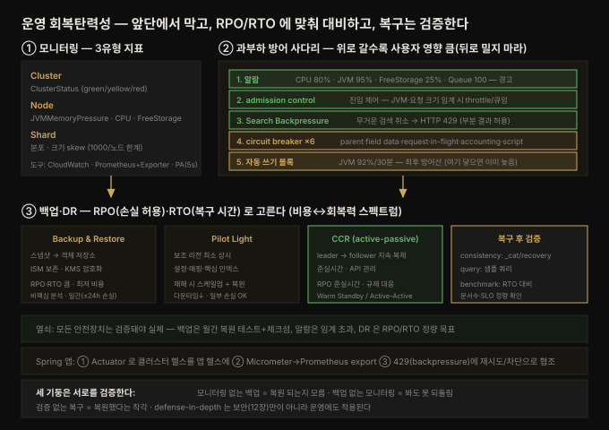

# 모니터링·백업·복구 — 지표·admission control·DR

---

> Part 4(운영·관리)의 세 번째 장입니다. 12장이 데이터를 *지키는*(보안) 법이었다면, 13장은 클러스터를 *살아 있게 유지하는* 법입니다. 운영 회복탄력성의 세 기둥 — **모니터링**(클러스터의 눈과 귀), **백업**(데이터 손실 보험), **복구 계획**(이론적 안전장치를 실제 회복력으로 전환) — 을 다룹니다. 자체 호스팅 OpenSearch 를 운영하는 DevOps 팀에게 이 셋은 선제적 문제 해결·비즈니스 연속성·엄격한 RPO/RTO 목표 달성을 가능하게 하는 삼각대입니다. 관통하는 원칙은 "장애가 사용자에게 닿기 전에 감지하고, 손실을 감당 가능한 범위로 묶고, 복구를 검증된 절차로 만든다"입니다.


## 핵심 요약

> 이 장의 한 문장은 **"운영 회복탄력성은 지표로 선제 감지하고(모니터링), 자원 임계에서 트래픽을 조절하며(admission control·backpressure), 손실 허용치(RPO)와 복구 시간(RTO)에 맞는 DR 전략으로 재해에 대비하는 것"** 입니다. 검색 인프라의 장애는 곧 서비스 중단이라, 운영 신뢰성이 보안만큼 중요합니다.
>
> 축이 넷입니다. 첫째 **모니터링** — 도구(CloudWatch·Prometheus+OpenSearch Exporter·내장 Performance Analyzer 5초 간격·Datadog/New Relic)와 3유형 지표(Cluster: `ClusterStatus` green/yellow/red·`ClusterIndexWritesBlocked` / Node: `CPUUtilization`·`JVMMemoryPressure`·`FreeStorageSpace`·GC / Shard: 분포·크기 skew). 대시보드로 시각화하고 임계 알람(red·CPU 80%·JVM 95%·FreeStorage 25%·Queue 100)을 겁니다. 둘째 **admission control·backpressure** — 자원 임계에서 요청을 거부/큐잉(JVM 압력·요청 크기)하고, Search Backpressure 로 무거운 검색을 취소(HTTP 429)하며, 회로 차단기(circuit breaker) 6종으로 메모리를 보호. 셋째 **트러블슈팅·튜닝** — red/yellow 진단(`allocation/explain`)·저장 부족(20%/20GB 블록)·JVM 92% 30분 자동 블록·1000 샤드 한계·refresh interval·bulk 5~15MiB·SSD·slow log. 넷째 **백업·DR** — AWS 4모델(Backup&Restore·Pilot Light·Warm Standby·Active-Active)을 RPO/RTO·비용으로 선택, 스냅샷(자동 일간·ISM 보존 정책·KMS 암호화)과 CCR(cross-cluster replication, active-passive)로 구현, 복구 후 검증(consistency·query·benchmark).
>
> 관통하는 통찰은 **"모든 안전장치는 검증돼야 실체가 된다"** 입니다. 백업은 복구를 월 단위로 테스트하고 체크섬으로 대조해야 신뢰할 수 있고, 알람은 임계값을 넘겨야 의미가 있으며, DR 전략은 RPO/RTO 를 정량 목표로 걸어야 선택이 됩니다. 최적화조차 "성능과 안정성의 균형" — 공격적 튜닝은 프로덕션 밖에서 먼저 검증합니다.


## 학습 목표

1. OpenSearch 모니터링 도구(CloudWatch·Prometheus·Performance Analyzer·Datadog)와 3유형 지표(Cluster·Node·Shard)를 구분해 설명할 수 있습니다.
2. admission control 과 backpressure(Search Backpressure·회로 차단기)가 각각 무엇을 언제 막는지 든다.
3. 주요 장애 시나리오(red/yellow·저장 부족·JVM 압력·샤드 한계·ISM rollover)의 진단 API 와 대응을 설명할 수 있습니다.
4. 성능 튜닝 레버(refresh interval·bulk 크기·SSD·shard 분포·slow log·filter context)를 언제 당기는지 판단할 수 있습니다.
5. AWS 4가지 DR 모델과 RPO/RTO 트레이드오프, 스냅샷·CCR·복구 후 검증을 설명할 수 있습니다.


## 본문 정리

이 장의 세 기둥과 과부하 방어 사다리를 한 장으로 요약하면 다음과 같습니다. 3유형 지표로 감지하고, 알람→admission control→backpressure→circuit breaker→자동 블록 순으로 **앞단에서** 막으며, RPO/RTO 에 맞춰 백업·DR 을 고르고 복구를 검증합니다.



### 1. OpenSearch 도메인 모니터링

**모니터링 도구**는 오픈소스부터 엔터프라이즈까지 범위가 넓습니다.

- **Amazon CloudWatch** — AWS 자원(OpenSearch 도메인 포함)의 종합 관측 서비스입니다. 자체 관리 클러스터라면 CloudWatch 에이전트를 배포해 지표·로그·이벤트를 중앙 수집합니다.
- **Prometheus + OpenSearch Exporter** — 오픈소스 대표 선택지입니다. exporter 로 클러스터 상태·노드 통계·인덱스 지표를 수집하고, Grafana 와 짝지어 PromQL 로 질의·시각화합니다.
- **내장 Performance Analyzer** — 실시간 모니터링을 최소 오버헤드로 제공하며, 기본 **5초 간격**으로 지표를 집계합니다. 추가 인프라가 필요 없지만, 과거 데이터 보존·고급 알림에는 한계가 있습니다.
- **Datadog·New Relic** — 사전 구축 대시보드·자동 알림의 통합 관측 플랫폼입니다. 비용이 크지만 폭넓은 인프라 모니터링과 지원을 줍니다.

도구 선택은 배포 규모·사내 역량·예산·통합 요건·보존 기간에 따라 갈립니다.

**핵심 지표는 3유형**입니다.

- **Cluster metrics** — 클러스터 전체 건강과 추세입니다. `ClusterStatus`(green: 모든 primary·replica 할당 / yellow: primary 는 할당됐으나 일부 replica 미할당 / red: primary 중 하나 이상 미할당), `ClusterIndexWritesBlocked`(쓰기 차단 여부), 2xx~5xx 응답 코드 분포.
- **Node metrics** — 개별 노드의 성능·자원입니다. `CPUUtilization`(steal time 포함), `JVMMemoryPressure`(힙 사용률 — **92% 가 30분 지속되면 시스템이 자동으로 쓰기를 차단**해 클러스터 악화를 막습니다), `FreeStorageSpace`(버퍼 제외 가용 공간), `JVMGCOldCollectionCount/Time`(major GC 빈도·시간).
- **Shard metrics** — 부하 skew·불균형을 잡습니다. active shards 분포(`GET _cat/shards`), 노드별 디스크 사용(`GET _cat/allocation?v`), 샤드 크기 분포(`GET _cat/shards?v&s=store:desc` 로 비정상적으로 큰 샤드 탐지).

### 2. 대시보드와 알람

CloudWatch 지표를 대시보드로 봅니다 — CPU·검색 rate, 읽기/쓰기 처리량(`ReadIOPS/WriteIOPS`·`DiskQueueDepth`, 예시에서 쓰기가 700M/s microburst 로 지배), 노드별 CPU(핫스팟 탐지). 권장 알람은 `ClusterStatus.red`(데이터 불가용), `ClusterIndexWritesBlocked`(자원 제약), `CPUUtilization/MasterCPUUtilization`, `JVMMemoryPressure/MasterJVMMemoryPressure`, `FreeStorageSpace` 입니다.

SRE 관점의 **임계 알람 세트** 예시: `ClusterStatus.red`(Max ≥1, 1주기), `CPUUtilization`(Avg ≥80%, 3주기), `JVMMemoryPressure`(Max ≥95%, 3주기), `OldGenJVMMemoryPressure`(Max ≥80%, 3주기), `FreeStorageSpace`(Min ≤25%), `Queue depth`(Avg ≥100). 사고 시 `GET _nodes/stats/jvm,os,process`·`GET _cat/thread_pool?v`(활성·큐·거부 스레드)로 디버깅합니다.

### 3. Admission control 과 backpressure

트래픽을 자원 상태에 맞춰 조절해 클러스터를 과부하로부터 지킵니다.

- **Admission control** — 클러스터의 문지기입니다. 자원이 임계에 닿으면 요청을 거부/큐잉해 연쇄 실패를 막습니다. **JVM memory pressure threshold**(임계 초과 시 `_search`·`_bulk` 요청을 메모리가 풀릴 때까지 throttle, `GET _nodes/stats/jvm` 으로 확인), **RequestSizeThreshold**(in-flight 요청 총 크기가 임계를 넘으면 throttle).
- **Backpressure** — 실시간 자원 지표에 따라 작업을 throttle·취소·거부하는 대응 전략입니다. **Search Backpressure** 는 노드가 압박받을 때 자원 집약적 검색(복잡·느린 쿼리, 무거운 집계)을 식별해 취소합니다 — 취소된 요청은 **HTTP 429 "Too Many Requests"** 를 반환하고, 일부 샤드 실패 시 부분 결과가 허용되면 그것만 돌아옵니다.

**회로 차단기(circuit breaker)** 는 6종입니다: parent(전역 메모리 한계)·field data(field data 로딩 제한)·request(요청당 메모리)·in-flight requests(동시 요청 메모리)·accounting(내부 작업 메모리)·script compilation(스크립트 컴파일 rate). `GET _nodes/stats/breakers` 로 메모리 한계·오버헤드 추정·trip 횟수를 봅니다.

### 4. 트러블슈팅과 스케일링

주요 장애 시나리오와 진단·대응입니다.

- **Red status** — primary 샤드(와 replica)가 어느 노드에도 할당되지 않은 위급 상태입니다. 노드 실패·프로세스 크래시가 원인입니다. `GET /_cluster/allocation/explain` 으로 원인(예: `"reason": "NODE_LEFT"`)을 진단합니다.
- **Yellow status** — primary 는 모두 할당됐으나 replica 하나 이상이 미할당입니다. 단일 노드 클러스터는 자연히 yellow 로 시작합니다(replica 둘 곳이 없음). 위급하진 않지만 내결함성이 낮아집니다.
- **저장 부족(ClusterBlockException)** — 가용 저장이 **전체의 20% 또는 20GB 미만**으로 떨어지면 OpenSearch 가 쓰기를 차단합니다. `GET /_cat/allocation?v` 로 확인하고, `FreeStorageSpace` 모니터링 → 큰 인스턴스로 스케일 → 데이터 보존 정책 → 인덱스 압축 순으로 대응합니다.
- **높은 JVM 압력** — 92% 가 30분 지속되면 자동 쓰기 차단이 걸립니다. `GET /_nodes/stats/jvm?pretty`·`GET /_nodes/hot_threads` 로 조사하고, 큰 쿼리 최적화·circuit breaker 조정·캐시 eviction·노드 스케일로 대응합니다.
- **최대 샤드 한계** — 노드당 기본 **1,000 샤드**입니다. 초과 시 인덱스 생성이 실패합니다. `PUT /_cluster/settings` 로 `cluster.max_shards_per_node` 를 올릴 수 있지만(예: 2000), 메타데이터·관리 오버헤드가 커집니다. 대안으로 `_shrink` API 로 샤드를 통합하고 ISM 을 적용합니다.
- **ISM rollover 실패** — 대개 alias 누락·템플릿 오설정입니다. `GET _plugins/_ism/explain/index-name?pretty` 로 진단(예: `"error": "no rollover_alias found"`)하고, rollover 타깃·alias·인덱스 패턴·템플릿을 검증합니다.
- **UltraWarm 마이그레이션** — 충분한 디스크(**샤드 크기 3배 + 20GB**), force merge 완료, 인덱스 준비 상태를 사전 확인합니다.

### 5. 성능 튜닝

인덱싱 처리량·쿼리 지연·자원 사용의 균형을 맞추는 레버들입니다.

- **Refresh interval** — 기본 1초입니다. `PUT /my_index/_settings` 로 `refresh_interval` 을 늘리거나(`30s`), 순수 대량 인덱싱 중엔 일시 비활성화(`-1`)합니다. refresh 를 미루면 세그먼트 flush 빈도가 줄어 대량 인덱싱 처리량이 크게 오르지만, 데이터 신선도(최근 색인분이 검색에 안 보임)를 대가로 치릅니다.
- **SSD instance store** — I3·Im4gn·r6gd 인스턴스(Graviton2, 최대 30TB NVMe)로 저장 성능을 올립니다. `path.data` 를 NVMe 경로로 설정하고 `GET /_nodes/stats/fs` 로 모니터링합니다.
- **Bulk 요청 크기** — **5~15MiB** 로 시작해 성능을 보며 점증합니다. 거부가 있으면 0.8배, 응답이 빠르면 1.2배로 동적 조정하는 코드 예시가 있습니다.
- **Shard 분포** — 최적 공식은 `샤드 수 = k × 데이터 노드 수` 입니다.
- **Search/write 스레드 풀** — vCPU 기준으로 `search = (vcpu × 3)/2 + 1`, `write = vcpu` 로 계산합니다.
- **Slow log** — `slowlog.threshold.query.warn` 등으로 문제 쿼리를 식별합니다.
- **쿼리 최적화** — source filtering(반환 필드 제한 → 대역폭·메모리 절감)·filter context(관련도 계산 없이 문서 좁힘)·shard skipping(`can_match` 로 불필요 샤드 사전 제외).

균형이 핵심입니다 — 공격적 최적화는 성능을 올려도 안정성·일관성을 해칠 수 있으므로, 비프로덕션에서 먼저 테스트하고 점진 적용합니다.

### 6. 백업 전략과 재해복구

DR 전략은 AWS 의 **4가지 정본 모델**로 매핑됩니다 — Backup & Restore, Pilot Light, Warm Standby, Active-Active. 각각 비용·복잡도·RTO·RPO 트레이드오프가 다릅니다. 규제 대상이면 Pilot Light·Warm Standby·Active-Active 를 고려합니다.

- **Backup & Restore** — 가장 기본입니다. 정기 스냅샷을 내구성 있는 객체 저장소에 두고 재해 시 복원합니다. 비용은 싸지만 RTO·RPO 가 깁니다(복원 시간 + 백업 빈도에 의존). OpenSearch 는 자동 스냅샷(Amazon OpenSearch Service 기본, 일간, 원하는 만큼 보존)과 수동 스냅샷을 지원하며, 스냅샷은 인덱스·매핑·설정 전체 상태를 담습니다. 복원 전 대상 인덱스를 닫거나 삭제해야 합니다. 증분 백업 + ISM 보존 정책(예: 30일 보존 후 삭제, `s3-glacier-repo`)으로 계층 보존을 구현하고, 보안이 중요하면 AWS KMS·HashiCorp Vault 로 클라이언트 측 암호화 후 저장합니다. **복원을 월 단위로 테스트하고 체크섬으로 대조**하는 것이 핵심입니다.
- **Pilot Light** — 보조 리전/클러스터에 최소한의 상시 가동 환경(클러스터 설정·매핑·핵심 인덱스)을 유지하되 라이브 데이터는 처리하지 않습니다. 프로덕션 스냅샷을 공유 저장소로 계속 보내고, 재해 시 pilot 클러스터를 스케일업하며 최신 스냅샷을 복원합니다. "다운타임은 줄이되 일부 손실은 감내" 할 때 맞습니다.

**Disaster recovery architecture — CCR.** OpenSearch 는 네이티브 **cross-cluster replication(CCR)** 플러그인으로 leader↔follower 간 지속적·저지연 복제를 제공합니다(관리형·자체 관리 모두, 플러그인 설치 시). **active-passive** 복제로 follower 인덱스가 leader 를 계속 pull 해 준실시간 동기화를 유지하며, API 로 wildcard 패턴·일시정지·재개·중지를 관리합니다. CCR 을 안 쓰면 수동 스냅샷/복원, OpenSearch API 기반 커스텀 솔루션, 서드파티 동기화 도구가 대안입니다.

**복구 후 검증(post-recovery validation).** 복원·복제 후엔 반드시 검증합니다 — consistency checks(`/_cat/recovery?v` 로 샤드 할당 확인), query validation(복원 인덱스에 샘플 쿼리), performance benchmarking(복원 속도를 RTO 목표와 비교). 인덱스 존재·문서 수 대조(허용 편차)·쿼리 성능(SLO 대비)을 확인하는 테스트 스위트로 복구 성공을 정량 평가합니다.


## 심화 학습

**RPO 와 RTO 는 백업 설계의 두 축입니다.** RPO(Recovery Point Objective)는 "얼마만큼의 데이터 손실을 감내하는가"(백업 빈도가 결정), RTO(Recovery Time Objective)는 "얼마나 빨리 복구하는가"(복원 방식이 결정)입니다. Backup & Restore 는 둘 다 크고(일간 스냅샷 = 최대 24시간 손실), CCR active-passive 는 RPO 를 준실시간으로 줄입니다. 4모델은 이 두 축 위의 비용-회복력 스펙트럼입니다 — Backup&Restore(싸고 느림) → Pilot Light → Warm Standby → Active-Active(비싸고 빠름). "규제 대상이면 Pilot Light 이상"이라는 책의 조언은, 규제가 RPO/RTO 를 사실상 계약으로 못 박기 때문입니다.

**JVM 92%/30분 자동 블록은 마지막 방어선이지 목표가 아닙니다.** 이 자동 쓰기 차단은 클러스터가 죽는 것보다 낫지만, 여기 닿았다는 건 이미 admission control·backpressure·알람이 앞에서 막지 못했다는 뜻입니다. 계층이 있습니다: 알람(80~95% 경고) → admission control(임계에서 throttle) → Search Backpressure(무거운 쿼리 취소, 429) → circuit breaker(메모리 보호) → 자동 블록(최후). 운영은 앞단에서 잡는 것이 목표이고, 뒤로 갈수록 사용자 영향이 큽니다.

**1000 샤드 한계는 "올리면 되는 설정"이 아닙니다.** `cluster.max_shards_per_node` 를 2000 으로 올리는 건 응급 처치이고, 근본은 샤드 수 자체를 줄여야 한다는 데 있습니다 — 각 샤드는 Lucene 인덱스라 힙 메모리·파일 핸들·클러스터 상태 메타데이터를 먹습니다. `_shrink` 로 통합하거나 ISM rollover 로 시계열 인덱스를 관리하는 것이 정답이고, 한계를 올리면 매핑·복제·리밸런싱 비용이 전부 커집니다. 14장의 클러스터 사이징으로 이어지는 대목입니다.

**모니터링·백업·복구는 서로를 검증합니다.** 모니터링 없는 백업은 "복원이 실제로 되는지" 모르고, 백업 없는 모니터링은 "장애를 봐도 되돌릴 수" 없으며, 검증 없는 복구는 "복원했다는 착각"입니다. 책이 세 기둥을 한 장에 묶은 이유입니다 — defense-in-depth 는 보안(12장)만이 아니라 운영에도 적용됩니다. 모니터링 통찰을 백업 전략·복구 자동화와 상관지어야 회복력 있는 인프라가 됩니다.


## 결정 치트시트

| 상황 | 선택 | 이유 |
|------|------|------|
| 오픈소스 관측, 이미 Prometheus 운영 | Prometheus + OpenSearch Exporter + Grafana | PromQL·유연한 대시보드 |
| 최소 오버헤드 내장 실시간 | Performance Analyzer(5초) | 추가 인프라 불필요 (보존·알림 한계) |
| AWS 관리형 도메인 | CloudWatch + 알람 | AWS 통합·자동 스냅샷 |
| 자원 임계에서 요청 보호 | admission control(JVM·크기 임계) | 연쇄 실패 방지, throttle |
| 무거운 검색이 노드 위협 | Search Backpressure | 자원 집약 쿼리 취소(429) |
| red status | `allocation/explain` | 미할당 원인(NODE_LEFT 등) |
| 저장 20%/20GB 미만 | 스케일 → 보존 정책 → 압축 | ClusterBlockException 해소 |
| JVM 92%/30분 | 큰 쿼리 최적화·circuit breaker·스케일 | 자동 블록 전 대응 |
| 1000 샤드 초과 | `_shrink` + ISM (한계 상향은 응급) | 메타데이터 오버헤드 |
| 대량 인덱싱 최대 속도 | `refresh_interval` -1 (일시) | 신선도 희생, 속도 급증 |
| 비용 우선, 손실 감내 | Backup & Restore | RTO/RPO 큼, 가장 저렴 |
| 다운타임 최소, 일부 손실 OK | Pilot Light | 보조 리전 최소 상시 |
| 준실시간 DR·규제 | CCR active-passive | leader→follower 지속 복제 |
| 복구 후 | consistency·query·benchmark 검증 | RTO/문서수/SLO 정량 확인 |


## Spring 앱 개발 관점

이 장은 **클러스터 운영**이 주제라 대부분 인프라·DevOps 의 영역입니다 — 지표·admission control·스냅샷·CCR 은 클러스터 측 설정이고 Spring 앱이 건드리지 않습니다. 그래서 Spring 관점의 핵심은 **"앱은 자기가 보는 클러스터 건강을 자기 관측 파이프라인에 합류시킨다"** 입니다. 클러스터 전체 지표(JVMMemoryPressure·샤드 수)는 운영팀이 Prometheus/CloudWatch 로 보지만, "이 Spring 앱이 OpenSearch 에 붙어 있는가, 응답하는가"는 앱이 스스로 노출해야 합니다. 책에 Spring 예제가 없어 **공식 문서(Spring Boot Actuator·Micrometer)로 보강**했습니다.

**(a) 클러스터 헬스 — Actuator health indicator.** Spring Boot Actuator 는 `ElasticsearchRestClientHealthIndicator`(키 `elasticsearch`)를 자동 등록해 "클러스터가 살아 있는가"를 헬스 체크에 넣습니다. `/actuator/health` 가 OpenSearch 연결 상태를 UP/DOWN 으로 보고하므로, 앱의 readiness/liveness 판단에 클러스터 연결이 반영됩니다.

```yaml
# application.yml — 클러스터 헬스를 앱 헬스에 포함
management:
  endpoint.health.show-details: always
  health.elasticsearch.enabled: true      # 기본 on. 끄려면 false
                                           # 전체 끄기: management.health.defaults.enabled: false
```

**(b) 앱→Prometheus — Micrometer 로 헬스·클라이언트 지표 export.** 책이 권장한 Prometheus + Grafana 스택에, 앱은 Micrometer 로 **자기 관점의 지표**를 실어 보냅니다. Actuator 헬스 상태를 Micrometer Gauge 로 변환하면(UP=1, DOWN=0 등) 클러스터 연결 단절을 앱 대시보드에서 알람 걸 수 있습니다. 이렇게 하면 "클러스터 지표(운영팀)"와 "앱이 본 클러스터(개발팀)"가 같은 Prometheus 에 모여, 장애 원인이 클러스터인지 앱-클러스터 경로인지 빠르게 가릅니다.

```java
// Actuator 헬스 → Micrometer Gauge (Prometheus 로 export)
@Bean
MeterBinder openSearchHealthGauge(HealthEndpoint health) {
    return registry -> Gauge.builder("opensearch.client.up", health,
            h -> "UP".equals(h.healthForPath("elasticsearch").getStatus().getCode()) ? 1 : 0)
        .description("이 앱이 본 OpenSearch 연결 상태")
        .register(registry);
}
```

**(c) 앱 측 backpressure 대응 — 429 를 재시도/차단으로.** 클러스터가 Search Backpressure 로 요청을 취소하면 앱은 **HTTP 429** 를 받습니다. 이걸 예외로 흘리지 말고, 지수 백오프 재시도(Resilience4j Retry)나 회로 차단(CircuitBreaker)으로 감싸야 앱이 클러스터 압박을 가중하지 않습니다. 즉 클러스터의 backpressure 에 앱이 협조하는 구조입니다.

```java
@Retryable(retryFor = TooManyRequestsException.class,
           backoff = @Backoff(delay = 500, multiplier = 2))  // 429 → 지수 백오프
SearchHits<Doc> search(Query q) {
    return openSearchOps.search(q, Doc.class);
}
```

**주의할 점 두 가지.** 첫째, **백업·복구·CCR 은 앱이 아니라 클러스터/운영의 책임**입니다 — Spring 앱에서 스냅샷을 찍거나 CCR 을 관리하려 들지 마세요. 앱은 복구 후 검증 단계에서 "query validation"의 **샘플 쿼리 클라이언트** 역할(복원 인덱스가 기대대로 응답하는지 자동 테스트)로 참여하는 것이 적절합니다. 둘째, **헬스 체크 간격이 클러스터에 부하를 줄 수 있습니다** — 수백 개 앱 인스턴스가 잦은 `/actuator/health` 로 클러스터를 찌르면 그 자체가 부하이므로, 헬스 체크는 가볍게(연결 확인 수준) 유지하고 무거운 상세 지표는 exporter 에 맡깁니다.

정리하면, Spring 앱에서 이 장은 **① 클러스터 헬스를 Actuator 로 앱 헬스에 포함 ② Micrometer 로 앱 관점 지표를 Prometheus 에 합류 ③ 429(backpressure)에 재시도/차단으로 협조** 세 조각이고, 지표 수집·백업·DR 의 본체는 클러스터/운영이 맡습니다. "운영은 클러스터가 하고, 앱은 자기가 본 클러스터를 관측 파이프라인에 정직하게 보고한다" — 이것이 이 장을 Spring 관점으로 압축한 문장입니다.


## 면접 대비

**한 줄 정의**: OpenSearch 운영 회복탄력성은 3유형 지표(Cluster·Node·Shard)로 선제 감지하고(모니터링), 자원 임계에서 admission control·backpressure 로 트래픽을 조절하며, RPO/RTO 에 맞는 DR 전략(Backup&Restore·Pilot Light·CCR)과 복구 후 검증으로 재해에 대비하는 체계입니다.

**Q1. ClusterStatus 의 green/yellow/red 는 각각 무엇을 뜻하나요?**
green 은 모든 primary·replica 샤드가 할당된 정상, yellow 는 primary 는 다 할당됐지만 replica 하나 이상이 미할당(내결함성 저하, 단일 노드 클러스터는 자연히 yellow), red 는 primary 중 하나 이상이 미할당(데이터 불가용, 위급)입니다. red 는 `_cluster/allocation/explain` 으로 원인(NODE_LEFT 등)을 진단합니다.

**Q2. admission control 과 backpressure 의 차이는?**
admission control 은 **입구의 문지기**로, 자원(JVM 압력·요청 크기)이 임계를 넘으면 들어오는 요청을 거부/큐잉/throttle 합니다. backpressure 는 **실행 중 대응**으로, 이미 실행 중인 무거운 검색을 자원 압박 시 취소(Search Backpressure → HTTP 429)하거나 circuit breaker 로 메모리를 보호합니다. 전자는 진입 제어, 후자는 실행 중 방어입니다.

**Q3. JVM 92%/30분 자동 쓰기 블록은 왜 있고, 왜 여기 닿으면 안 되나요?**
힙 압력이 극에 달하면 OOM·클러스터 악화로 이어지므로, 마지막 방어선으로 쓰기를 자동 차단합니다. 하지만 여기 닿았다는 건 앞단(80~95% 알람 → admission control → Search Backpressure → circuit breaker)이 다 뚫렸다는 뜻이라, 이미 사용자 영향이 큽니다. 운영 목표는 앞단에서 잡는 데 있습니다.

**Q4. RPO 와 RTO 로 DR 4모델을 어떻게 고르나요?**
RPO 는 감내할 데이터 손실량(백업 빈도가 결정), RTO 는 복구 시간(복원 방식이 결정)입니다. Backup&Restore 는 둘 다 크지만 최저 비용, Pilot Light 는 보조 리전에 최소 환경을 상시 유지해 다운타임을 줄이고, CCR active-passive 는 follower 가 leader 를 계속 pull 해 RPO 를 준실시간으로 낮춥니다. 규제 대상이면 RPO/RTO 가 계약이라 Pilot Light 이상을 씁니다.

**Q5. Spring 앱은 이 장에서 무엇을 책임지나요?**
클러스터 지표·백업·CCR 은 운영이 맡고, 앱은 **자기가 본 클러스터 건강을 관측 파이프라인에 보고**합니다 — Actuator `ElasticsearchRestClientHealthIndicator` 로 연결 상태를 앱 헬스에 포함하고, Micrometer 로 그 상태를 Prometheus(책 권장 스택)에 export 하며, backpressure 로 받은 429 에 지수 백오프 재시도/회로 차단으로 협조합니다. 복구 후 검증에는 샘플 쿼리 클라이언트로 참여합니다.


## 핵심 개념 체크리스트

- [ ] 모니터링 도구 4종(CloudWatch·Prometheus·Performance Analyzer·Datadog)의 트레이드오프를 안다.
- [ ] 3유형 지표(Cluster·Node·Shard)와 대표 지표(ClusterStatus·JVMMemoryPressure·FreeStorageSpace·샤드 분포)를 구분한다.
- [ ] admission control(진입 제어)과 backpressure(실행 중 방어·Search Backpressure·429·circuit breaker 6종)의 차이를 설명할 수 있다.
- [ ] 주요 장애(red/yellow·저장 20%/20GB·JVM 92%/30분·1000 샤드·ISM rollover)의 진단 API 와 대응을 안다.
- [ ] 성능 튜닝 레버(refresh interval·bulk 5~15MiB·SSD·shard 공식·slow log·filter context·can_match)를 든다.
- [ ] AWS DR 4모델과 RPO/RTO 트레이드오프, 스냅샷(ISM 보존·KMS)·CCR active-passive·복구 후 검증을 설명할 수 있다.
- [ ] "모든 안전장치는 검증돼야 실체가 된다"(월간 복원 테스트·체크섬)가 왜 핵심인지 안다.
- [ ] Spring 앱의 책임이 "클러스터 헬스 보고 + Prometheus export + 429 협조"라는 점을 안다.


## 참고 자료

- 원본: *The Definitive Guide to OpenSearch* — Chapter 13: Monitoring, Backup, and Recovery (ISBN 9781835885789, O'Reilly 학습 플랫폼). 본문 정리의 지표명·수치·API·코드는 모두 이 장에서 추출했습니다.
- OpenSearch 지표·admission control·CCR: [OpenSearch 문서](https://docs.opensearch.org/docs/latest/) — 클러스터 API(`_cat/*`·`_nodes/stats/*`), [cross-cluster replication](https://docs.opensearch.org/docs/latest/tuning-your-cluster/replication-plugin/index/), ISM.
- AWS DR 4모델: [Disaster recovery options in the cloud](https://docs.aws.amazon.com/whitepapers/latest/disaster-recovery-workloads-on-aws/disaster-recovery-options-in-the-cloud.html)(책이 직접 인용한 화이트페이퍼).
- Spring 헬스·지표: [Spring Boot Actuator — HealthIndicators](https://docs.spring.io/spring-boot/reference/actuator/endpoints.html)(context7 `/spring-projects/spring-boot` 로 `ElasticsearchRestClientHealthIndicator`·`management.health.elasticsearch.enabled`·Micrometer Prometheus export 확인).
- 연계 노트: [12-01 보안](12-01.보안%20—%20인증·인가·FGAC·멀티테넌시.md)(운영도 defense-in-depth), [11-01 마이그레이션](11-01.OpenSearch%20마이그레이션%20—%20단계·무중단%20패턴·Migration%20Assistant.md), 상위 [README](README.md).
