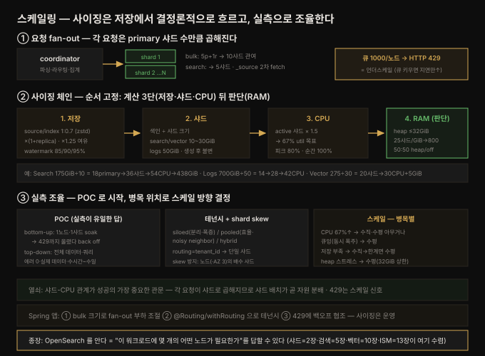

# 스케일링·성능 최적화 — 분산 구조·사이징·튜닝

---

> Part 4(운영·관리)의 마지막 장이자 책 전체의 종장입니다. OpenSearch 는 본질적으로 **Apache Lucene 을 위한 분산 시스템**이라, 워크로드의 성패(지연·처리량 목표 달성)는 "배포한 하드웨어와 생성한 인덱스의 관계"에 결정적으로 달려 있습니다. 이 장은 그 관계를 세 축으로 풉니다 — **분산 구조**(노드 역할·요청 처리·스레드/큐), **클러스터 사이징**(저장→샤드→CPU→RAM 순으로 추정), **고성능 최적화**(POC·테넌시·shard skew·수직/수평 스케일링). 관통하는 원칙은 "사이징은 추정으로 시작하되, 실제 트래픽으로 측정해 조율한다 — '그때그때 다르다(it depends)'가 유일한 정답"입니다.


## 핵심 요약

> 이 장의 한 문장은 **"OpenSearch 사이징은 저장→샤드→CPU→RAM 순으로 보수적으로 추정한 뒤, POC 로 실제 트래픽을 흘려 샤드 크기·개수를 조율하고, 테넌시·shard skew·스케일링 전략으로 워크로드 변화에 대응하는 것"** 입니다. 검색 성능의 핵심 엔티티는 **샤드**이며, 모든 요청은 샤드로 부챗살처럼 퍼집니다(scatter-gather).
>
> 축이 셋입니다. 첫째 **분산 구조** — 노드 역할 분리(cluster manager·data·coordinator·ML·search/UltraWarm), 요청 처리(coordinator 가 샤드로 fan-out → primary 색인 후 replica 전달 → 재정렬/재집계 → _source 2차 fetch), 스레드/큐(search·write 큐 노드당 1000 슬롯, 가득 차면 **HTTP 429 = 언더스케일 신호**, head-of-queue 문제). 둘째 **사이징** — 저장(source/index 비 1:1.10 기본, zstd 로 1:0.7 · watermark 85/90/95% · 여유 25% ×1.25) → 샤드(search/vector 10~30GiB, logs 50GiB) → CPU(active 샤드당 1.5 CPU → 67% util) → RAM(heap 최대 32GiB·4바이트 포인터·샤드당 20MiB non-collectable·**25샤드/GiB heap → 800샤드/노드**·50:50 heap/off-heap). 셋째 **최적화** — POC(bottom-up 샤드 크기 소크 테스트 → top-down 전체 부하), 테넌시 3모델(siloed·pooled·hybrid + document routing), shard skew(노드 수의 배수로 샤드 배치·AZ 3배수), 스케일링(수직 vs 수평 — 병목 위치로 결정).
>
> 관통하는 통찰은 **"샤드-CPU 관계가 성공의 가장 중요한 관문이고, 이론 사이징은 출발점일 뿐 실측이 답"** 입니다. 각 요청이 primary 샤드 수만큼 sub-request 로 곱해지므로(5 primary+1 replica bulk = 10샤드 관여), 샤드 배치가 곧 자원 분배입니다. 429 는 큐를 키우라는 신호가 아니라 자원을 늘리라는 신호입니다.


## 학습 목표

1. OpenSearch 의 분산 구조(노드 역할·요청 fan-out·스레드/큐)와 HTTP 429 의 의미를 설명할 수 있습니다.
2. 사이징 순서(저장→샤드→CPU→RAM)와 각 단계의 계산 근거(source/index 비·watermark·1.5 CPU/샤드·25샤드/GiB heap)를 든다.
3. 샤드 크기·개수를 결정하는 압력(scatter-gather vs 병렬성·읽기 vs 쓰기)을 판단할 수 있습니다.
4. 테넌시 3모델(siloed·pooled·hybrid)과 document routing, noisy neighbor 문제를 구분할 수 있습니다.
5. shard skew 를 피하는 배치(노드 수 배수·AZ)와 수직/수평 스케일링을 언제 쓰는지 설명할 수 있습니다.


## 본문 정리

이 장의 사이징 방법론을 한 장으로 요약하면 다음과 같습니다. 요청이 샤드로 fan-out 되고, 사이징은 저장→샤드→CPU 로 **결정론적으로** 이어진 뒤 RAM 을 판단으로 얹으며, POC 실측으로 조율하고 병목 위치에 따라 수직/수평을 고릅니다.



### 1. OpenSearch 를 분산 시스템으로 이해하기

**노드 역할 분리.** 노드는 `node.role`(opensearch.yml)로 역할을 갖습니다. 기본은 모든 역할을 모든 노드에 주지만, **관심사 분리**가 베스트 프랙티스입니다 — 특히 data 노드는 전용 하드웨어로 분리합니다. 개발/테스트는 단일 노드로, 프로덕션은 전용 cluster manager + data 노드로, 고처리량엔 coordinator 노드를, 벡터엔 ML 노드를, 비용 절감·스냅샷 접근엔 search/UltraWarm 노드를 추가합니다.

**관리형 옵션.** Amazon OpenSearch Service(도메인 = 하드웨어+소프트웨어+모니터링, REST 엔드포인트)와 Serverless(collection, 인프라 자동 스케일)가 있습니다. Serverless 는 **OCU**(OpenSearch Compute Unit — 1 vCPU·6GiB RAM·120GiB storage)로 요청을 처리하며, collection 유형이 셋입니다: Time series(로그/메트릭, 롤오버·S3 티어링 자동), Search(전 데이터 search OCU 상주), Vector(KNN 플러그인·벡터 RAM 관리). 같은 KMS 키를 쓰는 인덱스끼리 OCU 를 공유합니다.

**데이터 라이프사이클.** 성능의 핵심 엔티티는 **샤드**입니다(모든 색인·검색 요청을 처리). 샤드는 인덱스의 구성요소라, 샤드 전략은 인덱스 전략으로 간접 제어합니다. 인덱싱 패턴이 둘입니다 — **single index**(search·vector: 전 데이터 한 인덱스, 삭제는 `delete_by_query`)와 **rolling index**(logs: 주기적으로 새 인덱스 생성, 쓰기는 active index 로, 조회는 index pattern 전체에 시간 필터). logs 는 time-based(보통 일간, 보존 제어에 유리)와 size-based(ISM 롤오버, 노드 자원 분배에 유리 — 샤드 크기가 같아 노드당 active index 샤드 1개로 균등 분배) 두 전략이 있습니다.

**요청 처리(request processing).** 분배 계층이 요청을 샤드 있는 data 노드로 라우팅합니다. coordinator(전용이 없으면 요청받은 노드)가 전체 요청을 파싱해 대상 샤드 위치를 정하고 sub-request 를 만들어 보냅니다. **색인**: 단건은 primary 로 forward, bulk 는 샤드별 문서만 분할해 sub-request → primary 가 색인 후 replica 로 전달 → 결과 집계. **검색**: 각 샤드(primary 또는 replica) 하나에 보냄 → 샤드가 결과 반환 → coordinator 가 재정렬·재집계 → **_source 를 2차로 fetch**(최종 결과에 들어갈 데이터만 네트워크로, 최적화).

**스레드와 큐.** 노드는 들어오는 작업을 큐에 담고, 큐마다 스레드가 붙어 처리합니다(`GET _cat/thread_pool`). 가장 중요한 큐는 search·write(bulk 색인)로 **노드당 1000 슬롯**입니다. 큐가 가득 차면 **HTTP 429** 를 반환합니다 — 이는 **클러스터가 언더스케일됐다는 핵심 신호**입니다. 자원이 충분하면 큐는 비어 있습니다. "큐를 키우면 되지 않나?"의 답은 "안 된다" — 큐 대기 시간이 전체 지연에 더해져 모든 요청 지연이 악화되고, 결국 큰 큐도 넘칩니다. 게다가 **head-of-queue 문제** — 느린 요청이 샤드 큐 앞을 막으면 뒤의 빠른 요청도 그 지연을 떠안고, 이 슬로다운이 연쇄됩니다.

> 📦 **REQUESTS, SHARDS, AND NODE RESOURCES** — 각 요청은 참조 인덱스의 primary 샤드 수와 상관해 sub-request 로 곱해집니다. 5 primary + 1 replica 인덱스에 bulk 를 보내면 10샤드가, search 를 보내면 5샤드(primary 또는 replica)가 관여합니다. 각 샤드 요청은 CPU·Java heap·disk 를 씁니다.

### 2. 클러스터 사이징 전략

권고는 **보수적**입니다 — 실제 소비는 요청률·데이터 크기·데이터 성질에 결정적으로 달려, "그때그때 다르다"가 유일한 답입니다. 하지만 시작점은 필요합니다. 예제 워크로드 셋으로 진행합니다: **Search**(250 GiB JSON), **Logs**(1 TiB/day, hot 7일·warm 83일), **Vector**(100 GiB 메타데이터·100만 문서·384차원·HNSW·FAISS).

**저장(먼저 계획).** source/index 비를 정합니다 — 대다수 케이스에서 **1:1.10**(색인이 소스보다 큼, _source 저장 탓)이고, **zstd 코덱**(2.9+)이면 약 30% 압축으로 **1:0.7** 로 줄어듭니다. 코덱: default(LZ4, 빠름/낮은 압축)·best_compression(zlib, 지연↑/압축↑)·zstd(권장)·qat(2.15+ Intel HW 가속). replica 를 곱합니다(프로덕션 최소 1 replica). watermark: **low 85%**(샤드 할당 중단)·**high 90%**(샤드 이동)·**flood 95%**(쓰기 차단). 여유 25%를 위해 소비량 ×1.25. → Search 350→438 GiB, Logs 90일 126→158 TiB, Vector 150→188 GiB.

**RAM.** JVM heap(임시·장기 구조·집계), 벡터 그래프, OS page cache(Lucene 세그먼트)에 씁니다. heap 은 **최대 32 GiB**(Java 가 4바이트 포인터를 쓰게 — 그 이상은 압축 포인터가 깨져 비효율). 관리형은 기본 **50% heap(≤32GiB) / 50% off-heap**. 벡터 RAM 은 HNSW/IVF 공식(문서 참조), `knn.memory.circuit_breaker.limit` 로 벡터 vs OS cache 비율 조정. Lucene 은 memory-mapping 으로 세그먼트를 RAM 에 올리므로, off-heap RAM 이 충분하면 OS 가 전체 인덱스를 page-in 해 RAM 에서만 서빙합니다.

> 📦 **SHARD-TO-NODE RATIOS AND HEAP USAGE** — 각 샤드는 약 **20 MiB 의 non-collectable heap** 을 씁니다. 그래서 노드당 샤드 수를 제한해 검색·색인용 heap 을 남겨야 합니다. 지침은 **heap GiB 당 25 샤드**입니다. 32 GiB heap 노드라면 **노드당 800 샤드 이하**로 두도록 노드 수를 정합니다.

**CPU.** active 샤드(요청을 받아 처리 중인 샤드)를 100% 가동으로 가정(보수적, 과provision). data 노드 전체 CPU 는 **평균 65%·피크 80%·순간 100%** 가 건강한 범위입니다(너무 오래 과부하면 health check 실패). 계획은 **active 샤드당 1.5 CPU**(모든 샤드 상시 active 시 67% util). 처리량으로 환산하면 지연이 변수 — 1초 걸리는 요청 하나 = N샤드×N CPU 를 그 1초간 점유. 즉 클러스터는 "1000개의 1ms 요청/초" 또는 "1개의 1초 요청"을 처리합니다. logs 는 active 샤드가 최신 인덱스 샤드 수와 같고(항상 쓰기), 읽기가 가벼워(작은 시간창 필터) 쿼리 부하를 대개 무시할 수 있습니다.

**샤드와 네트워킹.** primary 샤드 수는 생성 시 정하고 변경 불가입니다. 권장 크기는 **search/vector 10~30 GiB, logs 50 GiB**. scatter-gather 지연이 핵심 균형점입니다 — 샤드가 너무 작으면 scatter-gather 지연이 처리 지연을 넘고(→크게), 너무 크면 병렬성을 못 살립니다(→작게). **쓰기 많음 = 샤드 많이, 읽기 많음 = 샤드 적게**. 매치 수도 축 — logs 는 작은 시간창 집계라 큰 샤드 가능, 벡터는 근사 매칭의 그래프가 로그 시간 접근(=높은 필터링 효과)이라 샤드 크기를 크게, 단 hybrid(비벡터 sub-query 포함)면 작게.

**사이징 예제 완성.** Search: 175 GiB 색인 ÷ 10 GiB = **18 primary → 36샤드 → 54 CPU → 438 GiB**(관리형 r7gd.2xlarge.search ×8 + cluster manager ×3). Logs: 700 GiB/일 ÷ 50 GiB = **14 primary → 28샤드 → 42 CPU**(hot r7g.2xlarge ×9 + warm UltraWarm1.large ×4, warm 은 2 TiB/CPU 로 스토리지 편중, S3 단일 저장이라 스토리지 절반). Vector: 275 GiB ÷ 30 GiB = **20샤드 → 30 CPU + 5 GiB 벡터 off-heap RAM**(r7gd.xlarge ×9). **순서가 핵심: 저장 → 샤드 수 → CPU → RAM.**

### 3. 고성능 최적화

초기 배포는 추정이라 100% 정확할 수 없습니다 — 워크로드로 테스트하며 CPU·heap·disk·큐 깊이를 보고 조율합니다.

**POC.** 두 접근이 있습니다. **Bottom-up** — 단일 노드·단일 인덱스·1 primary 로 시작해 최적 샤드 크기를 찾습니다(트래픽을 429 뜰 때까지 올렸다가 물러나 지연·처리량 측정 = soak test). 그 다음 같은 크기로 primary 를 추가해 최적 샤드 수를 찾습니다. 두 값(크기·개수)으로 클러스터 크기를 계산(예: 500 GiB ÷ 20 GiB = 25 primary, 노드당 10샤드 최적 → 3노드). **Top-down** — 전체 데이터셋 배포 후 실제 쿼리로 평균·피크 부하를 봅니다.

> 📦 **TESTING BEST PRACTICES** — ① 에러 코드가 하나라도 뜨면 그 테스트는 무효(에러 없는 실행만 인정). ② 가능한 실제 데이터·실제 쿼리 사용(합성 데이터는 합성 결과!). ③ 프로덕션 비율의 다양한 쿼리 세트(같은 쿼리 1000만 번 = 캐시만 테스트). ④ GC·세그먼트 병합 효과가 드러나도록 충분히 길게(최종 top-down 은 수 시간~수 일).

**테넌시 3모델.** 인덱스는 클러스터의 테넌트이고, 문서는 인덱스의 테넌트입니다. **Siloed**(테넌트마다 전용 컨테이너 — 최대 분리·독립 스케일, 단 cluster/index 폭증). **Pooled**(공유 — 최고 효율·샤드 감소, 단 **noisy neighbor** — 한 테넌트가 1000 qps 인데 나머지는 1 qps 면 최대 테넌트에 맞춰 스케일해야). **Hybrid**(큰 테넌트는 격리해 독립 스케일, 작고 비슷한 테넌트는 pool). pooled 인덱스에는 **document routing** — `?routing=tenant_id` 로 routing key 를 hash 해 한 샤드에 몰아넣으면, 검색 시 그 샤드 하나로만 sub-request(scatter-gather 를 단일 노드로 제한) → 수만~수백만 테넌트 확장 가능, 단 noisy neighbor·hot node 주의.

**Shard skew.** OpenSearch 는 "샤드 수가 가장 적은 노드"에 새 샤드를 배치합니다(개수 기준 균등화). 하지만 **샤드 수가 노드 수로 나눠떨어지지 않으면 항상 불균등** — 5 primary+1 replica=10샤드를 4노드에 배치하면 한 노드가 샤드 2개(2배 작업), primary·replica 둘 다 겹치면 4배 작업. 해결: **샤드를 노드 수의 배수로** 배치(위 예는 primary 를 4로). 관리형 multi-AZ 면 샤드·노드·zone 수를 맞추고, AWS 는 프로덕션에 **3 AZ 권장**이라 보통 **3의 배수 샤드**를 씁니다. 최후 수단은 `_cluster/allocation` API 로 수동 이동.

**스케일링 per node.** 워크로드는 계절·주간·일간·분 단위로 변합니다. 두 전략: **수직**(노드 크기↑, 개수 유지 — CPU·RAM·저장·대역폭↑)과 **수평**(같은 노드 추가 — 큐 공간·heap 총량↑). 병목 위치로 결정합니다.

- **CPU 67% 초과**: 수직·수평 아무거나(둘 다 CPU 추가).
- **thread pool 큐잉**: 대개 높은 CPU 와 동반 → CPU 부족이지 큐 부족이 아님. 원인은 대개 **동시 요청 폭주** → **수평 스케일**(큐 키우면 지연만 늘 뿐).
- **저장 가득**: 우선 수직(노드당 저장↑, 한계까지) → 넘으면 수평. IOPs·throughput 한계(특히 network-attached)도 수평으로.
- **heap 스트레스**: **수평**(노드당 32 GiB 넘길 수 없으니 총량은 노드 추가로). 단 AWS 는 logs·수동적 데이터엔 더 큰 heap 도 성공적으로 실험.

> 📦 **A CAUTION ON SCALING HORIZONTALLY** — 수평 확장 시 샤드가 새 노드에 고르게 분배되는지 확인해야 합니다. 10샤드인데 6→12노드로 늘리면 10노드에만 배치되고 **2노드는 유휴**입니다. 여러 인덱스면 skew 주의 — 30샤드(3인덱스×10) 를 15→21노드로 늘리면 샤드가 skew 됩니다.


## 심화 학습

**"저장→샤드→CPU→RAM" 순서가 왜 고정인가.** 저장은 유일하게 데이터 크기에서 *결정론적으로* 나오는 값이라 출발점이 됩니다. 저장이 정해지면 샤드 크기 목표(10~30/50 GiB)로 나눠 샤드 수가 나오고, 샤드 수에 1.5 를 곱해 CPU 가 나옵니다. RAM 만 마지막인 이유는 워크로드 성질(집계 많은 logs=heap 편중, 검색=off-heap page cache 편중, 벡터=그래프 RAM)에 따라 heap/off-heap 배분이 갈리기 때문입니다. 앞 세 단계는 계산이고 RAM 은 판단이라, 계산을 먼저 굳히고 판단을 마지막에 얹습니다.

**429 는 세 장을 관통하는 신호입니다.** 13장에서 429 는 Search Backpressure 의 요청 취소였고, 여기서는 큐 포화 = 언더스케일입니다. 둘은 같은 코드의 다른 원인 — backpressure 는 *특정 무거운 쿼리*가 노드를 위협할 때, 큐 포화는 *전반적 자원 부족*일 때입니다. 대응도 다릅니다 — 전자는 쿼리 최적화, 후자는 스케일링. 그래서 429 를 받으면 "무거운 쿼리 하나인가, 전반적 부족인가"를 큐 깊이·CPU 로 갈라야 합니다. 큐를 키우는 것은 둘 다에 오답입니다(지연만 누적).

**shard skew 는 "개수 균등 ≠ 부하 균등"의 문제입니다.** OpenSearch 의 할당 알고리즘은 *샤드 개수*만 균등화하지 *부하*는 모릅니다. 그래서 (a) 개수가 노드로 안 나눠떨어지거나 (b) 특정 샤드가 더 바쁘면 hot node 가 생깁니다. (a)는 배수 배치로 결정론적으로 막고, (b)는 테넌시 재설계(큰 테넌트 격리)나 수동 이동으로 대응합니다. 12장의 멀티테넌시(격리)와 여기 테넌시(부하 분배)가 만나는 지점 — 같은 "테넌트 분리"라도 *보안 경계*(12장)와 *자원 분배*(14장)는 다른 이유로 같은 결정을 내립니다.

**책 전체의 아치.** 1~3장(기초·설치·배포)이 *무엇을*, 4~7장(색인·검색·고급쿼리·시각화)이 *어떻게 다루는가*, 8~10장(플러그인·검색앱·벡터)이 *어떻게 확장하는가*, 11~14장(마이그레이션·보안·운영·스케일)이 *어떻게 프로덕션에 올리는가* 였습니다. 이 마지막 장은 앞의 모든 개념(샤드=2장, 검색 처리=5장, 벡터/HNSW=10장, ISM/UltraWarm=13장, 멀티테넌시=12장)을 *사이징 계산* 하나로 수렴시킵니다 — OpenSearch 를 안다는 건 결국 "이 워크로드에 몇 개의 어떤 노드가 필요한가"를 답할 수 있다는 뜻입니다.


## 결정 치트시트

| 상황 | 선택 | 이유 |
|------|------|------|
| 사이징 시작점 | 저장부터 (source/index 1:0.7 zstd) | 유일한 결정론적 값 |
| 코덱 선택 | zstd(2.9+) 기본 권장 | zlib급 압축 + 빠른 해제 |
| 저장 여유 | 소비량 ×1.25 (25% free) | low watermark 85% 회피 |
| heap 크기 | ≤32 GiB | 4바이트 포인터 |
| 노드당 샤드 상한 | 25샤드/GiB heap (32GiB→800) | 샤드당 20MiB non-collectable |
| CPU 계획 | active 샤드 × 1.5 | 67% util 목표 |
| 샤드 크기 | search/vector 10~30GiB, logs 50GiB | scatter-gather ↔ 병렬성 |
| 쓰기 많은 워크로드 | 샤드 많이 | 색인 처리량↑ |
| 읽기 많은 워크로드 | 샤드 적게 | scatter-gather 지연↓ |
| logs 인덱싱 | rolling index(time/size-based) | 인덱스 단위 라이프사이클 |
| 큰+작은 테넌트 혼재 | hybrid(큰 것 격리, 작은 것 pool) | noisy neighbor 방지 |
| pooled 테넌트 격리 | document routing(?routing=tenant_id) | 단일 샤드로 scatter-gather 제한 |
| shard skew 방지 | 노드 수(·AZ 3)의 배수로 샤드 | 개수 균등 배치 |
| 429 (큐 포화) | 스케일링 (큐 확대 ❌) | 언더스케일 신호 |
| 동시 요청 폭주 | 수평 스케일 | CPU·큐 총량↑ |
| 저장 부족 | 수직 → 한계 넘으면 수평 | 노드당 저장 한계 |
| heap 스트레스 | 수평 (32GiB 상한) | 총 heap = 노드 수 |
| POC | bottom-up(샤드) → top-down(전체) | 실측이 유일한 답 |


## Spring 앱 개발 관점

이 장은 **클러스터 용량 계획**이 전부라, 세 장 중 Spring 관점이 가장 얇습니다 — 사이징·노드·샤드 배치는 인프라/DevOps 의 영역이고 Spring 앱이 정하지 않습니다. 하지만 앱은 **클러스터의 스케일링 수학에 입력을 넣는 클라이언트**입니다. 앱의 세 가지 선택 — bulk 크기, 라우팅 키, 429 대응 — 이 클러스터가 필요로 하는 자원을 직접 좌우합니다. 책에 Spring 예제가 없어 **공식 문서(spring-data-elasticsearch)로 보강**했습니다.

**(a) bulk 크기 — 샤드 fan-out 을 앱이 만든다.** 본문의 "각 요청이 primary 샤드 수만큼 곱해진다"는 곧 앱의 bulk 요청이 클러스터 CPU/heap 부하를 결정한다는 뜻입니다. Spring Data 는 `bulkIndex`/`bulkUpdate` 로 배치 색인하며, 13장의 5~15MiB 지침에 맞춰 배치 크기를 조절합니다. 너무 크면 큐를 포화(429)시키고, 너무 작으면 처리량이 낮습니다.

```java
// bulkIndex 는 List<IndexedObjectInformation>(id·seq_no·primary_term) 반환
List<IndexQuery> batch = docs.stream()
        .map(d -> new IndexQueryBuilder().withId(d.id()).withObject(d).build())
        .toList();                                    // 배치 크기는 5~15MiB 겨냥(13장)
operations.bulkIndex(batch, Movie.class);
```

**(b) 라우팅 키 — 테넌시 전략을 앱이 구현한다.** pooled 멀티테넌시의 document routing(`?routing=tenant_id`)은 Spring Data 에서 `@Routing` 엔티티 애너테이션이나 `withRouting(RoutingResolver.just(tenantId))` 로 구현합니다. 이렇게 테넌트 문서를 한 샤드에 몰면, 그 테넌트 검색이 단일 노드로만 scatter-gather 돼 확장성이 크게 오릅니다. **단 get/delete 도 같은 routing 값을 줘야** 합니다(안 주면 전체 샤드 broadcast).

```java
@Document(indexName = "tickets")
@Routing("tenantId")                 // 색인 시 tenantId 로 샤드 결정
class Ticket { @Id String id; @Field(type = Keyword) String tenantId; /* ... */ }

// 조회/삭제도 같은 라우팅 필수 — 안 주면 전 샤드 broadcast
operations.withRouting(RoutingResolver.just(tenantId)).get(id, Ticket.class);
```

**(c) 429 대응 — 클러스터 스케일 신호에 앱이 협조.** 앱이 429 를 받으면 클러스터가 언더스케일이거나 순간 폭주 중입니다. 13장처럼 **지수 백오프 재시도**(Resilience4j)로 감싸되, 근본은 앱이 아니라 클러스터 스케일링(운영)이 해결합니다. 앱이 할 수 있는 건 폭주를 완화하는 것 — 재시도 폭주로 클러스터를 더 밀지 않게 백오프·jitter·회로 차단을 둡니다.

**주의할 점 두 가지.** 첫째, **앱은 샤드 수·노드 수를 정하지 않습니다.** primary 샤드 수는 인덱스 생성 시(대개 인프라/IaC) 정해지고 변경 불가이므로, Spring 의 `@Setting`/index template 으로 초기 샤드 수를 선언하더라도 그 값은 사이징 계산(저장→샤드)의 산물이지 앱의 임의 선택이 아닙니다 — 운영팀의 사이징과 반드시 정렬해야 합니다. 둘째, **routing 키 설계가 곧 noisy neighbor 리스크**입니다. 한 테넌트가 폭주하면 그 샤드의 노드가 hot node 가 되므로, 큰 테넌트는 앱 레벨에서 별도 인덱스로 빼는 hybrid 전략(코드의 인덱스 라우팅)을 함께 설계해야 합니다.

정리하면, Spring 앱에서 이 장은 **① bulk 크기로 fan-out 부하 조절 ② `@Routing`/`withRouting` 으로 테넌시 구현 ③ 429 에 백오프로 협조** 세 조각이고, 사이징·노드·샤드 배치의 본체는 인프라/운영이 맡습니다. "클러스터의 스케일링 수학은 운영이 풀고, 앱은 그 수학에 넣는 입력(bulk·routing·요청률)을 클러스터에 우호적으로 만든다" — 이것이 이 마지막 장을 Spring 관점으로 압축한 문장입니다.


## 면접 대비

**한 줄 정의**: OpenSearch 스케일링은 저장→샤드→CPU→RAM 순으로 보수적으로 사이징한 뒤(active 샤드당 1.5 CPU·25샤드/GiB heap·샤드 10~50GiB), POC 로 실제 트래픽에 샤드 크기·개수를 조율하고, 테넌시(siloed/pooled/hybrid)·shard skew(노드 배수 배치)·수직/수평 스케일링으로 워크로드 변화에 대응하는 과정입니다.

**Q1. HTTP 429 는 무엇을 뜻하고, 왜 큐를 키우면 안 되나요?**
429 는 노드의 search/write 큐(노드당 1000 슬롯)가 가득 찼다는 것으로, **클러스터가 언더스케일됐다는 신호**입니다. 큐를 키우면 대기 시간이 전체 지연에 더해져 모든 요청 지연이 악화되고, head-of-queue 문제(느린 요청이 빠른 요청을 막음)가 연쇄되며, 결국 큰 큐도 넘칩니다. 정답은 자원 추가(수평/수직 스케일)입니다.

**Q2. 사이징을 왜 저장부터 시작하나요?**
저장은 데이터 크기에서 결정론적으로 나오는 유일한 값이라 출발점입니다. source/index 비(zstd 1:0.7)로 색인 크기를 구하고, 샤드 크기 목표(10~30/50GiB)로 나눠 샤드 수를, 샤드 수 ×1.5 로 CPU 를 얻습니다. RAM 만 마지막인 이유는 워크로드 성질(logs=heap, search=off-heap, vector=그래프 RAM)에 따라 배분이 갈려, 계산을 굳힌 뒤 판단을 얹기 때문입니다.

**Q3. 샤드를 크게/작게 만드는 압력은?**
샤드가 작으면 scatter-gather 지연이 처리 지연을 넘어 비효율(→크게), 크면 병렬성을 못 살림(→작게). 쓰기 많으면 샤드 많이(색인 처리량↑), 읽기 많으면 적게(scatter-gather↓). logs 는 작은 시간창 필터라 큰 샤드(50GiB) 가능, 벡터는 그래프의 로그시간 접근이 높은 필터링 효과를 줘 크게. 정답은 실측(took time)입니다.

**Q4. 테넌시 3모델과 noisy neighbor 는?**
siloed(테넌트별 전용 컨테이너 — 최대 분리, cluster/index 폭증), pooled(공유 — 최고 효율, **noisy neighbor**: 한 테넌트가 1000qps 면 그에 맞춰 스케일), hybrid(큰 테넌트 격리 + 작은 것 pool). pooled 에선 document routing(`?routing=tenant_id`)으로 테넌트를 한 샤드에 몰아 scatter-gather 를 단일 노드로 제한, 수백만 테넌트까지 확장하되 hot node 를 주의합니다.

**Q5. shard skew 는 왜 생기고 어떻게 막나요?**
할당 알고리즘이 *샤드 개수*만 균등화하고 *부하*는 모르기 때문입니다. (a) 샤드 수가 노드 수로 안 나눠떨어지면(10샤드/4노드 → 한 노드가 2배 작업) 또는 (b) 특정 샤드가 더 바쁘면 hot node 가 생깁니다. (a)는 **노드 수(·AZ 3)의 배수로 샤드 배치**해 결정론적으로 막고, (b)는 테넌시 재설계나 `_cluster/allocation` 수동 이동으로 대응합니다.

**Q6. 수직 vs 수평 스케일링은 병목별로 어떻게 갈리나요?**
CPU 67% 초과면 둘 다 가능. thread pool 큐잉(대개 동시 요청 폭주)은 **수평**(큐 키우면 지연만↑). 저장 부족은 **수직→한계 넘으면 수평**. heap 스트레스는 **수평**(노드당 32GiB 상한이라 총량은 노드 추가로). 단 수평 시 샤드가 새 노드에 고르게 가는지 확인(10샤드를 12노드로 늘리면 2노드 유휴).


## 핵심 개념 체크리스트

- [ ] 노드 역할 분리와 요청 fan-out(coordinator→샤드→_source 2차 fetch)을 설명할 수 있다.
- [ ] HTTP 429 의 의미(큐 1000 슬롯 포화 = 언더스케일)와 큐 확대가 오답인 이유(head-of-queue)를 안다.
- [ ] 사이징 순서(저장→샤드→CPU→RAM)와 근거(1:0.7·watermark 85/90/95·×1.25·1.5CPU/샤드·25샤드/GiB heap·32GiB)를 든다.
- [ ] 샤드 크기 압력(scatter-gather↔병렬성·읽기↔쓰기·매치 수)과 권장 크기(10~30/50GiB)를 안다.
- [ ] 테넌시 3모델(siloed·pooled·hybrid)·document routing·noisy neighbor 를 구분한다.
- [ ] shard skew 원인(개수 균등≠부하 균등)과 배수 배치(노드·AZ 3)·수동 이동을 안다.
- [ ] 수직/수평 스케일링을 병목(CPU·큐·저장·heap)별로 언제 쓰는지 판단할 수 있다.
- [ ] Spring 앱의 책임이 "bulk 크기·`@Routing`·429 협조"이고 사이징은 운영이라는 점을 안다.


## 참고 자료

- 원본: *The Definitive Guide to OpenSearch* — Chapter 14: Scaling and Performance Optimization (ISBN 9781835885789, O'Reilly 학습 플랫폼). 본문 정리의 수치·공식·사이징 예제는 모두 이 장에서 추출했습니다.
- OpenSearch 사이징·샤딩·라우팅: [OpenSearch 문서](https://docs.opensearch.org/docs/latest/) — [sizing](https://docs.opensearch.org/docs/latest/tuning-your-cluster/), watermark(`cluster.routing.allocation.disk.watermark`), 코덱, [document routing](https://docs.opensearch.org/docs/latest/api-reference/document-apis/index-document/).
- Amazon OpenSearch Service 인스턴스·Serverless OCU: [AWS 문서](https://docs.aws.amazon.com/opensearch-service/).
- Spring bulk·routing: [spring-data-elasticsearch — Routing](https://docs.spring.io/spring-data/elasticsearch/reference/elasticsearch/routing.html)(context7 `/spring-projects/spring-data-elasticsearch` 로 `@Routing`·`withRouting(RoutingResolver.just())`·`bulkIndex→List<IndexedObjectInformation>` 확인).
- 연계 노트: [13-01 모니터링·백업·복구](13-01.모니터링·백업·복구%20—%20지표·admission%20control·DR.md)(429·큐·JVM), [12-01 보안](12-01.보안%20—%20인증·인가·FGAC·멀티테넌시.md)(멀티테넌시), [10-01 벡터](10-01.벡터·생성%20AI%20—%20시맨틱%20검색과%20RAG.md)(HNSW·FAISS), 상위 [README](README.md).
