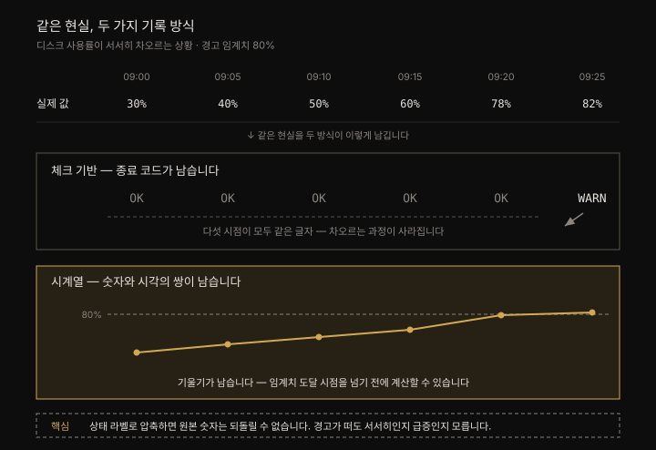
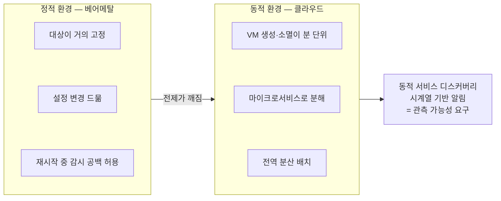
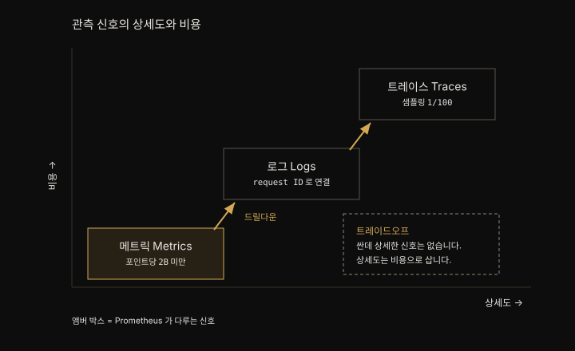
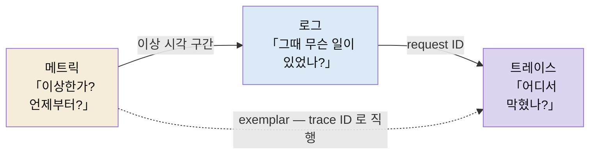
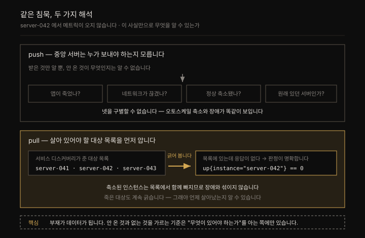
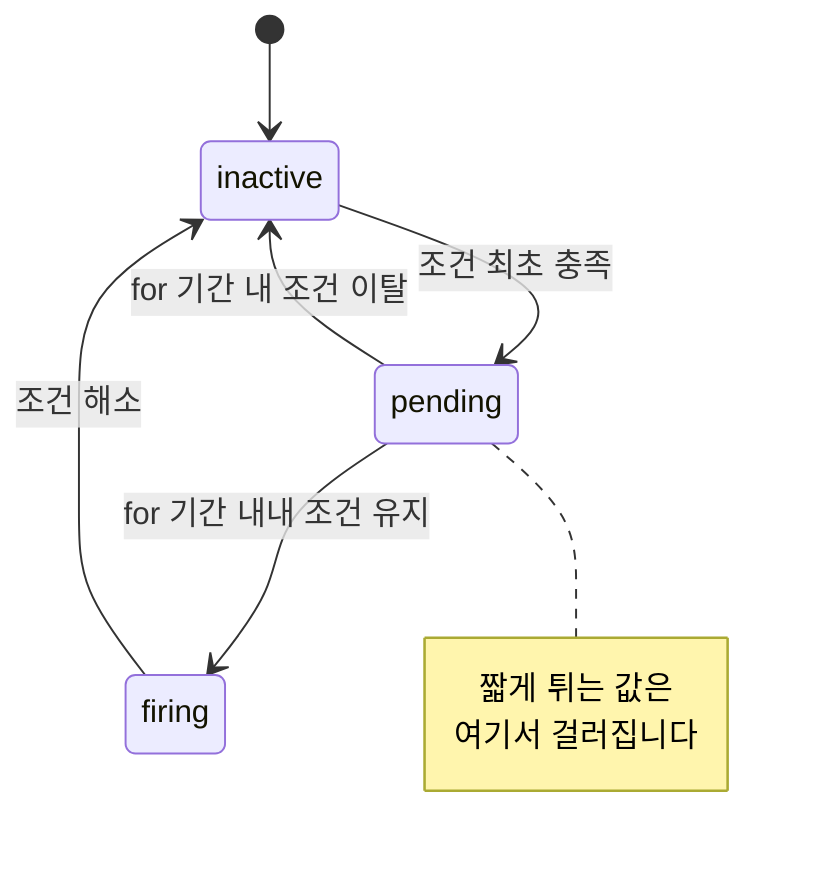

# 관측 가능성, 모니터링, 그리고 Prometheus

---


## 핵심 요약

> 이 장 전체가 매달린 하나의 생각은 **Prometheus 는 관측 가능성의 전부가 아니라 메트릭 한 축을 맡는 도구**라는 것, 그리고 그 경계를 알아야 도구를 제값에 쓴다는 사실입니다.
>
> 저자는 망치를 쥐면 모든 것이 못으로 보인다는 비유로 장을 엽니다. 나사와 못은 둘 다 그림을 걸 수 있고 망치로 나사를 박아 넣을 수도 있으나, 그렇다고 망치가 나사에 맞는 도구가 되지는 않습니다. Prometheus 로 관측 가능성의 모든 요구를 덮으려는 시도가 이 함정입니다.
>
> 그래서 장의 나머지는 경계를 긋는 데 쓰입니다. 모니터링의 역사(Nagios 의 체크 기반 사고)가 무엇을 못 했는지 보이고 관측 가능성이 그 결핍에서 어떻게 자랐는지 짚은 뒤, 신호 다섯 가지 가운데 Prometheus 가 정확히 어디에 서는지를 확정합니다.


## 학습 목표

> 이 장을 읽고 나면 아래 다섯 가지를 스스로 해낼 수 있습니다.

1. 체크 기반 모니터링(Nagios)과 시계열 기반 모니터링(Prometheus)의 철학 차이를 알려진 미지(known unknowns)라는 개념으로 설명할 수 있습니다.
2. 모니터링과 관측 가능성을 구분하고 왜 저자가 둘을 굳이 나누는지 그 실익을 말할 수 있습니다.
3. 메트릭·로그·트레이스와 신흥 신호(이벤트·프로파일)의 상세도와 비용 관계를 그림으로 그릴 수 있습니다.
4. 메트릭(metric)과 시계열(time series)의 차이를 라벨을 근거로 구분할 수 있습니다.
5. Prometheus 가 잘하는 일(알림·대시보드)과 하지 않는 일을 각각 근거를 들어 판단할 수 있습니다.


## 1. 체크 기반 모니터링과 그 전제

> 초기 모니터링은 종료 코드로 좋다·나쁘다만 판정했고, 내가 미리 상상한 고장(알려진 미지)에만 알림을 걸 수 있었습니다.

우리가 아는 모니터링은 1990년대 말에서 2000년대 초에 Nagios, Cacti, Zabbix 가 등장하며 자리를 잡았습니다. 그전에도 네트워크 감시에 초점을 둔 MRTG(Multi Router Traffic Grapher)와 그 파생인 rrdtool 이 있었지만 서버를 포함한 시스템 모니터링이 본궤도에 오른 것은 Nagios 부터입니다.

Nagios 는 **체크 기반(check-based)** 입니다. 간단한 로직을 담은 스크립트를 주면 종료 코드(exit code)를 보고 상태가 좋은지 나쁜지 아주 나쁜지를 알려줍니다. 이 철학이 초기 모니터링을 규정했고 그래서 초기 모니터링에는 뉘앙스도 상세함도 거의 없었습니다.

문제는 이 방식이 **알려진 미지(known unknowns)** 만 다룬다는 점입니다. 시스템이 어떻게 망가질지 미리 알고 그에 맞는 체크를 걸어 두는 방식이라, 메모리 사용률이 높으면 그 체크, CPU 가 높으면 그 체크, 프로세스가 죽으면 그 체크를 답니다. 저자는 이를 **원인 기반 알림(cause-based alerting)** 이라 부릅니다. 문제를 일으킬 것이라고 이미 아는 무언가에 알림을 거는 셈입니다.

> 💬 **비유**: 체크 기반 모니터링은 집을 나서며 확인하는 점검표와 같습니다. 가스 밸브를 잠갔는지, 창문을 닫았는지 항목마다 확인합니다. 그런데 점검표에 없는 사고(고양이가 어항을 엎는 일)는 영영 걸리지 않습니다. 점검표는 내가 상상한 사고만 잡아냅니다.

Nagios 계열이 가진 또 하나의 전제는 **감시 대상이 거의 고정돼 있다**는 가정이었습니다. 클라우드도 가상화도 흔치 않던 시절에는 서버를 사고 설치하는 일이 지금처럼 1분 만에 지구 반대편에 우분투 최신 릴리스를 띄우는 경험과 거리가 멀었습니다. 대상이 자주 바뀌지 않으니 동적 서비스 디스커버리 같은 기능이 필요 없었고 새 설정을 반영하려고 Nagios 가 완전히 재시작하는 동안 감시가 잠깐 끊겨도 견딜 만했습니다. 저자는 그 재시작이 오늘날까지도 여전하다고 덧붙입니다.

이 방식을 **원인 기반 알림(cause-based alerting)** 이라 부르는데, 이름이 성립하려면 반대편이 있어야 합니다. **증상 기반(symptom-based)** 입니다.

둘을 가르는 것은 **비대칭**입니다. 원인의 목록은 사실상 무한합니다 — 커넥션 풀 고갈·데드락·외부 API 지연·인증서 만료·DNS 오류·잘못된 배포까지, 미리 다 상상해 체크를 달 수 없습니다. 그런데 그 원인들이 **드러나는 창구는 유한**합니다. 사용자 눈에는 요청이 실패하거나 느려지는 것으로만 나타납니다. 그래서 증상 쪽에 알림을 걸면 **원인을 미리 상상하지 않아도** 걸립니다. 위에서 말한 "알려진 미지"의 한계를 넘는 방법이 이것입니다.

CPU·메모리·디스크가 전부 초록불인데 사용자는 서비스를 못 쓰는 상황이 그 차이를 드러냅니다. 원인 쪽 체크는 전부 통과했는데 증상 쪽은 이미 무너져 있는 경우입니다.

⚠️ 다만 증상 기반이 원인 기반을 **대체하지는 않습니다.** 디스크가 차오르는 것은 사용자가 아직 아무 영향도 못 느낄 때 미리 잡아야 합니다. 실무에서는 **증상엔 호출(page), 원인엔 티켓·경고**로 나눕니다. Golden Signals·RED·USE 같은 신호 모델은 [01-03. 시그널 모델](../../01_Foundations/01-03.시그널%20모델%20—%20Golden%20Signals,%20RED,%20USE.md) 이 정본입니다.

### 두 번째 한계 — 과정이 소실됩니다

앞에서 본 한계가 "상상하지 못한 고장은 체크 항목 자체가 없다" 였다면, 한계가 하나 더 있습니다. **예상 안의 고장조차, 뜬 순간의 한 점만 알고 차오르는 과정을 모릅니다.**

디스크 사용률이 30 → 40 → 50 → 60% 로 오르는 중이고 경고 임계치가 80% 라고 해 봅니다. 이 구간에서 체크가 남기는 기록은 전부 `OK` 한 글자입니다. 30% 에서 정체한 서버와 60% 까지 치솟는 서버가 똑같은 흔적을 남깁니다. 그러다 80% 에 닿는 순간 경고가 뜨는데, 그 경고를 받은 사람이 아는 것은 "지금 80 을 넘었다" 뿐입니다. **어제부터 서서히 찬 것인지 방금 10분 만에 튄 것인지 구분할 수 없습니다.** 전자는 증설 계획을 세울 일이고 후자는 지금 당장 로그를 뒤져야 할 사고이니, 대응이 정반대로 갈리는 두 상황입니다.



원인은 **값을 상태 라벨로 압축하면서 원본이 버려진다**는 데 있습니다. `78.3` 이라는 숫자가 `WARNING` 으로 눌리고 나면 되돌릴 수 없습니다. 시계열은 숫자와 시각을 쌍으로 남기므로 기울기가 보존되고, 그래서 임계치를 넘기 *전에* 도달 시점을 계산할 수 있습니다. §1 의 알려진 미지가 *무엇을 감시할지* 의 한계라면 이쪽은 *어떻게 기록할지* 의 한계이며, 둘은 다른 축입니다.

기울기가 보존되면 **대응이 정반대로 갈립니다.** 같은 "80% 도달"이라도 둘은 다른 사건입니다.

| | 30%에서 서서히 오른 서버 | 10분 만에 60 → 80% 로 뛴 서버 |
|---|---|---|
| 무엇인가 | 용량이 모자라는 중 | 뭔가 터지는 중 |
| 할 일 | **증설 계획을 세울 일** | **지금 당장 로그를 뒤져야 할 사고** |

체크 기반은 둘 다 `WARNING` 한 글자로 눌러 이 구분을 지웁니다. 기울기를 남기면 도달 시점을 미리 계산할 수도 있는데, PromQL 의 `predict_linear()` 가 그 함수입니다.

```promql
predict_linear(node_filesystem_avail_bytes[6h], 4*3600) < 0   # 6시간 추세로 4시간 뒤를 예측
```

함수 상세는 [03-04. PromQL 기초](./03-04.PromQL%20기초.md), 알림 룰로 쓰는 법은 [05-02. 견고한 알림과 룰 단위 테스트](./05-02.견고한%20알림과%20룰%20단위%20테스트.md) 가 정본입니다.

> **단서 — Nagios 도 숫자를 남길 수는 있습니다.** 플러그인이 종료 코드 옆에 성능 데이터(perfdata)를 딸려 보내는 규약이 있습니다. 
>
> 다만 그 값의 저장과 그래프는 rrdtool 같은 외부 도구 몫이고, Nagios 코어의 상태 판정 자체는 여전히 종료 코드로 합니다. 숫자를 곁다리로 흘려보낼 수 있다는 것과 시계열을 1급 자료로 다룬다는 것은 다릅니다([Nagios — Performance Data](https://assets.nagios.com/downloads/nagioscore/docs/nagioscore/3/en/perfdata.html)).

Nagios 는 시스템을 "관측 가능"하게 만들지 않았습니다. 건강한지 망가졌는지만 감시했고 한동안은 그것으로 충분했습니다.


## 2. SNMP(Simple Network Management Protocol) 는 대체 대상이 아닙니다

> 네트워크 장비 감시의 기본은 지금도 SNMP 이고, Prometheus 는 그것을 대체하지 않고 exporter 로 흡수합니다.

Nagios 가 시스템 모니터링의 첫 대형 도구였다면 네트워크 모니터링 도구는 그보다 최소 10년 앞섭니다. SNMP(Simple Network Management Protocol)의 첫 RFC 는 1988년에 제출됐고 지금도 널리 쓰입니다.

원래 SNMP 는 네트워크 장비를 *감시*하기보다 *관리*하는 프로토콜로 설계됐습니다. 지금은 네트워크 모니터링과 거의 동의어가 되어, SNMP 의 M 이 monitoring 을 뜻한다고 오해하는 사람이 많을 정도입니다. 특정 인터페이스가 몇 개의 패킷을 처리했는지, 스위치 섀시 온도가 몇 도인지 같은 값을 읽는 데 씁니다.

여기서 오해를 하나 끊어야 합니다. **Prometheus 는 SNMP 의 대체재가 아닙니다.** 시중 네트워크 장비를 감시하는 기본 방식은 여전히 SNMP 이며 Prometheus 코어 팀이 직접 유지하는 가장 인기 있는 exporter 중 하나가 바로 SNMP exporter 입니다. 대체가 아니라 흡수에 가깝습니다.


## 3. 클라우드가 깨뜨린 전제

> 설정 반영을 위한 Nagios 재시작이 VM 을 새로 만드는 시간보다 길어지는 순간, 정적 환경을 전제한 도구는 확장을 멈춥니다.

2000년대에 Nagios 계열이 전성기를 누리는 동안 클라우드 컴퓨팅이라 부르게 될 지형이 만들어지고 있었습니다. Xen 과 KVM 같은 가상화 기술의 발전이 오늘날의 클라우드를 가능하게 했고 물리 하드웨어를 주문해 받는 리드 타임도 근처 데이터센터에 묶이는 제약도 사라졌습니다.

여기서 균열이 드러납니다. 엔지니어들은 **새 설정을 반영하려고 Nagios 를 재시작하는 시간이 가상 머신을 처음부터 새로 만드는 시간과 맞먹거나 더 길다**는 사실을 깨달았습니다. 확장이 될 리 없습니다.

시스템이 복잡해진 것도 겹칩니다. 모놀리스가 마이크로서비스로 쪼개지고 부하에 따라 서버가 생겼다 사라지면서 이 분산 시스템이 어떻게 동작하는지 더 잘 들여다볼 필요가 커졌습니다. 사이트가 정성껏 관리하는 단일 서버가 아니게 된 이상 HTTP 체크 하나로 사용자 경험이 괜찮은지 알 수 없습니다. 이제는 전체 백엔드에 걸친 오류율이 어떤지 알아야 하고 그걸 알고 나면 최근 배포 이후 그 값이 올랐는지 내렸는지 알고 싶어집니다. 저자의 표현대로 쥐에게 쿠키를 주면 우유를 달라고 하기 마련입니다.




## 4. 관측 가능성은 제어 이론에서 왔습니다

> 관측 가능성은 입력과 출력으로 내부 상태를 추론하는 능력이며, "세 기둥"을 다 갖춰도 관측 가능하지 않을 수 있습니다.

관측 가능성(observability)은 기술 고유의 단어가 아닙니다. 로봇공학이나 원자력공학 같은 물리 공학에 뿌리를 둔 **제어 이론(control theory)** 에서 온 말이며 본디 **입력과 출력을 관찰해 시스템의 건강 상태를 추론하는 능력**을 뜻합니다. 원자력공학에서는 우라늄과 물을 넣고 열과 증기를 받습니다. 소프트웨어에서는 최종 사용자와 API 호출을 넣고 API 가 동작하지 않는다는 Jira 티켓을 받습니다. 관측 가능성이 제 몫을 한다면 그 티켓은 받지 않기를 바랄 뿐입니다.

여기서 저자는 널리 퍼진 표현 하나를 정리합니다. **"관측 가능성의 세 기둥"이라는 용어는 이제 유행에서 밀려났습니다.** 이유가 분명합니다. 그 표현이 텔레메트리를 *모으는 행위* 를 그 행위의 *결과* 보다 위에 올려놓기 때문입니다. 세 기둥을 전부 갖추고도 관측 가능하지 않은 시스템은 얼마든지 있습니다.


## 5. 신호 다섯 가지와 그 값

> 상세함과 비용은 함께 움직입니다. 메트릭은 상세함을 내주고 효율을 얻었고 트레이스는 그 반대를 택했습니다.

메트릭·로그·트레이스가 흔히 말하는 셋이고 여기에 이벤트와 프로파일이 세력을 넓히고 있습니다.

### 메트릭

**메트릭**은 가장 기본이 되는 텔레메트리이며 대개 조직이 관측 여정에서 처음 손대는 신호입니다. 이유는 두 가지인데, 값이 싸고(Prometheus 에서 메트릭 데이터 포인트 하나는 평균 2바이트 미만을 차지합니다) 단순하기 때문입니다. 메트릭은 **하나 이상의 범위를 가진 데이터 포인트를 숫자와 시간으로 표현한 것**입니다. 시계열이 아닐 수도 있으나 관측·기록된 시점과 관계를 맺으므로 언제나 시간과 엮입니다.

메트릭이 중요한 이유가 하나 더 있습니다. 앞서 말한 **시계열 기반 알림의 핵심 재료**가 바로 메트릭이기 때문입니다. 이 연결이 §8 알림 절에서 `for` 기간 이야기로 이어집니다.

메트릭은 **통계로도 볼 수 있습니다.** 비즈니스 영역의 KPI 도 메트릭으로 측정합니다. 저자가 집필 시점의 SRE 흐름으로 꼽는 것이 시계열 메트릭을 통계로 다루는 접근입니다. 분포를 분석하고 z-score 를 계산해, 어떤 데이터 포인트가 얼마나 이상치인지 점수로 매겨 이상을 탐지하는 방식입니다.

메트릭과 시계열은 다릅니다. 저자는 객체지향의 비유를 씁니다. **메트릭은 기반 클래스이고 시계열은 그 인스턴스**입니다. 개별 시계열은 라벨(labels)이라 부르는 메타데이터로 서로를 구분합니다.

```promql
node_memory_MemFree_bytes

node_memory_MemFree_bytes{instance="server1.example.com"}
node_memory_MemFree_bytes{instance="server2.example.com"}
```

메트릭 이름은 그대로인데 중괄호 안 라벨이 다릅니다. 메트릭 하나에 수십, 수백, 수천 개의 시계열이 딸릴 수 있습니다. 이 숫자가 곧 카디널리티(cardinality) 문제로 이어지며 7장에서 다시 다룹니다.

메트릭의 한계는 상세함입니다. 상당수가 본성상 집계입니다. API 가 받은 요청 수를 세기는 해도 각 요청의 user-agent 헤더나 IP 주소가 무엇이었는지는 남기지 않습니다. **상세함을 내주고 질의·저장 효율을 받는 거래**입니다.

Prometheus 에 한정하면 메트릭은 곁가지가 아니라 **주 관심 신호**입니다. Prometheus 자체가 숫자 시계열을 효율적으로 저장하려는 목적으로 만들어진 시계열 데이터베이스이기 때문입니다.

### 로그

**로그**는 가장 오래된 신호입니다. 정의부터 잡으면, 로그란 **무언가 일어났다는 기록을 남기려고 시스템이 뱉는 모든 텍스트 조각**입니다. 터미널 화면이 있기 전부터 컴퓨터는 로그 줄을 인쇄했습니다. 구현이 가장 쉽고 급할 때 손이 먼저 갑니다. 디버거 대신 `printf` 를 쓴 기억은 누구에게나 있습니다.

문제는 본성상 구조가 없다는 점입니다. 로그는 기계가 아니라 사람이 읽으라고 쓰기 때문입니다. 저자의 예시가 이 성질을 정확히 찌릅니다. 사람은 납작하게 눌린 JSON 을 읽고 싶어 하지 않으며, 그보다는 이런 줄을 남길 가능성이 훨씬 높습니다.

```
HEY!!! LOOK AT ME!! ERROR: <stacktrace>
```

그래서 로그는 의미 있는 값을 뽑아내기 가장 어려운 신호가 되기도 합니다. Apache·Nginx 접근 로그처럼 일정한 형식을 지키는 부류도 있지만 대부분의 로깅은 형식이 제각각입니다.

관측 가능성 관점에서 로그의 가치를 끌어올리려면 **구조화(structured)** 해야 합니다. 예측 가능한 형식을 따른다는 뜻이며 많은 사람에게 그것은 JSON 이고 Go 진영에서는 흔히 logfmt 입니다. Prometheus 자신이 logfmt 를 씁니다. 형식이 예측 가능해야 로그 줄에서 키/값 쌍을 뽑아낼 수 있고 그 키/값 쌍을 차원 삼아 집계해야 추세와 이상을 찾습니다.

```logfmt
ts=2023-06-14T03:00:06.215Z caller=head.go:1191 level=info component=tsdb msg="WAL ..."
```

### 트레이스

**트레이스**는 조직이 가장 늦게 도입하는 신호입니다. 왜곡이 가장 적은 대신 구현이 가장 번거롭습니다. 애플리케이션 트레이스는 내가 관심 있는 함수나 코드 경로 단계만 추적하는 일종의 맞춤 스택 트레이스이며 하나의 트레이스는 개별 작업 단위인 **스팬(span)** 여럿으로 이뤄집니다. 여러 시스템을 지나면서 같은 trace ID 를 유지하는 트레이스를 **분산 트레이스**라 부릅니다. 공용 로드 밸런서에 요청이 닿은 순간부터 열두 번째 마이크로서비스를 거쳐 데이터베이스에 닿기까지를 따라갈 수 있으니, SRE 에게는 꿈 같은 이야기입니다.

대가가 따릅니다. 트레이싱은 비쌉니다. 트레이스를 만드는 오버헤드, 상세한 데이터를 저장하고 조회하는 비용, 트레이싱 인프라 자체를 운영하는 비용이 모두 듭니다. 그래서 트레이스는 **샘플링**합니다. 저자는 프로덕션 애플리케이션에서 100건당 1건(1/100) 정도를 흔히 봤다고 적습니다. 이론적으로는 실패한 99건을 놓치고 성공한 1건만 보게 될 위험이 있고 그 반대도 마찬가지이나 실무에서는 대체로 통찰을 주기에 충분합니다.

### 이벤트

**이벤트**는 어떤 행위가 일어난 시점을 기록한 것입니다. Charity Majors 의 표현으로 이벤트는 "임의로 넓어야(arbitrarily wide)" 하며, 필요한 만큼 키/값 쌍을 많이 또는 적게 가질 수 있어야 합니다.

여기서 로그와 이어집니다. 저자는 **대부분의 회사가 가진 것 중 이벤트에 가장 가까운 것이 로그**라고 봅니다. 구조화 로그가 바로 그 "임의로 넓은" 요건을 충족하기 때문입니다. 이벤트는 전용 시스템일 수도, 데이터베이스 테이블 한둘일 수도 있습니다.

동시에 이벤트는 나머지 신호를 모두 품는 상위 신호로도 볼 수 있습니다. 한 레코드가 다음 셋을 함께 담기 때문입니다.

- 생성 시점의 서버 메모리·CPU 사용률 — 메트릭
- 요청이 진행되는 동안 발생한 로그 — 로그
- 고유 요청 ID 나 trace ID — 트레이스로 가는 다리

저자는 집필 시점 기준 이벤트를 위한 훌륭한 오픈소스 도구는 자기가 아는 한 없다고 적습니다. Honeycomb·New Relic 같은 SaaS 벤더가 이 데이터 타입을 정의하고 지원하는 일을 이끌고 있습니다.

### 프로파일

**프로파일**은 오래된 개발자 도구였습니다. kprobes 는 2005년 무렵부터 리눅스 메인라인 커널에 있었습니다. 다만 프로파일링은 침습적이고 흐름을 끊는 작업이라 필요할 때만 썼습니다. 20년 가까이 지난 지금은 컴퓨팅의 발전 덕에 **연속 프로파일링(continuous profiling)** 이 가능해졌고, 2020년 이후 관련 기술이 쏟아졌습니다.

프로파일링 데이터는 트레이스와 닮았습니다. 프로파일링이 스택 트레이스를 뜨는 일이고 애플리케이션 트레이스도 스택 트레이스와 비슷하니 당연한 결과입니다. 시각화도 플레임 그래프로 같고 저장 방식도 비슷합니다.

이벤트와 달리 오픈소스 도구는 여럿 있습니다. Polar Signals 의 Parca 가 그중 하나이며, 이 회사는 Prometheus·Thanos 등에 오래 기여한 코어 컨트리뷰터가 세웠습니다. Pyroscope 는 Grafana Labs 에 인수됐습니다.

이 다섯을 한 장에 놓으면 축이 보입니다.



- 오른쪽 아래가 비어 있는 것이 핵심입니다. 상세하면서 값싼 신호는 없습니다. 메트릭은 상세함을 내주고 효율을 얻었고 트레이스는 그 반대를 택했습니다.


## 6. 신호는 서로를 딛고 섭니다

> 메트릭 → 로그 → 트레이스 순으로 파고들며, 각 신호가 다음 신호를 더 좁은 표적으로 겨누게 합니다.

관측 가능한 시스템은 한 시점에서만 관측될 수 없습니다. 저자의 비유가 좋습니다. 화면 정면 90도에서만 보이는 모니터는 팔리지 않습니다. 로그에 전부를 걸고 메트릭과 트레이스를 버리면 관측에 구멍과 비효율이 남으며 어느 한 신호에 몰아도 마찬가지입니다.

저자는 신호 사이 관계를 **문제로 파고드는 깊이의 단계**로 봅니다. 

1. **메트릭**에서 시작합니다. 추세를 보여주고 이상이 생기면 알려주기 때문입니다. 다음으로 그 시스템의 로그를 봅니다. 
2. **로그**에 고유 요청 ID 가 붙어 있다면 그 ID 로 개별 요청의 트레이스로 건너뛰어 어디서 문제가 났는지 봅니다. 
3. 거기서 얻은 상세한 **트레이스** 데이터로 "실패한 요청은 전부 이 로드 밸런서를 지났다" 같은 추세를 다시 확인합니다. 각 신호가 다음 신호를 더 좁은 표적으로 파고들게 해 줍니다.

### 메트릭이 답하지 못하는 질문은 "왜" 입니다

§5 는 메트릭이 각 요청의 user-agent 나 IP 를 남기지 않는다는 *사실* 을 적습니다. 이 사실이 실무에서 어떤 벽으로 나타나는지 한 걸음 더 옮기면 이렇습니다. 메트릭은 **"이상한가, 언제부터인가"** 까지 데려다주고 거기서 멈춥니다.

`node_filesystem_avail_bytes` 는 디스크가 얼마나 찼는지 알려주지만 **무엇이 채웠는지** 는 담고 있지 않습니다. `http_requests_total` 이 분당 5000 이라는 사실은 알아도 그 5000 건이 어느 IP 에서 왔는지, 어떤 요청이 실패했는지는 없습니다. 처음부터 집계된 값이기 때문입니다. 개별 사건의 얼굴은 집계되는 순간 지워집니다.

그래서 이 장의 결론이 성립합니다. Prometheus 를 깔아도 시스템이 저절로 관측 가능해지지 않습니다. 메트릭은 "이상하다" 까지만 책임지고 **"왜" 는 로그와 트레이스가 답합니다.** §6 의 드릴다운이 필요한 이유가 여기 있습니다.



각 신호가 다음 신호의 표적을 좁혀 줍니다. 이 순서를 건너뛰고 트레이스부터 보면 안 되는 이유가 §5 의 샘플링에 있습니다. 트레이스는 100 건당 1 건꼴로 표본을 뜨므로 **"오류율이 올랐나" 같은 전수 판정에는 쓸 수 없습니다.** 그 질문은 전수 집계된 메트릭이 답하고, 트레이스는 이미 문제가 있다고 아는 구간에서 한 건을 해부하는 데 씁니다.

Prometheus 에도 이 다리가 있습니다. **exemplar** 는 시계열 데이터 포인트에 trace ID 를 붙이는 비교적 새로운 기능이며 그래프에서 값이 튄 시점 근처의 트레이스로 곧장 건너뛰게 해 줍니다.


## 7. Pull 이 만드는 차이

> Prometheus 는 감시 대상 목록을 스스로 알기 때문에, 수집이 실패했다는 사실 자체를 신호로 쓸 수 있습니다.

Prometheus 를 Graphite 나 (passive check 를 쓸 때의) Nagios 를 비롯한 대다수 모니터링 시스템과 가르는 핵심 특징 하나는 **감시 대상에서 데이터를 끌어오는 pull 모델**을 쓴다는 점입니다. 메트릭을 목적지로 밀어 넣는 push 모델과 대비됩니다.

> **passive check 는 "수동"이 아닙니다.** Nagios 의 active check 는 Nagios 가 스스로 스케줄해 플러그인을 실행하는 방식이고, passive check 는 **외부 애플리케이션이 결과를 Nagios 의 외부 명령 파일에 밀어 넣는** 방식입니다. 
>
> 즉 passive check 가 곧 push 이며, 그래서 이 절의 pull·push 대비에 Nagios 가 등장합니다([Nagios 문서 — Passive Checks](http://nagios.manubulon.com/traduction/docs14en/passivechecks.html)).

pull 이 주는 큰 이점은 **Prometheus 가 자기가 무엇을 감시해야 하는지 알고 있다**는 것입니다. 그래서 감시 대상에 문제가 생기면 그 사실 자체를 알려줄 수 있습니다. push 기반에서는 메트릭 값이 얼마인지뿐 아니라 그 값이 얼마나 최근에 갱신됐는지까지 따로 추적해야 하므로, pull 모델에서는 **조용한 실패(silent failure)** 가 훨씬 덜 일어납니다.

그 "알려줄 수 있다"의 실물이 **`up` 메트릭**입니다. Prometheus 는 스크레이프마다 성공이면 1, 실패면 0 을 자동으로 기록합니다. **부재가 데이터가 되는 것**이 기전의 핵심입니다.

```promql
up{job="my-app", instance="server-042:8080"} == 0   # "있어야 하는데 응답이 없다"
```

push 모델의 진짜 어려움은 **"안 오는 것"과 "없는 것"을 구별할 수 없다**는 데 있습니다. 중앙 서버는 누가 보내야 하는지를 모르기 때문입니다.

```text
server-042 에서 메트릭이 안 온다 → 앱이 죽었나 / 네트워크가 끊겼나 /
                                   오토스케일로 정상 축소됐나 / 애초에 그런 서버가 있었나?
```



- 오토스케일 환경에서 **정상 축소된 인스턴스와 죽은 인스턴스가 똑같이 보인다**는 것이 이 구별 불가를 가장 잘 드러냅니다. 
- pull 은 서비스 디스커버리로 "지금 살아 있어야 하는 대상"을 알기에 판정이 명확합니다(대상 목록을 어떻게 얻는지는 [04-01. 서비스 디스커버리와 relabeling](./04-01.서비스%20디스커버리와%20relabeling.md) 이 다룹니다).

죽은 대상을 계속 긁는 것이 낭비처럼 보이지만 **회복 감지의 필수 조건**입니다. 긁기를 멈추면 그 대상이 언제 살아났는지 알 방법이 없습니다. 실패한 대상에도 계속 신호를 보내야 복귀를 알 수 있다는 구조는 쿠버네티스의 readiness probe 에서도 같습니다 — 명단에서 빠진 파드에도 kubelet 이 probe 를 계속 보내는 이유가 그것입니다.

⚠️ pull 에도 대가가 있습니다. 한 서버가 모든 대상을 긁으므로 대상이 늘면 그 서버가 병목이 됩니다. 샤딩과 페더레이션으로 나누는 방법은 [06-01. 샤딩·페더레이션·고가용성](./06-01.샤딩·페더레이션·고가용성.md) 이 정본입니다.


## 8. Prometheus의 자리 — 알림과 대시보드

> 메트릭 한 축에만 외곬으로 집중하는 것이 Prometheus 의 강점이자 약점이며, 그 자리가 알림과 대시보드입니다.

Prometheus 하나로 시스템을 완전히 관측 가능하게 만들 수 있을까요. 저자의 답은 아니오입니다. **Prometheus 의 강점이 곧 약점입니다. 메트릭 한 가지에만 외곬으로 집중하기 때문입니다.** 다른 신호와 상호작용하는 지점이 있다면 그것은 다른 목적의 시스템으로 건너가는 링크나 다리를 놓아 주는 정도입니다.

그럼에도 Prometheus 는 수집할 수 있는 데이터 가운데 가치가 높은 축을 제공합니다. 로깅·트레이싱 시스템이 더 상세한 데이터를 줄 수는 있으나, 그 데이터로 추세를 분석하려면 상세함을 벗겨내 집계해야 합니다. 알림과 대시보드에서 Prometheus 가 최선의 선택이 되는 이유입니다.

### 알림 

**알림**에서 Prometheus 가 빛납니다. 알림은 관측 가능성보다 모니터링 쪽에 가까운 일이지만 둘은 떼어놓을 수 없습니다. 시스템이 관측 가능할수록 모니터링도 좋아지기 때문입니다. 

저자가 Nagios 와 비교하며 첫 번째로 꼽는 대비가 알림 품질이며 그 killer feature 는 뜻밖에도 단순합니다. 바로 알림에 **`for` 기간(duration)** 을 지정하는 능력입니다. 알림이 pending 에서 firing 으로 넘어가려면 그 `for` 기간 내내 조건을 일관되게 만족해야 합니다.

Nagios 계열에도 hard/soft 상태와 체크 재시도라는 개념이 있으나 체크 타이밍의 운은 여전히 남습니다. 하필 5분마다 도는 CPU 체크가 짧게 튀는 cron 작업과 겹칠 수 있습니다. Prometheus 라면 5분보다 훨씬 잦게 메트릭을 받으므로 더 촘촘한 데이터가 더 정확한 그림을 만들고 그 결과 알림이 덜 튀고 덜 시끄러워집니다. 알림 피로가 줄고 신뢰성이 오릅니다.



### 대시보드

**대시보드**는 사람들이 관측 가능성 하면 가장 먼저 떠올리는 것입니다. "관측 가능한 시스템이란 오르내리는 선을 잔뜩 볼 수 있는 시스템"이라는 식입니다.

대시보드를 옮겨 다니며 원인을 찾는 방식이 이상적인 관측이 아니라는 비판은 많습니다. 그럼에도 대시보드는 경영진·SRE·개발자 모두가 아끼는 자식입니다. 데이터만 있으면 단순하고 직관적이며 세팅도 쉽기 때문입니다.

Prometheus 는 가장 널리 쓰이는 오픈소스 대시보드 도구인 Grafana 에서 **가장 많이 쓰이는 데이터 소스 플러그인**입니다. 요청 단위가 아니라 집계된 데이터를 다루기에 로그나 트레이스보다 고수준이고, 그래서 그래프와 대시보드에 가장 쓸모 있는 소스가 됩니다.

마지막으로 저자는 Prometheus 가 **아닌** 것을 못 박습니다.

- Prometheus 는 올인원 모니터링 솔루션이 아닙니다.
- Prometheus 는 한 번 설정하고 잊어버리는 물건이 아닙니다.
- Prometheus 가 시스템을 저절로 관측 가능하게 만들어 주지 않습니다.

텔레메트리 신호 가운데 시스템을 가장 상세히 보여주는 쪽을 따지면 메트릭은 가장 덜 구체적입니다. 그렇다고 Prometheus 를 돌릴 값어치가 없느냐 하면 그렇지 않고 트레이싱에 전부를 걸고 나머지를 버려야 하느냐 하면 그것도 아닙니다. 메트릭은 모니터링의 중심축이며 특히 커스텀 계측(custom instrumentation)과 만나면 시스템을 더 관측 가능하게 만드는 데 기여합니다.


## 책 밖으로 잇기

> 이 장의 개념을 상위 카테고리 노트·다른 편·공식 문서로 잇습니다. 본문 절의 논리를 이어받는 보론은 각 절 안으로 옮겼습니다.

**"세 기둥" 대신 무엇을 말하는가.** 저자는 용어가 유행에서 밀려난 이유만 짧게 적고 넘어갑니다. 대안 프레임은 이 저장소에 이미 있습니다. 무엇을 재는지를 신호 종류가 아니라 *증상* 으로 규정하는 [01-03. 시그널 모델](../../01_Foundations/01-03.시그널%20모델%20—%20Golden%20Signals,%20RED,%20USE.md) 이 그것입니다. 이 장의 "세 기둥을 다 갖춰도 관측 가능하지 않을 수 있다"는 경고와 정확히 같은 축에 섭니다.

**exemplar 는 형식을 탄다.** 본문은 exemplar 가 시계열 포인트에 trace ID 를 붙인다는 사실만 말합니다. 실제로 켜려면 조건이 넷 붙습니다.

| 조건 | 내용 |
|------|------|
| Prometheus 버전 | 2.26 이상 |
| 기동 플래그 | `--enable-feature=exemplar-storage` |
| 노출 형식 | **OpenMetrics**(`application/openmetrics-text`). 다만 강제 수준은 경로마다 다릅니다 — 아래 단서 참고 |
| 대상 메트릭 타입 | 주로 counter·histogram |

저장은 메모리상 고정 크기 원형 버퍼로 구현됩니다. 버퍼 크기는 **기동 플래그가 아니라 설정 파일**로 조정합니다. `prometheus.yml` 의 `storage:` → `exemplars:` 블록에 두는 YAML 키이며, `--storage.exemplars.max-exemplars` 같은 CLI 플래그는 존재하지 않습니다.

```yaml
# prometheus.yml — 플래그가 아니라 config 파일 블록입니다
storage:
  exemplars:
    max_exemplars: 100000
```

> **OpenMetrics 조건의 강도에 주의합니다.** Spring Boot 문서는 "it is only supported using the OpenMetrics format" 이라고 단정하지만, Prometheus 의 feature flags 문서는 OpenMetrics 를 도입 맥락으로 언급할 뿐 필수라고 못박지 않습니다. 위 표는 **Spring 경로 기준**으로 읽고, Prometheus 일반론으로 확대하지 않습니다.

규격은 [OpenMetrics 명세](https://github.com/OpenObservability/OpenMetrics/blob/main/specification/OpenMetrics.md)와 [Prometheus feature flags](https://prometheus.io/docs/prometheus/latest/feature_flags/#exemplars-storage) 에 있습니다. 이 제약은 아래 Spring 절에서 다시 걸립니다.

**로그 쪽 대비.** 이 장은 구조화 로그의 값어치를 키/값 추출과 집계 차원으로 설명합니다. 같은 논리를 저장소 설계로 밀고 나간 것이 Loki 의 라벨 기반 최소 인덱싱이며 이 저장소의 [02-03. Grafana Loki](../../02_LGTMStack/02-03.Grafana%20Loki.md) 가 다룹니다. 로그를 "K/V 를 뽑을 수 있는 구조"로 보는 시각이 왜 인덱싱 전략까지 바꾸는지 두 문서를 나란히 읽으면 이어집니다.

**이 책이 이어서 갈 곳.** 신호를 잇는 이야기(exemplar·OpenTelemetry)는 14장에서, Prometheus 의 보존·확장 한계를 메우는 이야기는 9·10장에서 본격화합니다. 후자는 상위 [06_observability README](../../README.md) 의 "예정 주제 — 관측 저장소 심화" 가 예고한 Thanos 대비와 맞물립니다.

**원문의 더 읽을거리.** 이 장이 유일하게 건 링크는 Stripe 의 canonical log lines 글이며 이벤트를 "임의로 넓은 한 줄"로 구현한 실무 사례입니다([Fast and flexible observability with canonical log lines](https://stripe.com/blog/canonical-log-lines)).


## 결정 치트시트

> 이 장이 남기는 판단 기준을 표로 압축합니다.

| 상황 | 선택 | 이유 |
|------|------|------|
| 미리 아는 방식으로 고장 나는 정적 장비를 감시 | 체크 기반(Nagios) 또는 SNMP | 알려진 미지에 원인 기반 알림이 맞고 네트워크 장비는 여전히 SNMP 가 표준 |
| 대상이 분 단위로 생겼다 사라지는 환경 | Prometheus 계열 | 동적 서비스 디스커버리와 잦은 수집 주기가 전제 |
| 추세 파악·알림·대시보드 | 메트릭 | 값이 싸고(포인트당 2바이트 미만) 집계라 고수준 판단에 적합 |
| 개별 요청에서 무슨 일이 있었는지 확인 | 트레이스 | 상세도가 가장 높음. 대신 비용과 샘플링을 감수 |
| 오류율이 올랐는지 판정 | 트레이스가 아니라 메트릭 | 트레이스는 100건당 1건꼴 표본이라 전수 판정에 못 씀. 트레이스는 이미 아는 구간의 해부용 |
| 개별 요청의 맥락을 사람이 읽어야 함 | 구조화 로그 | K/V 추출이 가능해야 집계 차원으로 쓸 수 있음 |
| 그래프가 튄 시점의 요청을 곧장 보고 싶음 | exemplar | 메트릭 포인트에 trace ID 를 붙여 신호 사이 다리를 놓음 |
| 짧게 튀는 값 때문에 알림이 시끄러움 | `for` 기간 지정 | pending 상태에서 걸러 firing 으로 승격하지 않음 |
| "Prometheus 를 깔면 관측 가능해지나" | 아니오 | 메트릭 한 축만 담당. 로그·트레이스는 별도 시스템 |


## Spring 앱 개발 관점

> 이 장에는 Spring 예제가 없습니다. 아래는 이 장의 개념(pull 모델·메트릭 신호·exemplar)이 Spring Boot 에서 어디에 대응하는지를 **공식 문서로 보강**한 내용이며 사실은 Spring Boot 3.5 레퍼런스에서 확인했습니다.

이 장의 pull 모델은 Spring 앱 입장에서 "내가 메트릭을 어디론가 밀어 넣는 게 아니라, 긁어갈 수 있게 열어 둔다"로 번역됩니다. 그 창구가 Actuator 의 `/actuator/prometheus` 엔드포인트입니다.

이 엔드포인트에는 조건이 둘 붙습니다.

- `micrometer-registry-prometheus` 의존성이 클래스패스에 있어야 합니다.
- **기본으로는 열려 있지 않아** 명시적으로 노출해야 합니다. 공식 문서도 "By default, the endpoint is not available and must be exposed" 라고 못박습니다.

출처는 [Actuator Endpoints](https://docs.spring.io/spring-boot/3.5/reference/actuator/endpoints.html) 와 [Actuator Metrics — Prometheus](https://docs.spring.io/spring-boot/3.5/reference/actuator/metrics.html) 입니다.

```groovy
// build.gradle — Actuator 는 엔드포인트를, 레지스트리는 Prometheus 노출 형식을 담당합니다
implementation 'org.springframework.boot:spring-boot-starter-actuator'
implementation 'io.micrometer:micrometer-registry-prometheus'
```

```yaml
# application.yml — prometheus 엔드포인트는 기본 비노출이라 직접 열어 줍니다
management:
  endpoints:
    web:
      exposure:
        include: health,prometheus   # "*" 로 전부 여는 것은 방화벽·인증이 있을 때만
```

여기서 이 장의 개념이 그대로 살아납니다. Prometheus 서버가 이 경로를 주기적으로 긁어 가므로 **앱이 죽으면 스크레이프 실패 자체가 신호가 됩니다.** push 모델이라면 "메트릭이 안 오는 것"과 "앱이 죽은 것"을 앱 밖에서 따로 구분해야 하는데, pull 모델에서는 Prometheus 가 감시 대상 목록을 알고 있으므로 조용한 실패가 줄어듭니다.

exemplar 는 조건이 붙습니다. 본문에서 본 대로 exemplar 는 메트릭 포인트에 trace ID 를 붙이는 기능인데, Spring Boot 에서 이를 쓰려면 **`SpanContext` 빈이 있어야 하고 노출 형식이 OpenMetrics 여야 합니다**(같은 Actuator Metrics 문서).

다만 이 빈을 손으로 만들 일은 드뭅니다. **Micrometer Tracing 을 쓰면 `SpanContext` 가 자동 구성됩니다.** 트레이싱을 붙이지 않은 앱에서 exemplar 만 켜려는 시도가 실패하는 이유가 여기 있습니다. 메트릭과 트레이스를 잇는 다리이므로 양쪽 기둥이 다 서 있어야 합니다.

로그 쪽도 이 장의 논리를 따릅니다. Logback 기본 패턴은 사람이 읽기 좋은 한 줄이라 키/값 추출이 어렵습니다. 로그를 관측 신호로 쓰려면 JSON 같은 구조화 형식으로 바꿔 라벨·필드를 뽑을 수 있게 해야 하며 그 배경은 이 저장소의 [01-05. Logback 기초](../../01_Foundations/01-05.Logback%20기초.md) 에 있습니다.

정리하면 Spring 앱 하나가 이 장의 신호 셋에 대응하는 방식은 이렇습니다. 메트릭은 Micrometer 가 모아 Actuator 가 열어 주고 트레이스는 Micrometer Tracing 이 span 을 만들며 로그는 Logback 이 구조화해 내보냅니다. Prometheus 는 그중 첫 번째만 가져갑니다.


## 면접에서 받을 만한 질문

> 아래 질문에 **먼저 스스로 답해 보세요.** 자답이 끝나면 이어지는 §정답 (자답 후 펼치기) 으로 내려갑니다.

1. Prometheus 를 한 문장으로 정의한다면 어떻게 말하겠습니까?
2. 모니터링과 관측 가능성은 어떻게 다르며, 체크 기반 도구의 한계는 무엇입니까?
3. 메트릭과 시계열의 차이를 무엇을 근거로 구분합니까?
4. 로그·트레이스가 더 상세한데 왜 메트릭부터 봅니까?
5. `for` 기간이 왜 Nagios 대비 알림 품질을 가릅니까?
6. Prometheus 로 SNMP 장비 감시를 대체합니까?


## 정답 (자답 후 펼치기)

> 위 §면접에서 받을 만한 질문 의 6개에 *먼저 자답한 뒤* 아래를 읽으세요. 자답 없이 먼저 읽으면 학습 효과가 0 입니다. 질문 번호와 1:1 로 대응합니다.

### 정답 1 — 한 줄 정의

Prometheus 는 관측 가능성의 여러 신호 가운데 **메트릭만을 담당하는 시계열 데이터베이스**이며, pull 모델로 대상에서 메트릭을 끌어와 알림과 대시보드에 강점을 보입니다.

### 정답 2 — 모니터링 vs 관측 가능성

모니터링은 미리 정한 임계치를 넘는지 능동적으로 확인해 알리는 규율이고, 관측 가능성은 입력과 출력으로 내부 상태를 추론하는 능력입니다. 체크 기반 도구는 내가 상상한 고장(알려진 미지)만 잡습니다. 점검표에 없는 사고는 영영 걸리지 않는다는 점이 한계입니다.

### 정답 3 — 메트릭과 시계열

**라벨**을 근거로 구분합니다. 메트릭이 기반 클래스라면 시계열은 그 인스턴스입니다.

- 메트릭 — `node_memory_MemFree_bytes`
- 시계열 — `node_memory_MemFree_bytes{instance="server1.example.com"}` 처럼 라벨이 붙은 각각

메트릭 하나에 수천 개의 시계열이 딸릴 수 있습니다. 이 숫자가 곧 카디널리티 문제입니다.

### 정답 4 — 메트릭부터 보는 이유

상세도와 비용이 함께 움직이기 때문입니다. 메트릭은 데이터 포인트 하나가 평균 2바이트 미만으로 싸고 집계되어 있어 추세와 이상을 먼저 드러냅니다. 이상을 감지한 뒤 로그로 요청 ID 를 잡고, 그 ID 로 트레이스에 들어가는 순서가 탐색 범위를 가장 빨리 좁힙니다.

### 정답 5 — `for` 기간과 알림 품질

조건을 한 번 만족했다고 알리지 않고, `for` 기간 내내 유지될 때만 firing 으로 올리기 때문입니다. Nagios 도 hard/soft 상태와 재시도가 있으나, 5분 주기 체크가 짧게 튀는 cron 작업과 겹치는 타이밍 운을 없애지는 못합니다. 수집 주기가 촘촘할수록 이 필터가 정확해집니다.

### 정답 6 — SNMP 대체 여부

대체가 아니라 흡수입니다. 네트워크 장비 감시의 기본은 여전히 SNMP 이며, Prometheus 코어 팀이 유지하는 SNMP exporter 가 그 값을 메트릭으로 옮겨 줍니다.


## 핵심 개념 체크리스트

> 위 §정답 을 덮고, 각 항목을 소리 내어 설명할 수 있는지 점검합니다. 막히는 자리가 이 장의 재학습 지점입니다.

- [ ] 체크 기반 모니터링이 "알려진 미지"만 다룬다는 말의 의미를 한 문장으로 설명할 수 있는가?
- [ ] 상태 라벨로 압축하면 무엇이 사라지는지, 그래서 경고를 받고도 무엇을 모르는지 말할 수 있는가?
- [ ] 클라우드가 Nagios 계열의 어떤 전제를 깨뜨렸는지 두 가지를 댈 수 있는가?
- [ ] 관측 가능성이 제어 이론에서 온 개념임을 입력·출력으로 설명할 수 있는가?
- [ ] "세 기둥" 용어가 밀려난 이유를 말할 수 있는가?
- [ ] 메트릭과 시계열의 관계를 라벨을 근거로 구분할 수 있는가?
- [ ] 메트릭·로그·트레이스의 상세도와 비용 관계를 그림으로 그릴 수 있는가?
- [ ] 드릴다운 순서(메트릭 → 로그 → 트레이스)와 그 사이를 잇는 exemplar 를 설명할 수 있는가?
- [ ] pull 모델이 조용한 실패를 줄이는 이유를 말할 수 있는가?
- [ ] `for` 기간이 pending 과 firing 을 가르는 방식을 설명할 수 있는가?
- [ ] Prometheus 가 아닌 것 세 가지를 댈 수 있는가?


## 참고 자료

> 원서 1장과, 본문의 사실을 대조한 1차 자료 목록입니다.

- 원본: *Mastering Prometheus* (Packt, ISBN 9781805125662) 1장 — Observability, Monitoring, and Prometheus. 예제 코드는 [PacktPublishing/Mastering-Prometheus](https://github.com/PacktPublishing/Mastering-Prometheus).
- 원문 더 읽을거리: [Fast and flexible observability with canonical log lines](https://stripe.com/blog/canonical-log-lines) (Stripe)
- [Prometheus — Feature flags: exemplars storage](https://prometheus.io/docs/prometheus/latest/feature_flags/#exemplars-storage)
- [OpenMetrics 명세](https://github.com/OpenObservability/OpenMetrics/blob/main/specification/OpenMetrics.md)
- [Spring Boot 3.5 — Actuator Endpoints](https://docs.spring.io/spring-boot/3.5/reference/actuator/endpoints.html) · [Actuator Metrics (Prometheus)](https://docs.spring.io/spring-boot/3.5/reference/actuator/metrics.html)
- [Jaeger](https://github.com/jaegertracing/jaeger) — 본문 그림 1.1 의 트레이스 시각화 도구
- [Nagios — Passive Checks](http://nagios.manubulon.com/traduction/docs14en/passivechecks.html) — §7 의 passive check = push 근거
- [Nagios — Performance Data](https://assets.nagios.com/downloads/nagioscore/docs/nagioscore/3/en/perfdata.html) — §1 의 perfdata 단서 근거


## 관련 문서

> 이 편은 관측 가능성의 좌표계를 세우고 그 안에서 Prometheus 의 자리를 확정합니다. 신호 모델의 대안 프레임은 상위 카테고리 노트로, 실제 배포와 데이터 모델은 다음 편으로 이어집니다.

- [README (책 MOC)](README.md) — 《Mastering Prometheus》 15장 전체 지도
- [02-01. Prometheus 배포 — 스택 구성요소와 Operator](./02-01.Prometheus%20배포%20—%20스택%20구성요소와%20Operator.md) — 다음 편(이 장에서 세운 자리를 실제로 띄우는 단계)
- [01-03. 시그널 모델 — Golden Signals, RED, USE](../../01_Foundations/01-03.시그널%20모델%20—%20Golden%20Signals,%20RED,%20USE.md) § "증상 기반 관측" — §4 "세 기둥" 비판의 대안 프레임
- [01-01. 모니터링](../../01_Foundations/01-01.모니터링.md) — 모니터링 규율 자체의 통합 개념본(개념 위임)
- [02-03. Grafana Loki](../../02_LGTMStack/02-03.Grafana%20Loki.md) — §5 구조화 로그 논리를 라벨 기반 인덱싱으로 밀고 나간 사례
- [15-01. Prometheus 너머 — 세 신호를 잇는 관측 가능성과 exemplar](./15-01.Prometheus%20너머%20—%20세%20신호를%20잇는%20관측%20가능성과%20exemplar.md) — §6 신호 연결과 exemplar 의 심화편


