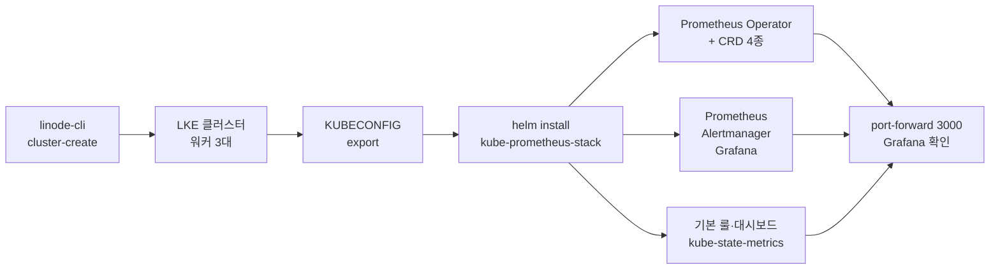

# 2. Prometheus 배포하기
---


## 핵심 요약

> 이 장 전체가 매달린 하나의 생각은 **"Prometheus 스택"이라 부르는 것이 사실은 역할을 나눠 가진 여러 프로세스의 모음**이라는 사실입니다. 그 경계를 알아야 무엇이 무엇을 못 하는지 압니다.
>
> Prometheus 자체는 네 부품(TSDB·스크레이프 매니저·룰 매니저·웹 UI/API)으로 이뤄지고 모두 TSDB 를 향합니다. 알림을 실제로 Slack 이나 PagerDuty 로 보내는 일은 Prometheus 가 하지 않고 Alertmanager 가 합니다. 시각화는 Grafana 가 맡고 시스템 메트릭은 Node Exporter 가 냅니다.
>
> 후반부는 이 스택을 쿠버네티스에 올립니다. Prometheus Operator 가 설정 파일 편집을 CRD 로 바꿔 놓고 kube-prometheus 가 그 위에 의견을 담은 기본값을 얹으며 Helm 차트가 그것을 한 번에 설치합니다.


## 학습 목표

> 이 장을 읽고 나면 아래 다섯 가지를 스스로 해낼 수 있습니다.

1. Prometheus 스택의 네 구성요소를 나열하고 각자의 책임 경계를 말할 수 있습니다.
2. Prometheus 내부 네 부품이 TSDB 를 중심으로 어떻게 맞물리는지 그림으로 설명할 수 있습니다.
3. Alertmanager 가 왜 별도 프로세스여야 하는지 근거를 들어 설명할 수 있습니다.
4. 단명 프로세스(배치·cron)의 메트릭을 textfile collector 로 거두는 방법과 Pushgateway 와의 선택 기준을 말할 수 있습니다.
5. Prometheus Operator 의 CRD 네 가지가 각각 무엇을 추상화하는지 구분할 수 있습니다.


## 본문 정리

> 구성요소를 먼저 갈라 보고 그다음 그것을 쿠버네티스에 올리는 순서를 따라갑니다.

### 1. "Prometheus" 는 대개 스택을 가리킵니다

사람들이 Prometheus 를 이야기할 때 Prometheus 프로젝트 하나만 뜻하는 경우는 드뭅니다. 보통 다음 넷을 묶어 부릅니다.

1. **Prometheus** — 메트릭 수집·저장·알림 룰 평가를 맡는 본체입니다.
2. **Alertmanager** — Prometheus 에서 나온 알림을 라우팅합니다.
3. **exporter 하나 이상** — Node Exporter 처럼 메트릭을 노출합니다.
4. **Grafana** — Prometheus 의 메트릭을 대시보드로 시각화합니다.

넷이 맞물려야 관측 가능성을 위한 완전한 메트릭 해법이 됩니다. 1장에서 Prometheus 가 메트릭 한 축만 담당한다고 못 박았다면, 이 장은 그 한 축 안에서도 책임이 다시 갈린다는 것을 보여줍니다.

### 2. Prometheus 내부 — 모든 것이 TSDB 를 돕니다

Prometheus 는 네 부품으로 이뤄집니다. **시계열 데이터베이스(TSDB)**, **스크레이프 매니저**, **룰 매니저**, 그리고 REST API 를 낀 **웹 UI** 입니다. 물론 다른 컴포넌트도 있지만 신경 쓸 것은 이 넷입니다.


**TSDB 가 Prometheus 를 규정하는 기능**입니다. TSDB 는 데이터 포인트를 시간 순으로 저장하도록 최적화된 특별한 데이터베이스이며 나머지 부품은 전부 이 TSDB 를 중심으로 돕니다. 스크레이프 매니저가 그 안에 데이터를 넣고 룰 매니저가 그 내용을 평가하며 웹 UI 가 그것을 임시(ad hoc) 질의로 꺼냅니다.

**스크레이프 매니저**는 애플리케이션과 exporter 에서 메트릭을 끌어오는 일을 맡습니다. 실제로 긁어오는 동작과, 무엇을 긁어야 하는지에 대한 내부 목록을 유지하는 일을 함께 합니다. "스크레이프(scrape)"는 메트릭을 수집한다는 뜻의 Prometheus 용어이며 검색 엔진이 웹사이트에서 데이터를 자동으로 뽑아내는 웹 스크레이핑과 개념이 같습니다. 이름이 그렇게 붙은 이유가 있습니다. **Prometheus 는 특별한 프로토콜이나 gRPC 가 아니라 HTTP 로 메트릭을 끌어오기 때문입니다.**

**룰 매니저**는 알림 룰과 레코딩 룰을 평가합니다. 둘의 차이가 중요합니다.

- **레코딩 룰**은 정해진 주기마다 새 메트릭을 만들어 내는 질의입니다. 대개 집계로 만듭니다.
- **알림 룰**은 임계치가 붙은 질의입니다. 무언가 잘못되어 알림을 보내야 할 때만 데이터를 돌려주도록 씁니다.

룰 매니저는 알림 룰과 레코딩 룰로 구성된 **룰 그룹**을 일정 주기마다 평가하며 주기는 룰 그룹별로 지정하거나 전역 기본값을 따릅니다. 그리고 보내야 할 알림을 Alertmanager 로 넘기는 책임도 여기 있습니다.

**웹 UI** 는 브라우저로 접근하는 부분입니다. 실행 중인 설정(명령줄 플래그 값 포함), TSDB 정보, 그리고 PromQL 질의를 즉석에서 던져 볼 수 있는 간단한 질의 화면을 줍니다. 이 웹 UI 는 **Prometheus REST API** 위에서 돕니다. 그 API 덕분에 Grafana 같은 다른 프로그램이 메트릭을 질의하고 감시 대상을 표시하는 표준 경로를 얻습니다.

### 3. Alertmanager 는 왜 밖에 있습니까

Alertmanager 는 스택에서 자주 간과됩니다. Prometheus 에 익숙하지 않은 사람은 Prometheus 자신이 Slack 이나 PagerDuty 로 알림을 보낸다고 짐작하기 때문입니다.

실제로는 그 일을 전부 Alertmanager 가 **라우팅 트리 기반 워크플로**로 처리합니다. Prometheus 는 알림 룰을 평가하고 알림 페이로드를 Alertmanager 에 보내는 데까지만 책임집니다. 그 알림을 진짜 목적지로 보내는 쪽은 Alertmanager 입니다.

여기서 실무적으로 중요한 결론이 하나 나옵니다. **Prometheus 에서 알림 기능을 쓰려면 Alertmanager 가 반드시 필요합니다.** Prometheus 만 띄워 놓고 알림이 오기를 기다리면 아무 일도 일어나지 않습니다.

> 💬 **비유**: Prometheus 는 화재감지기이고 Alertmanager 는 관제실입니다. 감지기는 연기를 감지해 신호를 올릴 뿐이며 그 신호를 누구에게 어떤 순서로 전화할지 정하는 일은 관제실 몫입니다. 감지기만 사 놓고 소방서에 연락이 가기를 기다릴 수는 없습니다.

### 4. Node Exporter 와 단명 프로세스 문제

Node Exporter 는 가장 널리 쓰이는 exporter 이며 시스템 메트릭에 필요한 것을 거의 다 덮습니다. CPU·RAM·디스크·네트워크 I/O 를 비롯해 수많은 메트릭을 냅니다. 사실상 리눅스의 `/proc` 유사 파일시스템에 있는 거의 모든 것이 Node Exporter 로 노출되거나, 프로젝트에 PR 을 넣어 노출할 수 있습니다.

데이터 양이 상당해질 수 있으니 Node Exporter 의 collector 상당수는 기본으로 꺼져 있고 명령줄 플래그로 켜야 합니다. 흔히 신경 쓰는 collector(CPU·디스크 등)는 기본으로 켜져 있습니다. 저자는 자기 경험상 추가로 설정하는 플래그가 systemd collector 활성화와 textfile collector 디렉토리 지정 둘뿐이라고 적습니다. 기본 활성/비활성 목록은 프로젝트 GitHub 의 README 나 `node_exporter --help` 출력에서 확인합니다.

> ⚠️ Node Exporter 는 리눅스·BSD·macOS 계열용으로만 설계됐습니다. 윈도우는 [windows_exporter](https://github.com/prometheus-community/windows_exporter) 를 씁니다.

**textfile collector** 는 따로 볼 값어치가 있습니다. Prometheus 를 두고 흔히 나오는 질문이 "단명 프로세스와 배치 작업은 어떻게 감시합니까"인데, 답이 두 가지입니다. textfile collector 와 Pushgateway 이며 **저자는 대체로 textfile collector 를 권합니다.**

textfile collector 는 기본으로 켜져 있지만 `--collector.textfile.directory` 플래그로 디렉토리를 지정해야 동작합니다. 디렉토리를 지정하면 Node Exporter 가 그 안의 `.prom` 확장자 파일을 자동으로 읽어, 형식만 맞다면 `/proc` 에서 내는 평소 메트릭과 나란히 포함시킵니다.

```bash
# cron 같은 단명 작업이 .prom 파일을 남기면 Node Exporter 가 다음 스크레이프에 함께 실어 보냅니다
node_exporter --collector.textfile.directory=/var/lib/node_exporter/textfile
```

왜 이 방식이 먹힐까요. 단명 프로세스는 Prometheus 가 긁으러 올 때쯤 이미 죽어 있기 때문에 pull 모델과 궁합이 맞지 않습니다. textfile collector 는 그 프로세스가 남긴 *파일* 을 오래 사는 Node Exporter 가 대신 노출하게 만들어, pull 모델을 깨지 않고 문제를 우회합니다.

### 5. Grafana 가 메우는 빈칸

Prometheus 웹 UI 는 즉석 질의에는 훌륭하지만 못 하는 일이 있습니다. 자주 쓰는 질의를 저장하지 못하고 변수를 치환해 질의를 재사용하지 못하며 PromQL 을 모르는 사람에게 데이터를 보여주지 못합니다.

Grafana 는 무엇보다 데이터 시각화 플랫폼입니다. 알림 같은 기능도 있으나 이 책은 다루지 않습니다. **Prometheus 는 Grafana 에서 가장 흔하게 쓰이는 데이터 소스 타입**이며 그래서 시계열 데이터를 시각화하는 내장 기능이 잘 갖춰져 있습니다.

### 6. 쿠버네티스 프로비저닝

저자는 Linode 의 관리형 쿠버네티스인 **LKE(Linode Kubernetes Engine)** 위에 Prometheus 를 올립니다. 같은 원리를 AKS·EKS·Minikube 같은 다른 환경에 그대로 옮길 수 있습니다. 필요한 도구는 `linode-cli`, `kubectl`, `helm` 셋입니다.

```bash
# 워커 노드 3대. 각 4GB 메모리 · 2 CPU 코어 · 80GB 디스크
linode-cli lke cluster-create \
  --label mastering-prometheus \
  --region us-southeast \
  --k8s_version 1.26 \
  --node_pools.type g6-standard-2 \
  --node_pools.count 3
```

클러스터가 뜨면 Kubeconfig 를 내려받아 권한을 좁히고 환경 변수로 지정합니다.

```bash
linode-cli lke clusters-list                       # 클러스터 ID 확인
linode-cli lke kubeconfig-view <cluster_id> --text | tail -1 | base64 -d > ~/.kube/config-mastering-prometheus
chmod 0600 ~/.kube/config-mastering-prometheus     # 자격증명 파일이므로 소유자만 읽게
export KUBECONFIG=~/.kube/config-mastering-prometheus
```

### 7. Prometheus Operator — 설정 파일을 CRD 로 바꿉니다

Prometheus Operator 는 쿠버네티스 클러스터에서 여러 Prometheus 인스턴스를 배포하고 관리하기 쉽게 하려고 Prometheus 메인테이너 **Frederic Branczyk** 이 시작한 프로젝트입니다. Prometheus 의 몇몇 조각을 쿠버네티스 **CRD(Custom Resource Definition)** 뒤로 추상화합니다.

알아 둘 주요 CRD 는 네 가지입니다.

| CRD | 무엇을 추상화하는가 | 왜 필요한가 |
|-----|-------------------|------------|
| `Prometheus` | Prometheus 인스턴스 자체 | 인스턴스를 선언형으로 띄움 |
| `Alertmanager` | Alertmanager 인스턴스 | 위와 같음 |
| `PrometheusRule` | 룰 정의 | Prometheus 설정 파일을 고치지 않아도 룰이 자동으로 잡힘 |
| `ServiceMonitor` | 스크레이프 잡 | 감시 대상 쿠버네티스 Service 를 선언형으로 지정 |

`Prometheus` 와 `Alertmanager` 는 이름 그대로입니다. 핵심 추상은 뒤의 둘입니다. `PrometheusRule` 은 룰 정의를 추상화해 **Prometheus 설정 파일을 우리가 갱신하지 않아도 룰이 자동으로 반영되게** 합니다. `ServiceMonitor` 는 같은 일을 룰 대신 **스크레이프 잡**에 해 주며 감시해야 할 쿠버네티스 Service 객체에 대응하는 스크레이프 잡을 설정하게 해 줍니다. Pod 를 감시하는 `PodMonitor` CRD 도 있습니다.

이 CRD 들 외에 Operator 는 다른 쓸모 있는 리소스도 제공합니다. `PrometheusRule` 같은 객체의 문법을 검증하는 admission webhook 컨트롤러, 그리고 Operator 가 관리하는 CRD 들의 컨트롤러인 Operator 자신입니다.

### 8. kube-prometheus 와 Helm 차트

**kube-prometheus** 는 Prometheus Operator 팀이 운영하는 또 다른 프로젝트이며 Operator 를 굴리는 *의견이 담긴* 출발점을 줍니다. Operator 와 그 CRD 를 설치하는 데 그치지 않고 Grafana·Prometheus·Alertmanager 를 배포하고 기본 룰과 알림, 스크레이프 잡, Grafana 대시보드를 한 벌 얹어 완전한 쿠버네티스 감시 스택을 세워 줍니다.

kube-prometheus 는 **jsonnet** 으로 작성돼 있습니다. jsonnet 은 JSON 데이터를 템플릿화하는 데 집중한 언어이며 YAML 이 JSON 의 상위집합이라 결과를 쿠버네티스용 YAML 로 뽑을 수 있습니다. 문제는 jsonnet 을 모르면 생성된 YAML 매니페스트를 손보기 어렵다는 점이고(11장에서 배웁니다), 그래서 Helm 차트가 등장합니다.

```bash
helm repo add prometheus-community https://prometheus-community.github.io/helm-charts
helm repo update

helm install \
  --namespace prometheus \
  --create-namespace \
  --values mastering-prometheus/ch2/values.yaml \
  --version 47.0.0 \
  mastering-prometheus \
  prometheus-community/kube-prometheus-stack
```

차트 하나가 어디까지 데려다주는지 흐름으로 보면 이렇습니다.



기본값 그대로 설치해도 되지만 저자는 값 파일에서 두 가지를 바꿉니다. Operator 가 **모든 네임스페이스의 `ServiceMonitor` 를 발견하도록** 설정을 고쳤고 Grafana 의 기본 사용자·비밀번호와 대시보드 기본 시간대를 바꿨습니다. 바꿀 수 있는 값 전체는 `helm show values prometheus-community/kube-prometheus-stack` 로 봅니다.

### 9. 검증 — 무엇이 이미 들어와 있는가

Grafana 로 포트를 넘겨 브라우저에서 확인합니다.

```bash
kubectl port-forward svc/mastering-prometheus-grafana 3000:80   # http://localhost:3000
```

Grafana 에는 쿠버네티스와 Node Exporter 데이터를 위한 대시보드가 미리 채워져 있습니다. kube-prometheus 가 덤으로 넣어 주는 **kube-state-metrics** 서비스는 클러스터에 관한 방대한 데이터를 Prometheus 형식으로 냅니다. 저자가 방금 만든 클러스터 기준 **시계열 2,300개 이상**입니다.

Node Exporter 메트릭, kubelet 이 노출하는 cAdvisor 메트릭, 그리고 kube-state-metrics 이 셋이면 Helm 한 번으로 클러스터 안 인프라 메트릭을 사실상 전부 덮은 셈입니다. `Kubernetes / Compute Resources / Cluster` 대시보드를 열어 내장 드릴다운 링크를 눌러 보면 데이터를 훑을 수 있습니다.


## 심화 학습

> 책을 그대로 따라 하다 걸리는 지점과, 책 밖에서 확인해야 할 내용을 답니다.

**책의 명령 하나에 오타가 있습니다.** 원문은 네임스페이스를 소문자 `prometheus` 로 만들어 놓고(`helm install --namespace prometheus`), 확인 단계에서는 `kubectl config set-context --current --namespace Prometheus` 라고 대문자 `P` 로 적습니다. 쿠버네티스 네임스페이스 이름은 RFC 1123 라벨 규칙을 따라 **소문자·숫자·하이픈만** 허용되므로 `Prometheus` 라는 네임스페이스는 존재할 수 없습니다. 그대로 치면 뒤이은 `kubectl get pods` 가 파드를 찾지 못합니다. 소문자로 고쳐 씁니다.

```bash
kubectl config set-context --current --namespace prometheus   # 대문자 P 가 아닙니다
```

**버전 핀은 늙습니다.** 원문은 `--k8s_version 1.26` 과 차트 `--version 47.0.0` 을 못 박아 두었습니다. 집필 시점의 값이며 지금 그대로 넣으면 LKE 가 그 쿠버네티스 버전을 더는 제공하지 않을 수 있습니다. 차트 버전도 마찬가지라, 실습할 때는 `linode-cli lke versions-list` 와 `helm search repo prometheus-community/kube-prometheus-stack --versions` 로 현재 값을 확인하고 넣습니다. 버전 자체보다 **버전을 고정한다는 태도**가 이 장의 교훈입니다.

**textfile collector 냐 Pushgateway 냐.** 저자는 이유를 짧게만 적고 textfile collector 를 권합니다. 판단 근거를 채워 두면 이렇습니다. Prometheus 공식 문서는 Pushgateway 사용을 좁은 경우로 제한하라며 함정 세 가지를 듭니다([When to use the Pushgateway](https://prometheus.io/docs/practices/pushing/)).

1. 여러 인스턴스를 감시할 때 Pushgateway 가 **단일 실패 지점이자 병목**이 됩니다.
2. `up` 메트릭으로 인스턴스 헬스를 자동으로 감시하던 능력을 잃습니다. Prometheus 가 대상을 직접 긁지 않기 때문입니다.
3. 밀어 넣은 시계열이 **수동으로 지우기 전까지 영원히 남아**, 인스턴스 이름이 바뀌거나 사라져도 낡은 메트릭을 계속 노출합니다.

세 번째가 특히 아픕니다. 죽은 배치 작업의 마지막 성공 값이 대시보드에 계속 살아 있으면 알림이 울려야 할 때 울리지 않습니다. 그래서 공식 문서도 Pushgateway 의 정당한 용례를 "특정 머신·인스턴스에 묶이지 않는 서비스 수준 배치 작업의 결과 기록"으로 좁힙니다. textfile collector 는 파일을 덮어쓰면 그만이고 노드에 붙어 있어 별도 인프라가 없습니다. 작성 예시는 [node-exporter-textfile-collector-scripts](https://github.com/prometheus-community/node-exporter-textfile-collector-scripts) 에 있고 파일 형식은 [텍스트 기반 노출 형식](https://prometheus.io/docs/instrumenting/exposition_formats/#text-based-format) 을 따릅니다.

**LGTM 스택과 겹쳐 읽기.** 이 저장소는 같은 문제를 Grafana 진영 도구로 푸는 [02-07. LGTM K8s 통합 배포](../../02_LGTMStack/02-07.LGTM%20K8s%20통합%20배포.md) 를 이미 갖고 있습니다. kube-prometheus 가 "Operator + CRD + 의견 담긴 기본값" 이라면 LGTM 쪽은 Alloy 가 수집을 통합하는 구조라, **선언형 스크레이프 대상 지정(ServiceMonitor)** 이라는 축이 어떻게 달라지는지 나란히 보면 좋습니다.


## 결정 치트시트

> 이 장이 남기는 판단 기준입니다.

| 상황 | 선택 | 이유 |
|------|------|------|
| 알림을 Slack·PagerDuty 로 보내야 함 | Alertmanager 필수 배포 | Prometheus 는 룰 평가와 페이로드 전송까지만 담당 |
| cron·배치 같은 단명 작업 메트릭 수집 | textfile collector | pull 시점에 프로세스가 살아 있지 않아도 파일이 남음 |
| 여러 팀이 메트릭을 중앙으로 밀어 넣어야 함 | Pushgateway (좁게) | 단일 실패 지점이 되고 죽은 작업의 값이 남는 비용을 감수 |
| 감시 대상 Service 를 늘림 | `ServiceMonitor` 추가 | Prometheus 설정 파일을 건드리지 않음 |
| 알림·레코딩 룰을 추가함 | `PrometheusRule` 추가 | 위와 같음. admission webhook 이 문법 검증 |
| Pod 를 직접 감시함 | `PodMonitor` | Service 를 거치지 않는 대상 |
| 저장한 질의·변수·비-PromQL 사용자 필요 | Grafana | Prometheus 웹 UI 는 셋 다 못 함 |
| 윈도우 서버의 시스템 메트릭 | windows_exporter | Node Exporter 는 리눅스·BSD·macOS 전용 |
| 클러스터에 스택을 처음 올림 | kube-prometheus Helm 차트 | Operator·CRD·기본 룰·대시보드를 한 벌로 |


## Spring 앱 개발 관점

> 이 장에는 Spring 예제가 없습니다. 아래는 이 장의 `ServiceMonitor` 개념을 Spring Boot 앱에 붙이는 방법이며 CRD 필드는 **Prometheus Operator 공식 API 레퍼런스로 확인**했습니다.

1장에서 Spring 앱이 `/actuator/prometheus` 를 열어 두면 Prometheus 가 긁어간다고 했습니다. 쿠버네티스에서는 "누가 그 경로를 긁을지"를 어떻게 알려 줄까요. 스크레이프 잡을 Prometheus 설정 파일에 직접 쓰지 않고 **`ServiceMonitor` 객체를 배포하면** Operator 가 알아서 설정에 반영합니다. 이것이 이 장이 말한 추상화의 실제 쓸모입니다.

먼저 앱의 Service 가 메트릭 포트에 **이름**을 가져야 합니다. `ServiceMonitor` 의 `endpoints[].port` 는 포트 번호가 아니라 **Service 포트의 이름**을 가리키기 때문입니다.

```yaml
apiVersion: v1
kind: Service
metadata:
  name: order-api
  labels:
    app: order-api          # ServiceMonitor 의 selector 가 이 라벨을 찾습니다
spec:
  selector:
    app: order-api
  ports:
    - name: http            # 이 '이름' 을 ServiceMonitor 가 참조합니다
      port: 8080
      targetPort: 8080
```

```yaml
apiVersion: monitoring.coreos.com/v1
kind: ServiceMonitor
metadata:
  name: order-api
  labels:
    release: mastering-prometheus   # 차트가 ServiceMonitor 를 고르는 라벨
spec:
  selector:
    matchLabels:
      app: order-api                # 위 Service 의 라벨
  endpoints:
    - port: http                    # Service 포트의 '이름'
      path: /actuator/prometheus    # 기본값은 /metrics 이므로 반드시 지정합니다
      interval: 30s
```

여기서 Spring 개발자가 자주 밟는 지뢰가 둘입니다.

**첫째, `path` 를 빼먹으면 안 됩니다.** `path` 를 생략하면 Prometheus 는 기본값 `/metrics` 를 긁습니다. Spring Boot 의 메트릭은 `/actuator/prometheus` 에 있으므로 스크레이프가 404 로 실패합니다.

**둘째, 네임스페이스 경계가 있습니다.** 이 장에서 저자가 값 파일을 고친 대목이 바로 여기 걸립니다. Operator 는 기본적으로 자기 릴리스와 같은 조건의 `ServiceMonitor` 만 찾으므로, 앱이 다른 네임스페이스에 있으면 발견되지 않습니다. 저자가 "모든 네임스페이스의 `ServiceMonitor` 를 발견하도록" 설정을 바꾼 이유가 이것입니다. 그렇게 하지 않으려면 `spec.namespaceSelector` 로 대상 네임스페이스를 명시합니다.

배포 후 감시 대상으로 잡혔는지는 Prometheus 웹 UI 의 Targets 화면(이 장 §2 의 웹 UI/API)에서 확인합니다. 스크레이프가 실패하면 그 사실 자체가 목록에 뜨는데, 1장에서 본 pull 모델의 이점이 여기서 눈에 보입니다.


## 면접 대비

> 이 장에서 면접에 그대로 쓸 수 있는 문장입니다.

### 한 줄 정의

Prometheus 스택은 **메트릭을 긁고 저장하고 룰을 평가하는 Prometheus**, **알림을 라우팅하는 Alertmanager**, **메트릭을 노출하는 exporter**, **그것을 그리는 Grafana** 로 역할이 갈린 프로세스 모음입니다.

### 핵심 포인트 3가지

1. **Prometheus 는 알림을 보내지 않습니다.** 알림 룰을 평가해 페이로드를 Alertmanager 로 넘기는 데까지가 책임이고 Slack·PagerDuty 로 실제 전송하는 일은 Alertmanager 가 라우팅 트리로 처리합니다. 그래서 알림을 쓰려면 Alertmanager 가 반드시 있어야 합니다.
2. **내부 네 부품은 전부 TSDB 를 향합니다.** 스크레이프 매니저가 넣고 룰 매니저가 읽어 평가하며 웹 UI 와 REST API 가 꺼내 갑니다. TSDB 가 Prometheus 를 규정하는 기능입니다.
3. **Operator 의 CRD 는 설정 파일 편집을 없앱니다.** `ServiceMonitor` 는 스크레이프 잡을, `PrometheusRule` 은 룰 정의를 추상화해 Prometheus 설정 파일을 직접 갱신하지 않아도 반영되게 합니다.

### 자주 묻는 질문

**Q. cron 작업처럼 금방 죽는 프로세스의 메트릭은 어떻게 모읍니까?**
A. textfile collector 와 Pushgateway 두 선택지가 있고 대체로 textfile collector 를 씁니다. 단명 프로세스가 `.prom` 파일을 지정된 디렉토리에 남기면, 오래 사는 Node Exporter 가 자기 메트릭과 함께 그 내용을 노출합니다. pull 모델을 깨지 않고 문제를 우회하는 방식입니다.

**Q. `ServiceMonitor` 와 `PodMonitor` 는 무엇이 다릅니까?**
A. 둘 다 스크레이프 대상을 선언형으로 지정합니다. `ServiceMonitor` 는 쿠버네티스 Service 객체를 기준으로 잡고 `PodMonitor` 는 Service 를 거치지 않고 Pod 를 직접 잡습니다.

**Q. kube-prometheus 와 Prometheus Operator 는 같은 것입니까?**
A. 다릅니다. Operator 는 CRD 와 컨트롤러를 제공하는 기반이고 kube-prometheus 는 그 Operator 위에 Grafana·Prometheus·Alertmanager 와 기본 룰·대시보드까지 얹은 의견 담긴 구성입니다. kube-prometheus 는 jsonnet 으로 쓰여 있어 손보기 어렵기 때문에 보통 Helm 차트로 설치합니다.


## 핵심 개념 체크리스트

- [ ] Prometheus 스택의 네 구성요소와 각자의 책임을 말할 수 있는가?
- [ ] Prometheus 내부 네 부품의 이름을 대고 TSDB 와의 관계를 설명할 수 있는가?
- [ ] Prometheus 가 gRPC 가 아니라 HTTP 로 메트릭을 끌어온다는 사실과 "스크레이프" 라는 이름의 유래를 잇는가?
- [ ] 레코딩 룰과 알림 룰의 차이를 한 문장씩으로 구분할 수 있는가?
- [ ] Alertmanager 가 없으면 알림이 가지 않는 이유를 설명할 수 있는가?
- [ ] textfile collector 가 pull 모델을 깨지 않고 단명 프로세스를 다루는 원리를 말할 수 있는가?
- [ ] Node Exporter 가 윈도우를 지원하지 않는다는 점과 대안을 아는가?
- [ ] Operator CRD 네 가지(+`PodMonitor`)가 각각 무엇을 추상화하는지 구분할 수 있는가?
- [ ] `ServiceMonitor` 의 `port` 가 포트 번호가 아니라 Service 포트 이름임을 아는가?
- [ ] kube-prometheus 가 jsonnet 으로 쓰여 있어 Helm 차트를 쓰는 이유를 설명할 수 있는가?


## 참고 자료

- 원본: *Mastering Prometheus* (Packt, ISBN 9781805125662) 2장 — Deploying Prometheus. 예제 코드는 [PacktPublishing/Mastering-Prometheus](https://github.com/PacktPublishing/Mastering-Prometheus).
- 원문 더 읽을거리: [prometheus-operator 프로젝트](https://github.com/prometheus-operator/prometheus-operator)
- [Prometheus Operator — API 레퍼런스 (Endpoint·ServiceMonitor)](https://github.com/prometheus-operator/prometheus-operator/blob/main/Documentation/api-reference/api.md)
- [Prometheus — When to use the Pushgateway](https://prometheus.io/docs/practices/pushing/) · [텍스트 기반 노출 형식](https://prometheus.io/docs/instrumenting/exposition_formats/#text-based-format)
- [node-exporter-textfile-collector-scripts](https://github.com/prometheus-community/node-exporter-textfile-collector-scripts) · [windows_exporter](https://github.com/prometheus-community/windows_exporter)
- 관련 노트: [README (책 MOC)](README.md) · [01-01. 관측 가능성·모니터링·Prometheus의 자리](01-01.관측%20가능성·모니터링·Prometheus의%20자리.md) · [02-07. LGTM K8s 통합 배포](../../02_LGTMStack/02-07.LGTM%20K8s%20통합%20배포.md)
