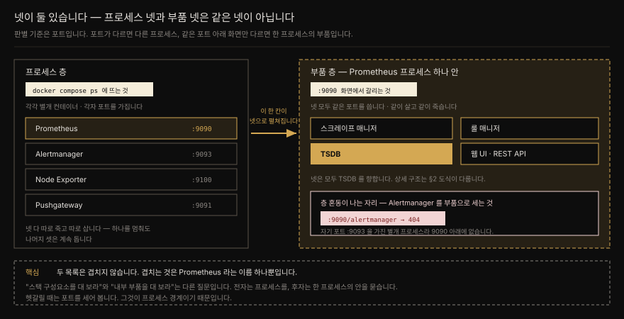
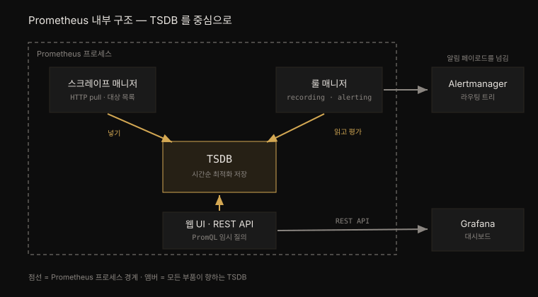
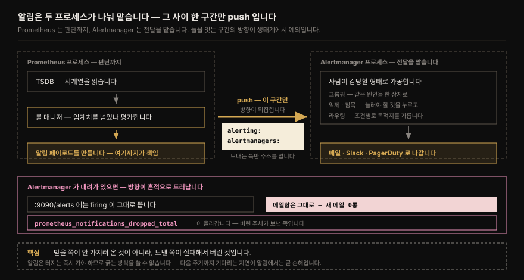
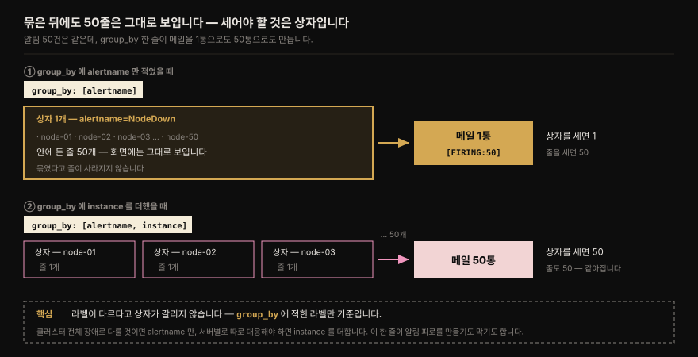
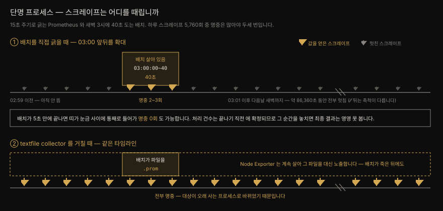
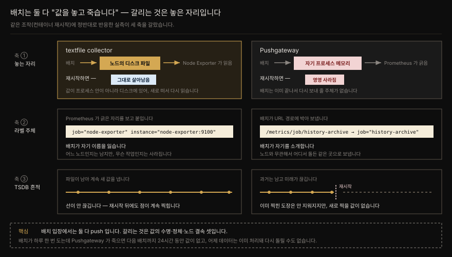
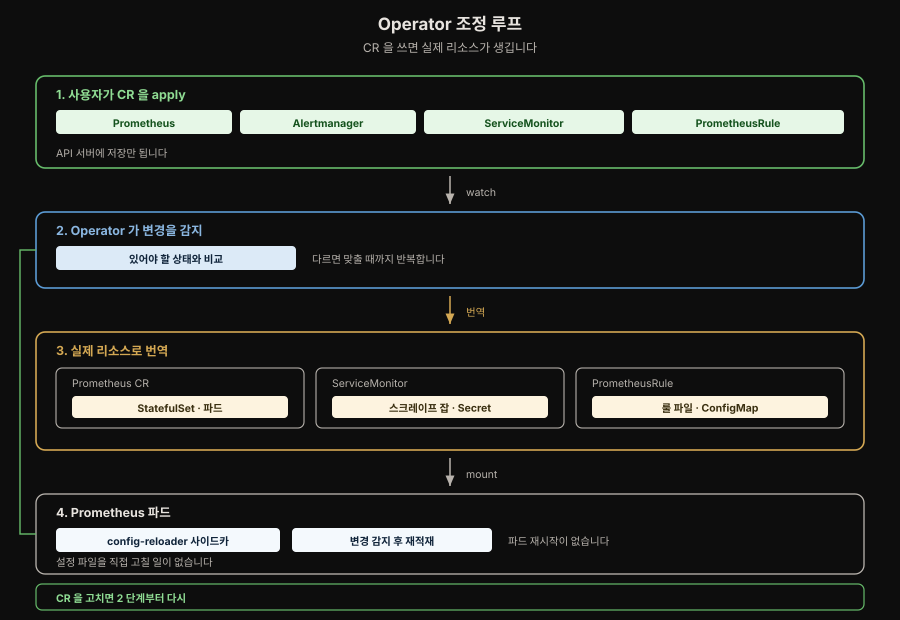
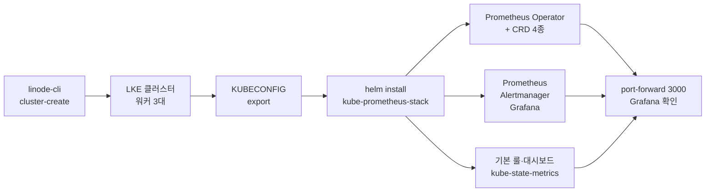
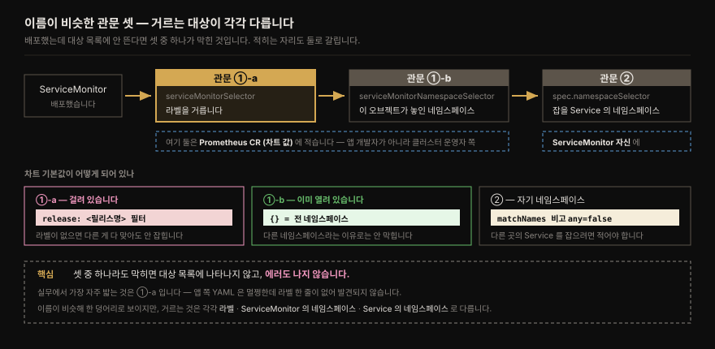
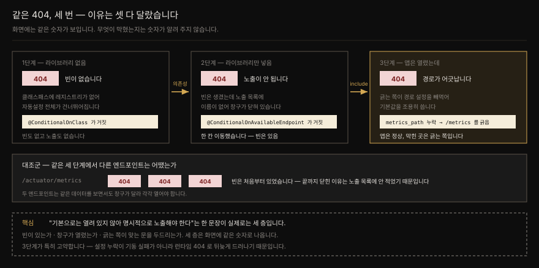

# Prometheus 배포하기
---

## 핵심 요약

> 이 장 전체가 매달린 하나의 생각은 **"Prometheus 스택"이라 부르는 것이 사실은 역할을 나눠 가진 여러 프로세스의 모음**이라는 사실입니다. 그 경계를 알아야 무엇이 무엇을 못 하는지 압니다.
>
> Prometheus 자체는 네 부품(TSDB·스크레이프 매니저·룰 매니저·웹 UI/API)으로 이뤄지고 모두 TSDB 를 향합니다. 알림을 실제로 Slack 이나 PagerDuty 로 보내는 일은 Prometheus 가 하지 않고 Alertmanager 가 합니다. 시각화는 Grafana 가 맡고 시스템 메트릭은 Node Exporter 가 냅니다.
>
> 후반부는 이 스택을 쿠버네티스에 올립니다. Prometheus Operator 가 설정 파일 편집을 CRD 로 바꿔 놓고 kube-prometheus 가 그 위에 의견을 담은 기본값을 얹으며 Helm 차트가 그것을 한 번에 설치합니다.


## 학습 목표

> 이 장을 읽고 나면 아래 다섯 가지를 스스로 해낼 수 있습니다.

1. Prometheus 스택의 네 구성요소를 나열하고 각자의 책임 경계를 말할 수 있습니다.
2. Prometheus 내부 네 부품이 TSDB 를 중심으로 어떻게 맞물리는지 그림으로 설명할 수 있습니다.
3. Alertmanager 가 왜 별도 프로세스여야 하는지 근거를 들어 설명할 수 있습니다.
4. 단명 프로세스(배치·cron)의 메트릭을 textfile collector 로 거두는 방법과 Pushgateway 와의 선택 기준을 말할 수 있습니다.
5. Prometheus Operator 의 CRD 네 가지가 각각 무엇을 추상화하는지 구분할 수 있습니다.


## 1. "Prometheus" 는 대개 스택을 가리킵니다

> "Prometheus 를 쓴다"는 말은 대개 Prometheus·Alertmanager·exporter·Grafana 네 프로세스의 모음을 가리킵니다.

사람들이 Prometheus 를 이야기할 때 Prometheus 프로젝트 하나만 뜻하는 경우는 드뭅니다. 보통 다음 넷을 묶어 부릅니다.

1. **Prometheus** — 메트릭 수집·저장·알림 룰 평가를 맡는 본체입니다.
2. **Alertmanager** — Prometheus 에서 나온 알림을 라우팅합니다.
3. **exporter 하나 이상** — Node Exporter 처럼 메트릭을 노출합니다.
4. **Grafana** — Prometheus 의 메트릭을 대시보드로 시각화합니다.

넷이 맞물려야 관측 가능성을 위한 완전한 메트릭 해법이 됩니다. 1장에서 Prometheus 가 메트릭 한 축만 담당한다고 못 박았다면, 이 장은 그 한 축 안에서도 책임이 다시 갈린다는 것을 보여줍니다.

⚠️ "스택"이라는 말에 LGTM 을 떠올렸다면 **묶는 축이 다릅니다.**

| | Prometheus 스택 | LGTM |
|---|---|---|
| 묶는 축 | 메트릭 **한 축 안에서** 역할 분담 | **신호 종류별**로 도구 모음 |
| 구성 | Prometheus · Alertmanager · exporter · Grafana | Loki(로그) · Grafana · Tempo(트레이스) · Mimir(메트릭 장기저장) |

**겹치는 것은 Grafana 뿐**입니다. Loki 와 Tempo 는 [01-01](./01-01.관측%20가능성·모니터링·Prometheus의%20자리.md) 이 "별도 시스템"이라고 한 로그·트레이스 담당이고, 이 장에서 다루는 넷과는 층이 다릅니다. LGTM 자체는 [02-07. LGTM K8s 통합 배포](../../02_LGTMStack/02-07.LGTM%20K8s%20통합%20배포.md) 가 정본입니다.

두 진영을 나란히 읽으면 얻는 것이 하나 있습니다. 이 장이 뒤에서 다루는 kube-prometheus 가 "Operator + CRD + 의견 담긴 기본값" 이라면 LGTM 쪽은 Alloy 가 수집을 통합하는 구조라, **선언형 스크레이프 대상 지정(`ServiceMonitor`)** 이라는 축이 어떻게 달라지는지가 드러납니다.


## 2. Prometheus 내부 — 모든 것이 TSDB 를 돕니다

> TSDB 가 Prometheus 를 규정하고, 스크레이프 매니저·룰 매니저·웹 UI 는 모두 그 TSDB 를 향해 돕니다.

Prometheus 는 네 부품으로 이뤄집니다. **시계열 데이터베이스(TSDB)**, **스크레이프 매니저**, **룰 매니저**, 그리고 REST API 를 낀 **웹 UI** 입니다. 물론 다른 컴포넌트도 있지만 신경 쓸 것은 이 넷입니다.

여기서 "넷"이 §1 에 이어 두 번째로 나오는데, **두 넷은 다른 층입니다.** §1 의 넷은 따로 뜨는 프로세스이고, 여기 넷은 그중 Prometheus **한 프로세스 안**의 부품입니다. 두 목록에서 겹치는 것은 Prometheus 라는 이름 하나뿐입니다.



- **헷갈릴 때 쓸 판별 기준은 포트입니다.** 포트가 다르면 프로세스가 다르고, 같은 포트 아래에서 화면만 갈리면 한 프로세스의 부품입니다. 로컬에 스택을 띄워 보면 이 경계가 눈에 보입니다 — `docker compose ps` 에는 각자 포트를 가진 컨테이너들이 뜨고, 부품 넷은 그중 `:9090` 하나 아래에서만 갈립니다.
- 층을 헷갈리면 없는 주소를 찾게 됩니다. Alertmanager 를 Prometheus 의 내부 부품으로 세고 `:9090/alertmanager` 를 열면 404 가 돌아옵니다. **자기 포트 `:9093` 을 가진 별개 프로세스**라 9090 아래에 있을 수가 없습니다. 뒤집어 말하면, 프로세스가 갈려 있다는 사실을 포트가 증명해 주는 셈입니다.

아래 그림의 점선이 그 경계입니다 — 안쪽이 한 프로세스이고, Alertmanager 와 Grafana 는 바깥입니다.



### TSDB

**TSDB 가 Prometheus 를 규정하는 기능**입니다. TSDB 는 데이터 포인트를 시간 순으로 저장하도록 최적화된 특별한 데이터베이스이며 나머지 부품은 전부 이 TSDB 를 중심으로 돕니다. 스크레이프 매니저가 그 안에 데이터를 넣고 룰 매니저가 그 내용을 평가하며 웹 UI 가 그것을 임시(ad hoc) 질의로 꺼냅니다.

### 스크레이프 매니저

**스크레이프 매니저**는 애플리케이션과 exporter 에서 메트릭을 끌어오는 일을 맡습니다. 실제로 긁어오는 동작과, 무엇을 긁어야 하는지에 대한 내부 목록을 유지하는 일을 함께 합니다. 

"스크레이프(scrape)"는 메트릭을 수집한다는 뜻의 Prometheus 용어이며 검색 엔진이 웹사이트에서 데이터를 자동으로 뽑아내는 웹 스크레이핑과 개념이 같습니다. 이름이 그렇게 붙은 이유가 있습니다. **Prometheus 는 특별한 프로토콜이나 gRPC 가 아니라 HTTP 로 메트릭을 끌어오기 때문입니다.**

### 룰 매니저

**룰 매니저**는 알림 룰과 레코딩 룰을 평가합니다. 둘의 차이가 중요합니다.

- **레코딩 룰**은 정해진 주기마다 새 메트릭을 만들어 내는 질의입니다. 대개 집계로 만듭니다.
- **알림 룰**은 임계치가 붙은 질의입니다. 무언가 잘못되어 알림을 보내야 할 때만 데이터를 돌려주도록 씁니다.

룰 매니저는 알림 룰과 레코딩 룰로 구성된 **룰 그룹**을 일정 주기마다 평가하며 주기는 룰 그룹별로 지정하거나 전역 기본값을 따릅니다. 그리고 보내야 할 알림을 Alertmanager 로 넘기는 책임도 여기 있습니다.

**두 룰은 결과가 가는 곳이 반대입니다.** 레코딩 룰이 만든 새 메트릭은 밖으로 나가지 않고 **다시 TSDB 로 들어갑니다** — 새 시계열로 저장되어 이후 질의가 원본 대신 그것을 읽습니다. 반면 알림 룰의 결과는 저장되지 않고 **경계 밖 Alertmanager 로 나갑니다.**

그래서 부품 넷 중 **룰 매니저만 TSDB 와 양방향입니다.** 스크레이프 매니저는 넣기만 하고 웹 UI 는 꺼내기만 하는 한 방향인데, 룰 매니저는 읽은 것을 가공해 같은 곳에 되돌려 놓습니다. 위 그림에서 룰 매니저 쪽 화살표만 화살촉이 양쪽에 있는 이유입니다.

### 웹 UI

**웹 UI** 는 브라우저로 접근하는 부분입니다. 실행 중인 설정(명령줄 플래그 값 포함), TSDB 정보, 그리고 PromQL 질의를 즉석에서 던져 볼 수 있는 간단한 질의 화면을 줍니다. 

이 웹 UI 는 **Prometheus REST API** 위에서 돕니다. 그 API 덕분에 Grafana 같은 다른 프로그램이 메트릭을 질의하고 감시 대상을 표시하는 표준 경로를 얻습니다.


## 3. Alertmanager 는 왜 밖에 있습니까

> Prometheus 는 알림 룰 평가와 페이로드 전달까지만 하고, 실제 발송은 Alertmanager 가 라우팅 트리로 처리합니다.

Alertmanager 는 스택에서 자주 간과됩니다. Prometheus 에 익숙하지 않은 사람은 Prometheus 자신이 Slack 이나 PagerDuty 로 알림을 보낸다고 짐작하기 때문입니다.

실제로는 그 일을 전부 Alertmanager 가 **라우팅 트리 기반 워크플로**로 처리합니다. Prometheus 는 알림 룰을 평가하고 알림 페이로드를 Alertmanager 에 보내는 데까지만 책임집니다. 그 알림을 진짜 목적지로 보내는 쪽은 Alertmanager 입니다.

여기서 실무적으로 중요한 결론이 하나 나옵니다. **Prometheus 에서 알림 기능을 쓰려면 Alertmanager 가 반드시 필요합니다.** Prometheus 만 띄워 놓고 알림이 오기를 기다리면 아무 일도 일어나지 않습니다.

**전달 방향을 짚어 둡니다 — 이 구간은 push 입니다.** Prometheus 생태계가 거의 전부 pull 이라 "Alertmanager 가 Prometheus 를 긁어 알림을 가져간다" 로 짐작하기 쉬운데 반대입니다. 설정이 증거입니다. 대상을 적는 곳이 `scrape_configs` 가 아니라 별도의 `alerting` 블록이고, **Prometheus 쪽에만 상대 주소가 있습니다.** Alertmanager 설정에는 Prometheus 주소가 아예 없습니다.

```yaml
alerting:
  alertmanagers:
    - static_configs:
        - targets: ["alertmanager:9093"]   # 보내는 쪽이 목적지를 압니다
```

- 왜 여기만 방향이 뒤집혔을까요. **알림은 터지는 즉시 가야 하기 때문입니다.** 긁어 가는 방식이면 다음 스크레이프 주기까지 기다려야 하는데, 그 지연이 알림에서는 곧 손해입니다. 메트릭은 15초 늦게 봐도 되지만 장애 통보는 그렇지 않습니다.
- 방향은 실패했을 때의 흔적으로도 드러납니다. Alertmanager 를 내려놓고 룰을 발화시키면 `:9090/alerts` 에는 firing 이 그대로 뜨는데 메일은 오지 않고, Prometheus 쪽 `prometheus_notifications_dropped_total` 이 올라갑니다. **보낸 쪽이 버린 것**입니다 — 받을 쪽이 안 가지러 온 것이 아닙니다. 재시도로 쌓아 두지도 않으므로, 그 사이의 알림은 그대로 유실됩니다.



> 💬 **비유**: Prometheus 는 화재감지기이고 Alertmanager 는 관제실입니다. 감지기는 연기를 감지해 신호를 올릴 뿐이며 그 신호를 누구에게 어떤 순서로 전화할지 정하는 일은 관제실 몫입니다. 감지기만 사 놓고 소방서에 연락이 가기를 기다릴 수는 없습니다.

다만 "Prometheus 가 보내지 않는다" 는 사실만으로는 **왜 굳이 프로세스를 하나 더 띄우는지** 가 설명되지 않습니다. 프로세스가 늘면 운영 부담도 늘기 때문입니다.

### 알림을 사람이 감당할 형태로 가공하는 층

프로세스를 하나 더 띄우는 데는 운영 비용이 따르므로, 그 비용을 치를 이유가 따로 있어야 합니다.

스위치 1대가 죽어 거기 물린 서버 50대가 동시에 알림을 내는 상황을 세워 봅니다. 이때 병목은 Prometheus 의 부하가 아닙니다. **당직자가 50건을 읽지 못한다** 는 것입니다. 알림은 사람이 읽고 판단해야 비로소 값을 하는데, 50건이 한꺼번에 쏟아지면 그중 진짜 원인을 가리키는 1건이 나머지 49건에 묻힙니다. 그래서 Alertmanager 가 하는 일은 발송 대행이 아니라 **알림을 사람이 감당할 형태로 가공하는 층** 입니다.

| 기능 | 하는 일 | 50건 상황에서 |
|------|--------|--------------|
| 그룹핑 | 같은 원인의 알림을 묶음 | 50건 → 1건 |
| 억제(inhibition) | 상위 원인 알림이 있으면 하위를 침묵시킴 | "스위치 죽음" 이 있으면 "서버 응답 없음" 50건 침묵 |
| 침묵(silence) | 계획된 점검 구간에 특정 알림 차단 | 점검 중 오탐 방지 |
| 라우팅 | 조건별 목적지 분기 | 야간 PagerDuty · 주간 Slack |

- 넷 중 **그룹핑이 기본이고 억제는 특수**합니다. 억제는 원인과 결과의 계층을 미리 알아야 설정할 수 있기 때문입니다.

분리의 이유는 두 축입니다. 

1. 첫째, **책임의 성격이 다릅니다.** Prometheus 의 본업은 메트릭 저장과 룰 평가입니다. 반면 알림 가공은 "누가 언제 무엇을 받았나, 지금 무엇이 침묵 중인가" 라는 별개의 상태 관리이며, 한 프로세스에 섞으면 관심사가 엉킵니다. 
2. 둘째, **Prometheus 를 여러 대 띄울 수 있습니다.** HA 로 Prometheus 2대를 굴리면 같은 알림을 둘 다 쏘는데, Alertmanager 를 공유하면 그 중복이 제거됩니다.

표 첫 줄의 "50건 → 1건" 은 화면을 보면 곧바로 헷갈립니다. 묶은 뒤에도 **알림 50건이 그대로 보이기** 때문입니다. 구조가 2층이라 그렇습니다.



상자를 세면 1이고 줄을 세면 2입니다. **사람이 받는 메일 통수를 정하는 것은 상자 수입니다.** 위 상황에서 메일은 `[FIRING:2]` 제목의 **한 통**이고, 제목의 `2` 가 묶인 알림 개수입니다. 받는 사람은 한 통을 읽고 "이 알림이 두 군데서 났구나" 를 압니다.

무엇을 한 상자로 볼지는 `group_by` 가 정합니다. 라벨이 다르다는 것만으로 상자가 갈리지 않고, **`group_by` 에 적힌 라벨**만 기준이 됩니다.

| `group_by` | 상자 | 사람이 받는 메일 |
|---|---|---|
| `[alertname]` | 1개 | **1통** — `[FIRING:50]` |
| `[alertname, instance]` | 50개 | **50통** |

같은 50건인데 1통이냐 50통이냐로 갈립니다. 그래서 실무에서는 "무엇을 한 사건으로 볼 것인가" 를 먼저 정해 적습니다 — 클러스터 전체 장애로 다룰 것이면 `[alertname]`, 서버별로 따로 대응해야 하면 `[alertname, instance]` 입니다. **`group_by` 한 줄이 알림 피로를 만들기도 하고 막기도 합니다.**

> 위 표는 "이런 가공을 한다" 는 존재 증명까지입니다. 그룹핑 타이머 세 가지·라우팅 트리·억제 규칙의 실제 동작은 [05-01. Alertmanager](./05-01.Alertmanager%20—%20라우팅·그룹핑·억제·HA.md) 가 SSOT 이고, 중복 제거가 가십으로 어떻게 이뤄지는지는 그 편 §9 가 다룹니다.


## 4. Node Exporter 와 단명 프로세스 문제

> 긁으러 갔을 때 이미 죽어 있는 프로세스는 pull 모델과 맞지 않고, **textfile collector** 가 그 간극을 파일로 메웁니다.

Node Exporter 는 가장 널리 쓰이는 exporter 이며 시스템 메트릭에 필요한 것을 거의 다 덮습니다. CPU·RAM·디스크·네트워크 I/O 를 비롯해 수많은 메트릭을 냅니다. 사실상 리눅스의 `/proc` 유사 파일시스템에 있는 거의 모든 것이 Node Exporter 로 노출되거나, 프로젝트에 PR 을 넣어 노출할 수 있습니다.

데이터 양이 상당해질 수 있으니 Node Exporter 의 collector 상당수는 기본으로 꺼져 있고 명령줄 플래그로 켜야 합니다. 

- 흔히 신경 쓰는 collector(CPU·디스크 등)는 기본으로 켜져 있습니다. 저자는 자기 경험상 추가로 설정하는 플래그가 systemd collector 활성화와 textfile collector 디렉토리 지정 둘뿐이라고 적습니다. 
- 기본 활성/비활성 목록은 프로젝트 GitHub 의 README 나 `node_exporter --help` 출력에서 확인합니다.

> ⚠️ Node Exporter 는 리눅스·BSD·macOS 계열용으로만 설계됐습니다. 윈도우는 [windows_exporter](https://github.com/prometheus-community/windows_exporter) 를 씁니다.

**왜 하필 Node Exporter 인가요.** exporter 는 종류가 많은데, 이 일에는 조건 둘을 함께 만족하는 것이 이것뿐입니다.

- **이미 거기 있습니다** — 노드마다 시스템 메트릭을 내려고 어차피 깔아 두므로 새 인프라가 필요 없습니다
- **오래 삽니다** — 노드가 살아 있는 동안 계속 돌아, 배치가 죽어도 대리인 노릇을 합니다

MySQL exporter 는 MySQL 이 있는 노드에만 있고 JMX exporter 는 JVM 프로세스에 붙습니다. **"모든 노드에 항상 있는 것"이 Node Exporter 의 자리**입니다. 거꾸로 이것이 본업은 아니라는 점도 드러납니다 — 원래 `/proc` 을 읽는 물건인데 "노드에 상주한다"는 성질을 빌린 **편승 기능**이라, 기본으로 디렉토리가 지정돼 있지 않고 플래그로 켜야 합니다.

**textfile collector** 는 따로 볼 값어치가 있습니다. Prometheus 를 두고 흔히 나오는 질문이 "단명 프로세스와 배치 작업은 어떻게 감시합니까"인데, 답이 두 가지입니다. textfile collector 와 Pushgateway 이며 **저자는 대체로 textfile collector 를 권합니다.**

textfile collector 는 기본으로 켜져 있지만 `--collector.textfile.directory` 플래그로 디렉토리를 지정해야 동작합니다. 디렉토리를 지정하면 Node Exporter 가 그 안의 `.prom` 확장자 파일을 자동으로 읽어, 형식만 맞다면 `/proc` 에서 내는 평소 메트릭과 나란히 포함시킵니다.

```bash
# cron 같은 단명 작업이 .prom 파일을 남기면 Node Exporter 가 다음 스크레이프에 함께 실어 보냅니다
node_exporter --collector.textfile.directory=/var/lib/node_exporter/textfile
```

- 왜 이 방식이 먹힐까요. 단명 프로세스는 Prometheus 가 긁으러 올 때쯤 이미 죽어 있기 때문에 pull 모델과 궁합이 맞지 않습니다. 
- textfile collector 는 그 프로세스가 남긴 *파일* 을 오래 사는 Node Exporter 가 대신 노출하게 만들어, pull 모델을 깨지 않고 문제를 우회합니다.


## 5. 단명 프로세스는 왜 pull 과 어긋납니까

> 스크레이프가 헛치는 시간 스케일과, pull 의 이점인 `up` 이 배치 앞에서 뒤집힌다는 것 — 두 겹입니다.

이 "궁합이 맞지 않는다" 는 한 문장에는 사실 두 겹의 문제가 접혀 있습니다. 스크레이프가 헛치는 **시간 스케일** 과, 01-01 §7 이 pull 의 이점으로 세운 축이 배치 작업 앞에서 **뒤집힌다** 는 것입니다. 둘 다 책이 다루지 않으므로 여기서 펼칩니다.

*첫째, 스케일이 실감되지 않습니다.* 15초 주기로 긁는 Prometheus 와 새벽 3시에 40초 도는 배치를 하루로 펼치면 이렇습니다.

```
03:00:00  배치 시작
03:00:40  배치 종료          ← 살아 있는 구간: 40초
03:00:41 ~ 다음날 02:59:59   ← 죽어 있는 구간: 약 86,360초
```

하루 스크레이프 5,760회 가운데 대상이 살아 있는 것은 많아야 두세 번입니다. 배치가 5초 만에 끝나면 **한 번도 못 긁힐 수 있고**, 처리 건수를 확정하는 시점이 하필 *끝나기 직전* 이라 그 순간에 스크레이프가 오지 않으면 최종 결과는 영영 못 봅니다.



*둘째, 이쪽이 더 중요합니다.* **pull 의 이점이 그대로 뒤집힙니다.** [01-01 §7](./01-01.관측%20가능성·모니터링·Prometheus의%20자리.md) 은 pull 이 push 와 갈리는 지점을 "Prometheus 가 자기 감시 대상을 알고 있으니 수집 실패 자체가 신호가 된다" 로 세웠습니다. 그 신호를 메트릭 이름으로 부르면 `up` 이고, 대상을 못 긁으면 0 이 됩니다.

그런데 배치 작업은 **죽어 있는 것이 정상** 입니다. 하루의 99.95% 를 죽은 채로 보내는 것이 그 물건의 본성입니다. 그러니 `up` 을 알림에 쓸 수 없습니다. 정상 상태가 실패로 보이기 때문입니다. 단명 프로세스는 "긁기 어렵다" 는 기술적 불편을 넘어 **pull 모델이 전제하는 세계관과 어긋나는 대상** 이고, textfile collector 는 오래 사는 Node Exporter 를 대리인으로 세워 그 전제를 되살립니다. 노드가 살아 있는 한 `up` 은 노드 기준으로 다시 유효해집니다.

여기서 `up` 의 판정 기준을 짚어 둡니다. **`up` 은 HTTP 스크레이프의 성공 여부만 봅니다** — 응답이 오면 1, 없으면 0이고 **파일 내용과는 무관합니다.** 배치가 깨진 `.prom` 파일을 남겨도 그 노드의 `up` 은 1 그대로입니다.

파일이 깨져도 **나머지 시스템 메트릭은 계속 나옵니다.** Node Exporter 는 읽지 못한 파일만 건너뛰고 `node_textfile_scrape_error` 를 1 로 올립니다. Help 문자열이 `1 if there was an error opening or reading a file, 0 otherwise` 이고, 성공적으로 읽은 파일의 메트릭은 그대로 누적해 내보냅니다([collector/textfile.go](https://github.com/prometheus/node_exporter/blob/master/collector/textfile.go), 2026-07-28 조회).

그러니 이 신호는 `up` 과 **다른 축**이고, 알림도 따로 걸어야 합니다.

설계 의도는 한 줄로 읽힙니다 — **편승 기능이 본업을 망가뜨리면 안 됩니다.** 남의 배치가 잘못된 파일을 써도 그 노드의 CPU·메모리는 계속 나와야 합니다.


## 6. 파일에 쓰는 것도 push 아닌가요

> 배치 입장에서는 둘 다 push 입니다. 갈리는 것은 값의 수명·정체·노드 결속 셋입니다.

배치 입장에서 보면 둘 다 "어딘가에 값을 쓰는" 일이고, 마지막 구간은 둘 다 Prometheus 가 긁어 갑니다.

```pseudocode
[Pushgateway]        배치 ──HTTP POST──▶ Pushgateway ◀──scrape── Prometheus
[textfile collector] 배치 ──파일 쓰기──▶ 로컬 디스크 ◀──읽기── Node Exporter ◀──scrape── Prometheus
```

그러니 **"push 냐 pull 이냐"로는 둘이 갈리지 않습니다.** 갈리는 것은 값의 귀속·값의 수명·새 인프라 세 축이고, 그 셋이 아래 표에 그대로 있습니다.

세 축을 한 장에 겹쳐 두면 이렇습니다. 축을 가장 선명하게 가르는 것은 **컨테이너 재시작**입니다. 같은 조작 하나에 두 경로가 정반대로 반응합니다.



**값의 수명을 결정하는 것은 놓은 자리입니다.** Pushgateway 를 재시작하면 밀어 넣었던 값이 사라집니다. 그 값이 **자기 프로세스 메모리**에 있었고, 배치는 이미 끝나서 다시 보내 줄 주체가 없기 때문입니다. Node Exporter 는 같은 조작을 해도 값이 그대로 나옵니다. 값이 프로세스 안이 아니라 **디스크의 `.prom` 파일**에 있어, 새로 떠서 그 파일을 다시 읽기 때문입니다.

**여기서 "그러면 Prometheus 가 들고 있던 값은 어떻게 되는가"가 갈립니다.** 절반은 남습니다. Prometheus 의 저장 방식은 긁을 때마다 그 순간의 값을 도장 찍는 것이라, **이미 찍힌 과거 점은 지워지지 않습니다.** 하지만 밀어 넣은 값이 사라진 뒤로는 찍을 것이 없어 **미래가 끊깁니다.** "Pushgateway 가 죽으면 데이터가 다 사라진다" 는 과하고, "Prometheus 에 남아 있으니 괜찮다" 도 과합니다. 정확히는 과거는 남고 앞으로가 없습니다.

그 끊김이 아픈 이유는 배치의 주기에 있습니다. 배치가 **하루 한 번** 도는데 Pushgateway 가 죽으면 다음 실행까지 24시간 동안 값이 없습니다. 그 사이 대시보드는 빈칸이고 "마지막 아카이빙이 언제였나" 에 답이 안 나옵니다. 배치를 다시 돌려 메울 수도 없습니다 — 어제 데이터는 이미 처리됐기 때문입니다. textfile 은 같은 상황에서도 파일이 디스크에 남아 계속 답합니다.

> ⚠️ **재시작 실험에는 측정 함정이 있습니다.** 
>
> 재시작 직후 곧바로 조회하면 컨테이너가 아직 뜨는 중이라 빈 응답이 옵니다. 이것을 "값이 사라졌다" 로 읽으면 오판입니다. `RestartCount`·`StartedAt` 으로 재시작이 실제로 일어났는지 확인하고, **HTTP 200 이 돌아온 뒤에** 조회해야 합니다. 실측에서 한 번 이 함정에 빠졌다가 `StartedAt` 대조로 잡았습니다.

**둘째 축은 라벨을 누가 붙이는가입니다.** 이것이 위 표의 "값의 귀속" 이 뜻하는 바입니다. textfile 로 남긴 값에는 Prometheus 가 **긁은 자리를 보고** `job="node-exporter"` 를 붙입니다. 그래서 배치는 어느 노드에서 돌았는지(`instance`)는 남기지만 **자기가 무슨 작업인지는 잃습니다.** Pushgateway 는 배치가 URL 경로(`/metrics/job/history-archive`)에 이름을 박아 보내므로 정체가 보존됩니다.

이름이 같아도 라벨이 다르면 **별개의 시계열**이므로, 두 경로로 같은 메트릭을 올리면 둘 다 따로 조회됩니다.

```pseudocode
notification_archive_rows_total{job="node-exporter", instance="node-exporter:9100"}  ← textfile
notification_archive_rows_total{job="history-archive", instance=""}                  ← push
```

⭐ 프레임을 한 문장으로 세우면 이렇습니다 — **textfile collector 는 "push 가 아닌 것"이 아니라 push 를 노드 안으로 국소화한 것입니다.** 네트워크를 건너는 push 를 로컬 파일 쓰기로 끝내고, 네트워크 구간은 이미 있는 pull 에 얹습니다. 그래서 pull 모델이 깨지지 않습니다.

**"그러면 Pushgateway 도 파일에 쓰게 하면 같아집니까."** 재시작 대비를 메모리 대 디스크로 세워 놓으면 그렇게 읽힙니다. 그리고 이 물음은 가정이 아닙니다 — 실제로 그런 플래그가 있습니다. Pushgateway 는 기본이 비영속이지만 `--persistence.file` 로 파일을 지정하면 밀어 넣은 값이 재시작을 넘어 살아남습니다([pushgateway README](https://github.com/prometheus/pushgateway), 2026-07-29 조회).

**그래도 같아지지 않습니다.** 위 세 축 중 하나만 닫히기 때문입니다. 값의 수명 축은 닫히지만 축 셋째(별도 서버 = 단일 실패 지점이자 병목)는 그대로 남고, 값의 귀속 축은 애초에 Pushgateway 쪽 장점이라 닫을 것도 없습니다.

**오히려 한 겹 더 아파집니다.** 밀어 넣은 값은 API 로 명시적으로 지우기 전까지 무기한 남고 자동 만료가 없는데, 여기에 디스크 영속이 얹히면 배치가 **영영 안 돌아도** 마지막 성공 값이 재시작을 넘어 초록불로 남습니다. 아래 표 둘째·셋째 줄이 뜻하는 바가 그것입니다.

프레임을 한 줄로 세우면 이것은 **저장 매체가 아니라 소유권의 문제**입니다. `.prom` 파일은 배치가 소유해 매 실행마다 통째로 덮어쓰므로 갱신이 멈춘 사실이 파일 타임스탬프에 드러납니다. 밀어 넣은 값은 POST 가 끝나는 순간 **주인이 없어져** 지울 주체가 남지 않습니다.

**textfile collector 냐 Pushgateway 냐.** 저자는 이유를 짧게만 적고 textfile collector 를 권합니다. 판단 근거를 채워 두면 이렇습니다. Prometheus 공식 문서도 Pushgateway 사용을 좁은 경우로 제한하라며 함정을 듭니다([When to use the Pushgateway](https://prometheus.io/docs/practices/pushing/)). 두 방식의 차이는 한 축에서 갈립니다.

| | textfile collector | Pushgateway |
|---|---|---|
| 배치가 하는 일 | 파일을 **덮어씀** | 서버로 **밀어 넣음** |
| 값의 수명 | 다음 실행이 덮을 때까지 | **수동으로 지울 때까지 영원히** |
| 대상이 사라지면 | 노드가 사라지면 같이 사라짐 | 낡은 시계열이 계속 남음 |
| 인프라 | 이미 있는 Node Exporter | 별도 서버 — 단일 실패 지점이자 병목 |
| `up` 헬스 | 노드 기준으로 유효 | 잃음 (Prometheus 가 대상을 직접 안 긁음) |

차이의 뿌리는 한 문장으로 줄어듭니다. **덮어쓰기는 상태를 남기지 않고, 밀어 넣기는 상태를 남깁니다.** 표의 둘째·셋째 줄이 특히 아픈 이유가 여기 있습니다. 죽은 배치 작업의 마지막 성공 값이 대시보드에 계속 살아 있으면, 알림이 울려야 할 때 울리지 않습니다.

[01-01 §7](./01-01.관측%20가능성·모니터링·Prometheus의%20자리.md) 이 pull 의 이점으로 세운 **조용한 실패**가 이 경로로 되돌아오는 셈입니다. `up` 은 "있어야 할 것이 없다"를 잡아 주지만, Pushgateway 에 남은 값은 **없어야 할 것이 남아** 초록불을 만듭니다.

그래서 공식 문서는 Pushgateway 의 정당한 용례를 하나로 좁힙니다. **특정 머신이나 인스턴스에 묶이지 않는 "서비스 수준" 배치 작업의 결과 기록**입니다. 예로 든 것이 서비스 전체에서 사용자 여럿을 지우는 배치 작업이며, 이런 메트릭에는 머신·인스턴스 라벨을 붙이지 않습니다.

작성 예시는 [node-exporter-textfile-collector-scripts](https://github.com/prometheus-community/node-exporter-textfile-collector-scripts) 에 있습니다. 파일 형식은 [텍스트 기반 노출 형식](https://prometheus.io/docs/instrumenting/exposition_formats/#text-based-format) 을 따릅니다.


## 7. Grafana 가 메우는 빈칸

> Prometheus 웹 UI 는 질의 저장·변수 치환·비-PromQL 사용자 대응을 못 하고, 그 셋이 Grafana 의 자리입니다.

Prometheus 웹 UI 는 즉석 질의에는 훌륭하지만 못 하는 일이 있습니다. 자주 쓰는 질의를 저장하지 못하고 변수를 치환해 질의를 재사용하지 못하며 PromQL 을 모르는 사람에게 데이터를 보여주지 못합니다.

Grafana 는 무엇보다 데이터 시각화 플랫폼입니다. 알림 같은 기능도 있으나 이 책은 다루지 않습니다. **Prometheus 는 Grafana 에서 가장 흔하게 쓰이는 데이터 소스 타입**이며 그래서 시계열 데이터를 시각화하는 내장 기능이 잘 갖춰져 있습니다.


## 8. 쿠버네티스 프로비저닝

> 책은 LKE 를 쓰지만 원리는 EKS·AKS·Minikube 에 그대로 옮겨집니다. 필요한 도구는 `linode-cli`·`kubectl`·`helm` 셋입니다.

저자는 Linode 의 관리형 쿠버네티스인 **LKE(Linode Kubernetes Engine)** 위에 Prometheus 를 올립니다. 같은 원리를 AKS·EKS·Minikube 같은 다른 환경에 그대로 옮길 수 있습니다. 필요한 도구는 `linode-cli`, `kubectl`, `helm` 셋입니다.

```bash
# 워커 노드 3대. 각 4GB 메모리 · 2 CPU 코어 · 80GB 디스크
linode-cli lke cluster-create \
  --label mastering-prometheus \
  --region us-southeast \
  --k8s_version 1.26 \
  --node_pools.type g6-standard-2 \
  --node_pools.count 3
```

클러스터가 뜨면 Kubeconfig 를 내려받아 권한을 좁히고 환경 변수로 지정합니다.

```bash
linode-cli lke clusters-list                       # 클러스터 ID 확인
linode-cli lke kubeconfig-view <cluster_id> --text | tail -1 | base64 -d > ~/.kube/config-mastering-prometheus
chmod 0600 ~/.kube/config-mastering-prometheus     # 자격증명 파일이므로 소유자만 읽게
export KUBECONFIG=~/.kube/config-mastering-prometheus
```


## 9. Operator 와 kube-prometheus — CRD 로 설정을 대신합니다

> **Operator** 는 Prometheus 설정 파일 편집을 쿠버네티스 CRD 선언으로 바꿉니다. 핵심 추상은 `PrometheusRule` 과 `ServiceMonitor` 입니다. **kube-prometheus** 는 그 Operator 위에 의견 담긴 기본값을 얹은 구성이고, jsonnet 으로 쓰여 있어 보통 Helm 차트로 설치합니다.

Prometheus Operator 는 쿠버네티스 클러스터에서 여러 Prometheus 인스턴스를 배포하고 관리하기 쉽게 하려고 Prometheus 메인테이너 **Frederic Branczyk** 이 시작한 프로젝트입니다. Prometheus 의 몇몇 조각을 쿠버네티스 **CRD(Custom Resource Definition)** 뒤로 추상화합니다.

알아 둘 주요 CRD 는 네 가지입니다.

| CRD | 무엇을 추상화하는가 | 왜 필요한가 |
|-----|-------------------|------------|
| `Prometheus` | Prometheus 인스턴스 자체 | 인스턴스를 선언형으로 띄움 |
| `Alertmanager` | Alertmanager 인스턴스 | 위와 같음 |
| `PrometheusRule` | 룰 정의 | Prometheus 설정 파일을 고치지 않아도 룰이 자동으로 잡힘 |
| `ServiceMonitor` | 스크레이프 잡 | 감시 대상 쿠버네티스 Service 를 선언형으로 지정 |

- `Prometheus` 와 `Alertmanager` 는 이름 그대로입니다. 핵심 추상은 뒤의 둘입니다. `PrometheusRule` 은 룰 정의를 추상화해 **Prometheus 설정 파일을 우리가 갱신하지 않아도 룰이 자동으로 반영되게** 합니다. 
- `ServiceMonitor` 는 같은 일을 룰 대신 **스크레이프 잡**에 해 주며 감시해야 할 쿠버네티스 Service 객체에 대응하는 스크레이프 잡을 설정하게 해 줍니다. Pod 를 감시하는 `PodMonitor` CRD 도 있습니다.

이 CRD 들 외에 Operator 는 다른 쓸모 있는 리소스도 제공합니다. `PrometheusRule` 같은 객체의 문법을 검증하는 admission webhook 컨트롤러, 그리고 Operator 가 관리하는 CRD 들의 컨트롤러인 Operator 자신입니다.

### CR 을 쓰면 무엇이 생기는가

CRD 는 선언을 담을 **그릇**일 뿐이라 그 자체로는 아무것도 띄우지 않습니다. 선언을 실제 리소스로 만드는 일은 Operator 가 합니다.



`kubectl apply` 는 CR 을 API 서버에 저장하는 데서 끝납니다. 그 순간 파드가 뜨지는 않습니다. Operator 가 이 리소스들을 watch 하고 있다가 변경을 발견하면, 선언된 상태와 지금 클러스터의 상태를 견줘 다른 만큼을 메웁니다. 이 되풀이가 **조정 루프**이며 쿠버네티스 컨트롤러가 공통으로 쓰는 방식입니다.

번역의 결과물은 CR 종류마다 다릅니다. `Prometheus` 는 StatefulSet 과 그 파드가 되고, `ServiceMonitor` 는 스크레이프 잡으로 옮겨져 `prometheus.yaml` 에 담긴 뒤 Secret 으로, `PrometheusRule` 은 룰 파일이 되어 ConfigMap 으로 들어갑니다.

마지막 단계가 이 구조의 값어치를 만듭니다. Secret 과 ConfigMap 은 Prometheus 파드에 볼륨으로 마운트돼 있고, 파드 안의 **config-reloader 사이드카**가 그 파일이 바뀌는 것을 지켜봅니다. 바뀌면 Prometheus 에 재적재를 요청하므로 파드를 다시 시작하지 않아도 새 설정이 붙습니다. 스크레이프 대상 하나를 추가하려고 설정 파일을 열어 고치고 프로세스를 재시작하던 일이, CR 하나를 apply 하는 일로 바뀐 셈입니다.

이 루프는 한 번 돌고 끝나지 않습니다. CR 을 고칠 때마다 Operator 가 다시 감지해 같은 경로를 돕니다.

### kube-prometheus 와 Helm 차트

**kube-prometheus** 는 Prometheus Operator 팀이 운영하는 또 다른 프로젝트이며 Operator 를 굴리는 *의견이 담긴* 출발점을 줍니다. Operator 와 그 CRD 를 설치하는 데 그치지 않고 Grafana·Prometheus·Alertmanager 를 배포하고 기본 룰과 알림, 스크레이프 잡, Grafana 대시보드를 한 벌 얹어 완전한 쿠버네티스 감시 스택을 세워 줍니다.

kube-prometheus 는 **jsonnet** 으로 작성돼 있습니다. jsonnet 은 JSON 데이터를 템플릿화하는 데 집중한 언어이며 YAML 이 JSON 의 상위집합이라 결과를 쿠버네티스용 YAML 로 뽑을 수 있습니다. 문제는 jsonnet 을 모르면 생성된 YAML 매니페스트를 손보기 어렵다는 점이고(11장에서 배웁니다), 그래서 Helm 차트가 등장합니다.

```bash
# helm 저장소 추가 및 업데이트
helm repo add prometheus-community https://prometheus-community.github.io/helm-charts
helm repo update

# helm 설치
helm install \
  --namespace prometheus \
  --create-namespace \
  --values mastering-prometheus/ch2/values.yaml \
  --version 47.0.0 \
  mastering-prometheus \
  prometheus-community/kube-prometheus-stack
```

차트 하나가 어디까지 데려다주는지 흐름으로 보면 이렇습니다.



- 기본값 그대로 설치해도 되지만 저자는 값 파일에서 두 가지를 바꿉니다. Operator 가 **모든 네임스페이스의 `ServiceMonitor` 를 발견하도록** 설정을 고쳤고, Grafana 의 기본 사용자·비밀번호와 대시보드 기본 시간대를 바꿨습니다. 
- 바꿀 수 있는 값 전체는 `helm show values prometheus-community/kube-prometheus-stack` 로 봅니다.

### 대상이 걸러지는 관문 셋

원서가 어느 키를 고쳤는지 밝히지 않으므로, 실제로 걸리는 관문을 정리해 둡니다. 차트가 `ServiceMonitor` 를 집어가기까지 관문이 셋이고, 이름이 비슷해 한 덩어리로 보이지만 축이 다릅니다. 하나라도 막히면 스크레이프 대상에 안 잡힙니다.



| 관문 | 어디에 쓰는가 | 무엇을 거르는가 | kube-prometheus-stack 기본 |
|------|--------------|----------------|---------------------------|
| 1-a `serviceMonitorSelector` | `Prometheus` CR (차트 값) | `ServiceMonitor` 의 **라벨** | `release: <릴리스명>` 필터 **걸림** |
| 1-b `serviceMonitorNamespaceSelector` | `Prometheus` CR (차트 값) | `ServiceMonitor` 가 놓인 **네임스페이스** | `{}` = **전 네임스페이스 열림** |
| 2 `spec.namespaceSelector` | `ServiceMonitor` 자신 | 그 `ServiceMonitor` 가 잡을 **Service 의 네임스페이스** | 자기 네임스페이스 |

실무에서 가장 자주 밟는 지뢰는 **1-a** 입니다. 차트 기본값이 `serviceMonitorSelectorNilUsesHelmValues: true` 라서, 값이 비어 있으면 릴리스 이름 라벨 셀렉터로 렌더됩니다. 앞의 예제가 `labels.release: mastering-prometheus` 를 단 이유가 이것이고, 이 라벨이 없으면 다른 조건이 다 맞아도 발견되지 않습니다.

반면 **네임스페이스 축(1-b)은 기본으로 이미 열려 있습니다.** 차트 템플릿이 값이 비면 `serviceMonitorNamespaceSelector: {}` 로 렌더하고, Operator 에서 `{}` 는 전체 선택을 뜻합니다. 그래서 앱이 다른 네임스페이스에 있다는 이유만으로는 안 잡히지 않습니다.

> 저자가 값 파일에서 "모든 네임스페이스의 `ServiceMonitor` 를 발견하도록" 바꿨다고 적은 대목은, 원서가 **어느 키인지 밝히지 않습니다**(원서 §Configuration). 
>
> 차트 기본이 이미 전 네임스페이스이므로, 실제로 만진 것은 `serviceMonitorSelectorNilUsesHelmValues: false`(릴리스 라벨 필터 해제) 쪽일 가능성이 큽니다. 책 서술만으로는 확정할 수 없어 그대로 옮기지 않습니다.

관문 2 의 기본값은 Operator 소스가 못 박습니다. `matchNames` 가 비어 있고 `any` 가 false 면 "objects are selected from the current namespace" 입니다([types.go](https://github.com/prometheus-operator/prometheus-operator/blob/main/pkg/apis/monitoring/v1/types.go)).

렌더 로직은 차트의 [prometheus.yaml 템플릿](https://github.com/prometheus-community/helm-charts/blob/main/charts/kube-prometheus-stack/templates/prometheus/prometheus.yaml) L193~208 에 있습니다.


## 10. 검증 — 무엇이 이미 들어와 있는가

> Node Exporter·cAdvisor·kube-state-metrics 셋이 Helm 한 번으로 들어와, 클러스터 인프라 메트릭을 사실상 전부 덮습니다.

Grafana 로 포트를 넘겨 브라우저에서 확인합니다.

```bash
kubectl port-forward svc/mastering-prometheus-grafana 3000:80   # http://localhost:3000
```

Grafana 에는 쿠버네티스와 Node Exporter 데이터를 위한 대시보드가 미리 채워져 있습니다. kube-prometheus 가 덤으로 넣어 주는 **kube-state-metrics** 서비스는 클러스터에 관한 방대한 데이터를 Prometheus 형식으로 냅니다. 저자가 방금 만든 클러스터 기준 **시계열 2,300개 이상**입니다.

Node Exporter 메트릭, kubelet 이 노출하는 cAdvisor 메트릭, 그리고 kube-state-metrics 이 셋이면 Helm 한 번으로 클러스터 안 인프라 메트릭을 사실상 전부 덮은 셈입니다. `Kubernetes / Compute Resources / Cluster` 대시보드를 열어 내장 드릴다운 링크를 눌러 보면 데이터를 훑을 수 있습니다.


## 책을 따라 하다 걸리는 지점

> 원문을 그대로 실행하면 막히는 두 곳입니다. 개념 보론은 각 절 안으로 옮겼습니다.

**책의 명령 하나에 오타가 있습니다.** 원문은 네임스페이스를 소문자 `prometheus` 로 만들어 놓고(`helm install --namespace prometheus`), 확인 단계에서는 `kubectl config set-context --current --namespace Prometheus` 라고 대문자 `P` 로 적습니다. 쿠버네티스 네임스페이스 이름은 RFC 1123 라벨 규칙을 따라 **소문자·숫자·하이픈만** 허용되므로 `Prometheus` 라는 네임스페이스는 존재할 수 없습니다. 그대로 치면 뒤이은 `kubectl get pods` 가 파드를 찾지 못합니다. 소문자로 고쳐 씁니다.

```bash
kubectl config set-context --current --namespace prometheus   # 대문자 P 가 아닙니다
```

**버전 핀은 늙습니다.** 원문은 `--k8s_version 1.26` 과 차트 `--version 47.0.0` 을 못 박아 두었습니다. 집필 시점의 값이며 지금 그대로 넣으면 LKE 가 그 쿠버네티스 버전을 더는 제공하지 않을 수 있습니다. 차트 버전도 마찬가지라, 실습할 때는 `linode-cli lke versions-list` 와 `helm search repo prometheus-community/kube-prometheus-stack --versions` 로 현재 값을 확인하고 넣습니다. 버전 자체보다 **버전을 고정한다는 태도**가 이 장의 교훈입니다.


## 결정 치트시트

> 이 장이 남기는 판단 기준입니다.

| 상황 | 선택 | 이유 |
|------|------|------|
| 알림을 Slack·PagerDuty 로 보내야 함 | Alertmanager 필수 배포 | Prometheus 는 룰 평가와 페이로드 전송까지만 담당 |
| cron·배치 같은 단명 작업 메트릭 수집 | textfile collector | pull 시점에 프로세스가 살아 있지 않아도 파일이 남음 |
| 여러 팀이 메트릭을 중앙으로 밀어 넣어야 함 | Pushgateway (좁게) | 밀어 넣기는 상태를 남김 — SPOF·낡은 시계열·`up` 상실을 감수 |
| 감시 대상 Service 를 늘림 | `ServiceMonitor` 추가 | Prometheus 설정 파일을 건드리지 않음 |
| 알림·레코딩 룰을 추가함 | `PrometheusRule` 추가 | 위와 같음. admission webhook 이 문법 검증 |
| Pod 를 직접 감시함 | `PodMonitor` | Service 를 거치지 않는 대상 |
| 저장한 질의·변수·비-PromQL 사용자 필요 | Grafana | Prometheus 웹 UI 는 셋 다 못 함 |
| 윈도우 서버의 시스템 메트릭 | windows_exporter | Node Exporter 는 리눅스·BSD·macOS 전용 |
| 클러스터에 스택을 처음 올림 | kube-prometheus Helm 차트 | Operator·CRD·기본 룰·대시보드를 한 벌로 |


## Spring 앱 개발 관점

> 이 장에는 Spring 예제가 없습니다. 아래는 이 장의 `ServiceMonitor` 개념을 Spring Boot 앱에 붙이는 방법이며 CRD 필드는 **Prometheus Operator 공식 API 레퍼런스로 확인**했습니다.

1장에서 Spring 앱이 `/actuator/prometheus` 를 열어 두면 Prometheus 가 긁어간다고 했습니다. 쿠버네티스에서는 "누가 그 경로를 긁을지"를 어떻게 알려 줄까요. 스크레이프 잡을 Prometheus 설정 파일에 직접 쓰지 않고 **`ServiceMonitor` 객체를 배포하면** Operator 가 알아서 설정에 반영합니다. 이것이 이 장이 말한 추상화의 실제 쓸모입니다.

### ServiceMonitor 로 스크레이프 대상 알리기

먼저 앱의 Service 가 메트릭 포트에 **이름**을 가져야 합니다. `ServiceMonitor` 의 `endpoints[].port` 는 포트 번호가 아니라 **Service 포트의 이름**을 가리키기 때문입니다.

```yaml
apiVersion: v1
kind: Service
metadata:
  name: order-api
  labels:
    app: order-api          # ServiceMonitor 의 selector 가 이 라벨을 찾습니다
spec:
  selector:
    app: order-api
  ports:
    - name: http            # 이 '이름' 을 ServiceMonitor 가 참조합니다
      port: 8080
      targetPort: 8080
```

```yaml
apiVersion: monitoring.coreos.com/v1
kind: ServiceMonitor
metadata:
  name: order-api
  labels:
    release: mastering-prometheus   # 차트가 ServiceMonitor 를 고르는 라벨
spec:
  selector:
    matchLabels:
      app: order-api                # 위 Service 의 라벨
  endpoints:
    - port: http                    # Service 포트의 '이름'
      path: /actuator/prometheus    # 기본값은 /metrics 이므로 반드시 지정합니다
      interval: 30s
```

### 앱이 안 열릴 때 — 같은 404, 세 층

그 전에 앱이 실제로 열려 있어야 합니다. 1장의 "`/actuator/prometheus` 를 열어 두면" 한 마디가 접고 있는 층이 둘이고, 여기에 긁는 쪽 경로까지 더하면 셋입니다. 셋 다 막혔을 때 **화면에는 똑같이 404 가 나옵니다.**



첫 층은 **빈이 있는가**입니다. `micrometer-registry-prometheus` 가 클래스패스에 없으면 자동설정이 `@ConditionalOnClass` 에서 걸러져 레지스트리 빈이 아예 만들어지지 않습니다. 둘째 층은 **창구가 열렸는가**입니다. 빈이 생겨도 `management.endpoints.web.exposure.include` 에 이름이 없으면 `@ConditionalOnAvailableEndpoint` 가 막습니다. **조건 평가가 두 번 일어나는 셈**이라, 라이브러리를 넣었는데도 404 가 그대로인 상황이 나옵니다.

두 층이 갈린다는 것은 다른 엔드포인트와 나란히 놓으면 드러납니다. `/actuator/metrics` 는 Actuator 스타터가 **빈을 기본 제공**하므로 처음부터 존재하는데, `include` 에 적지 않으면 끝까지 404 입니다. 같은 404 지만 `prometheus` 는 "빈이 없어서", `metrics` 는 "빈은 있는데 안 열려서" 입니다. 두 엔드포인트는 같은 데이터를 보면서도 **창구가 달라 각각 열어야 합니다** — `metrics` 는 JSON 으로 이름을 훑는 창구이고, `prometheus` 는 노출 형식 텍스트로 한꺼번에 뱉는 창구입니다.

열린 뒤 응답의 `Content-Type` 을 보면 **노출 형식에 버전이 박혀 있습니다.**

```pseudocode
Content-Type: text/plain;version=0.0.4;charset=utf-8
```

`version=0.0.4` 가 텍스트 기반 노출 형식의 버전입니다. 긁는 쪽과 내는 쪽이 같은 형식을 말하고 있는지가 이 헤더로 합의되므로, 형식이 바뀌면 여기가 먼저 바뀝니다.

> ⚠️ **`include` 는 화이트리스트입니다.** `"*"` 로 한꺼번에 열면 편하지만 `/actuator/env`(환경변수 — DB 비밀번호가 들어 있습니다)와 `/actuator/heapdump`(힙 덤프 — 메모리에 있던 토큰·개인정보가 들어 있습니다)까지 함께 열립니다. 필요한 것만 명시하는 편이 안전합니다.

셋째 층은 긁는 쪽에 있습니다. **`path` 를 빼먹으면 안 됩니다.** `path` 를 생략하면 Prometheus 는 기본값 `/metrics` 를 긁습니다. Spring Boot 의 메트릭은 `/actuator/prometheus` 에 있으므로 스크레이프가 404 로 실패합니다. 위 그림의 셋째 층이 이것이고, `prometheus.yml` 을 직접 쓸 때의 `metrics_path` 도 같은 성질입니다.

이 누락이 고약한 이유는 **조용하다**는 데 있습니다. Prometheus 는 경로를 몰라서 멈추는 것이 아니라 기본값을 씁니다. 설정이 빠진 것을 눈치채지 못한 채 엉뚱한 경로로 가서, 앱이 404 를 돌려주고 나서야 실패로 기록됩니다. 기동 시점에 잡히는 설정 오류가 아니라 **런타임에 Targets 화면의 `lastError` 로 뒤늦게 드러나는** 셈이라, 멈춰서 알려 주는 것보다 찾기 어렵습니다.

앱과 경로가 다 맞아도 마지막 관문이 남습니다. **차트가 이 `ServiceMonitor` 를 집어가야** 합니다. 위 예제가 `labels.release: mastering-prometheus` 를 단 이유가 그것이고, 이 라벨이 없으면 다른 조건이 다 맞아도 발견되지 않습니다. 걸러지는 관문 셋은 [§9 대상이 걸러지는 관문 셋](#대상이-걸러지는-관문-셋) 에서 가릅니다.

배포 후 감시 대상으로 잡혔는지는 Prometheus 웹 UI 의 Targets 화면(이 장 §2 의 웹 UI/API)에서 확인합니다. 스크레이프가 실패하면 그 사실 자체가 목록에 뜨는데, 1장에서 본 pull 모델의 이점이 여기서 눈에 보입니다.


## 면접에서 받을 만한 질문

> 아래 질문에 **먼저 스스로 답해 보세요.** 자답이 끝나면 이어지는 §정답 (자답 후 펼치기) 으로 내려갑니다.

1. "Prometheus 스택" 을 한 문장으로 정의한다면 어떻게 말하겠습니까?
2. Prometheus 는 알림을 직접 보냅니까? 아니라면 어디까지가 책임입니까?
3. Prometheus 내부 네 부품을 대고 서로 어떻게 맞물리는지 설명해 보십시오.
4. cron 작업처럼 금방 죽는 프로세스의 메트릭은 어떻게 모읍니까?
5. `ServiceMonitor` 와 `PodMonitor` 는 무엇이 다릅니까?
6. kube-prometheus 와 Prometheus Operator 는 같은 것입니까?


## 정답 (자답 후 펼치기)

> 위 §면접에서 받을 만한 질문 의 6개에 *먼저 자답한 뒤* 아래를 읽으세요. 자답 없이 먼저 읽으면 학습 효과가 0 입니다. 질문 번호와 1:1 로 대응합니다.

### 정답 1 — 스택의 한 줄 정의

Prometheus 스택은 **메트릭을 긁고 저장하고 룰을 평가하는 Prometheus**, **알림을 라우팅하는 Alertmanager**, **메트릭을 노출하는 exporter**, **그것을 그리는 Grafana** 로 역할이 갈린 프로세스 모음입니다. 넷이 맞물려야 완전한 메트릭 해법이 됩니다.

### 정답 2 — Prometheus 는 알림을 보내지 않습니다

알림 룰을 평가해 페이로드를 Alertmanager 로 넘기는 데까지가 Prometheus 의 책임입니다. Slack·PagerDuty 로 실제 전송하는 일은 Alertmanager 가 라우팅 트리 기반 워크플로로 처리합니다. 그래서 **알림 기능을 쓰려면 Alertmanager 가 반드시 필요합니다.**

### 정답 3 — 내부 네 부품과 TSDB

**TSDB·스크레이프 매니저·룰 매니저·웹 UI(REST API 포함)** 이며 전부 TSDB 를 향합니다.

- 스크레이프 매니저 — TSDB 에 데이터를 넣습니다.
- 룰 매니저 — TSDB 내용을 읽어 평가합니다.
- 웹 UI·REST API — TSDB 에서 꺼내 보여줍니다.

TSDB 가 Prometheus 를 규정하는 기능입니다.

### 정답 4 — 단명 프로세스 메트릭

textfile collector 와 Pushgateway 두 선택지가 있고, 대체로 **textfile collector** 를 씁니다. 단명 프로세스가 `.prom` 파일을 지정된 디렉토리에 남기면 오래 사는 Node Exporter 가 자기 메트릭과 함께 그 내용을 노출합니다. pull 모델을 깨지 않고 문제를 우회하는 방식입니다. Pushgateway 는 단일 실패 지점·`up` 메트릭 상실·시계열 영구 잔존이라는 비용이 있어 서비스 수준 배치 작업으로 용례가 좁혀집니다.

### 정답 5 — ServiceMonitor vs PodMonitor

둘 다 스크레이프 대상을 선언형으로 지정합니다. `ServiceMonitor` 는 쿠버네티스 **Service 객체**를 기준으로 대상을 잡고, `PodMonitor` 는 Service 를 거치지 않고 **Pod 를 직접** 잡습니다.

### 정답 6 — kube-prometheus vs Operator

다릅니다. **Operator** 는 CRD 와 컨트롤러를 제공하는 기반이고, **kube-prometheus** 는 그 Operator 위에 Grafana·Prometheus·Alertmanager 와 기본 룰·대시보드까지 얹은 *의견 담긴* 구성입니다. kube-prometheus 는 jsonnet 으로 쓰여 있어 손보기 어렵기 때문에 보통 Helm 차트로 설치합니다.


## 핵심 개념 체크리스트

> 위 §정답 을 덮고, 각 항목을 소리 내어 설명할 수 있는지 점검합니다. 막히는 자리가 이 장의 재학습 지점입니다.

- [ ] Prometheus 스택의 네 구성요소와 각자의 책임을 말할 수 있는가?
- [ ] Prometheus 내부 네 부품의 이름을 대고 TSDB 와의 관계를 설명할 수 있는가?
- [ ] Prometheus 가 gRPC 가 아니라 HTTP 로 메트릭을 끌어온다는 사실과 "스크레이프" 라는 이름의 유래를 잇는가?
- [ ] 레코딩 룰과 알림 룰의 차이를 한 문장씩으로 구분할 수 있는가?
- [ ] Alertmanager 가 없으면 알림이 가지 않는 이유를 설명할 수 있는가?
- [ ] 알림 발송을 별도 프로세스로 **분리한** 두 가지 이유를 댈 수 있는가?
- [ ] textfile collector 가 pull 모델을 깨지 않고 단명 프로세스를 다루는 원리를 말할 수 있는가?
- [ ] 배치 작업에 `up` 을 알림으로 쓸 수 없는 이유를 pull 모델의 전제와 엮어 설명할 수 있는가?
- [ ] Node Exporter 가 윈도우를 지원하지 않는다는 점과 대안을 아는가?
- [ ] Operator CRD 네 가지(+`PodMonitor`)가 각각 무엇을 추상화하는지 구분할 수 있는가?
- [ ] `kubectl apply` 로 CR 을 만든 직후에는 아직 파드가 뜨지 않는 이유를 조정 루프로 설명할 수 있는가?
- [ ] `Prometheus`·`ServiceMonitor`·`PrometheusRule` 이 각각 어떤 실제 리소스로 번역되는지 말할 수 있는가?
- [ ] 설정이 바뀌어도 파드를 재시작하지 않아도 되는 이유를 config-reloader 로 설명할 수 있는가?
- [ ] `ServiceMonitor` 의 `port` 가 포트 번호가 아니라 Service 포트 이름임을 아는가?
- [ ] kube-prometheus 가 jsonnet 으로 쓰여 있어 Helm 차트를 쓰는 이유를 설명할 수 있는가?


## 참고 자료

> 원서 2장과, 본문의 사실을 대조한 1차 자료 목록입니다.

- 원본: *Mastering Prometheus* (Packt, ISBN 9781805125662) 2장 — Deploying Prometheus. 예제 코드는 [PacktPublishing/Mastering-Prometheus](https://github.com/PacktPublishing/Mastering-Prometheus).
- 원문 더 읽을거리: [prometheus-operator 프로젝트](https://github.com/prometheus-operator/prometheus-operator)
- [Prometheus Operator — API 레퍼런스 (Endpoint·ServiceMonitor)](https://github.com/prometheus-operator/prometheus-operator/blob/main/Documentation/api-reference/api.md)
- [Prometheus — When to use the Pushgateway](https://prometheus.io/docs/practices/pushing/) · [텍스트 기반 노출 형식](https://prometheus.io/docs/instrumenting/exposition_formats/#text-based-format)
- [node-exporter-textfile-collector-scripts](https://github.com/prometheus-community/node-exporter-textfile-collector-scripts) · [windows_exporter](https://github.com/prometheus-community/windows_exporter)


## 관련 문서

> 이 편은 스택의 구성요소를 갈라 보고 쿠버네티스에 올리는 데까지를 다룹니다. 각 구성요소의 내부는 이후 편에서 하나씩 파고들고, Spring 앱을 실제로 붙이는 절차는 상위 카테고리 노트로 이어집니다.

- [README (책 MOC)](README.md) — 《Mastering Prometheus》 15장 전체 지도
- [01-01. 관측 가능성·모니터링·Prometheus의 자리](./01-01.관측%20가능성·모니터링·Prometheus의%20자리.md) — 앞 편(§1 "스택" 구분의 전제가 되는 메트릭 한 축 이야기)
- [03-01. 데이터 모델과 TSDB](./03-01.데이터%20모델.md) — 다음 편(§2 에서 이름만 짚은 TSDB 의 내부)
- [05-01. Alertmanager — 라우팅·그룹핑·억제·HA](./05-01.Alertmanager%20—%20라우팅·그룹핑·억제·HA.md) § "라우팅 트리" — §3 이 예고한 Alertmanager 의 실제 동작
- [08-01. Node Exporter — exporter 의 해부와 collector](./08-01.Node%20Exporter%20—%20exporter%20의%20해부와%20collector.md) — §6 textfile collector 의 심화편
- [11-01. Jsonnet](./11-01.Jsonnet%20—%20YAML%20을%20손으로%20쓰지%20않기%20위한%20언어.md) — §9 가 "11장에서 배웁니다" 로 미룬 jsonnet
- [05_SpringActuator 01-03. 프로메테우스·그라파나 연동](../../05_SpringActuator/01-03.프로메테우스·그라파나%20연동.md) — §Spring 관점의 실제 연동 절차
- [02-07. LGTM K8s 통합 배포](../../02_LGTMStack/02-07.LGTM%20K8s%20통합%20배포.md) — 같은 문제를 Grafana 진영 도구로 푸는 대비

이 편의 실측 근거는 별도 저장소의 실습 기록에 있습니다 — `notification-lab/observability/experiments/2026-07-28-prometheus-stack.md`. 404 세 층·재시작 대칭 실험·그룹핑 상자 수는 그 기록의 D·C-5·B-2 묶음에서 가져왔습니다.
