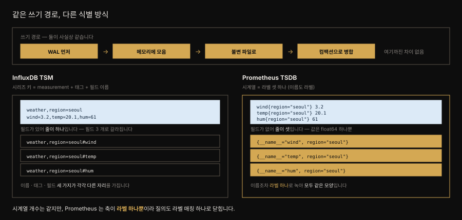
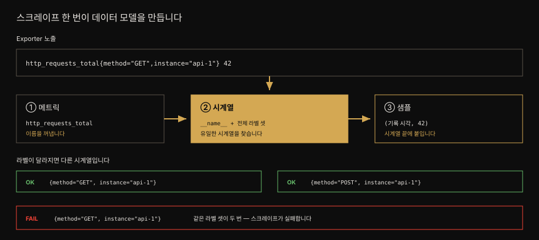
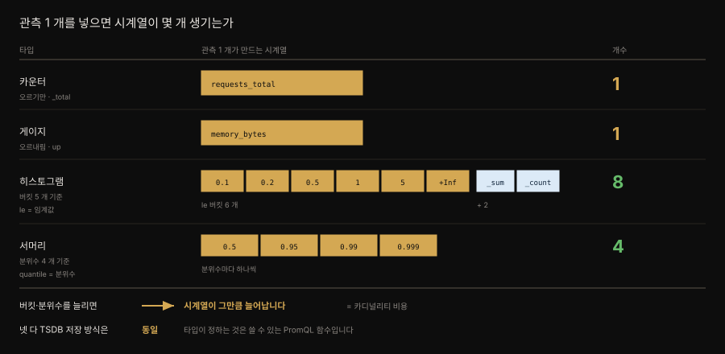
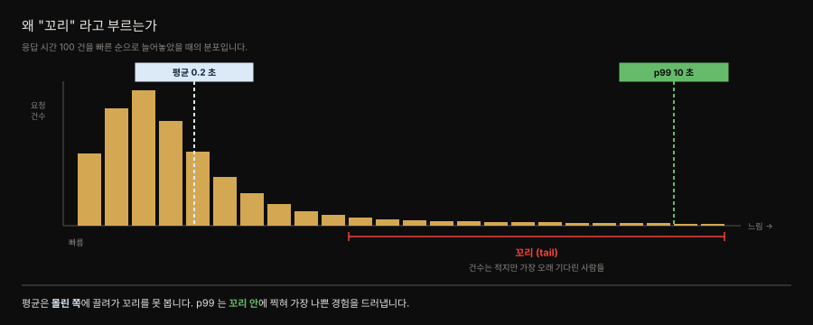

# Prometheus 데이터 모델 — 메트릭·시계열·샘플
---

## 핵심 요약

> 이 절 전체가 매달린 하나의 생각은 **메트릭·시계열·샘플이 서로를 딛고 선 3층 구조**라는 사실입니다.
>
> 메트릭은 이름일 뿐이고 라벨이 붙어야 시계열이 되며 시계열에 (시각, 값) 튜플이 쌓여야 샘플이 됩니다. 이 셋을 알면 왜 스크레이프가 중복 시계열에서 실패하는지, 왜 `rate` 를 게이지에 쓰면 안 되는지가 한 줄로 풀립니다.
>
> 타입 넷(카운터·게이지·히스토그램·서머리)은 저장 방식을 바꾸지 않고 **어떤 PromQL 함수를 쓸 수 있는지**를 정합니다. 그 3층을 디스크에 값싸게 앉히는 이야기는 [03-02. TSDB 쓰기 경로](03-02.TSDB%20쓰기%20경로.md) 이 잇습니다.


## 학습 목표

> 이 절을 읽고 나면 아래 세 가지를 스스로 해낼 수 있습니다.

1. 메트릭·시계열·샘플의 관계를 설명하고 왜 중복 시계열이 스크레이프를 실패시키는지 말할 수 있습니다.
2. 카운터·게이지·히스토그램·서머리를 구분하고 각각에 맞는 PromQL 함수를 고를 수 있습니다.
3. 분위수·꼬리 지연이 무엇인지 설명하고 히스토그램과 서머리 중 무엇을 쓸지 고를 수 있습니다.


## 1. 데이터 모델 3층 — 메트릭, 시계열, 샘플

> 메트릭은 이름뿐이고, 라벨이 붙어 시계열이 되며, 거기에 (시각, 값) 튜플이 쌓여 샘플이 됩니다. 세 타입이 서로를 딛고 섭니다.

관계형 DB 를 먼저 배운 사람은 시계열 데이터를 이런 표로 상상하게 됩니다. 시각 열이 하나 있습니다. 어디서 왔는지를 적는 열이 붙고, 그 옆에 측정값 열이 놓입니다.

| 시각 | 지역 | 풍속 | 기온 |
|---|---|---|---|
| 9:00 | 서울 | 3.2 | 20.1 |
| 9:00 | 부산 | 3.6 | 15.2 |
| 9:05 | 서울 | 3.3 | 20.3 |

**Prometheus 의 로컬 TSDB 는 이 표를 그대로 저장하지 않습니다.** 표 하나를 통째로 두는 대신 **측정 대상마다 따로 쪼개** 시각과 값만 나란히 눕힙니다. 위 표는 행 3 개가 아니라 시계열 4 개가 됩니다.

- `(지역=서울, 풍속)`
- `(지역=서울, 기온)`
- `(지역=부산, 풍속)`
- `(지역=부산, 기온)`

쪼개는 이유는 읽는 방식에 있습니다. 모니터링 질의는 "9시 5분의 모든 값" 을 가로로 훑는 일이 드물고 "서울 기온을 지난 한 시간" 처럼 **한 대상을 세로로 길게** 읽습니다. 같은 대상의 값이 물리적으로 붙어 있으면 그 읽기가 순차 스캔이 되고, 값이 서로 닮은 덕에 압축도 잘 듣습니다. 뒤에 나오는 chunk·압축·인덱스는 전부 이 한 가지 선택에서 파생됩니다.

이렇게 쪼개는 방식 자체는 Prometheus 만의 발명이 아닙니다. 대표적인 선행 사례가 InfluxDB 의 **TSM** 이고, Prometheus 는 그것을 쓰지 않는 쪽을 골랐습니다. 무엇이 달랐는지 먼저 보겠습니다.

### 곁가지 — TSM 과 무엇이 달랐는가

**TSM(Time-Structured Merge Tree)** 은 InfluxDB 의 저장 엔진입니다. 이름 그대로 LSM 트리(쓰기에 유리)를 시간 축에 맞춰 변형한 것으로, 쓰기 처리량과 압축률을 동시에 노립니다.[^tsm]

여기서 중요한 사실은 **쓰기 경로가 Prometheus 와 거의 같다**는 점입니다.

| 단계 | TSM | Prometheus TSDB |
|---|---|---|
| ① 내구성 | WAL 에 먼저 적음 | WAL 에 먼저 적음 |
| ② 메모리 | Cache | head 블록 |
| ③ 디스크 | TSM 파일 (불변·압축·mmap) | 블록 (불변·압축·mmap) |
| ④ 정리 | 컴팩션으로 병합 | 컴팩션으로 병합 |

네 단계가 같습니다. **그러니 Prometheus 가 TSM 을 버린 이유는 쓰기 구조가 아니라 다른 데 있습니다.** 갈리는 지점은 하나, **무엇이 시계열 하나를 정하는가**입니다.



TSM 의 시리즈 키는 **measurement + 태그 셋 + 필드 이름**으로 만들어집니다. 한 지점에 필드가 셋이면 시리즈 키도 셋으로 갈라지고, 이름·태그·필드가 각각 다른 문법 자리를 차지합니다.

Prometheus 는 그 셋을 **하나로 눌렀습니다.** 메트릭 이름조차 `__name__` 이라는 라벨로 넣어, 시계열을 정하는 것은 오직 **라벨 셋 하나**입니다. 필드라는 개념 자체가 없고 값은 `float64` 하나뿐입니다.[^data-model]

그래서 얻는 것이 이렇습니다.

1. **모든 시계열이 같은 모양입니다.** 특별 취급받는 축이 없으니 저장·인덱스가 단순해집니다. [03-03 §2](03-03.TSDB%20저장%20구조.md#2-인덱스--역색인이-질의를-이끕니다) 에서 `__name__` 이 `job`·`quantile` 과 같은 목록에 섞여 세어지는 것을 실측으로 확인합니다.
2. **질의가 라벨 매칭 하나로 닫힙니다.** 이름을 찾는 문법과 태그를 찾는 문법이 따로 필요 없어, PromQL 셀렉터가 `{__name__="x", job="y"}` 한 형태로 통일됩니다.
3. **차원을 늘리는 방법이 라벨 추가 하나뿐입니다.** 대신 라벨 값이 늘어난 만큼 시계열이 곱해지므로, 카디널리티가 곧장 비용이 됩니다(§2 · [03-03 §3](03-03.TSDB%20저장%20구조.md#3-컴팩션과-보존)).

여기서 가져갈 직관은 "표의 열이 여러 시계열로 갈라진다" 하나면 충분합니다. 물리 형식은 아래에서 따로 엽니다.

### 스크레이프 한 번이 만드는 세 층

이제 스크레이프 한 번이 세 층을 어떻게 만드는지 보겠습니다. exposition 한 줄에서 메트릭 이름과 라벨 셋이 시계열을 정합니다. 값과 기록 시각이 그 시계열의 새 샘플이 되며, 명시된 시각이 없으면 Prometheus 가 스크레이프 시각을 붙입니다.

여기서 **누가 언제 이 셋으로 나누는가**를 못박아 둘 값어치가 있습니다. **나누는 주체도 시점도 따로 없습니다.**

| 오해 | 실제 |
|---|---|
| exporter 가 셋으로 나눠 보낸다 | exporter 는 **텍스트 한 줄**을 낼 뿐입니다 |
| Prometheus 가 셋으로 쪼개 저장한다 | 저장되는 것은 **시계열과 샘플뿐**입니다 |
| 세 단계를 거쳐 변환된다 | 변환이 아니라 **같은 한 줄을 세 각도로 부르는 것**입니다 |

`http_requests_total{method="GET"} 42` 라는 한 줄을 놓고 이렇게 부릅니다.

- 이름 부분만 떼어 보면 → **메트릭**
- 이름 + 라벨 전체를 하나의 식별자로 보면 → **시계열**
- 거기 붙는 (시각, 값) 을 보면 → **샘플**

그러니까 **파서가 세 객체를 만드는 것이 아니라, 우리가 한 줄의 어느 부분을 가리키느냐가 이름을 바꿉니다.** 메트릭·시계열·샘플은 **한 번의 수집 결과를 서로 다른 해상도로 부르는 개념 층**입니다. 저장 층에서는 이 어긋남이 더 커져 메트릭이 독립된 자리를 아예 갖지 않는데, 그것은 [§6](03-03.TSDB%20저장%20구조.md#2-인덱스--역색인이-질의를-이끕니다) 에서 실측으로 확인합니다.



그림의 맨 위는 exporter 가 내놓은 한 줄입니다. ①②③ 이 그 한 줄에서 갈라져 나오는 세 층입니다. 가운데 ② 시계열만 칠해 둔 것은 **셋 중 시계열만이 유일성을 요구받는 층**이기 때문입니다. ① 은 이름을 꺼내는 일이고 ③ 은 끝에 붙이는 일이라 실패할 여지가 없습니다. 반면 ② 에서 같은 라벨 셋이 두 번 나오면 스크레이프 자체가 실패합니다. 아래쪽 상자들은 `method` 하나만 달라져도 별개의 시계열이 된다는 것과, 그 라벨마저 같을 때 무엇이 깨지는지를 나란히 보여 줍니다.

세 층이 어디로 흘러가는지는 이 절의 범위를 넘습니다. 순서대로 이어집니다.

- 실제 쓰기 경로는 [§3](03-02.TSDB%20쓰기%20경로.md#1-샘플-하나가-걸어가는-길)으로 이어집니다.
- 물리 파일의 구조는 [§5](03-03.TSDB%20저장%20구조.md#1-블록과-chunk--불변이-모든-것을-결정합니다)에서 엽니다.
- 라벨에서 chunk를 찾는 과정은 [§6](03-03.TSDB%20저장%20구조.md#2-인덱스--역색인이-질의를-이끕니다)에서 다룹니다.

### 메트릭

**메트릭**은 가장 기본이 되는 타입이며 최소한 자기를 식별하는 이름을 가집니다. 이름에는 문자·숫자·밑줄·콜론을 쓸 수 있고 정규식 `[a-zA-Z_:][a-zA-Z0-9_:]*` 를 만족해야 유효합니다. 여기에 `HELP` 텍스트와 `TYPE` 필드를 붙일 수 있는데, 선택 사항이지만 쓰는 쪽의 편의를 위해 강하게 권장됩니다.

```bash
# HELP mastering_prometheus_readers_total Number of readers of this book
# TYPE mastering_prometheus_readers_total counter
mastering_prometheus_readers_total 123467890
```

- **`#` 로 시작하지만 주석이 아닙니다.** 노출 형식 명세는 `#` 로 시작하는 줄을 주석으로 무시하되, `#` 다음 첫 토큰이 `HELP` 또는 `TYPE` 이면 예외로 파싱한다고 규정합니다.[^exposition] 파서가 읽는 **구조화된 메타데이터**입니다.

- `# HELP <메트릭명> <설명>` — 나머지 토큰 전부가 그 메트릭의 docstring
- `# TYPE <메트릭명> <타입>` — 타입은 `counter`·`gauge`·`histogram`·`summary`·`untyped` 중 하나

그러니까 아래 `### 카운터와 게이지` 에서 다루는 네 타입이 곧 이 `TYPE` 줄에 적히는 값입니다. 둘은 다른 이야기가 아닙니다.

읽힌 메타데이터는 버려지지 않고 **대상별로 보관되어 API 로 조회됩니다.** `/api/v1/targets/metadata` 는 대상마다의 `type`·`help`·`unit` 을 돌려주고, `/api/v1/metadata` 는 메트릭 이름별로 묶어 돌려줍니다. 같은 이름인데 대상마다 `HELP` 가 다르면 항목이 여러 개로 잡히기도 합니다.[^metadata-api]

다만 **영향 범위가 거기까지입니다.**

| 무엇에 | `TYPE` 의 영향 |
|---|---|
| TSDB 저장 방식 | **없음** — 네 타입 전부 같은 방식으로 저장 |
| 샘플 값·타임스탬프 | **없음** — 어느 타입이든 `float64` + 밀리초 |
| 메타데이터 API | 있음 — 조회되는 값이 됨 |
| PromQL 함수 선택 | 있음 — 판단 근거 |

- `rate` 나 `histogram_quantile` 은 특정 타입을 전제로 설계된 함수입니다. 여기서 함정이 하나 나옵니다 — **Prometheus 는 `TYPE` 을 보고 함수를 막지 않습니다.**
- 게이지에 `rate` 를 써도 질의는 통과하고 숫자가 나옵니다. 그 숫자가 틀렸을 뿐입니다. 즉 `TYPE` 은 사람과 도구가 읽는 **판단 근거**이지 런타임 강제가 아닙니다.

### 시계열

**시계열**은 메트릭 위에 섭니다. 메트릭 하나가 시계열 수십 개를 가질 수 있는데 그 수단이 **라벨**입니다. 라벨은 메트릭에 상세함을 더하는 키/값 쌍입니다.

```bash
# 메트릭 — 이름뿐입니다
node_cpu_seconds_total

# 시계열 — 라벨로 특정됩니다
node_cpu_seconds_total{cpu="0",instance="serverA"}
```

저자는 메트릭을 그저 이름으로, 중괄호 안의 것은 시계열로 생각한다고 적습니다. 객체지향에 익숙하다면 **메트릭이 기반 클래스이고 시계열은 그 클래스의 유일한 인스턴스**입니다. 이 유일성이 중요합니다.

**한 대상의 한 번의 스크레이프 결과에서 최종 라벨 셋이 같은 시계열은 하나뿐이어야 합니다.** 같은 메트릭 이름을 가진 시계열은 하나의 `HELP`/`TYPE` 정의 아래 묶입니다. 그 아래에서 각자 유일한 라벨을 가져야 하고, 유일하지 않으면 **스크레이프가 실패합니다.** 같은 잡의 다른 대상은 보통 `instance` 같은 대상 라벨로 구분됩니다.

```bash
# 무효 — 같은 시계열이 라벨 구분 없이 중복됩니다
mastering_prometheus_readers_total 123467890
mastering_prometheus_readers_total 789

# 유효 — 라벨이 시계열을 갈라 줍니다
mastering_prometheus_readers_total{stage="published"} 123467890
mastering_prometheus_readers_total{stage="draft"} 789
```

### 샘플

**샘플**은 시계열 위에 섭니다. Prometheus 가 대상을 긁을 때마다 그 대상이 돌려준 모든 시계열의 샘플을 모읍니다.

샘플은 지극히 단순합니다. **타임스탬프와 값의 튜플**이 전부이며 흔히 `(t0, v0), (t1, v1), ...` 로 적습니다.

| 구성 요소 | 표현 |
|----------|------|
| 값 | Go 의 `float64` — 소수점을 가집니다 |
| 타임스탬프 | Unix 에폭(1970년 1월 1일)부터의 **밀리초** |

여기까지가 **개념**입니다. 이 셋이 디스크에 그대로 세 덩어리로 앉는 것은 아닙니다 — **저장 층에서 메트릭은 독립된 자리를 갖지 않고 라벨 하나로 녹습니다.** 그 어긋남이 어떻게 생기는지는 인덱스를 다룬 뒤에야 맞춰 볼 수 있어 [§6](03-03.TSDB%20저장%20구조.md#2-인덱스--역색인이-질의를-이끕니다) 으로 미룹니다.


## 2. 메트릭 타입 네 가지

> 카운터·게이지·히스토그램·서머리. 타입은 저장 방식을 바꾸지 않지만 **어떤 PromQL 함수를 쓸 수 있는지**를 정합니다.

넷을 가르는 기준은 여러 가지로 잡을 수 있지만, 저장 쪽에서 보면 축이 하나로 좁혀집니다. **관측 하나가 시계열 몇 개가 되는가**입니다.



| 타입 | 관측 1 개 → 시계열 | 값의 움직임 | 쓰는 곳 |
|---|---|---|---|
| 카운터 | 1 개 | 오르기만 | 요청 수, 오류 개수 |
| 게이지 | 1 개 | 오르내림 | 커넥션 수, 메모리 사용량 |
| 히스토그램 | **버킷 수 + 2** | 버킷마다 카운터 | 지연 분포, SLO |
| 서머리 | **분위수 개수** | 관측마다 재계산 | 단일 인스턴스 지연 |

> 뒤 두 타입에 나오는 **분위수**는 아래 `### 먼저 — 분위수가 무엇입니까` 에서 풀어 씁니다. 지금은 "응답 시간을 줄 세웠을 때 몇 번째 값" 정도로 두고 넘어가도 됩니다.

카운터와 게이지는 관측 하나가 시계열 하나로 그대로 남습니다. 히스토그램과 서머리는 관측 하나가 **여러 시계열을 동시에** 건드립니다. §1 에서 본 "메트릭 하나가 시계열 여럿"이 여기서 타입의 문제로 되돌아오는 셈입니다.

### 카운터와 게이지

- **카운터** — 0 에서 시작해 프로세스가 사는 동안 오르기만 합니다. 이름이 `_total` 로 끝나는 관례로 알아봅니다.
- **게이지** — 오르내릴 수 있다는 점만 다릅니다. 불리언에도 흔히 쓰여, 내장 메트릭 `up` 은 `0` 이면 잡이 죽었고 `1` 이면 살았다는 뜻입니다.
- **정보성 메트릭(`_info`)** — 게이지의 관용입니다. 값을 언제나 `1` 로 고정하고 **정보는 라벨에 싣습니다.** `prometheus_build_info` 가 `version` 라벨로 버전을 알리는 식이며, [03-04. PromQL 기초](03-04.PromQL%20기초.md) 의 `group_left` 와 곧장 이어집니다.

### 먼저 — 분위수가 무엇입니까

히스토그램과 서머리를 가르는 말이 **분위수**라, 이 말부터 풀고 갑니다.

요청 100 건의 응답 시간을 쟀다고 합시다. 이 100 개를 **빠른 것부터 느린 것까지 한 줄로 세웁니다.** 그중 몇 번째 사람의 값을 볼 것인지가 분위수입니다.

| 분위수 | 줄 세운 100 명 중 | 읽는 법 |
|---|---|---|
| p50 (0.5) | 50 번째 사람의 값 | 절반은 이보다 빨랐습니다 |
| p95 (0.95) | 95 번째 사람의 값 | 95 %는 이보다 빨랐습니다 |
| p99 (0.99) | 99 번째 사람의 값 | 가장 느린 1 명만 이보다 느렸습니다 |

`0.99` 처럼 0 과 1 사이 소수로 적고, 백분율로 바꿔 `p99` 라 부릅니다. 둘은 같은 말입니다.

**왜 평균 대신 이걸 봅니까.** 평균은 소수의 느린 요청을 다수의 빠른 요청이 덮어 버립니다.

- 응답 시간이 99 건은 0.1 초인데 1 건이 10 초라면 평균은 0.2 초입니다 — 지표만 보면 멀쩡합니다. 그러나 그 1 명은 10 초를 기다렸습니다.
- p99 는 그 사람의 값을 그대로 보여 주므로 **가장 나쁜 경험이 지표에 남습니다.**

> 💬 **비유**: 평균은 "우리 반 평균 키", 분위수는 "키 순서로 세웠을 때 95 번째 학생의 키" 입니다. 앞은 한 명의 거인이 전체를 끌어올리지만, 뒤는 "대부분이 이 키 이하" 라는 사실을 알려 줍니다.

### 꼬리 지연 — 분포의 오른쪽 끝

방금 그 10 초짜리 요청이 있는 자리를 **꼬리(tail)** 라 부릅니다. 이름은 분포의 생김새에서 왔습니다.



응답 시간을 빠른 순으로 늘어놓으면 **대부분이 왼쪽에 봉우리로 몰리고, 오른쪽으로 길고 얇게 늘어집니다.** 이 늘어진 부분이 짐승 꼬리처럼 보인다고 해서 꼬리입니다. **꼬리 지연(tail latency)** 은 그 구간에 있는 요청들의 응답 시간을 가리킵니다.

꼬리가 성가신 이유는 **건수가 적다는 바로 그 점** 때문입니다.

1. **평균에 거의 안 잡힙니다.** 100 건 중 1 건이 10 초여도 평균은 0.2 초로 멀쩡합니다. 평균만 보는 대시보드는 이 장애를 영영 못 봅니다.
2. **그런데 사용자는 겪습니다.** 1 %라도 하루 100 만 요청이면 1 만 번입니다. 게다가 한 화면이 API 를 10 개 호출하면 그중 하나만 꼬리에 걸려도 화면 전체가 느려지므로, 체감 확률은 1 %보다 훨씬 높아집니다.
3. **원인이 평상시와 다릅니다.** GC 정지, 락 경합, 캐시 미스, 재시도처럼 **가끔 터지는 것들**이 꼬리를 만듭니다. 평균을 끌어올리는 원인(전반적 부하)과 달라서, 꼬리를 봐야만 보이는 문제가 따로 있습니다.

그래서 SLO 는 평균이 아니라 **p95·p99 로 씁니다.** "평균 응답 0.2 초" 대신 "요청의 99 %를 1 초 안에" 라고 적으면, 위 1 건이 곧바로 위반으로 잡힙니다. §13 의 SLO 문서가 이 지점에서 출발합니다.

> ⚠️ 꼬리를 보려면 **분포를 갖고 있어야** 합니다. 평균과 합계만 저장하면 되돌릴 수 없습니다. 히스토그램이 버킷별 개수를 남기는 이유가 이것이고, 다음 두 절의 선택이 여기서 갈립니다.

이제 히스토그램과 서머리는 **이 값을 누가 언제 계산하느냐**로 갈립니다.

### 히스토그램 — 카운터 여러 개의 묶음

관측값을 **버킷**에 세어 넣습니다. 버킷은 `le`(less than or equal) 라벨로 임계값을 나눕니다. 관측값이 임계값 **이하**인 모든 버킷이 1 씩 오릅니다.

버킷이 `[0.1, 0.2, 0.5, 1, 5]` 인 경우입니다.

| 관측된 지연 | 증가하는 버킷 | 왜 |
|------------|--------------|-----|
| 0.6 초 | `le="1"`, `le="5"`, `le="+Inf"` | 0.6 이 세 임계값 이하 |
| 0.05 초 | 모든 버킷 | 0.05 가 모든 임계값 이하 |

포인트는 **분위수를 저장하지 않는다**는 것입니다. 저장하는 것은 "0.5 초 이하가 몇 건" 같은 **개수**뿐입니다. 개수만 있으면 "위에서 1 % 지점이 어느 버킷에 걸리는가" 를 되짚어 분위수를 낼 수 있고, 그 계산을 질의할 때 서버가 `histogram_quantile()` 로 합니다.

핵심 세 가지입니다.

1. `le="+Inf"` 버킷은 모든 관측이 올리므로 전체 카운터 노릇을 합니다. 그래서 `<name>_count` 는 `<name>_bucket{le="+Inf"}` 와 같습니다.
2. `<name>_sum` 은 관측값 전부의 합입니다.
3. 복잡함을 감수하는 이유는 하나입니다 — 개수를 갖고 있으니 **분위수를 나중에, 원하는 대로 계산할 수 있습니다.**

### 서머리 — 분위수를 미리 계산

서머리는 반대로 갑니다. **앱이 미리 계산해 답만 내보냅니다.** `le` 대신 `quantile` 라벨이 붙고, 값은 개수가 아니라 이미 계산된 초 단위 응답 시간입니다.

```bash
# 히스토그램 — "0.5 초 이하가 847 건" (개수)
http_duration_bucket{le="0.5"} 847

# 서머리 — "p99 는 1.87 초" (계산된 답)
http_duration{quantile="0.99"} 1.87
```

그래서 버킷 경계가 아니라 **분위수 목록을 먼저 정해야 합니다.** `[0.5, 0.9, 0.99]` 를 지정했다면 나중에 p95 가 궁금해져도 얻을 수 없습니다 — 앱이 계산하지 않았기 때문입니다. 각 값은 관측이 있을 때마다 다시 계산됩니다. 저자는 서머리가 실무에서 가장 덜 쓰이며 아주 특정한 용례에 머문다고 적습니다.

### 히스토그램 대 서머리 — 분위수를 어디서 계산하는가

둘은 같은 질문("지연이 얼마나 느린가")에 답합니다. **분위수 계산 위치** 하나가 나머지를 전부 정합니다.

| | 히스토그램 | 서머리 |
|---|---|---|
| 라벨 | `le` (임계값) | `quantile` (분위수) |
| 노출하는 값 | 버킷별 **개수** | 이미 계산된 **분위수 값** |
| 분위수 계산 주체 | 질의 시 **Prometheus** 서버 | 스크레이프 전 **애플리케이션** |
| 미리 정할 것 | 버킷 경계 | 분위수 목록 |
| 나중에 다른 분위수 | **가능** | 불가능 |
| 여러 인스턴스 합산 | **가능** | **불가능** |
| 비용 | 서버 질의 부담 · 버킷마다 시계열 | 앱 계산 부담 · 시계열 적음 |

합산 가능 여부가 실무에서 가장 크게 갈리는 지점입니다. 서버가 세 대라고 해 봅시다.

**버킷은 더해집니다.** `le="1"` 이 각각 78·65·91 건이면 전체는 **234 건**입니다. "1 초 이하가 234 건" — 여전히 말이 됩니다.

**분위수는 더해지지 않습니다.** p99 가 각각 1.87·2.03·1.55 초일 때, 셋을 더한 5.45 초도 평균 낸 1.82 초도 전체 p99 가 아닙니다. 전체 p99 란 **세 서버의 요청을 한 줄로 다시 세웠을 때 위에서 1 % 지점**인데, 각 서버는 자기 등수만 알지 남의 요청이 어디 끼어드는지 모릅니다.

원자료를 이미 버린 것이 원인입니다. 히스토그램은 개수를 갖고 있어 세 대의 같은 버킷을 더하면 전체 분포가 복원되지만, 서머리는 계산이 끝난 숫자만 남겨 되돌릴 수 없습니다.

그래서 인스턴스가 여러 대인 서비스에서는 히스토그램을 씁니다.

> 📌 실측한 Jenkins 인스턴스가 그 예입니다.
>
> 라벨 이름 18 개 중 `quantile` 이 있고 라벨 쌍으로는 126 건이 잡히는데(`quantile="0.5"`·`"0.75"`·`"0.95"`·`"0.98"`·`"0.99"`·`"0.999"`), **`le` 라벨과 `_bucket` 시계열은 하나도 없었습니다.** 서머리만 노출하고 히스토그램은 쓰지 않는 계측인 셈입니다. 위 그림의 히스토그램 쪽은 책의 서술이고 이 인스턴스에서 확인한 것은 서머리 쪽입니다(2026-07-29 실측).


## 결정 치트시트

> 이 절이 남기는 판단 기준입니다.

| 상황 | 선택 | 이유 |
|------|------|------|
| 오르기만 하는 값(요청 수·오류 수) | 카운터 (`_total`) | `rate`·`increase` 가 이 타입을 전제 |
| 오르내리는 값(메모리·커넥션) | 게이지 | `delta`·`changes` 를 씀. `rate` 금지 |
| 지연 분포·SLO·꼬리 지연 | 히스토그램 | 버킷이 있어야 분위수 계산 가능 |
| 분위수를 클라이언트에서 미리 계산 | 서머리 | 실무 사용 빈도 낮음. 특정 용례에 한정 |
| 앱·서버의 부가 정보 노출 | `_info` 게이지 (값 = 1) | 라벨에 정보를 싣고 곱셈으로 조인 |
| 스크레이프가 실패함 | 중복 시계열부터 의심 | 같은 이름 + 같은 라벨 = 실패 |
| 인스턴스가 여러 대인 지연 측정 | 히스토그램 (서머리 금지) | 분위수는 더할 수 없음. 버킷은 더해짐 |
| 나중에 다른 분위수도 볼 것 같음 | 히스토그램 | 서머리는 미리 정한 분위수만 남김 |
| 이 데이터를 TSDB 에 둘지 판단 | 다섯 전제로 판별 | 하나라도 어긋나면 RDB — [03-02](03-03.TSDB%20저장%20구조.md#언제-tsdb-를-고릅니까--남을-설득하는-판별법) |

> 저장 쪽 판단(재시작·블록 크기·보존·삭제)은 [03-02. TSDB 쓰기 경로](03-03.TSDB%20저장%20구조.md#결정-치트시트) 에 있습니다.


## Spring 앱 개발 관점

> 이 절에는 Spring 예제가 없습니다. 아래는 데이터 모델·메트릭 타입이 Micrometer 에서 어디에 대응하는지이며 타입 선택이 곧 PromQL 함수 선택을 정한다는 본문의 논리를 코드로 옮겼습니다.

본문이 말한 "타입은 저장을 바꾸지 않지만 어떤 함수를 쓸지 정한다"는 규칙이 Spring 에서는 **Micrometer 타입 선택**으로 나타납니다. 잘못 고르면 대시보드가 조용히 틀린 값을 보여줍니다.

```java
// 카운터 — 오르기만 합니다. PromQL 에서 rate()·increase() 로 읽습니다
Counter orders = Counter.builder("orders_placed_total")   // _total 관례를 지킵니다
        .description("주문 생성 건수")
        .register(registry);
orders.increment();

// 게이지 — 오르내립니다. rate() 를 쓰면 안 되고 delta()·changes() 를 씁니다
Gauge.builder("order_queue_depth", queue, Collection::size)
        .description("대기 중인 주문 수")
        .register(registry);

// 타이머 — 노출 시 히스토그램(le 버킷)이 됩니다. histogram_quantile() 로 분위수를 냅니다
Timer.builder("order_processing_seconds")
        .publishPercentileHistogram()      // 버킷을 내보내 서버에서 분위수를 계산합니다
        .register(registry);
```

여기서 Spring 개발자가 자주 밟는 지뢰가 셋입니다.

**첫째, `publishPercentiles` 와 `publishPercentileHistogram` 은 다릅니다.** 전자는 클라이언트가 분위수를 미리 계산해 `quantile` 라벨로 냅니다. 본문의 **서머리**에 해당하며 여러 인스턴스의 값을 서버에서 합산할 수 없습니다. 후자는 `le` 버킷을 내보내는 **히스토그램**이라 `histogram_quantile()` 로 클러스터 전체 분위수를 낼 수 있습니다. 인스턴스가 여럿이면 후자가 맞습니다.

**둘째, 라벨 카디널리티가 시계열 수입니다.** 본문의 "메트릭 하나가 시계열 수십 개" 는 라벨 조합 수를 말합니다. 태그에 사용자 ID 나 요청 URL 원문을 넣으면 시계열이 폭발합니다. Spring MVC 의 `http_server_requests` 가 `uri` 태그에 `/orders/{id}` 같은 **경로 템플릿**을 쓰는 이유가 이것입니다.

**셋째, 값이 0 이어도 계속 내보내야 합니다.** staleness 는 [03-04. PromQL 기초](03-04.PromQL%20기초.md) 가 다루지만 뿌리는 여기 있습니다. 어떤 조건에서만 등록되는 카운터는 그 조건이 없는 동안 시계열이 사라져 그래프에 구멍을 냅니다. 애플리케이션 기동 시 `Counter` 를 미리 등록해 0 부터 내보내는 편이 안전합니다.


## 면접 대비

> 이 절에서 면접에 그대로 쓸 수 있는 문장입니다.

### 한 줄 정의

Prometheus 의 데이터 모델은 **이름뿐인 메트릭**, 여기에 라벨이 붙어 유일해진 **시계열**, 그리고 그 시계열에 쌓이는 **(시각, 값) 샘플** 로 이뤄진 3층 구조입니다.

### 핵심 포인트 3가지

1. **`TYPE` 은 저장을 바꾸지 않고 해석을 바꿉니다.** TSDB 는 네 타입을 똑같이 저장합니다. 타입이 존재하는 이유는 `rate` 나 `histogram_quantile` 처럼 특정 타입을 전제한 함수를 올바로 고르게 하기 위해서입니다. 게이지에 `rate` 를 쓰면 값이 틀립니다.
2. **WAL 이 먼저이고 메모리가 나중입니다.** 샘플은 head chunk 에 들어가기 전에 WAL 에 적힙니다. 그래서 프로세스가 죽어도 데이터를 잃지 않고 WAL 은 오직 재시작 시 상태 복원에만 읽힙니다.
3. **블록은 불변이라 삭제가 표시로 대체됩니다.** 시계열을 지우려고 블록을 다시 쓰는 비용이 크기 때문에 툼스톤으로 "읽을 때 무시" 표시만 남기고 툼스톤이 시계열의 5% 를 넘을 때 비로소 컴팩션이 블록을 다시 씁니다.

### 자주 묻는 질문

**Q. 히스토그램과 서머리는 언제 갈립니까?**
A. 분위수를 어디서 계산하느냐로 갈립니다. 히스토그램은 `le` 버킷만 내보내고 분위수는 질의 시점에 서버가 계산하므로 여러 인스턴스를 합산할 수 있습니다. 서머리는 클라이언트가 미리 계산한 `quantile` 라벨을 내보내므로 합산이 안 됩니다. 그래서 서머리는 실무에서 가장 덜 쓰입니다.

**Q. 스크레이프 주기가 들쭉날쭉하면 왜 디스크를 더 씁니까?**
A. chunk 는 타임스탬프를 델타의 델타로, 값을 앞 값과의 XOR 로 저장합니다. 주기가 일정하면 타임스탬프 델타가 0 이라 압축이 잘 듭니다. 주기가 흔들리면 그 0 이 깨져 압축률이 떨어지고 블록이 예상보다 커집니다.

**Q. 라벨 셀렉터가 여럿인 질의는 어떻게 처리됩니까?**
A. 포스팅 인덱스가 라벨/값 쌍마다 시리즈 ID 목록을 들고 있고 매처가 여럿이면 그 목록들의 교집합을 취합니다. 그렇게 좁힌 시리즈를 시리즈 인덱스에서 찾아 시간 범위에 걸친 chunk 참조를 얻고 그 참조로 chunk 를 읽어 샘플을 돌려줍니다.


## 핵심 개념 체크리스트

> 덮고 나서 스스로 물어볼 항목입니다. 막히는 곳이 그 절로 돌아갈 지점입니다.

- [ ] 메트릭·시계열·샘플이 서로를 딛고 선 관계를 설명할 수 있는가?
- [ ] 같은 이름 + 같은 라벨의 시계열이 스크레이프를 실패시키는 이유를 아는가?
- [ ] 셋으로 나누는 주체가 따로 없다는 것 — 한 줄을 세 각도로 부르는 것임을 말할 수 있는가?
- [ ] TSM 과 갈리는 지점이 쓰기 경로가 아니라 **무엇이 시계열을 정하는가** 임을 아는가?
- [ ] `HELP`/`TYPE` 이 주석이 아니라 파싱되는 메타데이터라는 것을 아는가?
- [ ] `TYPE` 이 저장이 아니라 함수 선택에 영향을 준다는 점을 말할 수 있는가?
- [ ] 분위수가 무엇이고 왜 평균 대신 p99 를 보는지 설명할 수 있는가?
- [ ] `le="+Inf"` 버킷과 `_count` 의 관계를 설명할 수 있는가?
- [ ] 히스토그램은 인스턴스 합산이 되고 서머리는 안 되는 이유를 아는가?
- [ ] `_info` 메트릭의 값이 왜 항상 1 인지 아는가?

> 저장 구조(WAL·chunk·블록·인덱스·컴팩션)에 대한 체크리스트는 [03-02. TSDB 쓰기 경로](03-03.TSDB%20저장%20구조.md#핵심-개념-체크리스트) 에 있습니다.


## 참고 자료

> 본문의 사실을 확인한 1차 자료입니다.

- 원본: *Mastering Prometheus* (Packt, ISBN 9781805125662) 3장 앞부분 — Prometheus's data model.
- 공식 문서: [데이터 모델](https://prometheus.io/docs/concepts/data_model/) · [메트릭 타입](https://prometheus.io/docs/concepts/metric_types/) · [노출 형식](https://prometheus.io/docs/instrumenting/exposition_formats/) · [HTTP API — 메타데이터](https://prometheus.io/docs/prometheus/latest/querying/api/)
- 대조군: [InfluxDB TSM 저장 엔진](https://docs.influxdata.com/influxdb/v1/concepts/storage_engine/) — 시리즈 키가 measurement·태그·필드로 만들어진다는 규정
- 실측 근거: 로컬 Prometheus v2.55.1 (jenkins-prometheus 컨테이너) — §2 의 `quantile` 라벨 126 건 (2026-07-29)
- 관련 노트: [README (책 MOC)](README.md) · [03-02. TSDB 쓰기 경로](03-02.TSDB%20쓰기%20경로.md) · [03-04. PromQL 기초](03-04.PromQL%20기초.md) · [01-01. 관측 가능성·모니터링·Prometheus의 자리](01-01.관측%20가능성·모니터링·Prometheus의%20자리.md)


## 관련 문서

> 이 절에서 이어지는 갈래입니다.

| 문서 | 이 절과 어떻게 이어지는가 |
|------|------------------------|
| [03-04. PromQL 기초](03-04.PromQL%20기초.md) | 같은 3장의 뒷절입니다. 여기서 세운 메트릭 타입이 곧 `rate`·`histogram_quantile` 의 사용 조건이 되고, 5절의 staleness 도 거기서 다룹니다 |
| [02-01. Prometheus 배포](02-01.Prometheus%20배포%20—%20스택%20구성요소와%20Operator.md) | 이 절의 TSDB 플래그(`--storage.tsdb.*`)를 실제로 어디에 적는지 — Operator 의 `Prometheus` CR 와 Helm 값 |
| [01-01. 관측 가능성·모니터링·Prometheus의 자리](01-01.관측%20가능성·모니터링·Prometheus의%20자리.md) | 왜 메트릭이 1순위 신호인지. 이 절의 3층 데이터 모델이 그 선택의 결과입니다 |
| [07-01. 최적화와 디버깅](07-01.최적화와%20디버깅.md) | 카디널리티가 곧 시계열 수라는 2절·6절의 논리가 실제 튜닝으로 이어집니다 |
| [09-01. remote write 와 remote read](09-01.remote%20write%20와%20remote%20read%20—%20프로토콜·에이전트·튜닝.md) | 보존 한계를 넘길 때의 출구. 이 절의 블록·압축이 원격 저장소로 어떻게 넘어가는지 |
| [00-01. 용어집](00-01.용어집.md) | chunk·블록·포스팅·툼스톤 등 이 절이 쏟아낸 용어의 정의 |
| [02-05. Grafana Mimir](../../02_LGTMStack/02-05.Grafana%20Mimir.md) | 델타-오브-델타·XOR 압축을 물려받은 원격 저장소 계열 |


[^data-model]: Prometheus — 데이터 모델과 로컬 스토리지 형식. 메트릭 이름을 `__name__` 라벨로 포함한 라벨 셋이 시계열을 식별한다는 규정과 chunk·블록 저장 형식.
<https://prometheus.io/docs/concepts/data_model/> · <https://prometheus.io/docs/prometheus/latest/storage/>

[^tsm]: InfluxData — TSM(Time-Structured Merge Tree) 저장 엔진. WAL·Cache·TSM 파일·컴팩션 구성과, 시리즈 키가 measurement·태그 셋·필드 이름으로 만들어진다는 규정.
<https://docs.influxdata.com/influxdb/v1/concepts/storage_engine/>

[^exposition]: Prometheus — 노출 형식 명세. `#` 로 시작하는 줄은 주석이나, 첫 토큰이 `HELP` 또는 `TYPE` 이면 파싱 대상이 된다는 규정과 각 줄의 토큰 구조.
<https://prometheus.io/docs/instrumenting/exposition_formats/>

[^metadata-api]: Prometheus — HTTP API 의 메트릭 메타데이터 조회. `/api/v1/targets/metadata` 와 `/api/v1/metadata` 가 대상별·이름별로 `type`·`help`·`unit` 을 돌려준다는 규정(실험적 기능).
<https://prometheus.io/docs/prometheus/latest/querying/api/>
