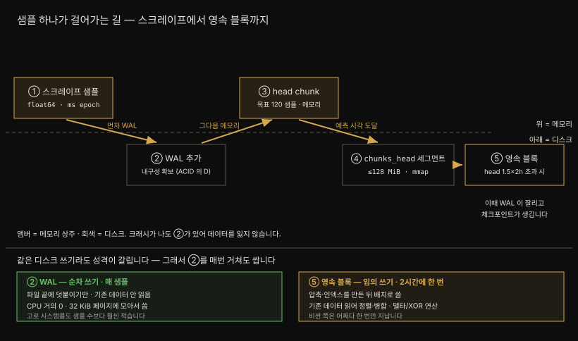
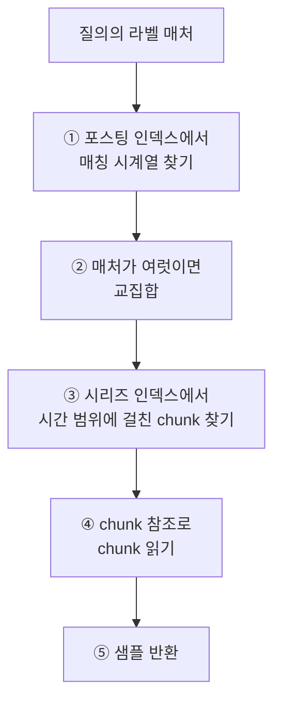

# 3-1. Prometheus 데이터 모델과 TSDB
---


## 핵심 요약

> 이 절 전체가 매달린 하나의 생각은 **메트릭·시계열·샘플이 서로를 딛고 선 3층 구조이며 TSDB 의 모든 설계가 그 3층을 값싸게 저장하려는 선택**이라는 사실입니다.
>
> 메트릭은 이름일 뿐이고 라벨이 붙어야 시계열이 되며 시계열에 (시각, 값) 튜플이 쌓여야 샘플이 됩니다. 이 셋을 알면 왜 스크레이프가 중복 시계열에서 실패하는지, 왜 `rate` 를 게이지에 쓰면 안 되는지가 한 줄로 풀립니다.
>
> TSDB 는 그 샘플을 WAL 에 먼저 적고 메모리 head chunk 에 쌓다가 디스크로 내립니다. 블록은 불변이라 삭제는 툼스톤으로 표시만 하고 작은 블록은 컴팩션으로 합칩니다. 내구성·불변성·압축이라는 세 제약이 이 구조를 전부 설명합니다.


## 학습 목표

> 이 절을 읽고 나면 아래 다섯 가지를 스스로 해낼 수 있습니다.

1. 메트릭·시계열·샘플의 관계를 설명하고 왜 중복 시계열이 스크레이프를 실패시키는지 말할 수 있습니다.
2. 카운터·게이지·히스토그램·서머리를 구분하고 각각에 맞는 PromQL 함수를 고를 수 있습니다.
3. 샘플 하나가 WAL 에서 영속 블록까지 가는 경로를 그림으로 그릴 수 있습니다.
4. 블록이 불변이라는 제약이 툼스톤·컴팩션·보존 정책을 어떻게 규정하는지 설명할 수 있습니다.
5. 인덱스(포스팅·시리즈)를 거쳐 질의가 샘플에 도달하는 5단계를 나열할 수 있습니다.


## 1. 데이터 모델 3층 — 메트릭, 시계열, 샘플

> 메트릭은 이름뿐이고, 라벨이 붙어 시계열이 되며, 거기에 (시각, 값) 튜플이 쌓여 샘플이 됩니다. 세 타입이 서로를 딛고 섭니다.

Prometheus 의 데이터 모델은 서로를 딛고 선 세 타입으로 이뤄집니다. **메트릭**, **시계열**, **샘플** 입니다.

**메트릭**은 가장 기본이 되는 타입이며 최소한 자기를 식별하는 이름을 가집니다. 이름에는 문자·숫자·밑줄·콜론을 쓸 수 있고 정규식 `[a-zA-Z_:][a-zA-Z0-9_:]*` 를 만족해야 유효합니다. 여기에 `HELP` 텍스트와 `TYPE` 필드를 붙일 수 있는데, 선택 사항이지만 쓰는 쪽의 편의를 위해 강하게 권장됩니다.

```prometheus
# HELP mastering_prometheus_readers_total Number of readers of this book
# TYPE mastering_prometheus_readers_total counter
mastering_prometheus_readers_total 123467890
```

여기서 반직관적인 사실이 하나 나옵니다. **`TYPE` 은 TSDB 의 저장 방식을 전혀 바꾸지 않습니다.** 내부적으로는 전부 똑같이 저장됩니다. 그런데도 타입이 존재하는 이유는 두 가지입니다. 계측용 클라이언트 라이브러리가 공통 타입으로 메트릭을 분류하게 해 주고 **어떤 PromQL 함수를 써야 하는지 판단하게** 해 줍니다. `rate` 나 `histogram_quantile` 같은 함수는 특정 타입에만 동작하도록 설계돼 있어, 설계 의도와 다른 타입에 쓰면 틀리거나 예상 밖인 결과를 돌려줍니다.

**시계열**은 메트릭 위에 섭니다. 메트릭 하나가 시계열 수십 개를 가질 수 있는데 그 수단이 **라벨**입니다. 라벨은 메트릭에 상세함을 더하는 키/값 쌍입니다.

```promql
node_cpu_seconds_total                                  # 메트릭 — 이름뿐입니다
node_cpu_seconds_total{cpu="0",instance="serverA"}      # 시계열 — 라벨로 특정됩니다
```

저자는 메트릭을 그저 이름으로, 중괄호 안의 것은 시계열로 생각한다고 적습니다. 객체지향에 익숙하다면 **메트릭이 기반 클래스이고 시계열은 그 클래스의 유일한 인스턴스**입니다. 이 유일성이 중요합니다.

**스크레이프 잡에 노출되는 모든 시계열은 유일해야 합니다.** 같은 메트릭 이름을 가진 시계열은 하나의 `HELP`/`TYPE` 정의 아래 묶이고 각자 유일한 라벨을 가져야 하며 유일하지 않으면 **스크레이프가 실패합니다.**

```prometheus
# 무효 — 같은 시계열이 라벨 구분 없이 중복됩니다
mastering_prometheus_readers_total 123467890
mastering_prometheus_readers_total 789

# 유효 — 라벨이 시계열을 갈라 줍니다
mastering_prometheus_readers_total{stage="published"} 123467890
mastering_prometheus_readers_total{stage="draft"} 789
```

**샘플**은 시계열 위에 섭니다. Prometheus 가 대상을 긁을 때마다 그 대상이 돌려준 모든 시계열의 샘플을 모읍니다.

샘플은 지극히 단순합니다. **타임스탬프와 값의 튜플**이 전부이며 흔히 `(t0, v0), (t1, v1), ...` 로 적습니다.

| 구성 요소 | 표현 |
|----------|------|
| 값 | Go 의 `float64` — 소수점을 가집니다 |
| 타임스탬프 | Unix 에폭(1970년 1월 1일)부터의 **밀리초** |

## 2. 메트릭 타입 네 가지

> 카운터·게이지·히스토그램·서머리. 타입은 저장 방식을 바꾸지 않지만 **어떤 PromQL 함수를 쓸 수 있는지**를 정합니다.

**카운터**는 가장 단순합니다. 0 에서 시작해 프로세스가 사는 동안 오르기만 합니다. 이름이 `_total` 로 끝나는 관례로 알아봅니다. 오류 개수나 웹 서버가 받은 요청 수에 씁니다.

**게이지**는 값이 오르내릴 수 있다는 점만 다릅니다. 활성 커넥션 수나 메모리 사용량에 씁니다. 불리언 값을 담는 데도 흔히 쓰이는데, 스크레이프 잡의 내장 메트릭 `up` 이 그 예로 `0` 이면 잡이 죽었고 `1` 이면 살았습니다. 또 하나 중요한 관용이 **정보성 메트릭(`_info` 접미사)** 입니다. 값은 언제나 `1` 로 고정하고 **라벨에 정보를 싣습니다.** `prometheus_build_info` 가 `version` 라벨로 실행 중인 버전을 알리는 식입니다. 이 관용은 3-2 절의 `group_left` 와 곧장 이어집니다.

**히스토그램**부터 복잡해집니다. 관측값을 표본으로 삼아 설정 가능한 **버킷**에 세어 넣습니다. 어떤 의미에서 히스토그램은 **카운터 여러 개의 묶음**입니다. 버킷은 `le` 라는 라벨로 임계값을 나눕니다(`le` 는 less than or equal 입니다).

버킷이 `[0.1, 0.2, 0.5, 1, 5]` 인 `http_request_duration_seconds_bucket` 을 예로 들면, 관측값이 임계값 **이하**인 모든 버킷의 카운터가 1 씩 오릅니다.

| 관측된 지연 | 증가하는 버킷 | 왜 |
|------------|--------------|-----|
| 0.6 초 | `le="1"`, `le="5"` | 0.6 이 두 임계값 이하 |
| 0.05 초 | 모든 버킷 | 0.05 가 모든 임계값 이하 |

여기에 `le="+Inf"` 라는 특별한 버킷이 붙습니다. 모든 관측값이 이 버킷을 올리므로 사실상 전체 카운터 노릇을 합니다. 그래서 `<name>_count` 는 `<name>_bucket{le="+Inf"}` 와 같고 `<name>_sum` 은 관측값 전부의 합입니다.

히스토그램이 복잡함을 감수할 값어치가 있는 이유는 하나입니다. **히스토그램 분위수를 계산할 수 있기 때문**이며 꼬리 지연(tail latency)과 SLO 측정에 쓰입니다. 관측값이 버킷에 담겨 있으니 "이 서비스의 99 분위 지연은 얼마인가" 같은 질문에 답할 수 있습니다.

**서머리**도 관측값에서 파생되지만 `le` 라벨 대신 **미리 계산한 `quantile` 라벨**을 냅니다. 그래서 버킷 임계값이 아니라 분위수를 **미리** 정해야 하고 분위수는 0 과 1 사이 값으로 백분율을 뜻합니다(`[0.01, 0.05, 0.5, 0.9, 0.99]` 같은 식). 각 분위수 값은 관측이 있을 때마다 다시 계산됩니다. 저자는 서머리가 실무에서 가장 덜 쓰이며 아주 특정한 용례에 머문다고 적습니다.

## 3. 샘플 하나가 걸어가는 길

> 스크레이프된 샘플은 메모리의 head 블록에 먼저 앉고, chunk 가 차면 디스크로 flush 된 뒤 mmap 으로만 붙들립니다.

TSDB 는 Prometheus 가 하는 모든 일의 중심입니다. 2017년 이래 세 번째 세대이며 최적화와 기능이 꾸준히 붙고 있으나 핵심 동작과 형식은 대체로 그대로입니다.



**head 블록**이 스크레이프된 샘플의 첫 정착지입니다. 메모리에 있는 블록이며 수집 중인 시계열마다 여러 chunk 를 담습니다. 스크레이프 대상과 시계열 수에 따라 수백만 개의 chunk 가 들어갈 수 있습니다.

샘플이 들어오면 그 샘플이 속한 시계열의 활성 chunk 에 덧붙습니다. 여기서 **시계열과 메트릭이 다르다는 사실이 다시 작동합니다.** chunk 는 메트릭이 아니라 시계열마다 생깁니다.

head 블록의 chunk 하나는 **120 샘플**을 목표로 자란 뒤 디스크의 `chunks_head` 디렉토리에 있는 활성 세그먼트 파일로 flush 됩니다. 스크레이프 주기가 30초라면 chunk 하나가 **1시간치 데이터**를 담고 나서 파일로 내려간다는 뜻입니다. 세그먼트 파일 하나는 **128 MiB** 까지 자라고 그다음 파일이 시작됩니다.

> ⚠️ 120 은 **정확한 상한이 아니라 목표치**입니다. 소스의 상수 이름부터 "target number of samples per chunk" 이고([`head.go` L241](https://github.com/prometheus/prometheus/blob/main/tsdb/head.go)), 실제로는 목표의 25% 지점에서 chunk 종료 시각을 예측해 그 시각에 자릅니다. 스크레이프 속도가 빨라져 예측이 빗나가면 **240 샘플(목표의 2배)** 에서 강제로 자릅니다([`head_append.go` L2018~2026](https://github.com/prometheus/prometheus/blob/main/tsdb/head_append.go)). 그래서 실측 chunk 의 샘플 수는 120 근처에 흩어집니다.

> 💬 **비유**: 시계열마다 파일을 만들지 않고 여러 chunk 를 세그먼트 파일에 몰아 담는 방식은 이삿짐 상자와 같습니다. 상자 하나에 든 물건들이 서로 관련이 있을 필요는 없습니다. 그저 그 chunk 가 flush 될 때 마침 열려 있던 상자에 들어갔을 뿐입니다.

flush 된 chunk 는 통째로 메모리에 붙들려 있지 않고 head 블록에 **mmap** 됩니다. head 블록은 그 chunk 의 최소·최대 시각과, 어느 파일의 어느 오프셋에 chunk 가 시작하는지를 담은 참조만 들고 있습니다.

마지막으로 head 블록의 데이터가 **최소 블록 범위의 1.5배**(기본 2시간 기준)를 넘기면 앞의 2시간이 압축되어 디스크의 **영속 블록**으로 쓰입니다. 이때 WAL 이 잘리고 체크포인트가 만들어집니다.

## 4. WAL — 내구성은 여기서 옵니다

> 샘플은 메모리에 앉기 **전에** WAL 에 먼저 적힙니다. 그래서 프로세스가 죽어도 잃지 않고, WAL 은 재시작 복원에만 읽힙니다.

Prometheus v1 에서는 간헐적 체크포인트 사이에 프로세스가 죽으면 메트릭을 잃을 수 있었습니다. v2 의 간판 기능이 **WAL(write-ahead log)** 이었고 그 뒤로는 애플리케이션 수준 크래시로 데이터를 잃을 걱정을 하지 않습니다.

원리는 순서에 있습니다. **샘플은 메모리의 head chunk 에 들어가기 전에 먼저 WAL 에 덧붙습니다.** 쓰기에 내구성(ACID 의 D) 한 겹을 더해 주는 셈입니다. Prometheus 의 WAL 은 오직 이 내구성 보장을 위해 존재하므로, **읽히는 때는 서버가 시작하며 메모리 상태를 복원할 때뿐**입니다.

WAL 도 head chunk 파일처럼 128 MiB 단위로 쪼개 저장되고 파일 이름은 숫자가 순차로 늘어납니다. 영속 블록이 디스크에 쓰이면 그 시간 범위에 해당하는 WAL 부분은 더 필요 없어지므로, head 블록이 잘린 직후 WAL 도 잘립니다. **다만 자르는 방법이 다릅니다.**

head 블록은 시간 범위로 안전하게 지울 수 있지만 WAL 은 그렇지 않습니다. 주어진 WAL 세그먼트 파일의 시간 범위를 알아내는 일이 간단하지 않기 때문입니다. 그래서 Prometheus 는 **세그먼트 파일의 앞 3분의 2 를 그냥 지웁니다.** 그런데 거기에 아직 head 블록에서 잘리지 않은 샘플이 남아 있을 수 있어 완전히 안전하지 않습니다. 이 문제를 풀려고 **지울 세그먼트들로부터 WAL 체크포인트를 만듭니다.**

체크포인트는 "걸러진 WAL" 이며 지워질 세그먼트를 훑으며 다음을 수행합니다.

1. 시계열이 더는 head 에 없으면 그 시리즈 레코드를 버립니다.
2. 잘림이 일어나는 시각보다 이전의 샘플을 버립니다.
3. 그 시각보다 이전의 툼스톤 레코드를 버립니다.
4. 나머지는 순서까지 그대로 둡니다.

**재생(replay)** 은 이 체크포인트 덕에 빨라집니다. 서버가 재시작하면 WAL 을 재생해 종료 전 상태로 데이터 손실 없이 돌아갑니다. 저자는 예전 버전에서 시계열과 샘플이 많을 때 WAL 재생이 30분을 넘는 일을 드물지 않게 봤고 이후 최적화로 같은 서버가 **5분 안팎**에 끝낸다고 적습니다.

재생 순서는 대략 이렇습니다.

1. 디스크에서 mmap 된 chunk 를 적재합니다.
2. 체크포인트 내용을 재생합니다.
3. 체크포인트 이후의 나머지 WAL 세그먼트를 재생합니다.

선택 기능 플래그 `--enable-feature=memory-snapshot-on-shutdown` 을 켜면 순서가 달라집니다. 종료 시점에 메모리의 chunk 데이터를 스냅샷으로 남기므로, 시작할 때 mmap chunk 를 적재하고 스냅샷을 훑어 시리즈를 복원한 뒤 스냅샷 이후의 WAL 만 재생합니다. 스냅샷의 최대 시각이 WAL 의 최대 시각 이상이라 **대개 WAL 재생 자체를 건너뜁니다.**

## 5. 블록과 chunk — 불변이 모든 것을 결정합니다

> 블록은 한 번 쓰이면 고칠 수 없습니다. 이 제약 하나가 툼스톤·컴팩션·압축 방식을 전부 규정합니다.

영속 블록과 영속 chunk 는 head 블록이 잘릴 때 디스크에 쓰입니다. **블록과 chunk 는 불변(immutable)** 이라 한 번 쓰이면 고칠 수 없고 손대려면 블록 전체를 다시 써야 합니다.

블록 하나는 네 조각으로 이뤄집니다.

1. 인덱스 파일
2. chunk 세그먼트 파일들이 든 디렉토리
3. 메타데이터 파일(`meta.json`)
4. 툼스톤 파일

블록 이름은 **ULID**(Universally Unique Lexicographically Sortable Identifier)입니다. 이 넷이 합쳐지면 각 블록은 다른 블록에 기대지 않고 홀로 섭니다. **사실상 블록 하나가 완전히 독립된 데이터베이스**입니다.

**툼스톤**은 불변성이 낳은 타협입니다. 블록이 불변인데 시계열을 지우고 싶을 때, 그 시계열이 든 블록을 전부 다시 쓰는 것은 계산 비용이 큽니다. 그래서 TSDB 는 **읽을 때 무시하라는 표시**만 남깁니다. 툼스톤은 전부-아니면-전무가 아니라 무시할 시계열과 함께 **최소·최대 시각**을 담아 그 시간 범위만 무시하게 합니다.

> ⚠️ 툼스톤 파일은 블록이 만들어져 디스크에 쓰인 뒤에 **수정되는 유일한 파일**입니다.

`meta.json` 에는 블록의 고유 ID, 최소·최대 시각, 샘플·시계열·chunk 수 같은 통계가 들어갑니다.

**chunk** 는 블록의 알맹이이며 `chunks/` 디렉토리의 세그먼트 파일 안에 담깁니다. 저자의 프로덕션 서버에서는 세그먼트 파일 하나에 **400만 개에 가까운 chunk** 가 들어 있습니다. chunk 세그먼트의 최대 크기는 기본 **512 MiB** 이고 `--storage.tsdb.max-block-chunk-segment-size` 플래그로 바꿉니다(최소 1 MiB). 작은 Prometheus 설치에서 512 MiB 기본값이 사전 할당 낭비를 낳을 때 씁니다.

> ⚠️ `chunks` 디렉토리의 **파일 자체가 chunk 가 아닙니다.** 각 파일은 서로 무관한 수많은 chunk 로 이뤄집니다.

압축은 여기서 일어납니다. chunk 는 첫 타임스탬프 `t0` 와 첫 값 `v0` 만 직접 저장합니다. 이후 타임스탬프는 앞 타임스탬프와의 **델타**로 두고 `t2` 부터는 **델타의 델타**가 됩니다. 값은 앞 값과 **비트 XOR** 로 비교해 차이만 저장하고 같으면 0 이 저장됩니다.

왜 이것이 먹힐까요. 스크레이프가 일정한 간격으로 일어난다면 타임스탬프 델타가 전부 0 이 되고 그러면 chunk 데이터가 훨씬 잘 압축됩니다. 반대로 스크레이프 간격이 흔들리면 예상보다 디스크를 많이 먹는 블록이 생깁니다. **스크레이프 주기의 일관성이 곧 저장 비용**입니다.

## 6. 인덱스 — 역색인이 질의를 이끕니다

> 포스팅 인덱스가 라벨로 시리즈 ID 를 좁히고, 시리즈 인덱스가 그 ID 로 chunk 위치를 찾습니다. 질의는 이 두 단을 거쳐 샘플에 닿습니다.

인덱스가 없으면 블록은 쓸모가 없습니다. TSDB 를 읽는 쪽이 어떤 시계열이 블록에 있는지, 그 값들이 어디 있는지 알 길이 없기 때문입니다. 정확히 말하면 인덱스는 **역색인(inverted index)** 입니다.

인덱스는 **시리즈 섹션**, **포스팅 섹션**, **목차(TOC)** 로 이뤄집니다. Label Index 섹션도 있으나 지금은 쓰이지 않고 하위 호환을 위해 남아 있습니다.

**TOC** 는 파일의 앞이 아니라 **끝** 에 있습니다. 인덱스의 진입점이며 다른 섹션이 파일 안 어느 바이트 오프셋에서 시작하는지를 알려 줍니다. 다른 섹션과 달리 구조가 미리 정해져 있어 시계열·라벨 수와 무관하게 **크기가 고정**입니다.

**포스팅** 인덱스는 라벨과, 그 라벨을 가진 시계열 집합의 관계를 저장합니다. 유일한 라벨 조합마다 유일한 시리즈 ID(포스팅)가 주어집니다. "포스팅" 이라는 말은 TSDB 메인테이너 **Ganesh Vernekar** 에 따르면 문서 색인 분야에서 전문 색인이 문서 ID 를 부르던 용어에서 왔을 것이라고 합니다.

라벨 셀렉터가 여럿이면 **교집합**을 씁니다.

```text
{job="kubelet"}      → 시리즈 ID [10, 11, 17]
{env="production"}   → 시리즈 ID [7, 9, 11, 13, 17]
교집합               → [11, 17]   ← 시리즈 인덱스에서 찾아볼 대상
```

**시리즈** 인덱스는 유일한 라벨 셋마다 항목을 가집니다. 여기서 앞서 미룬 사실이 드러납니다. **메트릭 이름은 내부적으로 `__name__` 이라는 라벨로 저장됩니다.** 그래서 시리즈 인덱스의 항목은 `{__name__="node_cpu_seconds_total", job="node_exporter", env="production"}` 처럼 생겼습니다.

각 항목은 라벨 정보, 그 시계열의 데이터를 담은 chunk 개수, 그리고 chunk 마다 최소·최대 시각과 `chunks/` 디렉토리 안 chunk 참조를 담습니다. chunk 의 최소·최대 시각을 인덱스에 둔 이유는 **질의 시간 범위 밖의 chunk 를 읽느라 시간을 낭비하지 않기 위해서** 입니다.

chunk 참조는 `uint64` 인데 절반으로 나눠 씁니다. 8바이트 중 **상위 4바이트는 어느 chunk 세그먼트 파일인지**, **하위 4바이트는 그 파일 안 어느 오프셋에서 chunk 가 시작하는지**를 가리킵니다.

이제 질의 한 번이 걷는 길이 보입니다.



## 7. 컴팩션과 보존

> 작은 블록을 3배씩 키워 합치는 것이 컴팩션이고, 시간·크기 임계를 넘긴 블록을 지우는 것이 보존입니다. 둘 다 1분마다 돕니다.

2시간짜리 블록마다 비슷한 인덱스가 반복되는 것은 낭비입니다. 특히 라벨이 잘 바뀌지 않는(메트릭 churn 이 낮은) 환경에서 그렇습니다. **컴팩션**이 이를 해결합니다.

여러 개의 작고 인접한 블록을 큰 블록 하나로 합치는 것이 컴팩션입니다. 압축된 블록은 **작은 블록 3개 이상**으로 이뤄지며 기본 2시간에서 시작해 **3배씩** 늘어납니다. 즉 블록의 시간 범위가 2h → 6h → 18h → 54h 로 갑니다.

Prometheus 는 **1분마다** 컴팩션 주기를 돌며 할 일이 있는지 "계획"을 세웁니다. 계획은 세 조건을 확인하며 **우선순위도 이 순서**입니다.

| 우선순위 | 조건 | 왜 |
|---------|------|-----|
| 1 | 겹치는 블록이 있는가 | 겹친 블록 질의는 중복 제거가 필요해 비쌈 |
| 2 | 다음 단계 블록을 만들 만큼 작은 블록이 모였는가 | 2시간 블록 3개 이상 → 6시간 블록 |
| 3 | 툼스톤이 블록 시계열의 5% 를 넘는가 | 블록 전체 재작성 비용을 낼 만큼 회수량이 클 때만 |

계획 하나는 세 조건 중 **하나만** 다룹니다. 그래서 조건마다 별도의 컴팩션 실행이 필요하고 여러 번 돌 수 있습니다.

**보존(retention)** 은 컴팩션과 가깝습니다. 역시 1분마다 돌지만 관심사는 삭제이며 TSDB 가 두 임계치 중 하나라도 넘으면 블록을 지웁니다.

| 플래그 | 기본값 | 단위 |
|--------|--------|------|
| `--storage.tsdb.retention.time` | **둘 다 미설정일 때만** `15d` | y, w, d, h, m, s, ms |
| `--storage.tsdb.retention.size` | `0` (비활성) | B, KB, MB, GB, TB, PB, EB (2의 거듭제곱) |

> ⚠️ 시간 기본값 `15d` 에는 **조건이 붙습니다.** 현행 문서는 "이 플래그도 `storage.tsdb.retention.size` 도 설정되지 않았을 때 보존 시간이 `15d` 로 기본 설정된다"고 적습니다([Storage](https://prometheus.io/docs/prometheus/latest/storage/)). 즉 **크기 보존만 켜면 15일 시간 보존은 따라오지 않습니다.** "크기 안전장치만 하나 걸어 두자"고 `retention.size` 만 설정하면 시간 제한이 사라져, 디스크가 찰 때까지 데이터가 무한히 쌓입니다. 시간 제한을 원한다면 **명시적으로 함께 적습니다.**

두 설정은 동시에 적용할 수 있고 이때는 **먼저 걸리는 쪽**이 적용됩니다. 중요한 점은 **보존이 블록 단위로 적용되고 블록의 최대 시각을 기준으로 판단된다**는 사실입니다. 그래서 설정한 보존 기간과 실제로 남는 데이터 길이가 정확히 맞아떨어지지 않습니다.

크기 기반 보존에는 계산에 관한 단서가 하나 더 붙습니다. 실제로 지워지는 것은 **영속 블록뿐**입니다. 그런데 크기를 셀 때는 **WAL 과 mmap 된 `chunks_head` 도 총량에 포함**됩니다. 그래서 디스크 최소 요구량은 `wal` 과 `chunks_head` 가 차지하는 최대 공간입니다.

공식 문서는 보존 크기를 **가용 디스크의 80~85% 이하**로 잡기를 권합니다. 컴팩션이 원본 블록과 새 블록을 잠시 동시에 들고 있기 때문입니다.

크기 기반 보존은 임계치를 넘게 만든 블록과 그보다 오래된 블록을 모두 지웁니다. **오래된 블록부터 지우므로** Prometheus 가 아무 블록이나 무작위로 지울 걱정은 없습니다. 블록은 `meta.json` 의 최대 타임스탬프로 정렬되고 크기를 누적해 가며 삭제 대상을 표시합니다.

저자는 실무에서 시간·크기 기반을 **둘 다** 겁니다. 크기 기반은 Prometheus 가 디스크를 채워 서버를 망가뜨리는 일을 막는 안전장치이며 이상적으로는 걸리지 않아야 합니다. 걸린다면 `prometheus_tsdb_size_retentions_total` 이 오르는 것을 보고 알림을 띄워, 설정한 시간보다 일찍 데이터를 잃고 있음을 알립니다.


## 심화 학습

> 책이 흐릿하게 남긴 지점과 공식 문서로 보강할 내용을 답니다.

**보존 예시 문장은 읽기 나름입니다.** 원문은 54시간 블록이 컷오프에서 삭제되는 예를 듭니다.

| 항목 | 값 |
|------|-----|
| 블록 범위 | `2023-01-01T00:00:00` ~ `2023-01-03T06:00:00` (54시간) |
| 보존 컷오프 | `2023-01-03T05:00:00` |
| 결과 | 블록 전체 삭제 |

원문의 결론은 "leaving you with 53 hours of data less than the configured maximum length of time" 입니다. 이 문장은 쉼표를 어디에 두느냐에 따라 *53시간이 남는다* 로도, *53시간만큼 모자란다* 로도 읽힙니다. 어느 쪽이라고 단정하지 않겠습니다.

확실한 것은 원문이 강조한 **원리**뿐입니다. 보존은 샘플이 아니라 **블록 단위**로 적용되고 판단 기준이 블록의 최대 시각입니다. 그래서 실제 남는 데이터의 길이는 설정값과 어긋납니다.

공식 문서에서 확인되는 사실은 이렇습니다([Storage](https://prometheus.io/docs/prometheus/latest/storage/), [Configuration](https://prometheus.io/docs/prometheus/latest/configuration/configuration/)).

- 시간·크기 보존을 둘 다 걸면 **먼저 걸리는 쪽**이 적용됩니다.
- 만료 블록 정리는 백그라운드로 돌며 **최대 2시간까지 걸릴 수 있습니다.** 디스크가 즉시 줄지 않는다고 놀랄 일이 아닙니다.
- 컴팩션된 블록은 무한히 커지지 않습니다. **보존 기간의 10% 또는 31일 중 작은 값**이 상한입니다. 본문의 2h→6h→18h→54h 는 ×3 규칙이고 이 상한이 그 사다리를 멈춥니다.

**컴팩션 조건 2번의 원문 표기가 새 있습니다.** 원문은 이렇게 적습니다.

> `>=3-hour blocks to make a 6-hour block`, or `>=3 6-hour blocks to make an 18-hour block`

뒤 절은 "6시간 블록 **3개** 이상" 으로 개수를 밝힙니다. 그런데 앞 절은 개수가 빠져 "3시간 블록" 으로 읽힙니다. 3시간 블록은 이 사다리(2h→6h→18h→54h)에 존재하지 않습니다.

앞 절도 **2시간 블록 3개 이상**을 뜻한다고 봅니다. 같은 문단이 "작은 블록 3개 이상" 과 "3배씩" 을 이미 못 박았으니, 뒤 절과 대칭으로 읽는 것이 맞습니다. 본문 표에는 고쳐 적었습니다.

**히스토그램의 다음 세대.** 본문의 히스토그램은 버킷을 미리 정해야 하고 버킷마다 시계열이 생겨 카디널리티를 밀어 올립니다. Prometheus 는 이 문제를 풀려고 **네이티브 히스토그램(native histogram)** 을 들여왔습니다. 버킷을 지수적으로 자동 생성해 시계열 하나로 담습니다.

> ⚠️ **책이 쓰인 뒤 지위가 바뀌었습니다.** 2022년 11월 실험 기능으로 도입돼 v2.40.0 에서 처음 지원됐고, **v3.8.0 부터 정식(stable) 기능**입니다([Native histograms](https://prometheus.io/docs/specs/native_histograms/)). 다만 "정식"이 곧 "기본 켜짐"은 아닙니다. 스크레이프는 여전히 `scrape_native_histograms` 설정으로 명시해야 합니다. 활성화 수단도 옮겨 갔습니다 — v3.8 에서는 기존 `--enable-feature=native-histograms` 플래그가 그 설정을 기본 `true` 로 만드는 역할만 남았고, **v3.9 부터 이 플래그는 완전한 no-op** 이라 `scrape_native_histograms` 를 직접 적어야 합니다.

7장의 카디널리티 제어와 이어 읽으면 좋습니다.

**TSDB 를 더 파려면.** 원문이 거는 링크가 정확합니다.

- TSDB 메인테이너 Ganesh Vernekar 의 연재 — [Prometheus TSDB — The Head Block](https://ganeshvernekar.com/blog/prometheus-tsdb-the-head-block/)
- TSDB 원저자의 최초 설계 글 — [웹 아카이브](https://web.archive.org/web/20210622211933/https://fabxc.org/tsdb/)

본문의 델타-오브-델타·XOR 압축은 Facebook 의 Gorilla 논문 계보입니다. 같은 기법을 이 저장소의 [02-05. Grafana Mimir](../../02_LGTMStack/02-05.Grafana%20Mimir.md) 가 다루는 원격 저장소들도 물려받습니다.


## 결정 치트시트

> 이 절이 남기는 판단 기준입니다.

| 상황 | 선택 | 이유 |
|------|------|------|
| 오르기만 하는 값(요청 수·오류 수) | 카운터 (`_total`) | `rate`·`increase` 가 이 타입을 전제 |
| 오르내리는 값(메모리·커넥션) | 게이지 | `delta`·`changes` 를 씀. `rate` 금지 |
| 지연 분포·SLO·꼬리 지연 | 히스토그램 | 버킷이 있어야 분위수 계산 가능 |
| 분위수를 클라이언트에서 미리 계산 | 서머리 | 실무 사용 빈도 낮음. 특정 용례에 한정 |
| 앱·서버의 부가 정보 노출 | `_info` 게이지 (값 = 1) | 라벨에 정보를 싣고 곱셈으로 조인 |
| 스크레이프가 실패함 | 중복 시계열부터 의심 | 같은 이름 + 같은 라벨 = 실패 |
| 재시작이 느림 | `memory-snapshot-on-shutdown` 검토 | WAL 재생을 대개 건너뜀 |
| 블록이 예상보다 큼 | 스크레이프 주기 흔들림 의심 | 델타가 0 이 아니면 압축률이 무너짐 |
| 디스크가 찰까 걱정됨 | 시간 + 크기 보존 동시 적용 | 크기는 안전장치. 걸리면 알림 |
| 특정 시계열을 지워야 함 | 툼스톤(삭제 API) | 블록 전체 재작성을 피함 |


## Spring 앱 개발 관점

> 이 절에는 Spring 예제가 없습니다. 아래는 데이터 모델·메트릭 타입이 Micrometer 에서 어디에 대응하는지이며 타입 선택이 곧 PromQL 함수 선택을 정한다는 본문의 논리를 코드로 옮겼습니다.

본문이 말한 "타입은 저장을 바꾸지 않지만 어떤 함수를 쓸지 정한다"는 규칙이 Spring 에서는 **Micrometer 타입 선택**으로 나타납니다. 잘못 고르면 대시보드가 조용히 틀린 값을 보여줍니다.

```java
// 카운터 — 오르기만 합니다. PromQL 에서 rate()·increase() 로 읽습니다
Counter orders = Counter.builder("orders_placed_total")   // _total 관례를 지킵니다
        .description("주문 생성 건수")
        .register(registry);
orders.increment();

// 게이지 — 오르내립니다. rate() 를 쓰면 안 되고 delta()·changes() 를 씁니다
Gauge.builder("order_queue_depth", queue, Collection::size)
        .description("대기 중인 주문 수")
        .register(registry);

// 타이머 — 노출 시 히스토그램(le 버킷)이 됩니다. histogram_quantile() 로 분위수를 냅니다
Timer.builder("order_processing_seconds")
        .publishPercentileHistogram()      // 버킷을 내보내 서버에서 분위수를 계산합니다
        .register(registry);
```

여기서 Spring 개발자가 자주 밟는 지뢰가 셋입니다.

**첫째, `publishPercentiles` 와 `publishPercentileHistogram` 은 다릅니다.** 전자는 클라이언트가 분위수를 미리 계산해 `quantile` 라벨로 냅니다. 본문의 **서머리**에 해당하며 여러 인스턴스의 값을 서버에서 합산할 수 없습니다. 후자는 `le` 버킷을 내보내는 **히스토그램**이라 `histogram_quantile()` 로 클러스터 전체 분위수를 낼 수 있습니다. 인스턴스가 여럿이면 후자가 맞습니다.

**둘째, 라벨 카디널리티가 시계열 수입니다.** 본문의 "메트릭 하나가 시계열 수십 개" 는 라벨 조합 수를 말합니다. 태그에 사용자 ID 나 요청 URL 원문을 넣으면 시계열이 폭발합니다. Spring MVC 의 `http_server_requests` 가 `uri` 태그에 `/orders/{id}` 같은 **경로 템플릿**을 쓰는 이유가 이것입니다.

**셋째, 값이 0 이어도 계속 내보내야 합니다.** 본문의 staleness 는 3-2 절에서 다루지만 뿌리는 여기 있습니다. 어떤 조건에서만 등록되는 카운터는 그 조건이 없는 동안 시계열이 사라져 그래프에 구멍을 냅니다. 애플리케이션 기동 시 `Counter` 를 미리 등록해 0 부터 내보내는 편이 안전합니다.


## 면접 대비

> 이 절에서 면접에 그대로 쓸 수 있는 문장입니다.

### 한 줄 정의

Prometheus 의 데이터 모델은 **이름뿐인 메트릭**, 여기에 라벨이 붙어 유일해진 **시계열**, 그리고 그 시계열에 쌓이는 **(시각, 값) 샘플** 로 이뤄진 3층 구조입니다.

### 핵심 포인트 3가지

1. **`TYPE` 은 저장을 바꾸지 않고 해석을 바꿉니다.** TSDB 는 네 타입을 똑같이 저장합니다. 타입이 존재하는 이유는 `rate` 나 `histogram_quantile` 처럼 특정 타입을 전제한 함수를 올바로 고르게 하기 위해서입니다. 게이지에 `rate` 를 쓰면 값이 틀립니다.
2. **WAL 이 먼저이고 메모리가 나중입니다.** 샘플은 head chunk 에 들어가기 전에 WAL 에 적힙니다. 그래서 프로세스가 죽어도 데이터를 잃지 않고 WAL 은 오직 재시작 시 상태 복원에만 읽힙니다.
3. **블록은 불변이라 삭제가 표시로 대체됩니다.** 시계열을 지우려고 블록을 다시 쓰는 비용이 크기 때문에 툼스톤으로 "읽을 때 무시" 표시만 남기고 툼스톤이 시계열의 5% 를 넘을 때 비로소 컴팩션이 블록을 다시 씁니다.

### 자주 묻는 질문

**Q. 히스토그램과 서머리는 언제 갈립니까?**
A. 분위수를 어디서 계산하느냐로 갈립니다. 히스토그램은 `le` 버킷만 내보내고 분위수는 질의 시점에 서버가 계산하므로 여러 인스턴스를 합산할 수 있습니다. 서머리는 클라이언트가 미리 계산한 `quantile` 라벨을 내보내므로 합산이 안 됩니다. 그래서 서머리는 실무에서 가장 덜 쓰입니다.

**Q. 스크레이프 주기가 들쭉날쭉하면 왜 디스크를 더 씁니까?**
A. chunk 는 타임스탬프를 델타의 델타로, 값을 앞 값과의 XOR 로 저장합니다. 주기가 일정하면 타임스탬프 델타가 0 이라 압축이 잘 듭니다. 주기가 흔들리면 그 0 이 깨져 압축률이 떨어지고 블록이 예상보다 커집니다.

**Q. 라벨 셀렉터가 여럿인 질의는 어떻게 처리됩니까?**
A. 포스팅 인덱스가 라벨/값 쌍마다 시리즈 ID 목록을 들고 있고 매처가 여럿이면 그 목록들의 교집합을 취합니다. 그렇게 좁힌 시리즈를 시리즈 인덱스에서 찾아 시간 범위에 걸친 chunk 참조를 얻고 그 참조로 chunk 를 읽어 샘플을 돌려줍니다.


## 핵심 개념 체크리스트

> 덮고 나서 스스로 물어볼 항목입니다. 막히는 곳이 그 절로 돌아갈 지점입니다.

- [ ] 메트릭·시계열·샘플이 서로를 딛고 선 관계를 설명할 수 있는가?
- [ ] 같은 이름 + 같은 라벨의 시계열이 스크레이프를 실패시키는 이유를 아는가?
- [ ] `TYPE` 이 저장이 아니라 함수 선택에 영향을 준다는 점을 말할 수 있는가?
- [ ] `le="+Inf"` 버킷과 `_count` 의 관계를 설명할 수 있는가?
- [ ] `_info` 메트릭의 값이 왜 항상 1 인지 아는가?
- [ ] 샘플이 WAL → head chunk → `chunks_head` → 영속 블록으로 가는 순서를 그릴 수 있는가?
- [ ] chunk 가 120 샘플에서 flush 되고 세그먼트가 128 MiB 인 것을 아는가?
- [ ] WAL 을 자를 때 앞 3분의 2 를 지우고 체크포인트를 만드는 이유를 설명할 수 있는가?
- [ ] 블록의 불변성이 툼스톤을 낳은 논리를 말할 수 있는가?
- [ ] 컴팩션 계획의 세 조건과 우선순위를 나열할 수 있는가?
- [ ] `__name__` 이 라벨로 저장된다는 사실과 시리즈 인덱스의 관계를 아는가?


## 참고 자료

> 본문의 사실을 확인한 1차 자료입니다.

- 원본: *Mastering Prometheus* (Packt, ISBN 9781805125662) 3장 앞부분 — Prometheus's data model, Prometheus's TSDB.
- 원문 더 읽을거리: [Ganesh Vernekar — Prometheus TSDB 연재](https://ganeshvernekar.com/blog/prometheus-tsdb-the-head-block/) · [TSDB 원저자의 최초 설계 글(웹 아카이브)](https://web.archive.org/web/20210622211933/https://fabxc.org/tsdb/)
- [Prometheus — Storage](https://prometheus.io/docs/prometheus/latest/storage/) · [Configuration](https://prometheus.io/docs/prometheus/latest/configuration/configuration/) · [Native histograms](https://prometheus.io/docs/specs/native_histograms/)
- 소스 대조(본문 수치의 1차 근거): [`tsdb/head.go`](https://github.com/prometheus/prometheus/blob/main/tsdb/head.go) `DefaultSamplesPerChunk = 120` · [`tsdb/head_append.go`](https://github.com/prometheus/prometheus/blob/main/tsdb/head_append.go) chunk 절단 로직 · [`tsdb/chunks/chunks.go`](https://github.com/prometheus/prometheus/blob/main/tsdb/chunks/chunks.go) `DefaultChunkSegmentSize = 512 MiB` · [`tsdb/chunks/head_chunks.go`](https://github.com/prometheus/prometheus/blob/main/tsdb/chunks/head_chunks.go) `MaxHeadChunkFileSize = 128 MiB`
- 관련 노트: [README (책 MOC)](README.md) · [03-02. PromQL 기초](03-02.PromQL%20기초.md) · [01-01. 관측 가능성·모니터링·Prometheus의 자리](01-01.관측%20가능성·모니터링·Prometheus의%20자리.md) · [02-05. Grafana Mimir](../../02_LGTMStack/02-05.Grafana%20Mimir.md)


## 관련 문서

> 이 절에서 이어지는 갈래입니다.

| 문서 | 이 절과 어떻게 이어지는가 |
|------|------------------------|
| [03-02. PromQL 기초](03-02.PromQL%20기초.md) | 같은 3장의 뒷절입니다. 여기서 세운 메트릭 타입이 곧 `rate`·`histogram_quantile` 의 사용 조건이 되고, 5절의 staleness 도 거기서 다룹니다 |
| [02-01. Prometheus 배포](02-01.Prometheus%20배포%20—%20스택%20구성요소와%20Operator.md) | 이 절의 TSDB 플래그(`--storage.tsdb.*`)를 실제로 어디에 적는지 — Operator 의 `Prometheus` CR 와 Helm 값 |
| [01-01. 관측 가능성·모니터링·Prometheus의 자리](01-01.관측%20가능성·모니터링·Prometheus의%20자리.md) | 왜 메트릭이 1순위 신호인지. 이 절의 3층 데이터 모델이 그 선택의 결과입니다 |
| [07-01. 최적화와 디버깅](07-01.최적화와%20디버깅.md) | 카디널리티가 곧 시계열 수라는 2절·6절의 논리가 실제 튜닝으로 이어집니다 |
| [09-01. remote write 와 remote read](09-01.remote%20write%20와%20remote%20read%20—%20프로토콜·에이전트·튜닝.md) | 보존 한계를 넘길 때의 출구. 이 절의 블록·압축이 원격 저장소로 어떻게 넘어가는지 |
| [00-01. 용어집](00-01.용어집.md) | chunk·블록·포스팅·툼스톤 등 이 절이 쏟아낸 용어의 정의 |
| [02-05. Grafana Mimir](../../02_LGTMStack/02-05.Grafana%20Mimir.md) | 델타-오브-델타·XOR 압축을 물려받은 원격 저장소 계열 |
