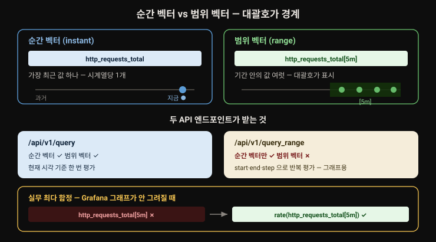
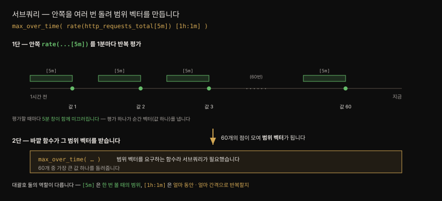
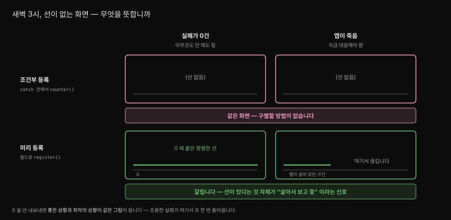
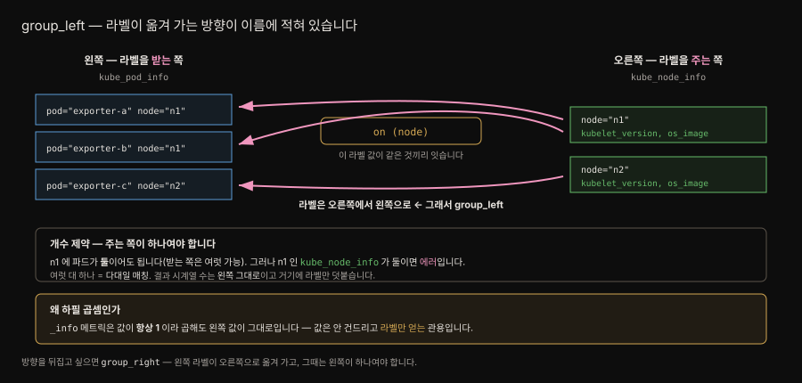
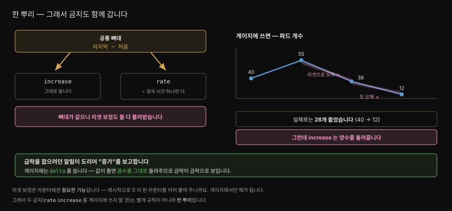
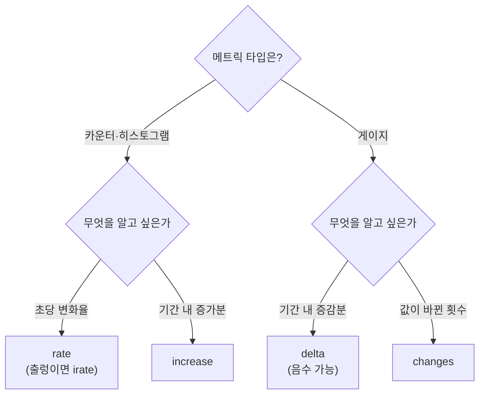

# PromQL 기초
---

## 핵심 요약

> 이 절 전체가 매달린 하나의 생각은 **PromQL 의 거의 모든 혼란이 "지금 한 점이냐, 기간 전체냐" 라는 한 가지 구분에서 갈라져 나온다**는 사실입니다.
>
> 그 구분이 셀렉터에서는 순간 벡터와 범위 벡터로, API 에서는 `/query` 와 `/query_range` 로, 함수에서는 `rate` 와 `irate` 로 반복됩니다. 대괄호 `[]` 하나가 그 경계를 표시합니다.
>
> 나머지는 시계열을 어떻게 묶고 잇느냐입니다. `by`·`without` 로 차원을 접고 `on`·`ignoring` 과 `group_left` 로 서로 다른 메트릭의 라벨을 붙이며 `and`·`or`·`unless` 로 집합 연산을 합니다. 그래프에 난 구멍은 대개 문법이 아니라 staleness 탓입니다.


## 학습 목표

> 이 절을 읽고 나면 아래 다섯 가지를 스스로 해낼 수 있습니다.

1. 순간 벡터와 범위 벡터를 구분하고 어느 API 엔드포인트에 무엇이 유효한지 말할 수 있습니다.
2. 그래프에 생긴 구멍을 staleness 와 lookback delta 로 설명할 수 있습니다.
3. `by` 와 `without` 을 상황에 맞게 고르고 왜 `without` 이 기본값이어야 하는지 말할 수 있습니다.
4. `_info` 메트릭과 `group_left` 로 서로 다른 메트릭의 라벨을 이어 붙일 수 있습니다.
5. `rate`·`irate`·`increase`·`changes`·`delta` 를 메트릭 타입에 맞게 고를 수 있습니다.


## 1. 네 가지 타입과 라벨 매처

PromQL 표현식이 평가될 수 있는 타입은 넷뿐입니다.

1. **순간 벡터(instant vector)** — 시계열마다 값 하나
2. **범위 벡터(range vector)** — 시계열마다 기간에 걸친 값들
3. **스칼라(scalar)** — 숫자 값
4. **문자열(string)** — 정의는 돼 있으나 집필 시점 Prometheus 에서 쓰이지 않습니다

3-1 절에서 메트릭 이름이 내부적으로 `__name__` 라벨이라고 했습니다. PromQL 은 그것을 앞에 쓰게 해 주는 문법 설탕을 얹었을 뿐이라, 아래 둘은 완전히 같습니다.

```promql
{__name__="prometheus_build_info"}   # 명시적 라벨 매처
prometheus_build_info                # 같은 질의, 편한 표기
```

라벨 매처는 라벨 키, 매칭 연산자, 라벨 값으로 씁니다.

| 연산자 | 뜻 |
|--------|-----|
| `=` | 라벨 값이 문자열과 같음 |
| `!=` | 라벨 값이 문자열과 다름 |
| `=~` | 라벨 값이 정규식과 매칭됨 |
| `!~` | 라벨 값이 정규식과 매칭되지 않음 |

```promql
kube_pod_info{pod=~".*mastering-prometheus.+"}
```


## 2. 순간 벡터와 범위 벡터 — 대괄호가 경계입니다

**순간 벡터**는 *지금 이 순간*의 데이터를 고릅니다. 정확히는 고른 시계열에서 가장 최근 데이터를 씁니다. 그래서 시계열마다 값을 하나만 돌려줍니다.

**범위 벡터**는 주어진 기간의 데이터를 가져옵니다. 기간은 숫자와 단위로 적습니다(`5m` 이면 지난 5분).

| 단위 | 뜻 | 주의 |
|------|-----|------|
| `ms` `s` `m` `h` | 밀리초·초·분·시 | — |
| `d` | 일 | 하루를 **항상 24시간**으로 가정 |
| `w` | 주 | 한 주를 **항상 7일**로 가정 |
| `y` | 년 | 한 해를 **항상 365일**로 가정 |

둘을 가르는 가장 쉬운 방법은 저자의 말대로입니다. **셀렉터에 대괄호 `[]` 가 있으면 범위 셀렉터입니다.**


## 3. 벡터와 질의는 다른 축입니다

여기서 헷갈림이 한 겹 더해집니다. Prometheus 는 **벡터** 말고 **질의**도 순간과 범위로 나눕니다. 시계열을 가져오는 API 엔드포인트가 둘이기 때문입니다.

| 엔드포인트 | 무엇을 하는가 | 무엇이 유효한가 |
|-----------|--------------|----------------|
| `/api/v1/query` | 현재 시각 기준으로 셀렉터를 한 번 평가 | 순간 벡터 **와** 범위 벡터 |
| `/api/v1/query_range` | 시작·끝·`step` 을 받아 셀렉터를 반복 평가 | 순간 벡터(엄밀히는 스칼라도) **만** |

그래프를 그리는 쪽은 `/query_range` 입니다. 여기서 **`step` 은 순간 벡터를 얼마나 자주 다시 평가해 점을 찍을지**를 정합니다. `step` 이 30이면 `$now`, `$now - 30s`, `$now - 60s` … 식으로 끝 시각까지 되풀이합니다.

이 표의 마지막 칸이 실무에서 자주 물리는 대목입니다. **`/query_range` 에는 범위 벡터를 넣을 수 없습니다.** Grafana 그래프에 `http_requests_total[5m]` 을 그대로 넣으면 실패하는 이유가 여기 있습니다. `rate(http_requests_total[5m])` 처럼 범위 벡터를 **함수로 감싸 순간 벡터로 만들어야** 그래프가 됩니다.

저자는 API 를 직접 부르는 일은 드물고 대개 Grafana 나 `promtool` 같은 도구를 거친다고 덧붙입니다.

두 벡터와 두 엔드포인트의 관계를 한 장으로 정리하면 이렇습니다. 오른쪽 아래가 실무에서 가장 자주 물리는 지점입니다.




## 4. offset 과 서브쿼리

**offset** 은 현재 시각을 기준으로 과거의 값을 당겨옵니다. 범위 벡터와 같은 시간 단위를 씁니다.

```promql
my_cool_custom_metric offset 5m            # 5분 전 값
rate(my_cool_custom_metric[5m] offset 1h)  # 유효 — offset 이 셀렉터에 붙습니다
rate(my_cool_custom_metric[5m]) offset 1h  # 무효 — 셀렉터에서 떨어졌습니다
rate(my_cool_custom_metric[5m] offset -1h) # 음수 offset 으로 미래를 볼 수도 있습니다
```

규칙은 하나입니다. **offset 은 벡터 셀렉터에 곧바로 붙어야 합니다.**

**서브쿼리**는 저자가 "숨은 보석" 이라 부르는 기능입니다. "지난 한 시간 동안 요청률이 가장 높았던 때는 얼마였나" 처럼 **순간 벡터를 기간에 걸쳐 보고 싶을 때** 씁니다.

```promql
max_over_time(rate(http_requests_total[5m])[1h:1m])
```



두 번째 대괄호 `[1h:1m]` 이 서브쿼리이며 형식은 `[<범위>:<해상도>]` 입니다. 해상도는 앞서 본 `step` 과 같은 개념입니다. 이 질의에서 Prometheus 는 `rate(http_requests_total[5m])` 을 지난 한 시간 동안 1분마다 평가하고 그렇게 얻은 60 개의 점을 범위 벡터를 요구하는 `max_over_time()` 에 넘깁니다.

해상도는 생략할 수 있으나 **콜론은 남겨야** 합니다. 생략하면 설정 파일의 전역 평가 간격(기본 `1m`)이 쓰입니다.

```promql
max_over_time(rate(http_requests_total[5m])[1h:])
```


## 5. staleness — 그래프의 구멍은 대개 이것입니다

저자는 메트릭 staleness 를 사람들이 가장 자주 걸려 넘어지는 함정으로 꼽습니다. 그래프에 난 구멍의 대체적인 원인이며 질문을 많이 낳습니다.

메트릭이 사라져 보이는 경우는 셋입니다.

1. **지난 5분 안에 샘플이 하나도 없을 때.** 5분은 **질의 lookback delta 의 기본값**입니다. 질의할 때 Prometheus 는 주어진 시각에서 5분을 거슬러 올라가며 데이터 포인트를 찾고 못 찾으면 그 구간에서 시계열이 사라진 것처럼 보입니다.
2. **직전 스크레이프에 있던 메트릭이 이번 스크레이프에 없을 때.** 이때 staleness 마커가 삽입됩니다.
3. **대상 자체가 사라졌을 때.** 쿠버네티스 파드가 삭제되어 더는 감시되지 않는 경우가 그렇습니다. 이 덕에 시계열의 마지막 값이 대상이 목록에서 빠진 시점과 얼추 맞습니다.

두 번째가 실무에 주는 교훈이 큽니다. **값이 0 이더라도 같은 메트릭을 일관되게 계속 내보내야 합니다.** 조건이 맞을 때만 메트릭을 등록하는 코드는 그래프에 구멍을 냅니다.

이것이 위생 수칙에 그치지 않는 이유는 **화면에서 벌어지는 일** 때문입니다. 새벽 3시에 당직자가 대시보드를 봅니다. 결제 실패 그래프에 선이 없습니다. 해석이 둘로 갈립니다.



| 화면 | 실제 상황 | 해야 할 일 |
|---|---|---|
| 선 없음 | 그 사유의 실패가 **0건** | 아무것도 안 해도 됨 |
| 선 없음 | **앱이 죽어 메트릭을 못 냄** | **지금 대응** |

**같은 화면인데 해야 할 일이 정반대입니다.** 그리고 화면만으로는 구별할 방법이 없습니다.

미리 등록해 두면 둘이 갈립니다. 0건이면 **0 에 붙은 평평한 선**이 그려지고, 앱이 죽으면 그 선이 사라집니다. **0 인 선이 있다는 것 자체가 "앱이 살아서 보고 중"이라는 신호**가 되는 셈입니다.

[01-01](./01-01.관측%20가능성·모니터링·Prometheus의%20자리.md) 의 **조용한 실패**가 이 책에서 세 번째로 돌아오는 자리입니다. Pushgateway 의 초록불(02-01 §6), `up` 이 못 보는 `node_textfile_scrape_error`(02-01 §5), 그리고 이것입니다.

lookback delta 는 `--query.lookback-delta` 로 바꿀 수 있지만 저자는 그럴 만한 이유가 있을 때만 손대라고 못 박습니다. 그가 실제로 바꾼 경우는 스크레이프 주기가 15분인 SNMP 잡이 있을 때였습니다. 스크레이프 간격 15분에서 5분 lookback 을 빼면 **10분 동안 샘플이 없는 것처럼 보이기** 때문입니다.


## 6. 연산자 — 산술, 집계, 그리고 조인

Prometheus 는 시계열 하나를 뽑을 때보다 **여러 시계열을 결합할 때** 빛납니다.

**산술 연산자**는 `+`, `-`, `*`, `/`, `%`, `^` 입니다. 저자는 시계열 둘을 비교할 때 나눗셈이 가장 흔하다고 적습니다. 오류율이 대표적입니다.

```promql
sum(myservice_http_requests_total{status=~"5[0-9]{2}"})
/
sum(myservice_http_requests_total)
```

**집계 연산자**는 여러 시계열을 가로질러 `sum`·`count`·`avg`·`max` 같은 값을 냅니다. SQL 의 `GROUP BY` 처럼 차원을 지정해 쓰는데, 그 수단이 `by` 와 `without` 입니다.

```promql
count(kube_pod_info) by (namespace)          # namespace 만 남기고 전부 접습니다
count(kube_pod_info) by (namespace, node)    # 여러 라벨도 됩니다
```

`by` 의 함정은 **지정하지 않은 라벨의 정보를 전부 잃는다**는 점입니다. 그래서 `without` 이 있습니다. `without` 은 인자로 준 라벨만 빼고 나머지 라벨의 유일한 조합으로 묶습니다.

```promql
count(kube_pod_container_status_running) without (uid, pod, container)
```

차이는 **시간이 지나면** 더 벌어집니다. `by` 는 남길 것을 적고 `without` 은 버릴 것을 적으므로, `by` 는 **닫힌 목록**이고 `without` 은 **열린 목록**입니다. 메트릭에 라벨이 나중에 추가되면 — exporter 버전이 오르거나 relabeling 이 하나 더 얹히면 — `by` 는 그 라벨을 **조용히 버리고** `without` 은 **자동으로 살립니다.** 질의를 고치지 않아도 그렇습니다.

저자의 권고는 분명합니다. **가능하면 `without` 쪽으로 기웁니다.** 라벨을 최대한 보존해 데이터에 대한 통찰을 더 남기기 때문입니다.

다만 `by` 가 맞는 자리도 있습니다. 버리는 것이 *목적*일 때, 즉 카디널리티를 줄이려 차원을 일부러 접을 때입니다(07-01 이 SSOT 입니다). 기본값을 어디에 두느냐의 문제입니다.


## 7. 벡터 매칭 — 라벨을 이어 붙입니다

`group_left` 와 `group_right` 는 서로 다른 메트릭의 라벨을 결과에 이어 붙입니다. 각각 **다대일**과 **일대다** 매칭을 가능하게 하며 SQL 의 `JOIN` 과 닮았습니다. 다만 테이블 대신 시계열이, 컬럼 대신 라벨이 붙습니다.

키워드의 방향은 **라벨이 어느 쪽으로 옮겨 가는지**를 가리킵니다. `group_left` 면 오른쪽 시리즈의 라벨을 왼쪽으로 옮깁니다. 라벨이 옮겨 가는 쪽 시리즈는 옮겨 오는 쪽에서 **매칭이 정확히 하나**여야 합니다.

이 매칭을 조율하는 것이 `on` 과 `ignoring` 입니다. `by`·`without` 과 닮았고 그룹 연산자를 쓸 때는 **필수**입니다. `on` 은 두 쪽을 이을 라벨을 지정하고 `ignoring` 은 무시할 라벨을 지정합니다(무시하지 않은 나머지가 전부 일치해야 한다는 뜻).



여기서 3-1 절의 `_info` 메트릭이 되살아납니다. 정보성 메트릭은 값이 **항상 1** 이므로, 곱해도 상대 메트릭의 값이 바뀌지 않습니다. **곱셈을 조인의 수단으로 안전하게 쓸 수 있는 이유**가 바로 이것입니다.

```promql
kube_pod_info{pod=~".*node-exporter.+"}
* on (node) group_left (kubelet_version, os_image)
kube_node_info
```

파드 메트릭에 그 파드가 도는 노드의 쿠버네티스 버전과 OS 이미지를 붙였습니다. `on (node)` 로 두 시리즈를 노드 이름으로 잇고 `group_left (…)` 로 오른쪽의 라벨 둘을 왼쪽으로 옮겼습니다.

`on` 과 `ignoring` 은 그룹 수정자 없이도 씁니다. 이때는 **일대일 매칭**이어야 합니다.

```promql
sum by (node) (container_memory_rss)
/ on (node)
machine_memory_bytes
```


## 8. 논리·집합 연산자

`and`, `or`, `unless` 로 순간 벡터를 결합하고 비교합니다.

- **`and`** — `vector1` 의 각 시리즈마다 `vector2` 에 (`__name__` 을 뺀) 라벨 셋이 정확히 일치하는 시리즈가 있어야 결과에 남습니다. 여기서도 `on`·`ignoring` 으로 매칭 라벨을 바꿀 수 있습니다.
- **`or`** — `vector1` 의 모든 요소와, `vector1` 에 매칭되는 라벨 셋이 없는 `vector2` 의 요소를 함께 돌려줍니다. 여러 시계열을 한 질의로 받아 보는 방법입니다.
- **`unless`** — XOR 처럼 동작합니다. 어떤 라벨 셋이 `vector1` 과 `vector2` 에 **모두** 있으면 결과에서 빠집니다.

저자가 가장 아끼는 것은 `unless` 이며 알림에서 쓸모가 큽니다. kube-prometheus 의 `InfoInhibitor` 룰이 그 예입니다. `info` 심각도의 알림이 떠 있되 같은 네임스페이스에 `warning` 이나 `critical` 알림이 함께 떠 있지 **않을 때만** 발화합니다. 큰 문제가 없을 때 `info` 알림이 내는 소음을 막고 큰 문제가 있을 때는 상위 심각도 알림이 뜨면서 `info` 가 원인 지목을 돕게 하는 설계입니다.

```promql
ALERTS{severity="info"} == 1
unless on (namespace)
ALERTS{alertname!="InfoInhibitor", alertstate="firing", severity=~"warning|critical"}
```


## 9. 함수 다섯 개면 대부분 됩니다

집필 시점 PromQL 함수는 **70개**이지만 저자는 90% 의 용례에 몇 개면 충분하다고 적습니다.

**`rate` 와 `irate`** 는 범위 벡터 안에서 시계열의 초당 평균 증가량을 구합니다. 계산 방식이 다릅니다.

```text
rate  = (v100 – v0)   / (t100 – t0)     ← 범위 안 모든 점을 씁니다
irate = (v100 – v99)  / (t100 – t99)    ← 가장 최근 두 점만 씁니다
```

그래서 `irate` 를 7일 범위로 잡든 5분 범위로 잡든 결과가 거의 같습니다. **대개 `rate` 를 쓰고 빠르게 출렁이는 시계열에만 `irate` 를 씁니다.**

> ⚠️ `rate` 와 `irate` 는 **카운터와 히스토그램 타입에만** 써야 합니다. 값이 시간에 따라 증가하기만 한다고 전제하기 때문입니다.

나머지 셋은 타입과 목적으로 갈립니다.

| 함수 | 무엇을 하는가 | 어떤 타입에 | 예시 |
|------|--------------|------------|------|
| `increase` | 경과 시간으로 나누지 않고 증가분만 | 카운터·히스토그램 | `increase(prometheus_tsdb_compactions_total[24h])` |
| `changes` | 값이 바뀐 **횟수** | 모든 타입. 게이지에 가장 유용 | `changes(kube_pod_start_time[24h])` |
| `delta` | 증감분. **음수가 나올 수 있음** | 게이지 | `delta(count(up)[24h:])` |

`changes` 에는 함정이 하나 있습니다. **값은 스크레이프 주기당 한 번만 바뀔 수 있으므로** 그 사이에 파드가 여러 번 재시작했다면 전부 세지 못합니다. 저자가 "대략적인 감" 이라고 표현한 이유입니다.

`increase` 를 게이지에 쓰면 안 되는 이유는 `rate` 와 **한 뿌리**입니다. 둘은 계산의 뼈대가 같고 시간 나눗셈 하나만 다릅니다.

```text
rate     = (마지막 − 처음) ÷ 경과 시간
increase =  마지막 − 처음
```



뼈대가 같으니 §심화에서 볼 **리셋 보정도 그대로 물려받습니다.** 파드 개수가 `40 → 55 → 38 → 12` 로 움직였다고 해 봅니다. 실제로는 **28개 줄었는데** `increase` 는 하강 둘을 카운터 리셋으로 보고 없던 증가분을 더해 **양수를 돌려줍니다.** 급락을 잡으려던 알림이 도리어 "증가"를 보고하는 셈입니다.

`delta` 는 게이지용 `increase` 입니다. 게이지는 오르내리므로 `increase` 를 쓰면 안 되고 `delta` 는 값이 줄면 음수를 돌려줍니다. 저자는 감시 대상 서버 수가 크게 떨어지는 조용한 실패를 잡는 데 썼습니다.




## 심화 학습

> 책이 짧게 지나간 대목을 공식 문서와 상위 노트로 잇습니다.

**`rate` 를 게이지에 쓰면 왜 틀립니까.** 본문은 "증가만 한다고 전제한다" 고만 적습니다. 실제 동작을 알면 납득이 빠릅니다.

`rate` 는 범위 안에서 값이 **줄어든 지점을 카운터 리셋으로 간주해 보정**합니다. 공식 문서도 "단조성이 깨진 지점(대상 재시작에 따른 카운터 리셋 등)은 자동으로 보정된다" 고 적습니다([rate()](https://prometheus.io/docs/prometheus/latest/querying/functions/#rate)).

그래서 게이지에 쓰면 자연스럽게 내려간 값을 리셋으로 오해해 없던 증가분을 더합니다. 결과가 그저 틀리는 정도가 아니라 **위로 부풀려집니다.** 게이지용으로 `delta` 가 따로 있는 이유입니다.

**`rate` 의 범위는 스크레이프 주기보다 넉넉히.** 본문에 없는 실무 규칙입니다. 범위 안에 최소 두 개의 샘플이 있어야 계산이 되므로, 범위를 주기에 빠듯하게 잡으면 스크레이프가 한 번만 밀려도 `rate` 가 빈 결과를 냅니다.

출처를 갈라 둡니다.

- **공식 문서** — 수치를 규정하지 않습니다. 밀린 스크레이프와 어긋난 정렬을 "허용한다(allows for missed scrapes or imperfect alignment)" 고만 적을 뿐, 최소 샘플 수나 배수 규칙은 없습니다.
- **커뮤니티 경험칙** — 흔히 인용되는 **주기의 4배 이상**은 공식 권고가 아니라 [Robust Perception](https://www.robustperception.io/what-range-should-i-use-with-rate/) 등에서 굳어진 관행입니다. 30초 주기라면 `[2m]` 이상이 그 셈입니다.

**staleness 는 SLO 계산을 조용히 망칩니다.** 본문의 5분 lookback 은 [01-04. SLO와 알림](../../01_Foundations/01-04.SLO와%20알림%20—%20Error%20Budget,%20Burn%20Rate.md) 의 error budget 계산과 직접 부딪칩니다.

오류가 없을 때 오류 카운터를 아예 내보내지 않는 앱을 생각해 봅니다. 5분이 지나면 분자 쪽 시계열이 사라지고, 분모만 남은 `sum(rate(errors[5m])) / sum(rate(total[5m]))` 은 값을 내지 못합니다. **오류가 없어서 좋은 상황이 지표 공백으로 나타나는** 셈입니다.

3-1 절의 "값이 0 이어도 계속 내보내라" 가 여기서 SLO 문제로 돌아옵니다.

**`unless` 의 알림 억제는 Alertmanager 억제와 다릅니다.** 본문의 `InfoInhibitor` 는 **PromQL 수준**에서 알림 자체가 발화하지 않게 합니다. Alertmanager 에는 별도의 [inhibit_rules](https://prometheus.io/docs/alerting/latest/configuration/#inhibit_rule) 가 있어 **발화한 알림의 전송**을 막습니다. 둘은 층이 다르고 5장에서 다시 다룹니다.


## 결정 치트시트

> 이 절이 남기는 판단 기준입니다.

| 상황 | 선택 | 이유 |
|------|------|------|
| Grafana 그래프를 그림 | 범위 벡터를 함수로 감싸 순간 벡터로 | `/query_range` 는 순간 벡터만 받음 |
| 카운터의 초당 변화율 | `rate(...[범위])` | 범위 안 모든 점을 씀 |
| 빠르게 출렁이는 카운터 | `irate` | 최근 두 점만 봄. 범위 크기가 무의미 |
| 카운터의 기간 내 총 증가분 | `increase` | 시간으로 나누지 않음 |
| 게이지의 기간 내 증감 | `delta` | 음수를 돌려줌. `rate`·`increase` 금지 |
| 게이지 값이 바뀐 횟수 | `changes` | 스크레이프 주기당 1회만 셈에 유의 |
| 집계하며 라벨을 남기고 싶음 | `without` | `by` 는 지정 안 한 라벨을 전부 버림 |
| 다른 메트릭의 라벨을 붙임 | `_info * on(키) group_left(라벨)` | `_info` 값이 1 이라 곱해도 안전 |
| 두 벡터 모두에 있는 것만 | `and` | 라벨 셋이 정확히 일치해야 함 |
| 한쪽에만 있는 것 | `unless` | 알림 억제에 유용 |
| 그래프에 구멍이 남 | staleness·lookback delta 의심 | 5분 안에 샘플이 없으면 사라져 보임 |
| 스크레이프 주기가 lookback 보다 김 | `--query.lookback-delta` 조정 | 그럴 만한 이유가 있을 때만 |


## Spring 앱 개발 관점

> 이 절에는 Spring 예제가 없습니다. 아래는 Spring Boot 가 내보내는 실제 메트릭에 이 절의 PromQL 을 적용한 것이며 메트릭 이름과 태그는 Spring Boot Actuator 가 노출하는 표준 이름을 씁니다.

Spring MVC 앱은 `http_server_requests_seconds` 계열을 냅니다. `Timer` 라 히스토그램으로 나가며 `_count`·`_sum`·`_bucket` 세 벌이 생깁니다. 여기에 이 절의 도구를 얹으면 [01-03. 시그널 모델](../../01_Foundations/01-03.시그널%20모델%20—%20Golden%20Signals,%20RED,%20USE.md) 의 RED 세 지표가 그대로 나옵니다.

```promql
# Rate — 초당 요청 수. 카운터이므로 rate 를 씁니다
sum(rate(http_server_requests_seconds_count{app="order-api"}[5m]))

# Errors — 5xx 비율. 나눗셈이 오류율의 관용 표현입니다
sum(rate(http_server_requests_seconds_count{app="order-api",status=~"5.."}[5m]))
/
sum(rate(http_server_requests_seconds_count{app="order-api"}[5m]))

# Duration — 99 분위 지연. le 버킷이 있어야 계산됩니다
histogram_quantile(
  0.99,
  sum by (le, uri) (rate(http_server_requests_seconds_bucket{app="order-api"}[5m]))
)
```

마지막 질의에 이 절의 규칙 셋이 겹쳐 있습니다.

**첫째, `histogram_quantile` 에는 `le` 라벨이 반드시 살아 있어야 합니다.** 그래서 `sum by (le, uri)` 로 `le` 를 남깁니다. 습관적으로 `by (uri)` 만 쓰면 `le` 가 접혀 함수가 값을 내지 못합니다. 3-1 절에서 `publishPercentileHistogram()` 을 켜야 한다고 한 이유이기도 합니다. `publishPercentiles` 는 `quantile` 라벨을 내므로 이 질의에 쓸 수 없습니다.

**둘째, 안쪽은 `rate` 입니다.** 버킷은 카운터라 누적값입니다. `rate` 로 초당 증가율로 바꾸지 않고 `histogram_quantile` 에 넣으면 프로세스가 살아온 전 기간의 분위수가 나옵니다. 지금 느린지 알 수 없습니다.

**셋째, 배포 직후 그래프가 끊깁니다.** 파드가 교체되면 옛 파드의 시계열이 stale 로 표시되고 새 파드는 다른 `instance` 라벨로 시작합니다. `sum` 으로 인스턴스 차원을 접어 두면 이 교체가 그래프에 드러나지 않습니다. 반대로 인스턴스별로 보고 싶다면 구멍이 정상 신호입니다.

§5 의 "0 이어도 계속 내보내라" 는 Java 쪽에서 이렇게 갈립니다. 조건부 등록은 Micrometer 를 쓸 때 흔히 나오는 실수입니다.

```java
// ❌ 예외가 났을 때만 카운터가 생깁니다 — 실패 0건과 앱 죽음이 같은 화면이 됩니다
catch (PaymentException e) {
    meterRegistry.counter("payment_failures_total", "reason", e.getReason()).increment();
}

// ✅ 시작할 때 등록해 두고, 났을 때만 올립니다 — 0건이면 0 인 선이 그려집니다
private final Counter timeout = Counter.builder("payment_failures_total")
        .tag("reason", "timeout").register(meterRegistry);
```

여기에 실무 제약이 하나 붙습니다. 미리 등록하려면 **라벨 값을 미리 알아야** 합니다. `e.getReason()` 처럼 런타임에 정해지는 값은 전부 등록할 수 없으니, 사유를 **닫힌 enum** 으로 두는 설계가 낫습니다. 그리고 이 제약은 [03-01](./03-01.데이터%20모델과%20TSDB.md) 의 카디널리티와 맞닿습니다. 무한정 미리 등록하는 것도 답이 아닙니다.

빌드 정보를 붙이고 싶다면 `_info` 관용이 그대로 통합니다. Spring Boot 는 `micrometer-core` 가 있으면 `application_started_time_seconds` 같은 메트릭을, Actuator 의 `InfoContributor` 설정에 따라 빌드 정보를 냅니다. 조인 문법은 본문과 같습니다.

```promql
sum by (app) (rate(http_server_requests_seconds_count[5m]))
* on (app) group_left (version)
app_build_info
```


## 면접 대비

> 이 절에서 면접에 그대로 쓸 수 있는 문장입니다.

### 한 줄 정의

PromQL 은 시계열을 **순간 벡터**(지금 한 점)와 **범위 벡터**(기간 전체)로 고른 뒤, 집계·벡터 매칭·집합 연산으로 결합하는 질의 언어입니다.

### 핵심 포인트 3가지

1. **대괄호가 벡터의 종류를 가릅니다.** `[]` 가 있으면 범위 벡터입니다. 그리고 `/query_range` 엔드포인트는 순간 벡터만 받으므로, 그래프를 그리려면 `rate()` 같은 함수로 범위 벡터를 감싸 순간 벡터로 되돌려야 합니다.
2. **그래프의 구멍은 대개 staleness 입니다.** 기본 lookback delta 가 5분이라 그 안에 샘플이 없으면 시계열이 사라져 보입니다. 스크레이프 주기가 lookback 보다 길거나, 조건부로만 메트릭을 내보내는 앱에서 생깁니다.
3. **`_info` 메트릭의 값이 1 인 것은 조인을 위한 설계입니다.** 곱해도 상대 값이 변하지 않으므로 `* on (키) group_left (라벨)` 로 부가 정보를 안전하게 이어 붙일 수 있습니다.

### 자주 묻는 질문

**Q. `rate` 와 `irate` 는 언제 갈립니까?**
A. `rate` 는 범위 안 모든 점을 써서 평균 증가율을 구하고 `irate` 는 가장 최근 두 점만 씁니다. 그래서 `irate` 는 범위를 7일로 주든 5분으로 주든 결과가 거의 같습니다. 기본은 `rate` 이고 값이 빠르게 출렁여 최근 순간의 기울기가 중요할 때만 `irate` 를 씁니다.

**Q. `by` 대신 `without` 을 권하는 이유는 무엇입니까?**
A. `by` 는 지정한 라벨만 남기고 나머지를 전부 버립니다. `without` 은 버릴 라벨만 지정하므로 나머지 라벨이 살아남습니다. 라벨이 많이 남을수록 결과에서 얻는 통찰이 커지므로 가능하면 `without` 쪽으로 기웁니다.

**Q. 게이지에 `rate` 를 쓰면 어떤 일이 벌어집니까?**
A. `rate` 는 값이 줄어든 지점을 카운터 리셋으로 보고 보정합니다. 게이지가 정상적으로 내려간 것을 리셋으로 오해해 없던 증가분을 더하므로 결과가 위로 부풀려집니다. 게이지에는 `delta` 나 `changes` 를 씁니다.


## 핵심 개념 체크리스트

- [ ] PromQL 표현식의 네 가지 타입을 나열할 수 있는가?
- [ ] 대괄호 유무로 순간 벡터와 범위 벡터를 구분할 수 있는가?
- [ ] `/query` 와 `/query_range` 에 각각 무엇이 유효한지 아는가?
- [ ] Grafana 그래프에 범위 벡터를 그대로 넣으면 왜 실패하는지 설명할 수 있는가?
- [ ] `offset` 이 셀렉터에 붙어야 한다는 규칙을 아는가?
- [ ] 서브쿼리 `[<범위>:<해상도>]` 가 무엇을 반복 평가하는지 설명할 수 있는가?
- [ ] 그래프의 구멍을 staleness·lookback delta 로 진단할 수 있는가?
- [ ] `by` 와 `without` 의 차이와 권장 기본값을 말할 수 있는가?
- [ ] `_info` 메트릭과 `group_left` 로 라벨을 조인하는 원리를 설명할 수 있는가?
- [ ] `rate`·`irate`·`increase`·`changes`·`delta` 를 타입에 맞게 고를 수 있는가?
- [ ] `histogram_quantile` 에 `le` 라벨을 남겨야 하는 이유를 아는가?


## 참고 자료

- 원본: *Mastering Prometheus* (Packt, ISBN 9781805125662) 3장 뒷부분 — PromQL basics.
- [Prometheus — Querying functions](https://prometheus.io/docs/prometheus/latest/querying/functions/) · [Operators](https://prometheus.io/docs/prometheus/latest/querying/operators/#aggregation-operators) · [Basics](https://prometheus.io/docs/prometheus/latest/querying/basics/)
- [Alertmanager — inhibit_rule](https://prometheus.io/docs/alerting/latest/configuration/#inhibit_rule)
- 관련 노트: [README (책 MOC)](README.md) · [03-01. 데이터 모델과 TSDB](03-01.데이터%20모델과%20TSDB.md) · [01-03. 시그널 모델](../../01_Foundations/01-03.시그널%20모델%20—%20Golden%20Signals,%20RED,%20USE.md) · [01-04. SLO와 알림](../../01_Foundations/01-04.SLO와%20알림%20—%20Error%20Budget,%20Burn%20Rate.md)
