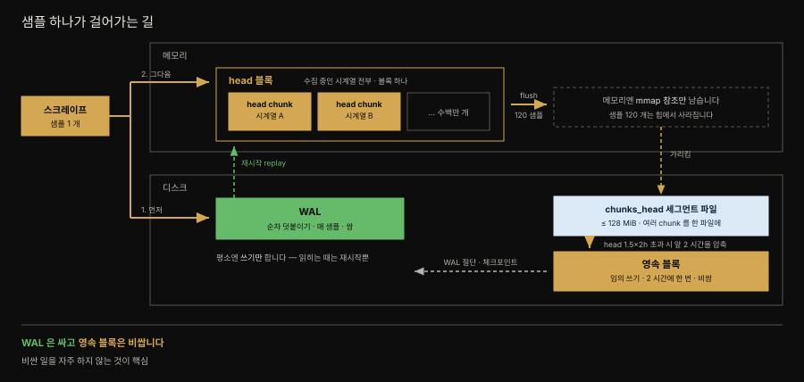
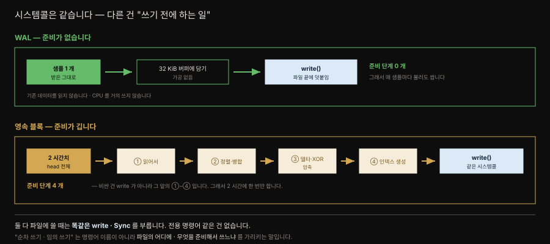
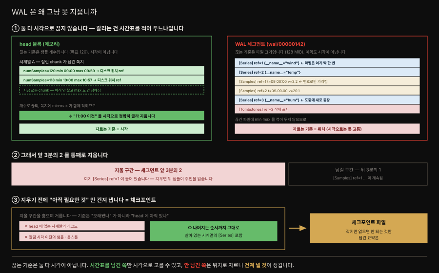
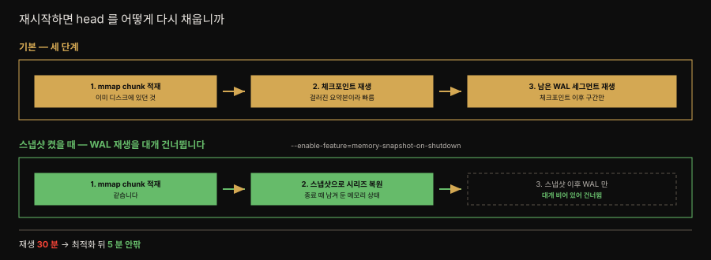
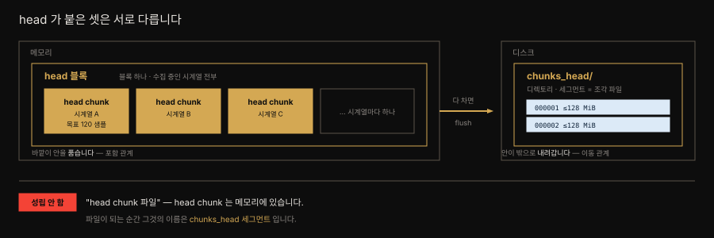
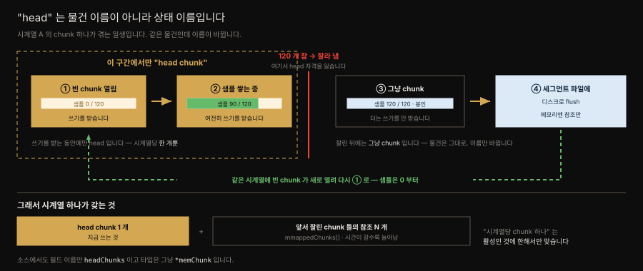

# Prometheus TSDB 쓰기 경로
---

## 핵심 요약

> 이 절 전체가 매달린 하나의 생각은 **샘플이 WAL 과 head 두 갈래를 거친다**는 사실입니다.
>
> 하나는 디스크의 WAL 로 가서 내구성을 확보하고, 다른 하나는 메모리 head chunk 에 쌓입니다. 내구성이 목적이므로 **WAL 기록이 먼저**입니다. chunk 가 120 샘플에 차면 잘려 디스크로 내려가고 메모리에는 위치 참조(mmap)만 남습니다.
>
> 갈리는 값은 **쓰기 명령어가 아니라 그 앞의 준비**입니다. WAL 은 준비 없이 파일 끝에 덧붙이므로 매 샘플마다 해도 싸고, 블록 만들기는 네 단계를 거치므로 2 시간에 한 번만 합니다.


## 학습 목표

> 이 절을 읽고 나면 아래 네 가지를 스스로 해낼 수 있습니다.

1. 샘플 하나가 WAL 과 head chunk 두 갈래로 가는 경로를 그림으로 그리고 **무엇이 먼저인지** 말할 수 있습니다.
2. head 블록·head chunk·`chunks_head` 를 구분하고 `head` 가 상태 이름임을 설명할 수 있습니다.
3. WAL 과 영속 블록이 같은 시스템콜을 쓰는데 왜 비용이 다른지 설명할 수 있습니다.
4. WAL 을 자를 때 체크포인트가 왜 필요한지, 재시작 복구가 어떤 순서로 도는지 말할 수 있습니다.


## 1. 샘플 하나가 걸어가는 길

> 스크레이프된 샘플은 **WAL 과 head 두 갈래**를 거칩니다. 내구성을 위해 WAL 기록이 head 반영보다 **앞섭니다.**

TSDB 는 Prometheus 가 하는 모든 일의 중심입니다. 2017년 이래 세 번째 세대이며 최적화와 기능이 꾸준히 붙고 있으나 핵심 동작과 형식은 대체로 그대로입니다.

샘플 하나는 갈림길에서 **두 갈래**로 갑니다. 하나는 디스크의 WAL 로 가고(내구성), 다른 하나는 메모리의 head 블록에 쌓입니다(질의).

두 갈래는 목적지가 다를 뿐 **순서가 없는 것은 아닙니다.** 내구성이 존재 이유이므로 **WAL 기록이 head 반영보다 먼저**입니다([§2](#2-walwrite-ahead-log--내구성은-여기서-옵니다)). 아래 표의 번호가 그 순서입니다.



| 단계 | 어디에 | 무엇이 일어나는가 |
|---|---|---|
| ① WAL 추가 | 디스크 | 순차 덧붙이기. 매 샘플마다, 값싸게 |
| ② head chunk | 메모리 | 시계열마다 하나씩 자람 (목표 120 샘플) |
| ③ flush | 디스크 | 다 자란 chunk 가 `chunks_head` 세그먼트로 (≤128 MiB) |
| ④ 영속 블록 | 디스크 | head 가 1.5×2h 넘으면 앞 2시간을 압축. WAL 절단 |


## 2. WAL(write-ahead log) — 내구성은 여기서 옵니다

> 샘플은 메모리에 앉기 **전에** WAL 에 먼저 적힙니다. 그래서 프로세스가 죽어도 잃지 않고, WAL 은 재시작 복원에만 읽힙니다.

Prometheus v1 에서는 간헐적 체크포인트 사이에 프로세스가 죽으면 메트릭을 잃을 수 있었습니다. v2 의 간판 기능이 **WAL(write-ahead log)** 이었고 그 뒤로는 애플리케이션 수준 크래시로 데이터를 잃을 걱정을 하지 않습니다.

원리는 순서에 있습니다. **샘플은 메모리의 head chunk 에 들어가기 전에 먼저 WAL 에 덧붙습니다.** 쓰기에 내구성(ACID 의 D) 한 겹을 더해 주는 셈입니다. Prometheus 의 WAL 은 오직 이 내구성 보장을 위해 존재하므로, **읽히는 때는 서버가 시작하며 메모리 상태를 복원할 때뿐**입니다.

그런데 여기서 걸리는 게 하나 있습니다. 디스크가 비싸서 메모리에 모으는 것이라면, 왜 샘플마다 디스크에 먼저 쓰는 걸까요?

### 쓰기 명령어는 같습니다 — 다른 건 그 앞의 준비

먼저 오해를 하나 걷어 냅니다. **WAL 이든 영속 블록이든 파일에 쓸 때 부르는 시스템콜은 똑같습니다.** "순차 쓰기 전용 명령어" 같은 건 없습니다. 소스를 열어 봐도 둘 다 평범한 `Write` 와 `Sync` 입니다.[^same-syscall]



갈리는 곳은 **그 호출에 이르기까지 무엇을 하느냐**입니다.

| | WAL | 영속 블록 |
|---|---|---|
| 쓰기 전 준비 | **없음** — 받은 그대로 버퍼에 | 읽기 → 정렬·병합 → 압축 → 인덱스 생성 |
| 쓰는 위치 | 파일 **끝에 덧붙이기만** | 새 파일에 배치 |
| 기존 데이터 | 읽지 않음 | **읽어서** 정렬·병합 |
| CPU | 거의 0 | 델타·XOR 압축 연산 |
| 빈도 | **매 샘플** | 2 시간에 한 번 |

**비싼 것은 `write` 자체가 아니라 그 앞의 준비입니다.** 그래서 준비가 없는 WAL 은 매 샘플마다 불러도 싸고, 준비가 네 단계인 블록은 2 시간에 한 번만 합니다. "순차 쓰기 · 임의 쓰기" 는 명령어 이름이 아니라 **파일의 어디에, 무엇을 준비해서 쓰느냐**를 가리키는 말입니다.

그러면 **블록은 왜 그 네 단계를 거쳐야 하는가.** 두 파일의 목적이 다르기 때문입니다 — **WAL 은 "쓰고 잊는" 파일이고 블록은 "두고 읽는" 파일입니다.** WAL 은 크래시 복구 때 한 번 처음부터 끝까지 훑고 버리므로 도착 순서대로 쌓기만 하면 되지만, 블록은 몇 달간 계속 질의를 받으므로 **읽기 좋게, 그리고 작게** 만들어야 합니다.

| 단계 | 왜 필요한가 | 근거 |
|---|---|---|
| ① 기존 데이터 읽기 | 원본이 이미 디스크로 내려가 메모리에 없습니다 | [§3](#3-head-chunk-의-생명주기) |
| ② 정렬·병합 | 질의가 **한 시계열을 세로로 길게** 읽으므로 같은 시계열을 물리적으로 붙여 둡니다 | [03-01 §1](03-01.데이터%20모델.md#1-데이터-모델-3층--메트릭-시계열-샘플) |
| ③ 델타·XOR 압축 | ② 로 같은 시계열이 모여야 **앞 값과의 차이**가 의미를 가집니다 | [03-03 §1](03-03.TSDB%20저장%20구조.md#1-블록과-chunk--불변이-모든-것을-결정합니다) |
| ④ 인덱스 생성 | 블록 혼자서 "이 라벨의 시계열이 어디 있나" 를 답할 수 있어야 합니다 | [03-03 §2](03-03.TSDB%20저장%20구조.md#2-인덱스--역색인이-질의를-이끕니다) |

②→③ 의 순서는 우연이 아닙니다. 흩어진 상태에서는 이웃이 남의 시계열이라 차이를 내도 의미가 없어, **모아야 압축이 듣습니다.** 결국 **읽기 비용을 쓰기 시점에 미리 지불하는** 구조이고, 2 시간에 한 번만 하니 감당됩니다.

> 여기서 "그러면 RDB 도 append 만 하게 두면 되지 않나" 라는 반문이 자연스럽게 듭니다. 쓰기 패턴은 실제로 흉내 낼 수 있고 방향도 맞는 지적이라, [심화 학습 § RDB 로는 왜 안 되는가](03-03.TSDB%20저장%20구조.md#rdb-로는-왜-안-되는가) 에서 무엇이 흉내 나고 무엇이 남는지 따로 다룹니다.

### 시스템콜 횟수는 샘플 수보다 훨씬 적습니다

"매 샘플마다 디스크에 쓴다" 는 말이 곧 "샘플마다 시스템콜" 은 아닙니다. **디스크에 쓴다는 말이 실은 두 겹**이기 때문입니다.

| 시스템콜 | 어디서 어디로 | 언제 불리나 |
|---|---|---|
| `write` | 프로그램 버퍼 → **커널 페이지 캐시** | 32 KiB 페이지가 **찰 때** |
| `fsync` | 커널 페이지 캐시 → **디스크 매체** | 세그먼트가 **바뀔 때** |

`write` 가 끝나도 데이터는 아직 커널 메모리에 있고, 매체까지 내려보내는 것은 `fsync` 입니다. WAL 은 레코드마다 `write` 를 부르지 않고 32 KiB 버퍼에 모았다가 내려보내며, `fsync` 는 그보다도 뜸해서 세그먼트가 바뀔 때만 불립니다. 그마저 뒤따르는 쓰기를 막지 않도록 **비동기 큐**에 넣습니다.[^wlog]

### WAL 자르기 — 왜 그냥 못 지우는가

WAL 도 `chunks_head` 처럼 128 MiB 세그먼트로 쪼개집니다. 영속 블록이 쓰이면 그 구간의 WAL 은 필요 없어지므로 잘라 내는데, **자르는 방법이 head 블록과 다릅니다.**



- **head 블록은** chunk 마다 최소·최대 시각을 들고 있어 "2 시간 이전" 을 정확히 골라 지웁니다.
- **WAL 세그먼트는** 레코드가 도착 순서대로 섞여 있을 뿐이라 **그 파일이 몇 시부터 몇 시까지인지 알기 어렵습니다.**

그래서 시간이 아니라 위치로 자릅니다 — **세그먼트 앞 3분의 2 를 통째로 지웁니다.** 문제는 그 구간에 **아직 필요한 것이 섞여 있다**는 점입니다. 그냥 지우면 잃습니다.

그래서 **지우기 전에 건져 냅니다.** 지울 구간을 훑어 아직 필요한 것만 골라 담은 작은 파일이 **체크포인트**, 곧 "걸러진 WAL" 입니다. 거르는 기준은 이렇습니다.

| 버립니다 | 남깁니다 |
|---|---|
| head 에 더는 없는 시계열의 레코드 | **나머지 전부 — 순서까지 그대로** |
| 잘림 시각보다 이전의 샘플 | |
| 잘림 시각보다 이전의 툼스톤 | |

체크포인트를 만든 **뒤에야** 앞 3분의 2 를 지웁니다.

### 재시작 복구 — 체크포인트가 여기서 값을 합니다

서버가 재시작하면 WAL 을 재생(replay)해 종료 전 상태로 돌아갑니다. 체크포인트가 있으면 **걸러진 요약본부터 읽으므로** 복구가 빨라집니다.



기본 경로는 세 단계입니다.

1. 디스크에서 **mmap 된 chunk 를 적재**합니다.
2. **체크포인트를 재생**합니다.
3. 체크포인트 **이후의 WAL 세그먼트**를 재생합니다.

`--enable-feature=memory-snapshot-on-shutdown` 을 켜면 달라집니다. 종료할 때 메모리 상태를 스냅샷으로 남겨 두므로, 재시작 시 mmap chunk 를 적재하고 **스냅샷으로 시리즈를 복원한 뒤** 스냅샷 이후의 WAL 만 재생합니다. 스냅샷이 WAL 보다 최신이라 **대개 WAL 재생 자체를 건너뜁니다.**

저자는 예전 버전에서 시계열과 샘플이 많을 때 재생이 30분을 넘는 일을 드물지 않게 봤고, 이후 최적화로 같은 서버가 **5분 안팎**에 끝낸다고 적습니다.


## 3. head chunk 의 생명주기

> chunk 는 시계열마다 생기고, 120 샘플에 차면 잘려 디스크로 내려갑니다. `head` 는 물건이 아니라 **상태 이름**입니다.

### head 가 붙은 셋은 서로 다릅니다

먼저 이름부터 갈라 둡니다. **`head` 가 붙었다고 같은 것이 아닙니다.**



| 이름 | 어디에 | 무엇 |
|---|---|---|
| **head 블록** | 메모리 | 수집 중인 시계열 전부를 담는 블록 하나 |
| **head chunk** | 메모리 | 시계열마다 **지금 쓰기를 받고 있는** chunk (상태 이름) |
| **`chunks_head/`** | 디스크 | 다 자란 chunk 가 flush 되어 쌓이는 디렉토리 |

관계는 **포함과 이동**입니다. head 블록이 head chunk 여럿을 품고, 다 차면 `chunks_head/` 로 내려갑니다.

그래서 **"head chunk 파일" 이라는 말은 성립하지 않습니다.** head chunk 는 메모리에 있고, 파일이 되는 순간 그것의 이름은 `chunks_head` 세그먼트입니다.

#### head chunk 와 chunk 는 같은 것입니다

한 가지를 더 갈라 둡니다. **`head` 는 물건 이름이 아니라 상태 이름입니다.** head chunk 와 chunk 는 별개 물건이 아니라 **같은 것**이며, "지금 쓰기를 받고 있는" chunk 를 head chunk 라 부를 뿐입니다.



빈 chunk 가 열려 샘플을 받는 동안에만 head 이고, 120 개가 차서 잘리는 순간 **그냥 chunk** 가 됩니다. 물건은 그대로이고 이름만 바뀝니다. 소스에서도 필드 이름만 `headChunks` 이고 타입은 그냥 `*memChunk` 입니다.

그래서 **시계열 하나가 chunk 를 여럿 갖습니다.**

| 무엇 | 개수 |
|---|---|
| head chunk (지금 쓰는 것) | **1 개** |
| 앞서 잘린 chunk 들의 참조 | N 개 — 시간이 갈수록 늘어남 |

"시계열당 chunk 하나" 는 *활성인 것에 한해서만* 맞습니다.

> **세그먼트란 그냥 파일입니다.** 큰 데이터를 파일 하나에 무한정 붙이지 않고 일정 크기에서 끊어 `000001`, `000002` 처럼 번호를 매긴 **조각 파일**을 세그먼트라 부릅니다.
>
> - 여기서는 128 MiB 마다 끊습니다. 세그먼트는 **디스크에만** 있고 메모리에 있는 것이 아닙니다.
> - 메모리에 남는 것은 그 파일의 어느 위치를 가리키는 참조뿐이며, 그 참조가 mmap 입니다.
>
> 세그먼트로 끊는 이유는 **지우기 편해서**입니다. 오래된 구간을 버릴 때 거대한 파일 중간을 파내는 대신 앞쪽 파일을 통째로 삭제하면 됩니다. WAL 도 같은 이유로 128 MiB 세그먼트를 씁니다(§2).

### chunk 는 시계열마다 생깁니다

샘플이 들어오면 그 시계열의 활성 chunk 에 덧붙습니다. 여기서 [03-01 §1](03-01.데이터%20모델.md#1-데이터-모델-3층--메트릭-시계열-샘플) 의 구분이 다시 작동합니다 — **chunk 는 메트릭이 아니라 시계열마다** 생깁니다.

이 차이가 개수를 정하므로 예로 못박아 둡니다. `http_requests_total` 이라는 메트릭 **하나**가 라벨 조합으로 시계열 셋을 만들었다면, chunk 도 셋입니다.

```bash
# 메트릭은 하나지만
http_requests_total{method="GET",  code="200"} 42   # → 이 시계열의 chunk
http_requests_total{method="POST", code="200"} 17   # → 별개 chunk
http_requests_total{method="GET",  code="500"} 3    # → 또 별개 chunk
```

- **활성 chunk 하나는 시계열 하나만 받습니다.** 이름 + 라벨 조합이 다르면 섞이지 않습니다. 그래서 chunk 개수는 **시계열 수 × 시간**으로 늘고, 규모가 커지면 수백만 개까지 갑니다.

여기서 단위를 못박아 둡니다. **chunk 는 그릇이고 샘플이 내용물**입니다. "chunk 가 120 개 쌓인다" 가 아니라 **"chunk 하나 안에 샘플이 120 개 쌓인다"** 입니다.

| 담는 것 | 담기는 것 | 개수 |
|---|---|---|
| **chunk** | 샘플 `(시각, 값)` | 하나에 **120 개** |

그 chunk 들을 품는 바깥 그릇이 **head 블록**입니다. 메모리에 하나뿐이고 수집 중인 시계열 전부를 담습니다.

```text
head 블록 (메모리 1 개)
 ├─ 시계열 A ─ chunk ─ 샘플 120 개
 ├─ 시계열 B ─ chunk ─ 샘플 120 개
 └─ …
```

뒤에 나올 flush 도 **head 블록이 통째로 내려가는 것이 아니라** 다 찬 chunk 하나가 잘려 나가는 일입니다.

chunk 하나는 **120 샘플**을 목표로 자란 뒤 flush 됩니다. 스크레이프 주기가 30초면 chunk 하나가 **1시간치**를 담는 셈입니다.

> ⚠️ 120 은 **상한이 아니라 목표치**입니다. 소스의 상수 이름부터 "target number of samples per chunk" 이고([`head.go` L241](https://github.com/prometheus/prometheus/blob/main/tsdb/head.go)), 실제로는 목표의 25% 지점에서 종료 시각을 예측해 그 시각에 자릅니다. 예측이 빗나가면 **240 샘플(목표의 2배)** 에서 강제로 자릅니다([`head_append.go` L2018~2026](https://github.com/prometheus/prometheus/blob/main/tsdb/head_append.go)). 그래서 실측값은 120 근처에 흩어집니다.

> 💬 **비유**: 여러 chunk 를 세그먼트 파일 하나에 몰아 담는 방식은 이삿짐 상자와 같습니다. 한 상자에 든 물건들이 서로 관련이 있을 필요는 없습니다. 그저 flush 될 때 마침 열려 있던 상자에 들어갔을 뿐입니다.

### 다 차면 잘라 내고, 빈 chunk 를 새로 엽니다

**chunk 가 다 차면 그 chunk 는 사라지고 끝나는 걸까요.** 아닙니다. **잘라 내고(cut) 새것을 여는** 교체입니다. 그 시계열은 계속 살아 있으니 받을 자리가 계속 필요합니다.

한 시계열에서 일어나는 일을 시간순으로 보면 이렇습니다.

1. 빈 chunk 가 열리고 샘플이 하나씩 쌓입니다.
2. 120 개에 이르면 **잘라 냅니다.** 그 chunk 는 더 이상 쓰기를 받지 않습니다.
3. 잘린 chunk 는 디스크 세그먼트로 flush 되고, **메모리엔 참조만 남습니다.**
4. **같은 시계열에 빈 chunk 가 새로 열립니다.** 샘플 개수는 0 부터 다시 셉니다.
5. 1 번으로 돌아갑니다.

그래서 시계열 하나가 시간이 지나며 chunk 를 **여러 개 갖게 됩니다** — 지금 쓰는 활성 chunk 하나와, 앞서 잘려 나간 것들의 참조 여럿입니다.

| 무엇 | 잘린 뒤 |
|---|---|
| 샘플 120 개의 실제 내용 | **힙에서 사라집니다** |
| 그 chunk 를 가리키는 참조 | 남습니다 (최소·최대 시각 + 파일 위치) |
| 새 샘플을 받을 자리 | **빈 chunk 가 새로 열립니다** |

그러면 **질의는 어떻게 되느냐**가 다음 의문입니다. 사라진 데이터를 어떻게 읽습니까.

읽힙니다. 힙에서 내려갔을 뿐 **여전히 접근 가능**하기 때문이고, 그것을 가능하게 하는 장치가 **mmap** 이며 [03-03 §4](03-03.TSDB%20저장%20구조.md#4-mmap--복사하지-않고-위치만-적어-둡니다) 에서 다룹니다. "사라진다" 와 "못 읽는다" 가 같은 말이 아니라는 것이 이 구조의 핵심입니다.

### 영속 블록으로 내려가는 시점

head 블록의 데이터가 **최소 블록 범위의 1.5배**(기본 2시간 기준)를 넘기면, 앞의 2시간이 압축되어 디스크의 **영속 블록**이 됩니다. 이때 그 구간의 WAL 이 잘리고 체크포인트가 만들어집니다.

### flush 된 chunk 는 어디서 읽습니까

잘린 chunk 는 디스크로 내려가지만 **질의는 여전히 읽을 수 있습니다.** 셋만 기억하면 됩니다.

- chunk 의 **내용**은 디스크 세그먼트 파일에 있습니다.
- **메모리**에는 그 파일의 위치와 시간 범위만 남습니다.
- 질의가 그 chunk 에 닿으면 **mmap 을 통해 OS 가 필요한 페이지만 올려 줍니다.**

`mmap` 이 정확히 무엇이고 왜 이렇게 하는지는 [03-03 §4. mmap — 복사하지 않고 위치만 적어 둡니다](03-03.TSDB%20저장%20구조.md#4-mmap--복사하지-않고-위치만-적어-둡니다) 에서 세 단계로 풉니다. 쓰기 경로 자체는 mmap 과 무관하게 굴러갑니다.

### 여기까지가 디스크에 어떻게 보이는가

지금까지의 이야기는 눈에 보이는 파일로 확인됩니다. **메모리에 있는 것과 디스크에 있는 것**을 경계로 갈라 보면 이렇습니다.

```text
── 메모리 (파일이 아닙니다) ──────────────────────
  head 블록
   ├─ 시계열 A ─ head chunk (샘플 ~120 개 쌓는 중)
   ├─ 시계열 B ─ head chunk
   └─ …                              ← 여기까지는 ls 로 안 보입니다

── 디스크 /prometheus/data/ ──────────────────────
├── chunks_head/            ← ① 다 찬 chunk 가 잘려 내려오는 곳
│   ├── 000001   128 MiB       세그먼트 = 128 MiB 조각 파일
│   └── 000002    47 MiB       여러 시계열의 chunk 가 섞여 담깁니다
├── wal/                    ← ② 매 샘플이 곧장 적히는 곳 (§2)
│   ├── 00000143   32,768 B     32 KiB = 페이지 버퍼 하나
│   └── 00000144        0 B     막 열린 세그먼트
└── 01KYPGY9S4SSXES2Y1WVAW82V0/   ← ③ 2 시간마다 만들어지는 영속 블록 (03-03 §1)
```

세 갈래가 §1 의 세 경로와 그대로 맞물립니다.

| 디렉토리 | 무엇이 들어오나 | 언제 |
|---|---|---|
| `chunks_head/` | 다 찬 head chunk | 샘플 120 개 찰 때마다 |
| `wal/` | 샘플 레코드 | **매 샘플** |
| `01KY…/` (블록) | 압축된 2 시간치 | head 가 1.5×2h 넘을 때 |

> ⚠️ 세그먼트 상한이 자리마다 다릅니다. `chunks_head/` 와 `wal/` 은 **128 MiB**(`MaxHeadChunkFileSize`), 영속 블록 안 `chunks/` 는 **512 MiB**(`DefaultChunkSegmentSize`) 입니다. 같은 "세그먼트" 라는 말을 쓰지만 상수가 다릅니다.

**메모리 쪽은 `ls` 로 볼 수 없습니다.** head 블록과 head chunk 는 프로세스 안에만 있고, 파일이 되는 순간 이름이 `chunks_head` 세그먼트로 바뀝니다 — 앞서 "head chunk 파일은 성립하지 않는다" 고 한 것이 이 경계를 말합니다.

블록 내부까지 펼친 전체 트리는 [03-03 §1](03-03.TSDB%20저장%20구조.md#1-블록과-chunk--불변이-모든-것을-결정합니다) 에 있습니다. 직접 열어 보는 명령은 [직접 열어 보기](03-03.TSDB%20저장%20구조.md#직접-열어-보기) 를 따라갑니다.


## 스스로 설명해 보기

> 덮고 나서 스스로 답해 봅니다. 막히는 곳이 그 절로 돌아갈 지점입니다.

1. 샘플 하나가 WAL 과 head 를 거쳐 영속 블록이 되는 경로를 그려 보십시오. **둘 중 무엇이 먼저입니까.**
2. head 블록 · head chunk · `chunks_head/` 셋의 차이를 말해 보십시오. `head` 는 무엇을 가리키는 말입니까.
3. flush 된 chunk 를 질의가 어떻게 읽습니까. 메모리에 남는 것은 무엇입니까.
4. WAL 세그먼트를 지우기 전에 체크포인트가 필요한 이유는 무엇입니까.
5. WAL 과 영속 블록은 같은 `write` 를 부르는데 왜 비용이 다릅니까.

> 다섯 개에 *먼저 스스로 답해 보세요.* 자답이 끝나면 아래 §정답 으로 내려갑니다.


## 정답 (자답 후 펼치기)

> 위 다섯 개에 *먼저 자답한 뒤* 읽으세요. 자답 없이 먼저 읽으면 학습 효과가 0 입니다.

### 정답 1 — 쓰기 경로와 선행 순서

**WAL 이 먼저**입니다. 두 갈래는 목적지가 다를 뿐 순서가 없는 것이 아닙니다. 내구성이 존재 이유이므로 메모리 head 에 앉기 **전에** WAL 에 적힙니다.

그 뒤는 이렇게 이어집니다([§1](#1-샘플-하나가-걸어가는-길)).

1. head chunk 에 쌓입니다.
2. 120 샘플에 차면 잘려 `chunks_head` 로 내려갑니다.
3. head 가 1.5×2h 를 넘으면 영속 블록이 됩니다.

### 정답 2 — head 세 이름

셋은 이렇게 갈립니다.

- **head 블록** — 메모리의 블록 하나. 수집 중인 시계열 전부를 담습니다.
- **head chunk** — 시계열마다 지금 쓰기를 받는 chunk.
- **`chunks_head/`** — 잘린 chunk 가 쌓이는 디스크 디렉토리.

핵심은 **`head` 가 물건 이름이 아니라 상태 이름**이라는 것입니다. 다 차서 잘리는 순간 그냥 chunk 가 됩니다([§1](#head-가-붙은-셋은-서로-다릅니다)).

### 정답 3 — flush 된 chunk 를 읽는 법

chunk 의 **내용은 디스크**에 있고, 메모리에는 **그 파일의 위치와 시간 범위만** 남습니다. 질의가 그 chunk 에 닿으면 **mmap 을 통해 OS 가 필요한 페이지만 올려 줍니다.** 그래서 "힙에서 사라진다" 와 "못 읽는다" 가 같은 말이 아닙니다.

mmap 이 정확히 어떻게 동작하는지는 [03-03 §4](03-03.TSDB%20저장%20구조.md#4-mmap--복사하지-않고-위치만-적어-둡니다) 가 세 단계로 풉니다.

### 정답 4 — 체크포인트가 필요한 이유

head 블록과 달리 **WAL 세그먼트는 시간 범위를 알기 어렵습니다.** 레코드가 도착 순서대로 섞여 있기 때문입니다. 그래서 시간이 아니라 위치로(앞 3분의 2) 자르는데, 그 구간에 아직 head 에 살아 있는 정보가 섞여 있습니다. 지우기 전에 그것만 걸러 담은 것이 체크포인트입니다([§2](#wal-자르기--왜-그냥-못-지우는가)).

### 정답 5 — 같은 시스템콜, 다른 비용

비싼 것은 `write` 자체가 아니라 **그 앞의 준비**입니다. WAL 은 받은 그대로 파일 끝에 덧붙이므로 준비가 0 단계이고, 영속 블록은 읽기 → 정렬·병합 → 델타·XOR 압축 → 인덱스 생성 네 단계를 거칩니다. 그래서 싼 일은 매 샘플, 비싼 일은 2 시간에 한 번 합니다([§2](#쓰기-명령어는-같습니다--다른-건-그-앞의-준비)).


## 관련 문서

> 이 절에서 이어지는 갈래입니다.

| 문서 | 이 절과 어떻게 이어지는가 |
|------|------------------------|
| [03-01. 데이터 모델](03-01.데이터%20모델.md) | **앞 절입니다.** 여기서 저장하는 메트릭·시계열·샘플 3층을 그쪽에서 세웁니다 |
| [03-03. TSDB 저장 구조](03-03.TSDB%20저장%20구조.md) | **다음 절입니다.** 디스크에 앉은 블록을 읽고 정리하는 이야기 — 불변성·인덱스·컴팩션 |
| [03-04. PromQL 기초](03-04.PromQL%20기초.md) | 같은 3장의 마지막 절. 저장된 샘플을 실제로 질의하는 문법 |
| [00-01. 용어집](00-01.용어집.md) | chunk·WAL·세그먼트 등 이 절이 쏟아낸 용어의 정의 |


[^wlog]: Prometheus 소스 `tsdb/wlog` — `pageSize = 32 * 1024` 상수와 `nextSegment` 의 주석 "Don't block further writes by fsyncing the last segment" (2026-07-29 조회).
<https://github.com/prometheus/prometheus/blob/main/tsdb/wlog/wlog.go>

[^same-syscall]: 두 경로가 같은 시스템콜을 쓴다는 사실은 소스에서 확인했습니다 (2026-07-30 조회). WAL 은 `wlog.go` 의 `w.segment.Write` · `f.Sync`, 블록 chunk 는 `chunks.go` 의 `w.wbuf.Write` · `tf.Sync` 로 모두 표준 `Write`/`Sync` 입니다.
<https://github.com/prometheus/prometheus/blob/main/tsdb/wlog/wlog.go> · <https://github.com/prometheus/prometheus/blob/main/tsdb/chunks/chunks.go>

