# Prometheus TSDB 저장 구조
---

## 핵심 요약

> 이 절 전체가 매달린 하나의 생각은 **블록이 불변이라는 제약 하나가 나머지를 전부 규정한다**는 사실입니다.
>
> 한 번 쓰인 블록은 고칠 수 없습니다. 그래서 삭제는 툼스톤 표시로 대체되고, 작은 블록은 컴팩션으로 합쳐지며, 보존은 폴더째 삭제가 됩니다. 8 바이트 chunk 참조가 안전한 것도 블록이 안 바뀌기 때문입니다.
>
> 앞 절([03-02. TSDB 쓰기 경로](03-02.TSDB%20쓰기%20경로.md))이 샘플을 디스크에 앉히는 이야기였다면, 여기는 **앉은 뒤 읽고 정리하는** 이야기입니다.


## 학습 목표

> 이 절을 읽고 나면 아래 다섯 가지를 스스로 해낼 수 있습니다.

1. 블록의 네 조각(chunk·인덱스·`meta.json`·툼스톤)을 나열하고 각각의 역할을 말할 수 있습니다.
2. 블록이 불변이라는 제약이 툼스톤·컴팩션·보존 정책을 어떻게 규정하는지 설명할 수 있습니다.
3. 인덱스(포스팅·시리즈)를 거쳐 질의가 샘플에 도달하는 경로를 나열할 수 있습니다.
4. mmap 이 "복사하지 않고 위치만 적어 둔다" 는 뜻임을 남에게 설명할 수 있습니다.
5. TSDB 가 유리한 다섯 전제를 들어 남을 설득할 수 있습니다.


## 1. 블록과 chunk — 불변이 모든 것을 결정합니다

> 블록은 한 번 쓰이면 고칠 수 없습니다. 이 제약 하나가 툼스톤·컴팩션·압축 방식을 전부 규정합니다.

샘플은 메모리의 **head 블록**에 모였다가 2시간마다 잘려 디스크의 **영속 블록**이 됩니다. 앞 절([03-02](03-02.TSDB%20쓰기%20경로.md))이 그 이동을 다뤘고, 이 절은 앉은 뒤의 이야기입니다. 손대려면 블록 전체를 다시 써야 합니다.

블록 하나는 **인덱스 · chunk 디렉토리 · `meta.json` · 툼스톤** 네 조각이고, 이름은 **ULID**(Universally Unique Lexicographically Sortable Identifier)입니다. 넷이 합쳐지면 다른 블록에 기대지 않고 홀로 서므로, **사실상 블록 하나가 완전히 독립된 데이터베이스**입니다.

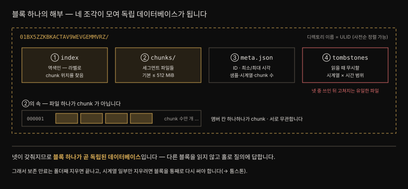

네 조각은 추상이 아니라 눈에 보이는 파일입니다.

```pseudocode
/prometheus/data/
├── 01KYPGY9S4SSXES2Y1WVAW82V0/   ← 영속 블록 (ULID 가 곧 디렉토리 이름)
│   ├── index                     199,817 B
│   ├── chunks/
│   │   └── 000001                333,513 B   ← 세그먼트 파일 (기본 ≤ 512 MiB)
│   ├── meta.json                     697 B
│   └── tombstones                      9 B   ← 지운 게 없어도 파일은 있습니다
├── chunks_head/                  ← head 에서 flush 된 mmap chunk
├── wal/
│   ├── 00000142                3,047,424 B
│   ├── 00000143                   32,768 B   ← 32 KiB = WAL 페이지 버퍼 하나
│   ├── 00000144                        0 B   ← 막 열린 세그먼트
│   └── checkpoint.00000141/
├── lock
└── queries.active
```

블록 디렉토리는 30 개였고 이름은 전부 ULID 입니다. **사전순 정렬이 곧 시간순**이라 `ls` 결과만으로 오래된 블록이 드러나고, 보존 만료가 오래된 것부터 지우는 것([§3](#3-컴팩션과-보존))도 이 성질에 기댑니다.

`wal/` 의 `00000143` 이 정확히 **32,768 B** 인 것은 우연이 아닙니다. [WAL 이 32 KiB 페이지에 모아 내려보낸다](03-02.TSDB%20쓰기%20경로.md#3-walwrite-ahead-log--내구성은-여기서-옵니다)고 한 그 페이지 하나가 파일 크기로 드러난 것입니다.

> 📌 이 절의 실측값은 로컬 Prometheus **v2.55.1** 컨테이너를 직접 열어 확인한 것이라 값 자체는 이 인스턴스의 것입니다(2026-07-29). 재현은 [직접 열어 보기](#직접-열어-보기) 입니다.

### 툼스톤

**툼스톤**은 불변성이 낳은 타협입니다. 시계열 하나를 지우자고 블록을 통째로 다시 쓰는 것은 비싸니, TSDB 는 **읽을 때 무시하라는 표시**만 남깁니다. 무시할 시계열과 함께 **최소·최대 시각**을 담아 그 시간 범위만 걸러 내게 합니다.

> ⚠️ 툼스톤 파일은 블록이 디스크에 쓰인 뒤 **수정되는 유일한 파일**입니다.

`meta.json` 에는 블록의 고유 ID, 최소·최대 시각, 샘플·시계열·chunk 수 같은 통계가 들어갑니다.

### chunk

**chunk** 는 블록의 알맹이이며 `chunks/` 디렉토리의 세그먼트 파일 안에 담깁니다. 저자의 프로덕션 서버에서는 세그먼트 파일 하나에 **400만 개에 가까운 chunk** 가 들어 있습니다.

> ⚠️ `chunks` 디렉토리의 **파일 자체가 chunk 가 아닙니다.** 각 파일은 서로 무관한 수많은 chunk 로 이뤄집니다.

단위가 셋인데 자르는 기준이 전부 다릅니다.

| 단위 | 갈리는 기준 | 값 |
|---|---|---|
| **블록** | 시간 | 2시간 (컴팩션으로 3배씩 커짐 — [§3](#3-컴팩션과-보존)) |
| **세그먼트 파일** | 크기 | 블록의 `chunks/` 는 **512 MiB**, head 의 `chunks_head/` 는 **128 MiB** |
| **chunk** | 시계열 + 샘플 수 | 시계열마다 따로 자라고 **120 샘플**에서 잘림 |

핵심은 층이 다르다는 것입니다. **chunk 안에는 한 시계열만**, 그 chunk 들이 담기는 **파일 안에는 여러 시계열이 섞입니다.** chunk 가 flush 되는 순서대로 들어가고, 파일은 크기가 차면 다음 번호로 넘어갈 뿐이기 때문입니다.

그래서 **파일 배치로는 아무것도 찾을 수 없고**, 그 몫은 [§2](#2-인덱스--역색인이-질의를-이끕니다) 의 인덱스가 짊어집니다. 세그먼트 크기는 `--storage.tsdb.max-block-chunk-segment-size` 로 바꿉니다(최소 1 MiB).

**값을 눌러 담는 일**이 여기서 일어납니다. [§3](#3-컴팩션과-보존) 의 **컴팩션**(블록 합치기)과 한국어로는 둘 다 "압축" 이라 겹쳐 보이지만 다른 일입니다.

chunk 는 첫 타임스탬프 `t0` 와 첫 값 `v0` 만 직접 저장합니다. 이후 타임스탬프는 앞 타임스탬프와의 **델타**로 두고 `t2` 부터는 **델타의 델타**가 됩니다. 값은 앞 값과 **비트 XOR** 로 비교해 차이만 저장하고 같으면 0 이 저장됩니다.

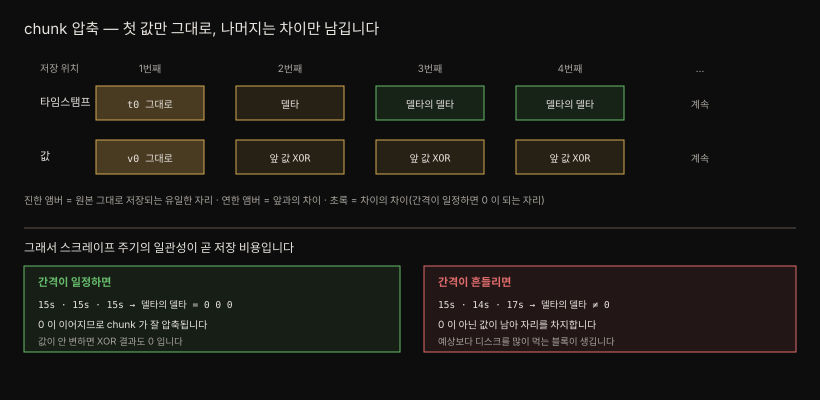

칸 너비가 곧 차지하는 자리입니다. 첫 샘플은 128 비트를 그대로 쓰지만 뒤로 갈수록 몇 비트로 줄어 **샘플마다 자리가 다른 가변 길이 스트림**이 됩니다. 그래서 chunk 파일을 열어도 시각·값 쌍은 보이지 않고, 앞머리의 매직 넘버와 버전 뒤로 눌러 담은 비트만 있습니다.

```bash
od -A d -t x1 -N 8 <블록>/chunks/000001
```

```pseudocode
0000000  85 bd 40 dd  01 00 00 00
         └─ 매직 4바이트 ─┘      └ 버전 1
```

공식 포맷 문서는 이 매직을 `0x85BD40DD` 로 적습니다.[^chunks-format] 바이트가 읽힌 순서 그대로입니다.

`chunks_head/` 파일도 같은 배치를 쓰지만 **매직이 다릅니다** — `0x0130BC91` 입니다.[^headchunks-format] 앞 네 바이트만 보면 지금 연 파일이 영속 블록의 것인지 head 의 것인지 갈립니다.

인덱스가 왜 필요한지도 여기서 분명해집니다. chunk 에는 **어느 시계열의 것인지가 적혀 있지 않습니다.** 라벨은 전부 `index` 가 들고 있어, chunk 만으로는 이 숫자 열을 해석할 수 없습니다.

압축이 먹히는 조건도 짚어 둘 값어치가 있습니다. 스크레이프 간격이 일정하면 타임스탬프 델타가 전부 0 이 되어 압축률이 뛰지만, 간격이 흔들리면 그 0 이 깨져 예상보다 디스크를 먹는 블록이 생깁니다. **스크레이프 주기의 일관성이 곧 저장 비용**입니다.


## 2. 인덱스 — 역색인이 질의를 이끕니다

> **포스팅** 인덱스가 라벨로 시리즈 ID 를 좁히고, **시리즈 인덱스**가 그 ID 로 chunk 위치를 찾습니다. 질의는 이 두 단을 거쳐 샘플에 닿습니다.

인덱스가 없으면 블록은 쓸모가 없습니다. 어떤 시계열이 블록에 있는지, 그 값이 어디 있는지 알 길이 없기 때문입니다. 정확히 말하면 **역색인(inverted index)** 입니다.

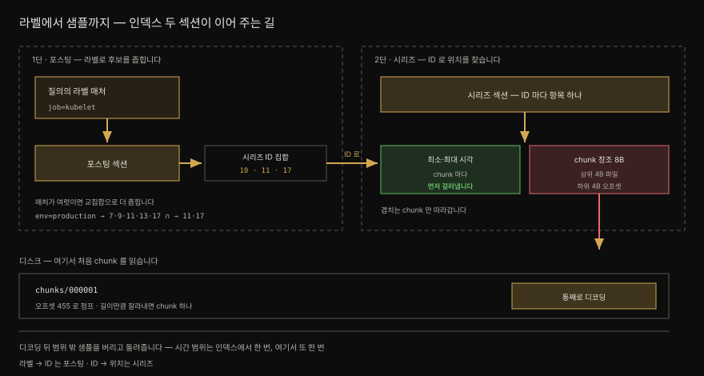

읽는 방향이 곧 구조입니다. **라벨 → ID** 를 포스팅이 맡고, **ID → 위치** 를 시리즈가 맡습니다. 여기에 진입점인 **TOC** 가 붙어 셋이 됩니다.

**TOC** 는 파일의 앞이 아니라 **끝** 에 있습니다. 다른 섹션이 몇 바이트 지점에서 시작하는지 알려 주며, 구조가 미리 정해져 있어 시계열 수와 무관하게 **크기가 고정**입니다. (쓰이지 않는 Label Index 섹션이 하위 호환용으로 더 있습니다.)

**포스팅** 은 라벨과 그 라벨을 가진 시계열 집합의 관계를 담고, 유일한 라벨 조합마다 유일한 시리즈 ID 를 줍니다. 셀렉터가 여럿이면 **교집합**입니다.

```pseudocode
{job="kubelet"}      → 시리즈 ID [10, 11, 17]
{env="production"}   → 시리즈 ID [7, 9, 11, 13, 17]
교집합               → [11, 17]   ← 시리즈 인덱스에서 찾아볼 대상
```

> 📌 "포스팅" 은 문서 색인 분야에서 전문 색인이 문서 ID 를 부르던 용어에서 온 것으로 보입니다(TSDB 메인테이너 Ganesh Vernekar).

**시리즈** 는 유일한 라벨 셋마다 항목을 가집니다. 여기서 앞서 미룬 사실이 드러납니다 — **메트릭 이름은 `__name__` 이라는 라벨로 저장됩니다.** 그래서 항목은 `{__name__="node_cpu_seconds_total", job="node_exporter"}` 처럼 생겼습니다.

각 항목은 라벨 정보와 chunk 개수, 그리고 chunk 마다 **최소·최대 시각**과 참조를 담습니다. 시각을 인덱스에 둔 이유는 **질의 범위 밖의 chunk 를 읽느라 시간을 낭비하지 않기 위해서** 입니다.

> 📌 시계열당 chunk 수는 블록 길이로 정해지지 않습니다. 실측한 블록 30 개에서 기간이 같은 6시간짜리들끼리도 **시계열당 3 개에서 12 개까지** 흩어졌습니다. chunk 가 시간이 아니라 **샘플 수**(목표 120)로 잘리기 때문입니다. §1 의 "스크레이프 주기의 일관성이 곧 저장 비용" 이 여기서 숫자로 드러납니다(2026-07-29 실측).

그러면 chunk 위치를 어떻게 적을까요. §1 에서 본 대로 **파일 안 배치에는 의미가 없습니다.** 이웃한 chunk 가 같은 시계열일 이유가 없으니, "몇 번 파일" 만으로는 닿지 못하고 **그 파일 안 몇 바이트 지점인지**까지 있어야 합니다.

담을 것이 둘로 정해진 셈입니다. TSDB 는 이걸 `uint64` **8바이트 하나에 절반씩** 넣습니다.

- **상위 4바이트** — 어느 chunk 세그먼트 파일인지
- **하위 4바이트** — 그 파일 안 어느 오프셋에서 chunk 가 시작하는지

포맷 문서가 이 분할을 그대로 규정합니다.[^chunks-format] 블록의 `chunks/` 와 head 의 `chunks_head/` 가 같은 규칙을 씁니다.[^headchunks-format]

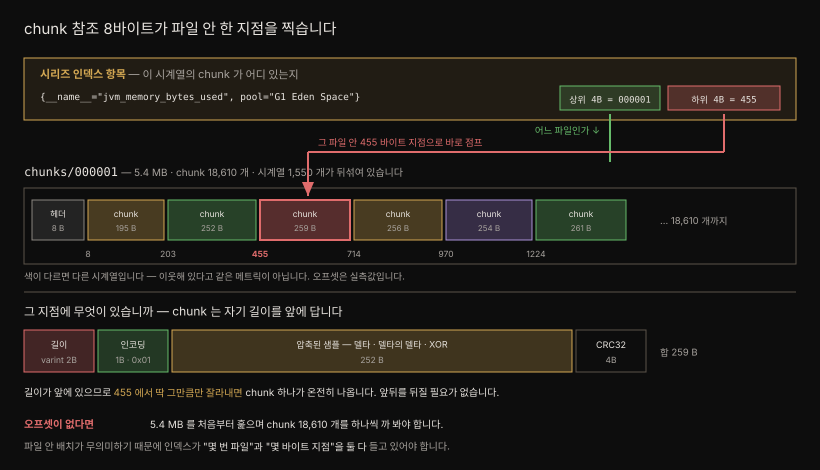

도착 지점의 배치도 정해져 있습니다. chunk 는 `[길이 uvarint][인코딩 1B][데이터][체크섬 4B]` 순이라, 오프셋으로 점프해 **길이만큼 잘라내면** chunk 하나가 온전히 나옵니다.[^chunks-format] uvarint 는 작은 수일수록 적은 바이트를 쓰는 가변 길이 정수 표기입니다. 체크섬은 흔한 CRC-32 가 아니라 **CRC-32C**(Castagnoli)이며 인코딩 바이트와 데이터를 함께 덮습니다.

> 📌 실측 블록(`numSeries` 1,550 · `numChunks` 18,610)의 chunk 사슬은 오프셋 8 → 203 → 455 → 714 → 970 → 1224 로 이어졌고, 인코딩 바이트는 전부 `0x01`(XOR)이었습니다. 
>
> 앞 chunk 의 길이로 다음 위치를 계산해 열어 보면 거기서 실제로 다음 chunk 가 시작합니다. 재현은 [직접 열어 보기](#직접-열어-보기) 4단계입니다(2026-07-29 실측).

그러면 곧장 걸리는 것이 있습니다. **컴팩션으로 블록이 합쳐지면 오프셋이 달라지지 않습니까.** 달라집니다. 그런데도 참조가 깨지지 않습니다.

[컴팩션이 기존 파일을 고치지 않고 새 블록을 통째로 쓰기](#3-컴팩션과-보존) 때문입니다. 새 블록의 `index` 와 `chunks/` 가 **함께 태어나므로** 새 오프셋이 새 인덱스에 적히고, 옛 인덱스는 옛 chunk 파일과 같이 사라집니다. 낡은 오프셋만 남는 일이 없습니다.

그래서 **chunk 참조는 블록 안에서만 유효합니다.** `455` 는 "이 블록의 `000001` 파일 안 455" 이지 전역 주소가 아닙니다. 블록이 독립된 데이터베이스라는 §1 의 성질이 여기서 다시 작동하는 셈입니다.

뒤집어 보면 **불변성이 이 주소 체계를 성립시키는 전제**입니다. 블록을 고칠 수 있었다면 파일 중간의 chunk 하나만 지워도 뒤따르는 chunk 가 전부 밀려 인덱스의 참조 수천 개가 한꺼번에 무효가 됩니다. 툼스톤이 도려내지 않고 표시만 남기는 이유가 이것이고, 실제 제거를 **어차피 새로 쓰는** 컴팩션까지 미루는 이유도 같습니다.

| 상황 | 오프셋 | 왜 안전한가 |
|---|---|---|
| 컴팩션 | **전부 달라짐** | 인덱스도 같이 새로 쓰이고 옛 블록은 통째로 삭제 |
| 보존 만료 | 해당 없음 | 폴더째 삭제 |
| 시계열 삭제 | **안 변함** | 툼스톤 표시만 — 파일을 건드리지 않음 |
| 블록 존속 중 | **불변** | 한 번 쓰인 블록은 고칠 수 없음 |

마지막으로 **시간 범위가 두 번 쓰인다는 점**을 짚습니다. 시리즈 인덱스에서 한 번, 샘플을 돌려주기 직전에 또 한 번입니다.

| 거르기 | 어디서 | 무엇을 |
|---|---|---|
| 거친 것 | **인덱스** | chunk 의 최소·최대 시각을 보고, 안 겹치는 chunk 는 **아예 읽지 않습니다** |
| 세밀한 것 | **디코딩 뒤** | 읽어 온 chunk 를 풀어서 범위 밖 샘플을 버립니다 |

한 번에 끝내지 못하는 이유는 §1 의 압축에 있습니다. 값이 앞 값과의 XOR, 시각이 델타의 델타라 **n 번째 샘플을 알려면 앞을 전부 풀어야** 합니다. 중간부터 읽지 못하니 chunk 는 언제나 통째로 디코딩됩니다.

`12:00~12:30` 을 덮는 chunk 에 `12:10~12:20` 을 묻는 경우를 놓고 보면 분명해집니다.

```pseudocode
chunk 범위   12:00 ─────────────────────── 12:30
질의 범위            12:10 ───── 12:20
                 ↑ 겹침 → 1회차 통과 (chunk 를 엽니다)

디코딩 결과   12:00 ─────────────────────── 12:30   ← 통째로 풀립니다
버릴 것       └── 12:00~12:10 ──┘   └── 12:20~12:30 ──┘   ← 2회차가 버립니다
```

겹치기만 하면 1회차는 통과시킬 수밖에 없고, 압축 탓에 `12:00` 부터 전부 풀리니 양끝 샘플이 딸려 옵니다. 이걸 버리는 것이 2회차입니다.

**두 회차가 보는 단위가 다릅니다.** 1회차는 **chunk 단위**로 이 덩어리를 열지 말지 정하고, 2회차는 **샘플 단위**로 이 점을 결과에 넣을지 정합니다. 앞서 본 길이 varint 는 여기 끼지 않습니다 — 그건 바이트 경계를 찾는 장치일 뿐 시간 판정에 관여하지 않습니다.

그래서 **애초에 읽지 않아도 되는 chunk 를 건너뛰는 일**이 중요해집니다. 인덱스가 chunk 마다 시각을 들고 있는 이유가 여기서 닫힙니다.

### 왜 하필 이 모양인가

여기까지 오면 조각이 다 나왔습니다. head 블록, WAL, 불변 블록, chunk, 역색인. 처음 보면 서로 무관한 장치가 다섯 개 붙어 있는 것처럼 보이는데, 실은 **한 가지 선택에서 차례로 떨어져 나온 것들**입니다.

그 선택은 [03-01 §1](03-01.데이터%20모델.md#1-데이터-모델-3층--메트릭-시계열-샘플) 에서 이미 했습니다 — 표를 통째로 두지 않고 시계열마다 쪼개 눕히기. 모니터링 질의가 한 대상을 세로로 길게 읽기 때문이었습니다. 나머지는 그 뒤를 따라옵니다.

| 무엇이 필요했나 | 그래서 나온 것 | 확인 |
|---|---|---|
| 같은 시계열 값을 나란히 두기 | chunk (시계열마다 하나씩 자람) | [§3](03-02.TSDB%20쓰기%20경로.md#2-샘플-하나가-걸어가는-길) |
| 나란히 둔 값을 잘게 압축하기 | 델타·XOR — 앞 값을 알아야 다음이 풀림 | [§1](#1-블록과-chunk--불변이-모든-것을-결정합니다) |
| 압축된 덩어리를 고치지 않기 | **블록 불변** | [§1](#1-블록과-chunk--불변이-모든-것을-결정합니다) |
| 고치지 못하니 지우는 법이 따로 | 툼스톤 · 컴팩션 때 실제 제거 | [§3](#3-컴팩션과-보존) |
| 고정된 덩어리를 주소로 가리키기 | chunk 참조 8바이트 (블록 안에서만 유효) | [§2](#2-인덱스--역색인이-질의를-이끕니다) |
| 라벨로 시계열을 좁히기 | 역색인 — 포스팅 + 시리즈 | [§2](#2-인덱스--역색인이-질의를-이끕니다) |
| 메모리에 모으는 동안 안 잃기 | WAL (순차 쓰기라 싸다) | [§4](03-02.TSDB%20쓰기%20경로.md#3-walwrite-ahead-log--내구성은-여기서-옵니다) |

읽는 방향을 뒤집으면 이렇게도 됩니다.

1. **압축을 세게 하려니** 불변이 필요했습니다.
2. **불변이라** 툼스톤이 필요했습니다.
3. **불변이라** 오프셋이 안전해졌습니다.

셋째 줄의 근거는 [§2](#2-인덱스--역색인이-질의를-이끕니다) 에서 이미 폈습니다. 불변은 제약처럼 보이지만 주소 체계를 성립시키는 전제입니다.

거꾸로, 이 설계가 **포기한 것**도 분명합니다. 

- 샘플 하나를 수정하거나 임의의 행을 골라 지우는 일은 못 합니다. 모니터링 데이터는 한 번 쓰고 지우지 않으며 시간 범위로만 읽는다는 전제를 깔았기 때문입니다. 그 전제가 맞지 않는 데이터라면 이 구조는 나쁜 선택입니다. 
- 인덱스가 chunk 의 최소·최대 시각을 들고 있는 이유가 여기서 닫힙니다 — 한 시계열이 chunk 여럿을 갖는데(위 오프셋 실측에 쓴 블록은 시계열 1,550 개에 chunk 18,610 개로 **시계열당 열둘** 꼴이었습니다) 1시간 질의라면 그중 몇 개만 건드리면 됩니다.


## 3. 컴팩션과 보존

> 작은 블록을 3배씩 키워 합치는 것이 컴팩션이고, 시간·크기 임계를 넘긴 블록을 지우는 것이 보존입니다. 둘 다 기본 1분 간격으로 점검합니다.

두 가지가 블록 하나의 일생을 이룹니다. 컴팩션이 키우고, 보존이 지웁니다.

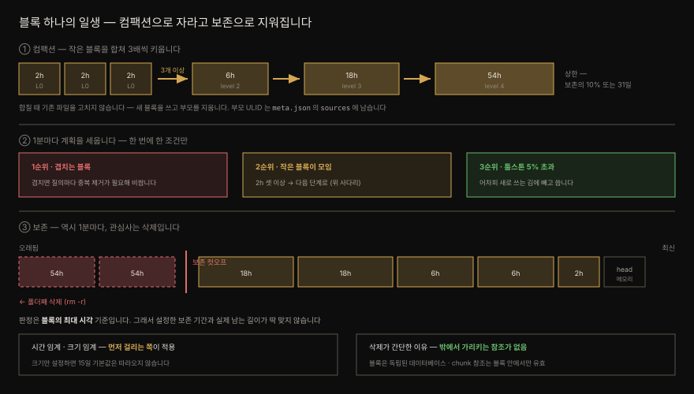

### 컴팩션 — 합쳐서 키웁니다

2시간짜리 블록마다 비슷한 인덱스가 반복되는 것은 낭비입니다. 라벨이 잘 바뀌지 않는(메트릭 churn 이 낮은) 환경일수록 그렇습니다.

**컴팩션**은 작고 인접한 블록 여럿을 큰 블록 하나로 합쳐 이를 덜어냅니다. 인접한 블록들이 **다음 단계의 시간 구간을 다 덮으면** 한 단계 올라가고, 기본 2시간에서 **3배씩** 자랍니다.

```pseudocode
2h → 6h → 18h → 54h
```

사다리가 무한히 올라가지는 않습니다. **보존 기간의 10% 또는 31일 중 작은 값**이 상한입니다.

합쳐진 흔적은 `meta.json` 에 그대로 남습니다. 실측한 블록 하나가 이렇습니다.

```json
{
  "ulid": "01KYPGY9S4SSXES2Y1WVAW82V0",
  "version": 1,
  "minTime": 1782756649315, "maxTime": 1782777600000,
  "stats": { "numSamples": 40300, "numSeries": 1550, "numChunks": 4650 },
  "compaction": {
    "level": 2,
    "sources": [ "01KWAP7NZ...", "01KWAX7BA...", "01KWB1V3V..." ]
  }
}
```

세 가지가 읽힙니다.

- `level: 2` 에 `sources` **셋** — 2시간 블록 셋이 합쳐져 한 단계 올라갔고, 부모 ULID 로 계보가 추적됩니다.
- `minTime`~`maxTime` 차이가 **5시간 49분** — 6시간에 가깝습니다.
- 시계열 1,550 개에 chunk 4,650 개 — **시계열당 셋** 꼴로, chunk 가 시계열마다 생긴다는 [§1](#1-블록과-chunk--불변이-모든-것을-결정합니다) 과 맞습니다.

**합칠 때 기존 파일은 손대지 않습니다.** 새 블록을 통째로 쓰고 부모 디렉토리를 지웁니다 — `sources` 셋이 그 흔적입니다. `index` 와 `chunks/` 가 함께 새로 태어나므로 낡은 주소가 남지 않고, 이것이 [§2](#2-인덱스--역색인이-질의를-이끕니다) 의 오프셋이 안전한 이유입니다.

Prometheus 는 **기본 1분 간격**으로 컴팩션 계획을 세웁니다. 이 간격은 하드코딩이 아니라 `BlockReloadInterval` 옵션의 기본값이고, 스크레이프가 head 를 충분히 채웠을 때도 별도로 트리거됩니다. 계획은 세 조건을 보며 **우선순위도 이 순서**입니다.

| 우선순위 | 조건 | 왜 |
|---------|------|-----|
| 1 | 겹치는 블록이 있는가 | 겹친 블록 질의는 중복 제거가 필요해 비쌈 |
| 2 | 인접 블록들이 다음 단계 구간을 다 덮는가 (최소 2개) | 2시간 블록들이 6시간 구간을 채우면 → 6시간 블록 |
| 3 | 툼스톤이 블록 시계열의 5% 를 넘는가 | 블록 전체 재작성 비용을 낼 만큼 회수량이 클 때만 |

계획 하나는 세 조건 중 **하나만** 다룹니다. 그래서 조건마다 별도의 컴팩션 실행이 필요하고 여러 번 돌 수 있습니다.

### 삭제가 둘로 갈립니다

**단위가 다르면 방법도 갈립니다.**

| | 사용자 삭제 요청 | 보존 기간 만료 |
|---|---|---|
| 단위 | 시계열 × 시간 범위 (**블록 일부**) | **블록 전체** |
| 방법 | 툼스톤 남김 → 컴팩션 때 실제 제거 | **폴더째 삭제** |
| 이유 | 블록이 불변이라 일부만 못 지움 | 블록 경계가 곧 시간 경계 |

"폴더째 삭제" 는 말 그대로입니다. 블록은 [§1 의 디렉토리 트리](#1-블록과-chunk--불변이-모든-것을-결정합니다) 에서 본 디렉토리 하나이므로 보존 만료가 `rm -r` 과 다르지 않습니다.

그렇게 간단한 이유는 앞의 두 절이 깔아 두었습니다. 블록은 독립된 데이터베이스라 남이 그 안을 들여다보지 않고, [chunk 참조는 블록 안에서만 유효](#2-인덱스--역색인이-질의를-이끕니다)해서 밖에서 이 블록을 가리키는 주소가 없습니다. 끊어질 참조가 없으니 정리할 것도 없습니다.

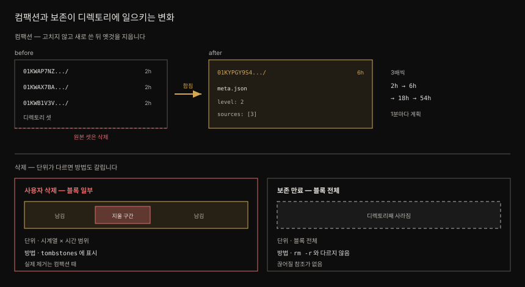

툼스톤이 컴팩션 우선순위 3번인 이유도 여기서 닫힙니다. 툼스톤만 보고 블록을 다시 쓰는 것은 비싸지만, **어차피 새 블록을 쓰는 김에** 툼스톤 구간을 빼고 쓰면 값이 거의 들지 않습니다.

### 보존 — 임계를 넘기면 지웁니다

**보존(retention)** 은 컴팩션과 가깝습니다. 같은 주기로 점검하되 관심사는 삭제이며, 두 임계치 중 하나라도 넘으면 블록을 지웁니다.

| 플래그 | 기본값 | 단위 |
|--------|--------|------|
| `--storage.tsdb.retention.time` | **둘 다 미설정일 때만** `15d` | y, w, d, h, m, s, ms |
| `--storage.tsdb.retention.size` | `0` (비활성) | B, KB, MB, GB, TB, PB, EB (2의 거듭제곱) |

`15d` 기본값에 붙은 **조건**이 함정을 만듭니다. 둘 다 설정하지 않았을 때만 발동하므로, 크기 보존만 켜면 시간 제한이 따라오지 않습니다.[^storage-retention]

| 설정한 것 | 시간 보존 | 크기 보존 |
|---|---|---|
| 아무것도 안 함 | `15d` (기본값 발동) | 없음 |
| `retention.time` 만 | 설정값 | 없음 |
| `retention.size` 만 | **없음** ← 함정 | 설정값 |
| 둘 다 | 설정값 | 설정값 |

"크기 안전장치만 하나 걸어 두자" 고 `retention.size` 만 적으면 디스크가 찰 때까지 데이터가 쌓입니다. 시간 제한을 원하면 **명시적으로 함께 적습니다.** 둘 다 걸었다면 먼저 걸리는 쪽이 적용됩니다.

**판정 단위**도 놓치기 쉽습니다. 보존은 샘플이 아니라 **블록 단위**로, **블록의 최대 시각**을 기준으로 적용됩니다. 그래서 설정값과 실제로 남는 길이가 정확히 맞아떨어지지 않습니다.

크기 기반에는 단서가 둘 더 붙습니다. 지워지는 것은 **영속 블록뿐**인데 크기를 **셀 때는 WAL 과 `chunks_head` 도 포함**되어, 지울 수 없는 것까지 세는 셈입니다. 그리고 지우는 순서는 `meta.json` 의 최대 타임스탬프 정렬을 따라 **오래된 블록부터**라, 아무 블록이나 무작위로 사라지지는 않습니다.

공식 문서가 보존 크기를 **가용 디스크의 80~85% 이하**로 권하는 이유도 같은 결입니다. 컴팩션이 원본 블록과 새 블록을 잠시 동시에 들고 있기 때문입니다.

> **책이 쓰인 뒤 바뀐 것 둘.** 최신 Prometheus 는 이 계산을 손으로 하지 않아도 되게 **비율 지정**을 지원합니다. 설정 파일의 `storage.tsdb.retention.percentage` 에 값을 주면 디스크 크기를 보고 바이트를 환산하며, 비율을 주면 그것이 절대 크기보다 우선합니다.
>
> 그리고 보존 설정의 자리 자체가 옮겨 갔습니다. 본문의 두 **CLI 플래그는 현재 `[DEPRECATED]` 로 표시**되어 있고, 같은 값을 설정 파일의 `storage.tsdb.retention` 아래 `time`·`size`·`percentage` 로 적는 것이 새 방식입니다. 책이 기준한 판에서는 플래그가 정식 수단이었으므로 본문 설명은 그대로 두고, 지금 쓰는 버전에서 `--help` 로 확인하십시오.

저자는 실무에서 **둘 다** 겁니다. 크기 기반은 디스크를 채워 서버를 망가뜨리는 일을 막는 안전장치이고, 이상적으로는 걸리지 않아야 합니다. 걸린다면 `prometheus_tsdb_size_retentions_total` 이 오르는 것을 보고 알림을 띄워 **설정한 시간보다 일찍 데이터를 잃고 있음**을 알립니다.

> **컴팩션은 데이터를 오래 남기지 못합니다.**
>
> - 컴팩션이 줄이는 것은 주로 반복되는 **인덱스**입니다. 툼스톤 구간의 샘플을 함께 걷어내기는 하지만 해상도를 낮추지는 않습니다 — **다운샘플링은 하지 않습니다.** 사다리도 보존 기간의 10% 또는 31일에서 멈추고, 그 위에서 보존이 블록을 **지웁니다.** 아무리 잘 합쳐도 기본 15일 뒤에는 사라집니다.
> - 그래서 오래 보려면 지워지기 **전에 블록을 밖으로 내보내야** 합니다. Thanos 라면 Sidecar 가 2시간마다 새 블록을 오브젝트 스토리지(S3 등)로 올립니다. 이것이 가능한 이유는 이 절이 이미 깔아 두었습니다 — 블록은 독립된 디렉토리이고 밖에서 그 안을 가리키는 참조가 없어서, `rm -r` 로 지울 수 있다면 통째로 옮길 수도 있습니다.
> - 다만 **로컬 컴팩션은 꺼야 합니다.** Sidecar 가 올리는 중에 Prometheus 가 그 블록을 합쳐 버리면 업로드된 데이터가 깨집니다. Thanos 문서는 `--storage.tsdb.min-block-duration` 과 `max-block-duration` 을 같은 값으로 두라고 요구하며 이를 무시하지 말라고 못박습니다.
> - 이들은 Prometheus 가 하지 않는 일을 하나 더 합니다. 1년 전 데이터를 15초 간격으로 볼 일은 없으므로 5분·1시간 두 해상도로 **다운샘플링**해 둡니다.
> - 내보내는 경로와 프로토콜은 [09-01. remote write 와 remote read](09-01.remote%20write%20와%20remote%20read%20—%20프로토콜·에이전트·튜닝.md) 에서 봅니다.

> 앞 절([03-02. TSDB 쓰기 경로](03-02.TSDB%20쓰기%20경로.md#4-head-chunk-의-생명주기))에서 "flush 된 chunk 는 메모리에 위치만 남는다" 고 했습니다. 그 위치 참조가 곧 mmap 이며, 여기서 세 단계로 풉니다.


## 4. mmap — 복사하지 않고 위치만 적어 둡니다

> **한 줄 요약: 디스크 파일을 복사하지 않고 메모리 주소로 부를 수 있게 해 두고, 실제로 읽는 조각만 OS 가 올려 주게 맡기는 기능입니다.**

먼저 **어디에 영향을 주는 기능인지** 못박아 둡니다. mmap 은 쓰기 경로를 바꾸지 않습니다.

| | mmap 이 하는 일 |
|---|---|
| head chunk → 디스크 flush | **관여하지 않습니다.** mmap 이 없어도 flush 는 그대로 일어납니다 |
| flush 뒤 메모리에 남길 것 | **여기입니다.** 내용 대신 위치만 남깁니다 |
| 나중에 그 chunk 를 읽을 때 | **여기입니다.** 읽는 조각만 OS 가 올려 줍니다 |

그러니까 **쓰기 쪽 이야기가 아니라 "메모리를 아끼면서도 나중에 읽을 수 있게" 하는 장치**입니다. 실익은 전부 조회 때 나옵니다.

이름 때문에 오해하기 쉬운 물건이라 세 걸음으로 나눠 봅니다.

### 1단계 — 무엇이 문제입니까

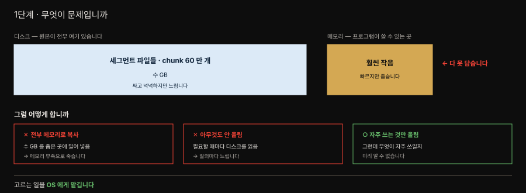

앞 소절의 계산대로 chunk 는 **시계열 5 만 개 × 6 시간 = 약 60 만 개**까지 갑니다. 원본은 전부 디스크에 있고 양은 수 GB 인데, 메모리는 그보다 훨씬 좁습니다.

방법이 셋인데 둘은 막힙니다.

| 방법 | 결과 |
|---|---|
| 전부 메모리로 복사 | 메모리 부족으로 죽습니다 |
| 아무것도 안 올림 | 질의마다 디스크를 읽어 느립니다 |
| **자주 쓰는 것만 올림** | 답이지만 — **무엇이 자주 쓰일지 미리 알 수 없습니다** |

세 번째가 답인데 "무엇을 올릴지" 를 정하기가 어렵습니다. **mmap 은 이 고르는 일을 OS 에게 넘깁니다.**

### 2단계 — mmap 은 무엇입니까

**가장 흔한 오해부터 걷어 냅니다. mmap 은 "메모리에 있는 무언가" 가 아닙니다.** 파일을 메모리로 올리는 동작도 아닙니다.

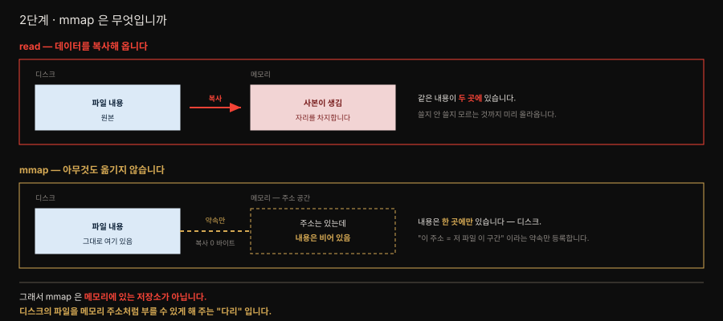

`read` 와 견주면 분명해집니다.

- **`read`** — 파일 내용을 메모리로 **복사합니다.** 같은 내용이 디스크와 메모리 **두 곳에** 생기고, 메모리 쪽이 자리를 차지합니다.
- **`mmap`** — **아무것도 복사하지 않습니다.** "이 주소 범위는 저 파일의 이 구간" 이라는 **약속만** 커널에 등록합니다. 이 시점에 디스크에서 읽어 온 바이트는 **0 개**입니다.

그러니 mmap 을 건 직후의 상태는 **주소는 있는데 내용은 비어 있는** 상태입니다. 데이터는 여전히 디스크에만 있습니다.

> **그래서 mmap 은 메모리에 있는 저장소가 아니라, 디스크의 파일을 메모리 주소처럼 부를 수 있게 해 주는 "다리" 입니다.**
>
> 세그먼트 파일이 디스크에 있다는 사실과 mmap 은 모순되지 않습니다 — mmap 은 그 디스크 파일을 가리키는 장치이기 때문입니다.

### 3단계 — 그럼 언제 메모리로 올라옵니까

**프로그램이 그 주소를 실제로 읽는 순간입니다.**

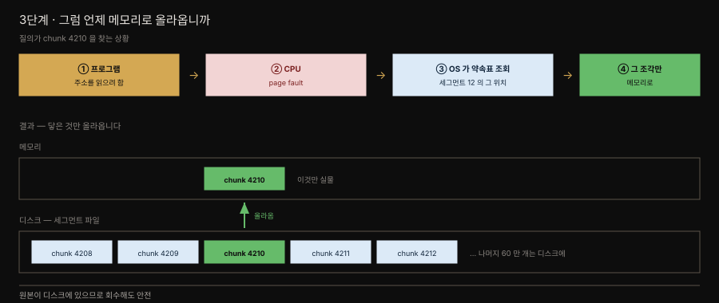

1. 프로그램이 chunk 4210 에 해당하는 주소를 읽으려 합니다.
2. CPU 가 "이 주소에 실물이 없다" 는 신호를 올립니다 (**page fault**).
3. OS 가 약속표를 보고 "세그먼트 12 의 그 위치" 를 찾습니다.
4. **그 조각만** 디스크에서 물리 메모리로 올립니다.

프로그램 코드에는 `read` 호출이 없습니다. 그냥 메모리를 읽는 것처럼 보이는데, 그 밑에서 OS 가 알아서 채워 넣습니다.

질의가 닿지 않은 **나머지 60 만 개는 디스크에 그대로** 있고 메모리를 전혀 차지하지 않습니다. 메모리가 부족해지면 OS 가 올려 둔 조각을 버리는데, **원본이 디스크에 있으니 안전합니다.** 필요하면 다시 읽으면 그만입니다.

결과적으로 **자주 보는 최근 chunk 만 자연히 메모리에 남습니다.** 캐시 정책을 Prometheus 가 직접 짜지 않고 OS 의 페이지 캐시에 얹은 셈입니다.

> 💬 **비유와 그 한계**: "조회된 것만 메모리에 올린다" 는 점에서 RDB 의 **버퍼 풀**과 결과가 닮았습니다.
>
> 다만 갈리는 데가 있습니다 — 버퍼 풀은 대개 DB 가 **직접** 관리하지만, mmap 은 그 판단을 **OS 에게 맡깁니다.** Prometheus 에는 "어느 chunk 를 캐싱할지" 정하는 코드가 없습니다. 무엇을 올리고 언제 버릴지는 전부 커널의 페이지 캐시가 정합니다.

정리하면 이렇습니다.

- **쓰기** — mmap 과 무관하게 일어납니다.
- **메모리** — 내용 대신 위치만 남습니다.
- **읽기** — 닿는 조각만 OS 가 올려 줍니다.

그 "읽기" 가 실제로 어떤 경로를 타는지, 곧 **라벨 셋으로 어느 chunk 를 읽을지 어떻게 찾아내는지**는 인덱스의 몫이라 [03-03 §2](03-03.TSDB%20저장%20구조.md#2-인덱스--역색인이-질의를-이끕니다) 에서 다룹니다. 질의 문법 자체는 [03-04. PromQL 기초](03-04.PromQL%20기초.md) 입니다.

> **개수 정리.** mmap 호출은 **세그먼트 파일 하나당 한 번**입니다([`head_chunks.go` L333·L636](https://github.com/prometheus/prometheus/blob/main/tsdb/chunks/head_chunks.go)).
>
> 파일은 128 MiB 마다 끊기므로 chunk 가 60 만 개여도 매핑은 수십 개뿐입니다. chunk 마다 하나씩 있는 것은 mmap 이 아니라 `mmappedChunk` 구조체(파일 위치 `ref` 8 바이트 + 시간 범위)이며, 이 8 바이트가 어떻게 한 지점을 찍는지는 [03-03 §2](03-03.TSDB%20저장%20구조.md#2-인덱스--역색인이-질의를-이끕니다) 에서 다룹니다.

> 앞 소절에서 "참조만 남는다" 고 한 그 참조가 곧 이 대응표입니다. 둘은 다른 이야기가 아닙니다.


## 직접 열어 보기

> 이 문서의 실측값은 전부 로컬 컨테이너 하나에서 나왔습니다. 같은 경로를 따라가면 자기 화면에서 같은 것을 봅니다.

앞의 절들이 말한 `455`·`32,768`·`0x01` 은 설명을 위해 지어낸 숫자가 아니라 디스크에서 읽은 값입니다. 읽는 데 특별한 도구는 필요 없고 `ls`·`xxd`·`promtool` 이면 됩니다. 손이 아니라 눈으로만 따라가도 구조가 훨씬 또렷해집니다.

```bash
# ── 1. 띄웁니다 ────────────────────────────────────────────────
# 블록은 두 시간마다 만들어지므로 갓 띄운 인스턴스에는 wal/ 만 있습니다.
docker run -d --name prom -p 9090:9090 prom/prometheus:v2.55.1
docker exec prom ls -la /prometheus

# ── 2. 디렉토리 트리 (§1) ─────────────────────────────────────
# ULID 이름의 블록 디렉토리와 wal/·chunks_head/ 가 보입니다.
docker exec prom ls -la /prometheus/wal/          # 세그먼트 크기 — 32,768 B
docker exec prom find /prometheus -maxdepth 2 -name meta.json

# ── 3. 컴팩션 흔적 (§3) ───────────────────────────────────────
# level 과 sources 가 그대로 들어 있습니다. sources 가 셋이면 2h 블록 셋이 합쳐진 것.
docker exec prom cat /prometheus/01.../meta.json

# ── 4. chunk 첫 바이트 (§2) ───────────────────────────────────
# [길이 uvarint][인코딩 1B][데이터][체크섬 4B] 배치를 눈으로 확인합니다.
# 인코딩 바이트 01 이 XOR 압축을 뜻합니다.
docker exec prom sh -c 'xxd -l 64 /prometheus/01.../chunks/000001'

# ── 5. 인덱스 요약 ────────────────────────────────────────────
# __name__ 이 특별 취급 없이 여느 라벨과 같이 세어진다는 것이 드러납니다.
docker exec prom promtool tsdb analyze /prometheus 01...
```

> 실측 대상은 스크레이프가 활발한 인스턴스일수록 좋습니다. 이 문서의 값은 Jenkins 를 긁고 있던 v2.55.1 컨테이너에서 나왔고(2026-07-29), 그래서 [03-01 §2](03-01.데이터%20모델.md#2-메트릭-타입-네-가지) 의 `quantile` 라벨 126 건 같은 서머리 실측이 함께 잡혔습니다.


## 심화 학습

> 책이 흐릿하게 남긴 지점과 공식 문서로 보강할 내용을 답니다.

### 언제 TSDB 를 고릅니까 — 남을 설득하는 판별법

"왜 RDB 를 안 쓰느냐" 는 방어적인 질문입니다. 실제로 필요한 것은 **"어떤 데이터일 때 TSDB 가 유리한가"** 라는 판별 기준입니다. 전제 다섯 개로 좁혀집니다.

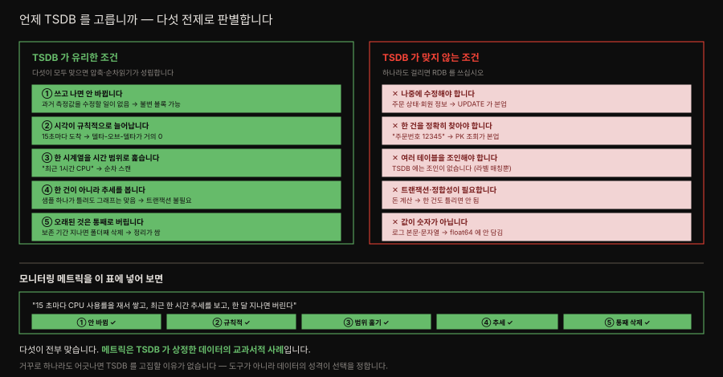

| # | 전제 | 이게 맞으면 가능해지는 것 |
|---|---|---|
| 1. | 쓰고 나면 **안 바뀝니다** | 블록을 불변으로 두고 압축·정렬을 미리 끝냄 |
| 2. | 시각이 **규칙적으로** 늘어납니다 | 델타-오브-델타가 거의 0 → 압축률 급등 |
| 3. | 한 시계열을 **시간 범위로 훑습니다** | 같은 시계열을 붙여 두고 순차 스캔 |
| 4. | 한 건이 아니라 **추세를 봅니다** | 트랜잭션·정합성 비용을 통째로 뺌 |
| 5. | 오래된 것은 **통째로 버립니다** | 폴더째 삭제 → 정리 비용이 0 에 가까움 |

**모니터링 메트릭은 다섯이 전부 맞습니다.** "15 초마다 CPU 사용률을 재서 쌓는다. 최근 한 시간 추세를 본다. 한 달 지나면 버린다" — 하나도 어긋나지 않습니다. 메트릭이 TSDB 를 쓰는 이유는 유행이 아니라 **데이터의 성격이 그렇게 생겨서**입니다.

#### 숫자로 말하면

전제 2 번이 만드는 차이가 가장 큽니다. 공식 문서는 Prometheus 가 **샘플 하나에 평균 1~2 바이트**를 쓴다고 적습니다.[^storage-sizing] 원시 데이터가 16 바이트(시각 8 + 값 8)인데 그렇습니다.

시계열 5 만 개를 15 초 주기로 모으는 서버로 계산해 봅니다. 하루 샘플이 **2 억 8,800 만 개**입니다.

| 저장 방식 | 샘플당 | 하루 | 30 일 |
|---|---|---|---|
| 원시 (압축 없음) | 16 B | 4.3 GiB | 129 GiB |
| RDB (행 헤더 23 B 포함) | 39 B | **10.5 GiB** | **314 GiB** |
| TSDB (실측 압축) | ~1.3 B | **0.35 GiB** | **10.5 GiB** |

**같은 데이터인데 30 배 차이**입니다. 1 년이면 3.7 TiB 대 124 GiB 로 벌어집니다. 서버 한 대에 담기느냐 마느냐가 갈리는 규모라, 이 한 줄이면 대개 설득이 끝납니다.

#### 삽입이 잦다는 것 — 여기가 가장 크게 갈립니다

메트릭의 성격 하나가 더 있습니다. **끊임없이, 대량으로 들어옵니다.** 위 예에서 초당 3,333 샘플이고, 스크레이프 한 번마다 5 만 개가 한꺼번에 도착합니다. 이게 하루도 쉬지 않습니다.

RDB 에서 이 부하가 특히 아픈 이유는 **삽입 한 건이 삽입 한 건으로 끝나지 않기** 때문입니다.

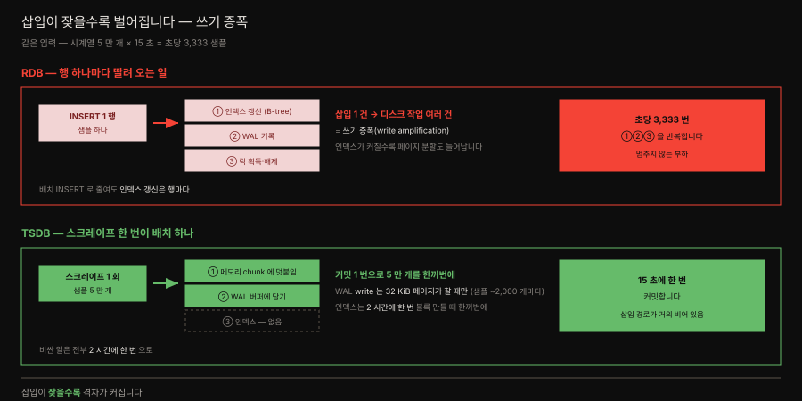

| | RDB | TSDB |
|---|---|---|
| 삽입 단위 | 행 하나씩 | **스크레이프 한 번 = 배치 하나** |
| 인덱스 갱신 | **행마다** B-tree 갱신·페이지 분할 | 삽입 경로에 **없음** (2 시간마다 한꺼번에) |
| 락 | 행·페이지 단위 경합 | 시계열별 append 라 경합이 적음 |
| 디스크 쓰기 | 트랜잭션마다 | WAL **32 KiB 페이지가 찰 때만** (샘플 ~2,000 개마다) |

삽입 한 건에 딸려 오는 부수 작업이 실제 디스크 작업을 몇 배로 불리는 것을 **쓰기 증폭(write amplification)** 이라 합니다. RDB 는 인덱스가 커질수록 이게 심해지는데, 메트릭은 **계속 커지기만 하는** 데이터라 정확히 최악의 조합입니다.

TSDB 는 세 가지로 이를 피합니다.

1. **배치로 묶습니다.** 스크레이프 한 번에 appender 를 하나 열어 샘플을 전부 덧붙이고 **커밋 한 번**으로 끝냅니다.[^scrape-batch] 5 만 건이 트랜잭션 5 만 개가 아니라 하나입니다.
2. **삽입 경로에 인덱스가 없습니다.** 역색인은 2 시간마다 블록을 만들 때 한꺼번에 생성합니다([§4](03-02.TSDB%20쓰기%20경로.md#쓰기-명령어는-같습니다--다른-건-그-앞의-준비) 의 준비 4 단계). 들어올 때는 그냥 메모리에 덧붙일 뿐입니다.
3. **시스템콜을 모읍니다.** WAL 은 샘플마다 `write` 하지 않고 32 KiB 페이지가 찰 때 내려보냅니다. 16 바이트짜리 샘플이라면 **약 2,000 개에 한 번**입니다.

**그래서 삽입이 잦을수록 격차가 벌어집니다.** 하루 한 번 배치로 넣는 데이터라면 RDB 로도 충분하지만, 초당 수천 건이 끊이지 않으면 이 차이가 곧 서버 대수가 됩니다.

#### 유리한 이유를 한 문장씩

- **저장 비용** — 위 표 그대로입니다. 규칙적인 시각과 닮은 값이 압축을 극단으로 밀어 줍니다.
- **질의 속도** — "최근 1 시간 CPU" 가 **연속된 바이트 한 덩이**를 읽는 일이 됩니다. RDB 라면 인덱스를 타고 흩어진 행을 모아야 합니다.
- **쓰기 처리량** — 위 소절 그대로입니다. 삽입 경로가 메모리 append 와 WAL 버퍼뿐이라 **쓰기 증폭이 없습니다.**
- **운영 단순함** — 보존이 **폴더 삭제**입니다. `DELETE FROM ... WHERE ts < ?` 가 만드는 잠금·VACUUM·인덱스 재구성이 아예 없습니다.

#### 반대로, 이럴 땐 쓰지 마십시오

설득력은 **경계를 함께 말할 때** 생깁니다. 다음 중 하나라도 걸리면 TSDB 가 틀린 선택입니다.

| 상황 | 왜 안 되나 |
|---|---|
| 나중에 값을 **수정**해야 함 | 블록이 불변이라 UPDATE 개념이 없음 |
| **한 건**을 정확히 찾아야 함 | 범위 스캔에 최적화돼 단건 조회 이점이 없음 |
| 여러 테이블 **조인**이 필요 | TSDB 에 조인이 없음 — 라벨 매칭뿐 |
| **트랜잭션·정합성**이 필요 | 샘플 유실을 허용하는 설계. 돈 계산에 부적합 |
| 값이 **숫자가 아님** | 값은 숫자뿐입니다(일반 스칼라 샘플은 `float64`). 로그 본문·문자열은 못 담음 |

그래서 실무에서는 **둘을 함께** 씁니다. 주문·회원은 RDB 에, 그 시스템의 응답 시간·처리량은 TSDB 에 둡니다. 경쟁 관계가 아니라 **다른 모양의 데이터를 각자 맡는 것**입니다.

### RDB 로는 왜 안 되는가

[§4](03-02.TSDB%20쓰기%20경로.md#3-walwrite-ahead-log--내구성은-여기서-옵니다) 에서 WAL 이 "파일 끝에 덧붙이기만 한다" 는 것을 보고 나면 자연스레 드는 반문이 있습니다. **RDB 도 항상 삽입만 하고 PK 를 순차로 두면 사실상 WAL append 처럼 되는 것 아닌가요.**

**쓰기 패턴은 실제로 흉내 낼 수 있습니다.** 순차 PK 에 append-only 로 쓰면 인덱스 페이지 분할이 줄고 쓰기가 빨라집니다. 이벤트 소싱이나 로그 테이블이 정확히 그렇게 씁니다. 방향은 맞는 지적입니다.

그래도 남는 차이가 셋인데, **가장 큰 것은 압축**입니다. 그림으로 먼저 봅니다.

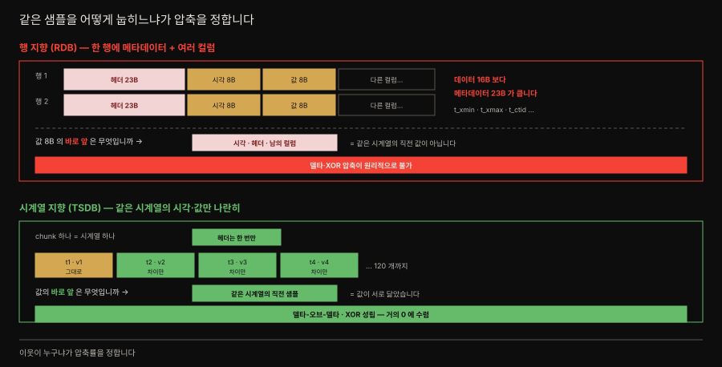

#### 차이 1 압축 — 이웃이 누구냐

[§1](#1-블록과-chunk--불변이-모든-것을-결정합니다) 의 델타-오브-델타와 XOR 은 **"앞 값과의 차이"** 를 저장합니다. 그러니 **바로 앞에 무엇이 있느냐**가 전부입니다.

| | 값의 바로 앞은 | 결과 |
|---|---|---|
| 행 지향 | 시각·헤더·남의 컬럼 | 차이를 내도 **의미 없음** |
| 시계열 지향 | **같은 시계열의 직전 샘플** | 값이 닮아 차이가 **거의 0** |

한 행에 여러 컬럼을 붙여 저장하는 구조에서는 같은 시계열의 연속 샘플이 물리적으로 떨어집니다. **원리적으로 안 되는 것**이지 튜닝이 부족한 것이 아닙니다.

#### 차이 2 행 오버헤드 — 메타데이터가 데이터보다 큽니다

샘플 하나는 시각 8B + 값 8B = **16B** 입니다. 그런데 PostgreSQL 은 행마다 트랜잭션 메타데이터가 붙는 **23 바이트 고정 헤더**(`t_xmin`·`t_xmax`·`t_ctid` 등)를 달고, 사용자 데이터는 그 뒤 MAXALIGN 경계에 맞춰 시작합니다.[^pg-page]

**16 바이트를 담으려고 23 바이트를 더 씁니다.** 반면 TSDB 는 헤더를 chunk 하나에 한 번만 붙이고 그 안에 120 샘플을 담습니다.

#### 차이 3 읽기 패턴 — 한 건 찾기 대 범위 훑기

TSDB 질의는 거의 **"이 시계열의 이 시간 범위 전부"** 입니다([§1](03-01.데이터%20모델.md#1-데이터-모델-3층--메트릭-시계열-샘플) 의 세로로 길게 읽기). RDB 인덱스는 특정 한 건을 빠르게 찾는 데 최적화돼 있어, 범위 스캔에서는 얻는 것이 적습니다.

#### 반례가 결론을 확인해 줍니다

결국 한 줄로 좁혀집니다. 데이터가 **불변이고 규칙적**이라는 전제를 저장 구조가 끝까지 활용하는가, 그것뿐입니다.

**TimescaleDB** 가 이를 뒷받침합니다. PostgreSQL 위에 얹은 시계열 확장인데, 압축할 때 하는 일이 행 저장(rowstore)을 **열 저장(columnstore)으로 바꾸는 것**입니다. 그러면서 쓰는 알고리즘이 타임스탬프에 **델타-오브-델타**, 부동소수점에 **Gorilla 계열 XOR** 입니다.[^timescale]

즉 PostgreSQL 위에서도 **"같은 시계열을 붙여 놓기" 를 먼저 해야** 압축이 듣습니다. Prometheus 가 고른 것과 같은 답에 도착합니다 — **구조가 답을 정합니다.**

**보존 예시 문장은 읽기 나름입니다.** 원문은 54시간 블록이 컷오프에서 삭제되는 예를 듭니다.

| 항목 | 값 |
|------|-----|
| 블록 범위 | `2023-01-01T00:00:00` ~ `2023-01-03T06:00:00` (54시간) |
| 보존 컷오프 | `2023-01-03T05:00:00` |
| 결과 | 블록 전체 삭제 |

원문의 결론은 "leaving you with 53 hours of data less than the configured maximum length of time" 입니다. 이 문장은 쉼표를 어디에 두느냐에 따라 *53시간이 남는다* 로도, *53시간만큼 모자란다* 로도 읽힙니다. 어느 쪽이라고 단정하지 않겠습니다.

확실한 것은 원문이 강조한 **원리**뿐입니다. 보존은 샘플이 아니라 **블록 단위**로 적용되고 판단 기준이 블록의 최대 시각입니다. 그래서 실제 남는 데이터의 길이는 설정값과 어긋납니다.

공식 문서에서 확인되는 사실은 이렇습니다([Storage](https://prometheus.io/docs/prometheus/latest/storage/), [Configuration](https://prometheus.io/docs/prometheus/latest/configuration/configuration/)).

- 시간·크기 보존을 둘 다 걸면 **먼저 걸리는 쪽**이 적용됩니다.
- 만료 블록 정리는 백그라운드로 돌며 **최대 2시간까지 걸릴 수 있습니다.** 디스크가 즉시 줄지 않는다고 놀랄 일이 아닙니다.
- 컴팩션된 블록은 무한히 커지지 않습니다. **보존 기간의 10% 또는 31일 중 작은 값**이 상한입니다. 본문의 2h→6h→18h→54h 는 ×3 규칙이고 이 상한이 그 사다리를 멈춥니다.

**컴팩션 조건 2번은 개수 규칙이 아닙니다.** 원문은 이렇게 적습니다.

> `>=3-hour blocks to make a 6-hour block`, or `>=3 6-hour blocks to make an 18-hour block`

뒤 절은 "6시간 블록 **3개** 이상" 으로 개수를 밝히는데 앞 절은 개수가 빠져 "3시간 블록" 으로 읽힙니다. 3시간 블록은 이 사다리(2h→6h→18h→54h)에 존재하지 않으니 표기가 흔들리는 것은 분명합니다.

그런데 소스를 열어 보면 **애초에 개수가 조건이 아닙니다.** `tsdb/compact.go` 의 `selectDirs()` 가 보는 것은 이렇습니다.

```go
// Pick the range of blocks if it spans the full range (potentially with gaps)
// or is before the most recent block.
if (maxt-mint == iv || maxt <= highTime) && len(p) > 1 {
```

판정 기준은 **그 구간(`iv`)을 다 덮었는가**이고, 개수 조건은 `len(p) > 1` — 최소 **둘**입니다. 2시간 블록이 6시간 구간을 채우면 대개 셋이 되니 "3개" 는 흔한 결과일 뿐 규칙이 아닙니다. 주석이 밝히듯 중간에 갭이 있어도 구간만 덮으면 선택되므로, 컴팩션에 실패한 블록이 섞이면 둘로도 합쳐집니다.

그래서 본문 표에는 개수 대신 구간 기준으로 적었습니다.

**히스토그램의 다음 세대.** 본문의 히스토그램은 버킷을 미리 정해야 하고 버킷마다 시계열이 생겨 카디널리티를 밀어 올립니다. Prometheus 는 이 문제를 풀려고 **네이티브 히스토그램(native histogram)** 을 들여왔습니다. 버킷을 지수적으로 자동 생성해 시계열 하나로 담습니다.

> ⚠️ **책이 쓰인 뒤 지위가 바뀌었습니다.** 2022년 11월 실험 기능으로 도입돼 v2.40.0 에서 처음 지원됐고, **v3.8.0 부터 정식(stable) 기능**입니다([Native histograms](https://prometheus.io/docs/specs/native_histograms/)).
>
> 다만 "정식"이 곧 "기본 켜짐"은 아닙니다. 스크레이프는 여전히 `scrape_native_histograms` 설정으로 명시해야 합니다. 활성화 수단도 옮겨 갔습니다 — v3.8 에서는 기존 `--enable-feature=native-histograms` 플래그가 그 설정을 기본 `true` 로 만드는 역할만 남았고, **v3.9 부터 이 플래그는 완전한 no-op** 이라 `scrape_native_histograms` 를 직접 적어야 합니다.

7장의 카디널리티 제어와 이어 읽으면 좋습니다.

**TSDB 를 더 파려면.** 원문이 거는 링크가 정확합니다.

- TSDB 메인테이너 Ganesh Vernekar 의 연재 — [Prometheus TSDB — The Head Block](https://ganeshvernekar.com/blog/prometheus-tsdb-the-head-block/)
- TSDB 원저자의 최초 설계 글 — [웹 아카이브](https://web.archive.org/web/20210622211933/https://fabxc.org/tsdb/)

본문의 델타-오브-델타·XOR 압축은 Facebook 의 Gorilla 논문 계보입니다. 같은 기법을 이 저장소의 [02-05. Grafana Mimir](../../02_LGTMStack/02-05.Grafana%20Mimir.md) 가 다루는 원격 저장소들도 물려받습니다.

### 같은 저장 원리, 다른 데이터 모델 — TSM 과의 대조

시계열 저장소를 여럿 보다 보면 구조가 닮았다는 인상을 받습니다. 실제로 그렇습니다. InfluxDB 의 **TSM(Time-Structured Merge Tree)** 과 Prometheus TSDB 를 나란히 두면 **저장 원리는 공유하고 데이터 모델이 갈립니다.** 둘을 구분해 보는 것이 이 대조의 값어치입니다.

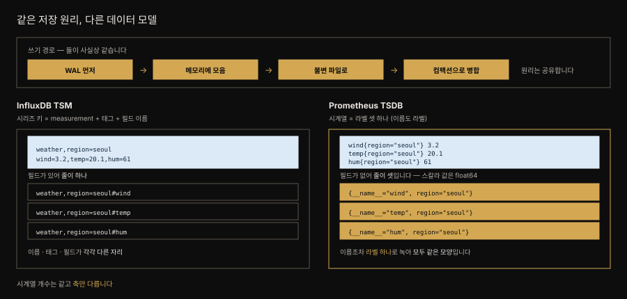

먼저 **공유하는 쪽**입니다. 네 단계가 사실상 같습니다.

| 단계 | TSM | Prometheus TSDB |
|---|---|---|
| 1. 내구성 | WAL 에 먼저 적음 | WAL 에 먼저 적음 |
| 2. 메모리 버퍼 | Cache | head 블록 |
| 3. 시간 파티션 + 불변 파일 | TSM 파일 (불변·압축·mmap) | 블록 (불변·압축·mmap) |
| 4. 정리 | 컴팩션으로 병합 | 컴팩션으로 병합 |

닮은 것은 우연이 아닙니다. 이 계열의 방법은 여러 저장소가 공유하는 공통 자산이고, Prometheus 저장 엔진의 설계자도 **LevelDB·Cassandra·InfluxDB·HBase 를 "검증된 방법" 의 선례로 명시**했습니다.[^fabxc-lineage]

갈리는 쪽은 **시계열을 무엇으로 식별하고 값을 어떤 모양으로 담느냐**입니다.

| | TSM | Prometheus TSDB |
|---|---|---|
| 시계열 식별자 | measurement + 태그 셋 + **필드**[^tsm-engine] | **라벨 셋 하나** (이름도 `__name__` 라벨) |
| 필드라는 자리 | 있음 — 한 지점에 필드 셋이면 시리즈도 셋 | 없음 |
| 값 모델 | 필드마다 타입 (float·int·bool·string) | 일반 스칼라 샘플은 `float64` |

> 네이티브 히스토그램은 샘플 하나가 버킷·합계·개수를 담은 구조체라 위 오른쪽 칸의 셈에서 빠집니다(§심화 학습 앞부분).

그래서 같은 관측 한 번이 TSM 에서는 **필드가 붙은 한 줄**로, Prometheus 에서는 **줄 셋**으로 적힙니다. 시계열 개수는 결국 같지만, Prometheus 쪽은 축이 라벨 하나뿐이라 질의도 라벨 매칭 하나로 닫힙니다([03-01 §1](03-01.데이터%20모델.md#무엇이-시계열-하나를-정하는가)).

> ⚠️ 이 대조는 **두 엔진의 우열이나 채택 여부를 말하지 않습니다.** Prometheus 가 저장 엔진을 다시 설계한 동기는 다른 제품과의 비교가 아니라 **자기 앞 세대(V2)가 운영에서 겪은 문제들**이었고, 그 목록과 대응은 [03-02 §1](03-02.TSDB%20쓰기%20경로.md#1-왜-저장-엔진을-다시-설계했는가) 에 있습니다. 설계 원문은 TSM 을 채택하지 않은 이유를 다루지 않습니다.


## 결정 치트시트

> 이 절이 남기는 판단 기준입니다.

| 상황 | 선택 | 이유 |
|------|------|------|
| 이 데이터를 TSDB 에 둘지 판단 | 다섯 전제로 판별 | 불변·규칙적·범위읽기·추세·통째삭제. 하나라도 어긋나면 RDB |
| 삽입이 초당 수천 건 | TSDB 가 유리 | 배치 커밋 + 삽입 경로에 인덱스 없음 = 쓰기 증폭 없음 |
| 재시작이 느림 | `memory-snapshot-on-shutdown` 검토 | WAL 재생을 대개 건너뜀 |
| 블록이 예상보다 큼 | 스크레이프 주기 흔들림 의심 | 델타가 0 이 아니면 압축률이 무너짐 |
| 디스크가 찰까 걱정됨 | 시간 + 크기 보존 동시 적용 | 크기는 안전장치. 걸리면 알림 |
| 디스크가 즉시 안 줄어듦 | 정상 — 최대 2 시간 기다림 | 만료 블록 정리는 백그라운드 |
| 특정 시계열을 지워야 함 | 툼스톤(삭제 API) | 블록 전체 재작성을 피함 |
| 메모리가 부족해 보임 | mmap 은 회수 가능하니 heap 부터 확인 | 페이지 캐시는 OS 가 알아서 버림 |

> 메트릭 타입 선택(카운터·게이지·히스토그램·서머리)은 [03-01. 데이터 모델](03-01.데이터%20모델.md#결정-치트시트) 에 있습니다.


## 면접 대비

> 이 절에서 면접에 그대로 쓸 수 있는 문장입니다.

### 한 줄 정의

Prometheus TSDB 는 샘플을 **WAL 에 먼저 적어 내구성을 확보하고**, 메모리 head chunk 에 모았다가 **불변 블록으로 내려** 압축·인덱스를 한꺼번에 만드는 구조입니다.

### 핵심 포인트 3가지

1. **WAL 이 먼저이고 메모리가 나중입니다.** 샘플은 head chunk 에 들어가기 전에 WAL 에 적힙니다. 그래서 프로세스가 죽어도 잃지 않고, WAL 은 오직 재시작 복원에만 읽힙니다.
2. **비싼 것은 `write` 가 아니라 그 앞의 준비입니다.** WAL 과 블록은 같은 시스템콜을 쓰지만, 블록은 읽기·정렬·압축·인덱스 네 단계를 거칩니다. 그래서 싼 일은 매 샘플, 비싼 일은 2 시간에 한 번 합니다.
3. **블록은 불변이라 삭제가 표시로 대체됩니다.** 툼스톤으로 "읽을 때 무시" 만 남기고, 툼스톤이 시계열의 5% 를 넘을 때 비로소 컴팩션이 블록을 다시 씁니다.

### 자주 묻는 질문

**Q. mmap 이 무엇을 해 줍니까?**
A. 파일을 복사하지 않고 "이 주소는 저 파일의 이 위치" 라는 대응만 걸어 둡니다. 질의가 그 주소를 실제로 읽는 순간에만 OS 가 해당 조각을 메모리로 올립니다. 그래서 chunk 가 수십만 개여도 참조만 들고 있다가 닿는 것만 올라오고, 캐시 정책은 OS 페이지 캐시에 맡깁니다.

**Q. WAL 은 왜 시간으로 자르지 않습니까?**
A. head 블록은 chunk 마다 최소·최대 시각을 들고 있어 시간으로 정확히 자를 수 있지만, WAL 세그먼트는 레코드가 도착 순서대로 섞여 있어 그 파일의 시간 범위를 알기 어렵습니다. 그래서 앞 3분의 2 를 위치로 자르되, 지우기 전에 아직 필요한 것만 걸러 체크포인트로 남깁니다.

**Q. 스크레이프 주기가 들쭉날쭉하면 왜 디스크를 더 씁니까?**
A. chunk 는 타임스탬프를 델타의 델타로, 값을 앞 값과의 XOR 로 저장합니다. 주기가 일정하면 타임스탬프 델타가 0 이라 압축이 잘 듭니다. 주기가 흔들리면 그 0 이 깨져 압축률이 떨어지고 블록이 예상보다 커집니다.


## 핵심 개념 체크리스트

> 덮고 나서 스스로 물어볼 항목입니다. 막히는 곳이 그 절로 돌아갈 지점입니다.

- [ ] 블록의 네 조각을 나열하고, 불변성이 툼스톤을 낳은 논리를 말할 수 있는가?
- [ ] 블록·세그먼트 파일·chunk 가 각각 무엇으로 갈리는지 구분할 수 있는가?
- [ ] `__name__` 이 라벨로 저장된다는 사실과 시리즈 인덱스의 관계를 아는가?
- [ ] chunk 참조 8바이트가 파일과 오프셋으로 갈리는 이유를 설명할 수 있는가?
- [ ] 질의에서 시간 범위가 두 번 쓰이는 이유를 압축과 엮어 말할 수 있는가?
- [ ] 컴팩션 계획의 세 조건과 우선순위를 나열할 수 있는가?
- [ ] 사용자 삭제와 보존 만료가 방법이 갈리는 이유를 말할 수 있는가?
- [ ] mmap 이 "복사하지 않고 위치만 적어 둔다" 는 뜻임을 설명할 수 있는가?
- [ ] TSDB 가 유리한 다섯 전제를 들어 남을 설득할 수 있는가?

> 쓰기 경로(WAL·head chunk·재시작 복구)는 [03-02 의 스스로 설명해 보기](03-02.TSDB%20쓰기%20경로.md#스스로-설명해-보기), 데이터 모델(메트릭·시계열·샘플·타입)은 [03-01 의 체크리스트](03-01.데이터%20모델.md#핵심-개념-체크리스트) 에 있습니다.


## 참고 자료

> 본문의 사실을 확인한 1차 자료입니다.

- 원본: *Mastering Prometheus* (Packt, ISBN 9781805125662) 3장 — Prometheus's TSDB.
- 원문 더 읽을거리: [Ganesh Vernekar — Prometheus TSDB 연재](https://ganeshvernekar.com/blog/prometheus-tsdb-the-head-block/) · [TSDB 원저자의 최초 설계 글(웹 아카이브)](https://web.archive.org/web/20210622211933/https://fabxc.org/tsdb/)
- 공식 문서: [Storage](https://prometheus.io/docs/prometheus/latest/storage/) · [Configuration](https://prometheus.io/docs/prometheus/latest/configuration/configuration/) · [Native histograms](https://prometheus.io/docs/specs/native_histograms/)
- 대조군: [InfluxDB TSM 저장 엔진](https://docs.influxdata.com/influxdb/v1/concepts/storage_engine/) — §심화의 TSM 대조에서 시리즈 키·필드 모델의 근거
- 소스 대조(본문 수치의 1차 근거): [`tsdb/head.go`](https://github.com/prometheus/prometheus/blob/main/tsdb/head.go) `DefaultSamplesPerChunk = 120` · [`tsdb/head_append.go`](https://github.com/prometheus/prometheus/blob/main/tsdb/head_append.go) chunk 절단 로직 · [`tsdb/chunks/chunks.go`](https://github.com/prometheus/prometheus/blob/main/tsdb/chunks/chunks.go) `DefaultChunkSegmentSize = 512 MiB` · [`tsdb/chunks/head_chunks.go`](https://github.com/prometheus/prometheus/blob/main/tsdb/chunks/head_chunks.go) `MaxHeadChunkFileSize = 128 MiB`
- 실측 근거: 로컬 Prometheus v2.55.1 (jenkins-prometheus 컨테이너) 데이터 디렉토리 — 블록 구조·`meta.json`·chunk 매직·`promtool tsdb analyze` (2026-07-29)


## 관련 문서

> 이 절에서 이어지는 갈래입니다.

| 문서 | 이 절과 어떻게 이어지는가 |
|------|------------------------|
| [03-01. 데이터 모델](03-01.데이터%20모델.md) | **앞 절입니다.** 여기서 저장하는 메트릭·시계열·샘플 3층을 그쪽에서 세웁니다 |
| [03-04. PromQL 기초](03-04.PromQL%20기초.md) | 같은 3장의 뒷절입니다. 이 절의 인덱스가 찾아 준 chunk 를 실제로 질의하는 문법 |
| [02-01. Prometheus 배포](02-01.Prometheus%20배포%20—%20스택%20구성요소와%20Operator.md) | 이 절의 TSDB 플래그(`--storage.tsdb.*`)를 실제로 어디에 적는지 |
| [07-01. 최적화와 디버깅](07-01.최적화와%20디버깅.md) | 카디널리티가 곧 시계열 수라는 논리가 실제 튜닝으로 이어집니다 |
| [09-01. remote write 와 remote read](09-01.remote%20write%20와%20remote%20read%20—%20프로토콜·에이전트·튜닝.md) | 보존 한계를 넘길 때의 출구. 이 절의 블록·압축이 원격 저장소로 어떻게 넘어가는지 |
| [00-01. 용어집](00-01.용어집.md) | chunk·블록·포스팅·툼스톤 등 이 절이 쏟아낸 용어의 정의 |
| [02-05. Grafana Mimir](../../02_LGTMStack/02-05.Grafana%20Mimir.md) | 델타-오브-델타·XOR 압축을 물려받은 원격 저장소 계열 |

[^chunks-format]: Prometheus 소스 `tsdb/docs/format/chunks.md`. 매직 `0x85BD40DD` · 상한 `The maximum size per segment file is 512MiB` · 배치 `len <uvarint> | encoding <1 byte> | data | checksum <4 byte>` · 체크섬은 `Can be referred as a CRC-32C` (2026-08-06 조회).
<https://github.com/prometheus/prometheus/blob/main/tsdb/docs/format/chunks.md>

[^headchunks-format]: Prometheus 소스 `tsdb/docs/format/head_chunks.md`. 매직은 `0x0130BC91` 로 블록 쪽과 다릅니다. 참조 규정은 양쪽 모두 `in-file offset (lower 4 bytes) and segment sequence number (upper 4 bytes)` (2026-08-06 조회).
<https://github.com/prometheus/prometheus/blob/main/tsdb/docs/format/head_chunks.md>

[^tsm-engine]: InfluxData — TSM 저장 엔진. WAL·Cache·TSM 파일·Compactor 구성과, 시리즈 키가 "the measurement, tag set, and unique field" 로 만들어지며 "Multiple fields per point creates multiple index entries in the TSM file" 이라는 규정, 필드 타입이 float·int·bool·string 으로 갈린다는 서술 (2026-07-31 조회).
<https://docs.influxdata.com/influxdb/v1/concepts/storage_engine/>

[^fabxc-lineage]: Fabian Reinartz — *Writing a Time Series Database from Scratch*. 선례 언급의 원문은 `Prominent open source examples following this approach are LevelDB, Cassandra, InfluxDB, or HBase`. 이 글은 TSM 을 검토하거나 배제한 근거를 다루지 않습니다 (2026-07-31 조회).
<https://web.archive.org/web/20210622211933/https://fabxc.org/tsdb/>

[^pg-page]: PostgreSQL — Database Page Layout. 행마다 붙는 23 바이트 고정 헤더(`t_xmin`·`t_xmax`·`t_ctid` 등)와 MAXALIGN 경계 규정 (2026-07-29 조회).
<https://www.postgresql.org/docs/current/storage-page-layout.html>

[^storage-retention]: Prometheus — Storage. 시간 기본값이 *둘 다 미설정일 때만* 발동한다는 규정: "If neither this flag nor `storage.tsdb.retention.size` is set, the retention time defaults to `15d`" (2026-07-30 조회).
<https://prometheus.io/docs/prometheus/latest/storage/>

[^storage-sizing]: Prometheus — Storage. "Prometheus stores an average of only 1-2 bytes per sample" 과 용량 산정 공식 `needed_disk_space = retention_time_seconds * ingested_samples_per_second * bytes_per_sample` (2026-07-30 조회). 본문 표의 TSDB 값은 이 범위 안에서 1.3 B 를 잡아 계산한 것입니다.
<https://prometheus.io/docs/prometheus/latest/storage/>

[^scrape-batch]: Prometheus 소스 `scrape/scrape.go` — 스크레이프 루프가 `app := sl.appender()` 로 appender 하나를 열어 샘플을 전부 덧붙인 뒤 `app.Commit()` 을 한 번 부릅니다 (2026-07-30 조회).
<https://github.com/prometheus/prometheus/blob/main/scrape/scrape.go>

[^timescale]: TimescaleDB — Compression. 압축 시 행 저장을 열 저장으로 전환하고, 타임스탬프에 델타-오브-델타, 부동소수점에 Gorilla 계열 XOR 을 적용한다는 규정 (2026-07-29 조회).
<https://www.tigerdata.com/docs/use-timescale/latest/compression/about-compression>
