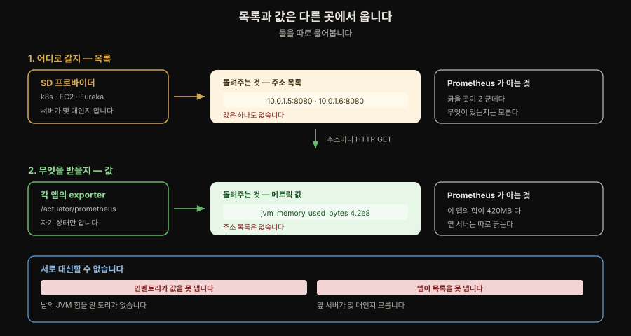
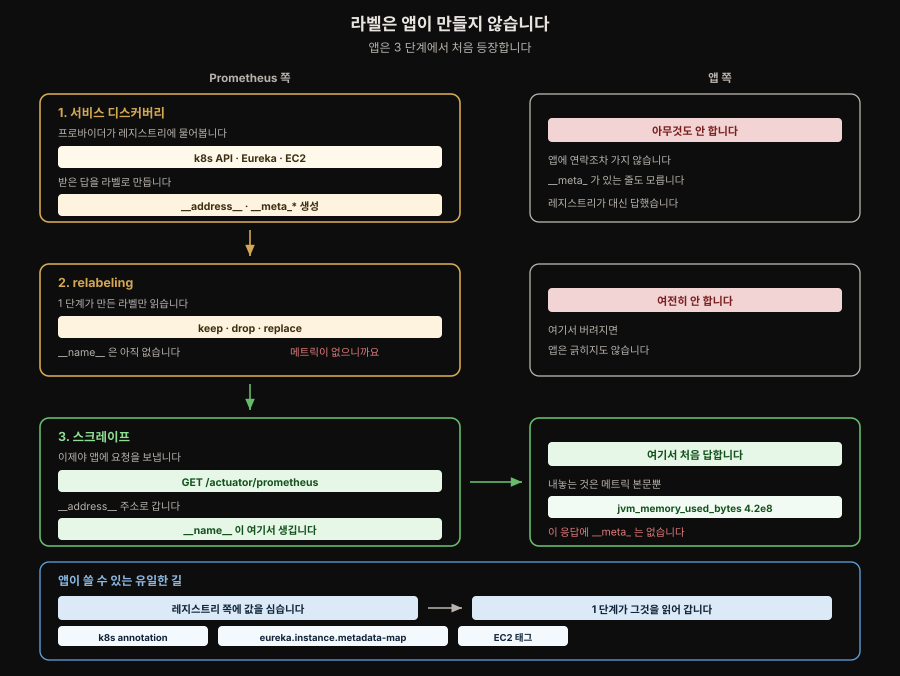
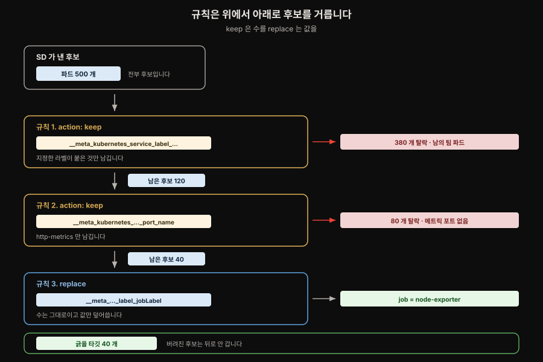
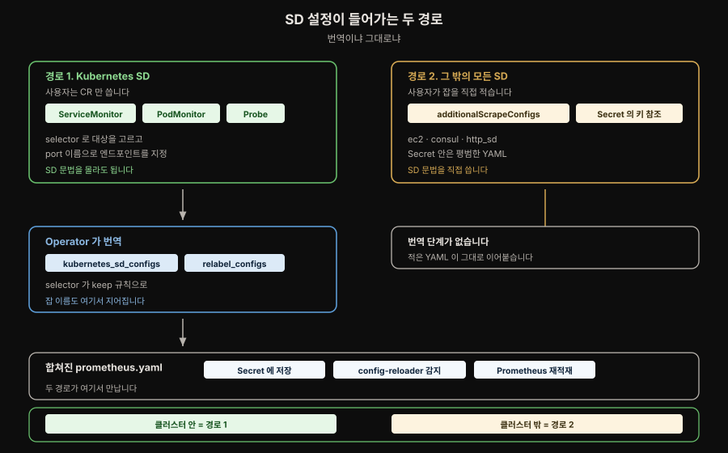
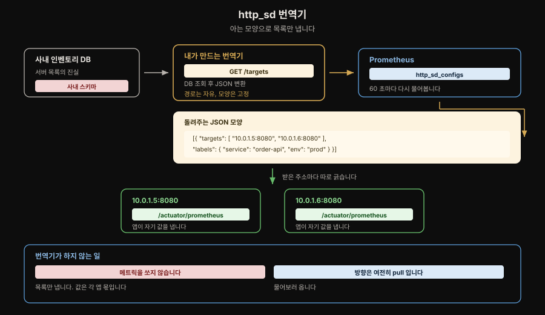
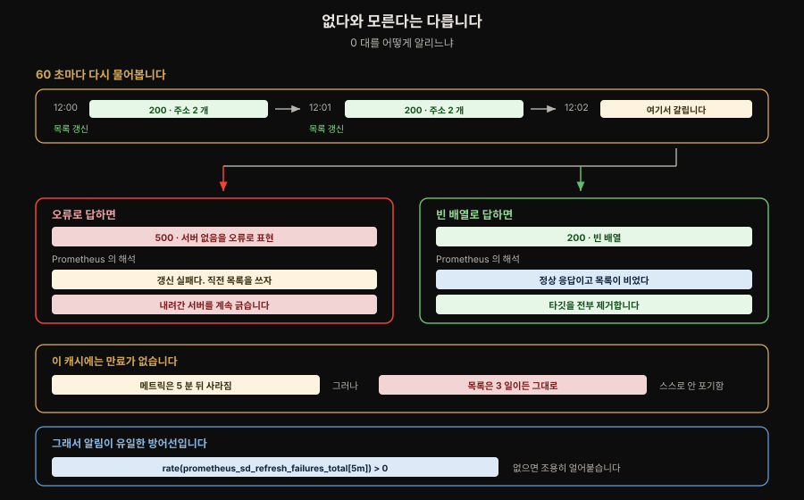
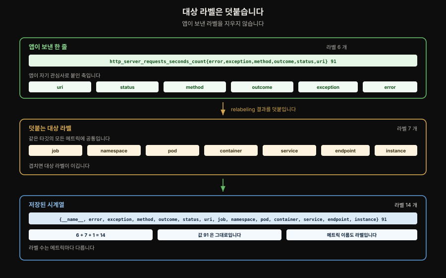

# 서비스 디스커버리와 relabeling

---

> 서비스 디스커버리는 긁을 후보를 찾고, relabeling 은 그 후보를 실제 타깃으로 다듬습니다. 두 relabeling 이 각각 언제 도는지가 이 장의 뼈대입니다.

## 핵심 요약

> 디스커버리와 relabeling 은 하나의 파이프라인입니다. 타깃이 안 잡히면 스크레이프 전 단계를, 시계열이 쌓이면 스크레이프 후 단계를 봅니다.

SD 프로바이더가 내주는 것은 주소와 `__meta_` 메타데이터를 실은 **후보 목록**뿐입니다. 무엇을 남기고 무엇을 버릴지는 relabeling 이 정하고, 저자의 표현으로 마법은 전부 거기서 일어납니다.

relabeling 은 두 번 돕니다. 표준 relabeling 은 스크레이프 **전에** 돌아 타깃을 고르고, 메트릭 relabeling 은 스크레이프 **후 저장 전에** 돌아 시계열을 거릅니다. 이 두 시점을 헷갈리면 "왜 타깃이 안 잡히지" 와 "왜 이 시계열이 쌓이지" 를 같은 곳에서 찾게 됩니다.

`__` 로 시작하는 라벨은 타깃 relabeling 이 끝나면 최종 시계열에서 제외됩니다.[^prom-meta-labels] 남길 값은 `replace` 로 일반 라벨에 옮겨야 합니다.


## 학습 목표

> 이 문서를 읽고 나면 아래 여섯 가지를 스스로 해낼 수 있습니다.

1. `__meta_` 를 만드는 주체가 앱이 아니라 SD 프로바이더임을 설명하고, 앱에서 그 값을 실으려면 어디에 심어야 하는지 말할 수 있습니다.
2. 표준 relabeling 과 메트릭 relabeling 이 각각 언제 도는지 말하고 문제를 어느 쪽에서 찾을지 고를 수 있습니다.
3. 규칙 하나를 부품 넷으로 읽고 어떤 액션이 후보 수를 바꾸는지 구분할 수 있습니다.
4. Operator 환경에서 Kubernetes SD 와 그 밖의 SD 가 서로 다른 경로로 들어간다는 사실을 설명할 수 있습니다.
5. `/targets` 와 `/service-discovery` 중 증상에 맞는 화면을 고를 수 있습니다.
6. 자체 소스에서 타깃을 가져와야 할 때 `http_sd` 엔드포인트의 계약을 지킬 수 있습니다.


## 1. 서비스 디스커버리는 후보만 찾습니다

> 클라우드 네이티브 환경에서는 타깃이 수시로 바뀌어 목록을 미리 적을 수 없습니다. SD 는 후보를 가져오고, 무엇을 실제로 긁을지는 relabeling 에 맡깁니다.

Prometheus 는 스크레이프 타깃을 동적으로 가져오는 방법을 두 다스 넘게 제공합니다. 설정 파일에서 각 프로바이더는 `kubernetes_sd_configs`, `azure_sd_configs` 처럼 `<type>_sd_configs` 이름 규칙을 따르는 절에 들어갑니다.

메트릭을 모으려면 **어디로 갈지**와 **거기서 무엇을 받을지** 둘을 알아야 하는데, SD 는 앞쪽만 담당합니다.



인벤토리 시스템은 서버가 몇 대인지 알지만 남의 JVM 힙 사용량을 알 도리가 없습니다. 앱은 자기 상태를 알지만 옆 서버가 몇 대인지 모릅니다. 그래서 목록을 아는 쪽과 값을 아는 쪽에 각각 따로 물어봅니다. Prometheus 는 pull 모델이라 긁으러 갈 주소를 먼저 알아야 하며, 그 목록을 얻는 단계가 서비스 디스커버리입니다.

SD 프로바이더가 각 후보에 붙이는 것은 두 가지뿐입니다.

- `__address__`: Prometheus 가 접속할 주소입니다. Linode 프로바이더가 채우는 비-메타데이터 라벨도 이것 하나뿐입니다.
- `__meta_<provider>_*`: namespace 나 annotation 처럼 필터링과 라벨 생성에 쓸 메타데이터입니다.

여기서 `__address__` 는 **새로운 정보가 아니라 그릇**입니다. 쿠버네티스 SD 가 EndpointSlice 에서 파드 IP 와 포트를 읽어 왔다면, 그 값을 담을 자리가 바로 `__address__` 입니다. 프로바이더가 무엇을 보고 왔든 SD 단계의 산출물은 형태가 하나로 통일됩니다 — **라벨 집합**입니다.

```
EndpointSlice 오브젝트 (쿠버네티스 API 의 자료구조)
        ↓ 쿠버네티스 SD 가 읽어서 라벨 집합으로 옮겨 담습니다
{ __address__: "10.0.1.5:8080", __meta_kubernetes_namespace: "prod", ... }
```

EC2 SD 든 Eureka SD 든 결과 모양이 같아야, 뒤따르는 relabeling 이 출처를 몰라도 똑같이 처리할 수 있습니다. 그리고 그릇이기 때문에 **바꿔 담을 수 있습니다** — SD 가 실어 온 주소를 그대로 쓸 의무가 없다는 뜻이고, 이 성질이 §6 에서 `instance` 와 갈라 두는 기법으로 이어집니다.

Prometheus 코드는 프로바이더가 이 둘 외에 어떤 라벨도 노출해서는 안 된다고 명시합니다. 최종 라벨을 정하는 권한을 프로바이더가 아니라 사용자의 relabeling 에 두는 설계입니다. 프로바이더는 사실만 싣고 해석은 relabeling 이 합니다.

`__meta_` 를 붙이는 주체가 프로바이더라는 점은 한 번 더 짚어 둘 만합니다. **감시 대상인 앱이 만드는 것이 아닙니다.**



1 단계와 2 단계에서 앱은 아직 아무 요청도 받지 않았습니다. Prometheus 는 쿠버네티스 API 나 Eureka 레지스트리에 물어봤을 뿐이고, `__meta_` 는 그 답에서 만들어집니다. 앱에 처음 연락이 가는 것은 3 단계 스크레이프이며, 이때 앱이 내놓는 것은 메트릭 본문뿐입니다. `/actuator/prometheus` 응답 어디에도 `__meta_` 는 없고 앱은 그런 것이 있는 줄도 모릅니다.

그래서 앱이 `__meta_` 에 영향을 주는 길은 하나뿐입니다. **SD 프로바이더가 들여다보는 곳에 값을 심는 것**입니다 — 쿠버네티스라면 파드 annotation, Eureka 라면 `eureka.instance.metadata-map`, EC2 라면 인스턴스 태그입니다. 메트릭 엔드포인트로는 전달할 수 없습니다.

그렇다면 무엇이 `__meta_` 가 되는지는 누가 정할까요. 프로바이더는 조회 한 번으로 객체를 통째로 받아 그 필드를 라벨로 **평탄화**합니다. `role: pod` 로 물었다면 Pod 오브젝트 하나가 이렇게 펼쳐집니다.

```bash
# Pod: name=order-api-7d9f-x2k · namespace=prod · phase=Running annotations: prometheus.io/scrape=true

__meta_kubernetes_pod_name                            = order-api-7d9f-x2k
__meta_kubernetes_namespace                           = prod
__meta_kubernetes_pod_phase                           = Running
__meta_kubernetes_pod_annotation_prometheus_io_scrape = true
```

- 기준은 두 층입니다. **어떤 필드를 노출할지는 프로바이더 구현이 미리 정해 둔 목록**이라 사용자가 늘릴 수 없고, 프로바이더마다 접두사도 범위도 다릅니다(`__meta_kubernetes_*`·`__meta_eureka_*`·`__meta_ec2_*`). 같은 쿠버네티스라도 `role` 을 `service` 로 바꾸면 나오는 집합이 통째로 갈립니다. 
- 반면 **annotation·label·`metadata-map` 처럼 내용이 비어 있는 자리는 사용자 몫**입니다. `prometheus.io/scrape` 가 특별해 보이는 것도 착시입니다 — Prometheus 가 아는 이름이 아니라 사용자가 붙인 임의의 annotation 을 `keep` 규칙이 읽을 뿐인 관례입니다.

이름에 `.` 이나 `/` 가 `_` 로 바뀌는 것은 Prometheus 라벨 이름이 `[a-zA-Z_][a-zA-Z0-9_]*` 만 허용하기 때문입니다. 어떤 라벨이 실제로 왔는지는 외울 필요 없이 `/service-discovery` 가 relabeling 전 상태로 전부 보여 줍니다.

`static_configs` 는 적은 것이 곧 타깃이라 걸러 낼 것이 없습니다. 

- SD 는 **묻는 것이지 아는 것이 아니어서**, `role: pod` 로 물으면 coredns 부터 남의 팀 배치 잡까지 전부 후보로 들어옵니다(`role` 은 쿠버네티스에서 무엇을 후보로 삼을지 고르는 값이고 `service`·`endpoints`·`node` 등으로 바꿀 수 있습니다). 
- 그중 메트릭 엔드포인트가 있는 것은 일부이고 나머지를 긁으면 연결 거부나 404 로 `up=0` 이 수백 개 쌓입니다. 그래서 SD 를 쓰는 쪽은 목록이 아니라 **조건**을 적습니다.

거르지 않았을 때의 대가는 **데이터 폭증이 아니라 신호 오염**입니다. 메트릭을 내지 않는 파드는 응답 자체를 못 주므로 저장될 시계열도 없고, 남는 것은 실패 기록뿐입니다. 진짜 장애 하나가 가짜 `up=0` 수백 개에 파묻히면 `up == 0` 알림은 그 순간 쓸모를 잃습니다.


## 2. relabeling 은 두 번 돕니다

> 표준 relabeling 은 타깃을, 메트릭 relabeling 은 시계열을 다룹니다. 자리에 따라 읽을 수 있는 라벨도 갈립니다.


| 구분 | 설정 파일 | Operator 필드 | 도는 시점 | 거르는 대상 |
|---|---|---|---|---|
| 표준 relabeling | `relabel_configs` | `relabelings` | 스크레이프 전 | 타깃 |
| 메트릭 relabeling | `metric_relabel_configs` | `metricRelabelings` | 스크레이프 후·저장 전 | 시계열 |

이름이 둘 다 `relabel` 인 것은 역사적 사정입니다. 원래는 라벨을 옮겨 담는 기능이었고 나중에 `keep`·`drop` 이 같은 문법에 붙었습니다.

같은 문법을 쓰지만 **볼 수 있는 것이 다릅니다.**

| 라벨 | `relabelings` | `metricRelabelings` |
|---|---|---|
| `__meta_*` | 읽을 수 있음 | 이미 제거됨 |
| `__address__` | 읽고 쓸 수 있음 | 이미 제거됨 |
| `__name__` | 아직 없음 (스크레이프 전) | 읽을 수 있음 |
| `job`·`instance` 같은 일반 라벨 | 읽고 쓸 수 있음 | 읽고 쓸 수 있음 |

세 번째 줄이 짝을 이룹니다. 메트릭을 받아 오기 전에는 이름이 있을 수 없으므로, 메트릭 이름으로 거르는 일은 `metricRelabelings` 에서만 됩니다.

**잘못된 자리에 적어도 오류가 나지 않습니다.** `metricRelabelings` 에서 `__meta_kubernetes_pod_name` 을 읽으면 문법도 유효하고 설정에도 들어가지만 읽을 라벨이 없어 빈 문자열이 되고, 빈 값은 라벨로 붙지 않아 대상 라벨이 아예 생기지 않습니다.

```yaml
scrape_configs:
  - job_name: k8s-pods
    kubernetes_sd_configs:
      - role: pod                       # 후보를 가져오는 자리

    relabel_configs:                    # 스크레이프 전 — 타깃을 고름
      - source_labels: [__meta_kubernetes_pod_annotation_prometheus_io_scrape]
        regex: "true"
        action: keep

    metric_relabel_configs:             # 스크레이프 후 — 시계열을 버림
      - source_labels: [__name__]
        regex: go_gc_duration_seconds.*
        action: drop
```

범위도 갈립니다. `metric_relabel_configs` 는 **그 잡이 긁어온 메트릭에만** 걸리므로, 같은 이름의 메트릭이 다른 잡에 있어도 건드리지 않습니다. 대상이 그 메트릭을 내지 않는 잡에 규칙을 걸면 효과가 0 입니다. 규칙을 적었다는 사실만으로 카디널리티가 줄었다고 보지 말고 적용 전후를 세어 봐야 합니다.


## 3. 규칙 하나는 어떻게 읽습니까

> 규칙은 부품 넷으로 이루어지고, 여러 개일 때는 목록이 아니라 순서 있는 파이프라인입니다. 후보 수를 바꾸는 액션은 `keep`·`drop` 둘뿐입니다.

| 필드 | 뜻 | 생략하면 |
|---|---|---|
| `source_labels` | 어떤 라벨의 값을 볼 것인가 | 읽을 값이 없음 — `replacement` 가 상수로 쓰임 |
| `regex` | 그 값이 이 패턴에 맞는가 | `(.*)` — 무엇이든 매칭 |
| `action` | 맞으면 무엇을 할 것인가 | `replace` |
| `target_label` | `replace` 일 때 어느 라벨에 쓸 것인가 | — |

`source_labels` 가 여럿이면 값들이 `separator`(기본 `;`)로 이어져 하나의 문자열이 되고 `regex` 는 그 이어붙인 문자열에 걸립니다.

| 액션 | 하는 일 | 후보 수 | 언제 |
|---|---|---|---|
| `keep` | 매칭되는 것만 남김 | 줄어듦 | 긁을 것을 고를 때 |
| `drop` | 매칭되는 것을 버림 | 줄어듦 | 특정 대상을 뺄 때 |
| `replace` | 읽은 값을 `target_label` 에 씀 | 안 바뀜 | `__meta_` 를 일반 라벨로 승격할 때 |
| `labeldrop` | `regex` 에 맞는 라벨 이름을 지움 | 안 바뀜 | 카디널리티를 줄일 때 |
| `labelkeep` | `regex` 에 맞는 라벨만 남김 | 안 바뀜 | 위와 같으나 allow-list |

`keep` 과 `drop` 은 서로 반대이므로 하나로 같은 일을 표현할 수 있습니다. 정규식이 단순해지는 쪽을 고르는 것이 관례입니다. `replace` 는 **값**을 옮기고 `labeldrop` 은 **라벨 자체**를 없앤다는 차이도 짚어 둘 만합니다. `labeldrop` 의 `regex` 가 라벨 값이 아니라 이름에 걸리므로 `source_labels` 를 쓰지 않습니다.



도식의 세 단계를 코드로 옮기면 이렇습니다. 적은 순서가 그대로 실행 순서입니다.

```yaml
relabel_configs:
  # 500 → 120. 어노테이션이 붙은 파드만 남깁니다
  - source_labels: [__meta_kubernetes_pod_annotation_prometheus_io_scrape]
    regex: "true"
    action: keep

  # 120 → 40. 죽은 파드를 뺍니다
  - source_labels: [__meta_kubernetes_pod_phase]
    regex: (Failed|Succeeded)
    action: drop

  # 40 → 40. 수는 그대로, 라벨만 붙습니다
  - source_labels: [__meta_kubernetes_namespace]
    target_label: namespace
```

**규칙을 뒤집으면 결과가 달라집니다.** 세 번째를 맨 위로 올리면 나중에 버려질 460 개에도 라벨을 붙이는 헛일을 합니다. 거르는 규칙을 앞에, 라벨을 붙이는 규칙을 뒤에 두는 것이 관례인 이유입니다. 이 구분이 디버깅에서 갈림길이 됩니다. 타깃 수가 예상과 다르면 `keep`·`drop` 의 정규식을, 수는 맞는데 라벨 값이 이상하면 `replace` 규칙을 봅니다.


## 4. Operator 는 두 경로로 설정을 만듭니다

> Kubernetes SD 는 Operator 가 CR 을 보고 자동 생성하고, 그 밖의 SD 는 `additionalScrapeConfigs` 로 직접 들어갑니다. 사용자가 적은 규칙은 Operator 규칙 뒤에 이어붙습니다.



### 4.1 두 경로는 번역 단계가 있느냐로 갈립니다

두 경로는 **번역 단계가 있느냐**로 갈립니다. 왼쪽은 사용자가 selector 같은 쿠버네티스 어휘로 쓰면 Operator 가 SD 문법으로 옮겨 주고, 오른쪽에는 옮겨 줄 사람이 없으므로 처음부터 SD 문법으로 씁니다.

| 대상 | 작성 위치 | Operator 의 처리 |
|---|---|---|
| Kubernetes Service·Pod | `ServiceMonitor`·`PodMonitor` | selector 를 `kubernetes_sd_configs` 와 relabel 규칙으로 번역 |
| 블랙박스 프로빙 대상 | `Probe` | 대응하는 SD 와 스크레이프 설정 생성 |
| EC2·Eureka·사내 SD | Prometheus CR 의 `additionalScrapeConfigs` | Secret 의 키에 담긴 잡을 생성 설정 뒤에 추가 |

`additionalScrapeConfigs` 는 YAML 을 직접 받지 않고 **Secret 의 키를 가리킵니다.**[^promop-additional] 스크레이프 잡에는 클라우드 자격증명이 섞이기 쉬우므로 평문 필드를 피한 설계입니다. 두 경로의 결과는 한 `prometheus.yaml` 에서 만나고, config-reloader 사이드카가 변경을 감지해 재적재합니다.

### 4.2 `ServiceMonitor` 는 엔드포인트마다 규칙을 답니다

`ServiceMonitor` 에서는 엔드포인트마다 두 종류의 규칙을 지정합니다.[^promop-relabel] 한 CR 이 포트를 여럿 노출하면 포트별로 다른 규칙을 걸 수 있습니다.

```yaml
spec:
  endpoints:
    - port: http-metrics          # Service 포트의 "이름" (번호 아님)
      relabelings:
        - sourceLabels: [__meta_kubernetes_service_label_jobLabel]
          targetLabel: job
      metricRelabelings:
        - sourceLabels: [__name__]
          regex: node_scrape_collector_.*
          action: drop
```

`port` 가 번호가 아니라 이름이라, 파드가 옮겨 다니며 번호가 바뀌어도 CR 을 고칠 일이 없습니다.

### 4.3 내 규칙은 남의 규칙 사이에 끼어듭니다

**Operator 는 사용자 규칙을 자기 규칙 뒤에 이어붙입니다.** 

- 위처럼 두 줄을 적었을 때 실제 생성된 `relabel_configs` 는 20개였고, 1~13 이 Operator 생성분, 14~15 가 사용자 규칙, 16~20 이 샤딩 규칙이었습니다. 
- 사용자 규칙이 **맨 뒤는 아니라는 점**과, 이미 버려진 후보를 되살릴 수 없다는 점이 요점입니다. 그래서 규칙을 배우려면 설정 파일 쪽이, 운영하려면 CR 쪽이 유리합니다.

이 배치가 왜 문제가 되는지는 `job` 라벨에서 드러납니다. `job` 은 **한 스크레이프 잡에 속한 모든 시계열에 자동으로 붙는 라벨**로, 이 메트릭이 어느 수집 설정에서 왔는지를 표시합니다. 설정 파일이라면 `job_name` 에 적은 값이 그대로 들어갑니다.

```bash
# jobLabel: spring-apps
http_server_requests_seconds_count{job="spring-apps", instance="10.0.1.5:8080"}
```

`instance` 가 개별 인스턴스를 가리킨다면 `job` 은 그 인스턴스들이 속한 묶음을 가리킵니다. PromQL 에서 `up{job="spring-apps"}` 처럼 가장 자주 쓰는 필터라, **`job` 값이 예상과 다르면 쿼리가 아무것도 잡지 못합니다.**

그런데 `jobLabel` 도 규칙으로 번역됩니다. 1차로 Service 이름을 `job` 에 쓰고, 2차 규칙이 `regex: (.+)` 로 "값이 있을 때만" 다시 덮어씁니다. 

- 사용자가 `targetLabel: job` 을 적어도 Operator 의 다른 규칙이 나중에 덮어쓸 수 있다는 뜻입니다. 
- 그래서 설정 파일에 적힌 긴 잡 이름으로는 시계열이 잡히지 않고 `jobLabel` 값으로 찾아야 나옵니다. 값이 예상과 다를 때 `/service-discovery` 로 relabeling 전후를 대조하는 이유가 이것입니다(§5).


## 5. 디버깅은 증상으로 화면을 고릅니다

> 발견과 필터링 문제는 `/service-discovery`, 스크레이프 연결 문제는 `/targets` 입니다. `up=0` 만으로는 원인을 구분할 수 없습니다.

`/service-discovery` 는 어떤 타깃이 발견됐고 그중 무엇이 버려졌는지, relabeling **전후** 라벨을 나란히 보여 줍니다. 저자는 서비스 디스커버리 디버깅에서 이쪽이 훨씬 쓸모 있었다고 적었습니다.

| 증상 | 어느 화면 | 무엇을 보는가 |
|---|---|---|
| 타깃이 아예 없음 | `/service-discovery` | 발견 목록에 있나. 있으면 버려진 이유 |
| 라벨 값이 예상과 다름 | `/service-discovery` | relabeling 전후 대조, 덮어쓴 규칙 |
| 타깃은 있는데 DOWN | `/targets` | `lastError` 문구 |
| 시계열이 계속 쌓임 | 메트릭 relabeling·PromQL | 그 잡에 버릴 시계열이 실제로 있는지 |

**`up=0` 은 실패했다는 사실만 말하고 이유는 말하지 않습니다.** `lastError` 를 읽어야 갈립니다.

| `lastError` | 뜻 | 볼 곳 |
|---|---|---|
| `connection refused` | 그 주소·포트에서 아무도 듣지 않음 | 대상의 바인딩 주소 |
| `404 Not Found` | 서버는 있는데 경로가 틀림 | `metrics_path` |
| `context deadline exceeded` | 제한 시간 안에 응답 못 함 | `scrape_timeout`, 대상 부하 |
| `no such host` | DNS 조회 실패 | 호스트명과 DNS |

- `connection refused` 는 kubeadm 계열 클러스터에서 특히 자주 나옵니다. kube-controller-manager·kube-scheduler·etcd·kube-proxy 가 메트릭을 **루프백에만** 바인딩하기 때문입니다. 
- `127.0.0.1` 은 그 컨테이너 자신이므로 다른 파드에서 오는 Prometheus 는 닿지 못합니다. **설정 실수가 아니라 보안 기본값이라서**, 감시하려면 대상 쪽 바인딩을 열어 줘야 합니다.

여기서 구분이 중요합니다. `/service-discovery` 가 정상인데 `/targets` 가 DOWN 이면 **ServiceMonitor 와 relabeling 은 제 할 일을 다 한 것입니다.** 실패는 그다음 층, 대상이 그 주소에서 듣느냐에서 났으므로 relabeling 을 고칠 일이 아닙니다.


## 6. 타깃을 어디서 가져올지 고릅니다

> 내장 프로바이더가 있으면 먼저 쓰고, 사내 인벤토리처럼 내장될 수 없는 소스에 `http_sd` 를 씁니다. 엔드포인트가 지킬 것은 셋뿐입니다.

### 6.1 내장 프로바이더가 있으면 그것부터 씁니다

| 상황 | 고르는 것 | 이유 |
|---|---|---|
| Kubernetes 위의 서비스·파드 | `ServiceMonitor`·`PodMonitor` | Operator 가 SD 설정을 대신 생성합니다 |
| 업스트림에 프로바이더가 있는 클라우드·레지스트리 | 내장 `<type>_sd_configs` | 있으면 직접 짤 이유가 없습니다 |
| Operator 를 쓰며 비-Kubernetes SD 가 필요 | `additionalScrapeConfigs` | Kubernetes SD 만 자동 생성 대상입니다 |
| 사내 CMDB 같은 자체 진실 공급원 | `http_sd` | 2021년 이후 커스텀 디스커버리의 권장 방법입니다 |
| 신뢰할 만한 도구가 파일을 써 주는 경우 | `file_sd` | 유효하되 Prometheus 바깥 프로세스에 의존합니다 |
| 타깃이 몇 개뿐이고 변하지 않음 | `static_configs` | 디스커버리를 도입할 이유가 없습니다 |

표에서 위 세 줄이 먼저입니다. `http_sd` 는 앞선 선택지가 전부 막혔을 때의 **마지막 수단**이지 기본값이 아닙니다.

여기서 **인벤토리**와 **CMDB** 는 같은 것을 가리킵니다 — 회사가 자기 서버·장비·담당 팀을 적어 둔 **목록 데이터베이스**입니다. 메트릭과는 무관하게 "우리 회사에 무엇이 있는가" 만 압니다(§1 첫 도식의 왼쪽). 규모 있는 조직이 자산 관리용으로 운영하며, 애플리케이션이 아니라 인프라 관리 도구입니다.

### 6.2 `http_sd` 는 인벤토리 앞에 두는 번역기입니다

새 프로바이더를 업스트림에 받는 조건이 "여러 조직에 걸쳐 널리 쓰이는 것" 이라, 회사에만 있는 진실 공급원은 남습니다. 그 자리를 메우려고 메인테이너 Julien Pivotto 가 2021년 범용 `http_sd` 를 도입했습니다.



`http_sd` 가 하는 일은 인벤토리 앞에 **번역기 하나를 두는 것**입니다. 내장 프로바이더는 쿠버네티스 API 나 Eureka 의 문법을 코드에 담고 있지만, 사내 CMDB 의 스키마는 Prometheus 가 알 도리가 없습니다. 

- 그래서 **Prometheus 가 물어볼 URL 하나**를 우리가 만들어 그 앞에 세웁니다. 이름의 `http` 도 그 뜻입니다 — 특정 플랫폼이 아니라 그냥 HTTP 로 묻는 범용 SD 입니다.

지킬 요구사항은 HTTP **200**, `Content-Type: application/json`, **UTF-8** 셋뿐이고,[^prom-http-sd] 응답은 static config 와 같은 모양의 JSON 입니다.

```json
[{
  "targets": [ "web1.example.com:443", "web2.example.com:443" ],
  "labels": { "component": "website", "environment": "production" }
}]
```

### 6.3 갱신 실패는 조용해서 알림이 유일한 방어선입니다



보낼 타깃이 없을 때도 **200 과 빈 배열 `[]`** 을 내야 합니다. 갈리는 것은 **"없다" 와 "모른다" 의 구별**입니다. 빈 배열은 조회했고 0 대였다는 뜻이고 오류는 조회에 실패해 모른다는 뜻이라, Prometheus 는 후자일 때 직전 목록을 계속 씁니다. 목록 서비스 장애가 감시 중단으로 번지지 않게 한 판단입니다.

캐시되는 것은 개별 주소가 아니라 **목록 응답 통째**입니다. 그리고 **인벤토리가 죽는 것과 서버가 죽는 것은 다른 층**입니다 — 인벤토리는 목록을 관리할 뿐이라, 그것이 멎어도 서버들은 멀쩡히 돌아갑니다.

| 무엇이 죽었나 | Prometheus 반응 |
|---|---|
| 인벤토리 API (목록을 주는 쪽) | 갱신 실패 → 옛 목록 유지 |
| 개별 서버 (긁는 대상) | 목록엔 그대로 → `up=0` |

이 캐시에는 **만료가 없습니다.** 인벤토리 API 가 사흘간 죽어 있으면 사흘 전 목록을 그대로 쓰며, 스스로 포기하지 않으니 증상도 없습니다. 옛 목록의 서버들이 여전히 살아 있다면 스크레이프는 전부 성공하고 `up` 은 전부 1 이며 대시보드는 초록색입니다. 무너진 것은 **목록의 신선도**뿐이라 어느 화면에도 드러나지 않습니다.

| 그사이 실제 변화 | 겉보기 | 실제 |
|---|---|---|
| 없음 | 정상 | 문제를 아무도 모름 |
| 서버 추가됨 | 정상 | 후보에 없어 감시 사각지대 — `up=0` 조차 안 뜸 |
| 서버 폐기됨 | `up=0` 알림 | 이미 없는 서버를 찾아가는 유령 알림 |

가운데 줄이 특히 조용합니다. 새로 뜬 서버는 후보 목록에 없으니 Prometheus 가 존재 자체를 모르고, 죽어도 침묵합니다. 실패 신호조차 나오지 않는 것이 `up=0` 보다 위험합니다. 그래서 갱신 실패를 드러내는 일이 알림 하나에 걸려 있습니다.

```promql
rate(prometheus_sd_refresh_failures_total[5m]) > 0
```

### 6.4 접속할 주소와 보여 줄 이름은 갈라 둘 수 있습니다

`instance` 와 `__address__` 는 기본값이 같지만 갈라 둘 수 있습니다. 둘의 역할이 다릅니다.

| 라벨 | 쓰임 | 최종 시계열에 |
|---|---|---|
| `__address__` | Prometheus 가 실제로 HTTP 요청을 보낼 주소 | 남지 않음 (`__` 접두사라 제거) |
| `instance` | 시계열에 붙어 사람이 보게 될 이름 | 남음 |

relabeling 이 끝난 뒤에도 `instance` 가 정해지지 않았으면 `__address__` 값이 들어갑니다.[^prom-instance] 아무것도 안 하면 둘이 같아지므로 대시보드에 `instance="10.0.1.5:8080"` 이 뜨는 것이 기본 동작입니다. 갈라 두려면 `instance` 쪽만 덮어씁니다.

```yaml
relabel_configs:
  # 접속은 SD 가 준 __address__ 그대로. 보이는 이름만 바꿉니다
  - source_labels: [__meta_kubernetes_pod_name]
    target_label: instance
```

접속에는 IP 를 쓰고 `instance` 에는 `order-api-prod-3` 같은 이름을 넣으면, 대시보드와 알림의 가독성을 지키면서 DNS 장애가 모니터링 장애로 번지는 일도 막습니다. 뒤쪽 이득은 반대 선택지와 비교해야 보입니다 — 가독성만 노리고 `__address__` 자체를 호스트명으로 바꾸면 스크레이프할 때마다 DNS 를 타게 되고, DNS 가 죽는 순간 `no such host` 로 전부 `up=0` 이 됩니다(§5 표 마지막 줄). 감시하는 쪽이 먼저 눈이 머는 셈입니다.


## 심화 학습

> 책이 흐릿하게 남긴 지점을 공식 문서로 보강합니다.

**`__` 로 시작하는 라벨은 최종 시계열에 남지 않습니다.** 공식 문서의 문장은 "Labels starting with `__` will be removed from the label set after target relabeling is completed" 입니다.[^prom-meta-labels] `__meta_` 든 `__address__` 든 마찬가지입니다. relabeling 이 라벨 배정의 마지막 단계라서 앞 단계가 붙인 라벨을 덮어쓸 수 있고, 그 결과로 남는 평평한 라벨 집합만 시계열에 붙습니다.

**그 라벨 집합은 앱이 보낸 라벨을 밀어내지 않고 덧붙습니다.** relabeling 을 통과한 라벨은 그 타깃에서 오는 *모든* 메트릭에 공통으로 실립니다. 앱은 자기 관심사대로 라벨을 붙여 보내고, Prometheus 는 거기에 출처를 표시하는 라벨을 더합니다. 둘은 경쟁하지 않습니다.



직접 확인하면 이렇습니다. Spring Boot 앱이 `/actuator/prometheus` 로 내보낸 한 줄에는 라벨이 여섯 개 있습니다.

```bash
http_server_requests_seconds_count{error="none",exception="none",method="POST",outcome="SERVER_ERROR",status="502",uri="/api/dispatch"} 91
```

같은 시계열을 저장소에서 꺼내면 라벨이 열네 개로 늘어 있습니다. 앱이 붙인 여섯 개가 그대로 있고, `job`·`namespace`·`pod`·`container`·`service`·`endpoint`·`instance` 일곱 개가 더해졌으며, 메트릭 이름이 `__name__` 라벨로 들어갔습니다. 값 `91` 은 바뀌지 않습니다 — relabeling 은 라벨만 만지고 샘플 값에는 손대지 않습니다.

그래서 최종 라벨 개수는 메트릭마다 다릅니다. 같은 타깃에서 와도 `jvm_threads_live_threads` 처럼 앱이 구분 축을 두지 않은 메트릭은 대상 라벨 일곱 개와 `__name__` 만 갖고, `jvm_memory_used_bytes` 는 `area`·`id` 가 더해져 아홉 개가 됩니다. 공통으로 깔리는 것은 대상 라벨 쪽이고, 메트릭 고유 라벨은 그 위에서 시계열을 가릅니다.

이름이 겹치면 어떻게 될지가 남습니다. 앱이 `job` 이라는 라벨을 직접 보내면 대상 라벨과 부딪히는데, 기본값 `honor_labels: false` 에서는 **대상 라벨이 이기고 앱이 보낸 값은 `exported_job` 으로 밀려납니다.**[^prom-honor-labels] 반대로 `honor_labels: true` 면 앱 값이 남습니다. 페더레이션이나 Pushgateway 처럼 이미 라벨이 붙은 데이터를 중계할 때 이 설정을 뒤집습니다.

같은 문서가 규약 하나를 더 줍니다. 값을 다음 단계의 입력으로만 잠깐 보관해야 한다면 `__tmp` 접두사를 쓰라는 안내입니다. Prometheus 가 이 접두사를 내장 라벨에 절대 쓰지 않겠다고 약속했으므로 이름 충돌을 걱정할 필요가 없습니다.[^prom-meta-labels]

**프로바이더 수는 집필 시점 값입니다.** 책은 "두 다스 넘게" 와 "11개에서 25개로" 를 적지만, 현행 설정 문서의 `<*_sd_config>` 절을 세면 31개입니다(2026-08-03 확인). `aws_sd_config` 처럼 하위를 묶는 항목이 있어 세는 방법에 따라 값이 달라지므로, 지금 값이 필요하면 그 목록을 직접 세는 편이 확실합니다.
**프로바이더 수는 집필 시점 값입니다.** 책은 "두 다스 넘게" 와 "11개에서 25개로" 를 적지만, 현행 설정 문서의 `<*_sd_config>` 절을 세면 32개입니다(upstream `docs/configuration/configuration.md` 기준, 2026-08-06 확인). `aws_sd_config` 처럼 하위를 묶는 항목이 있어 세는 방법에 따라 값이 달라지므로, 지금 값이 필요하면 그 목록을 직접 세는 편이 확실합니다.

**`role: endpoints` 는 폐기 예정입니다.** 본문이 고를 수 있는 `role` 로 나열한 값 중 `endpoints` 는 현행 문서가 `the Endpoints API is deprecated in Kubernetes v1.33+` 를 근거로 `endpointslice` 로 옮기기를 권합니다(2026-08-06 확인). 책 집필 시점에는 없던 변화이므로 새 설정에는 `endpointslice` 를 씁니다. 나머지 `pod`·`service`·`node` 는 그대로입니다.

**`file_sd` 는 죽지 않았습니다.** 본문은 cron + `file_sd` 조합을 `http_sd` 이전의 우회로 소개하지만, 파일을 쓰는 주체가 이미 신뢰할 만한 구성 관리 도구라면 여전히 정당한 선택입니다. `http_sd` 가 이기는 지점은 Prometheus 가 직접 물어본다는 가시성이지 파일 방식이 틀렸다는 뜻은 아닙니다.


## Spring 앱 개발 관점

> K8s 면 `ServiceMonitor`, VM+Eureka 면 내장 `eureka_sd_configs`, 자체 소스면 `http_sd` 입니다. Spring 으로 직접 짜야 하는 경우는 그중에서도 좁습니다.

### 쿠버네티스 위라면 SD 를 만질 일이 없습니다

**Kubernetes 위의 Spring Boot 는 답이 나와 있습니다.** `ServiceMonitor` 를 그대로 쓰되 `path` 를 `/actuator/prometheus` 로 지정합니다. 그 뒤는 Operator 가 번역하므로 SD 를 직접 만질 일이 없습니다.

이 절에서 다루는 나머지 이야기는 전부 **쿠버네티스 밖**의 사정입니다. 클러스터 안에서 도는 앱이라면 `http_sd` 를 읽어 둘 필요는 있어도 짤 일은 없습니다.

### Eureka·Consul 이 있으면 내장 프로바이더를 씁니다

**Eureka 를 쓰는 VM 환경이라면 `http_sd` 를 짜지 마십시오.** `eureka_sd_configs` 가 내장돼 있어 레지스트리를 직접 물어보므로 중간 어댑터가 필요 없습니다. Consul 도 `consul_sd_configs` 로 같습니다.

```yaml
- job_name: spring-apps
  metrics_path: /actuator/prometheus
  eureka_sd_configs:
    - server: http://eureka:8761/eureka
  relabel_configs:
    - source_labels: [__meta_eureka_app_instance_status]
      regex: UP
      action: keep                        # 살아 있는 인스턴스만
    - source_labels: [__meta_eureka_app_name]
      target_label: job                   # 잡 이름을 앱 이름으로
```

앱 인스턴스 메타데이터는 `__meta_eureka_app_instance_metadata_<이름>` 으로 들어옵니다. `eureka.instance.metadata-map` 에 심어 둔 값을 그대로 라벨로 끌어올 수 있다는 뜻입니다. 라벨 이름이 헷갈릴 때는 문서를 뒤지는 대신 `/service-discovery` 가 relabeling 전 라벨을 그대로 보여 줍니다.

### `http_sd` 를 Spring 으로 짜야 하는 경우는 좁습니다

**`http_sd` 가 정당해지는 경우는 사내 CMDB 처럼 업스트림 프로바이더가 존재할 수 없는 진실 공급원입니다.** 그런데 `http_sd` 를 쓰기로 정했다고 해서 곧바로 Spring 이 답은 아닙니다. 갈림길은 **목록을 계산해야 하느냐**입니다.

| 목록의 출처 | 무엇으로 만드나 |
|---|---|
| 내용이 고정된 JSON | nginx 같은 정적 파일 서빙 — 앱을 띄울 이유가 없습니다 |
| 외부 도구가 파일을 갱신해 줌 | `file_sd` — 서버조차 필요 없습니다 |
| DB·사내 API 를 조회해 매번 만들어야 함 | Spring |

마지막 줄만 Spring 의 자리입니다. 조회에 인증·쿼리·조인 같은 로직이 붙고 **그 로직을 이미 아는 앱이 회사에 있을 때**, 거기에 엔드포인트 하나를 더하는 것이 가장 싼 길입니다. 그런 앱이 없다면 이 목적만으로 새로 만들 이유는 약합니다.

```java
@RestController
class TargetsController {

    @GetMapping(value = "/targets", produces = MediaType.APPLICATION_JSON_VALUE)
    List<TargetGroup> targets() {
        return inventory.findScrapeTargets();   // static config 와 같은 모양
    }

    record TargetGroup(List<String> targets, Map<String, String> labels) {}
}
```

- `produces` 로 `Content-Type` 이 정해지고 Spring Boot 의 기본 인코딩이 UTF-8 이므로 요구사항 셋이 자연스럽게 채워집니다. 
- `targets` 에는 IP 와 포트를 담고 `labels.instance` 에는 사람이 읽는 이름을 넣으면, 알림 문구와 대시보드는 후자를 읽고 스크레이프는 전자로 갑니다.

### 빈 결과에 예외를 던지지 마십시오

구현에서 가장 틀리기 쉬운 자리입니다. **서버가 0 대인 것은 정상 상태**인데 예외를 던지면 500 이 나가고, Prometheus 는 이를 갱신 실패로 읽어 직전 목록을 계속 씁니다(§6.3). 이미 없는 서버를 향해 유령 알림이 울리기 시작합니다.

빈 리스트를 그대로 반환하면 Jackson 이 `[]` 로 직렬화하므로, **아무것도 하지 않는 것이 정답**입니다. 반대로 DB 조회 자체가 실패했다면 그때는 예외를 던지는 쪽이 맞습니다 — 정말로 "모르는" 상태라 옛 목록을 유지하는 편이 안전합니다.

| 상황 | 반환 | Prometheus 해석 |
|---|---|---|
| 조회 성공, 결과 0 건 | `[]` + 200 | 없다 → 타깃 제거 |
| 조회 자체 실패 | 500 | 모른다 → 옛 목록 유지 |

§6.3 의 "없다 와 모른다 의 구별" 을 코드로 옮기면 이 표가 됩니다. 그리고 엔드포인트를 아무리 잘 만들어도 그것이 죽었을 때는 드러나지 않으므로, `prometheus_sd_refresh_failures_total` 알림은 구현 방식과 무관하게 필요합니다.


## 면접에서 받을 만한 질문

> 아래 질문에 먼저 스스로 답해 보세요. 자답이 끝나면 §정답 으로 내려갑니다.

1. 표준 relabeling 과 메트릭 relabeling 은 무엇이 다릅니까?
2. `__meta_` 라벨은 왜 시계열에서 보이지 않습니까?
3. Prometheus Operator 를 쓰는데 AWS EC2 타깃을 붙이려면 어떻게 합니까?
4. SD 프로바이더는 왜 `__address__` 말고는 라벨을 내주지 않습니까?
5. 타깃이 안 잡힙니다. `/targets` 와 `/service-discovery` 중 어디를 먼저 열겠습니까?
6. `http_sd` 엔드포인트가 보낼 타깃이 없을 때 무엇을 반환해야 합니까?
7. Spring Boot 앱에서 `__meta_` 라벨에 값을 실으려면 어디에 무엇을 해야 합니까?
8. `__address__` 와 `instance` 는 어떻게 다릅니까? 왜 갈라 둡니까?


## 핵심 개념 체크리스트

> 덮고 나서 스스로 물어볼 항목입니다. 막히는 곳이 그 절로 돌아갈 지점입니다.

- [ ] SD 가 돌려주는 것이 메트릭이 아니라 후보 주소와 메타데이터임을 설명할 수 있는가?
- [ ] `__meta_` 를 만드는 주체가 앱이 아니라 SD 프로바이더임을 설명할 수 있는가?
- [ ] 앱이 `__meta_` 에 값을 실으려면 어디에 심어야 하는지 아는가?
- [ ] `__address__` 와 `instance` 가 각각 무엇에 쓰이고 어느 쪽이 시계열에 남는지 아는가?
- [ ] 표준 relabeling 과 메트릭 relabeling 이 도는 시점을 구분할 수 있는가?
- [ ] `__meta_`·`__address__`·`__name__` 을 각각 어느 자리에서 읽을 수 있는지 아는가?
- [ ] 잘못된 자리에 규칙을 적어도 오류가 나지 않는다는 사실을 아는가?
- [ ] `keep`·`drop` 과 `replace` 중 무엇이 후보 수를 바꾸는지 구분할 수 있는가?
- [ ] 거르는 규칙을 앞에 두는 관례의 이유를 말할 수 있는가?
- [ ] Operator 에서 Kubernetes SD 와 그 밖의 SD 가 어느 경로로 들어가는지 아는가?
- [ ] 사용자 규칙이 최종 설정에서 맨 뒤가 아니라는 사실을 아는가?
- [ ] `/service-discovery` 와 `/targets` 중 증상에 맞는 화면을 고를 수 있는가?
- [ ] `http_sd` 의 세 요구사항과 빈 배열 계약을 말할 수 있는가?


## 정답 (자답 후 펼치기)

> 위 8개에 *먼저 자답한 뒤* 읽으세요. 질문 번호와 1:1 로 대응합니다.

### 정답 1 — 두 relabeling 의 차이

도는 시점이 다릅니다. 표준 relabeling 은 스크레이프 전에 돌아 대상을 걸러 내고 라벨을 붙입니다. 메트릭 relabeling 은 스크레이프가 끝난 뒤 시계열이 저장되기 전에 돌아 시계열을 버리거나 고칩니다. 그래서 "타깃이 안 잡힌다" 는 전자를, "쓸데없는 시계열이 쌓인다" 는 후자를 봅니다.

### 정답 2 — `__meta_` 가 시계열에 없는 이유

relabeling 이 라벨 배정의 마지막 단계이고 `__` 로 시작하는 라벨은 타깃 relabeling 이 끝나면 최종 시계열에서 제외됩니다.[^prom-meta-labels] 남기고 싶으면 relabeling 중에 `replace` 로 일반 라벨에 옮겨 담아야 합니다.

### 정답 3 — Operator 환경에서 EC2 타깃 붙이기

`ServiceMonitor` 로는 되지 않습니다. Operator 가 SD 설정을 자동 생성하는 대상은 `ServiceMonitor`·`PodMonitor`·`Probe` 뿐입니다. Kubernetes 에서 오지 않는 SD 는 Prometheus CR 의 `additionalScrapeConfigs` 에 스크레이프 잡을 직접 적습니다.[^promop-additional]

### 정답 4 — 프로바이더가 라벨을 아끼는 이유

Prometheus 코드가 프로바이더는 `__address__` 와 `__meta_` 접두사 라벨 외에 어떤 라벨도 노출해서는 안 된다고 명시합니다. 최종 라벨을 결정하는 권한을 프로바이더가 아니라 사용자의 relabeling 설정에 두는 설계입니다.

### 정답 5 — 타깃이 안 잡힐 때 여는 화면

`/service-discovery` 를 먼저 엽니다. 발견된 타깃과 버려진 것을 함께 보여 주고 relabeling 전후 라벨을 나란히 놓기 때문입니다. 먼저 발견 목록에 아예 없는지 보고, 없으면 SD 설정 자체의 문제이며 있는데 버려졌다면 `keep`·`drop` 의 정규식을 의심합니다.

### 정답 6 — 보낼 타깃이 없을 때

200 과 빈 배열 `[]` 입니다.[^prom-http-sd] 오류로 답하면 Prometheus 가 갱신 실패로 읽어 직전 목록을 계속 쓰므로, 이미 내려간 서버를 계속 긁어 `up=0` 알림이 쏟아집니다.

### 정답 7 — 앱에서 `__meta_` 에 값 싣기

메트릭 엔드포인트로는 못 싣습니다. `__meta_` 는 앱이 아니라 SD 프로바이더가 만들고, 그 시점에는 앱에 요청조차 가지 않습니다. 값을 실으려면 **프로바이더가 들여다보는 곳**에 심어야 합니다 — Eureka 라면 `eureka.instance.metadata-map` 에 넣으면 `__meta_eureka_app_instance_metadata_<이름>` 으로 들어오고, 쿠버네티스라면 파드 annotation 이 `__meta_kubernetes_pod_annotation_*` 으로 들어옵니다. 앱은 레지스트리에 등록할 뿐이고 Prometheus 는 레지스트리에게 물어봅니다.

### 정답 8 — `__address__` 와 `instance`

`__address__` 는 Prometheus 가 실제로 접속할 주소이고 `__` 로 시작하므로 최종 시계열에 남지 않습니다. `instance` 는 시계열에 붙어 대시보드와 알림에 보이는 이름이고 남습니다. relabeling 이 끝나도 `instance` 가 안 정해졌으면 `__address__` 값이 복사돼 들어가므로 기본값은 같습니다.[^prom-instance]

갈라 두는 이유는 가독성과 안정성을 함께 얻기 위해서입니다. `instance` 만 사람이 읽는 이름으로 덮어쓰면 접속 경로는 IP 그대로라 DNS 의존이 생기지 않습니다. 반대로 `__address__` 를 호스트명으로 바꾸면 스크레이프마다 DNS 를 타므로, DNS 장애가 곧바로 모니터링 장애가 됩니다.


## 참고 자료

> 본문의 사실을 확인한 1차 자료입니다.

- 원본: *Mastering Prometheus* (Packt, ISBN 9781805125662) 4장 — Using Service Discovery. 예제 코드는 [PacktPublishing/Mastering-Prometheus](https://github.com/PacktPublishing/Mastering-Prometheus) 에 있습니다.
- [Prometheus — Configuration](https://prometheus.io/docs/prometheus/latest/configuration/configuration/) (`relabel_config`·`eureka_sd_config`) · [HTTP SD 문서](https://prometheus.io/docs/prometheus/latest/http_sd/) · [Advanced service discovery (2015)](https://prometheus.io/blog/2015/06/01/advanced-service-discovery/)
- [Prometheus SD 코드베이스 (v2.46.0)](https://github.com/prometheus/prometheus/tree/v2.46.0/discovery)


## 관련 문서

> 이 절에서 이어지는 갈래입니다.

| 문서 | 이 절과 어떻게 이어지는가 |
|---|---|
| [원본 상세 노트](_archive/04-01.서비스%20디스커버리와%20relabeling.md) | 압축 전 정독 노트 — Linode 프로바이더 구현, Operator 생성 규칙 20개의 배치, 면접 문답 8문항 |
| [02-01. Prometheus 배포](02-01.Prometheus%20배포%20—%20스택%20구성요소와%20Operator.md) | `ServiceMonitor`·`additionalScrapeConfigs` 가 어느 CR 에 사는지 |
| [03-01. 데이터 모델](03-01.데이터%20모델.md) | `job`·`instance`·`__name__` 라벨의 의미 |
| [07-01. 최적화와 디버깅](07-01.최적화와%20디버깅.md) | 메트릭 relabeling 이 카디널리티를 거르는 실제 튜닝 |
| [00-01. 용어집](00-01.용어집.md) | relabeling·`__meta_`·`__address__`·SD provider 의 정의 |

[^prom-meta-labels]: Prometheus — Configuration. `Labels starting with __ will be removed from the label set after target relabeling is completed` 이며, 같은 절이 `__meta_` 라벨의 relabeling 단계 한정 가용성과 `__tmp` 접두사 규약을 함께 규정합니다.
<https://prometheus.io/docs/prometheus/latest/configuration/configuration/#relabel_config>

[^prom-instance]: Prometheus — Configuration, scrape_config. `After relabeling, the instance label is set to the value of __address__ by default if it was not set during relabeling`.
<https://prometheus.io/docs/prometheus/latest/configuration/configuration/#scrape_config>

[^prom-http-sd]: Prometheus — HTTP SD. 200 · `Content-Type: application/json` · UTF-8 요구와 함께 `If no targets should be transmitted, HTTP 200 must also be emitted, with an empty list []` 를 규정하고, 갱신 실패 시 직전 목록 유지와 `prometheus_sd_refresh_failures_total` 노출을 적습니다.
[^prom-honor-labels]: Prometheus — Configuration, scrape_config. 기본값 `false` 에서는 `label conflicts are resolved by renaming conflicting labels in the scraped data to "exported_<original-label>"` 이고, `true` 에서는 `keeping label values from the scraped data and ignoring the conflicting server-side labels` 입니다. 같은 절이 `useful for use cases such as federation and scraping the Pushgateway` 를 용례로 듭니다.
<https://prometheus.io/docs/prometheus/latest/configuration/configuration/#scrape_config>

[^prom-relabel-fields]: Prometheus — Configuration, `<relabel_config>`. 기본값은 `separator: ;` · `regex: (.*)` · `replacement: $1` · `action: replace` 이고, 앵커링 근거는 `The regex is anchored on both ends`.
<https://prometheus.io/docs/prometheus/latest/configuration/configuration/#relabel_config>

[^prom-relabel-actions]: Prometheus — Configuration, `<relabel_config>`. `<relabel_action>` 절이 위 표의 11개를 정의하며, 유일성 경고는 `Care must be taken with labeldrop and labelkeep`.
<https://prometheus.io/docs/prometheus/latest/configuration/configuration/#relabel_config>

[^prom-metric-relabel]: Prometheus — Configuration, `<metric_relabel_configs>`. 예외 근거는 `Metric relabeling does not apply to automatically generated timeseries such as up`.
<https://prometheus.io/docs/prometheus/latest/configuration/configuration/#metric_relabel_configs>

[^prom-http-sd]: Prometheus — HTTP SD, Requirements of HTTP SD endpoints. 200 · `Content-Type: application/json` · UTF-8 요구와 함께 빈 목록 계약을 `If no targets should be transmitted, HTTP 200 must also be emitted, with an empty list []` 로 규정합니다.
<https://prometheus.io/docs/prometheus/latest/http_sd/>

[^prom-http-sd-refresh]: Prometheus — HTTP SD. 주기는 `On each refresh interval (default: 1 minute)` 이며 `X-Prometheus-Refresh-Interval-Seconds` 헤더가 실립니다. 증분 금지는 `There is no support for incremental updates`.
<https://prometheus.io/docs/prometheus/latest/http_sd/>

[^prom-http-sd-cache]: Prometheus — HTTP SD. 갱신 실패 시 동작은 `If an error occurs while fetching an updated targets list, Prometheus keeps using the current targets list` 이고, 재시작 경계는 `The targets list is not saved across restart` 입니다. 같은 절이 `prometheus_sd_refresh_failures_total` 노출을 적습니다.
<https://prometheus.io/docs/prometheus/latest/http_sd/>

[^promop-relabel]: Prometheus Operator — API Reference, `Endpoint`. `relabelings` 는 스크레이프 전 타깃 relabeling 을, `metricRelabelings` 는 `RelabelConfig to apply to samples before ingestion` 으로 스크레이프 후 relabeling 을 담당하며 둘 다 `spec.endpoints[]` 에 놓입니다.
<https://prometheus-operator.dev/docs/api-reference/api/#monitoring.coreos.com/v1.Endpoint>

[^promop-additional]: Prometheus Operator — API Reference, `PrometheusSpec.additionalScrapeConfigs`. 타입은 `SecretKeySelector` 이며 Secret 의 키를 가리킵니다. 거기 담긴 스크레이프 잡은 Operator 가 생성한 설정 뒤에 이어붙습니다.
<https://prometheus-operator.dev/docs/api-reference/api/>
