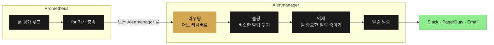
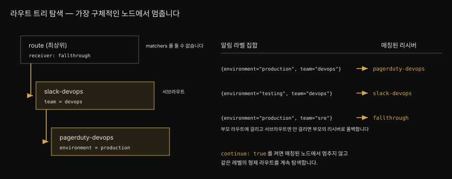

# 5-1. Alertmanager — 라우팅·그룹핑·억제·HA
---


## 핵심 요약

> Prometheus 는 알림을 **보내지 않습니다**. 룰을 끝없이 평가하다가 `for` 기간을 채운 알림을 하나 이상의 Alertmanager 로 넘길 뿐이고 그 알림을 Slack 이나 PagerDuty 로 실어 나르는 일은 전부 Alertmanager 몫입니다. 처음 쓰는 사람이 가장 자주 오해하는 지점입니다.
>
> Alertmanager 의 핵심은 라우팅입니다. 알림 하나가 라우트 트리를 걸어 내려가며 어느 리시버로 갈지 정합니다. 유효한 설정에 반드시 있어야 하는 것은 `route` 와 `receiver` 둘뿐이고 나머지는 전부 선택입니다.
>
> 나머지 기능은 소음을 줄이는 장치입니다. 그룹핑은 같은 종류의 알림 100개를 한 통으로 묶고 억제 규칙은 "데이터센터가 죽은 걸 아는데 그 안의 서버 하나가 죽었다는 알림은 필요 없다" 를 표현하며 시간 구간은 새벽에 warning 으로 사람을 깨우지 않게 합니다.


## 학습 목표

> 이 절을 읽고 나면 아래 다섯 가지를 스스로 해낼 수 있습니다.

1. 라우트 트리에서 알림이 어느 리시버로 가는지 손으로 짚어 낼 수 있고 `continue` 가 그 결과를 어떻게 바꾸는지 말할 수 있습니다.
2. `group_wait`·`group_interval`·`repeat_interval` 셋이 각각 무엇을 통제하는지 구분할 수 있습니다.
3. 억제 규칙의 source 와 target 방향을 헷갈리지 않고 쓸 수 있습니다.
4. `amtool` 로 설정을 검증하고 특정 라벨의 알림이 어디로 갈지 미리 시험할 수 있습니다.
5. Alertmanager 를 HA 로 띄울 때 로드밸런서를 앞에 두면 안 되는 이유를 설명할 수 있습니다.


## 본문 정리

### Prometheus 와 Alertmanager 의 분업

Prometheus 는 알림 룰을 끊임없이 평가하고 알림이 지정된 `for` 기간을 채우면 하나 이상의 Alertmanager 인스턴스로 보냅니다. 거기서부터 알림 정보를 어디로 보낼지 정하는 일은 Alertmanager 가 합니다. Slack 이든 PagerDuty 든 OpsGenie 든 목적지에 알림을 실어 나르는 쪽은 Prometheus 가 아닙니다.



### 라우팅 — 트리를 걸어 내려간다

라우팅이 Alertmanager 의 핵심입니다. 알림 하나를 처리한다는 것은 라우트로 이루어진 트리 구조를 걸으며 어느 리시버로 보낼지 정하는 일입니다. 유효한 Alertmanager 설정 파일에 반드시 있어야 하는 것은 라우트 하나와 리시버 하나뿐이고 나머지는 전부 선택입니다.

가장 단순한 형태의 라우트는 매처 하나 이상과 리시버 하나입니다.

```yaml
- receiver: "default"
  matchers:
    - "environment = production"
```

**매처**는 PromQL 의 라벨 매처와 대체로 같게 동작합니다. 다른 점은 라벨 값에 따옴표를 두르지 않아도 된다는 데 있습니다. 둘러도 유효합니다. `=`, `!=`, `=~`, `!~` 로 각각 일치·불일치·정규식 일치·정규식 불일치를 표현합니다.

작은따옴표는 함정입니다. 큰따옴표(`"value"`)로 감싸는 것은 유효하지만 작은따옴표(`'value'`)로 감싸면 Alertmanager 는 라벨 값에 작은따옴표 문자가 **실제로 들어 있기를** 기대합니다. `environment = 'production'` 이라는 매처는 `{environment="'production'"}` 인 알림에만 걸립니다. 저자는 아예 따옴표를 두르지 않는 편이 읽기 좋다고 적습니다.

오래 쓴 사람에게 익숙한 `match` 와 `match_re` 절은 **폐기 예정**입니다. `matchers` 절이 그 둘을 대체했으니 새 라우트에 쓰지 말고 기존 라우트도 옮기는 편이 좋습니다.

### 서브라우트와 `continue`

Alertmanager 에는 들어오는 모든 알림에 걸리는 최상위 라우트가 하나 있습니다. 이 라우트는 `matchers` 절을 가질 수 없습니다. 나머지 라우트는 전부 이 최상위 라우트의 서브라우트입니다. 앞의 예제가 YAML 리스트 항목이었던 이유가 그것입니다.

Alertmanager 는 리시버를 정할 때 **가능한 한 가장 구체적인 라우트**에 맞추려 합니다. 부모 라우트에는 걸리지만 그 서브라우트 중 어느 것에도 걸리지 않으면 부모 라우트의 리시버로 되돌아갑니다.



여기에 예외가 하나 있습니다. 라우트에 `continue` 를 켜면 알림은 가장 구체적인 서브라우트에서 멈추지 않고 **같은 레벨의 형제 라우트**를 계속 탐색합니다. 이 전파는 위쪽으로도 이어집니다.

```yaml
route:
  receiver: "fallthrough"
  routes:
    - receiver: "slack-devops"
      continue: true
      matchers:
        - "team = devops"
      routes:
        - receiver: "pagerduty-devops"
          matchers:
            - "environment = production"
    - receiver: "default"
      matchers:
        - "environment = production"
        - "namespace != default"
        - "team =~ (devops|sre)"
        - "service !~ ^(api.+)"
```

`pagerduty-devops` 는 `slack-devops` 의 서브라우트인데도, `continue` 를 설정한 지점이 `slack-devops` 이므로 그 형제 라우트를 계속 훑습니다. 알림을 여러 곳에 동시에 보내고 싶을 때(슬랙 메시지와 이메일을 함께 보내는 식) 쓸모가 큽니다.

### 그룹핑 — 100개의 알림을 한 통으로

똑같은 사안으로 알림 100개가 한꺼번에 쏟아지는 경험은 누구에게나 있습니다. Alertmanager 는 라벨을 기준으로 비슷한 알림을 묶어 그 상황을 덜어 줍니다.

그룹핑은 라우팅 트리의 어느 층에서든 일어날 수 있고 라우트마다 다르게 둘 수 있습니다. 최소한 최상위 라우트에는 기본 그룹핑을 두는 편이 좋습니다. `group_by` 를 스스로 정의하지 않은 서브라우트는 가장 가까운 부모의 그룹핑 설정을 그대로 씁니다.

2장에서 kube-prometheus 로 배포한 Alertmanager 의 기본 그룹핑은 `namespace` 라벨 하나입니다. 저자가 실무에서 본 최상위 그룹핑은 알림 이름·대상 서비스·서비스의 환경 조합에 가깝습니다.

```yaml
route:
  receiver: "fallthrough"
  group_by: ["alertname", "service", "environment"]
```

여기에 시간을 다루는 설정 셋이 붙습니다.

`group_wait` 는 알림을 리시버로 실제 발송하기 전에 얼마나 기다릴지 정합니다. 그 사이 같은 그룹에 들어올 알림을 더 모아 발송 횟수를 줄이려는 장치입니다. **기본값은 30초**입니다. 타이머는 그룹의 **첫 알림이 도착한 순간** 시작하고 새 알림이 추가돼도 **초기화되지 않습니다**. 타이머가 끝나면 발송되고 이후 새로 들어온 알림은 다음 `group_interval` 이 지날 때까지 기다립니다.

`group_interval` 은 알림 그룹의 갱신을 얼마나 자주 보낼지 정합니다. 새로 발화한 알림과 해소된 알림이 모두 포함됩니다. **기본값은 5분**입니다.

| 알림 라벨 | 도착 시각 | 발송 시각 |
|-----------|----------|----------|
| `instance="api1"` | 10:00:00 | 10:00:30 |
| `instance="api2"` | 10:00:17 | 10:00:30 |
| `instance="api3"` | 10:00:35 | 10:05:00 |

셋째 알림은 첫 알림으로부터 30초를 조금 넘겨 도착해 초기 `group_wait` 를 놓쳤습니다. 그래서 첫 알림 도착 시각으로부터 5분이 지날 때까지 기다렸다 발송됩니다.

`repeat_interval` 은 아무 변화가 없는데도 알림 그룹을 리시버로 다시 보내는 주기이며 **기본값은 4시간**입니다. 저자는 이 값이 지나치게 공격적이라 알림 피로를 부른다고 보고 최소 24시간으로 둡니다. 그래도 알림이 레이더 아래로 사라지지 않게 하는 기능이라 꺼 두지는 않습니다.

### 시간 구간 — 새벽에 깨우지 않기

2022년에 비교적 최근 추가된 선택 기능입니다. 특정 라우트에서 알림을 받고 싶은 시간대를 정의합니다. 저자의 팀은 warning 등급 알림을 업무 시간에만 받고 한밤중에 온콜 엔지니어를 깨우지 않으려 이 기능을 씁니다.

`mute_time_intervals` 와 `active_time_intervals` 두 설정이 이를 통제합니다. 서로 배타적이지 않아 함께 쓸 수 있지만 보통 한 라우트에 하나만 씁니다. **최상위 라우트에는 설정할 수 없습니다.** 둘 다 없으면 알림은 시간 제한 없이 항상 발송됩니다.

```yaml
route:
  receiver: "fallthrough"
  routes:
    - receiver: "slack-devops"
      continue: true
      matchers:
        - "team = devops"
      active_time_intervals:
        - business-hours

time_intervals:
  - name: business-hours
    time_intervals:
      - weekdays: ["Monday:Friday"]
        times:
          - start_time: 09:00
            end_time: 17:00
        location: "US/Eastern"
```

라우트에 이름을 적는 것만으로는 부족하고 최상위 `time_intervals` 키 아래 같은 이름의 구간을 반드시 정의해야 합니다. 각 구간은 `weekdays`·`days_of_month`·`months`·`years` 와 하루 중 시각을 다루는 `times` 를 조합해 여러 범위를 담습니다. 전부 리스트이고 범위는 콜론(`:`)으로 구분하며 모든 필드가 선택입니다.

`days_of_month` 는 음수로 월말부터 세는 재주가 있습니다. 2월의 `-1` 은 2월 28일(윤년이면 29일)이고 `-3:-1` 은 그 달의 마지막 사흘입니다. `location` 은 IANA 시간대 데이터베이스의 이름이며 `"US/Eastern"`, `"Asia/Kolkata"`, `"Europe/London"` 같은 값을 받습니다. `"Local"` 과 `"UTC"` 도 됩니다.

여기에 사람을 헷갈리게 하는 성질이 하나 있습니다. 라우트에 시간 구간을 걸어도 그 구간 밖에서 **라우트가 통째로 무시되지는 않습니다**. 라우팅 탐색은 평소대로 일어나므로 `continue` 가 없으면 그 노드에서 트리 순회가 끝납니다. 다만 현재 시각이 구간 안이냐 밖이냐에 따라 알림이 발송되지 않을 뿐입니다. 저자의 팀은 업무 시간에 호출을 받아 문제를 해결했는데 그때는 이미 업무 시간이 지나 "Resolved" 알림이 오지 않는 상황에 혼란을 겪었습니다.

### 리시버와 억제 규칙

리시버는 이름 하나와 Slack·PagerDuty·이메일 같은 **노티파이어** 설정 하나 이상으로 이루어집니다. 리시버 하나가 여러 노티파이어를 가질 수 있습니다.

```yaml
receivers:
  - name: "sre"
    slack_configs:
      - channel: "#alerts"
        api_url: "https://hooks.slack.com/services/ZZZZZZZZZZZZZZZ"
    pagerduty_configs:
      - routing_key: "XXXXXXXXXXXXXXX"
```

모든 리시버가 공통으로 갖는 설정은 `send_resolved` 와 `http_config` 둘입니다. `http_config` 는 손댈 일이 거의 없습니다. `send_resolved` 는 기본적으로 켜져 있어 알림이 발화할 때와 해소될 때 모두 알립니다. 리눅스 OOM 킬러가 동작했다는 알림처럼 "일이 일어났다" 만 알면 되고 "더는 안 일어난다" 는 알 필요 없는 경우 `send_resolved: false` 로 무의미한 해소 알림을 막습니다.

**억제 규칙**은 특정 조건에서 알림 발송을 막습니다. 데이터센터 Y 가 네트워크 장애를 겪는다는 알림을 이미 받았다면 그 안의 `server1` 이 연결 문제를 겪는다는 알림은 필요 없습니다.

```yaml
inhibit_rules:
  - source_matchers:
      - severity="critical"
    target_matchers:
      - severity=~"warning|info"
    equal:
      - namespace
      - alertname
```

억제 규칙에서 **source 는 이미 존재하는 알림**이고 **target 은 새로 들어오는 알림**입니다. 위 예제에서 `{namespace="default", alertname="HighCPU", severity="warning"}` 로 들어온 target 알림은 같은 `namespace` 와 `alertname` 을 가진 `severity="critical"` 알림에 의해 억제됩니다. 디스크 사용률 90% 에 warning, 98% 에 critical 을 거는 다단계 임계값에서 흔히 쓰는 방식입니다.

Alertmanager 에는 알림이 자기 자신을 억제하지 못하게 하는 안전장치가 있습니다. 한 알림이 억제 규칙의 target 쪽과 source 쪽에 **모두** 걸리면 억제가 적용되지 않습니다. 애초에 그런 일이 생기지 않도록 매처를 고르는 편이 낫습니다.

억제 규칙은 Alertmanager 파이프라인의 **notify 단계**에서 적용됩니다. 알림이 나가기 전에 두 알림이 모두 도착하기만 하면 억제가 걸립니다. critical 알림이 warning 알림보다 늦게 도착해도 마찬가지입니다.

### `amtool` 로 검증하기

설정은 YAML 이므로 공백을 많이 넣거나 적게 넣어 틀리기 마련입니다. Alertmanager 와 함께 배포되는 `amtool` 이 검증 수단을 줍니다.

```console
$ amtool check config alertmanager.yml
$ amtool config routes --config.file alertmanager.yml
```

`amtool config` 하위 명령은 설정 파일이 로컬에 없어도 됩니다. Alertmanager URL 을 가리키면 거기서 설정을 읽어 옵니다.

```console
$ amtool config routes --alertmanager.url http://localhost:9093
```

특정 라벨을 가진 알림이 어느 라우트로 갈지 미리 시험할 수도 있습니다.

```console
$ amtool config routes test \
  --config.file alertmanager.yml \
  'environment=production team=sre'
fallthrough
```

Prometheus 웹사이트의 [라우팅 트리 편집기](https://prometheus.io/webtools/alerting/routing-tree-editor/)가 같은 일을 더 보기 좋은 웹 화면으로 해 줍니다.

### 템플릿

Prometheus 와 Alertmanager 는 Go 템플릿 엔진에 편의 함수 몇 개를 얹어 씁니다. 알림 룰의 애노테이션에 라벨 값을 끼워 넣어 본 사람이라면 이미 접한 셈입니다.

```yaml
annotations:
  description: Configuration failed to load for {{ $labels.namespace }}/{{ $labels.pod }}.
```

Alertmanager 의 템플릿은 값 몇 개를 치환하는 수준을 넘어섭니다. Slack 메시지 전체나 PagerDuty 인시던트 설명 전체를 템플릿으로 그리므로 반복문과 공백 제어를 쓰게 됩니다.

템플릿 파일은 최상위 `templates` 키 아래 목록으로 지정하며 글롭을 받습니다. `.tmpl` 확장자는 관례일 뿐 필수가 아닙니다.

```yaml
templates:
  - /path/to/my/template.tmpl
  - /other/path/*.tmpl
```

커스텀 템플릿을 지정하지 않으면 Alertmanager 는 내장 기본 템플릿만 씁니다. 가장 많이 쓰이는 내장 템플릿은 `__subject` 이며 Slack 메시지, PagerDuty 인시던트 제목, Discord 메시지 제목의 기본값입니다. 한 줄에 너무 많은 일을 해서 읽기 어렵기로 유명한데, 하는 일은 넷입니다. `define` 으로 이름 붙은 템플릿을 열고 대응하는 `{{ end }}` 로 닫습니다. 발화 중인 알림 개수를 대괄호로 감싸 `[FIRING:4]` 처럼 그립니다. 그룹 라벨 값들을 공백으로 이어 붙여 `[FIRING:4] production api us-east-1` 같은 모양을 만듭니다. 마지막으로 그룹의 모든 알림이 공유하지만 `group_by` 에 명시되지 않은 공통 라벨을 덧붙입니다.

직접 템플릿을 정의하는 일은 Prometheus 설정에서 팀의 사용성을 끌어올리는 가장 값싼 방법입니다. 리시버마다 다른 템플릿을 쓸 수 있으니 팀별 취향도 수용됩니다. 모든 알림에 `description` 애노테이션을 달아 두고 Slack 에는 그것만 보여 주고 싶다면 이렇게 씁니다.

```gotemplate
{{ define "descriptions" }}
{{- range .Alerts.Firing }}
[FIRING] - {{ .Annotations.description }}
{{- end }}
{{- range .Alerts.Resolved }}
[RESOLVED] - {{ .Annotations.description }}
{{- end }}
{{ end }}
```

`{{-` 의 하이픈은 공백 제어 문자입니다. 중괄호 블록의 앞·뒤·양쪽 어디에 두느냐에 따라 앞이나 뒤의 공백(줄바꿈 포함)을 걷어냅니다. 렌더 결과는 `amtool` 로 미리 볼 수 있습니다.

```console
$ amtool template render \
  --template.glob '*.tmpl' \
  --template.text '{{ template "descriptions" . }}' \
  --template.data alert_data.json
[FIRING] - CPU is elevated on api1 for >30m
[FIRING] - CPU is elevated on api3 for >30m
[RESOLVED] - CPU is elevated on api2 for >30m
```

### HA — 로드밸런서를 앞에 두지 마십시오

Prometheus 자신과 달리 Alertmanager 는 고가용성 기능을 내장하고 있어 클러스터로 뜹니다. 가십 프로토콜로 정보를 공유하며 인스턴스를 띄울 때 반복 가능한 `--cluster.peer` 플래그로 피어를 지정합니다. 클러스터링을 끄고 싶으면 `--cluster.listen-address` 를 빈 문자열로 두면 되지만 운영 환경에는 권장하지 않습니다.

가십으로 오가는 정보는 정해져 있습니다. **침묵(silence) 과 어떤 알림 그룹에 이미 알림을 보냈는지 여부**입니다. 한 인스턴스가 특정 알림 그룹의 알림을 리시버로 보내면 다른 인스턴스들에게 그 사실을 알리고 그들은 같은 리시버로 중복 발송하지 않습니다. 가십이 중복 알림을 막는 유일한 장치입니다.

주의할 점은 인스턴스들이 **어떤 알림을 받았는지는 가십하지 않는다**는 사실입니다. 그래서 Prometheus 는 클러스터의 **모든** Alertmanager 인스턴스로 알림을 보내도록 설정해야 하고 앞에 로드밸런서를 두어 일부 인스턴스가 알림을 못 받게 만들면 안 됩니다.

클러스터 크기는 저자 경험상 둘이나 셋을 넘긴 적이 없습니다. etcd 나 Vault, 데이터베이스와 달리 Alertmanager 는 **합의 알고리듬을 쓰지 않으므로** 정족수를 맞출 필요가 없습니다. 하나 이상만 살아 있으면 계속 동작하니 `n-1`, `n-2` 같은 단순한 계산이면 됩니다. 그래서 개수보다 **가용 영역(AZ) 분산**이 중요합니다. 둘이면 서로 다른 두 AZ 에, 셋이면 서로 다른 세 AZ 에 둡니다.


## 심화 학습

**원문 라우팅 표의 셋째 행은 스스로와 모순됩니다.** `continue: true` 와 `default` 라우트를 추가한 확장 설정 다음에 나오는 표는 `{environment="production", team="sre"}` 알림이 `fallthrough` 로 간다고 적습니다. 같은 표의 첫째 행은 `{environment="production", team="devops"}` 가 `pagerduty-devops` 와 **`default`** 두 곳으로 간다고 적습니다. 그런데 `default` 라우트의 매처는 `namespace != default` 와 `service !~ ^(api.+)` 를 포함하고 첫째 행의 알림에는 `namespace` 라벨도 `service` 라벨도 없습니다. 없는 라벨이 이 매처들을 만족한다는 뜻입니다.

그렇다면 셋째 행의 알림도 똑같이 `environment = production` 을 만족하고 `team = sre` 는 `team =~ (devops|sre)` 에 걸리므로 `default` 라우트에 매칭되어야 합니다. 두 행이 동시에 옳을 수 없습니다.

공식 문서가 판정을 내려 줍니다. Alertmanager 는 "없는 라벨과 빈 값을 가진 라벨을 의미상 같은 것으로 취급" 하고 매처의 정규식은 "양쪽 끝이 앵커링" 됩니다. 따라서 라벨이 없으면 `!=` 도 `!~` 도 만족합니다. 셋째 행의 올바른 리시버는 `default` 입니다. 표 앞의 첫 설정(`default` 라우트가 없던 버전) 기준으로는 `fallthrough` 가 맞으니, 설정을 확장하면서 표의 셋째 행만 갱신하지 않은 것으로 보입니다. 이 노트의 SVG 가 `default` 없는 트리를 그린 이유입니다. ([Alertmanager configuration](https://prometheus.io/docs/alerting/latest/configuration/))

**`repeat_interval` 은 생각보다 덜 자주 울립니다.** 문서는 마지막 `group_interval` 이후 새로 발화하거나 해소된 알림이 있으면 반복 알림을 보내지 않는다고 적습니다. 게다가 `repeat_interval` 은 `group_interval` 마다 확인되므로 그 배수가 아니면 다음 배수로 **올림**됩니다. `group_interval: 5m` 에 `repeat_interval: 24h` 를 두면 문제가 없지만 어중간한 값을 넣으면 의도한 시각에 울리지 않습니다.

**`--data.retention` 이 `repeat_interval` 보다 짧으면 그 지점에서 반복됩니다.** 문서가 명시하는 조건인데 저자는 다루지 않습니다. 반복 주기를 24시간으로 늘렸는데 데이터 보존이 그보다 짧으면 의도대로 동작하지 않습니다.

**최상위 라우트가 시간 구간을 못 가진다는 제약은 문서에도 있습니다.** "the root node cannot have any mute times" 라고 적혀 있고 `active_time_intervals` 도 같습니다. 전 조직의 알림을 특정 시간대에 통째로 죽이고 싶다면 최상위 바로 아래에 매처 없는 서브라우트를 하나 두고 거기에 거는 우회가 필요합니다.


## 결정 치트시트

> 소음을 줄이려는데 어느 손잡이를 돌릴지 고르는 표입니다.

| 하고 싶은 일 | 손잡이 | 주의 |
|-------------|--------|------|
| 같은 사안의 알림 여러 개를 한 통으로 | `group_by` | 서브라우트는 가장 가까운 부모의 설정을 상속합니다 |
| 첫 알림 뒤 잠깐 더 모아서 보내기 | `group_wait` (기본 30초) | 타이머는 첫 알림에서 시작하고 초기화되지 않습니다 |
| 그룹에 변화가 생겼을 때 갱신 주기 | `group_interval` (기본 5분) | 발화와 해소를 모두 포함합니다 |
| 아무 변화 없이 계속 울리게 | `repeat_interval` (기본 4시간) | 저자는 24시간 이상 권장 · `group_interval` 의 배수로 |
| 한 알림을 여러 곳으로 | `continue: true` | 형제 라우트를 계속 탐색합니다 |
| 상위 장애가 있을 때 하위 알림 죽이기 | `inhibit_rules` | source 는 기존 알림, target 은 들어오는 알림 |
| 업무 시간에만 알림 받기 | `active_time_intervals` | 최상위 라우트에는 못 겁니다 · 해소 알림도 함께 막힙니다 |
| 해소 알림이 필요 없을 때 | `send_resolved: false` | 리시버 단위 설정입니다 |

| 검증하고 싶은 것 | 명령 |
|-----------------|------|
| 설정 파일 문법 | `amtool check config alertmanager.yml` |
| 라우트 계층 구조 | `amtool config routes --config.file alertmanager.yml` |
| 이 라벨의 알림이 갈 곳 | `amtool config routes test --config.file alertmanager.yml 'environment=production team=sre'` |
| 템플릿 렌더 결과 | `amtool template render --template.glob '*.tmpl' --template.text '...' --template.data alert_data.json` |


## Spring 앱 개발 관점

**그룹핑과 라우팅은 결국 라벨 설계 문제입니다.** 저자가 권하는 최상위 그룹핑은 `["alertname", "service", "environment"]` 인데, 이 라벨이 알림에 붙어 있지 않으면 그룹핑도 라우팅도 할 수 없습니다. Spring 앱의 메트릭에 공통 태그를 심어 두면 그 라벨이 모든 시계열에 따라붙습니다.

```java
@Bean
MeterRegistryCustomizer<MeterRegistry> commonTags() {
    return registry -> registry.config()
            .commonTags("service", "order-api", "environment", "prod");
}
```

Micrometer 의 `commonTags` 는 해당 레지스트리가 내보내는 모든 메터에 태그를 붙이므로 `/actuator/prometheus` 로 나가는 시계열 전부에 `service` 와 `environment` 가 실립니다. 다만 태그 하나가 카디널리티를 곱하므로 값이 유한한 것만 넣습니다. 사용자 ID 나 요청 경로 원본은 넣지 않습니다.

**`team` 같은 조직 라벨은 메트릭이 아니라 알림 룰에 붙이는 편이 낫습니다.** 메트릭에 팀 이름을 실으면 팀이 바뀔 때마다 시계열이 갈라집니다. 알림 룰의 `labels` 블록은 발화하는 알림에만 라벨을 얹으므로 조직 개편이 저장소를 오염시키지 않습니다.

```yaml
- alert: HighApiErrorRate
  expr: ...
  for: 15m
  labels:
    severity: warning
    team: sre
```

**배포 중 쏟아지는 알림은 억제 규칙으로 잡습니다.** 롤링 업데이트 도중 파드가 사라지며 `up == 0` 이 뜨고 그와 함께 오류율 알림이 함께 발화하는 상황이 흔합니다. 배포 진행을 알리는 알림을 source 로, 오류율·지연 알림을 target 으로 두고 `equal: [service]` 로 묶으면 같은 서비스의 하위 알림만 조용해집니다. 억제는 notify 단계에서 적용되므로 두 알림이 발송 전에 도착하기만 하면 순서는 상관없습니다.

**`send_resolved: false` 가 어울리는 Spring 알림도 있습니다.** 컨텍스트 로딩 실패나 마이그레이션 실패처럼 한 번 일어났다는 사실만 알면 되는 사건이 그렇습니다. 반대로 오류율·지연 같은 지속 상태 알림은 해소 알림이 있어야 사람이 안심합니다.


## 면접 대비

**Q. Prometheus 는 Slack 으로 알림을 보냅니까?**
보내지 않습니다. Prometheus 는 알림 룰을 평가해 `for` 기간을 채운 알림을 Alertmanager 로 넘길 뿐입니다. 목적지로 실어 나르는 일은 Alertmanager 의 리시버가 합니다. 둘을 분리한 덕에 알림 발화 로직과 발송 정책을 따로 바꿀 수 있습니다.

**Q. `group_wait` 와 `group_interval` 과 `repeat_interval` 은 각각 무엇입니까?**
`group_wait` 는 그룹의 첫 알림이 도착한 뒤 발송까지 기다리는 시간이고 기본 30초입니다. 그 사이 들어온 알림을 함께 묶습니다. `group_interval` 은 그룹에 변화가 생겼을 때 갱신을 보내는 주기이고 기본 5분입니다. `repeat_interval` 은 아무 변화가 없어도 다시 알리는 주기이고 기본 4시간입니다.

**Q. `continue: true` 는 무엇을 바꿉니까?**
기본적으로 알림은 가장 구체적으로 일치하는 라우트에서 멈춥니다. `continue` 를 켜면 그 노드에서 멈추지 않고 같은 레벨의 형제 라우트를 계속 탐색합니다. 한 알림을 슬랙과 이메일 양쪽으로 보내는 식으로 씁니다.

**Q. 억제 규칙의 source 와 target 중 어느 쪽이 새 알림입니까?**
target 이 새로 들어오는 알림이고 source 가 이미 존재하는 알림입니다. source 가 살아 있으면 target 이 억제됩니다. 한 알림이 양쪽 매처에 모두 걸리면 Alertmanager 가 자기 억제를 막아 규칙을 적용하지 않습니다.

**Q. Alertmanager 를 세 대 띄우고 앞에 로드밸런서를 두면 어떻게 됩니까?**
알림을 받은 인스턴스만 그 알림을 알게 됩니다. Alertmanager 는 침묵과 "이미 알림을 보냈는지" 는 가십하지만 **어떤 알림을 받았는지는 가십하지 않기** 때문입니다. Prometheus 가 모든 인스턴스로 알림을 보내야 하므로 로드밸런서를 앞에 두면 안 됩니다.

**Q. Alertmanager 는 몇 대가 적당합니까?**
합의 알고리듬을 쓰지 않으므로 정족수 개념이 없고 하나만 살아 있어도 동작합니다. 둘이나 셋이면 충분하고 개수보다 서로 다른 가용 영역에 흩어 두는 편이 중요합니다.

**Q. `match` 와 `matchers` 중 무엇을 씁니까?**
`matchers` 입니다. `match` 와 `match_re` 는 폐기 예정이며 새 라우트에 쓰지 않고 기존 라우트도 옮기는 편이 좋습니다.


## 핵심 개념 체크리스트

- [ ] Prometheus 와 Alertmanager 의 책임 경계를 말할 수 있는가?
- [ ] 유효한 Alertmanager 설정에 최소한 무엇이 있어야 하는지 아는가?
- [ ] 매처에서 작은따옴표가 큰따옴표와 다르게 동작하는 이유를 아는가?
- [ ] 최상위 라우트가 `matchers` 를 가질 수 없다는 사실을 아는가?
- [ ] 서브라우트에 걸리지 않을 때 어느 리시버로 가는지 아는가?
- [ ] `continue` 가 형제 라우트 탐색을 어떻게 바꾸는지 설명할 수 있는가?
- [ ] `group_wait` 타이머가 언제 시작하고 초기화되지 않는다는 사실을 아는가?
- [ ] `group_interval` 과 `repeat_interval` 의 기본값을 아는가?
- [ ] 시간 구간을 최상위 라우트에 걸 수 없다는 제약을 아는가?
- [ ] 시간 구간 밖에서도 라우팅 탐색이 계속된다는 사실과 그 부작용을 아는가?
- [ ] 억제 규칙의 source 와 target 방향을 헷갈리지 않는가?
- [ ] 억제가 파이프라인의 어느 단계에서 적용되는지 아는가?
- [ ] `amtool config routes test` 로 무엇을 확인할 수 있는지 아는가?
- [ ] Alertmanager 가 가십하는 정보와 하지 않는 정보를 구분할 수 있는가?
- [ ] Alertmanager 앞에 로드밸런서를 두면 안 되는 이유를 설명할 수 있는가?


## 참고 자료

- 원본: *Mastering Prometheus* (Packt, ISBN 9781805125662) 5장 앞부분 — Alertmanager configuration and routing · Alertmanager templating · Highly available (HA) alerting. 예제 코드는 [PacktPublishing/Mastering-Prometheus](https://github.com/PacktPublishing/Mastering-Prometheus) 에 있고 `amtool` v0.25.0, `promtool` v2.46.0 이 필요합니다.
- [Alertmanager — Configuration](https://prometheus.io/docs/alerting/latest/configuration/) (`route` · `inhibit_rules` · `time_intervals`) · [Alerting overview](https://prometheus.io/docs/alerting/latest/overview/)
- [라우팅 트리 편집기](https://prometheus.io/webtools/alerting/routing-tree-editor/)
- 관련 노트: [README (책 MOC)](README.md) · [05-02. 견고한 알림과 룰 단위 테스트](05-02.견고한%20알림과%20룰%20단위%20테스트.md) · [01-04. SLO와 알림](../../01_Foundations/01-04.SLO와%20알림%20—%20Error%20Budget,%20Burn%20Rate.md)
